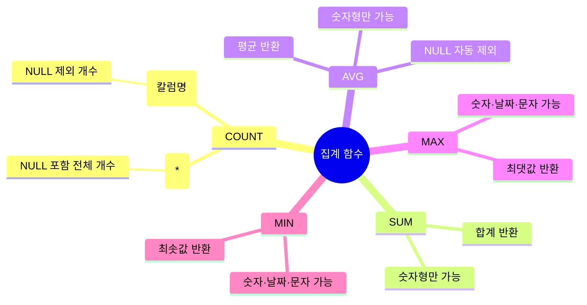
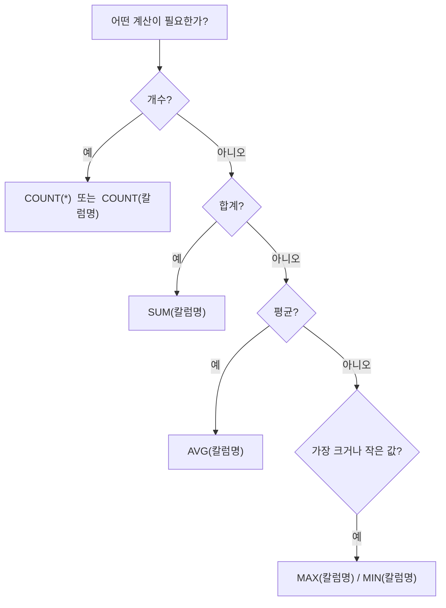

# 5-1 집계 함수 (Aggregate Function)


---

## 1부. 이론

### 1-1. 집계 함수란?

집계 함수(Aggregate Function)는 **여러 행(row)의 값을 하나의 결과값으로 계산해 주는 함수**이다.

> 쉽게 말해, "이 열의 합계가 얼마야?", "제일 큰 값이 뭐야?" 같은 질문에 답해주는 기능이다.
{: .prompt-tip }

엑셀을 써봤다면 이미 익숙한 개념이다.

| 엑셀 함수 | SQL 집계 함수 | 하는 일 |
|---|---|---|
| `=COUNT(A1:A10)` | `COUNT()` | 행(값)의 개수를 셈 |
| `=SUM(A1:A10)` | `SUM()` | 합계를 구함 |
| `=AVERAGE(A1:A10)` | `AVG()` | 평균을 구함 |
| `=MAX(A1:A10)` | `MAX()` | 최댓값을 구함 |
| `=MIN(A1:A10)` | `MIN()` | 최솟값을 구함 |

---

### 1-2. 집계 함수의 기본 구조

```sql
SELECT 집계함수(칼럼명)
FROM 테이블명
WHERE 조건;   -- (선택 사항)
```

집계 함수는 항상 `SELECT` 절에 쓰고, `WHERE`로 조건을 먼저 필터링한 다음 계산한다.


---

### 1-3. 집계 함수 5가지 상세 설명

#### ① COUNT() — 개수 세기

행(row)의 개수를 셀 때 사용한다.

```sql
COUNT(*)           -- NULL 포함 전체 행 수
COUNT(칼럼명)      -- 해당 칼럼에서 NULL 제외 후 개수
```

> `COUNT(*)`는 행 자체의 수를 세고, `COUNT(칼럼명)`은 그 칼럼에 실제 값이 있는 행만 셈.  
> 값이 없는 칸(NULL)은 `COUNT(칼럼명)`에서 제외된다.
{: .prompt-warning }

---

#### ② SUM() — 합계

숫자형 칼럼의 합을 구할 때 사용한다.

```sql
SUM(칼럼명)
```

문자형(VARCHAR)에는 사용할 수 없다. 숫자 칼럼에만 쓴다.

---

#### ③ AVG() — 평균

숫자형 칼럼의 평균을 구할 때 사용한다.

```sql
AVG(칼럼명)
```

AVG는 NULL 값을 자동으로 제외하고 평균을 계산한다.

> 만약 10명 중 2명의 값이 NULL이면, AVG는 8명의 평균만 구한다. 전체 10명 기준 평균이 필요하다면 NULL을 0으로 처리해야 함.
{: .prompt-info }

---

#### ④ MAX() — 최댓값

칼럼에서 가장 큰 값을 찾을 때 사용한다.

```sql
MAX(칼럼명)
```

숫자뿐 아니라 날짜나 문자열에도 사용 가능하다.  
날짜는 "가장 최근 날짜", 문자열은 "알파벳/가나다 순으로 마지막 값"을 반환한다.

---

#### ⑤ MIN() — 최솟값

칼럼에서 가장 작은 값을 찾을 때 사용한다.

```sql
MIN(칼럼명)
```

MAX와 동일한 방식으로 동작하며, 반대 방향으로 값을 찾는다.

---

### 1-4. 집계 함수 한눈에 보기



---

### 1-5. 별칭(AS) 함께 쓰기

집계 함수 결과에는 보통 `AS`로 칼럼 이름을 붙여준다.  
붙이지 않으면 결과 칼럼명이 `COUNT(*)` 같이 길어져서 읽기 불편하다.

```sql
SELECT COUNT(*) AS 총거래수
FROM transactions;
```

---

## 2부. 실습

### 2-1. DB와 테이블 만들기

> 아래 SQL을 MySQL 워크벤치에서 순서대로 실행한다.
{: .prompt-tip }

```sql
-- 새 데이터베이스 생성
CREATE DATABASE bank_db;

-- 해당 DB로 진입
USE bank_db;
```

```sql
-- 거래 내역 테이블 생성
CREATE TABLE transactions (
  id       INT,
  partner  VARCHAR(30),
  type     VARCHAR(10),
  amount   DECIMAL(10, 2),
  tdate    DATE
);
```

칼럼 설명:

| 칼럼명 | 자료형 | 의미 |
|---|---|---|
| `id` | INT | 거래 번호 |
| `partner` | VARCHAR(30) | 거래 상대방 이름 |
| `type` | VARCHAR(10) | 거래 유형 (`입금` 또는 `출금`) |
| `amount` | DECIMAL(10,2) | 거래 금액 (소수점 2자리까지) |
| `tdate` | DATE | 거래 날짜 |

---

### 2-2. 데이터 넣기

```sql
INSERT INTO transactions VALUES (1,  '구글',   '입금', 500000.00, '2026-01-05');
INSERT INTO transactions VALUES (2,  '쿠팡',   '출금', 120000.00, '2026-01-08');
INSERT INTO transactions VALUES (3,  '아마존', '입금', 350000.00, '2026-01-10');
INSERT INTO transactions VALUES (4,  '구글',   '입금', 200000.00, '2026-01-15');
INSERT INTO transactions VALUES (5,  '페이팔', '출금',  80000.00, '2026-01-20');
INSERT INTO transactions VALUES (6,  '쿠팡',   '출금', 200000.00, '2026-02-03');
INSERT INTO transactions VALUES (7,  '아마존', '출금',  50000.00, '2026-02-07');
INSERT INTO transactions VALUES (8,  '페이팔', '입금', 430000.00, '2026-02-11');
INSERT INTO transactions VALUES (9,  '구글',   '입금', 320000.00, '2026-02-18');
INSERT INTO transactions VALUES (10, '쿠팡',   '출금',  90000.00, '2026-02-25');
```

전체 확인:

```sql
SELECT * FROM transactions;
```

---

### 2-3. COUNT — 거래 횟수 세기

> 이 절에서는 5가지 조건 유형으로 `COUNT`를 연습한다.
>
> | 패턴 | 사용 연산자 | 예시 |
> |---|---|---|
> | ① 기본 | (없음) 또는 `=` | `WHERE type = '입금'` |
> | ② 비교 | `>`, `>=`, `<`, `<=` | `WHERE amount >= 100000` |
> | ③ 범위 | `BETWEEN A AND B` | `WHERE tdate BETWEEN ...` |
> | ④ 다중값 | `IN (값1, 값2)` | `WHERE partner IN (...)` |
> | ⑤ 결합 | `AND` | `WHERE A = 'x' AND B = 'y'` |
{: .prompt-tip }

---

#### 패턴 ① 기본 — `=` 조건으로 세기

**전체 거래가 총 몇 건인지** 세어본다.

```sql
SELECT COUNT(*) AS 총거래수
FROM transactions;
```

결과: `10`

---

**구글과 거래한 횟수**만 세어본다.

```sql
SELECT COUNT(*) AS 구글거래수
FROM transactions
WHERE partner = '구글';
```

결과: `3`

---

**입금 거래 횟수**만 세어본다.

```sql
SELECT COUNT(*) AS 입금건수
FROM transactions
WHERE type = '입금';
```

---

**출금 거래 횟수**도 세어본다.

```sql
SELECT COUNT(*) AS 출금건수
FROM transactions
WHERE type = '출금';
```

---

**쿠팡과의 거래 횟수**를 센다.

```sql
SELECT COUNT(*) AS 쿠팡거래수
FROM transactions
WHERE partner = '쿠팡';
```

---

**아마존과의 거래 횟수**도 센다.

```sql
SELECT COUNT(*) AS 아마존거래수
FROM transactions
WHERE partner = '아마존';
```

---

**페이팔과의 거래 횟수**를 센다.

```sql
SELECT COUNT(*) AS 페이팔거래수
FROM transactions
WHERE partner = '페이팔';
```

---

#### 패턴 ② 비교 연산자 — `>`, `>=`, `<`, `<=`

**100,000원 이상인 거래 건수**를 센다.

```sql
SELECT COUNT(*) AS 큰거래건수
FROM transactions
WHERE amount >= 100000;
```

---

**100,000원 미만인 거래 건수**를 센다.

```sql
SELECT COUNT(*) AS 소액거래건수
FROM transactions
WHERE amount < 100000;
```

---

**300,000원을 초과하는 거래 건수**를 센다. (`>` 사용)

```sql
SELECT COUNT(*) AS 고액거래건수
FROM transactions
WHERE amount > 300000;
```

---

#### 패턴 ③ 범위 — `BETWEEN A AND B`

`BETWEEN A AND B`는 **A 이상 B 이하** 범위를 의미한다.

**1월 거래 건수**를 센다.

```sql
SELECT COUNT(*) AS 일월거래수
FROM transactions
WHERE tdate BETWEEN '2026-01-01' AND '2026-01-31';
```

---

**2월 거래 건수**를 센다.

```sql
SELECT COUNT(*) AS 이월거래수
FROM transactions
WHERE tdate BETWEEN '2026-02-01' AND '2026-02-28';
```

---

**100,000원 ~ 300,000원 사이 거래 건수**를 센다.

```sql
SELECT COUNT(*) AS 중간금액거래수
FROM transactions
WHERE amount BETWEEN 100000 AND 300000;
```

---

#### 패턴 ④ 다중값 — `IN (값1, 값2, ...)`

`IN`은 **OR을 짧게 줄인 표현**이다.  
`partner = '구글' OR partner = '아마존'` ≡ `partner IN ('구글','아마존')`

**구글 또는 아마존과의 거래 건수**를 센다.

```sql
SELECT COUNT(*) AS 거래건수
FROM transactions
WHERE partner IN ('구글', '아마존');
```

---

**쿠팡 또는 페이팔과의 거래 건수**도 센다.

```sql
SELECT COUNT(*) AS 거래건수
FROM transactions
WHERE partner IN ('쿠팡', '페이팔');
```

---

#### 패턴 ⑤ 결합 — `AND`로 조건 두 개 묶기

`AND`를 쓰면 **두 조건이 모두 참인 행**만 모아서 집계한다.

**구글과의 입금 거래 건수**를 센다.

```sql
SELECT COUNT(*) AS 구글입금건수
FROM transactions
WHERE partner = '구글' AND type = '입금';
```

---

**쿠팡과의 출금 거래 건수**를 센다.

```sql
SELECT COUNT(*) AS 쿠팡출금건수
FROM transactions
WHERE partner = '쿠팡' AND type = '출금';
```

---

**1월의 입금 거래 건수**를 센다. (`BETWEEN` + `AND` 조합)

```sql
SELECT COUNT(*) AS 일월입금건수
FROM transactions
WHERE tdate BETWEEN '2026-01-01' AND '2026-01-31'
  AND type = '입금';
```

---

### 2-4. SUM — 금액 합계 구하기

> 동일한 5가지 패턴(① 기본 / ② 비교 / ③ 범위 / ④ 다중값 / ⑤ 결합)을 `SUM`에도 적용해 본다.
{: .prompt-tip }

---

#### 패턴 ① 기본 — `=` 조건으로 합계 구하기

**모든 거래 금액의 합계**를 구한다.

```sql
SELECT SUM(amount) AS 총금액
FROM transactions;
```

---

**출금 거래의 총합**만 구한다.

```sql
SELECT SUM(amount) AS 총출금액
FROM transactions
WHERE type = '출금';
```

---

**아마존과 거래한 금액의 합계**를 구한다.

```sql
SELECT SUM(amount) AS 아마존합계
FROM transactions
WHERE partner = '아마존';
```

---

**입금 거래의 총합**을 구한다.

```sql
SELECT SUM(amount) AS 총입금액
FROM transactions
WHERE type = '입금';
```

---

**구글과 거래한 금액의 합계**를 구한다.

```sql
SELECT SUM(amount) AS 구글합계
FROM transactions
WHERE partner = '구글';
```

---

**쿠팡과 거래한 금액의 합계**를 구한다.

```sql
SELECT SUM(amount) AS 쿠팡합계
FROM transactions
WHERE partner = '쿠팡';
```

---

**페이팔과 거래한 금액의 합계**를 구한다.

```sql
SELECT SUM(amount) AS 페이팔합계
FROM transactions
WHERE partner = '페이팔';
```

---

#### 패턴 ② 비교 연산자 — `>=`, `<`로 합계 구하기

**100,000원 이상인 거래의 합계**를 구한다.

```sql
SELECT SUM(amount) AS 큰거래합계
FROM transactions
WHERE amount >= 100000;
```

---

**100,000원 미만인 거래의 합계**를 구한다.

```sql
SELECT SUM(amount) AS 소액거래합계
FROM transactions
WHERE amount < 100000;
```

---

#### 패턴 ③ 범위 — `BETWEEN`으로 합계 구하기

**1월 거래 금액의 합계**를 구한다.

```sql
SELECT SUM(amount) AS 일월합계
FROM transactions
WHERE tdate BETWEEN '2026-01-01' AND '2026-01-31';
```

---

**2월 거래 금액의 합계**를 구한다.

```sql
SELECT SUM(amount) AS 이월합계
FROM transactions
WHERE tdate BETWEEN '2026-02-01' AND '2026-02-28';
```

---

**100,000원 ~ 300,000원 사이 거래의 합계**를 구한다.

```sql
SELECT SUM(amount) AS 중간금액합계
FROM transactions
WHERE amount BETWEEN 100000 AND 300000;
```

---

#### 패턴 ④ 다중값 — `IN`으로 합계 구하기

**구글 또는 아마존의 거래 금액 합계**를 구한다.

```sql
SELECT SUM(amount) AS 합계
FROM transactions
WHERE partner IN ('구글', '아마존');
```

---

**쿠팡 또는 페이팔의 거래 금액 합계**를 구한다.

```sql
SELECT SUM(amount) AS 합계
FROM transactions
WHERE partner IN ('쿠팡', '페이팔');
```

---

#### 패턴 ⑤ 결합 — `AND`로 두 조건을 만족하는 합계 구하기

**1월의 입금 거래 합계**를 구한다.

```sql
SELECT SUM(amount) AS 일월입금합계
FROM transactions
WHERE tdate BETWEEN '2026-01-01' AND '2026-01-31'
  AND type = '입금';
```

---

**2월의 출금 거래 합계**를 구한다.

```sql
SELECT SUM(amount) AS 이월출금합계
FROM transactions
WHERE tdate BETWEEN '2026-02-01' AND '2026-02-28'
  AND type = '출금';
```

---

**구글의 입금 거래 합계**를 구한다.

```sql
SELECT SUM(amount) AS 구글입금합계
FROM transactions
WHERE partner = '구글' AND type = '입금';
```

---

**100,000원 이상인 출금 거래 합계**를 구한다.

```sql
SELECT SUM(amount) AS 큰출금합계
FROM transactions
WHERE amount >= 100000 AND type = '출금';
```

---

### 2-5. AVG — 평균 구하기

> 동일한 5가지 패턴(① 기본 / ② 비교 / ③ 범위 / ④ 다중값 / ⑤ 결합)을 `AVG`에도 적용해 본다.
{: .prompt-tip }

---

#### 패턴 ① 기본 — `=` 조건으로 평균 구하기

**전체 거래 금액의 평균**을 구한다.

```sql
SELECT AVG(amount) AS 평균거래금액
FROM transactions;
```

---

**입금 거래의 평균 금액**만 구한다.

```sql
SELECT AVG(amount) AS 입금평균
FROM transactions
WHERE type = '입금';
```

---

**출금 거래의 평균 금액**도 구한다.

```sql
SELECT AVG(amount) AS 출금평균
FROM transactions
WHERE type = '출금';
```

---

**쿠팡과의 거래 평균 금액**을 구한다.

```sql
SELECT AVG(amount) AS 쿠팡평균
FROM transactions
WHERE partner = '쿠팡';
```

---

#### 패턴 ② 비교 연산자 — `>=`, `<`로 평균 구하기

**100,000원 이상 거래의 평균 금액**을 구한다.

```sql
SELECT AVG(amount) AS 큰거래평균
FROM transactions
WHERE amount >= 100000;
```

---

**100,000원 미만 거래의 평균 금액**을 구한다.

```sql
SELECT AVG(amount) AS 소액거래평균
FROM transactions
WHERE amount < 100000;
```

---

#### 패턴 ③ 범위 — `BETWEEN`으로 평균 구하기

**1월 거래의 평균 금액**을 구한다.

```sql
SELECT AVG(amount) AS 일월평균
FROM transactions
WHERE tdate BETWEEN '2026-01-01' AND '2026-01-31';
```

---

**2월 거래의 평균 금액**을 구한다.

```sql
SELECT AVG(amount) AS 이월평균
FROM transactions
WHERE tdate BETWEEN '2026-02-01' AND '2026-02-28';
```

---

#### 패턴 ④ 다중값 — `IN`으로 평균 구하기

**구글 또는 아마존 거래의 평균 금액**을 구한다.

```sql
SELECT AVG(amount) AS 평균
FROM transactions
WHERE partner IN ('구글', '아마존');
```

---

#### 패턴 ⑤ 결합 — `AND`로 평균 구하기

**1월 출금 거래의 평균 금액**을 구한다.

```sql
SELECT AVG(amount) AS 일월출금평균
FROM transactions
WHERE tdate BETWEEN '2026-01-01' AND '2026-01-31'
  AND type = '출금';
```

---

**구글의 입금 거래 평균**을 구한다.

```sql
SELECT AVG(amount) AS 구글입금평균
FROM transactions
WHERE partner = '구글' AND type = '입금';
```

---

### 2-6. MAX / MIN — 최댓값·최솟값 구하기

> 동일한 5가지 패턴(① 기본 / ② 비교 / ③ 범위 / ④ 다중값 / ⑤ 결합)을 `MAX` · `MIN`에도 적용해 본다.
{: .prompt-tip }

---

#### 패턴 ① 기본 — `=` 조건으로 최대/최소 구하기

**가장 큰 거래 금액**과 **가장 작은 거래 금액**을 한 번에 구한다.

```sql
SELECT MAX(amount) AS 최대금액,
       MIN(amount) AS 최소금액
FROM transactions;
```

---

**페이팔과의 거래 중** 최댓값과 최솟값을 구한다.

```sql
SELECT MAX(amount) AS 페이팔최대,
       MIN(amount) AS 페이팔최소
FROM transactions
WHERE partner = '페이팔';
```

---

**가장 최근 거래 날짜**와 **가장 오래된 거래 날짜**를 구한다.  
날짜 칼럼에도 MAX/MIN이 사용 가능하다.

```sql
SELECT MAX(tdate) AS 최근거래일,
       MIN(tdate) AS 첫거래일
FROM transactions;
```

---

**입금 거래 중 최댓값과 최솟값**을 구한다.

```sql
SELECT MAX(amount) AS 입금최대,
       MIN(amount) AS 입금최소
FROM transactions
WHERE type = '입금';
```

---

**출금 거래 중 최댓값과 최솟값**을 구한다.

```sql
SELECT MAX(amount) AS 출금최대,
       MIN(amount) AS 출금최소
FROM transactions
WHERE type = '출금';
```

---

**구글 거래 중 가장 큰 거래 금액**을 구한다.

```sql
SELECT MAX(amount) AS 구글최대거래
FROM transactions
WHERE partner = '구글';
```

---

**가장 빠른 입금 날짜**와 **가장 늦은 출금 날짜**를 구한다.

```sql
SELECT MIN(tdate) AS 첫입금일
FROM transactions
WHERE type = '입금';

SELECT MAX(tdate) AS 마지막출금일
FROM transactions
WHERE type = '출금';
```

---

#### 패턴 ② 비교 연산자 — `>=`, `<`로 최대/최소 구하기

**100,000원 이상 거래 중 최댓값·최솟값**을 구한다.

```sql
SELECT MAX(amount) AS 큰거래최대,
       MIN(amount) AS 큰거래최소
FROM transactions
WHERE amount >= 100000;
```

---

**100,000원 미만 거래 중 최댓값·최솟값**을 구한다.

```sql
SELECT MAX(amount) AS 소액최대,
       MIN(amount) AS 소액최소
FROM transactions
WHERE amount < 100000;
```

---

#### 패턴 ③ 범위 — `BETWEEN`으로 최대/최소 구하기

**1월 중 가장 큰 거래와 가장 작은 거래**를 구한다.

```sql
SELECT MAX(amount) AS 일월최대,
       MIN(amount) AS 일월최소
FROM transactions
WHERE tdate BETWEEN '2026-01-01' AND '2026-01-31';
```

---

**2월 중 가장 큰 거래와 가장 작은 거래**를 구한다.

```sql
SELECT MAX(amount) AS 이월최대,
       MIN(amount) AS 이월최소
FROM transactions
WHERE tdate BETWEEN '2026-02-01' AND '2026-02-28';
```

---

#### 패턴 ④ 다중값 — `IN`으로 최대/최소 구하기

**구글 또는 아마존 거래 중 최대 금액**을 구한다.

```sql
SELECT MAX(amount) AS 최대
FROM transactions
WHERE partner IN ('구글', '아마존');
```

---

**쿠팡 또는 페이팔 거래 중 최소 금액**을 구한다.

```sql
SELECT MIN(amount) AS 최소
FROM transactions
WHERE partner IN ('쿠팡', '페이팔');
```

---

#### 패턴 ⑤ 결합 — `AND`로 최대/최소 구하기

**구글의 입금 거래 중 최댓값**을 구한다.

```sql
SELECT MAX(amount) AS 구글입금최대
FROM transactions
WHERE partner = '구글' AND type = '입금';
```

---

**1월 출금 거래 중 최댓값과 최솟값**을 구한다.

```sql
SELECT MAX(amount) AS 일월출금최대,
       MIN(amount) AS 일월출금최소
FROM transactions
WHERE tdate BETWEEN '2026-01-01' AND '2026-01-31'
  AND type = '출금';
```

---

### 2-7. 여러 집계 함수 한 번에 쓰기

집계 함수는 한 `SELECT`에 여러 개를 동시에 쓸 수 있다.

```sql
SELECT
    COUNT(*)         AS 총거래수,
    SUM(amount)      AS 총금액,
    AVG(amount)      AS 평균금액,
    MAX(amount)      AS 최대금액,
    MIN(amount)      AS 최소금액
FROM transactions;
```

> 결과 한 줄에 원하는 통계가 모두 나온다. 리포트나 대시보드를 만들 때 많이 쓰는 패턴이다.
{: .prompt-tip }

---

**입금 거래에 대한 모든 통계**를 한 번에 구한다.

```sql
SELECT
    COUNT(*)         AS 입금건수,
    SUM(amount)      AS 입금총액,
    AVG(amount)      AS 입금평균,
    MAX(amount)      AS 입금최대,
    MIN(amount)      AS 입금최소
FROM transactions
WHERE type = '입금';
```

---

**출금 거래에 대한 모든 통계**를 한 번에 구한다.

```sql
SELECT
    COUNT(*)         AS 출금건수,
    SUM(amount)      AS 출금총액,
    AVG(amount)      AS 출금평균,
    MAX(amount)      AS 출금최대,
    MIN(amount)      AS 출금최소
FROM transactions
WHERE type = '출금';
```

---

**쿠팡과의 거래에 대한 모든 통계**를 구한다.

```sql
SELECT
    COUNT(*)         AS 쿠팡거래수,
    SUM(amount)      AS 쿠팡총액,
    AVG(amount)      AS 쿠팡평균,
    MAX(amount)      AS 쿠팡최대,
    MIN(amount)      AS 쿠팡최소
FROM transactions
WHERE partner = '쿠팡';
```

---

**1월 거래에 대한 모든 통계**를 구한다. (`BETWEEN`)

```sql
SELECT
    COUNT(*)         AS 일월거래수,
    SUM(amount)      AS 일월총액,
    AVG(amount)      AS 일월평균,
    MAX(amount)      AS 일월최대,
    MIN(amount)      AS 일월최소
FROM transactions
WHERE tdate BETWEEN '2026-01-01' AND '2026-01-31';
```

---

**구글 또는 아마존의 모든 통계**를 구한다. (`IN`)

```sql
SELECT
    COUNT(*)         AS 거래수,
    SUM(amount)      AS 총액,
    AVG(amount)      AS 평균,
    MAX(amount)      AS 최대,
    MIN(amount)      AS 최소
FROM transactions
WHERE partner IN ('구글', '아마존');
```

---

**100,000원 이상인 거래의 모든 통계**를 구한다. (`>=`)

```sql
SELECT
    COUNT(*)         AS 거래수,
    SUM(amount)      AS 총액,
    AVG(amount)      AS 평균,
    MAX(amount)      AS 최대,
    MIN(amount)      AS 최소
FROM transactions
WHERE amount >= 100000;
```

---

**1월 입금 거래의 모든 통계**를 구한다. (`BETWEEN` + `AND`)

```sql
SELECT
    COUNT(*)         AS 거래수,
    SUM(amount)      AS 총액,
    AVG(amount)      AS 평균,
    MAX(amount)      AS 최대,
    MIN(amount)      AS 최소
FROM transactions
WHERE tdate BETWEEN '2026-01-01' AND '2026-01-31'
  AND type = '입금';
```

---

### 2-8. DISTINCT — 중복 없이 목록 보기

집계 함수는 아니지만, 함께 자주 쓰이는 키워드이다.  
`DISTINCT`는 **중복된 값을 제거하고 고유한 값만** 보여준다.

**거래 상대방 목록** (중복 없이):

```sql
SELECT DISTINCT partner
FROM transactions;
```

**고유한 거래 상대방이 몇 명인지** 세기:

```sql
SELECT COUNT(DISTINCT partner) AS 거래처수
FROM transactions;
```

---

**거래 유형 종류 보기** (입금, 출금이 몇 종류인지):

```sql
SELECT DISTINCT type
FROM transactions;
```

---

**입금 거래를 한 거래처가 몇 군데인지** 센다.

```sql
SELECT COUNT(DISTINCT partner) AS 입금거래처수
FROM transactions
WHERE type = '입금';
```

---

**거래가 발생한 서로 다른 날짜의 수**를 센다.

```sql
SELECT COUNT(DISTINCT tdate) AS 거래일수
FROM transactions;
```

---

## 3부. 정리



| 함수 | 목적 | NULL 처리 |
|---|---|---|
| `COUNT(*)` | 전체 행 수 | NULL 포함 |
| `COUNT(칼럼명)` | 해당 칼럼의 값이 있는 행 수 | NULL 제외 |
| `SUM(칼럼명)` | 합계 | NULL 무시 |
| `AVG(칼럼명)` | 평균 | NULL 제외 후 평균 |
| `MAX(칼럼명)` | 최댓값 | NULL 무시 |
| `MIN(칼럼명)` | 최솟값 | NULL 무시 |

---
