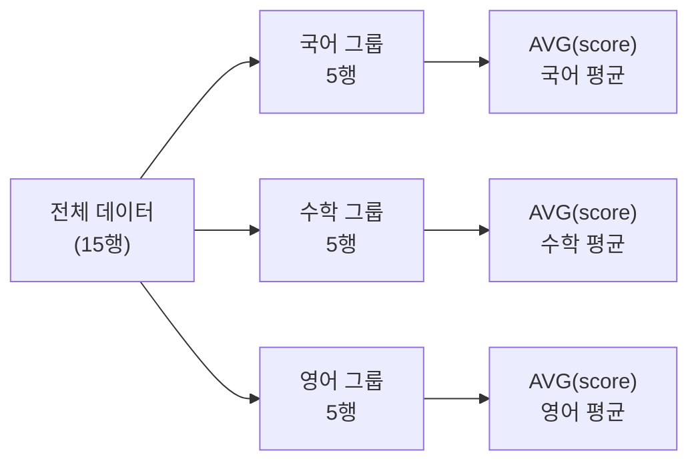
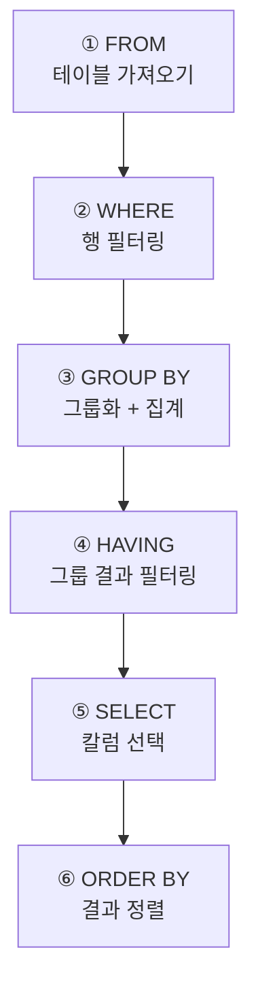

# 5-3 GROUP BY와 ORDER BY


---

## 1부. 이론

### 1-1. GROUP BY란?

5-1에서 배운 집계 함수는 **전체 데이터를 하나로 합쳐서** 계산했다.

```sql
-- 5-1 방식: 전체 평균 1개만 나옴
SELECT AVG(score) FROM scores;
```

`GROUP BY`는 **데이터를 특정 기준으로 나눈 뒤, 각 그룹별로 집계**하는 기능이다.

```sql
-- GROUP BY 방식: 과목별 평균이 각각 나옴
SELECT subject, AVG(score)
FROM scores
GROUP BY subject;
```

> 반 전체 평균이 아니라 **과목별 평균**, **학생별 합계**처럼 그룹을 나눠서 분석할 때 쓴다.
{: .prompt-tip }

---

### 1-2. GROUP BY 동작 원리

아래 그림처럼, GROUP BY는 데이터를 그룹으로 쪼갠 뒤 각각 집계한다.



---

### 1-3. GROUP BY 기본 형식

```sql
SELECT 그룹기준칼럼, 집계함수(칼럼)
FROM 테이블명
GROUP BY 그룹기준칼럼;
```

> **규칙**: `SELECT` 절에는 `GROUP BY`에 쓴 칼럼과 집계 함수만 올 수 있다.  
> 그룹화 기준이 아닌 일반 칼럼을 `SELECT`에 함께 쓰면 오류가 발생한다.
{: .prompt-warning }

---

### 1-4. HAVING — 그룹 결과에 조건 걸기

`WHERE`는 **행(row) 하나하나**에 조건을 건다.  
`HAVING`은 **GROUP BY로 집계된 결과**에 조건을 건다.

```sql
-- WHERE: 집계 전 필터 (개별 행에 조건)
WHERE score >= 80

-- HAVING: 집계 후 필터 (그룹 결과에 조건)
HAVING AVG(score) >= 80
```


---

### 1-5. ORDER BY란?

`ORDER BY`는 쿼리 결과를 **원하는 순서로 정렬**하는 기능이다.

```sql
ORDER BY 칼럼명 ASC    -- 오름차순 (작은 것 → 큰 것), 기본값
ORDER BY 칼럼명 DESC   -- 내림차순 (큰 것 → 작은 것)
```

- `ASC` (Ascending, 오름차순): 1→2→3, 가→나→다, A→B→C
- `DESC` (Descending, 내림차순): 3→2→1, 다→나→가, C→B→A

> `ASC`는 기본값이라 생략해도 된다. `DESC`는 반드시 직접 써줘야 한다.
{: .prompt-info }

---

### 1-6. ORDER BY 여러 칼럼 정렬

칼럼을 여러 개 써서 **1차 정렬 → 2차 정렬** 순으로 기준을 추가할 수 있다.

```sql
ORDER BY subject ASC, score DESC
-- 과목명 오름차순 정렬 후, 같은 과목 내에서는 점수 내림차순
```

---

### 1-7. SQL 실행 순서 (중요!)

SQL은 작성 순서와 **실제 실행 순서**가 다르다.



> `HAVING`은 `GROUP BY` 다음에 실행되기 때문에, `WHERE` 자리에 집계 함수를 쓸 수 없다.  
> 집계 결과에 조건을 걸려면 반드시 `HAVING`을 써야 한다.
{: .prompt-warning }

---

### 1-8. 전체 문법 구조 요약

```sql
SELECT   그룹기준칼럼, 집계함수(칼럼)   -- ⑤
FROM     테이블명                        -- ①
WHERE    행 조건                         -- ②  (선택)
GROUP BY 그룹기준칼럼                    -- ③  (선택)
HAVING   그룹 조건                       -- ④  (선택)
ORDER BY 정렬기준칼럼 ASC|DESC;         -- ⑥  (선택)
```

---

## 2부. 실습

> 5-2에서 만든 `score_db`를 이어서 사용한다.  
> 아직 만들지 않았다면, 5-2 글의 STEP 1~3을 먼저 실행한다.
{: .prompt-tip }

```sql
USE score_db;
```

---

### 실습 A. GROUP BY 기본 — 과목별 평균 점수

**질문: 과목마다 평균 점수가 얼마일까?**

```sql
SELECT subject      AS 과목,
       AVG(score)   AS 평균점수
FROM scores
GROUP BY subject;
```

결과 예시:

```
과목  | 평균점수
국어  |  80.0
수학  |  81.0
영어  |  81.4
```

> `GROUP BY subject` 덕분에 과목별로 따로 평균이 계산된다.
{: .prompt-info }


---

### 실습 B. GROUP BY + COUNT — 과목별 응시 인원

**질문: 각 과목에 몇 명이나 점수가 있을까?**

```sql
SELECT subject      AS 과목,
       COUNT(*)     AS 응시인원
FROM scores
GROUP BY subject;
```


---

### 실습 C. GROUP BY + SUM — 학생별 점수 합계

**질문: 학생마다 3과목 점수를 다 더하면 얼마일까?**

```sql
SELECT name         AS 학생,
       SUM(score)   AS 총점
FROM scores
GROUP BY name;
```

결과 예시:

```
학생  | 총점
민준  | 255
서연  | 253
지호  | 247
하은  | 183
준서  | 274
```


---

### 실습 D. GROUP BY + 여러 집계 함수 — 학생별 종합 통계

**질문: 학생마다 총점, 평균, 최고점, 최저점을 한 번에 보고 싶다.**

```sql
SELECT name           AS 학생,
       SUM(score)     AS 총점,
       AVG(score)     AS 평균,
       MAX(score)     AS 최고점,
       MIN(score)     AS 최저점
FROM scores
GROUP BY name;
```


---

### 실습 E. ORDER BY — 총점 높은 순으로 정렬

실습 D 결과를 **총점이 높은 학생부터** 보고 싶다.

```sql
SELECT name           AS 학생,
       SUM(score)     AS 총점,
       AVG(score)     AS 평균
FROM scores
GROUP BY name
ORDER BY SUM(score) DESC;
```

> `ORDER BY`에 집계 함수를 그대로 써도 되고, `AS`로 붙인 별칭을 써도 된다.  
> `ORDER BY 총점 DESC` 처럼 써도 같은 결과가 나온다.
{: .prompt-tip }


결과 예시 (내림차순):

```
학생  | 총점 | 평균
준서  | 274  | 91.3
민준  | 255  | 85.0
서연  | 253  | 84.3
지호  | 247  | 82.3
하은  | 183  | 61.0
```


---

### 실습 F. ORDER BY ASC — 점수 낮은 순으로 정렬

이번엔 **전체 데이터를 점수 오름차순**으로 정렬해서 본다.

```sql
SELECT name     AS 학생,
       subject  AS 과목,
       score    AS 점수
FROM scores
ORDER BY score ASC;
```

---

### 실습 G. ORDER BY 여러 칼럼 — 학년 → 점수 순 정렬

**학년 오름차순** 정렬 후, 같은 학년 안에서는 **점수 내림차순**으로 정렬한다.

```sql
SELECT grade    AS 학년,
       name     AS 학생,
       subject  AS 과목,
       score    AS 점수
FROM scores
ORDER BY grade ASC, score DESC;
```


---

### 실습 H. HAVING — 평균 80점 이상인 과목만 보기

**질문: 과목 평균이 80점 이상인 과목만 보고 싶다.**

```sql
SELECT subject      AS 과목,
       AVG(score)   AS 평균점수
FROM scores
GROUP BY subject
HAVING AVG(score) >= 80;
```

> `WHERE`가 아닌 `HAVING`을 써야 한다.  
> `WHERE AVG(score) >= 80`은 오류가 발생한다. 집계 결과는 항상 `HAVING`으로 필터링한다.
{: .prompt-danger }


---

### 실습 I. HAVING + ORDER BY — 총점 200 이상인 학생을 총점 높은 순으로

```sql
SELECT name         AS 학생,
       SUM(score)   AS 총점
FROM scores
GROUP BY name
HAVING SUM(score) >= 200
ORDER BY SUM(score) DESC;
```

결과 예시:

```
학생  | 총점
준서  | 274
민준  | 255
서연  | 253
지호  | 247
```

> 총점 200 미만인 하은(183)은 결과에서 제외된다.
{: .prompt-info }


---

### 실습 J. WHERE + GROUP BY + HAVING + ORDER BY 전부 조합

**질문: 1, 2학년 학생 중 평균 75점 이상인 학생을, 평균 높은 순으로 보여줘.**

```sql
SELECT name         AS 학생,
       AVG(score)   AS 평균점수
FROM scores
WHERE grade IN (1, 2)
GROUP BY name
HAVING AVG(score) >= 75
ORDER BY AVG(score) DESC;
```

실행 순서를 따라가 보자:

1. `FROM scores` — 전체 테이블을 가져온다
2. `WHERE grade IN (1, 2)` — 1, 2학년 행만 남긴다
3. `GROUP BY name` — 학생별로 그룹화한다
4. `HAVING AVG(score) >= 75` — 평균 75점 미만 그룹 제거
5. `SELECT name, AVG(score)` — 학생명과 평균을 고른다
6. `ORDER BY AVG(score) DESC` — 평균 높은 순으로 정렬


---

