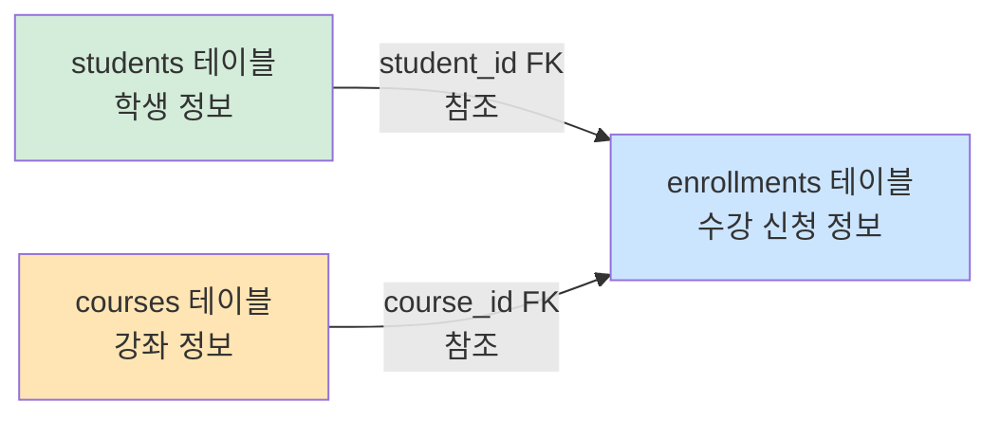

# 6-2-1 3개 테이블 응용 실습 — 학원 수강 DB

> 이번 실습은 **6-2의 2개 테이블 실습을 3개 테이블 구조로 확장**한 버전이다.  
> 문제를 먼저 읽고, 바로 아래 따라하기 SQL을 직접 실행하면서 학생 테이블, 강좌 테이블, 수강신청 테이블을 연결해 본다.
{: .prompt-tip }

---

## 이번 실습 목표



- `students` : 학생 정보를 저장하는 테이블
- `courses` : 강좌 정보를 저장하는 테이블
- `enrollments` : 수강 신청 정보를 저장하는 테이블
- `enrollments`는 `students`, `courses`를 동시에 참조한다.

---

## 실습 방법

1. 각 문제를 먼저 읽는다.
2. 아래 `따라하기`의 SQL을 직접 입력한다.
3. 실행 결과를 보고 테이블 구조와 데이터 흐름을 확인한다.

---

## 문제 1. 학원 실습용 데이터베이스를 생성하라

학원 수강 관리 실습을 위해 `academy_db` 데이터베이스를 만들고, 바로 사용할 수 있도록 선택해 보자.

### 따라하기

```sql
CREATE DATABASE academy_db;
USE academy_db;
```

---

## 문제 2. 학생 정보를 저장할 테이블을 생성하라

학생 번호, 이름, 학년을 저장하는 `students` 테이블을 만들어 보자.  
학생 번호는 자동 증가하는 기본키로 설정한다.

### 따라하기

```sql
CREATE TABLE students (
  id      INT          PRIMARY KEY AUTO_INCREMENT,
  name    VARCHAR(20)  NOT NULL,
  grade   INT          NOT NULL
);
```

### 확인할 점

- `id`는 기본키이다.
- `name`, `grade`는 비워둘 수 없다.

---

## 문제 3. 강좌 정보를 저장할 테이블을 생성하라

강좌 번호, 강좌명, 담당 강사를 저장하는 `courses` 테이블을 만들어 보자.

### 따라하기

```sql
CREATE TABLE courses (
  id         INT          PRIMARY KEY AUTO_INCREMENT,
  title      VARCHAR(30)  NOT NULL,
  instructor VARCHAR(20)  NOT NULL
);
```

### 확인할 점

- `id`는 기본키이다.
- 강좌명과 담당 강사는 반드시 입력해야 한다.

---

## 문제 4. 수강 신청 테이블을 생성하라

어떤 학생이 어떤 강좌를 신청했는지 저장하는 `enrollments` 테이블을 만들어 보자.  
이 테이블은 `students`, `courses` 두 테이블을 모두 참조해야 한다.

### 따라하기

```sql
CREATE TABLE enrollments (
  id         INT          PRIMARY KEY AUTO_INCREMENT,
  student_id INT          NOT NULL,
  course_id  INT          NOT NULL,
  reg_date   DATE         NOT NULL,
  FOREIGN KEY (student_id) REFERENCES students(id),
  FOREIGN KEY (course_id) REFERENCES courses(id)
);
```

### 확인할 점

- `student_id`는 `students(id)`를 참조한다.
- `course_id`는 `courses(id)`를 참조한다.
- 외래키가 2개 들어간 구조이다.

---

## 문제 5. 생성한 테이블 구조를 확인하라

지금까지 만든 3개 테이블의 구조를 직접 확인해 보자.

### 따라하기

```sql
DESC students;
DESC courses;
DESC enrollments;
```

### 확인할 점

- `students`, `courses`에는 기본키가 보이는지 확인한다.
- `enrollments`에는 외래키로 사용할 칼럼이 있는지 확인한다.

---

## 문제 6. 학생 데이터를 입력하라

학생 4명의 정보를 직접 입력해 보자.

### 따라하기

```sql
INSERT INTO students (name, grade) VALUES ('김민준', 1);
INSERT INTO students (name, grade) VALUES ('이서연', 2);
INSERT INTO students (name, grade) VALUES ('박지호', 1);
INSERT INTO students (name, grade) VALUES ('최하은', 3);
```

### 따라하기

```sql
SELECT * FROM students;
```

---

## 문제 7. 강좌 데이터를 입력하라

강좌 3개의 정보를 직접 입력해 보자.

### 따라하기

```sql
INSERT INTO courses (title, instructor) VALUES ('SQL기초', '한지민');
INSERT INTO courses (title, instructor) VALUES ('파이썬입문', '오세훈');
INSERT INTO courses (title, instructor) VALUES ('리눅스기초', '김도윤');
```

### 따라하기

```sql
SELECT * FROM courses;
```

---

## 문제 8. 수강 신청 데이터를 입력하라

학생 번호와 강좌 번호를 이용해 수강 신청 데이터를 넣어 보자.  
입력 전 `students`, `courses`의 번호를 먼저 확인한 뒤 진행하면 더 이해하기 쉽다.

### 따라하기

```sql
INSERT INTO enrollments (student_id, course_id, reg_date) VALUES (1, 1, '2026-03-02');
INSERT INTO enrollments (student_id, course_id, reg_date) VALUES (1, 3, '2026-03-03');
INSERT INTO enrollments (student_id, course_id, reg_date) VALUES (2, 2, '2026-03-04');
INSERT INTO enrollments (student_id, course_id, reg_date) VALUES (3, 1, '2026-03-05');
INSERT INTO enrollments (student_id, course_id, reg_date) VALUES (4, 2, '2026-03-06');
INSERT INTO enrollments (student_id, course_id, reg_date) VALUES (2, 3, '2026-03-07');
```

### 따라하기

```sql
SELECT * FROM enrollments;
```

---

## 문제 9. 외래키 제약조건을 직접 확인하라

존재하지 않는 학생 번호 또는 강좌 번호를 넣으면 어떻게 되는지 확인해 보자.  
실행 후 오류 메시지가 나오는지 확인하는 것이 목적이다.

### 따라하기

```sql
INSERT INTO enrollments (student_id, course_id, reg_date)
VALUES (99, 1, '2026-03-10');
```

### 추가 실습

```sql
INSERT INTO enrollments (student_id, course_id, reg_date)
VALUES (1, 99, '2026-03-10');
```

### 확인할 점

- 존재하지 않는 부모 키는 입력되지 않는다.
- 외래키가 데이터 무결성을 지켜 준다.

---

## 문제 10. 3개 테이블을 연결하여 조회하라

학생 이름, 강좌명, 신청일이 한 번에 보이도록 3개 테이블을 연결해 조회해 보자.

### 따라하기

```sql
SELECT students.name         AS 학생명,
       courses.title         AS 강좌명,
       enrollments.reg_date  AS 신청일
FROM enrollments, students, courses
WHERE enrollments.student_id = students.id
  AND enrollments.course_id = courses.id;
```

### 확인할 점

- `student_id`, `course_id` 숫자 대신 실제 이름이 보이는지 확인한다.
- 중간 테이블을 통해 두 부모 테이블이 연결되는 구조를 확인한다.

---

## 문제 11. 특정 학생의 수강 내역만 조회하라

'김민준' 학생이 신청한 강좌만 따로 조회해 보자.

### 따라하기

```sql
SELECT students.name         AS 학생명,
       courses.title         AS 강좌명,
       enrollments.reg_date  AS 신청일
FROM enrollments, students, courses
WHERE enrollments.student_id = students.id
  AND enrollments.course_id = courses.id
  AND students.name = '김민준';
```

---

## 문제 12. 특정 강좌를 신청한 학생만 조회하라

'파이썬입문' 강좌를 신청한 학생만 조회해 보자.

### 따라하기

```sql
SELECT courses.title         AS 강좌명,
       students.name         AS 학생명,
       enrollments.reg_date  AS 신청일
FROM enrollments, students, courses
WHERE enrollments.student_id = students.id
  AND enrollments.course_id = courses.id
  AND courses.title = '파이썬입문';
```

---

## 문제 13. 신청일이 최근인 순서대로 조회하라

수강 신청 내역을 최근 날짜부터 보이도록 정렬해 보자.

### 따라하기

```sql
SELECT students.name         AS 학생명,
       courses.title         AS 강좌명,
       enrollments.reg_date  AS 신청일
FROM enrollments, students, courses
WHERE enrollments.student_id = students.id
  AND enrollments.course_id = courses.id
ORDER BY enrollments.reg_date DESC;
```

---

## 직접 해보기

아래 문제는 바로 정답을 주지 않고, 직접 작성해 보는 연습용이다.

### 문제 1

'이서연' 학생이 신청한 강좌명과 신청일을 조회해 보자.

### 문제 2

'SQL기초' 강좌를 신청한 학생 이름만 조회해 보자.

### 문제 3

학생 번호 1번이 신청한 강좌가 몇 개인지 세어 보자.

### 문제 4

아래 SQL이 왜 오류가 나는지 직접 실행해 보고 이유를 정리해 보자.

```sql
INSERT INTO enrollments (student_id, course_id, reg_date)
VALUES (5, 3, '2026-03-10');
```

---

## 정리

이번 실습에서는 `students`, `courses`, `enrollments` 3개 테이블을 만들고 직접 연결해 보았다.

- `students`와 `courses`는 부모 테이블이다.
- `enrollments`는 두 부모 테이블을 동시에 참조하는 자식 테이블이다.
- 외래키를 이용하면 존재하지 않는 번호를 잘못 입력하는 것을 막을 수 있다.
- 여러 테이블을 연결하면 번호 대신 의미 있는 정보로 조회할 수 있다.

이 구조는 이후 배우게 될 다대다 관계 실습의 가장 기본이 되는 형태이다.

---
