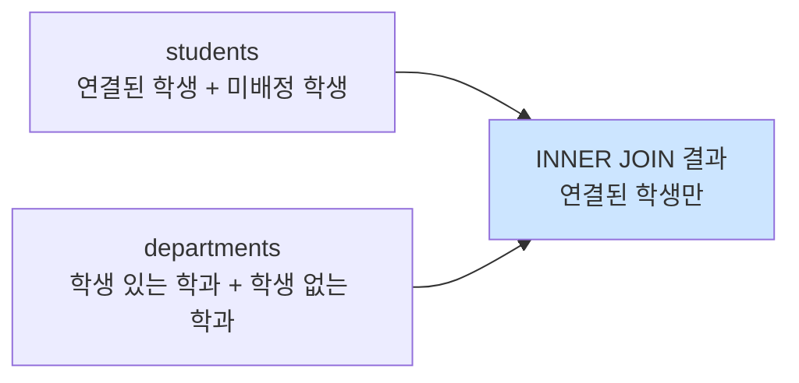

# 7-1 JOIN 기초 — 왜 테이블을 연결해야 할까?

> 이번 글은 **6장에서 만든 관계(기본키, 외래키)**를 실제 조회에 활용하는 첫 단계이다.  
> 테이블을 왜 연결해야 하는지, 어떤 컬럼을 기준으로 연결하는지, JOIN 종류마다 결과가 어떻게 달라지는지를 차근차근 정리한다.
{: .prompt-tip }

---

## 1부. JOIN이 필요한 이유

6장에서는 테이블 사이에 **관계**를 만들었다.  
예를 들어 `students` 테이블에 학생 이름이 있고, `scores` 테이블에 점수가 있다고 하자.

- `students.id` : 학생 번호
- `scores.student_id` : 어떤 학생의 점수인지 가리키는 번호

이렇게 연결은 해 두었지만, 실제로 조회할 때는 여전히 문제가 남는다.

예를 들어 `scores` 테이블만 보면 이렇게 보일 수 있다.

| id | student_id | subject | score |
|---|---|---|---|
| 1 | 1 | DB | 95 |
| 2 | 2 | DB | 88 |
| 3 | 1 | SQL | 92 |

이 표만 보면 `student_id = 1`이 **누구인지 바로 알기 어렵다.**  
그래서 `students` 테이블과 `scores` 테이블을 **함께 연결해서 조회**해야 한다.

이때 사용하는 것이 바로 `JOIN`이다.

---

## 2부. JOIN이란?

### 2-1. JOIN의 개념

**JOIN**은 두 개 이상의 테이블을 **공통된 컬럼 값**을 기준으로 연결하여 하나의 결과로 보여 주는 명령이다.

쉽게 말하면:

- 테이블을 따로 저장해 두고
- 필요할 때만 연결해서
- 보고 싶은 정보만 한 번에 조회하는 방법

이다.

---

### 2-2. 조인 컬럼(join column)

두 테이블을 연결할 때 기준이 되는 컬럼을 **조인 컬럼**이라고 한다.

보통은 다음처럼 연결한다.

- 한쪽 테이블의 **기본키(PK)**
- 다른 쪽 테이블의 **외래키(FK)**

예:

| 테이블 | 컬럼 | 역할 |
|---|---|---|
| `students` | `id` | 기본키(PK) |
| `scores` | `student_id` | 외래키(FK) |

즉,

```sql
students.id = scores.student_id
```

이 조건이 두 테이블을 연결하는 기준이 된다.

> 6장에서 외래키를 만든 이유는,  
> 나중에 이렇게 JOIN으로 안전하게 연결하기 위해서이다.
{: .prompt-info }

---

## 3부. JOIN의 기본 형식

가장 많이 쓰는 기본 형식은 아래와 같다.

```sql
SELECT 가져올컬럼들
FROM 기준테이블
JOIN 연결할테이블
  ON 연결조건;
```

예:

```sql
SELECT s.name, sc.subject, sc.score
FROM students AS s
JOIN scores AS sc
  ON s.id = sc.student_id;
```

이 SQL은:

1. `students`를 기준으로 읽고
2. `scores`를 연결하고
3. `s.id = sc.student_id`가 일치하는 행끼리 묶어서
4. 학생 이름, 과목, 점수를 함께 보여 준다.

---

### 3-1. 왜 `ON`이 필요한가?

`ON`은 **어떤 컬럼끼리 연결할지 명시하는 부분**이다.

```sql
ON s.id = sc.student_id
```

이 문장은:

- 학생 테이블의 `id`
- 점수 테이블의 `student_id`

가 같을 때만 붙이라는 뜻이다.

`ON`이 없으면 어떤 기준으로 연결해야 하는지 SQL이 알 수 없다.

---

### 3-2. 별칭(alias)을 왜 쓰는가?

JOIN에서는 같은 이름의 컬럼이 여러 테이블에 있을 수 있다.  
예를 들어 `id`, `name`, `created_at` 같은 컬럼명은 자주 겹친다.

그래서 보통 테이블에 짧은 별칭을 붙인다.

```sql
SELECT s.name, sc.score
FROM students AS s
JOIN scores AS sc
  ON s.id = sc.student_id;
```

- `students AS s`
- `scores AS sc`

이렇게 쓰면 SQL이 짧아지고 읽기 쉬워진다.

---

### 3-3. 중복 컬럼은 반드시 구분해서 쓰기

JOIN에서는 `id`, `name`처럼 겹치는 이름이 많다.  
그래서 아래처럼 그냥 쓰면 헷갈리거나 오류가 날 수 있다.

```sql
SELECT id, name
FROM students
JOIN scores
  ON students.id = scores.student_id;
```

이럴 때는 어느 테이블의 컬럼인지 분명히 써야 한다.

```sql
SELECT students.id, students.name, scores.score
FROM students
JOIN scores
  ON students.id = scores.student_id;
```

또는 별칭을 쓰면 더 읽기 쉽다.

```sql
SELECT s.id, s.name, sc.score
FROM students AS s
JOIN scores AS sc
  ON s.id = sc.student_id;
```

---

## 4부. JOIN의 특징

JOIN을 사용할 때 꼭 기억할 특징은 아래와 같다.

1. **조인 컬럼이 필요하다.**
2. **조인 컬럼의 자료형은 맞아야 한다.**
3. **연결 조건을 명확히 써야 한다.**
4. **두 개 이상 테이블도 연속으로 JOIN할 수 있다.**
5. **겹치는 컬럼명은 테이블명이나 별칭으로 구분해야 한다.**
6. **결과에 포함할 행은 JOIN 종류에 따라 달라진다.**

---

## 5부. JOIN 종류 이해하기

JOIN은 크게 “일치하는 행만 볼 것인가”, “일치하지 않는 행도 포함할 것인가”에 따라 나뉜다.

### 5-1. 한눈에 보기

| JOIN 종류 | 결과에 포함되는 행 |
|---|---|
| `INNER JOIN` | 양쪽 테이블에서 **일치하는 행만** |
| `LEFT JOIN` | 왼쪽 테이블의 **모든 행** + 오른쪽 일치 행 |
| `RIGHT JOIN` | 오른쪽 테이블의 **모든 행** + 왼쪽 일치 행 |
| `FULL JOIN` | 양쪽 테이블의 **모든 행** |

---

### 5-2. INNER JOIN

`INNER JOIN`은 두 테이블에서 **조건이 맞는 행만** 결과에 넣는다.

```sql
SELECT s.name, d.dept_name
FROM students AS s
INNER JOIN departments AS d
  ON s.dept_id = d.id;
```

- 학과가 없는 학생은 빠진다.
- 학생이 없는 학과도 빠진다.
- “정상적으로 연결된 데이터만 보겠다”는 느낌이다.



> 가장 많이 사용하는 JOIN이 바로 `INNER JOIN`이다.
{: .prompt-tip }

---

### 5-3. LEFT JOIN

`LEFT JOIN`은 **왼쪽 테이블의 모든 행**을 유지한다.

```sql
SELECT s.name, d.dept_name
FROM students AS s
LEFT JOIN departments AS d
  ON s.dept_id = d.id;
```

이 경우:

- 학생은 전부 나온다.
- 학과가 없는 학생도 나온다.
- 대신 학과명은 `NULL`로 채워진다.

이 JOIN은 “기준 테이블의 행을 절대 놓치고 싶지 않을 때” 많이 쓴다.

예:

- 모든 학생을 보고 싶은데
- 학과 정보가 없으면 `NULL`로라도 보고 싶을 때

---

### 5-4. RIGHT JOIN

`RIGHT JOIN`은 **오른쪽 테이블의 모든 행**을 유지한다.

```sql
SELECT s.name, d.dept_name
FROM students AS s
RIGHT JOIN departments AS d
  ON s.dept_id = d.id;
```

이 경우:

- 학과는 전부 나온다.
- 학생이 없는 학과도 나온다.
- 학생 정보는 `NULL`로 채워진다.

즉, `LEFT JOIN`과 반대 방향이라고 생각하면 된다.

---

### 5-5. FULL JOIN

`FULL JOIN`은 **양쪽 테이블의 모든 행**을 포함한다.

- 연결되는 것은 붙여서 보여 주고
- 한쪽에만 있는 것은 다른 쪽 컬럼을 `NULL`로 채운다.

다만 중요한 점이 있다.

> **MySQL은 `FULL OUTER JOIN` 문법을 직접 지원하지 않는다.**
{: .prompt-warning }

그래서 MySQL에서는 보통 아래처럼 만든다.

```sql
SELECT s.name, d.dept_name
FROM students AS s
LEFT JOIN departments AS d
  ON s.dept_id = d.id

UNION

SELECT s.name, d.dept_name
FROM students AS s
RIGHT JOIN departments AS d
  ON s.dept_id = d.id;
```

즉,

- `LEFT JOIN` 결과
- `RIGHT JOIN` 결과

를 `UNION`으로 합쳐서 FULL JOIN처럼 사용하는 것이다.

---

### 5-6. UNION이란?

`UNION`은 두 쿼리의 결과를 **하나로 합치는 집합 연산자**이다.

```sql
SELECT ...
UNION
SELECT ...
```

초급 단계에서는 다음 정도만 기억하면 충분하다.

- 위아래 `SELECT`의 컬럼 개수는 같아야 한다.
- 비슷한 구조의 결과를 하나로 합칠 때 사용한다.
- MySQL에서 `FULL JOIN`을 흉내 낼 때 자주 사용한다.

---

## 6부. JOIN 결과가 왜 늘어날까?

JOIN을 처음 배울 때 가장 많이 헷갈리는 부분이 이것이다.

예를 들어:

- 학생 1명이 점수 3개를 가지면
- 학생 테이블 1행이
- JOIN 결과에서는 3행으로 보일 수 있다.

왜냐하면 JOIN은 “학생 1명”을 보여 주는 것이 아니라,  
**조건에 맞는 조합(row match)**을 보여 주기 때문이다.

즉:

- 1명의 학생
- 3개의 점수 행

이 연결되면 결과는 3행이 된다.

> JOIN은 “행 수를 그대로 보존하는 명령”이 아니라  
> “조건에 맞는 행 조합을 만드는 명령”이라고 이해하면 쉽다.
{: .prompt-tip }

---

## 7부. 두 테이블, 세 테이블도 JOIN할 수 있다

JOIN은 2개 테이블만 가능한 것이 아니다.

예:

```sql
SELECT u.username, p.filename, c.content
FROM users AS u
JOIN photos AS p
  ON u.id = p.user_id
JOIN comments AS c
  ON p.id = c.photo_id;
```

이처럼:

1. `users`와 `photos`를 먼저 연결하고
2. 그 결과에 `comments`를 한 번 더 연결할 수 있다.

이것을 **연속 JOIN**이라고 생각하면 된다.

---

## 8부. JOIN 작성 순서 정리

초급 단계에서는 아래 순서로 작성하면 실수가 줄어든다.

1. **무슨 결과를 보고 싶은지 먼저 문장으로 말해 본다.**
2. 어떤 테이블들이 필요한지 찾는다.
3. 어떤 컬럼끼리 연결되는지 확인한다.
4. `FROM`에 기준 테이블을 둔다.
5. `JOIN ... ON ...`을 붙인다.
6. 필요한 경우 `WHERE`, `GROUP BY`, `ORDER BY`를 추가한다.

예:

“특정 사용자가 올린 사진 목록을 보고 싶다”

- 사용자 테이블 필요
- 사진 테이블 필요
- `users.id = photos.user_id`로 연결
- 사용자명을 기준으로 필터링

이 흐름으로 생각하면 JOIN이 훨씬 쉬워진다.

---

## 9부. 핵심 문법 요약

### 9-1. INNER JOIN

```sql
SELECT 컬럼들
FROM A
INNER JOIN B
  ON A.key = B.key;
```

### 9-2. LEFT JOIN

```sql
SELECT 컬럼들
FROM A
LEFT JOIN B
  ON A.key = B.key;
```

### 9-3. RIGHT JOIN

```sql
SELECT 컬럼들
FROM A
RIGHT JOIN B
  ON A.key = B.key;
```

### 9-4. FULL JOIN 느낌으로 만들기

```sql
SELECT 컬럼들
FROM A
LEFT JOIN B
  ON A.key = B.key

UNION

SELECT 컬럼들
FROM A
RIGHT JOIN B
  ON A.key = B.key;
```

---

## 10부. 정리

### 이번 글에서 꼭 기억할 것

- JOIN은 **테이블을 연결해서 하나의 결과로 보는 방법**이다.
- 보통 **PK와 FK**를 기준으로 연결한다.
- `ON`은 어떤 컬럼끼리 연결할지 적는 부분이다.
- `INNER JOIN`은 일치하는 행만, `LEFT/RIGHT JOIN`은 한쪽 기준으로 모두 보여 준다.
- MySQL에서는 `FULL JOIN`을 직접 쓰지 않고 `LEFT JOIN + RIGHT JOIN + UNION`으로 흉내 낸다.

### 다음 글 예고

다음 글에서는 **별그램(Stargram) 실습 DB**를 직접 만들고,

- 특정 사용자가 올린 사진 목록 조회
- 특정 사용자가 올린 사진의 좋아요 수 세기
- 특정 사용자가 쓴 댓글 개수 세기
- 댓글 본문과 사진 파일명 함께 보기

를 실제 JOIN으로 따라 해 본다.
