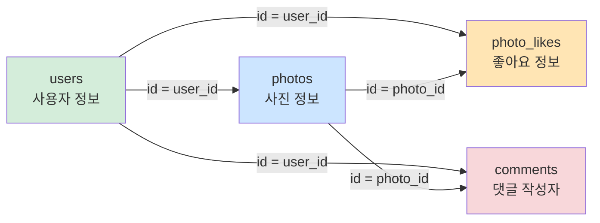

# 7-2 JOIN 따라하기 실습 — Stargram DB

> 이번 실습은 **7-1에서 배운 JOIN 개념을 실제 SQL로 손에 익히는 시간**이다.  
> `users`, `photos`, `photo_likes`, `comments` 테이블을 처음부터 직접 만들고, 하나씩 연결하면서 JOIN이 어떻게 동작하는지 확인한다.
{: .prompt-tip }

---

## 이번 실습 목표



- `users` : 사용자 계정 정보
- `photos` : 누가 어떤 사진을 올렸는지 저장
- `photo_likes` : 누가 어떤 사진에 좋아요를 눌렀는지 저장
- `comments` : 누가 어떤 사진에 댓글을 남겼는지 저장

이번 글에서 직접 해볼 JOIN 목표는 다음 4가지이다.

1. 특정 사용자가 올린 사진 목록 출력하기
2. 특정 사용자가 올린 사진의 좋아요 수 세기
3. 특정 사용자가 쓴 댓글 개수 세기
4. 모든 댓글 본문과 댓글이 달린 사진의 파일명 조회하기

---

## 실습 전 안내

> 아래 SQL은 **위에서부터 순서대로 그대로 실행**하는 것을 기준으로 작성했다.  
> 중간 단계부터 갑자기 실행하면 테이블이나 데이터가 아직 없어서 오류가 날 수 있다.
{: .prompt-warning }

---

## STEP 1. 데이터베이스 만들기

먼저 JOIN 실습 전용 데이터베이스를 새로 만든다.

```sql
DROP DATABASE IF EXISTS stargram_join_db;
CREATE DATABASE stargram_join_db;
USE stargram_join_db;
```

> 항상 `USE stargram_join_db;` 까지 실행했는지 확인한다.
{: .prompt-tip }

---

## STEP 2. users 테이블 만들기

사용자 정보를 저장하는 테이블이다.

```sql
CREATE TABLE users (
  id           INT           PRIMARY KEY AUTO_INCREMENT,
  username     VARCHAR(20)   NOT NULL UNIQUE,
  display_name VARCHAR(20)   NOT NULL,
  joined_at    DATE          NOT NULL
);
```

| 컬럼 | 자료형 | 의미 |
|---|---|---|
| `id` | INT | 사용자 번호 |
| `username` | VARCHAR(20) | 로그인용 아이디 |
| `display_name` | VARCHAR(20) | 화면에 보이는 이름 |
| `joined_at` | DATE | 가입일 |

---

## STEP 3. photos 테이블 만들기

누가 어떤 사진을 올렸는지 저장하는 테이블이다.

```sql
CREATE TABLE photos (
  id           INT            PRIMARY KEY AUTO_INCREMENT,
  user_id      INT            NOT NULL,
  filename     VARCHAR(50)    NOT NULL,
  caption      VARCHAR(100)   NOT NULL,
  uploaded_at  DATETIME       NOT NULL,
  FOREIGN KEY (user_id) REFERENCES users(id)
);
```

### 확인할 점

- `user_id`는 `users(id)`를 참조한다.
- 즉, 사진은 반드시 **기존 사용자**가 올린 것이어야 한다.

---

## STEP 4. photo_likes 테이블 만들기

어떤 사용자가 어떤 사진에 좋아요를 눌렀는지 저장한다.

```sql
CREATE TABLE photo_likes (
  id         INT        PRIMARY KEY AUTO_INCREMENT,
  photo_id   INT        NOT NULL,
  user_id    INT        NOT NULL,
  liked_at   DATETIME   NOT NULL,
  FOREIGN KEY (photo_id) REFERENCES photos(id),
  FOREIGN KEY (user_id) REFERENCES users(id)
);
```

### 확인할 점

- `photo_id`는 사진을 가리킨다.
- `user_id`는 좋아요를 누른 사용자를 가리킨다.
- 즉, 이 테이블은 `users`와 `photos`를 동시에 연결한다.

---

## STEP 5. comments 테이블 만들기

어떤 사용자가 어떤 사진에 댓글을 남겼는지 저장한다.

```sql
CREATE TABLE comments (
  id          INT            PRIMARY KEY AUTO_INCREMENT,
  photo_id    INT            NOT NULL,
  user_id     INT            NOT NULL,
  content     VARCHAR(100)   NOT NULL,
  created_at  DATETIME       NOT NULL,
  FOREIGN KEY (photo_id) REFERENCES photos(id),
  FOREIGN KEY (user_id) REFERENCES users(id)
);
```

---

## STEP 6. 테이블 구조 확인하기

```sql
DESC users;
DESC photos;
DESC photo_likes;
DESC comments;
```

### 여기서 꼭 보기

- `photos.user_id`
- `photo_likes.photo_id`
- `photo_likes.user_id`
- `comments.photo_id`
- `comments.user_id`

이 칼럼들이 나중에 JOIN의 기준이 된다.

---

## STEP 7. 사용자 데이터 넣기

```sql
INSERT INTO users (username, display_name, joined_at) VALUES
('minjun',  '김민준', '2026-03-20'),
('seoyeon', '이서연', '2026-03-21'),
('jiho',    '박지호', '2026-03-22'),
('sua',     '최수아', '2026-03-23'),
('doyoon',  '한도윤', '2026-03-24');
```

확인:

```sql
SELECT * FROM users;
```

예상 결과:

| id | username | display_name | joined_at |
|---|---|---|---|
| 1 | minjun | 김민준 | 2026-03-20 |
| 2 | seoyeon | 이서연 | 2026-03-21 |
| 3 | jiho | 박지호 | 2026-03-22 |
| 4 | sua | 최수아 | 2026-03-23 |
| 5 | doyoon | 한도윤 | 2026-03-24 |

---

## STEP 8. 사진 데이터 넣기

```sql
INSERT INTO photos (user_id, filename, caption, uploaded_at) VALUES
(1, 'mju_sunset.jpg',   '한강 노을 산책',      '2026-04-01 18:10:00'),
(2, 'seoyeon_cafe.jpg', '주말 카페 기록',      '2026-04-02 14:20:00'),
(1, 'mju_cat.jpg',      '동네 고양이 발견',    '2026-04-03 09:15:00'),
(3, 'jiho_bike.jpg',    '자전거 연습 완료',    '2026-04-03 17:40:00'),
(4, 'sua_flower.jpg',   '봄꽃 산책 중',        '2026-04-04 11:05:00'),
(2, 'seoyeon_book.jpg', '읽는 오후',           '2026-04-05 20:00:00');
```

확인:

```sql
SELECT * FROM photos;
```

### 이해 포인트

- `user_id = 1`인 김민준은 사진을 2장 올렸다.
- `user_id = 2`인 이서연도 사진을 2장 올렸다.
- 한도윤(`id=5`)은 아직 사진을 올리지 않았다.

이 정보는 나중에 `LEFT JOIN` 실습에서 중요하다.

---

## STEP 9. 좋아요 데이터 넣기

```sql
INSERT INTO photo_likes (photo_id, user_id, liked_at) VALUES
(1, 2, '2026-04-01 18:30:00'),
(1, 3, '2026-04-01 18:32:00'),
(1, 4, '2026-04-01 18:35:00'),
(2, 1, '2026-04-02 14:30:00'),
(2, 3, '2026-04-02 14:33:00'),
(3, 2, '2026-04-03 09:30:00'),
(3, 4, '2026-04-03 09:34:00'),
(3, 5, '2026-04-03 09:40:00'),
(4, 1, '2026-04-03 18:00:00'),
(4, 2, '2026-04-03 18:10:00'),
(5, 1, '2026-04-04 11:30:00');
```

확인:

```sql
SELECT * FROM photo_likes;
```

### 이해 포인트

- `photo_id = 6`인 `seoyeon_book.jpg`는 **좋아요가 아직 0개**이다.
- 이 덕분에 `LEFT JOIN`과 `COUNT()` 차이를 연습할 수 있다.

---

## STEP 10. 댓글 데이터 넣기

```sql
INSERT INTO comments (photo_id, user_id, content, created_at) VALUES
(1, 2, '노을 색감 좋다!',             '2026-04-01 18:40:00'),
(1, 4, '직접 보면 더 예쁠 듯',        '2026-04-01 18:45:00'),
(2, 1, '디저트 맛있어 보여요',        '2026-04-02 14:40:00'),
(3, 2, '고양이 표정이 귀엽다',        '2026-04-03 09:40:00'),
(3, 5, '사진 잘 찍었다',              '2026-04-03 09:50:00'),
(4, 1, '헬멧 멋지다',                 '2026-04-03 18:15:00'),
(5, 3, '꽃 색이 진짜 선명하다',       '2026-04-04 11:40:00'),
(1, 5, '다음엔 야경도 올려줘',        '2026-04-01 18:50:00');
```

확인:

```sql
SELECT * FROM comments;
```

---

## STEP 11. 현재 데이터 상태 한 번에 점검하기

```sql
SELECT * FROM users;
SELECT * FROM photos;
SELECT * FROM photo_likes;
SELECT * FROM comments;
```

> 여기까지 문제 없이 실행되면, 이제 JOIN 실습을 해도 된다.  
> 중간에 데이터가 빠졌다면 이후 결과표가 달라질 수 있으니 먼저 다시 확인한다.
{: .prompt-warning }

---

## STEP 12. 특정 사용자가 올린 사진 목록 출력하기

이제 첫 JOIN을 해 보자.  
김민준(`username = 'minjun'`)이 올린 사진 파일명과 설명을 보고 싶다.

```sql
SELECT u.display_name AS 작성자,
       p.filename     AS 파일명,
       p.caption      AS 설명,
       p.uploaded_at  AS 업로드시각
FROM users AS u
INNER JOIN photos AS p
  ON u.id = p.user_id
WHERE u.username = 'minjun'
ORDER BY p.id;
```

예상 결과:

| 작성자 | 파일명 | 설명 | 업로드시각 |
|---|---|---|---|
| 김민준 | mju_sunset.jpg | 한강 노을 산책 | 2026-04-01 18:10:00 |
| 김민준 | mju_cat.jpg | 동네 고양이 발견 | 2026-04-03 09:15:00 |

### 왜 이 JOIN이 맞을까?

- 작성자 정보는 `users`
- 사진 정보는 `photos`
- 연결 기준은 `users.id = photos.user_id`

즉, **누가 올렸는지**를 알아야 하므로 사용자와 사진을 연결한 것이다.

### 학생이 자주 헷갈리는 점

- `WHERE u.username = 'minjun'` 은 **JOIN 후에 원하는 사람만 고르는 조건**
- `ON u.id = p.user_id` 는 **두 테이블을 붙이는 조건**

둘은 역할이 다르다.

---

## STEP 13. 특정 사용자가 올린 사진의 좋아요 수 세기

이번에는 김민준이 올린 사진마다 좋아요가 몇 개인지 보고 싶다.

```sql
SELECT p.filename       AS 파일명,
       COUNT(pl.id)     AS 좋아요수
FROM photos AS p
INNER JOIN users AS u
  ON p.user_id = u.id
LEFT JOIN photo_likes AS pl
  ON p.id = pl.photo_id
WHERE u.username = 'minjun'
GROUP BY p.id, p.filename
ORDER BY p.id;
```

예상 결과:

| 파일명 | 좋아요수 |
|---|---|
| mju_sunset.jpg | 3 |
| mju_cat.jpg | 3 |

### 왜 `LEFT JOIN`을 썼을까?

좋아요가 0개인 사진도 **사진 자체는 보여야 하기 때문**이다.

만약 `INNER JOIN photo_likes`를 쓰면:

- 좋아요가 있는 사진만 남고
- 좋아요가 0개인 사진은 결과에서 사라진다.

### 왜 `GROUP BY`가 필요한가?

좋아요 테이블은 **좋아요 1개당 1행**이다.  
그래서 사진과 좋아요를 JOIN하면 같은 사진이 여러 줄로 늘어난다.

예를 들어 `mju_sunset.jpg`에 좋아요 3개가 있으면 JOIN 결과에서 3행이 된다.  
이것을 다시 **사진별로 묶어 세기 위해 `GROUP BY`**를 사용한다.

> JOIN으로 행이 늘어나는 것은 정상이다.  
> 집계가 필요하면 `GROUP BY`로 다시 묶는다.
{: .prompt-tip }

---

## STEP 14. 특정 사용자가 쓴 댓글 개수 세기

이번에는 “특정 사용자가 **작성한 댓글 수**”를 세어 보자.  
이서연(`username = 'seoyeon'`)이 쓴 댓글 개수를 구한다.

```sql
SELECT u.display_name   AS 작성자,
       COUNT(c.id)      AS 댓글개수
FROM users AS u
INNER JOIN comments AS c
  ON u.id = c.user_id
WHERE u.username = 'seoyeon'
GROUP BY u.id, u.display_name;
```

예상 결과:

| 작성자 | 댓글개수 |
|---|---|
| 이서연 | 2 |

### 여기서 보는 포인트

- 댓글 작성자는 `comments.user_id`에 들어 있다.
- 따라서 `users`와 `comments`를 연결해야 한다.
- 이번에는 사진 테이블이 없어도 문제를 풀 수 있다.

즉, **JOIN은 무조건 테이블을 많이 붙이는 것이 아니라 필요한 테이블만 정확히 고르는 것**이 중요하다.

---

## STEP 15. 모든 댓글 본문과 댓글이 달린 사진의 파일명 조회하기

이제 댓글 내용과 그 댓글이 달린 사진 파일명을 함께 조회해 보자.

```sql
SELECT c.content    AS 댓글본문,
       p.filename   AS 사진파일명
FROM comments AS c
INNER JOIN photos AS p
  ON c.photo_id = p.id
ORDER BY c.id;
```

예상 결과:

| 댓글본문 | 사진파일명 |
|---|---|
| 노을 색감 좋다! | mju_sunset.jpg |
| 직접 보면 더 예쁠 듯 | mju_sunset.jpg |
| 디저트 맛있어 보여요 | seoyeon_cafe.jpg |
| 고양이 표정이 귀엽다 | mju_cat.jpg |
| 사진 잘 찍었다 | mju_cat.jpg |
| 헬멧 멋지다 | jiho_bike.jpg |
| 꽃 색이 진짜 선명하다 | sua_flower.jpg |
| 다음엔 야경도 올려줘 | mju_sunset.jpg |

### 왜 `comments`를 FROM에 두었을까?

이번에 꼭 보고 싶은 기준은 **댓글**이다.

- 댓글 본문은 `comments`에 있고
- 사진 파일명은 `photos`에 있다.

그래서 “댓글 기준으로” 결과를 만들고 싶은 경우 `comments`를 앞에 두는 것이 자연스럽다.

---

## STEP 16. JOIN 결과를 더 깊게 읽어 보기

아래 SQL도 한 번 실행해 보자.

```sql
SELECT p.filename,
       pl.user_id
FROM photos AS p
LEFT JOIN photo_likes AS pl
  ON p.id = pl.photo_id
ORDER BY p.id, pl.user_id;
```

### 이 결과를 보면 알 수 있는 것

- 좋아요가 여러 개인 사진은 여러 행으로 보인다.
- 좋아요가 없는 `seoyeon_book.jpg`는 `user_id`가 `NULL`로 나온다.

즉:

- `LEFT JOIN`은 왼쪽 테이블의 행을 남기고
- 연결 대상이 없으면 `NULL`을 채운다.

이 원리를 눈으로 확인할 수 있다.

---

## STEP 17. 좋아요가 없는 사진도 포함해서 모두 세기

위 개념을 바로 집계로 연결해 보자.

```sql
SELECT p.filename       AS 파일명,
       COUNT(pl.id)     AS 좋아요수
FROM photos AS p
LEFT JOIN photo_likes AS pl
  ON p.id = pl.photo_id
GROUP BY p.id, p.filename
ORDER BY p.id;
```

예상 결과:

| 파일명 | 좋아요수 |
|---|---|
| mju_sunset.jpg | 3 |
| seoyeon_cafe.jpg | 2 |
| mju_cat.jpg | 3 |
| jiho_bike.jpg | 2 |
| sua_flower.jpg | 1 |
| seoyeon_book.jpg | 0 |

> `COUNT(*)`가 아니라 `COUNT(pl.id)`를 쓴 이유도 확인해 보자.  
> `LEFT JOIN`에서는 매칭이 없어도 한 줄이 남기 때문에, 실제 좋아요가 있는 행만 세려면 `COUNT(pl.id)`가 더 적절하다.
{: .prompt-info }

---

## STEP 18. 3개 테이블 JOIN 맛보기

이번에는 사진 파일명, 댓글 본문, 댓글 작성자 이름을 한 번에 보자.

```sql
SELECT p.filename        AS 파일명,
       c.content         AS 댓글본문,
       u.display_name    AS 댓글작성자
FROM comments AS c
INNER JOIN photos AS p
  ON c.photo_id = p.id
INNER JOIN users AS u
  ON c.user_id = u.id
ORDER BY c.id;
```

이 SQL은:

1. `comments`와 `photos`를 연결해 “어느 사진 댓글인지”를 알게 하고
2. 다시 `users`를 연결해 “누가 쓴 댓글인지”를 알게 한다.

이처럼 JOIN은 **한 번만 하는 것이 아니라 필요한 만큼 이어서 사용할 수 있다.**

---

## STEP 19. 직접 확인해 볼 체크 질문

아래 질문에 스스로 답해 보면 JOIN 이해가 훨씬 빨라진다.

1. 왜 `users`와 `photos`는 `u.id = p.user_id`로 연결할까?
2. 왜 좋아요 수를 셀 때 `GROUP BY`가 필요할까?
3. 왜 좋아요가 없는 사진까지 보려면 `LEFT JOIN`이 필요할까?
4. 왜 댓글 개수 문제에서는 `photos` 테이블이 없어도 될까?
5. 왜 어떤 쿼리는 `FROM comments`, 어떤 쿼리는 `FROM photos`로 시작할까?

---

## STEP 20. 정리

### 이번 실습에서 익힌 핵심

- JOIN은 “관계가 있는 테이블을 실제 조회에 활용하는 방법”이다.
- 무엇을 보고 싶은지에 따라 `FROM`에 둘 기준 테이블이 달라진다.
- `INNER JOIN`은 매칭되는 행만, `LEFT JOIN`은 왼쪽 기준 행을 모두 보여 준다.
- JOIN 후 결과 행이 늘어나는 것은 자연스럽다.
- 사진별 좋아요 수처럼 “묶어서 세는 작업”에는 `GROUP BY`가 필요하다.

### 다음 글 예고

다음 글에서는 같은 `stargram_join_db`를 그대로 사용해서  
**문제 → 힌트 → 답안 → 예상 결과** 형식의 JOIN 연습 문제를 풀어 본다.
