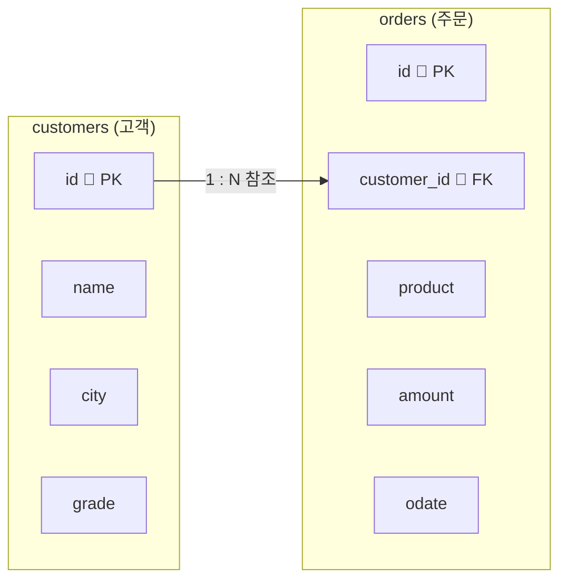

# 2026년 1학기 (재직자반) 데이터베이스 보안 기말고사 준비 문제 ②


---

## 환경설정

### 1. 준비물

- **MySQL Server** 8.0 이상
- **MySQL Workbench**

### 2. 시작 방법

1. MySQL Workbench를 실행합니다.
2. 로컬 연결(`Local instance MySQL`)을 클릭해서 접속합니다.
3. 상단 메뉴에서 새 쿼리 창(SQL Editor)을 엽니다.
4. 아래 **3단계 준비 SQL**을 위에서부터 순서대로 실행합니다.

### 3. 시험에서 사용할 데이터 구조

이번 시험도 **온라인 쇼핑몰**을 가정합니다.  
고객 정보를 담는 `customers` 테이블과, 주문 내역을 담는 `orders` 테이블을 사용합니다.



- 한 명의 고객은 여러 번 주문할 수 있습니다 → **1:N 관계**
- `orders.customer_id`는 `customers.id`를 외래키로 참조합니다.
- 그래서 주문만 봐서는 **누가** 주문했는지 알 수 없고, 두 테이블을 **연결**해야 고객 이름이 보입니다. 이번 시험의 핵심입니다.

### 4. 준비 SQL — 한 번만 실행하면 끝

> 아래 세 블록을 **위에서부터 순서대로** 실행하세요.  
> 여기까지 마치면 데이터가 모두 준비되어, 곧바로 **문제(조회)** 로 들어갈 수 있습니다.
{: .prompt-warning }

**(1) 데이터베이스 만들고 선택**

```sql
CREATE DATABASE exam2_db;
USE exam2_db;
```

**(2) 두 테이블 만들기**

```sql
CREATE TABLE customers (
  id    INT          PRIMARY KEY AUTO_INCREMENT,
  name  VARCHAR(20)  NOT NULL,
  city  VARCHAR(20)  NOT NULL,
  grade VARCHAR(10)  DEFAULT '일반'
);

CREATE TABLE orders (
  id          INT          PRIMARY KEY AUTO_INCREMENT,
  customer_id INT          NOT NULL,
  product     VARCHAR(30)  NOT NULL,
  amount      INT          NOT NULL,
  odate       DATE         NOT NULL,
  FOREIGN KEY (customer_id) REFERENCES customers(id)
);
```

**(3) 데이터 입력 — 고객 5명, 주문 10건**

```sql
INSERT INTO customers (name, city, grade) VALUES ('김민준', '서울', 'VIP');
INSERT INTO customers (name, city, grade) VALUES ('이서연', '부산', '일반');
INSERT INTO customers (name, city, grade) VALUES ('박지호', '서울', '일반');
INSERT INTO customers (name, city, grade) VALUES ('최하은', '대구', 'VIP');
INSERT INTO customers (name, city, grade) VALUES ('정우진', '서울', '일반');

INSERT INTO orders (customer_id, product, amount, odate) VALUES (1, '노트북', 1200000, '2026-04-02');
INSERT INTO orders (customer_id, product, amount, odate) VALUES (1, '마우스',   30000, '2026-04-05');
INSERT INTO orders (customer_id, product, amount, odate) VALUES (2, '키보드',   50000, '2026-04-07');
INSERT INTO orders (customer_id, product, amount, odate) VALUES (3, '모니터',  300000, '2026-04-10');
INSERT INTO orders (customer_id, product, amount, odate) VALUES (2, '노트북', 1500000, '2026-04-12');
INSERT INTO orders (customer_id, product, amount, odate) VALUES (4, '태블릿',  800000, '2026-04-15');
INSERT INTO orders (customer_id, product, amount, odate) VALUES (1, '헤드셋',  150000, '2026-05-03');
INSERT INTO orders (customer_id, product, amount, odate) VALUES (3, '마우스',   30000, '2026-05-08');
INSERT INTO orders (customer_id, product, amount, odate) VALUES (5, '모니터',  350000, '2026-05-11');
INSERT INTO orders (customer_id, product, amount, odate) VALUES (4, '키보드',   60000, '2026-05-20');
```

**(4) 잘 들어갔는지 확인**

```sql
SELECT * FROM customers;
SELECT * FROM orders;
```

> `customers` 5줄, `orders` 10줄이 보이면 준비 완료입니다. ✅  
> 이제부터 **문제는 모두 이 두 테이블을 연결해 조회**합니다.
{: .prompt-info }

---

## 두 테이블을 연결하는 기본 공식

문제를 풀기 전에, 이번 시험에서 **계속 반복되는 한 가지 형태**를 먼저 익혀 둡시다.

```sql
SELECT 보고 싶은 칼럼들
FROM orders, customers                          -- ① 연결할 두 테이블을 모두 적는다
WHERE orders.customer_id = customers.id;        -- ② 키로 두 테이블을 이어 준다
```

- **`FROM`에 두 테이블을 모두** 적습니다. (`orders, customers`)
- **`WHERE`의 `orders.customer_id = customers.id`** 가 두 테이블을 이어 주는 **연결 조건**입니다. 이 줄이 빠지면 결과가 엉터리로 불어나니 **절대 빼면 안 됩니다.**
- 더 걸러내고 싶으면 뒤에 `AND 조건`을 덧붙입니다.

> 칼럼 이름이 두 테이블에 겹칠 수 있으므로, `customers.name`, `orders.amount`처럼 **`테이블명.칼럼명`** 형태로 적는 것이 안전합니다.
{: .prompt-tip }

---

## 문제와 정답

> 각 문제 바로 아래에 **정답**이 있습니다.  
> 먼저 스스로 SQL을 작성해 실행해 보고, 그다음 정답과 비교해 보세요.  
> 모든 문제의 정답에는 **연결 조건(`orders.customer_id = customers.id`)** 이 들어 있는지 꼭 확인하세요.
{: .prompt-tip }

---

### 문제 1

두 테이블을 연결해서 **고객 이름 · 상품 · 금액**을 함께 조회하세요. (가장 기본 형태)

**정답**

```sql
SELECT customers.name    AS 고객이름,
       orders.product    AS 상품,
       orders.amount     AS 금액
FROM orders, customers
WHERE orders.customer_id = customers.id;
```

결과:

```
고객이름 | 상품   | 금액
김민준   | 노트북 | 1200000
김민준   | 마우스 |   30000
이서연   | 키보드 |   50000
박지호   | 모니터 |  300000
이서연   | 노트북 | 1500000
최하은   | 태블릿 |  800000
김민준   | 헤드셋 |  150000
박지호   | 마우스 |   30000
정우진   | 모니터 |  350000
최하은   | 키보드 |   60000
```

총 **10줄**이 나오면 연결에 성공한 것입니다.

---

### 문제 2

문제 1에 고객의 **도시(`city`)** 까지 더해서, **고객 이름 · 도시 · 상품 · 금액**을 조회하세요.

**정답**

```sql
SELECT customers.name    AS 고객이름,
       customers.city    AS 도시,
       orders.product    AS 상품,
       orders.amount     AS 금액
FROM orders, customers
WHERE orders.customer_id = customers.id;
```

결과:

```
고객이름 | 도시 | 상품   | 금액
김민준   | 서울 | 노트북 | 1200000
김민준   | 서울 | 마우스 |   30000
이서연   | 부산 | 키보드 |   50000
박지호   | 서울 | 모니터 |  300000
이서연   | 부산 | 노트북 | 1500000
최하은   | 대구 | 태블릿 |  800000
김민준   | 서울 | 헤드셋 |  150000
박지호   | 서울 | 마우스 |   30000
정우진   | 서울 | 모니터 |  350000
최하은   | 대구 | 키보드 |   60000
```

> 한쪽 테이블(`customers`)과 다른 쪽 테이블(`orders`)의 칼럼을 **자유롭게 섞어서** 뽑을 수 있습니다.
{: .prompt-info }

---

### 문제 3

**'김민준'** 고객이 주문한 **상품과 금액**만 조회하세요. (연결 + 고객 이름 조건)

**정답**

```sql
SELECT customers.name    AS 고객이름,
       orders.product    AS 상품,
       orders.amount     AS 금액
FROM orders, customers
WHERE orders.customer_id = customers.id
  AND customers.name = '김민준';
```

결과:

```
고객이름 | 상품   | 금액
김민준   | 노트북 | 1200000
김민준   | 마우스 |   30000
김민준   | 헤드셋 |  150000
```

---

### 문제 4

**'서울'에 사는 고객들**의 주문을 **고객 이름 · 상품 · 금액**으로 조회하세요. (연결 + 도시 조건)

**정답**

```sql
SELECT customers.name    AS 고객이름,
       orders.product    AS 상품,
       orders.amount     AS 금액
FROM orders, customers
WHERE orders.customer_id = customers.id
  AND customers.city = '서울';
```

결과:

```
고객이름 | 상품   | 금액
김민준   | 노트북 | 1200000
김민준   | 마우스 |   30000
박지호   | 모니터 |  300000
김민준   | 헤드셋 |  150000
박지호   | 마우스 |   30000
정우진   | 모니터 |  350000
```

서울 고객(김민준·박지호·정우진)의 주문 **6줄**이 나옵니다.

---

### 문제 5

**'VIP' 등급** 고객의 주문을 **고객 이름 · 등급 · 상품 · 금액**으로 조회하세요.

**정답**

```sql
SELECT customers.name    AS 고객이름,
       customers.grade   AS 등급,
       orders.product    AS 상품,
       orders.amount     AS 금액
FROM orders, customers
WHERE orders.customer_id = customers.id
  AND customers.grade = 'VIP';
```

결과:

```
고객이름 | 등급 | 상품   | 금액
김민준   | VIP  | 노트북 | 1200000
김민준   | VIP  | 마우스 |   30000
김민준   | VIP  | 헤드셋 |  150000
최하은   | VIP  | 태블릿 |  800000
최하은   | VIP  | 키보드 |   60000
```

VIP 고객(김민준·최하은)의 주문 **5줄**이 나옵니다.

---

### 문제 6

**금액이 300,000원 이상**인 주문을 **고객 이름과 함께** 조회하세요. (연결 + 금액 조건)

**정답**

```sql
SELECT customers.name    AS 고객이름,
       orders.product    AS 상품,
       orders.amount     AS 금액
FROM orders, customers
WHERE orders.customer_id = customers.id
  AND orders.amount >= 300000;
```

결과:

```
고객이름 | 상품   | 금액
김민준   | 노트북 | 1200000
박지호   | 모니터 |  300000
이서연   | 노트북 | 1500000
최하은   | 태블릿 |  800000
정우진   | 모니터 |  350000
```

총 **5줄**.

---

### 문제 7

**4월(2026-04-01 ~ 2026-04-30)** 에 들어온 주문을 **고객 이름 · 상품 · 금액 · 주문일**로 조회하세요. (연결 + `BETWEEN`)

**정답**

```sql
SELECT customers.name    AS 고객이름,
       orders.product    AS 상품,
       orders.amount     AS 금액,
       orders.odate      AS 주문일
FROM orders, customers
WHERE orders.customer_id = customers.id
  AND orders.odate BETWEEN '2026-04-01' AND '2026-04-30';
```

결과:

```
고객이름 | 상품   | 금액    | 주문일
김민준   | 노트북 | 1200000 | 2026-04-02
김민준   | 마우스 |   30000 | 2026-04-05
이서연   | 키보드 |   50000 | 2026-04-07
박지호   | 모니터 |  300000 | 2026-04-10
이서연   | 노트북 | 1500000 | 2026-04-12
최하은   | 태블릿 |  800000 | 2026-04-15
```

총 **6줄**.

---

### 문제 8

상품이 **'노트북' 또는 '모니터'** 인 주문을 **고객 이름 · 도시 · 상품 · 금액**으로 조회하세요. (연결 + `IN`)

**정답**

```sql
SELECT customers.name    AS 고객이름,
       customers.city    AS 도시,
       orders.product    AS 상품,
       orders.amount     AS 금액
FROM orders, customers
WHERE orders.customer_id = customers.id
  AND orders.product IN ('노트북', '모니터');
```

결과:

```
고객이름 | 도시 | 상품   | 금액
김민준   | 서울 | 노트북 | 1200000
박지호   | 서울 | 모니터 |  300000
이서연   | 부산 | 노트북 | 1500000
정우진   | 서울 | 모니터 |  350000
```

총 **4줄**.

---

### 문제 9

**'서울' 고객**이 주문한 것 중 **금액이 100,000원 이상**인 주문을 조회하세요. (연결 + 두 조건 `AND`)

**정답**

```sql
SELECT customers.name    AS 고객이름,
       orders.product    AS 상품,
       orders.amount     AS 금액
FROM orders, customers
WHERE orders.customer_id = customers.id
  AND customers.city = '서울'
  AND orders.amount >= 100000;
```

결과:

```
고객이름 | 상품   | 금액
김민준   | 노트북 | 1200000
박지호   | 모니터 |  300000
김민준   | 헤드셋 |  150000
정우진   | 모니터 |  350000
```

총 **4줄**.

> 연결 조건(`= customers.id`) 뒤에 `AND`로 조건을 **얼마든지 더** 붙일 수 있습니다.
{: .prompt-info }

---

### 문제 10

상품이 **'노트북' 또는 '모니터'** 이면서 **금액이 500,000원 이상**인 주문을 **고객 이름과 함께** 조회하세요. (연결 + 괄호 + `OR`/`AND`)

**정답**

```sql
SELECT customers.name    AS 고객이름,
       orders.product    AS 상품,
       orders.amount     AS 금액
FROM orders, customers
WHERE orders.customer_id = customers.id
  AND (orders.product = '노트북' OR orders.product = '모니터')
  AND orders.amount >= 500000;
```

결과:

```
고객이름 | 상품   | 금액
김민준   | 노트북 | 1200000
이서연   | 노트북 | 1500000
```

총 **2줄**.

> 괄호로 `(노트북 OR 모니터)`를 먼저 묶지 않으면, 금액 조건이 모니터에만 걸려 결과가 달라집니다. **괄호를 반드시 사용하세요.**
{: .prompt-warning }

---

### 문제 11

모든 주문을 **금액이 높은 순서**로 **고객 이름 · 상품 · 금액**과 함께 조회하세요. (연결 + `ORDER BY`)

**정답**

```sql
SELECT customers.name    AS 고객이름,
       orders.product    AS 상품,
       orders.amount     AS 금액
FROM orders, customers
WHERE orders.customer_id = customers.id
ORDER BY orders.amount DESC;
```

결과:

```
고객이름 | 상품   | 금액
이서연   | 노트북 | 1500000
김민준   | 노트북 | 1200000
최하은   | 태블릿 |  800000
정우진   | 모니터 |  350000
박지호   | 모니터 |  300000
김민준   | 헤드셋 |  150000
최하은   | 키보드 |   60000
이서연   | 키보드 |   50000
김민준   | 마우스 |   30000
박지호   | 마우스 |   30000
```

> 정렬(`ORDER BY`)은 **연결 조건 `WHERE` 뒤에** 옵니다. 금액이 같은 행끼리의 순서는 환경에 따라 다를 수 있습니다.
{: .prompt-info }

---

### 문제 12

**'김민준'** 고객이 주문한 **건수**가 몇 건인지 세어 보세요. (연결 + `COUNT`)

**정답**

```sql
SELECT COUNT(*) AS 김민준주문수
FROM orders, customers
WHERE orders.customer_id = customers.id
  AND customers.name = '김민준';
```

결과: `3`

---

### 문제 13

**'이서연'** 고객이 주문한 **금액의 합계**를 구하세요. (연결 + `SUM`)

**정답**

```sql
SELECT SUM(orders.amount) AS 이서연총주문금액
FROM orders, customers
WHERE orders.customer_id = customers.id
  AND customers.name = '이서연';
```

결과: `1550000`  (키보드 50000 + 노트북 1500000)

---

### 문제 14

**'VIP' 등급** 고객이 주문한 **금액의 합계**를 구하세요. (연결 + 등급 조건 + `SUM`)

**정답**

```sql
SELECT SUM(orders.amount) AS VIP총주문금액
FROM orders, customers
WHERE orders.customer_id = customers.id
  AND customers.grade = 'VIP';
```

결과: `2240000`  (김민준 1,380,000 + 최하은 860,000)

---

### 문제 15

**'서울' 고객**이 주문한 **건수**가 모두 몇 건인지 세어 보세요. (연결 + 도시 조건 + `COUNT`)

**정답**

```sql
SELECT COUNT(*) AS 서울고객주문수
FROM orders, customers
WHERE orders.customer_id = customers.id
  AND customers.city = '서울';
```

결과: `6`

---

### 문제 16

**'김민준'** 고객이 주문한 상품 중 **가장 비싼 금액**을 구하세요. (연결 + 고객 조건 + `MAX`)

**정답**

```sql
SELECT MAX(orders.amount) AS 김민준최고금액
FROM orders, customers
WHERE orders.customer_id = customers.id
  AND customers.name = '김민준';
```

결과: `1200000`

---

## 직접 해보기

아래 문제는 정답을 바로 주지 않습니다. 위 문제들을 참고해 직접 작성해 보세요.

### 연습 1

**'박지호'** 고객이 주문한 **상품과 금액**을 조회해 보세요. *(힌트: 문제 3)*

### 연습 2

**'부산' 고객**의 주문을 **고객 이름 · 상품 · 금액**으로 조회해 보세요. *(힌트: 문제 4)*

### 연습 3

**5월(2026-05-01 ~ 2026-05-31)** 주문을 **고객 이름과 함께** 조회해 보세요. *(힌트: 문제 7)*

### 연습 4

**'최하은'** 고객이 주문한 **금액의 합계**를 구해 보세요. *(힌트: 문제 13)*

---

## 시험 범위 요약

이번 보강편은 **두 테이블 연결 조회** 한 가지를 다양한 조건과 함께 반복 연습한 것입니다.

| 유형 | 핵심 SQL | 문제 번호 |
|---|---|---|
| 두 테이블 연결 기본 | `FROM orders, customers WHERE orders.customer_id = customers.id` | 1, 2 |
| 연결 + 고객 쪽 조건 | `AND customers.name / city / grade = ...` | 3, 4, 5 |
| 연결 + 주문 쪽 조건 | `AND orders.amount / product / odate ...` | 6, 7, 8 |
| 연결 + 여러 조건·괄호 | `AND ... AND (... OR ...)` | 9, 10 |
| 연결 + 정렬 | `ORDER BY orders.amount DESC` | 11 |
| 연결 + 집계 함수 | `COUNT / SUM / MAX (...)` + 조건 | 12~16 |

> 딱 하나만 기억하세요: **`FROM`에 두 테이블, `WHERE`에 `orders.customer_id = customers.id`.**  
> 이 연결 조건을 깔아 둔 뒤, 뒤에 `AND`로 원하는 조건을 붙이고 필요하면 `COUNT·SUM·MAX`로 집계하면 됩니다. 모든 문제가 이 흐름 안에 있습니다.
{: .prompt-tip }

---
