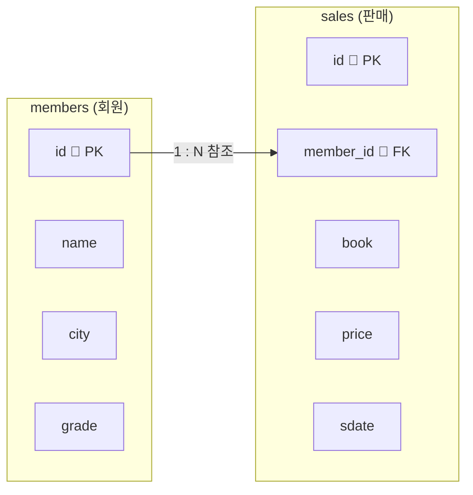

# 2026년 1학기 (재직자반) 데이터베이스 보안 기말고사

> **시험 안내**
> - MySQL Workbench에서 **아래 「문제 셋업」 SQL(테이블 생성 + 데이터 입력)을 먼저 위에서부터 순서대로 실행**한 뒤 문제를 푸시오.
> - 데이터베이스·테이블 생성과 데이터 입력은 **이미 셋업으로 제공**되며, 채점 대상이 아닙니다.
> - 각 문제의 **「SQL 작성란」** 에 답을 작성하시오. **출력 칼럼 별칭(`AS ...`)은 문제에 적힌 그대로** 사용하시오.
> - 한 문제는 한 가지만 묻습니다. **배점**: 각 문제 10점 — **합계 100점**.
{: .prompt-info }

---

## 문제 셋업 (먼저 실행)

이번 시험은 **온라인 서점**을 가정합니다.
회원 정보를 담는 `members` 테이블과, 판매(구매) 내역을 담는 `sales` 테이블을 사용합니다.



- 한 명의 회원은 여러 번 구매할 수 있습니다 → **1:N 관계**
- `sales.member_id`는 `members.id`를 외래키로 참조합니다.

### 1. 데이터베이스·테이블 만들기

```sql
CREATE DATABASE final_db;
USE final_db;

CREATE TABLE members (
  id    INT          PRIMARY KEY AUTO_INCREMENT,
  name  VARCHAR(20)  NOT NULL,
  city  VARCHAR(20)  NOT NULL,
  grade VARCHAR(10)  DEFAULT '일반'
);

CREATE TABLE sales (
  id        INT          PRIMARY KEY AUTO_INCREMENT,
  member_id INT          NOT NULL,
  book      VARCHAR(30)  NOT NULL,
  price     INT          NOT NULL,
  sdate     DATE         NOT NULL,
  FOREIGN KEY (member_id) REFERENCES members(id)
);
```

### 2. 데이터 입력

아래 표의 데이터를 두 테이블에 입력합니다. (`id`는 자동 증가이므로 직접 넣지 않습니다.)

**`members` — 회원 5명**

| id | name | city | grade |
|---|---|---|---|
| 1 | 김도윤 | 서울 | VIP |
| 2 | 이수아 | 부산 | 일반 |
| 3 | 박서준 | 서울 | 일반 |
| 4 | 최예린 | 대구 | VIP |
| 5 | 정시우 | 서울 | 일반 |

**`sales` — 판매 10건**

| id | member_id | book | price | sdate |
|---|---|---|---|---|
| 1 | 1 | 자료구조 | 28000 | 2026-04-03 |
| 2 | 1 | 알고리즘 | 32000 | 2026-04-06 |
| 3 | 2 | 데이터베이스 | 30000 | 2026-04-09 |
| 4 | 3 | 운영체제 | 27000 | 2026-04-12 |
| 5 | 2 | 네트워크 | 25000 | 2026-04-15 |
| 6 | 4 | 자료구조 | 28000 | 2026-04-20 |
| 7 | 1 | 보안개론 | 22000 | 2026-05-04 |
| 8 | 3 | 데이터베이스 | 30000 | 2026-05-09 |
| 9 | 5 | 알고리즘 | 32000 | 2026-05-13 |
| 10 | 4 | 파이썬 | 18000 | 2026-05-22 |

> 회원(부모)을 먼저, 판매(자식)를 나중에 넣습니다. 아래 SQL을 그대로 실행하세요.
{: .prompt-warning }

```sql
INSERT INTO members (name, city, grade) VALUES ('김도윤', '서울', 'VIP');
INSERT INTO members (name, city, grade) VALUES ('이수아', '부산', '일반');
INSERT INTO members (name, city, grade) VALUES ('박서준', '서울', '일반');
INSERT INTO members (name, city, grade) VALUES ('최예린', '대구', 'VIP');
INSERT INTO members (name, city, grade) VALUES ('정시우', '서울', '일반');

INSERT INTO sales (member_id, book, price, sdate) VALUES (1, '자료구조',     28000, '2026-04-03');
INSERT INTO sales (member_id, book, price, sdate) VALUES (1, '알고리즘',     32000, '2026-04-06');
INSERT INTO sales (member_id, book, price, sdate) VALUES (2, '데이터베이스', 30000, '2026-04-09');
INSERT INTO sales (member_id, book, price, sdate) VALUES (3, '운영체제',     27000, '2026-04-12');
INSERT INTO sales (member_id, book, price, sdate) VALUES (2, '네트워크',     25000, '2026-04-15');
INSERT INTO sales (member_id, book, price, sdate) VALUES (4, '자료구조',     28000, '2026-04-20');
INSERT INTO sales (member_id, book, price, sdate) VALUES (1, '보안개론',     22000, '2026-05-04');
INSERT INTO sales (member_id, book, price, sdate) VALUES (3, '데이터베이스', 30000, '2026-05-09');
INSERT INTO sales (member_id, book, price, sdate) VALUES (5, '알고리즘',     32000, '2026-05-13');
INSERT INTO sales (member_id, book, price, sdate) VALUES (4, '파이썬',       18000, '2026-05-22');
```

> `SELECT * FROM members;` 5줄, `SELECT * FROM sales;` 10줄이 보이면 셋업 완료입니다. ✅
{: .prompt-info }

---

## 시험지 (문제)

> 각 문제의 **「SQL 작성란」** 에 직접 SQL을 작성해 실행하세요.
> 정답·해설은 시험지 아래 **「정답 및 해설」** 에 따로 모아 두었습니다.
{: .prompt-tip }

---

### 문제 1. 외래키 구문 해석 (10점) — 서술형

`sales` 테이블을 만들 때 쓴 아래 한 줄이 **무슨 뜻인지** 설명하시오.

```sql
FOREIGN KEY (member_id) REFERENCES members(id)
```

**답안란 (서술형)**

> _여기에 설명을 작성하세요._

---

### 문제 2. 참조무결성 (10점)

`members`에 **존재하지 않는 회원 번호**(예: 99)를 참조하도록 `sales`에 한 행을 넣는 `INSERT` 문을 작성하고, 이 문장이 실행될 때 **참조무결성에 위배되어 거부된다는 것**을 한 줄로 설명하시오.

**SQL 작성란**

```sql
-- 여기에 SQL을 작성하세요.

```

---

### 문제 3. 판매 건수 — COUNT (10점)

`sales` 테이블 **전체 판매 건수**를 `COUNT(*)`로 세어, 별칭 `판매건수`로 출력하는 SQL을 작성하시오.

**SQL 작성란**

```sql
-- 여기에 SQL을 작성하세요.

```

---

### 문제 4. 판매액 합계 — SUM (10점)

`sales` 테이블 **전체 판매액(`price`)의 합계**를 `SUM`으로 구해, 별칭 `총판매액`으로 출력하는 SQL을 작성하시오.

**SQL 작성란**

```sql
-- 여기에 SQL을 작성하세요.

```

---

### 문제 5. 조건 조회 — BETWEEN (10점)

**4월(2026-04-01 ~ 2026-04-30)** 에 들어온 판매 건수를, `sdate`에 **`BETWEEN`을 사용**해 별칭 `사월판매수`로 출력하는 SQL을 작성하시오.

**SQL 작성란**

```sql
-- 여기에 SQL을 작성하세요.

```

---

### 문제 6. 두 테이블 연결 — 기본 (10점)

두 테이블을 `sales.member_id = members.id`로 연결해, **회원이름(별칭 `회원이름`) · 도서(별칭 `도서`) · 가격(별칭 `가격`)** 을 조회하는 SQL을 작성하시오. (연결에 성공하면 10줄이 나온다.)

**SQL 작성란**

```sql
-- 여기에 SQL을 작성하세요.

```

---

### 문제 7. 연결 + 회원 조건 (10점)

두 테이블을 연결한 뒤 `members.name = '김도윤'` 조건을 더해, **'김도윤'** 회원이 구매한 **회원이름(별칭 `회원이름`) · 도서(별칭 `도서`) · 가격(별칭 `가격`)** 을 조회하는 SQL을 작성하시오.

**SQL 작성란**

```sql
-- 여기에 SQL을 작성하세요.

```

---

### 문제 8. 연결 + 괄호 · OR · AND (10점)

두 테이블을 연결한 뒤, 도서가 **'자료구조' 또는 '데이터베이스'** 이면서 **가격이 30,000원 이상**인 판매를 **회원이름(별칭 `회원이름`) · 도서(별칭 `도서`) · 가격(별칭 `가격`)** 으로 조회하는 SQL을, **`(book = '자료구조' OR book = '데이터베이스')` 처럼 괄호를 사용**해 작성하시오.

**SQL 작성란**

```sql
-- 여기에 SQL을 작성하세요.

```

---

### 문제 9. 연결 + 집계 (10점)

두 테이블을 연결한 뒤 `members.grade = 'VIP'` 조건을 더해, **'VIP' 등급** 회원이 구매한 **`price`의 합계**를 `SUM`으로 구해 별칭 `VIP구매합계`로 출력하는 SQL을 작성하시오.

**SQL 작성란**

```sql
-- 여기에 SQL을 작성하세요.

```

---

### 문제 10. 연결 + 정렬 — ORDER BY (10점)

두 테이블을 연결해 모든 판매를 **회원이름(별칭 `회원이름`) · 도서(별칭 `도서`) · 가격(별칭 `가격`)** 으로 조회하되, **가격이 높은 순서**로 `ORDER BY ... DESC` 정렬하는 SQL을 작성하시오.

**SQL 작성란**

```sql
-- 여기에 SQL을 작성하세요.

```

---
---

## 정답 및 해설

> 아래는 채점·복습용 정답입니다. 배포용 시험지로 쓸 때는 이 「정답 및 해설」 절을 삭제하세요.
{: .prompt-warning }

---

### 문제 1. 외래키 구문 해석

**핵심**: `sales`의 `member_id` 칼럼을, `members`의 `id` 칼럼을 참조하는 **외래키**로 지정한다는 뜻입니다.

- `sales.member_id`에는 `members.id`에 **실제로 존재하는 값만** 넣을 수 있습니다. (= 참조무결성)
- `members`가 **부모 테이블**, `sales`가 **자식 테이블**이며, 이 한 줄이 두 테이블을 잇는 **연결 고리**가 됩니다.

---

### 문제 2. 참조무결성

**예시 답안** — `members`에 없는 회원 번호(예: 99)를 참조하는 `INSERT`:

```sql
INSERT INTO sales (member_id, book, price, sdate)
VALUES (99, '클라우드', 26000, '2026-05-25');
```

실행하면 입력이 **거부**됩니다 → `ERROR 1452: Cannot add or update a child row: a foreign key constraint fails`

**결론 — 참조무결성 위배**: `sales.member_id`는 `members.id`를 참조하는 외래키인데, `members`에 `id=99`인 회원이 **없으므로** 이 `INSERT`는 **참조무결성에 위배되어 거부**됩니다. (부모 테이블에 없는 값을 자식 테이블에 넣을 수 없음 — `member_id`에 1~5 외의 없는 값을 쓴 `INSERT`라면 모두 정답입니다.)

---

### 문제 3. 판매 건수 — COUNT

```sql
SELECT COUNT(*) AS 판매건수
FROM sales;
```

결과: `10`

---

### 문제 4. 판매액 합계 — SUM

```sql
SELECT SUM(price) AS 총판매액
FROM sales;
```

결과: `272000`

---

### 문제 5. 조건 조회 — BETWEEN

```sql
SELECT COUNT(*) AS 사월판매수
FROM sales
WHERE sdate BETWEEN '2026-04-01' AND '2026-04-30';
```

결과: `6`

---

### 문제 6. 두 테이블 연결 — 기본

```sql
SELECT members.name  AS 회원이름,
       sales.book    AS 도서,
       sales.price   AS 가격
FROM sales, members
WHERE sales.member_id = members.id;
```

결과 (10줄):

```
회원이름 | 도서         | 가격
김도윤   | 자료구조     | 28000
김도윤   | 알고리즘     | 32000
이수아   | 데이터베이스 | 30000
박서준   | 운영체제     | 27000
이수아   | 네트워크     | 25000
최예린   | 자료구조     | 28000
김도윤   | 보안개론     | 22000
박서준   | 데이터베이스 | 30000
정시우   | 알고리즘     | 32000
최예린   | 파이썬       | 18000
```

> `WHERE sales.member_id = members.id` 연결 조건이 빠지면 결과가 5×10=50줄로 엉터리로 불어납니다. **절대 빼면 안 됩니다.**
{: .prompt-warning }

---

### 문제 7. 연결 + 회원 조건

```sql
SELECT members.name  AS 회원이름,
       sales.book    AS 도서,
       sales.price   AS 가격
FROM sales, members
WHERE sales.member_id = members.id
  AND members.name = '김도윤';
```

결과 (3줄):

```
회원이름 | 도서     | 가격
김도윤   | 자료구조 | 28000
김도윤   | 알고리즘 | 32000
김도윤   | 보안개론 | 22000
```

---

### 문제 8. 연결 + 괄호 · OR · AND

```sql
SELECT members.name  AS 회원이름,
       sales.book    AS 도서,
       sales.price   AS 가격
FROM sales, members
WHERE sales.member_id = members.id
  AND (sales.book = '자료구조' OR sales.book = '데이터베이스')
  AND sales.price >= 30000;
```

결과 (2줄):

```
회원이름 | 도서         | 가격
이수아   | 데이터베이스 | 30000
박서준   | 데이터베이스 | 30000
```

> 괄호로 `(자료구조 OR 데이터베이스)`를 먼저 묶지 않으면, 가격 조건이 데이터베이스에만 걸리고 **자료구조(28000)가 가격과 상관없이 모두 포함**되어 결과가 달라집니다. **괄호를 반드시 사용하세요.**
{: .prompt-warning }

---

### 문제 9. 연결 + 집계

```sql
SELECT SUM(sales.price) AS VIP구매합계
FROM sales, members
WHERE sales.member_id = members.id
  AND members.grade = 'VIP';
```

결과: `128000` (김도윤 82,000 + 최예린 46,000)

---

### 문제 10. 연결 + 정렬 — ORDER BY

```sql
SELECT members.name  AS 회원이름,
       sales.book    AS 도서,
       sales.price   AS 가격
FROM sales, members
WHERE sales.member_id = members.id
ORDER BY sales.price DESC;
```

결과 (가격 높은 순, 10줄):

```
회원이름 | 도서         | 가격
정시우   | 알고리즘     | 32000
김도윤   | 알고리즘     | 32000
이수아   | 데이터베이스 | 30000
박서준   | 데이터베이스 | 30000
김도윤   | 자료구조     | 28000
최예린   | 자료구조     | 28000
박서준   | 운영체제     | 27000
이수아   | 네트워크     | 25000
김도윤   | 보안개론     | 22000
최예린   | 파이썬       | 18000
```

> 정렬(`ORDER BY`)은 연결 조건 `WHERE` **뒤에** 옵니다. 가격이 같은 행끼리의 순서는 환경에 따라 다를 수 있습니다.
{: .prompt-info }

---

## 출제 범위 표

| 문제 | 평가 능력 (한 가지) | 핵심 SQL |
|---|---|---|
| 1 | 외래키 구문 **해석** (서술형) | `FOREIGN KEY (...) REFERENCES ...(...)` |
| 2 | 참조무결성 | 실패하는 `INSERT` 작성 |
| 3 | 집계 — 건수 | `COUNT(*)` |
| 4 | 집계 — 합계 | `SUM(price)` |
| 5 | 조건 — 범위 | `BETWEEN ... AND ...` |
| 6 | 두 테이블 연결 | `FROM a, b WHERE a.fk = b.pk` |
| 7 | 연결 + 회원 조건 | `AND members.name = ...` |
| 8 | 연결 + 괄호·OR·AND | `AND (... OR ...) AND ...` |
| 9 | 연결 + 집계 | `SUM(...)` + 등급 조건 |
| 10 | 연결 + 정렬 | `ORDER BY ... DESC` |

> 핵심 흐름: **외래키 이해(해석·참조무결성) → 세고·더하고(COUNT·SUM) → 조건(범위) → 두 테이블 연결 → 연결 위에 조건·집계·정렬 얹기.** 한 문제는 한 능력만, 작성란에 SQL로 답합니다.
{: .prompt-tip }

---
