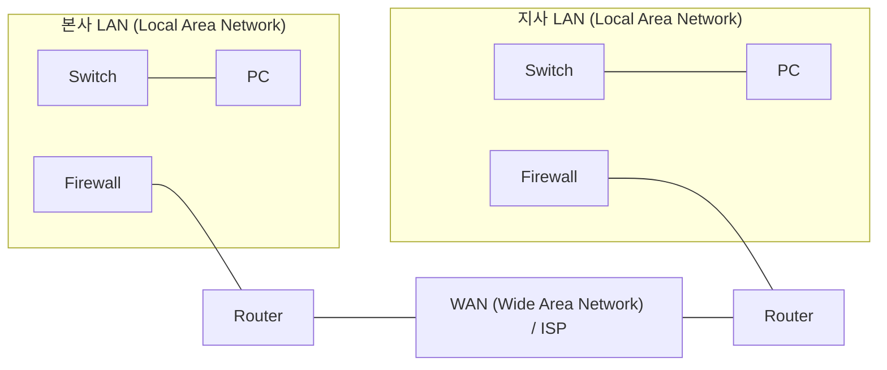
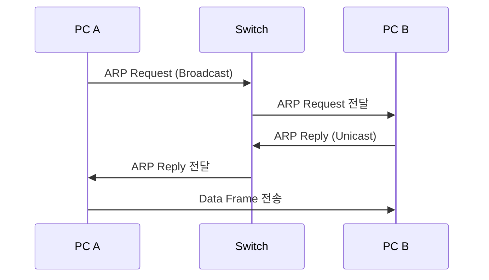
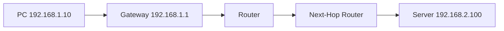
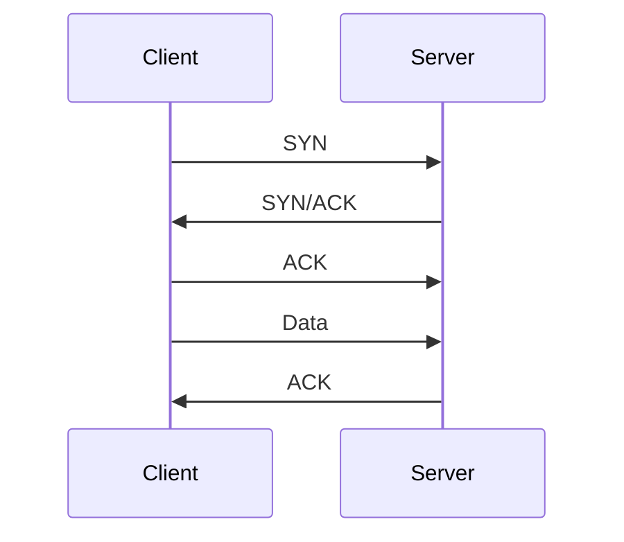
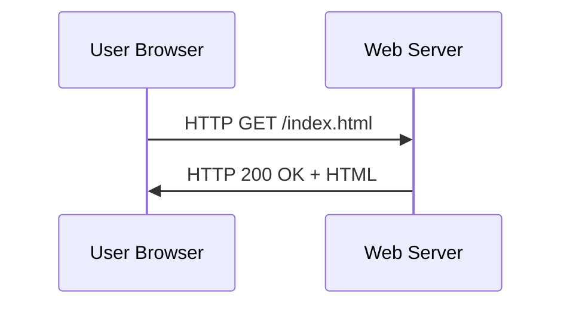
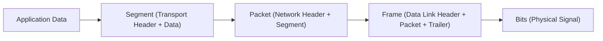
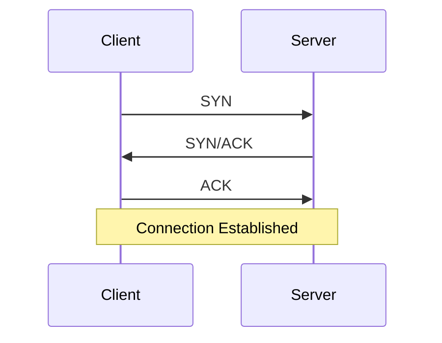
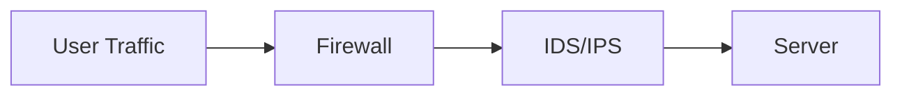

# 컴퓨터 네트워크 기초

---

# Part 1. 네트워크 역사와 보안 관점의 출발점

## 1.1 네트워크 이전 시대: 왜 불편했을까

초기 컴퓨터는 서로 연결되지 않은 "고립된 장비"였음.
데이터를 옮기려면 물리 매체(디스크, 테이프)를 들고 이동해야 했음.

이 방식의 문제:

- 속도가 매우 느림
- 실시간 협업 불가
- 장비 고장 시 복구가 어려움

즉, 컴퓨터 성능이 좋아져도 "연결"이 없으면 활용 가치가 낮았음.

---

## 1.2 ARPANET(Advanced Research Projects Agency Network)

ARPANET(Advanced Research Projects Agency Network)은 현대 인터넷의 출발점으로 알려져 있음.
1969년에 미국 국방고등연구계획국(ARPA, Advanced Research Projects Agency) 주도로 시작됨.

중요한 변화는 "패킷 교환(Packet Switching)"의 채택임.

패킷(Packet)은 ==컴퓨터 네트워크를 통해 전송되는 데이터를 작게 나눈 기본 단위==로, 제어 정보(헤더)와 실제 데이터(페이로드)로 구성된 형식화된 데이터 덩어리.
효율적인 전송을 위해 데이터를 분할하여 목적지 주소와 순서 정보를 포함해 보내며, 수신 측에서 이를 다시 조립하여 원본 데이터를 복원

### 패킷 교환(Packet Switching)이 왜 혁신이었나

패킷 교환(Packet Switching)은 데이터를 잘게 나누어 전송함.
일부 경로가 고장 나도 다른 경로로 우회할 수 있음.

이는 보안 관점에서도 중요함.

- 장점: 패킷 단위 분석이 가능해서 이상 트래픽을 식별하기 쉬움
- 단점: 중간 구간에서 도청, 위조, 재전송 공격 시도가 가능함
---

## 1.3 TCP/IP(Transmission Control Protocol / Internet Protocol) 표준화

TCP/IP(Transmission Control Protocol / Internet Protocol)가 확립되면서
서로 다른 제조사 장비도 연결할 수 있게 됨.(1973~1974)

1983년 ARPANET의 TCP/IP 전환은 인터넷 역사에서 핵심 사건으로 평가됨.

결론:
연결성이 폭발적으로 증가했고, 동시에 공격 표면(Attack Surface)도 크게 증가함.

---

## 1.4 웹 시대와 보안의 필수화

1990년대 이후 웹이 확산되며 일반 사용자도 인터넷을 사용하게 되었음.
이 시기부터 보안은 "옵션"이 아니라 "필수"가 됨.

- 전자상거래: 결제 정보 보호 필요
- 메신저/이메일: 개인정보 보호 필요
- 클라우드: 데이터 접근 통제 필요

---

# Part 2. 네트워크 기본 개념: 프로토콜, LAN/WAN, 토폴로지

## 2.1 프로토콜(Protocol)이란 무엇인가

프로토콜(Protocol)은 통신 규칙의 집합임.
"대화의 문법"이라고 생각하면 쉬움.

프로토콜이 정의하는 것:

- 메시지 형식(헤더 구조)
- 통신 순서(누가 먼저 말하는가)
- 오류 발생 시 복구 방식
- 연결 시작/유지/종료 방식

### 왜 보안에서 중요한가

공격은 대부분 규칙 위반 또는 규칙 악용임.

- 위조된 주소 사용
- 정상 절차를 과도하게 반복
- 비정상 순서로 패킷 전송

즉, 프로토콜(Protocol)을 모르면 공격인지 정상인지 구분하기 어려움.

---

## 2.2 회선 교환(Circuit Switching) vs 패킷 교환(Packet Switching)

| 항목 | 회선 교환(Circuit Switching) | 패킷 교환(Packet Switching) |
|---|---|---|
| 통신 방식 | 전용 회선을 먼저 확보 | 데이터를 쪼개서 공유망 사용 |
| 장점 | 품질 예측 쉬움 | 자원 효율 높음, 확장 유리 |
| 단점 | 비효율적 자원 사용 | 지연/순서 뒤바뀜 가능 |
| 보안 관점 | 비교적 고정 경로 | 중간 경로 공격/분석 이슈 |

---

## 2.3 LAN(Local Area Network)과 WAN(Wide Area Network)

### LAN(Local Area Network)

LAN(Local Area Network)은 건물, 교실, 사무실 같은 근거리 네트워크임.

- 대체로 빠르고 지연이 낮음
- 스위치(Switch) 중심 연결
- 내부 사용자 간 통신 비율이 높음

### WAN(Wide Area Network)

WAN(Wide Area Network)은 지점-지점 간 장거리 연결망임.

- 라우터(Router)와 통신사업자망을 경유
- 지연과 경로 변화가 상대적으로 큼
- 본사-지사, 국가 간 연결에서 필수

### 쉬운 예시

- 학교 컴퓨터실 내부: LAN(Local Area Network)
- 학교와 교육청 서버 연결: WAN(Wide Area Network)

### 보안 관점

- LAN은 내부 확산(Lateral Movement) 통제가 중요
- WAN은 경계 통제와 암호화 터널이 중요

---

## 2.4 네트워크 토폴로지(Topology)

토폴로지(Topology)는 장비 연결 형태를 의미함.
네트워크의 성능, 장애 전파, 보안 정책 위치를 결정하는 중요한 개념임.

| 토폴로지(Topology) | 특징 | 장점 | 단점 | 보안 포인트 |
|---|---|---|---|---|
| 버스(Bus) | 한 선로 공유 | 구조 단순 | 장애 전파 쉬움 | 스니핑 위험 |
| 스타(Star) | 중앙 장비 중심 | 관리 쉬움 | 중앙 장애점 | 중앙 장비 하드닝 필수 |
| 링(Ring) | 순환형 연결 | 흐름 예측 가능 | 일부 장애에 취약 | 우회 경로 설계 필요 |
| 메시(Mesh) | 다중 경로 | 고가용성 | 비용/복잡도 높음 | 경로 정책 관리 중요 |
| 하이브리드(Hybrid) | 혼합형 | 현실적 확장 | 설계 난도 높음 | 문서화/표준화 중요 |

---

# Part 3. OSI 7계층(Open Systems Interconnection 7 Layers)과 캡슐화

## 3.1 OSI 7계층(Open Systems Interconnection 7 Layers)의 목적

OSI 7계층(Open Systems Interconnection 7 Layers)은
복잡한 통신 과정을 단계로 나눠 설명하는 참조 모델임.

보안에서 OSI를 쓰는 이유:

- 사고를 빠르게 분해할 수 있음
- 장비별 탐지/차단 위치를 명확히 할 수 있음
- 팀 간 공통 언어로 소통 가능함

## 3.2 계층별 역할과 보안 의미

| 계층 | 이름 | 핵심 역할 | 대표 예시 | 보안 관점 질문 |
|---|---|---|---|---|
| L7 | 응용(Application) | 사용자 서비스 | HTTP, DNS, FTP | 요청 내용이 정상인가? |
| L6 | 표현(Presentation) | 인코딩/암호화 | TLS, 인증서 | 암호화 설정이 안전한가? |
| L5 | 세션(Session) | 연결 상태 유지 | 세션 토큰 | 세션 탈취 흔적이 있는가? |
| L4 | 전송(Transport) | 신뢰성, 포트 | TCP, UDP | 어떤 포트로 접근했는가? |
| L3 | 네트워크(Network) | 경로, 주소 | IP, ICMP | 출발지/목적지가 타당한가? |
| L2 | 데이터링크(Data Link) | 인접 전송 | MAC, ARP, Ethernet | MAC 매핑이 정상인가? |
| L1 | 물리(Physical) | 신호 전달 | 케이블, 무선 | 물리 연결 문제는 없는가? |

---

## 3.3 L2/L3/L4/L7 집중 이해

이 구간은 시험용 암기가 아니라, 실제 보안 분석에서 가장 많이 쓰는 4개 계층을 깊게 이해하는 파트임.
아래 원칙으로 보면 이해가 쉬움.

1. L2(Data Link): "같은 네트워크 안에서 누구에게 줄지" 결정
2. L3(Network): "다른 네트워크까지 어떤 경로로 갈지" 결정
3. L4(Transport): "어떤 서비스 프로세스와 통신할지" 결정
4. L7(Application): "실제로 무엇을 요청하고 응답했는지" 확인

---

### L2 데이터링크(Data Link): 인접 구간 전달의 계층

L2(Data Link)의 핵심 임무는 "같은 링크(같은 근거리 네트워크) 안에서 프레임(Frame)을 전달"하는 것임.
즉, 장비는 L2에서 MAC(Media Access Control) 주소를 보고 다음 장비를 찾음.

대표 요소:

- MAC(Media Access Control) 주소
  
  
- 이더넷(Ethernet) 프레임
- ARP(Address Resolution Protocol)
- 스위치(Switch)의 MAC 주소 테이블
  
- 

#### L2에서 ARP(Address Resolution Protocol)는 어떻게 동작하는가

PC A가 192.168.10.20으로 통신하려면 먼저 목적지의 MAC 주소를 알아야 함.

1. PC A: "192.168.10.20의 MAC 주소가 누구인가?" ARP 요청 브로드캐스트
2. PC B(192.168.10.20): "내 MAC은 00-11-22-33-44-55" ARP 응답
3. PC A: ARP 캐시에 저장 후 이더넷 프레임 전송

#### L2 보안 포인트

- ARP 스푸핑(ARP Spoofing): 공격자가 가짜 ARP 응답을 보내 MAC 매핑을 오염
- MAC 플러딩(MAC Flooding): 스위치 테이블을 과부하시켜 트래픽 누출 시도
- 방어: 정적 ARP, 동적 ARP 검사(Dynamic ARP Inspection), 포트 보안(Port Security)

---

### L3 네트워크(Network): 경로와 주소의 계층

L3(Network)의 핵심은 IP(Internet Protocol) 주소 기반으로 "어디까지 어떻게 갈지"를 결정하는 것임.
다른 네트워크로 갈 때는 라우터(Router)가 필수임.

대표 요소:

- IP(Internet Protocol) 주소
- 서브넷 마스크(Subnet Mask)
- 기본 게이트웨이(Default Gateway)
- 라우팅 테이블(Routing Table)
- ICMP(Internet Control Message Protocol)

#### L3에서 라우팅은 어떻게 동작하는가

예시: PC(192.168.1.10)가 서버(192.168.2.100)로 접속

1. PC는 목적지 IP가 다른 대역임을 확인
2. 패킷을 기본 게이트웨이(예: 192.168.1.1)로 전송
3. 라우터는 라우팅 테이블을 보고 다음 홉(Next Hop) 결정
4. 목적지 네트워크 라우터가 최종 서버로 전달

#### L3 보안 포인트

- IP 스푸핑(IP Spoofing): 출발지 IP를 위조해 추적을 어렵게 함
- 경로 우회/오설정: 잘못된 라우팅 정책은 내부망 노출로 이어짐
- ICMP 악용: 과도한 ICMP 트래픽으로 탐지 회피 또는 정보 수집

---

### L4 전송(Transport): 서비스 식별과 연결 제어

L4(Transport)의 핵심은 "어떤 애플리케이션 프로세스와 통신할지"를 정하는 것임.
이때 포트(Port) 번호가 사용됨.

대표 요소:

- TCP(Transmission Control Protocol)
- UDP(User Datagram Protocol)
- 포트(Port)
- 세션(Session), 재전송(Retransmission), 흐름 제어(Flow Control)

#### TCP(Transmission Control Protocol)는 어떻게 동작하는가

TCP는 신뢰성 있는 연결지향 통신임.

1. 3-Way Handshake로 연결 수립
2. 데이터 순서 보장 및 재전송
3. ACK(Acknowledgement)로 수신 확인
4. 연결 종료 절차 수행

#### UDP(User Datagram Protocol)는 어떻게 동작하는가

UDP는 연결 수립 없이 바로 데이터그램(Datagram)을 전송함.

- 장점: 빠르고 단순함
- 단점: 손실/순서 보장 없음
- 사용 예: 실시간 스트리밍, 일부 DNS 질의

#### L4 보안 포인트

- SYN Flooding: TCP 연결 대기 큐 고갈 유도
- 포트 스캔(Port Scan): 열린 서비스 탐색
- UDP 반사/증폭: 분산 서비스 거부 공격(DDoS) 악용 가능

---

### L7 응용(Application): 사용자가 체감하는 서비스 계층

L7(Application)은 사용자가 직접 접하는 계층임.
웹, 메일, 이름 해석, 파일 전송 같은 실제 서비스가 여기서 동작함.

대표 프로토콜:

- HTTP(HyperText Transfer Protocol)
- HTTPS(HyperText Transfer Protocol Secure)
- DNS(Domain Name System)
- FTP(File Transfer Protocol)
- SMTP(Simple Mail Transfer Protocol)

#### L7에서 HTTP(HyperText Transfer Protocol)는 어떻게 동작하는가

브라우저가 서버에 요청을 보내고 서버가 응답함.

1. 클라이언트: `GET /index.html` 요청
2. 서버: 상태코드 + 콘텐츠 응답

#### L7에서 DNS(Domain Name System)는 어떻게 동작하는가

1. 사용자가 도메인 입력
2. DNS 질의로 IP 주소 조회
3. 조회된 IP로 실제 서비스 접속

L7은 공격자에게도 매력적인 계층임.
사용자 계정 탈취, 악성 요청 주입, 세션 하이재킹(Session Hijacking) 등 실제 피해가 이 계층에서 발생함.

#### L7 보안 포인트

- 웹 공격: SQL Injection, Cross-Site Scripting
- 피싱(Phishing): 사용자 신뢰 악용
- 인증 우회, 권한 상승, 세션 탈취

---

### 3.3 정리: 왜 이 네 계층을 먼저 보는가

침해사고 분석 시 아래 순서가 가장 실용적임.

1. L3: 출발지/목적지 IP 확인
2. L4: 포트와 세션 상태 확인
3. L7: 요청 내용과 행위 의도 확인
4. L2: 같은 구간의 위조/가로채기 가능성 확인

이 순서를 습관화하면, "이상 징후"를 "근거 기반 결론"으로 바꾸는 속도가 빨라짐.

동영상 링크

(패킷의 여정)

---

## 3.4 캡슐화(Encapsulation)와 역캡슐화(Decapsulation)

송신 시 각 계층 헤더(Header)가 붙고,
수신 시 반대로 벗겨지는 과정임.

### 보안 분석 예시

웹 서버 공격 로그를 본다고 가정함.

- L3(Network): 출발지 IP(Internet Protocol) 확인
- L4(Transport): 목적지 포트(Port) 443 확인
- L7(Application): 비정상 요청 경로(`/admin`, SQLi 패턴) 확인

즉, 헤더(Header)와 페이로드(Payload)를 함께 봐야 공격이 보임.

## 3.5 1학년 비유: 봉투 속의 봉투

1. 편지 내용: 응용 데이터
2. 내부 봉투: 서비스 정보(Port)
3. 택배 상자: 목적지 주소(IP)
4. 배송 라벨: 근거리 전달 정보(MAC)

보안 담당자는 "겉봉투 정보"로 먼저 위험도를 판단하고,
필요하면 "내용"까지 분석함.

---

# Part 4. 핵심 프로토콜(Protocol)과 취약점

## 4.1 ARP(Address Resolution Protocol)

ARP(Address Resolution Protocol)는
IP(Internet Protocol) 주소를 MAC(Media Access Control) 주소로 바꾸는 절차임.

동작 예시:

1. PC A가 "192.168.0.20의 MAC 주소가 누구인가?" 질의
2. 해당 장비가 자신의 MAC 주소 응답
3. PC A가 ARP 캐시에 저장 후 통신

보안 취약점:

- ARP 스푸핑(ARP Spoofing): 거짓 응답으로 트래픽 가로채기
- 중간자 공격(MITM, Man-In-The-Middle) 기반이 되기 쉬움

## 4.2 DNS(Domain Name System)

DNS(Domain Name System)는
사람이 읽는 도메인 이름을 IP(Internet Protocol) 주소로 변환함.

예:

- `www.example.com` -> `93.184.216.34`

보안 취약점:

- 피싱(Phishing): 유사 도메인으로 유도
- 파밍(Pharming): DNS 응답 변조로 악성 사이트 유도
- DNS 터널링(DNS Tunneling): 비정상 데이터 은닉 통신

---

## 4.3 TCP(Transmission Control Protocol)와 3-Way Handshake

TCP(Transmission Control Protocol)는
신뢰성 있는 연결지향 전송을 제공함.

3-Way Handshake 절차:

1. SYN(Synchronize)
2. SYN/ACK(Synchronize/Acknowledgement)
3. ACK(Acknowledgement)

### SYN Flooding(Synchronize Flooding) 이론

공격자가 SYN 요청만 대량 전송하고 ACK를 완료하지 않으면,
서버는 반쯤 열린 연결(Half-open Connection)을 유지하느라 자원이 고갈됨.

이것이 서비스 거부 공격(DoS, Denial of Service)의 대표적 원리 중 하나임.

---

## 4.4 UDP(User Datagram Protocol)

UDP(User Datagram Protocol)는 비연결형 전송임.

- 장점: 빠름, 오버헤드 적음
- 단점: 손실/순서 보장 없음

보안 관점:

- 반사/증폭 기반 분산 서비스 거부 공격(DDoS, Distributed Denial of Service)에 악용될 수 있음

---

## 4.5 HTTP(HyperText Transfer Protocol) vs HTTPS(HyperText Transfer Protocol Secure)

### HTTP(HyperText Transfer Protocol)

- 평문(Plaintext) 전송
- 중간에서 내용 노출 가능
- 로그인 정보, 쿠키(Cookie) 탈취 위험

### HTTPS(HyperText Transfer Protocol Secure)

- TLS(Transport Layer Security) 암호화 사용
- 기밀성(Confidentiality), 무결성(Integrity), 인증(Authentication) 제공
- 인증서(Certificate) 검증이 중요

핵심 메시지:
**"연결 가능"보다 "신뢰 가능한 연결"이 중요함.**

---

# Part 5. 보안 장비와 실무형 분석 질문

## 5.1 방화벽(Firewall), 침입 탐지 시스템(IDS), 침입 방지 시스템(IPS)

| 장비 | 풀네임 | 주 계층 | 역할 |
|---|---|---|---|
| 방화벽 | Firewall | L3/L4 중심 | IP/Port 정책 기반 허용/차단 |
| IDS | Intrusion Detection System | L4~L7 | 의심 패턴 탐지, 경보 |
| IPS | Intrusion Prevention System | L4~L7 | 탐지 + 실시간 차단 |

## 5.2 사고 대응에서 실제로 던지는 질문

1. 누가(출발지 IP) 접근했는가?
2. 어디로(목적지 자산) 접근했는가?
3. 어떤 프로토콜과 포트를 사용했는가?
4. 요청 내용(페이로드)이 정상 업무와 어떻게 다른가?
5. 방화벽/IDS/서버 로그가 같은 이야기를 하는가?

---

