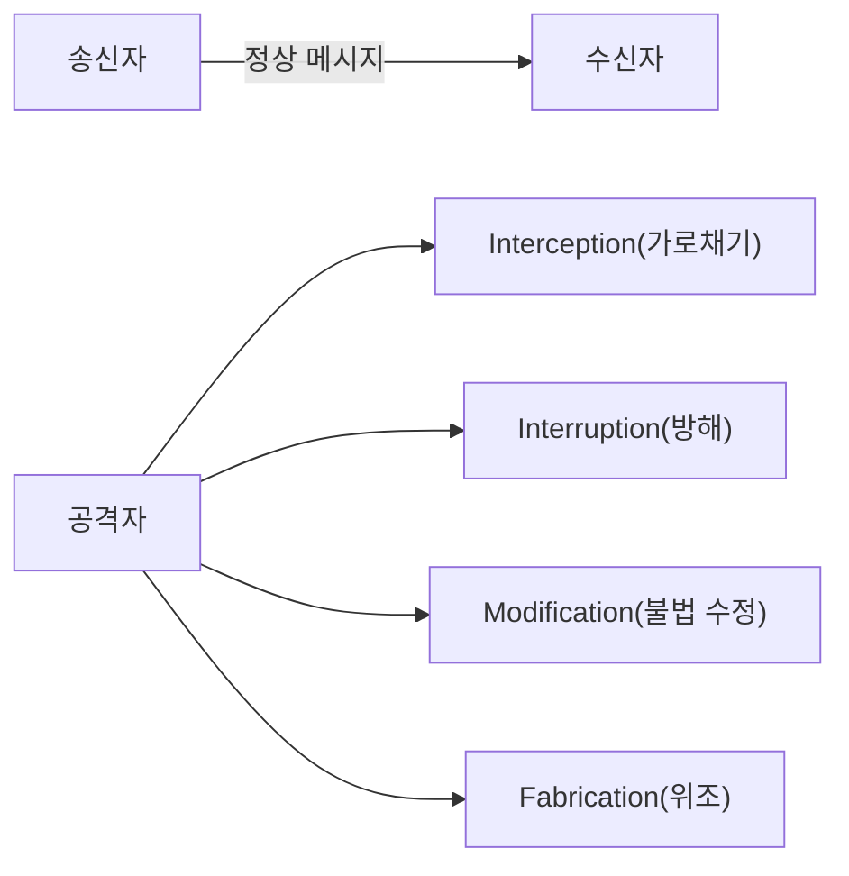
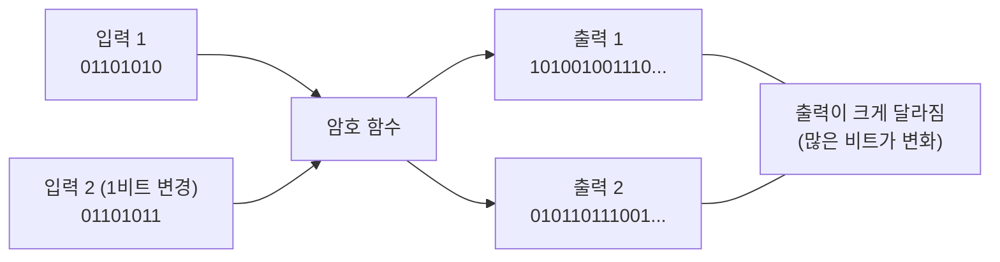
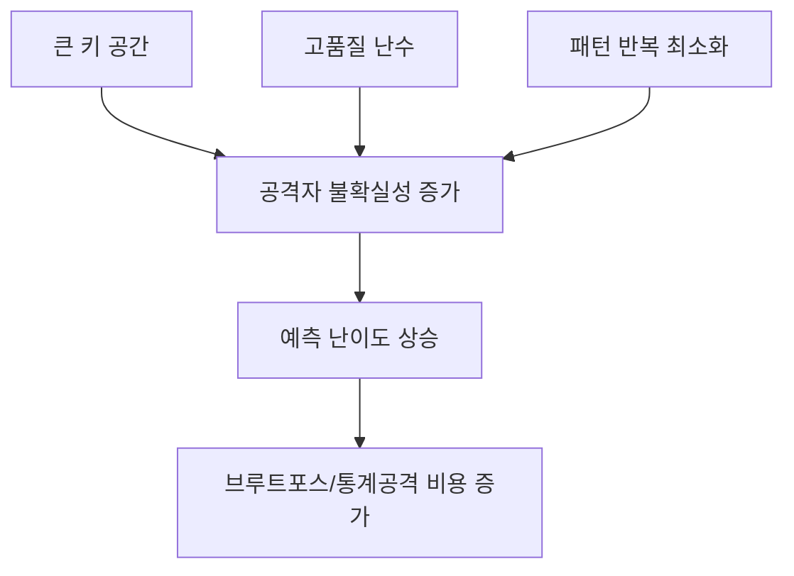

# 암호의 기초

---

## 프롤로그: 한 통의 메시지에서 시작하는 보안 이야기

준근이 보라에게 메시지를 보낸다.

`“7시에 치맥 콜?”`


겉보기에 평범한 대화지만, 이 한 줄 안에는 정보보안의 거의 모든 문제가 숨어 있다.

- 누군가 몰래 읽을 수 있다. (도청)
  
  
- 누군가 메시지를 못 가게 막을 수 있다. (방해)
  
  
- 누군가 내용을 바꿀 수 있다. (변조)
  
  
- 누군가 가짜 메시지를 끼워 넣을 수 있다. (위조)
  
  

즉, 통신이 있는 곳에는 반드시 공격 가능성이 있다.  
암호학은 이 현실을 전제로 만들어진 학문이다.

---

## 1장. 통신의 역사와 보안 문제의 탄생

### 1.1 통신의 본질

통신(communication)은 한쪽의 정보를 다른 쪽에 전달하는 행위다.  
전기가 없던 시대에는 사람을 보내거나, 말 같은 이동 수단을 쓰거나, 봉화/연기 신호를 사용했다.


이 방식의 한계는 분명했다.

- 느리다
- 멀리 보내기 어렵다
- 중간에서 정보가 바뀌거나 새기 쉽다

결국 “정보 전달”과 “정보 보호”는 처음부터 분리될 수 없는 문제였다.

### 1.2 모스 부호와 전화: 통신의 도약

모스 부호(Morse Code)는 전기 기반 통신의 출발점이었다.  
짧은 신호와 긴 신호를 조합해 메시지를 보낸다. SOS 같은 표준 신호는 긴급 상황에서 생존률 자체를 바꿨다. 


[모르스부호 체험하기](https://morsecode.world/international/translator.html)

전화(telephone)의 등장은 또 다른 도약이었다.

- 부호가 아니라 음성을 직접 전달
- 먼 거리의 실시간 의사소통 가능
- 통신이 특수 기술에서 일상 인프라로 확장
---

### 1.3 ARPANET에서 인터넷까지

1969년 ARPANET은 패킷 교환 네트워크의 역사적 시작점이다.  
1983년 TCP/IP 전환은 오늘날 인터넷의 기술적 출발점으로 본다.

여기서 중요한 것은 단순히 “컴퓨터 연결”이 아니다.  
**서로 다른 시스템이 공통 규약으로 대화할 수 있게 된 것**이 핵심이다.

### 1.4 프로토콜: 통신의 약속

프로토콜(protocol)은 통신 규약이다.

- 어떤 형식으로 보낼지
- 어느 속도로 전송할지
- 오류가 나면 어떻게 복구할지
- 언제 통신을 끝낼지

대표 사례:

- FTP: 파일 전송 규약
- HTTP: 웹 문서 전송 규약
- TCP/IP: 신뢰 전달과 주소 지정의 기반 규약

> 선을 연결했다고 통신이 되는 것이 아니다.  
> 통신은 결국 약속(프로토콜)의 문제다.
{: .prompt-tip }

---

## 2장. 네트워크 위협 모델: 정상 소통은 어떻게 공격받는가

네트워크를 송신자와 수신자만의 선한 공간으로 보면 보안을 절대 이해할 수 없다.  
현실의 네트워크는 항상 공격자가 개입 가능한 구조다.



### 2.1 네 가지 대표 공격


---


---

## 3장. 암호학의 등장인물과 목표

### 3.1 암호란 무엇인가

암호(cipher)는 평문을 제3자가 이해할 수 없는 형태로 바꾸는 체계다.  
하지만 암호학은 단순 은닉만 다루지 않는다. “읽기 방지 + 위조 방지 + 출처 검증”의 조합을 다룬다.


### 3.2 암호학의 표준 역할 모델

- Alice: 송신자
- Bob: 수신자
- Eve: 도청자
- Mallory: 적극적 조작 공격자

이 모델은 설계 요구사항을 명확히 한다.

### 3.3 암호학의 핵심 목표

1. 기밀성(가장 중요)
- 공격자가 메시지를 읽지 못해야 한다.

2. 무결성/진정성
- 공격자가 메시지를 바꿔도 수신자가 검출할 수 있어야 한다.

3. 인증성
- 이 메시지가 정말 기대한 송신자에게서 온 것인지 확인해야 한다.

---

## 4장. 키(Key)와 Kerckhoffs 원리

### 4.1 키(Key)와 키스페이스(Keyspace)

암호를 자물쇠에 비유하면 이해가 쉽다.

- **알고리즘(algorithm)** = 자물쇠의 **구조(설계도)**. "어떻게 잠그고 여는가"라는 방식이다.
- **키(key)** = 그 자물쇠를 실제로 여는 **열쇠**. "이번에 쓰는 비밀 값"이다.

같은 모양의 자물쇠(같은 알고리즘)라도 열쇠(키)가 다르면 서로 못 연다. 즉 **암호화 결과는 알고리즘 + 키**가 함께 결정한다.

> **키(Key)**: 평문을 암호문으로 바꾸거나(암호화), 암호문을 평문으로 되돌릴 때(복호화) 사용하는 **비밀 값(parameter)**이다.
{: .prompt-tip }

**키스페이스(Keyspace, 키 공간)**는 **키가 될 수 있는 모든 경우의 수**를 말한다. 앞서 본 시저 암호를 떠올려 보자.

- 시저 암호의 키는 "몇 칸 미는가"이고, 가능한 값은 `0~25` → **키스페이스 크기 = 26**.
- 26가지뿐이라 사람이 손으로도 전부 대입(전수조사, brute force)해 30초면 깬다.

키스페이스가 작으면 공격자는 **모든 키를 다 넣어보는 것만으로** 암호를 뚫는다. 그래서 현대 암호는 키스페이스를 천문학적으로 키운다.

| 키 길이 | 키스페이스 크기 | 의미 |
|---|---|---|
| 시저 암호 | 26 ($\approx 2^{4.7}$) | 즉시 전수조사 가능 |
| 56비트(구형 DES) | $2^{56} \approx 7.2 \times 10^{16}$ | 현대 장비로 깨짐(폐기) |
| 128비트(AES-128) | $2^{128} \approx 3.4 \times 10^{38}$ | 사실상 전수조사 불가 |
| 256비트(AES-256) | $2^{256}$ | 우주의 시간으로도 불가능 |

> **핵심**: 키 길이가 1비트 늘면 키스페이스는 **2배**가 된다. 그래서 "키를 길게"라는 말은 곧 "공격자의 전수조사 비용을 지수적으로 키운다"는 뜻이다.
{: .prompt-info }

### 4.2 키는 왜 본질인가

암호 시스템은 알고리즘과 키로 이뤄진다.  
강한 알고리즘이라도 키가 유출되면 방어는 즉시 무너진다.

키 관리의 생애주기:


실전 사고의 상당수는 알고리즘 자체보다 키 운영 실패에서 발생한다.

### 4.3 암호 알고리즘과 키의 분리

초창기 암호는 "**방식 자체를 비밀로**" 했다. 적이 암호를 푸는 방법(알고리즘)을 모르게 숨긴 것이다. 하지만 이 방식에는 치명적 약점이 있다.

- 방식이 한 번 새면(분석·내부자·노획) **시스템 전체를 처음부터 다시** 만들어야 한다.
- 외부 검증을 받을 수 없어 **숨은 결함**을 발견하기 어렵다.

그래서 현대 암호는 **알고리즘과 키를 분리**한다.

- **알고리즘은 공개**한다 → 전 세계 전문가가 검증하고, 표준으로 신뢰가 쌓인다.
- **키만 비밀**로 한다 → 비밀로 지켜야 할 대상을 "방식 전체"에서 "작은 키 하나"로 좁힌다.

이렇게 하면 키가 유출돼도 **새 키로 바꾸기만** 하면 된다. 같은 알고리즘을 그대로 쓰면서 키만 교체하므로 복구가 빠르고 비용도 적다.

> **비유**: 도어록(알고리즘)은 모델명이 공개돼도 안전하다. 정작 비밀로 지켜야 할 것은 **비밀번호(키)** 하나다. 비밀번호가 새면 도어록을 통째로 바꾸는 게 아니라 **비밀번호만 바꾸면** 된다.
{: .prompt-tip }

이 "알고리즘 공개 / 키 비밀" 사고방식을 원리로 못 박은 사람이 바로 케르크호프스다.

### 4.4 Kerckhoffs 원리


암호 시스템의 안전성은 알고리즘 비밀이 아니라 키 비밀에 의존해야 한다.  
즉, 알고리즘이 공개되어도 안전해야 한다.

이 원리에서 실무 교훈이 나온다.

- 검증된 표준 알고리즘을 사용하라.
- 독자 암호를 만들지 마라.
- 구현·운영의 정확성을 우선하라.

> 암호 시스템의 안전성은 키(key)의 비밀성에만 의존해야 하며, 암호화 알고리즘이 공개되어도 안전해야 한다.
> Don't roll your own crypto"(자신만의 암호를 만들지 마라)
{: .prompt-warning }

### 4.5 암호학으로 할 수 없는 것

암호는 강력하지만 **만능이 아니다**. 암호가 풀어주는 문제와 풀어주지 못하는 문제를 구분해야 한다.

- **끝점(endpoint)은 못 지킨다.** 암호는 "전송 중인 데이터"를 보호한다. 하지만 송신자·수신자의 PC가 이미 악성코드에 감염돼 있으면, 화면에 뜬 평문을 그대로 훔쳐간다. 암호는 통로를 지킬 뿐, 양 끝의 컴퓨터를 지키지 못한다.
- **키 관리 실패는 못 막는다.** 키가 유출·약하게 설정·재사용되면 아무리 강한 알고리즘도 무력하다. (OTP도 키를 재사용하면 깨진다 → 뒤의 VENONA 사례)
- **사람(사회공학)은 못 막는다.** 사용자가 비밀번호를 알려주거나 피싱에 속으면 암호는 개입할 여지가 없다.
- **가용성(서비스 거부)은 지키지 못한다.** 암호는 기밀성·무결성·인증을 다루지만, 공격자가 트래픽을 폭주시켜 서비스를 마비(DoS)시키는 것은 막지 못한다.
- **메타데이터는 가리기 어렵다.** 내용은 암호화해도 "누가-누구와-언제-얼마나" 통신했는지(트래픽 분석)는 그대로 드러날 수 있다.
- **영원히 안전하지 않다.** 오늘의 안전은 "현재의 계산 능력 기준"이다. 컴퓨팅 발전(예: 양자컴퓨터)이나 새 공격 기법이 나오면 기준이 바뀐다.

> 암호는 **만병통치약이 아니라 도구**다. 끝점 보안·키 관리·사용자 교육·접근통제와 **함께** 쓰여야 비로소 시스템이 안전해진다. (1주차 "심층 방어"와 연결되는 지점)
{: .prompt-warning }

---

## 5장. 고전 암호 I - 전치 암호(Transposition)

전치 암호는 문자를 다른 문자로 바꾸지 않고, 위치를 바꾸는 방식이다. (가장 고전적인 방법의 하나)

[전치 암호의 예](https://www.youtube.com/watch?v=bcyUJK1BvHw)


장점:
- 이해가 쉽다.
- 손으로도 실습 가능하다.

한계:
- 글자 빈도 자체는 보존된다.
- 통계 분석에 취약하다.

---
### 5.1 스키테일(Scytale) 암호


고대 스파르타에서 사용한 대표 전치 암호 도구다.  
동일한 지름의 막대를 공유해야만 복원 가능하다.

핵심 교훈:

- 물리 도구도 결국 키 역할을 한다.
- 키 공유와 키 보호 문제는 시대가 바뀌어도 사라지지 않는다.

#### 5.1.1 스키테일(Scytale) 암호 실습해보기

준비물:


- 볼펜
- 긴 종이띠 1장(가로 2cm, 세로 30cm 정도)
- 원통 1개(연필/마커)

실습:

1. 종이띠를 원통에 겹치지 않게 나선형으로 감습니다.
2. 감긴 상태에서 7시에 치맥 콜 같은 문장을 가로로 씁니다.
3. 종이띠를 풀어 적힌 내용을 그대로 적으면 암호문입니다.
4. 같은 굵기의 원통에 다시 감으면 원문이 복원됩니다.

포인트:

- 원통 굵기가 키입니다.
- 굵기가 조금만 달라도 해독이 틀어집니다.

---

## 6장. 고전 암호 II - 치환 암호(Substitution)

치환 암호 : 평문에 사용된 문자를 다른 문자(기호)로 치환
### 6.1 시저 암호(Caesar cipher)


* 기원전 100년경, 줄리어스 시저가 사용
* 알파벳을 일정 수(3)만큼 평행 이동
  
  
* 시저 암호는 알파벳을 일정 칸 이동시키는 방식이다.

$$
C = (P + k) \bmod 26
$$

$$
P = (C - k) \bmod 26
$$

* [Caesar Cipher 확인](https://www.boxentriq.com/ciphers/caesar-cipher)

* 입문에는 좋지만, **키 공간이 작아 전수조사에 약하다**.


#### 6.1 시저 암호(Caesar cipher) 의 해독

* 모든 경우의 수 대입으로 가능하다!
	* 시저 암호 알고리즘 : 알파벳을 일정 수 만큼 평행 이동
	* 가능한 후보 키의 수 : 0 ~ 25가지
	* 26가지 키를 순서대로 사용(여기서 키 공간은 키가 될 수 있는 경우의 수를 말함)


---
### 6.2 단일 문자 치환(Mono-alphabetic)

- 알파벳을 임의 1:1 대응으로 치환하면 키 공간은 커진다.
	- 시저 암호도 단일 문자 치환 암호의 한 종류(참고: 시저암호는순서대로대응)


그러나 언어의 통계적 편향 때문에 빈도분석으로 약점이 드러난다.


영어 빈도 예:

- 고빈도: E, T, A, O, I, N
- 저빈도: Z, Q, X, J
---
### 6.3 빈도분석(단일 문자 치환 암호 해독)

1. 암호문의 문자 출현 빈도 계산(Frequency Analysis)
	1. 영어에서 자주 나오는 글자 순서
		1. E, T, A, O, I, N (가장 빈번) / 드문 글자: Z, Q, X, J
2. 1글자/2글자/3글자 단어 패턴 대입
	1. 한 글자 단어: A, I
	2. 두 글자 단어: OF, TO, IN, IT, IS
	3. 세 글자 단어: THE, AND, FOR
3. 반복 글자
	1. LETTER → 같은 글자 2번 연속 (TT, EE)
	2. 영어에서 자주 반복되는 글자: LL, EE, SS, OO, TT

이 과정은 정답을 한 번에 맞히는 문제가 아니라, 가설을 체계적으로 줄여가는 분석 과정이다.

- **암호문: WKLV LV D WHVW  ===> 맞추어 보세요**

---

## 7장. 다중 문자 치환과 카시스키 테스트

다중 문자 치환(Poly-alphabetic)은 한 개가 아니라 여러 치환표를 사용한다.  
단일치환보다 강하지만, 반복 키를 쓰면 패턴 단서가 남는다.

### 7.1 Vigenere 암호


비제네르 암호는 **다중 문자 치환 암호(poly-alphabetic substitution)**의 대표 예시다.  
시저 암호처럼 한 칸씩 고정 이동하지 않고, **키워드의 각 문자**에 따라 이동 칸이 바뀐다.

* 동일 문자의 암호문 생성 가능
* 많은 수의 임의 문자들로 만든 암호 키 사용
* 암호 키 길이 및 문자의 출현 빈도 추측 제한 → 빈도 분석 방법 적용 방지


### 7.2 카시스키 테스트(Kasiski Examination)

**1863년 프로이센 군인 프리드리히 카시스키(Friedrich Kasiski)가 개발한 비제네르 암호**
**해독 기법임**
▪ 암호문에서 반복되는 문자열을 찾아 키워드 길이를 추정함.
▪ 왜 반복 패턴이 나타나는가? : 원문에 같은 단어가 나타나고, 그 위치에서 같은 키 글자가
대응되면 동일한 암호문이 생성됨.

핵심 흐름:

1. 반복 문자열 탐지
2. 반복 간 거리 계산
3. 거리들의 공약수로 키 길이 후보 산출
4. 후보 키 길이별로 그룹 분할 후 빈도분석

**즉, “강해진 암호”도 패턴이 남으면 해독 가능성이 생긴다.**

---

## 8장. 에니그마: 기계식 암호의 정점과 한계

에니그마(Enigma)는 제2차 세계대전 독일이 사용한 기계식 암호 장치다.


* 3장의 회전자(rotor)와 반사판을 이용 문자 치환
  

강력했던 이유:

- 로터 회전에 따른 동적 치환
- 큰 키 공간
- 같은 입력 문자도 시점에 따라 다른 출력
- [에니그마 에뮬레이터](https://www.101computing.net/enigma-machine-emulator/)

깨진 이유:


- 운용 절차 반복
- 예측 가능한 메시지 형식
- 인간 습관에서 나온 패턴
- [Imitation Game 에니그마 해독 장면](https://www.youtube.com/watch?v=o4dCzqy1JrY)
  

정리하면, 보안은 알고리즘 강도만으로 결정되지 않는다.  
운용 보안(OPSEC)이 무너지면 강한 암호도 약해진다.

---

## 9장. 암호 해독이 전쟁을 바꾼 순간: JN-25와 미드웨이


암호학은 교실의 퍼즐이 아니라 국가 전략 도구다.

핵심 스토리:

* 일본 해군 암호체계 JN-25 분석 진행|
   
* 진주만에서 연합군 정보부대 Station HYPO에서는 수학자, 언어학자, 그리고 암호 전문가들이 밤낮없이 일본의 암호문 분석
	* 조제프 로체포트 중령은 마치 탐정처럼 일본군의 통신 트래픽을 추적
	  
	    
	* AF 에 대한 지점 탐문 중
	  
	  
	* AF 담수 부족 허위 전문으로 반응 유도
	  
	* AF=미드웨이 확인
	* 1942년 6월 4~7일 미드웨이 해전(Battle of Midway) : 태평양 전쟁의 전환점이 된 해전임.
	  
		* 진주만 공습(1941.12.7) 이후 일본군이 태평양을 장악하던 상황에서, 미국은 미드웨이 섬 방어를 위해 대규모 함대 투입을 결정
		* 암호 해독이 전쟁 승패를 결정한 대표적 사례임. 군사력보다 정보력이 우위를 가져온 경우

이 사례의 메시지:

- 올바른 정보 + 적절한 시점 = 전략 우위
- 암호는 전술 지원을 넘어 전쟁의 방향을 바꿀 수 있다.

---

## 10장. 이론적 완전성: 일회용 패드(OTP)

OTP(One-Time Pad)는 이론적으로 완전기밀성을 제공하는 체계다.  
클로드 섀넌의 정보이론 관점에서도 완전성이 증명된다.


성립 조건:

1. 키 길이 = 평문 길이
2. 키는 진정한 난수
3. 키는 단 1회 사용
4. 키는 사전에 안전하게 공유


* 치명적 단점:
	* 키 길이 = 메시지 길이 (1GB 파일은 1GB 키 필요)
	* 키 배송 문제 (안전하게 키를 전달하는 게 더 어려움)
	* 키 재사용 시 즉시 해독됨 (VENONA 프로젝트 -소련 암호 해독 사례)

즉, 수학적 최강과 운영 가능성은 서로 다른 문제다.

---

## 11장. 눈사태 효과(Avalanche Effect)와 불확실성

### 11.1 눈사태 효과

입력 1비트 변화가 출력 전체의 큰 변화로 이어져야 한다.  
이 특성이 약하면 공격자는 입력-출력 상관관계를 추적해 구조를 역추론할 수 있다.




### 11.2 불확실성(Uncertainty)

공격자에게 예측 가능성을 줄이는 것이 핵심이다.




- 충분한 키 공간
- 높은 난수 품질
- 반복 패턴 최소화

현대 암호 설계는 결국 예측 가능성을 제거하는 공학이다.

---

## 12장. 암호 알고리즘의 안전성 평가

암호 알고리즘을 "만드는 것"만큼이나 "얼마나 안전한지 신뢰기관이 검증·인정하는 체계"가 중요하다. 좋은 알고리즘이라도 객관적 평가 체계가 없으면 실무에서 믿고 쓰기 어렵다.

### 12.1 안전성 개념

주어진 암호 시스템의 안전성을 말할 때는 두 가지 관점이 있다.

| 관점 | 의미 |
|---|---|
| **계산적 안전(Computationally Secure)** | 암호시스템을 공격하기 위해 필요한 **계산량이 매우 커서** 현실적으로 공격할 수 없는 경우 |
| **무조건적 안전(Unconditionally Secure)** | **무한한 계산능력**이 있어도 공격할 수 없는 경우(예: OTP) |

암호 알고리즘 사용자가 해야 할 일은 다음 두 기준 중 **하나 또는 전부**를 만족하는 알고리즘을 개발하는 것이다.

- 암호 **해독 비용**이 암호화된 정보의 **가치**를 초과
- 암호 **해독 시간**이 정보의 **유효 기간**을 초과

> **워크 팩터(Work Factor)**  
> 공격자가 암호화 방법을 깨는 데 걸리는 노력(계산 자원)임. 암호를 깨는 데 드는 **시간과 비용이 크도록** 설계하는 것이 암호 설계의 목표임.
>
> **엔트로피(Entropy)**  
> 1948년 **Shannon**이 도입한 개념으로, **정보량 또는 정보의 불확실도**를 측정하는 수학적 개념임. 확률변수 $X$의 확률분포 $p(X)$를 알 때의 불확실도를 $H(X)$로 나타냄.
{: .prompt-tip }

### 12.2 암호제품 평가체계

- 정보보호제품의 안전한 선택·사용을 위한 기본 선택기준은 **신뢰기관의 안전성 평가 결과**임. 가장 대표적인 것이 **CC(Common Criteria)** 기반의 정보보호제품 평가임.
- 단, CC 기반 평가기준에서는 핵심기술인 **암호 알고리즘에 대한 평가기준을 따로 명시하지 않고**, 각국이 **독자적으로** 하도록 규정함. 이를 구현한 **암호모듈**에 대한 평가 또한 독자적으로 하도록 규정함.
- 암호모듈에 대한 안전성 평가로 가장 널리 참조되는 것은 미국 **NIST**가 수행하는 **CMVP(Cryptographic Module Validation Program)**이며, 세계적으로 인정받음.

> **CC(Common Criteria, 공통평가기준)**  
> 선진 각국이 서로 다른 평가 기준으로 평가를 시행하여 초래되던 시간·비용 낭비 등 제반 문제점을 없애기 위해 개발됨. **1998년** 미국·캐나다·영국·프랑스·독일 간에 **상호인정협정(CCRA)**이 체결됨. CC는 평가 원칙·평가 모델, 보안 기능 요구사항(11개), 7등급 평가를 위한 보증 요구사항(8개)으로 구성됨.
>
> **FIPS(Federal Information Processing Standards Publication)**  
> NIST가 발행하는 정보처리 관계 출판물("핍스"). 예: 암호모듈 **FIPS 140-2**, 암호알고리즘(AES) **FIPS 197**.
{: .prompt-info }

### 12.3 암호기술 평가 — 평가 종류

평가는 **암호 알고리즘 → 암호모듈 → 정보보호제품 → 응용시스템**의 **동심원 계층**으로 이루어짐(그림 2.1.17).

```
┌───────────────────────────────────────────────┐
│ 응용 시스템 (Application System)                 │  ← 항공관제센터 등 (Common Criteria)
│  ┌─────────────────────────────────────────┐  │
│  │ 정보보호제품 (Security Product)            │  │  ← 침입차단/탐지시스템 (Common Criteria)
│  │  ┌───────────────────────────────────┐  │  │
│  │  │ 암호모듈 (Crypto Module)            │  │  │  ← FIPS 140-2
│  │  │  ┌─────────────────────────────┐  │  │  │
│  │  │  │ 암호알고리즘 (Crypto Algorithm) │  │  │  │  ← AES / FIPS 197
│  │  │  └─────────────────────────────┘  │  │  │
│  │  └───────────────────────────────────┘  │  │
│  └─────────────────────────────────────────┘  │
└───────────────────────────────────────────────┘
```

| 평가 종류 | 대상 | 설명 |
|---|---|---|
| ① 암호 알고리즘 평가 | 탑재된 암호 알고리즘 | 알고리즘 **자체만** 평가 → 제품·시스템과 **독립적**으로 평가 가능. 일반적으로 알고리즘의 **이론적 안전성**만 평가 |
| ② 암호모듈 평가 | 암호서비스(기밀성·무결성 기능 모듈) | 이론적 안전성과는 **별도로**, 암호서비스 기능을 제공하는 **모듈의 안전성** 평가 |
| ③ 정보보호제품 평가 | 암호모듈 탑재 제품 | 예) 침입차단시스템(IPS), 침입탐지시스템(IDS) |
| ④ 응용시스템 평가 | 제품을 상호 연동한 시스템 | 예) 국가기관망 네트워크 보안성, 항공관제센터 안전성 |

### 12.4 평가 과정

- 응용시스템의 안전성을 직접 평가하는 것이 가장 바람직하나, 평가 기준·방법·체계를 마련하고 탑재 기술을 개별적으로 평가하기가 **상당히 어려움**.
- 따라서 응용시스템의 **가장 기본이 되는 암호 알고리즘**에 대한 안전성 평가가 **우선**되어야 함.
- 결국 다음 순서로 평가를 수행하는 것이 바람직함.

$$
\text{암호 알고리즘(이론적 안전성)} \;\rightarrow\; \text{검증된 암호모듈 탑재 정보보호 제품} \;\rightarrow\; \text{제품으로 구성된 응용시스템}
$$

### 12.5 암호모듈의 안전성 평가 (CMVP)

- **CMVP**는 1995년 7월 미국 **NIST**와 캐나다 **CSE(Communications Security Establishment)**가 공동 개발한, **암호 모듈의 안전성 검증**을 위한 프로그램임.
- CMVP가 요구하는 암호모듈 안전성 평가는 크게 세 가지로 나뉘며, 각 항목에 **안전성 등급**을 설정하여 기준을 마련함.
  - ㉠ 암호기술의 **구현 적합성** 평가
  - ㉡ 암호키 **운용 및 관리**
  - ㉢ **물리적 보안**

> **핵심 체크**
> - 암호모듈 평가 = 알고리즘의 이론적 안전성과 **별도**로, 암호서비스 기능을 제공하는 **암호모듈의 안전성** 평가.
> - **CMVP** = 암호 모듈의 안전성 **검증**을 위한 프로그램.
{: .prompt-info }

---

## 13장. 정보 은닉과 지적 재산권 보호 (Information Hiding & DRM)

암호가 "내용을 못 읽게" 한다면, 정보 은닉 기술은 "정보의 **존재 자체**를 숨기거나" "콘텐츠에 **소유·추적 정보**를 새겨 넣어" 저작권을 보호한다.

### 13.1 스테가노그래피(Steganography)

- 최초의 암호 유형은 고대 그리스에서 사용한 방식으로, 암호화라기보다는 **스테가노그래피**에 가까운 방법임.
- **암호화**가 「**비밀로 기록**하는 것(secret writing)」을 의미하는 반면, **스테가노그래피**는 「**감추어진 기록**(covered writing)」을 의미함.
  - 암호화 → 메시지의 **내용**을 은폐.
  - 스테가노그래피 → 다른 무언가로 감추어 **메시지 자체(존재)**를 은폐.
- 일반적으로 **사진파일** 등에 인간이 인지하지 못할 정도의 **미세한 부분(일부 비트)**에 변화를 주어 정보를 입력하는 방식이 많이 사용됨.

> 감추려는 기밀 정보를 이미지·MP3 파일 등에 숨기는 방식으로, 암호화(encryption)와는 **다른 개념**임. 고대 그리스에서부터 이용되어 왔으며, 테러리스트들이 **dead-drop(비밀 연락 수단)**으로 악용한 사례가 있음.
{: .prompt-tip }

### 13.2 디지털 워터마킹(Digital Watermarking)

- **워터마킹**이란 용어는 지폐 제조과정에서 위조지폐를 가려내기 위해, 물에 젖은 상태에서 특정 그림을 인쇄·건조한 뒤 **불빛에 비추면 그림이 보이도록** 하는 기술에서 유래함.
- 현재는 원본 내용을 왜곡하지 않는 범위에서, 혹은 사용자가 인식하지 못하도록 **저작권 정보를 디지털 콘텐츠에 삽입**하는 기술임.
- 즉, 이미지·오디오·비디오의 **일부 비트 대신 저작권 정보 등 다른 정보를 추가**해도, 사용자는 원래 미디어의 품질 손상을 **인지하지 못하는 성질**을 이용함.
- **분류**
  - **강한(강성) 워터마킹**: 공격을 받아도 쉽게 파괴·손상되지 않음.
  - **약한(연성) 워터마킹**: 공격을 받으면 쉽게 파괴·손상됨.

> **스테가노그래피 vs 워터마킹**  
> 스테가노그래피는 은폐 미디어를 단지 **비밀 정보를 숨기는 수단**으로 사용하는 반면, 디지털 워터마킹은 추가하는 정보가 **원래의 미디어와 관련 있는 정보(예: 저작권 정보)**라는 점이 다름. 또한 워터마킹의 가장 큰 차이점은 높은 **견고성(Robustness)** 요구임 — 미디어가 (우연이든 고의든) 수정되더라도 워터마크가 **탐지될 수 있어야** 하며, 공격자가 삽입된 저작권 정보를 **삭제·변경할 수 없어야** 함.
{: .prompt-tip }

### 13.3 핑거프린팅(Fingerprinting)

- 디지털 콘텐츠를 **구매할 때 구매자의 정보를 삽입**하여, 불법 배포 발견 시 **최초의 배포자(유출자)를 추적**할 수 있게 하는 기술임.
- 판매되는 콘텐츠마다 **구매자 정보**가 들어가므로, 불법 재배포된 콘텐츠에서 핑거프린팅된 정보를 추출하여 **구매자를 식별하고 법적 조치**를 가할 수 있음.

#### 표 — 스테가노그래피 · 워터마크 · 핑거프린트 비교 (표 2.1.5)

| 항목 | 스테가노그래피 | 워터마크 | 핑거프린트 |
|---|---|---|---|
| 은닉 정보 | 메시지 | 판매자 정보 | 구매자 추적정보 |
| 관심(목적) | 은닉 메시지 검출 | 저작권 표시 | 구매자 추적 |
| 트래킹 | 불가 | 가능 | 가능 |
| 불법예방 효과 | 하 | 중 | 상 |
| 저작권증명 효과 | 하 | 중 | 상 |
| 공격 강인성 | 상대적 약함 | 상대적 강함 | 상대적 강함 |

### 13.4 디지털 저작권 관리 (DRM, Digital Rights Management)

#### (가) 개요

- **DRM**은 디지털 콘텐츠 소유자가 자신의 콘텐츠에 대한 접근을, 자신 또는 위임자가 지정하는 **다양한 방식으로 제어**할 수 있게 하는 기술적 방법(또는 방법의 집합)임.
- DRM이 제어하는 콘텐츠 **접근**에는 실행(executing)·보기(viewing)·복제(copying)·출력(printing)·변경(altering) 등이 모두 포함되며, 디지털 콘텐츠에는 오디오·비디오·이미지·텍스트·멀티미디어·컴퓨터 소프트웨어 등이 포함됨.

#### (나) DRM 구성 요소

| 구성 요소 | 역할 |
|---|---|
| 메타데이터(Metadata) | 콘텐츠 생명주기 범위 내에서 관리되어야 할 각종 데이터의 **구조 및 정보** |
| 패키저(Packager) | 보호 대상 콘텐츠를 메타데이터와 함께 **Secure Container 포맷으로 패키징**하는 모듈 |
| 시큐어 컨테이너(Secure Container) | DRM 보호 범위 내에서 유통되는 콘텐츠의 **배포 단위** |
| 식별자(Identifier) | 콘텐츠를 **식별**하기 위한 식별자 |
| DRM 제어기(DRM Controller) | 사용자 PC·디바이스에서 콘텐츠가 **라이선스에 명시된 범위 내에서** 지속 보호되도록 프로세스를 제어 |

#### (다) DRM 모델

DRM 사용자는 **콘텐츠 제공자 · 콘텐츠 배포자 · 콘텐츠 소비자 · 클리어링하우스**로 분류됨. 이들 간의 **정보 흐름(실선)**과 **자금 흐름(점선)**은 다음과 같음(그림 2.1.19).

```
                       ┌──────────────────┐
        로열티 수수료 ↑ │   클리어링하우스    │ ↕ 디지털 권리 / 이용대금 지불
           사용 규칙 ↓ │  (Clearinghouse)  │
                       └──────────────────┘
          ┌───────────────┐                  ┌──────────────┐
          │  콘텐츠 제공자   │   보호된 콘텐츠    │    소비자      │
          │(Content Provider)│ ─ ─ ─ ─ ─ ─ ─ ▶ │ (Consumer)    │
          └───────────────┘                  └──────────────┘
                  │  보호된 콘텐츠      배포비용/이용대금 ▲ │
                  ▼                                   │ ▼
                       ┌──────────────────┐
                       │   배포자(Distributor) │
                       └──────────────────┘
        ── 정보 흐름     - - 자금 흐름
```

| 사용자(역할) | 설명 |
|---|---|
| **콘텐츠 제공자**(Content Provider) | 콘텐츠에 대한 **디지털 권리**를 가지고 권리 보호를 원하는 DRM 사용자. 콘텐츠 사용 규칙을 표현하는 언어를 **권리 표현 언어(REL, Rights Expression Language)**라 하며, 대표 REL은 **ODRL**(Open Digital Rights Language)과 **MPEG REL**임 |
| **콘텐츠 배포자**(Distributor) | 온라인 쇼핑몰과 같은 **유통 채널** 제공자. 정당한 소비자에게 안전하게 콘텐츠를 전달하고, 클리어링하우스로부터 **합당한 대금(배급 수수료)**을 분배받음 |
| **콘텐츠 소비자**(Content Consumer) | 클리어링하우스를 통해 콘텐츠에 대한 **권리를 요청**하고 합당한 대금을 지불 |
| **클리어링하우스**(Clearinghouse) | **디지털 허가(라이선스)**를 소비자에게 발급, 콘텐츠 제공자에게 **로열티**·배포자에게 **배급 수수료**를 지불하는 **재정적 거래**를 취급. 또한 모든 소비자의 **허가된 사용을 기록**할 책임을 짐 |

> **DRM (출처: TTA)**  
> 디지털 미디어의 불법·비인가 사용을 제한하기 위해 저작권/판권 소유자가 이용하는 정보 보호 기술의 일종인 **접근제어 기술**. 음원·영화 등 창작 미디어에 일반적으로 적용되며, 디지털 미디어의 생명 주기 동안 **사용 권한 관리·과금·유통 단계**를 관리함. 위반자 단속에 앞서 **사용을 허가하는 라이선스를 획득한 후** 사용이 가능하도록 기술적 통제가 가능한 시스템임. DRM에는 **암호 기술·키 관리 기술·워터마킹** 등 다양한 정보 보호 기술이 활용됨.
{: .prompt-info }

---

1. 통신에는 본질적으로 공격 가능성이 따라온다.
2. 암호는 수학 문제이면서 동시에 키 운영 문제다.
3. 고전 암호를 이해하면 현대 암호 설계 철학이 보인다.
4. 좋은 알고리즘은 **신뢰기관의 안전성 평가(CC·CMVP·FIPS)**를 거쳐야 실무에서 믿고 쓸 수 있다.
5. 암호가 "내용을 숨긴다"면, **정보 은닉(스테가노그래피)·워터마킹·핑거프린팅·DRM**은 콘텐츠의 **존재와 저작권**을 지킨다.

고전 암호를 배우는 이유는 오래된 기술을 추억하기 위해서가 아니다.  
현대 시스템에서도 반복되는 취약점의 원형을 읽어내기 위해서다.

> 암호학은 “숨기는 기술”이 아니라 “예측을 무력화하는 설계”다.
{: .prompt-tip }

