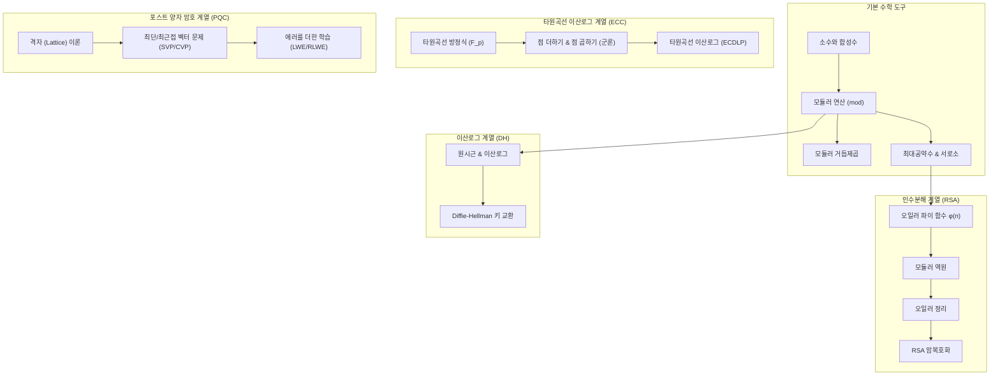

# 현대 암호 #2-1: 공개키 암호 일반

> 이 글은 **공개키 암호의 일반 이론**(왜 필요했나 · 기본 개념 · Diffie-Hellman · RSA · 하이브리드)과, 이를 떠받치는 **수학적 배경**(부록)을 함께 다룬다.  
> 이어지는 글: **[해시 함수와 응용(MAC/HMAC)](/posts/infosec-5-crypto-3-2-hash/)**, **[전자서명과 PKI](/posts/infosec-5-crypto-3-3-signature-pki/)**.
{: .prompt-info }

---

## 1. 왜 공개키 암호가 필요했는가

### 1.1 대칭키의 핵심 문제: 키 분배

대칭키 암호는 빠르고 강력하지만, 송신자와 수신자가 같은 키를 안전하게 공유해야 한다.

- 통신 전 키를 어떻게 전달할 것인가?
- 전달 과정에서 도청되면 어떻게 할 것인가?
- 사용자 수가 늘어날수록 키 관리가 폭발적으로 어려워진다.

이 문제를 **Key Distribution Problem**이라고 부른다.

### 1.2 1970년대 환경 변화

PDF에서 강조하듯 1970년대에는:

1. 컴퓨터 네트워크 확산
2. 이메일 등장
3. 전자상거래 구상
4. 글로벌 통신 급증

**이런 변화 때문에 “서로 미리 키를 공유하지 않고도 안전하게 시작하는 방법”이 필요해졌다.**

---

## 2. 공개키 암호의 기본 개념

공개키 암호(public key encryption)는 서로 다른 두 키를 사용한다.

- 공개키(public key): 누구에게나 공개
- 개인키(private key): 본인만 보관

핵심 아이디어:

1. 공개키로 암호화한 것은 대응 개인키로만 복호 가능
2. 개인키로 서명한 것은 대응 공개키로 검증 가능

> 공개키는 “열쇠를 나눠주는 방식”을 바꾼 혁신이다.
{: .prompt-tip }

---

## 3. Diffie-Hellman 키 교환

### 3.1 역사적 의미

1976년 Diffie-Hellman은 공개 채널에서 공통 비밀키를 만드는 방법을 제시했다.  
이 논문(`New Directions in Cryptography`)은 현대 공개키 암호학의 출발점이다.

### 3.2 알고리즘 직관

양측이 공개값 `p`(큰 소수), `g`(원시근)를 공유한다.

1. Alice는 비밀값 `a`를 고르고 `A = g^a mod p`를 보냄
2. Bob은 비밀값 `b`를 고르고 `B = g^b mod p`를 보냄
3. Alice: `K = B^a mod p`
4. Bob: `K = A^b mod p`

두 값은 같아 공통키가 된다.

$$
K = g^{ab} \bmod p
$$

#### 키 배송 문제(Key Distribution Problem)를 해결한 의미

- 공개 채널에서도 안전하게 공통 키를 만들 수 있다.
- 공개키 암호학의 출발점이 되었다.
- 인터넷 보안의 기초 토대를 마련했다.
- 두 사람이 미리 만나지 않아도 비밀을 공유할 수 있게 했다.

### 3.3 왜 안전한가

공격자는 `p, g, A, B`는 볼 수 있지만, `a` 또는 `b`를 찾기 어렵다.  
이 어려움이 **이산로그 문제(Discrete Logarithm Problem)**에 기반한다. (수학적 상세는 [부록 A.8](#부록-a8-diffie-hellmandh-키-교환))

### 3.4 한계: MITM 공격

DH만 단독으로 쓰면 인증이 없다.  
공격자가 중간에서 각각과 별도 키를 맺는 Man-in-the-Middle 공격이 가능하다.

결론:

1. DH는 키 교환에 강력하다.
2. 단독으로는 신원 보장이 부족하다.
3. 인증서/서명/PKI와 결합해야 안전하다. (→ **[전자서명과 PKI](/posts/infosec-5-crypto-3-3-signature-pki/)**)

---

## 4. RSA 공개키 암호

### 4.1 핵심 아이디어

RSA(1977, Rivest-Shamir-Adleman)는 “곱셈은 쉽고 소인수분해는 어렵다”는 비대칭성을 이용한다.

기본 식:

$$
C = M^e \bmod n,\quad M = C^d \bmod n
$$

### 4.2 키 생성 개요

1. 큰 소수 `p, q` 선택
2. `n = pq`
3. `\phi(n) = (p-1)(q-1)`
4. `gcd(e, \phi(n)) = 1`인 `e` 선택
5. `ed \equiv 1 \pmod{\phi(n)}`를 만족하는 `d` 계산

공개키는 `(e, n)`, 개인키는 `(d, n)`이다. (왜 복호화가 되는지의 증명은 [부록 A.7](#부록-a7-오일러-정리))

### 4.3 RSA 실습 링크

- [RSA 키 생성](https://emn178.github.io/online-tools/rsa/key-generator/)
- [RSA 복호](https://emn178.github.io/online-tools/rsa/decrypt/)
- [RSA 서명](https://emn178.github.io/online-tools/rsa/sign/)
- [RSA 서명 검증](https://emn178.github.io/online-tools/rsa/verify/)

#### 💡 실습 시나리오: Alice와 Bob의 비밀 통신
이해를 돕기 위해 Alice(수신자)와 Bob(송신자)이 RSA 도구를 사용하여 메시지를 안전하게 주고받고 서명하는 구체적인 예제를 따라해 봅시다.

##### 1단계: Alice의 키 쌍 생성 (Key Generation)
1. **[RSA 키 생성]** 링크를 클릭합니다.
2. Key Size를 `1024` 또는 `2048`로 선택하고 **Generate** 버튼을 누릅니다.
3. 화면에 생성된 두 개의 키 박스를 확인합니다:
   - **Public Key (공개키, $e$와 $n$)**: 모든 사람에게 공개되는 키입니다.
   - **Private Key (개인키, $d$와 $n$)**: Alice 자신만 안전하게 보관해야 하는 키입니다.
4. 실습을 위해 각각의 키를 메모장에 따로 복사해 둡니다.

##### 2단계: Bob이 Alice의 공개키로 메시지 암호화 (Encryption)
Bob은 Alice에게 "Meet me at 10 PM"이라는 비밀 메시지를 보내고 싶습니다.
1. **[RSA 암호화]** 도구(또는 복호화 도구 내 암호화 탭)를 엽니다.
2. **Public Key** 입력란에 **Alice의 공개키**를 붙여넣습니다.
3. Plaintext 입력란에 `Meet me at 10 PM`을 입력하고 **Encrypt**를 누릅니다.
4. 출력된 암호문(Base64 또는 Hex 형태의 무작위 문자열)을 복사하여 Alice에게 보냅니다. (이 암호문은 인터넷에 공개되어도 괜찮습니다.)

##### 3단계: Alice가 자신의 개인키로 메시지 복호화 (Decryption)
Alice는 Bob에게서 받은 암호문을 해독합니다.
1. **[RSA 복호]** 링크를 클릭합니다.
2. **Private Key** 입력란에 오직 자신만 알고 있는 **Alice의 개인키**를 붙여넣습니다.
3. Ciphertext 입력란에 Bob에게 받은 **암호문**을 붙여넣고 **Decrypt**를 누릅니다.
4. 원문인 `Meet me at 10 PM`이 정확히 복원되는지 확인합니다.

##### 4단계: Alice가 개인키로 서명 작성 (Signing)
Alice는 자신이 보낸 메시지("I will be there")가 위조되지 않았음을 Bob에게 증명하고자 합니다.
1. **[RSA 서명]** 링크를 클릭합니다.
2. **Private Key** 입력란에 **Alice의 개인키**를 붙여넣습니다.
3. Message 입력란에 `I will be there`를 입력한 뒤 **Sign**을 누릅니다.
4. 생성된 **전자서명값**(길고 복잡한 무작위 문자열)을 메시지와 함께 Bob에게 보냅니다.

##### 5단계: Bob이 Alice의 공개키로 서명 검증 (Verification)
Bob은 받은 메시지가 진짜 Alice가 보낸 것인지 확인합니다.
1. **[RSA 서명 검증]** 링크를 클릭합니다.
2. **Public Key** 입력란에 **Alice의 공개키**를 붙여넣습니다.
3. Message 입력란에 `I will be there`를 적고, Signature 입력란에 Alice에게 받은 **전자서명값**을 붙여넣은 뒤 **Verify**를 누릅니다.
4. **"Verified successfully"** (검증 성공) 메시지가 뜨는지 확인합니다. 만약 메시지의 글자 하나를 바꾸고(예: `I will be here`) 검증을 시도하면 실패하는지도 테스트해 보세요!

> 전자서명의 개념·목적·PKI 연결은 **[전자서명과 PKI](/posts/infosec-5-crypto-3-3-signature-pki/)** 글에서 자세히 다룬다.
{: .prompt-tip }

---

## 5. 공개키 암호의 장단점

장점:

1. 키 분배 문제 완화
2. 사용자 수 증가 시 확장성 우수
3. 전자서명/인증 체계 구축 가능

단점:

1. 대칭키 대비 연산이 느림
2. 구현 복잡도와 인증 인프라 필요

그래서 실무는 보통 하이브리드 방식을 쓴다.

---

## 6. 하이브리드 암호

실무 표준 흐름:

1. 공개키 방식으로 세션키(대칭키) 교환
2. 실제 데이터는 빠른 대칭키로 처리

여기서 **세션키(session key)** 는 "지금 이 연결에서만 잠깐 쓰는 일회용 대칭키"라고 생각하면 쉽다.  
예를 들어 웹브라우저가 은행 사이트에 접속하면, 처음부터 로그인 정보 전체를 공개키로 느리게 처리하는 것이 아니라:

1. 서버의 공개키 또는 공개키 기반 키교환 절차를 사용해
2. 브라우저와 서버만 아는 세션키를 안전하게 만들고
3. 그 뒤부터는 AES 같은 빠른 대칭키 암호로 데이터를 주고받는다.

왜 이렇게 나눠 쓰는가:

1. 공개키 암호는 안전한 키교환과 인증에 강하다.
2. 대칭키 암호는 속도가 빨라 대용량 데이터 처리에 유리하다.
3. 두 장점을 합치면 "안전하면서도 빠른" 구조가 된다.

생활식 비유:

- 공개키 암호: "비밀번호가 걸린 안전한 열쇠 전달 절차"
- 대칭키 암호: "전달받은 열쇠로 실제 창고 문을 빠르게 여닫는 과정"

즉, **공개키는 '열쇠를 안전하게 주고받는 역할'**, **대칭키는 '실제 내용을 빠르게 지키는 역할'** 을 맡는다.

> **다음 글로**: 메시지 무결성을 확인하는 해시·MAC/HMAC → **[해시 함수와 응용](/posts/infosec-5-crypto-3-2-hash/)**. 이어서 공개키를 "신뢰"하려면 키의 주인을 검증해야 한다 → **[전자서명과 PKI](/posts/infosec-5-crypto-3-3-signature-pki/)**.
{: .prompt-info }

---

# 부록 A. 공개키 암호를 위한 수학 배경

이 부록은 위 본문(DH·RSA)과 ECC·PQC에서 사용한 수학 개념만 따로 정리한 보조 자료다.  
핵심 목표는 다음 한 줄이다.

> RSA와 Diffie-Hellman의 식을 "그냥 외우는 것"이 아니라, 왜 작동하는지 설명할 수 있게 만드는 것
{: .prompt-tip }

### 부록 A.0 먼저 큰 그림

### 부록 A.1 소수, 합성수, 인수분해

#### A.1.1 소수와 합성수

- 소수(prime): `1`과 자기 자신만 약수로 갖는 1보다 큰 자연수 (`2, 3, 5, 7, 11, ...`)
- 합성수(composite): 소수가 아닌 1보다 큰 수 (`4, 6, 8, 9, 10, ...`)

#### A.1.2 왜 중요한가

1. RSA는 `n = p * q` 형태(`p`, `q`는 큰 소수)를 사용한다.
2. `n`만 보고 `p`, `q`를 찾는 인수분해가 어려우면 RSA가 안전해진다.
3. 즉, "곱하기는 쉽고, 다시 쪼개기는 어렵다"는 비대칭성이 핵심이다.

### 부록 A.2 모듈러 연산(mod): 시계 산술

#### A.2.1 기본 정의

`a mod n`은 "`a`를 `n`으로 나눴을 때 나머지"다.

- `15 mod 12 = 3`
- `25 mod 7 = 4`
- `100 mod 23 = 8`

#### A.2.2 암호에서 중요한 이유

암호학은 숫자가 매우 커진다. 그런데 mod를 쓰면 값을 일정 범위(`0`~`n-1`) 안에 유지할 수 있다.

#### A.2.3 자주 쓰는 성질

$$
(a+b) \bmod n = [(a \bmod n) + (b \bmod n)] \bmod n
$$

$$
(a \times b) \bmod n = [(a \bmod n)\times(b \bmod n)] \bmod n
$$

### 부록 A.3 모듈러 거듭제곱

#### A.3.1 왜 필요한가

RSA, DH는 모두 `a^x mod n` 형태를 반복 사용한다.

#### A.3.2 예시

`3^4 mod 7`:

1. `3^2 = 9`, `9 mod 7 = 2`
2. `3^4 = (3^2)^2`
3. `3^4 mod 7 = 2^2 mod 7 = 4`

직접 큰 수를 만들지 않고 중간중간 mod를 취하면 계산이 빨라진다.

### 부록 A.4 서로소와 최대공약수(gcd)

#### A.4.1 정의

- `gcd(a,b)`: `a`와 `b`의 최대공약수
- `gcd(a,b)=1`이면 서로소(coprime)

예시:

- `gcd(15,25)=5` (서로소 아님)
- `gcd(7,13)=1` (서로소)

#### A.4.2 유클리드 호제법

$$
gcd(a,b) = gcd(b, a \bmod b)
$$

반복해서 나머지를 줄이면 빠르게 gcd를 구할 수 있다.

### 부록 A.5 오일러 파이 함수 φ(n)

#### A.5.1 정의

`φ(n)`은 `1`부터 `n` 사이에서 `n`과 서로소인 수의 개수다.

#### A.5.2 RSA에서 자주 쓰는 형태

`n = p*q`이고 `p,q`가 서로 다른 소수면 다음이 성립합니다:

$$
\varphi(n)=\varphi(pq)=(p-1)(q-1)
$$

##### 💡 왜 이렇게 되는가? (수학적 원리)
오일러 파이 함수는 "$1$부터 $n$까지의 자연수 중 $n$과 서로소인 수의 개수"입니다.

1. **소수 $p$의 경우**:
   소수 $p$의 약수는 $1$과 $p$뿐이므로, $1$부터 $p$까지의 수 중 $p$와 서로소가 아닌 수는 $p$ 자신 1개뿐입니다. 나머지 $p-1$개의 숫자는 모두 $p$와 서로소입니다.
   $$ \varphi(p) = p - 1 $$
2. **두 소수의 곱 $n = pq$의 경우**:
   $1$부터 $pq$까지의 정수(총 $pq$개) 중 $pq$와 서로소가 아닌 수(즉, $p$의 배수이거나 $q$의 배수인 수)를 구해서 전체에서 빼줍니다.
   - **$p$의 배수**: $p, 2p, 3p, \dots, qp$ (총 $q$개)
   - **$q$의 배수**: $q, 2q, 3q, \dots, pq$ (총 $p$개)
   - **중복된 수 제거**: 마지막 숫자 $pq$는 $p$의 배수이면서 동시에 $q$의 배수이므로 두 목록에 모두 들어가 중복으로 계산되었습니다.
   - 따라서 서로소가 아닌 수의 총 개수는 $p + q - 1$개입니다.
   - 전체 개수 $pq$에서 이를 빼주면 다음과 같이 인수분해됩니다:
     $$ \varphi(pq) = pq - (p + q - 1) = pq - p - q + 1 = (p-1)(q-1) $$

이 성질 덕분에, $p$와 $q$를 알고 있는 사람은 $\varphi(n)$을 곱셈 한 번으로 계산할 수 있지만, $n$만 알고 있는 사람은 $n$을 소인수분해하여 $p, q$를 밝혀내기 전까지는 $\varphi(n)$을 알아내는 것이 극도로 어렵습니다.

##### 예시:
- `p=11`, `q=13`
- `n=143`
- `φ(n)=(11-1)(13-1)=10*12=120`

### 부록 A.6 모듈러 역원

#### A.6.1 정의

`a`의 모듈러 역원 `x`는 아래를 만족한다.

$$
a \times x \equiv 1 \pmod n
$$

이때 `x = a^{-1} mod n`으로 표기한다.

#### A.6.2 존재 조건

역원이 존재하려면 `gcd(a,n)=1`이어야 한다.

#### A.6.3 예시

`3x ≡ 1 (mod 7)`의 해:

- `3*1 mod 7 = 3`
- `3*2 mod 7 = 6`
- `3*3 mod 7 = 2`
- `3*4 mod 7 = 5`
- `3*5 mod 7 = 1`

따라서 `3^{-1} mod 7 = 5`.

#### A.6.4 RSA와 연결

RSA에서 공개지수 `e`를 정하면 개인지수 `d`는

$$
e \times d \equiv 1 \pmod{\varphi(n)}
$$

을 만족하는 역원이다. 즉 `d = e^{-1} mod φ(n)`.

### 부록 A.7 오일러 정리

#### A.7.1 정리

`gcd(a,n)=1`이면:

$$
a^{\varphi(n)} \equiv 1 \pmod n
$$

#### A.7.2 간단 검산

- `a=3`, `n=10`
- `gcd(3,10)=1`
- `φ(10)=4`
- `3^4=81`, `81 mod 10 = 1`

성립한다.

#### A.7.3 RSA 복호화가 되는 이유(핵심)

RSA에서 공개지수와 개인지수가 $e \times d \equiv 1 \pmod{\varphi(n)}$의 관계를 가지므로, $ed = 1 + k\varphi(n)$ (단, $k$는 정수)로 표현할 수 있습니다. 이때 임의의 평문 메시지 $M$을 암호화 후 복호화한 값 $M^{ed}$가 원래의 $M$과 같아지는 과정은 다음과 같이 수학적으로 유도할 수 있습니다.

##### 경우 1: 메시지 $M$이 모듈러 $n$과 서로소인 경우 ($\gcd(M, n) = 1$)
오일러 정리($M^{\varphi(n)} \equiv 1 \pmod n$)를 그대로 적용할 수 있습니다:
$$
M^{ed} = M^{1 + k\varphi(n)} = M \times (M^{\varphi(n)})^k \equiv M \times 1^k \equiv M \pmod n
$$
따라서 원래 메시지 $M$으로 깔끔하게 복원됩니다.

##### 경우 2: 메시지 $M$이 모듈러 $n$과 서로소가 아닌 경우 ($\gcd(M, n) > 1$)
이 경우는 $M$이 비밀 소수 $p$ 또는 $q$의 배수일 때 발생합니다. 이때는 **페르마의 소정리(Fermat's Little Theorem)**와 **중국인의 나머지 정리(CRT)**를 사용하여 증명합니다. $M$이 $p$의 배수라고 가정하면:
1. $M \equiv 0 \pmod p$ 이므로, 임의의 거듭제곱에 대해 $M^{ed} \equiv 0 \equiv M \pmod p$ 가 성립합니다.
2. 한편, $M$은 $p$의 배수이지만 다른 소수 $q$와는 서로소이므로, 페르마의 소정리($M^{q-1} \equiv 1 \pmod q$)에 의해 다음과 같이 계산됩니다:
   $$ M^{ed} = M^{1 + k(p-1)(q-1)} = M \times (M^{q-1})^{k(p-1)} \equiv M \times 1^{k(p-1)} \equiv M \pmod q $$
3. $M^{ed} - M$은 $p$의 배수이면서 동시에 $q$의 배수입니다. $p$와 $q$는 서로 다른 소수이므로, $M^{ed} - M$은 이들의 곱인 $n = pq$의 배수가 되어야 합니다.
   $$ M^{ed} \equiv M \pmod n $$

결과적으로 평문 $M$이 $n$과 서로소이든 아니든 상관없이 RSA 복호화 공식은 항상 완벽하게 성립합니다.

### 부록 A.8 Diffie-Hellman(DH) 키 교환

Diffie-Hellman(DH)은 통신 당사자들이 도청자가 엿듣고 있는 공개된 채널 위에서 안전하게 하나의 **공통 비밀키(세션키)**를 나누어 가지기 위해 고안된 알고리즘입니다.

#### A.8.1 수학적 원리
1. **키의 정의**:
   - **개인키 (Private Key)**: 외부에는 공개하지 않고 나만 알고 있는 비밀 정수 $a \in \mathbb{Z}_{p-1}^*$ (즉, $1 \le a < p-1$).
   - **공개키 (Public Key)**: 큰 소수 $p$와 곱셈군의 원시근 $g$에 대해, $g$를 비밀 지수 $a$만큼 거듭제곱한 모듈러 연산 결과 $A = g^a \bmod p$.
2. **키 교환 프로세스**:
   - Alice는 자신의 개인키 $a$로 공개키 $A = g^a \bmod p$를 만들어 Bob에게 전송합니다.
   - Bob은 자신의 개인키 $b$로 공개키 $B = g^b \bmod p$를 만들어 Alice에게 전송합니다.
   - Alice는 받은 $B$를 자신의 개인키 $a$제곱하여 공통 키를 얻습니다: $K = B^a \bmod p = (g^b)^a = g^{ba} \bmod p$.
   - Bob은 받은 $A$를 자신의 개인키 $b$제곱하여 공통 키를 얻습니다: $K = A^b \bmod p = (g^a)^b = g^{ab} \bmod p$.
   - 곱셈의 교환법칙($ab = ba$) 덕분에 양측은 동일한 공통 키 $K = g^{ab} \bmod p$를 손에 쥡니다.

#### A.8.2 수학적 안전성 배경과 쉬운 해설
공격자는 도청을 통해 공개된 값인 소수 $p$, 원시근 $g$, 그리고 두 공개키 $A, B$를 획득할 수 있습니다. 그럼에도 공통 비밀키 $K$를 알아낼 수 없는 이유는 아래 세 가지 난제 때문입니다.

##### ① 이산로그 문제 (DLP - Discrete Logarithm Problem)
- **정확한 정의**: 주어진 소수 $p$, 원시근 $g$, 그리고 $A \equiv g^a \pmod p$ 값을 만족하는 유일한 비밀 정수 $a \in [1, p-1]$를 알아내는 문제입니다.
- **직관적인 비유 (징검다리 시계 바늘 점프)**:
  17칸짜리 원형 시계판(모듈러 $17$)이 있고, 시작점은 1번 칸입니다. 여기에 "내 발판 번호에 3을 곱한 칸으로 점프한다"는 규칙(원시근 $g=3$)이 있습니다.
  * 1번 점프: $1 \times 3 = 3$ (3번 칸)
  * 2번 점프: $3 \times 3 = 9$ (9번 칸)
  * 3번 점프: $9 \times 3 = 27 \equiv 10 \pmod{17}$ (10번 칸)
  * 4번 점프: $10 \times 3 = 30 \equiv 13 \pmod{17}$ (13번 칸)
  
  만약 누군가 "최종 도착지가 13번 칸이야"라고 알려준다면, 3을 몇 번 거듭제곱했는지 바로 맞출 수 있을까요? 
  게임판이 17칸 정도로 작을 때는 직접 한 땀 한 땀 뛰어보면 '4번'이라는 것을 금방 알 수 있습니다. 하지만 시계판 크기가 상상할 수 없을 정도로 거대하다면(예: 600자리 자릿수의 소수), 컴퓨터로도 하나씩 점프해 보는 것 외에는 지수가 무엇이었는지 알아낼 빠른 지름길이 전혀 없습니다. 이처럼 **도착한 발판 위치만 보고 몇 번 점프했는지(지수가 무엇인지) 알아맞히는 난제**가 이산로그 문제(DLP)입니다.

##### ② 계산 디피-헬먼 문제 (CDH - Computational Diffie-Hellman)
- **정확한 정의**: 소수 $p$, 원시근 $g$, 그리고 두 공개값 $g^a \bmod p$와 $g^b \bmod p$가 주어졌을 때, 비밀값 $a$와 $b$를 구하지 않은 상태에서 최종 공통키 $g^{ab} \bmod p$를 직접 계산해내는 문제입니다.
- **직관적인 비유 (각자의 점프 횟수를 모른 채 곱해진 도착지 알아내기)**:
  Alice가 몇 번 점프했는지는 모르지만 그녀의 최종 도착지인 $A = g^a \bmod p$를 알고 있고, Bob의 최종 도착지 $B = g^b \bmod p$도 알고 있습니다.
  이때 **"Alice가 뛴 횟수 $a$와 Bob이 뛴 횟수 $b$를 서로 곱한 횟수($a \times b$번)만큼 뛰었을 때의 도착지 $g^{ab} \bmod p$가 어디일지"** 계산해내는 문제와 같습니다. 각각의 점프 횟수 $a, b$를 알아내지 못한다면 이 곱해진 점프 횟수의 도착지를 알아내는 수학적 방법도 없습니다.

##### ③ 판정 디피-헬먼 문제 (DDH - Decisional Diffie-Hellman)
- **정확한 정의**: 세 공개값 $(g^a \bmod p, g^b \bmod p, Z)$가 주어졌을 때, $Z$가 실제 수학적 관계를 만족하는 공통 비밀키 $g^{ab} \bmod p$인지, 아니면 모듈러 $p$ 세계에서 아무렇게나 고른 임의의 무작위 값인지를 구별해내는 문제입니다.
- **직관적인 비유 (진짜 비밀방과 무작위 가짜 방 구별하기)**:
  Alice와 Bob의 도착지 발판이 놓여 있고, 제3자가 와서 $Z$라는 임의의 발판을 보여주며 "이게 진짜 두 사람의 비밀 공통 발판($g^{ab}$)이야!"라고 주장합니다.
  여러분은 그 $Z$가 진짜 계산된 결과물인지, 아니면 아무 숫자나 던진 사기극인지 구분해낼 수 있을까요? 
  실제로 이 둘은 외관상 완전히 똑같이 생겨서 수학적으로 구별할 수 없습니다. 이 구별이 불가능하다는 성질(DDH 가정) 덕분에, 해커는 교환된 키가 어떤 값인지에 대한 실마리를 단 1%도 얻지 못하게 됩니다.
- **최신 공격 복잡도**: 현재까지 이산로그 문제를 푸는 가장 강력한 알고리즘은 **GNFS-DL (General Number Field Sieve for Discrete Logarithm)**로, sub-exponential(준지수) 시간의 성능을 가집니다. 따라서 충분히 큰 소수(2048비트 이상)를 사용하면 현실적으로 안전합니다.

#### A.8.3 암호 계열 분류
- **수학적 계열**: **이산로그 (DLP) 계열**

### 부록 A.9 RSA 암호체계

RSA는 대칭키를 안전하게 교환하기 위해 암호화하여 전달하거나, 문서가 위조되지 않았음을 확인하는 전자서명에 널리 사용되는 가장 대표적인 공개키 암호 알고리즘입니다.

#### A.9.1 수학적 원리
1. **키의 정의**:
   - **공개키 (Public Key)**: 누구나 볼 수 있는 암호화 지수 $e$와 합성수 $n$의 쌍인 $(e, n)$.
     - $n = pq$ ($p$와 $q$는 본인만 알고 있어야 하는 서로 다른 거대 소수).
     - $e$: 오일러 파이 함수 값 $\varphi(n) = (p-1)(q-1)$과 공통 약수가 없는 서로소 관계인 임의의 홀수.
   - **개인키 (Private Key)**: 복호화에만 쓰이는 지수 $d$와 합성수 $n$의 쌍인 $(d, n)$ (혹은 비밀 소수 $p, q$).
     - $d$: 모듈러 연산 세계에서 $e$의 곱셈 역원인 $d \equiv e^{-1} \pmod{\varphi(n)}$. 즉, $e \times d \equiv 1 \pmod{\varphi(n)}$을 만족하는 값입니다.

2. **암호화와 복호화**:
   - **암호화**: 평문 $M$을 공개키의 $e$만큼 거듭제곱하여 나머지를 구합니다: $C = M^e \bmod n$.
   - **복호화**: 암호문 $C$를 개인키의 $d$만큼 거듭제곱하여 나머지를 구합니다: $M = C^d \bmod n$.
   - 부록 A.7.3절에서 수학적으로 증명했듯이 $C^d = (M^e)^d = M^{ed} \equiv M \pmod n$이 항상 성립하여 평문이 완벽하게 돌아옵니다.

#### A.9.2 수학적 안전성 배경과 쉬운 해설
공격자는 공개키 $(e, n)$과 가로챈 암호문 $C$를 알고 있습니다. 이 정보들로 원래 메시지 $M$을 찾지 못하는 이유는 다음 난제들 때문입니다.

##### ① 소인수분해 문제 (IFP - Integer Factorization Problem)
- **정확한 정의**: 주어진 거대한 합성수 $n = pq$가 두 소수 $p, q$의 곱으로 이루어졌을 때, 소인수 $p$와 $q$를 찾아내는 문제입니다.
- **직관적인 비유 (물감 섞기와 되돌리기)**:
  빨간색 물감과 노란색 물감을 섞어서 주황색 물감을 만드는 일은 아주 쉽고 빠릅니다. 이것이 두 소수를 곱해서 합성수를 만드는 **'곱셈 연산'**입니다.
  하지만 완성된 주황색 물감 한 통을 여러분에게 주면서 "원래 들어갔던 빨간색 물감의 성분과 노란색 물감의 성분을 한 방울의 오차도 없이 완벽하게 두 통으로 분리해내라"고 한다면 거의 불가능할 것입니다. 이것이 **'소인수분해 문제'**입니다.
  수백 자리의 거대한 두 소수를 곱하는 것은 컴퓨터로 1초도 안 걸리지만, 곱한 결과값만 보고 원래 어떤 두 소수 $p, q$였는지 역추적하는 것은 슈퍼컴퓨터로 수억 년을 돌려도 풀리지 않는 일방향 난제입니다. 이 소인수분해가 뚫리는 순간 오일러 파이 함수 값 $\varphi(n) = (p-1)(q-1)$이 계산되어 개인키 $d$도 즉시 유도됩니다.

##### ② RSA 문제
- **정확한 정의**: 합성수 $n$과 지수 $e$, 그리고 암호문 $C \equiv M^e \pmod n$을 알 때, $n$을 소인수분해하지 않고 수학적으로 평문 $M$(즉, 모듈러 $n$ 상에서의 $e$제곱근)을 직접 구하는 문제입니다.
- **직관적인 비유 (자물쇠 속 회전수 알아맞히기)**:
  어떤 다이얼 금고 자물쇠가 있습니다. 비밀 번호를 설정하기 위해 다이얼을 시계 방향으로 $e$번만큼 일정한 규칙으로 돌려서 금고를 잠갔습니다(암호문 $C$).
  금고를 열려면 반대 방향으로 $d$번 돌려야 하는데, 이 $d$는 금고 바퀴가 한 바퀴 돌 때의 전체 칸 수(오일러 파이 함수 값)를 알아야만 역계산이 가능합니다. 이 구조를 무시하고 단지 돌아가 잠긴 다이얼의 최종 눈금만을 쳐다보며 원래 몇 칸을 돌렸었는지($M$) 알아맞히는 것은 불가능합니다.
- **최신 공격 복잡도**: 합성수를 소인수분해하기 위해 인류가 개발한 가장 효율적인 최강 알고리즘은 **GNFS (General Number Field Sieve)**로, sub-exponential(준지수) 시간의 성능을 가집니다. 마찬가지로 2048비트 이상의 $n$을 사용하면 무결한 안전성을 확보할 수 있습니다.

#### A.9.3 RSA 미니 예제 (수업용 작은 숫자)
1. 소수 선택: $p=11$, $q=13$
2. $n = pq = 143$
3. $\varphi(n) = (11-1)(13-1) = 120$
4. 공개지수 선택: $e=7$ ($\gcd(7, 120) = 1$ 만족)
5. 개인지수 계산: $d=103$ ($7 \times 103 = 721 \equiv 1 \pmod{120}$ 만족)

- 공개키: $(e, n) = (7, 143)$
- 개인키: $(d, n) = (103, 143)$

* 평문 $M=5$ 암호화:
  $$ C = M^e \bmod n = 5^7 \bmod 143 = 47 $$
* 복호화:
  $$ M = C^d \bmod n = 47^{103} \bmod 143 = 5 $$

#### A.9.4 암호 계열 분류
- **수학적 계열**: **인수분해 (IFP) 계열**

### 부록 A.10 Elliptic Curve Cryptography (ECC) 타원곡선 암호

RSA나 DH는 기밀성을 유지하려면 자릿수가 수천 자리에 달하는 어마어마하게 큰 소수를 써야 해서 연산이 무겁고 네트워크 데이터 전송량이 증가하는 한계가 있었습니다. 이를 해결하기 위해 2차원 평면 위 곡선의 기하학적 특징을 암호 연산에 가져온 것이 타원곡선 암호(ECC)입니다.

#### A.10.1 수학적 원리
타원곡선 암호는 기존의 거듭제곱 대신, 2차원 곡선 위에 존재하는 **점들의 특수한 덧셈 규칙**을 반복적으로 적용하여 암호를 구현합니다.

1. **타원곡선의 방정식**:
   실수 평면 대신 모듈러 $p$ 연산에 의해 격자 형태의 이산적인 점들의 모임이 된 유한체 $\mathbb{F}_p$ 위의 점들을 사용합니다:
   $$ y^2 \equiv x^3 + ax + b \pmod p $$
   곡선이 매끄럽게 연결될 수 있도록 판별식 $4a^3 + 27b^2 \not\equiv 0 \pmod p$ 조건을 만족하는 상수 $a, b$를 사용합니다.

2. **기하학적 점 덧셈 연산**:
   - **점 더하기 ($P + Q$)**: 타원곡선 위의 두 점 $P$와 $Q$를 지나는 직선을 그립니다. 이 직선은 곡선과 반드시 제3의 교점 $R$에서 만나게 됩니다. 이 교점 $R$의 $y$좌표 부호를 반대로 뒤집은(즉, $x$축에 대칭시킨) 최종 좌표를 두 점의 합인 $P+Q$로 정의합니다.
   - **점 두 배 하기 ($2P$)**: 점 $P$에 자기 자신을 더하는 경우는 점 $P$에서의 접선을 그어 교점을 찾고, 그 교점을 $x$축 대칭시킵니다.
   - **군의 성립**: 곡선 위의 점들과 가상의 항등원인 **무한원점 $\mathcal{O}$** (곡선상에서 무한히 멀리 있는 점)을 포함한 집합은 이 덧셈 규칙에 대해 결합법칙, 항등원, 역원이 완벽히 성립하는 수학적 **군(Group)**을 이룹니다.
   - **점 곱하기 (스칼라 배, Scalar Multiplication)**: 기준점 $P$(베이스 포인트)를 $k$번 누적해서 더하는 연산을 $kP = P + P + \dots + P$로 표기합니다.

3. **키의 정의**:
   - **개인키 (Private Key)**: 범위 $[1, n-1]$ 내에서 무작위로 선택한 비밀 정수 $d$ ($n$은 기준점 $P$를 계속 더해 나갔을 때 무한원점 $\mathcal{O}$로 되돌아가는 최소 횟수이자 곡선 위 총 점의 개수).
   - **공개키 (Public Key)**: 표준에 의해 공개된 기준점 $P$를 내 비밀 정수 $d$번만큼 타원곡선 공식으로 더해 계산된 최종 곡선상 좌표인 점 $Q = dP$ (좌표 $(x_q, y_q)$).

#### A.10.2 수학적 안전성 배경과 쉬운 해설
공격자는 타원곡선 방정식, 기준점 $P$, 그리고 공개키인 좌표점 $Q$를 엿볼 수 있습니다. 이 정보만으로 개인키 $d$를 구하지 못하는 이유는 다음과 같습니다.

##### ① 타원곡선 이산로그 문제 (ECDLP - Elliptic Curve Discrete Logarithm Problem)
- **정확한 정의**: 유한체 위의 타원곡선군에서 주어진 기준점 $P$와 결과점 $Q = dP$를 보고, $Q$가 되기 위해 $P$를 몇 번($d$번) 더했는지 그 비밀 정수 $d$를 알아내는 난제입니다.
- **직관적인 비유 (타원형 핀볼/당구공 튕기기 게임)**:
  타원곡선 모양의 독특한 쿠션을 가진 기묘한 당구대(타원곡선)가 있습니다. 이 당구대에서 점 $P$에 당구공을 놓고 $Q$를 조준해 큐대로 공을 치는 규칙을 세웁니다.
  두 점 $P$와 $Q$를 향해 공을 치면, 공이 굴러가 맞은편 쿠션 $R$에 튕깁니다. 튕겨진 지점에서 수직 반대방향($x$축 대칭)으로 공을 옮겨 놓는 것이 두 점의 합($P+Q$)입니다. 
  이 독특한 물리적 규칙으로 시작점 $P$에서 공을 출발시켜 연속으로 공을 $d$번 쳐서 보냈습니다. 튕길 때마다 공은 당구대 위를 여기저기 무작위로 예측 불가능하게 건너뛰게 됩니다.
  당구 게임이 끝난 후, 누군가 시작점 $P$와 최종 공의 위치 $Q$만 보여주면서 **"내가 공을 몇 번 쳤을까($d$)?"**라고 묻는다면 궤적을 뚫고 횟수를 정확히 맞출 수 있을까요? 
  공이 순간이동하듯 불규칙하게 평면을 건너뛰기 때문에 직접 처음부터 1번, 2번... 공을 다 쳐보는 시뮬레이션을 하기 전에는 횟수 $d$를 찍어서 맞출 수 없습니다. 이것이 타원곡선 이산로그 문제(ECDLP)입니다.
- **왜 ECC가 RSA보다 키 크기가 월등히 작아도 안전한가**:
  - RSA나 일반 DH는 숫자들의 대소 관계와 결합 구조가 단순해 **GNFS**라는 강력한 수학적 지름길(준지수 시간 공격)이 존재합니다. 
  - 반면, 타원곡선 위의 점들은 덧셈 연산을 할 때마다 좌표가 완전히 무작위로 튀기 때문에, 지름길이 되는 공격 공식이 발견되지 않았습니다. ECDLP를 푸는 유일한 방법은 한 땀 한 땀 전수 조사를 하는 **지수 시간(Exponential time, $O(\sqrt{n})$)** 알고리즘(Pollard's rho)뿐입니다.
  - 이 덕분에 훨씬 작은 크기의 수(256비트 ECC 키가 3072비트 RSA 키와 수학적으로 동일한 강도)만 사용해도 해킹할 수 없는 철벽 방어가 가능해집니다.

#### A.10.3 암호 계열 분류
- **수학적 계열**: **타원곡선 이산로그 (ECDLP) 계열**

### 부록 A.11 Post-Quantum Cryptography (PQC) 포스트 양자 암호

미래에 충분히 큰 양자 컴퓨터가 실용화되면, 우리가 현재 사용하는 DH, RSA, ECC 같은 전통 공개키 암호 체계는 즉시 해킹이 가능해집니다. 양자 컴퓨터 특유의 물리 현상을 사용해 주기를 한 번에 찾아내는 알고리즘이 등장했기 때문입니다.

#### A.11.1 양자 컴퓨터의 위협과 Shor의 알고리즘
1994년 피터 쇼어(Peter Shor)는 양자 컴퓨터의 양자 중첩과 간섭 현상을 이용하여 거대 수의 주기를 순식간에 찾아내는 **쇼어 알고리즘(Shor's algorithm)**을 발표했습니다.
- **주기 찾기 문제와의 동치**:
  수학적으로 소인수분해나 이산로그 문제를 푸는 것은 거듭제곱의 **"일정한 반복 주기"**를 알아내는 것과 수학적으로 똑같습니다.
  예를 들어, 3을 계속 거듭제곱하면 끝자리가 $3 \to 9 \to 7 \to 1 \to 3 \to 9...$ 와 같이 4의 주기로 반복됩니다.
  클래식 컴퓨터는 숫자가 커지면 이 반복되는 주기를 찾기 위해 모든 경우의 수를 하나씩 대입해야 하므로 수억 년이 걸립니다. 하지만 양자 컴퓨터는 양자 상태를 겹쳐놓고(중첩), 마치 물결의 간섭 속에서 파도의 주기를 한순간에 읽어내듯 **양자 푸리에 변환(QFT)**을 활용해 **다항 시간(Polynomial time, $O((\log n)^3)$)** 안에 주기를 찾아내어 암호를 한순간에 풀어버립니다.
- 이에 대항해 양자 컴퓨터의 주기 찾기로는 풀 수 없는, 고차원의 기하학적 문제를 기반으로 만든 암호가 **포스트 양자 암호(PQC)**입니다.

#### A.11.2 격자 기반 암호 (Lattice-Based Cryptography)의 원리
NIST(미국 표준기술연구소)가 공식 채택한 ML-KEM(Kyber)과 ML-DSA(Dilithium)는 모두 **격자(Lattice)** 구조의 수학적 난제를 활용하는 암호입니다.

1. **격자(Lattice)란 무엇인가**:
   격자는 공간 상에 규칙적이고 정해진 간격으로 나열된 기하학적 점들의 배열입니다. 쉽게 비유하자면 **'무한히 넓은 모눈종이의 교차점들'**입니다. 2차원 모눈종이에서는 두 교차점 사이의 최단 대각선 길이를 구하거나 특정 허공 점과 가장 가까운 교차점을 눈으로 쉽게 찾을 수 있지만, 차원이 512차원, 1024차원 등의 초고차원으로 올라가면 이를 구하는 수학 공식이 극도로 나빠집니다.

2. **격자 기반의 핵심 수학 난제**:
   ##### ① 최단 벡터 문제 (SVP - Shortest Vector Problem)
   - **정확한 정의**: 격자 $\mathcal{L}$에서 원점이 아닌 격자 벡터들 중에서 유클리드 거리가 가장 짧은(원점과 가장 가까운) 격자 점을 찾아내는 문제입니다.
   - **직관적인 비유 (다차원 모눈종이에서 가장 짧은 빗변 찾기)**:
     2차원 모눈종이에서는 눈으로 척 보면 원점 $(0,0)$에서 가장 가까운 격자 교차점이 바로 한 칸 옆이나 대각선에 있다는 것을 압니다.
     하지만 1000차원 모눈종이라면 어떨까요? 좌표가 1000개의 축(예: $x_1, x_2, \dots, x_{1000}$)으로 얽혀 있고, 모눈종이의 선들이 비스듬하게 잔뜩 뒤틀려 꼬여 있다면, 원점과 가장 가까이 있는 격자 교차점 좌표를 구하는 공식은 존재하지 않으며 하나하나 계산하려면 전 우주의 나이만큼 시간이 걸리게 됩니다. 이를 SVP라고 합니다.
     
   ##### ② 최근접 벡터 문제 (CVP - Closest Vector Problem)
   - **정확한 정의**: 격자 $\mathcal{L}$과 격자 점이 아닌 임의의 공간 상의 점 $\mathbf{w}$가 주어졌을 때, $\mathbf{w}$와 유클리드 거리가 가장 가까운 격자 점을 찾는 문제입니다.
   - **직관적인 비유 (가장 가까운 모눈 교차점 핀 찾기)**:
     1000차원 모눈종이의 격자점들마다 보이지 않는 핀을 꽂아 두었습니다. 여러분이 다트를 무작위로 던져 격자점 사이의 허공 어딘가인 $\mathbf{w}$ 지점에 다트가 꽂혔습니다.
     그 다트 꽂힌 지점과 **가장 가까이 꽂혀 있는 핀(격자점)**이 어느 것인지 찾아내는 게임입니다. 격자가 비틀려 있고 차원이 너무 높아서 주변의 모든 핀 좌표를 다 훑어 비교하는 수동 탐색 외에는 지름길 공식이 존재하지 않습니다. 이를 CVP라고 합니다.

   ##### ③ LWE (Learning With Errors - 에러를 더한 학습 문제)
   - **정확한 정의**: 임의의 무작위 행렬 $\mathbf{A} \in \mathbb{Z}_q^{m \times n}$와 비밀 벡터 $\mathbf{s} \in \mathbb{Z}_q^n$, 오차(노이즈) 벡터 $\mathbf{e} \in \mathbb{Z}_q^m$가 주어졌을 때, 관계식 $\mathbf{t} = \mathbf{A}\mathbf{s} + \mathbf{e} \pmod q$의 공개 정보 $(\mathbf{A}, \mathbf{t})$로부터 원래의 비밀 해 $\mathbf{s}$를 구하는 문제입니다.
   - **직관적인 비유 (오차가 잔뜩 낀 연립방정식 퀴즈)**:
     우리가 푸는 연립일차방정식을 예로 들어봅시다.
     $$ x + 2y = 5 \pmod{17} $$
     $$ 3x + y = 6 \pmod{17} $$
     가감법을 쓰면 $x=1, y=2$라는 정확한 해를 구하기 쉽고, 컴퓨터는 변수가 수만 개라도 빠르게 풉니다.
     하지만 교활한 출제자가 **우변 결과값에 아주 미세한 비밀 오차(노이즈)**를 섞어서 문제를 냈다고 상상해 봅시다. (오차 $e_1, e_2$는 $\{-1, 0, 1\}$ 중 하나)
     $$ x + 2y \approx 5 \implies x + 2y + e_1 = 5 \pmod{17} $$
     $$ 3x + y \approx 6 \implies 3x + y + e_2 = 6 \pmod{17} $$
     실제 올바른 수식은 $x+2y=5$이고 $3x+y=5$ (에러 $e_2=1$)일 때, 푸는 사람은 어떤 방정식에 어떤 오차가 섞였는지 전혀 모릅니다.
     에러가 섞인 상태에서 예전처럼 식을 연립해서 소거하려고 하면, 에러들이 서로 더해지고 곱해지면서 오차가 눈덩이처럼 사방으로 증폭되어 방정식 자체가 엉망진창으로 파괴됩니다.
     이처럼 **노이즈가 가득 낀 거대한 연립방정식에서 오차를 극복하고 원본 해($x, y$)를 유추해내는 문제**가 LWE입니다. 이 문제는 고차원 격자에서 CVP(최근접 벡터 문제)를 해결하는 것과 정확히 같은 수학적 난이도를 가집니다.

3. **키의 정의 (LWE/RLWE 구조)**:
   - **개인키 (Private Key)**: 아무도 모르게 무작위로 선택한 비밀 벡터 $\mathbf{s}$와, 미세 오차 노이즈 벡터 $\mathbf{e}$.
   - **공개키 (Public Key)**: 임의로 흩뿌린 거대한 무작위 계수 행렬 $\mathbf{A}$, 그리고 행렬과 비밀 벡터의 곱에 미세 오차를 더해 관계를 가려 놓은 결과인 벡터 $\mathbf{t} = \mathbf{A}\mathbf{s} + \mathbf{e} \pmod q$.

#### A.11.3 기타 PQC 대안 계열들과의 비교
양자 컴퓨터에 저항하는 수학적 난제 패러다임은 격자 외에도 여러 가지가 존재합니다.

- **격자 기반 (Lattice-based) 계열**: SVP/CVP 및 LWE/RLWE 난제에 기반합니다. 속도가 매우 빠르고 공개키의 크기가 수 킬로바이트(KB) 수준으로 실용성이 매우 뛰어나 NIST 표준의 핵심이 되었습니다.
- **코드 기반 (Code-based) 계열**: 네트워크 통신 시 전송 에러를 수정하는 '오류 정정 부호(Error-Correcting Code)'의 해독 난제에 기반합니다. 가장 오랫동안 연구되어 확실히 안전하지만, 공개키의 크기가 메가바이트(MB) 단위로 매우 거대하여 전송 비용이 큰 약점이 있습니다. (Classic McEliece).
- **해시 기반 (Hash-based) 계열**: SHA-2, SHA-3 등 안전한 단방향 해시 함수의 충돌 회피성에만 의존합니다. 다른 복잡한 수학적 배경이 필요 없어 완벽히 안전하지만, 서명값이 일회성이거나 데이터 용량이 커지는 제약이 있습니다. (SPHINCS+). (해시 함수 자체는 **[해시 함수와 응용](/posts/infosec-5-crypto-3-2-hash/)** 참고)

#### A.11.4 암호 계열 분류
- **수학적 계열**: **격자 기반 (Lattice-based) 계열** (SVP / CVP 및 LWE 기반)

### 부록 A.12 수업에서 자주 나오는 질문

#### Q1. 왜 꼭 소수를 쓰나요?

소수 기반 구조는 역원, φ(n), 정리 적용이 깔끔해지고, 안전성 가정(인수분해/이산로그)도 명확해진다.

#### Q2. 왜 숫자를 크게 하나요?

수학적 "가능/불가능"이 아니라 계산 비용의 싸움이다. 충분히 큰 수를 써서 공격 비용을 비현실적으로 만든다.

#### Q3. 이 수학을 전부 증명해야 하나요?

입문 단계에서는 개념-연결-계산 흐름을 정확히 이해하는 것이 목표다.  
증명은 상위 과정에서 확장하면 된다.
