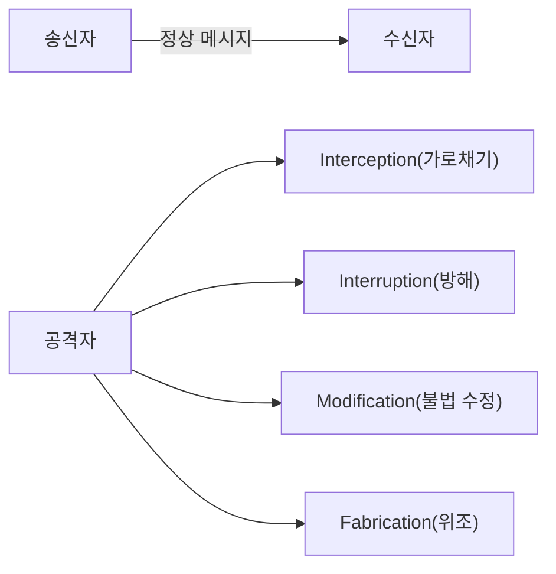
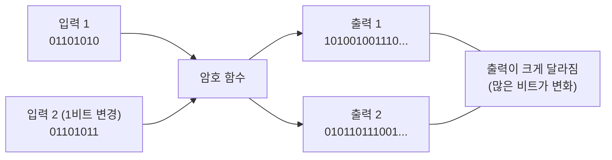
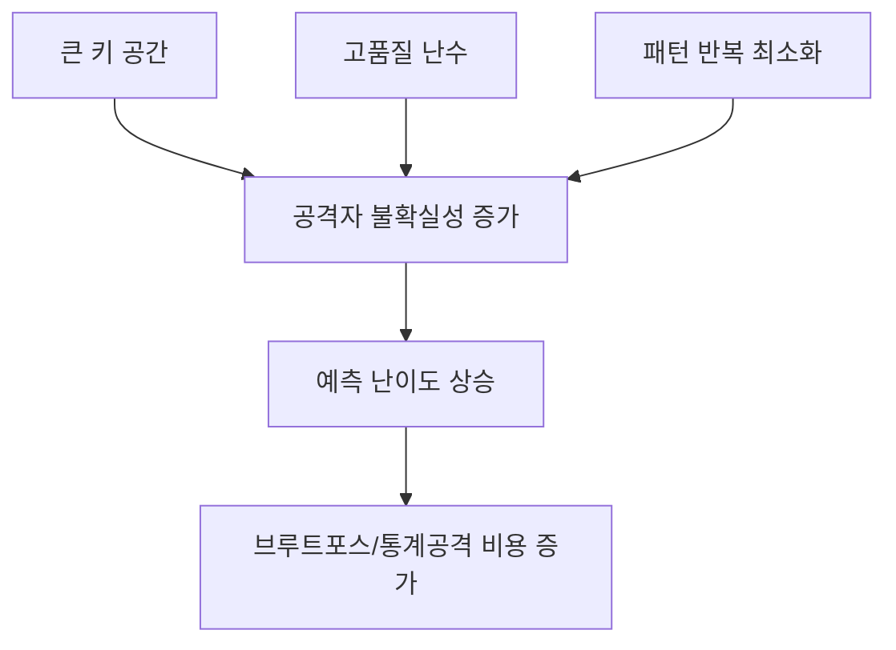

# 암호의 기초

---

## 프롤로그: 한 통의 메시지에서 시작하는 보안 이야기

준근이 보라에게 메시지를 보낸다.

`“7시에 치맥 콜?”`

겉보기에 평범한 대화지만, 이 한 줄 안에는 정보보안의 거의 모든 문제가 숨어 있다.

- 누군가 몰래 읽을 수 있다. (도청)
  
  
- 누군가 메시지를 못 가게 막을 수 있다. (방해)
  
  
- 누군가 내용을 바꿀 수 있다. (변조)
  
  
- 누군가 가짜 메시지를 끼워 넣을 수 있다. (위조)
  
  

즉, 통신이 있는 곳에는 반드시 공격 가능성이 있다.  
암호학은 이 현실을 전제로 만들어진 학문이다.

---

## 1장. 통신의 역사와 보안 문제의 탄생

### 1.1 통신의 본질

통신(communication)은 한쪽의 정보를 다른 쪽에 전달하는 행위다.  
전기가 없던 시대에는 사람을 보내거나, 말 같은 이동 수단을 쓰거나, 봉화/연기 신호를 사용했다.

이 방식의 한계는 분명했다.

- 느리다
- 멀리 보내기 어렵다
- 중간에서 정보가 바뀌거나 새기 쉽다

결국 “정보 전달”과 “정보 보호”는 처음부터 분리될 수 없는 문제였다.

### 1.2 모스 부호와 전화: 통신의 도약

모스 부호(Morse Code)는 전기 기반 통신의 출발점이었다.  
짧은 신호와 긴 신호를 조합해 메시지를 보낸다. SOS 같은 표준 신호는 긴급 상황에서 생존률 자체를 바꿨다. 

[모르스부호 체험하기](https://morsecode.world/international/translator.html)

전화(telephone)의 등장은 또 다른 도약이었다.

- 부호가 아니라 음성을 직접 전달
- 먼 거리의 실시간 의사소통 가능
- 통신이 특수 기술에서 일상 인프라로 확장
---

### 1.3 ARPANET에서 인터넷까지

1969년 ARPANET은 패킷 교환 네트워크의 역사적 시작점이다.  
1983년 TCP/IP 전환은 오늘날 인터넷의 기술적 출발점으로 본다.

여기서 중요한 것은 단순히 “컴퓨터 연결”이 아니다.  
**서로 다른 시스템이 공통 규약으로 대화할 수 있게 된 것**이 핵심이다.

### 1.4 프로토콜: 통신의 약속

프로토콜(protocol)은 통신 규약이다.

- 어떤 형식으로 보낼지
- 어느 속도로 전송할지
- 오류가 나면 어떻게 복구할지
- 언제 통신을 끝낼지

대표 사례:

- FTP: 파일 전송 규약
- HTTP: 웹 문서 전송 규약
- TCP/IP: 신뢰 전달과 주소 지정의 기반 규약

> 선을 연결했다고 통신이 되는 것이 아니다.  
> 통신은 결국 약속(프로토콜)의 문제다.
{: .prompt-tip }

---

## 2장. 네트워크 위협 모델: 정상 소통은 어떻게 공격받는가

네트워크를 송신자와 수신자만의 선한 공간으로 보면 보안을 절대 이해할 수 없다.  
현실의 네트워크는 항상 공격자가 개입 가능한 구조다.

### 2.1 네 가지 대표 공격

---

---

## 3장. 암호학의 등장인물과 목표

### 3.1 암호란 무엇인가

암호(cipher)는 평문을 제3자가 이해할 수 없는 형태로 바꾸는 체계다.  
하지만 암호학은 단순 은닉만 다루지 않는다. “읽기 방지 + 위조 방지 + 출처 검증”의 조합을 다룬다.

### 3.2 암호학의 표준 역할 모델

- Alice: 송신자
- Bob: 수신자
- Eve: 도청자
- Mallory: 적극적 조작 공격자

이 모델은 설계 요구사항을 명확히 한다.

### 3.3 암호학의 핵심 목표

1. 기밀성(가장 중요)
- 공격자가 메시지를 읽지 못해야 한다.

2. 무결성/진정성
- 공격자가 메시지를 바꿔도 수신자가 검출할 수 있어야 한다.

3. 인증성
- 이 메시지가 정말 기대한 송신자에게서 온 것인지 확인해야 한다.

---

## 4장. 키(Key)와 Kerckhoffs 원리

### 4.1 키(Key)와 키스페이스(Keyspace)

암호를 자물쇠에 비유하면 이해가 쉽다.

- **알고리즘(algorithm)** = 자물쇠의 **구조(설계도)**. "어떻게 잠그고 여는가"라는 방식이다.
- **키(key)** = 그 자물쇠를 실제로 여는 **열쇠**. "이번에 쓰는 비밀 값"이다.

같은 모양의 자물쇠(같은 알고리즘)라도 열쇠(키)가 다르면 서로 못 연다. 즉 **암호화 결과는 알고리즘 + 키**가 함께 결정한다.

> **키(Key)**: 평문을 암호문으로 바꾸거나(암호화), 암호문을 평문으로 되돌릴 때(복호화) 사용하는 **비밀 값(parameter)**이다.
{: .prompt-tip }

**키스페이스(Keyspace, 키 공간)**는 **키가 될 수 있는 모든 경우의 수**를 말한다. 앞서 본 시저 암호를 떠올려 보자.

- 시저 암호의 키는 "몇 칸 미는가"이고, 가능한 값은 `0~25` → **키스페이스 크기 = 26**.
- 26가지뿐이라 사람이 손으로도 전부 대입(전수조사, brute force)해 30초면 깬다.

키스페이스가 작으면 공격자는 **모든 키를 다 넣어보는 것만으로** 암호를 뚫는다. 그래서 현대 암호는 키스페이스를 천문학적으로 키운다.

| 키 길이 | 키스페이스 크기 | 의미 |
|---|---|---|
| 시저 암호 | 26 ($\approx 2^{4.7}$) | 즉시 전수조사 가능 |
| 56비트(구형 DES) | $2^{56} \approx 7.2 \times 10^{16}$ | 현대 장비로 깨짐(폐기) |
| 128비트(AES-128) | $2^{128} \approx 3.4 \times 10^{38}$ | 사실상 전수조사 불가 |
| 256비트(AES-256) | $2^{256}$ | 우주의 시간으로도 불가능 |

> **핵심**: 키 길이가 1비트 늘면 키스페이스는 **2배**가 된다. 그래서 "키를 길게"라는 말은 곧 "공격자의 전수조사 비용을 지수적으로 키운다"는 뜻이다.
{: .prompt-info }

### 4.2 키는 왜 본질인가

암호 시스템은 알고리즘과 키로 이뤄진다.  
강한 알고리즘이라도 키가 유출되면 방어는 즉시 무너진다.

키 관리의 생애주기:

실전 사고의 상당수는 알고리즘 자체보다 키 운영 실패에서 발생한다.

### 4.3 암호 알고리즘과 키의 분리

초창기 암호는 "**방식 자체를 비밀로**" 했다. 적이 암호를 푸는 방법(알고리즘)을 모르게 숨긴 것이다. 하지만 이 방식에는 치명적 약점이 있다.

- 방식이 한 번 새면(분석·내부자·노획) **시스템 전체를 처음부터 다시** 만들어야 한다.
- 외부 검증을 받을 수 없어 **숨은 결함**을 발견하기 어렵다.

그래서 현대 암호는 **알고리즘과 키를 분리**한다.

- **알고리즘은 공개**한다 → 전 세계 전문가가 검증하고, 표준으로 신뢰가 쌓인다.
- **키만 비밀**로 한다 → 비밀로 지켜야 할 대상을 "방식 전체"에서 "작은 키 하나"로 좁힌다.

이렇게 하면 키가 유출돼도 **새 키로 바꾸기만** 하면 된다. 같은 알고리즘을 그대로 쓰면서 키만 교체하므로 복구가 빠르고 비용도 적다.

> **비유**: 도어록(알고리즘)은 모델명이 공개돼도 안전하다. 정작 비밀로 지켜야 할 것은 **비밀번호(키)** 하나다. 비밀번호가 새면 도어록을 통째로 바꾸는 게 아니라 **비밀번호만 바꾸면** 된다.
{: .prompt-tip }

이 "알고리즘 공개 / 키 비밀" 사고방식을 원리로 못 박은 사람이 바로 케르크호프스다.

### 4.4 Kerckhoffs 원리

암호 시스템의 안전성은 알고리즘 비밀이 아니라 키 비밀에 의존해야 한다.  
즉, 알고리즘이 공개되어도 안전해야 한다.

이 원리에서 실무 교훈이 나온다.

- 검증된 표준 알고리즘을 사용하라.
- 독자 암호를 만들지 마라.
- 구현·운영의 정확성을 우선하라.

> 암호 시스템의 안전성은 키(key)의 비밀성에만 의존해야 하며, 암호화 알고리즘이 공개되어도 안전해야 한다.
> Don't roll your own crypto"(자신만의 암호를 만들지 마라)
{: .prompt-warning }

### 4.5 암호학으로 할 수 없는 것

암호는 강력하지만 **만능이 아니다**. 암호가 풀어주는 문제와 풀어주지 못하는 문제를 구분해야 한다.

- **끝점(endpoint)은 못 지킨다.** 암호는 "전송 중인 데이터"를 보호한다. 하지만 송신자·수신자의 PC가 이미 악성코드에 감염돼 있으면, 화면에 뜬 평문을 그대로 훔쳐간다. 암호는 통로를 지킬 뿐, 양 끝의 컴퓨터를 지키지 못한다.
- **키 관리 실패는 못 막는다.** 키가 유출·약하게 설정·재사용되면 아무리 강한 알고리즘도 무력하다. (OTP도 키를 재사용하면 깨진다 → 뒤의 VENONA 사례)
- **사람(사회공학)은 못 막는다.** 사용자가 비밀번호를 알려주거나 피싱에 속으면 암호는 개입할 여지가 없다.
- **가용성(서비스 거부)은 지키지 못한다.** 암호는 기밀성·무결성·인증을 다루지만, 공격자가 트래픽을 폭주시켜 서비스를 마비(DoS)시키는 것은 막지 못한다.
- **메타데이터는 가리기 어렵다.** 내용은 암호화해도 "누가-누구와-언제-얼마나" 통신했는지(트래픽 분석)는 그대로 드러날 수 있다.
- **영원히 안전하지 않다.** 오늘의 안전은 "현재의 계산 능력 기준"이다. 컴퓨팅 발전(예: 양자컴퓨터)이나 새 공격 기법이 나오면 기준이 바뀐다.

> 암호는 **만병통치약이 아니라 도구**다. 끝점 보안·키 관리·사용자 교육·접근통제와 **함께** 쓰여야 비로소 시스템이 안전해진다. (1주차 "심층 방어"와 연결되는 지점)
{: .prompt-warning }

---

## 5장. 고전 암호 I - 전치 암호(Transposition)

전치 암호는 문자를 다른 문자로 바꾸지 않고, 위치를 바꾸는 방식이다. (가장 고전적인 방법의 하나)

[전치 암호의 예](https://www.youtube.com/watch?v=bcyUJK1BvHw)

장점:
- 이해가 쉽다.
- 손으로도 실습 가능하다.

한계:
- 글자 빈도 자체는 보존된다.
- 통계 분석에 취약하다.

---
### 5.1 스키테일(Scytale) 암호

고대 스파르타에서 사용한 대표 전치 암호 도구다.  
동일한 지름의 막대를 공유해야만 복원 가능하다.

핵심 교훈:

- 물리 도구도 결국 키 역할을 한다.
- 키 공유와 키 보호 문제는 시대가 바뀌어도 사라지지 않는다.

#### 5.1.1 스키테일(Scytale) 암호 실습해보기

준비물:

- 볼펜
- 긴 종이띠 1장(가로 2cm, 세로 30cm 정도)
- 원통 1개(연필/마커)

실습:

1. 종이띠를 원통에 겹치지 않게 나선형으로 감습니다.
2. 감긴 상태에서 7시에 치맥 콜 같은 문장을 가로로 씁니다.
3. 종이띠를 풀어 적힌 내용을 그대로 적으면 암호문입니다.
4. 같은 굵기의 원통에 다시 감으면 원문이 복원됩니다.

포인트:

- 원통 굵기가 키입니다.
- 굵기가 조금만 달라도 해독이 틀어집니다.

---

## 6장. 고전 암호 II - 치환 암호(Substitution)

치환 암호 : 평문에 사용된 문자를 다른 문자(기호)로 치환
### 6.1 시저 암호(Caesar cipher)

* 기원전 100년경, 줄리어스 시저가 사용
* 알파벳을 일정 수(3)만큼 평행 이동
  
  
* 시저 암호는 알파벳을 일정 칸 이동시키는 방식이다.

$$
C = (P + k) \bmod 26
$$

$$
P = (C - k) \bmod 26
$$

* [Caesar Cipher 확인](https://www.boxentriq.com/ciphers/caesar-cipher)

* 입문에는 좋지만, **키 공간이 작아 전수조사에 약하다**.

#### 6.1 시저 암호(Caesar cipher) 의 해독

* 모든 경우의 수 대입으로 가능하다!
	* 시저 암호 알고리즘 : 알파벳을 일정 수 만큼 평행 이동
	* 가능한 후보 키의 수 : 0 ~ 25가지
	* 26가지 키를 순서대로 사용(여기서 키 공간은 키가 될 수 있는 경우의 수를 말함)

---
> **📜 역사 한 토막 — 황제들의 암호 생활**
>
> 시저가 3칸 이동 암호를 썼다는 사실은 로마 역사가 수에토니우스의 『황제전』(121년경)에 기록되어 있다. 재미있는 것은 후계자 아우구스투스다. 그는 한 술 더 떠 **겨우 1칸 이동** 암호를 썼고, 알파벳의 마지막 글자 X에 이르면 한 바퀴 되돌아가는 대신 **AA라고 적었다**고 한다.
>
> 오늘날 초등학생도 풀 수 있는 암호로 제국의 기밀이 지켜진 이유는 간단하다. 당시에는 **글을 읽을 수 있는 적 자체가 드물었다.** 암호의 강도는 절대적인 것이 아니라 상대에 따라 정해진다 — 2장에서 본 위협 모델의 관점이 2,000년 전에도 그대로 적용되는 셈이다.
>
> *근거: 수에토니우스, 『황제전(De vita Caesarum)』 「율리우스 카이사르」 56절, 「아우구스투스」 88절.*
{: .prompt-tip }

### 6.2 단일 문자 치환(Mono-alphabetic)

- 알파벳을 임의 1:1 대응으로 치환하면 키 공간은 커진다.
	- 시저 암호도 단일 문자 치환 암호의 한 종류(참고: 시저암호는순서대로대응)

그러나 언어의 통계적 편향 때문에 빈도분석으로 약점이 드러난다.

영어 빈도 예:

- 고빈도: E, T, A, O, I, N
- 저빈도: Z, Q, X, J
---
### 6.3 빈도분석(단일 문자 치환 암호 해독)

1. 암호문의 문자 출현 빈도 계산(Frequency Analysis)
	1. 영어에서 자주 나오는 글자 순서
		1. E, T, A, O, I, N (가장 빈번) / 드문 글자: Z, Q, X, J
2. 1글자/2글자/3글자 단어 패턴 대입
	1. 한 글자 단어: A, I
	2. 두 글자 단어: OF, TO, IN, IT, IS
	3. 세 글자 단어: THE, AND, FOR
3. 반복 글자
	1. LETTER → 같은 글자 2번 연속 (TT, EE)
	2. 영어에서 자주 반복되는 글자: LL, EE, SS, OO, TT

이 과정은 정답을 한 번에 맞히는 문제가 아니라, 가설을 체계적으로 줄여가는 분석 과정이다.

- **암호문: WKLV LV D WHVW  ===> 맞추어 보세요**

---

> **📜 역사 한 토막 — 빈도분석은 신학 연구에서 태어났다**
>
> 빈도분석을 처음 체계화한 사람은 9세기 바그다드 '지혜의 집'의 학자 **알킨디(Al-Kindi)** 다. 쿠란 구절의 계시 순서를 밝히려는 신학자들의 언어 통계 연구, 그리고 그리스 문헌의 대규모 번역 사업 속에서 "언어마다 글자의 출현 빈도가 일정하다"는 통찰이 나왔다. 그가 남긴 『암호 해독에 관한 논고』는 이 기법을 담은 현존 최고(最古)의 문헌으로, 오랫동안 잊혔다가 **1987년 이스탄불의 문서고에서 재발견**되었다. 유럽이 같은 수준에 도달한 것보다 수백 년 앞선 기록이다.
>
> *근거: 알킨디, 『암호 해독에 관한 논고』(9세기, 1987년 이스탄불 쉴레이마니예 도서관에서 재발견); Simon Singh, 『The Code Book』(1999).*
{: .prompt-tip }

> **📜 역사 한 토막 — 암호를 과신한 대가: 스코틀랜드 여왕 메리(1587)**
>
> 잉글랜드 여왕 엘리자베스 1세의 암살 음모(배빙턴 음모)에 가담한 스코틀랜드 여왕 메리는 공모자들과 **단일 문자 치환에 기호를 더한 암호**로 편지를 만들어 맥주통 마개 속에 숨겨 주고받았다. 암호를 믿었기에, 편지에 음모의 핵심을 그대로 적었다.
>
> 그러나 배달책은 처음부터 엘리자베스 측 정보 책임자 월싱엄의 이중 스파이였고, 암호 전문가 펠리페스(Phelippes)는 **빈도분석으로 편지를 전부 해독**하고 있었다. 월싱엄은 즉시 체포하는 대신 해독한 편지에 **가짜 추신을 덧붙여 공모자 전원의 이름까지 받아낸 뒤** 일망타진했다. 메리는 자신이 쓴 편지가 증거가 되어 처형되었다.
>
> 교훈: **약한 암호는 암호가 없는 것보다 위험할 수 있다.** 암호가 없었다면 쓰지 않았을 말을, 암호를 믿고 쓰게 만들기 때문이다.
>
> *근거: 배빙턴 음모 재판 기록(잉글랜드 국가문서고); Simon Singh, 『The Code Book』(1999) 1장.*
{: .prompt-tip }

## 7장. 다중 문자 치환과 카시스키 테스트

다중 문자 치환(Poly-alphabetic)은 한 개가 아니라 여러 치환표를 사용한다.  
단일치환보다 강하지만, 반복 키를 쓰면 패턴 단서가 남는다.

### 7.1 Vigenere 암호

비제네르 암호는 **다중 문자 치환 암호(poly-alphabetic substitution)**의 대표 예시다.  
시저 암호처럼 한 칸씩 고정 이동하지 않고, **키워드의 각 문자**에 따라 이동 칸이 바뀐다.

* 동일 문자의 암호문 생성 가능
* 많은 수의 임의 문자들로 만든 암호 키 사용
* 암호 키 길이 및 문자의 출현 빈도 추측 제한 → 빈도 분석 방법 적용 방지

### 7.2 카시스키 테스트(Kasiski Examination)

**1863년 프로이센 군인 프리드리히 카시스키(Friedrich Kasiski)가 개발한 비제네르 암호**
**해독 기법임**
▪ 암호문에서 반복되는 문자열을 찾아 키워드 길이를 추정함.
▪ 왜 반복 패턴이 나타나는가? : 원문에 같은 단어가 나타나고, 그 위치에서 같은 키 글자가
대응되면 동일한 암호문이 생성됨.

핵심 흐름:

1. 반복 문자열 탐지
2. 반복 간 거리 계산
3. 거리들의 공약수로 키 길이 후보 산출
4. 후보 키 길이별로 그룹 분할 후 빈도분석

**즉, “강해진 암호”도 패턴이 남으면 해독 가능성이 생긴다.**

---

> **📜 역사 한 토막 — 300년간 '해독 불가'였던 암호와 잘못 붙은 이름**
>
> 비제네르 암호는 사실 **이름부터가 역사의 오류**다. 이 방식의 원형은 1553년 이탈리아의 벨라소(Bellaso)가 발표했고, 정작 비제네르 본인은 이보다 정교한 자동키(autokey) 방식을 고안했는데, 후대가 이름을 잘못 붙인 것이다. 어쨌든 이 암호는 300년 동안 깨지지 않아 프랑스어로 **'해독 불가 암호(le chiffre indéchiffrable)'** 라 불렸다.
>
> 흥미로운 사실이 하나 더 있다. 카시스키(1863)보다 **약 10년 먼저 이 암호를 깬 사람**이 있었다 — '컴퓨터의 아버지' **찰스 배비지**다. 그러나 그는 결과를 발표하지 않았고, 이 사실은 사후에 그의 노트에서 확인되었다. 마침 크림 전쟁 중이던 영국 정보기관에 유리하도록 비밀에 부쳐졌다는 설이 유력하다. '먼저 발명하고도 침묵한' 이 구도는 훗날 공개키 암호의 역사([공개키 암호의 원리](/posts/infosec-5-crypto-3-1-publickey/) 편의 GCHQ 이야기)에서 그대로 반복된다.
>
> *근거: F. Kasiski, 『Die Geheimschriften und die Dechiffrir-Kunst』(1863); 배비지 유고 연구(O. Franksen, 1984); Simon Singh, 『The Code Book』(1999) 2장.*
{: .prompt-tip }

## 8장. 에니그마: 기계식 암호의 정점과 한계

에니그마(Enigma)는 제2차 세계대전 독일이 사용한 기계식 암호 장치다.

* 3장의 회전자(rotor)와 반사판을 이용 문자 치환
  

강력했던 이유:

- 로터 회전에 따른 동적 치환
- 큰 키 공간
- 같은 입력 문자도 시점에 따라 다른 출력
- [에니그마 에뮬레이터](https://www.101computing.net/enigma-machine-emulator/)

깨진 이유:

- 운용 절차 반복
- 예측 가능한 메시지 형식
- 인간 습관에서 나온 패턴
- [Imitation Game 에니그마 해독 장면](https://www.youtube.com/watch?v=o4dCzqy1JrY)
  

정리하면, 보안은 알고리즘 강도만으로 결정되지 않는다.  
운용 보안(OPSEC)이 무너지면 강한 암호도 약해진다.

---

> **📜 역사 한 토막 — 에니그마를 먼저 꺾은 것은 폴란드의 수학자 세 명이었다**
>
> 영화 덕분에 에니그마 해독은 튜링과 블레츨리 파크의 업적으로 알려져 있지만, **최초 해독은 1932년 폴란드**에서 이루어졌다. 수학자 레예프스키·루지츠키·지갈스키 세 명은 순열 이론이라는 순수 수학으로 에니그마의 내부 배선을 재구성했고, 해독 기계 '봄바(bomba)'까지 만들었다. 독일 침공 직전인 1939년 여름, 폴란드는 이 성과 전부를 영국과 프랑스에 넘겼다 — 블레츨리 파크는 맨땅이 아니라 이 토대 위에서 출발했다.
>
> 해독의 결정적 단서 하나는 에니그마의 **설계상 특징**이었다. 반사판 구조 때문에 에니그마는 **어떤 글자도 절대 자기 자신으로 암호화되지 않는다.** 이 사소해 보이는 성질 덕분에 해독가들은 추측 단어(crib)를 암호문 위에 대보며 "같은 글자가 겹치는 위치는 후보에서 제외"하는 방식으로 경우의 수를 급격히 줄일 수 있었다. 여기에 매일 아침 반복되는 기상 보고("WETTER"), 습관적인 인사말 같은 운용 실수가 결합해 '무적의 기계'가 무너졌다.
>
> 처칠은 블레츨리 파크 사람들을 **"황금알을 낳으면서도 결코 꼬꼬댁거리지 않은 거위"** 라 불렀다. 해독 사실 자체가 종전 후로도 수십 년간 기밀이었기 때문이다.
>
> *근거: M. Rejewski의 회고 논문(Annals of the History of Computing, 1981); G. Welchman, 『The Hut Six Story』(1982); 처칠의 표현은 블레츨리 파크 공식 기록으로 전해진다.*
{: .prompt-tip }

## 9장. 암호 해독이 전쟁을 바꾼 순간: JN-25와 미드웨이

암호학은 교실의 퍼즐이 아니라 국가 전략 도구다.

핵심 스토리:

* 일본 해군 암호체계 JN-25 분석 진행|
   
* 진주만에서 연합군 정보부대 Station HYPO에서는 수학자, 언어학자, 그리고 암호 전문가들이 밤낮없이 일본의 암호문 분석
	* 조제프 로체포트 중령은 마치 탐정처럼 일본군의 통신 트래픽을 추적
	  
	    
	* AF 에 대한 지점 탐문 중
	  
	  
	* AF 담수 부족 허위 전문으로 반응 유도
	  
	* AF=미드웨이 확인
	* 1942년 6월 4~7일 미드웨이 해전(Battle of Midway) : 태평양 전쟁의 전환점이 된 해전임.
	  
		* 진주만 공습(1941.12.7) 이후 일본군이 태평양을 장악하던 상황에서, 미국은 미드웨이 섬 방어를 위해 대규모 함대 투입을 결정
		* 암호 해독이 전쟁 승패를 결정한 대표적 사례임. 군사력보다 정보력이 우위를 가져온 경우

이 사례의 메시지:

- 올바른 정보 + 적절한 시점 = 전략 우위
- 암호는 전술 지원을 넘어 전쟁의 방향을 바꿀 수 있다.

---

## 10장. 이론적 완전성: 일회용 패드(OTP)

OTP(One-Time Pad)는 이론적으로 완전기밀성을 제공하는 체계다.  
클로드 섀넌의 정보이론 관점에서도 완전성이 증명된다.

성립 조건:

1. 키 길이 = 평문 길이
2. 키는 진정한 난수
3. 키는 단 1회 사용
4. 키는 사전에 안전하게 공유

* 치명적 단점:
	* 키 길이 = 메시지 길이 (1GB 파일은 1GB 키 필요)
	* 키 배송 문제 (안전하게 키를 전달하는 게 더 어려움)
	* 키 재사용 시 즉시 해독됨 (VENONA 프로젝트 -소련 암호 해독 사례)

즉, 수학적 최강과 운영 가능성은 서로 다른 문제다.

> **📜 역사 한 토막 — 완전한 암호를 무너뜨린 것은 게으름이었다: VENONA**
>
> OTP는 수학적으로 완전하다. 그래서 이것을 깬 유일한 방법은 수학이 아니라 **규칙 위반을 기다리는 것**이었다. 2차 대전의 혼란 속에서 소련은 키 패드 생산이 수요를 따라가지 못하자 **일부 키 페이지를 중복 인쇄**했고, "단 1회 사용" 조건이 깨진 바로 그 지점을 미국의 **VENONA 프로젝트**(1943년 시작)가 파고들었다. 수십 년에 걸친 분석 끝에 약 3,000건의 소련 첩보 전문이 부분 해독되었고, 그 속에서 원자폭탄 기밀을 넘긴 로젠버그 부부와 물리학자 클라우스 푹스 등 핵 스파이망이 드러났다. 이 프로젝트의 존재는 1995년에야 기밀 해제되었다.
>
> 반대로 조건만 지키면 OTP는 지금도 최고 수준의 신뢰를 받는다. 냉전기 워싱턴-모스크바 직통 회선(핫라인)이 OTP 방식으로 보호된 것이 대표적이다. **"키 재사용 금지"가 왜 목숨줄인지**를 역사가 양방향으로 증명한 셈이다.
>
> *근거: 미국 NSA·CIA의 VENONA 공개 문서(1995년 기밀 해제).*
{: .prompt-tip }

---

## 11장. 눈사태 효과(Avalanche Effect)와 불확실성

### 11.1 눈사태 효과

입력 1비트 변화가 출력 전체의 큰 변화로 이어져야 한다.  
이 특성이 약하면 공격자는 입력-출력 상관관계를 추적해 구조를 역추론할 수 있다.

### 11.2 불확실성(Uncertainty)

공격자에게 예측 가능성을 줄이는 것이 핵심이다.

- 충분한 키 공간
- 높은 난수 품질
- 반복 패턴 최소화

현대 암호 설계는 결국 예측 가능성을 제거하는 공학이다.

---
