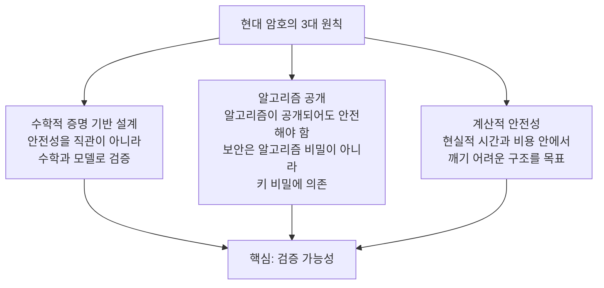
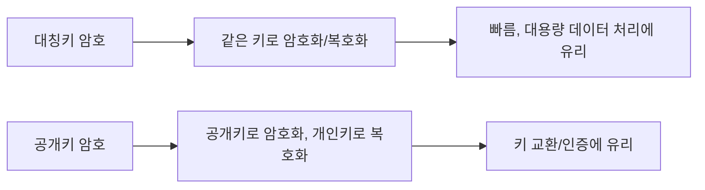
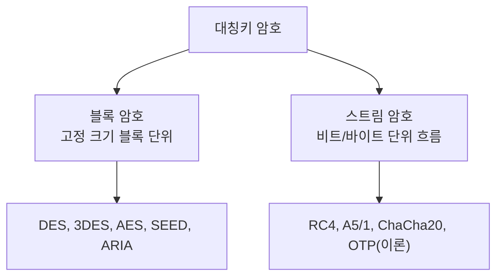
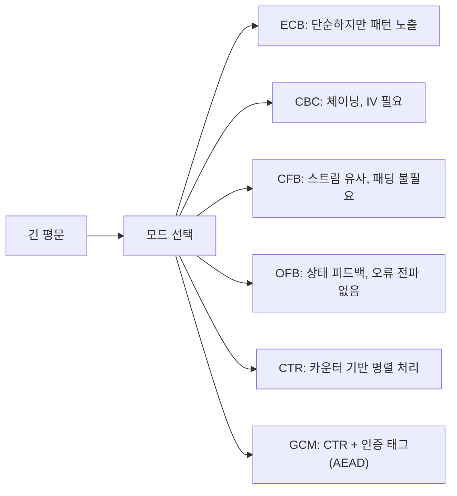

# 현대 암호 #1: 대칭키 암호체계

---

## 0. 한눈에 보는 대칭키 암호의 역사 — "문제 → 해결"의 흐름

암호의 발전은 늘 **"기존 방식의 한계(문제) → 그것을 풀기 위한 새 방식(해결)"**의 반복이었다. 본문에 들어가기 전에, 이 글 전체를 **시간 순서**로 먼저 훑어보자.

| 시기 | 문제(한계) | 해결(새로 등장) | 구조·키워드 |
|---|---|---|---|
| ~1940년대 | 고전 암호(시저·비제네르)는 규칙이 단순 → **컴퓨터로 쉽게 깨짐** | **Shannon 정보이론**(1948~49): 확산·혼돈·합성암호 정의 | 이론적 토대 |
| **1977** | 기업마다 **제각각 암호** → 표준 부재 | **DES**: 최초의 공개 표준 블록 암호 | **Feistel** 구조, 56비트 키 |
| 1990년대 | DES **56비트 키가 너무 짧음** → 무차별 대입 현실화(1998 Deep Crack) | **3DES**(임시방편): DES를 3번 반복 | Feistel, 느림·64비트 한계 |
| **2001** | 3DES는 **느리고** 블록(64비트)도 **작음** | **AES**(Rijndael): 새 국제 표준 | **SPN** 구조, 128비트 블록 |
| (병행) | 블록 암호는 **실시간·가변 길이**에 약함 | **스트림 암호**(OTP→LFSR→현대) | 비트 단위, XOR |
| (병행) | 블록 하나로는 **긴 데이터**를 못 다룸 | **운영모드**(ECB→CBC→CFB/OFB/CTR) | 블록 연결·스트림화 |
| 다음 글 | 대칭키의 **키 공유·관리** 난제 | **공개키 암호** | 키 교환·인증 |


> **핵심 흐름**: 고전 → (Shannon 이론) → **DES(Feistel)** → (키가 짧다) → 3DES → (느리다) → **AES(SPN)** → (키 관리가 어렵다) → 공개키. **Feistel이 먼저(DES), SPN이 나중(AES)**라는 시간 순서를 기억하자.
{: .prompt-tip }

---

## 1. 현대 암호로의 전환

### 1.1 고전 암호의 한계

고전 암호(시저, 비제네르 등)는 역사적으로 매우 중요하지만, 공통 약점이 있었다.

1. 규칙이 단순해서 통계 분석에 취약
2. **컴퓨터 계산 능력 증가로 해독 시간 급감**
3. 보안성이 "감"이나 "복잡해 보임"에 의존

비제네르 암호는 한때 강력해 보였지만, 반복 키 구조 때문에 카시스키 분석 같은 방법으로 약점이 드러났다.

### 1.2 컴퓨터 시대와 암호학의 재정의

컴퓨터 시대가 열리며 암호는 감각이 아니라 수학으로 재정의되었다.

- Claude Shannon(1948~1949): 정보이론 기반 암호학 토대
- 핵심 질문: "절대 안전한가?"보다 "현실적 자원으로 깨기 가능한가?"
  
  

### 1.3 완전비밀성(Perfect Secrecy)과 계산적 안전성(Computational Security)

완전비밀성(Perfect Secrecy)은 이론적으로 이상적이다.

$$
P(M \mid C) = P(M)
$$

암호문 `C`를 봐도 평문 `M`의 확률이 바뀌지 않으면 완전비밀성이다.  
대표 예시는 OTP(One-Time Pad)지만, 키 길이/배포 문제로 일반 서비스에 쓰기 어렵다.

**현대 암호는 대신 계산적 안전성을 추구한다**.

- 충분히 큰 계산 비용이 들면 실질적으로 안전하다고 본다.
- AES 같은 블록 암호가 여기에 속한다.

---

## 2. 현대 암호의 3대 원칙

### 2.1 수학적 증명 기반 설계

안전성을 직관이 아니라 수학과 모델로 검증한다.

### 2.2 알고리즘 공개

좋은 암호는 알고리즘이 공개되어도 안전해야 한다.  
보안은 "알고리즘 비밀"이 아니라 "키 비밀"에 의존해야 한다.

### 2.3 계산적 안전성

현실적 시간/비용 안에서 깨기 어려운 구조를 목표로 한다.



> 현대 암호는 "숨기는 기술"이 아니라 "공개 검증 가능한 설계"다.
{: .prompt-tip }

---

## 3. 대칭키 암호체계 기초

### 3.1 정의

대칭키 암호(symmetric key encryption)는 송신자와 수신자가 같은 키를 공유한다.

- 암호화 키 = 복호화 키
- 빠르고 구현 효율이 좋아 저장 데이터 암호화에 널리 사용


대표 알고리즘:

- DES
- Triple-DES
- AES

### 3.2 장점과 단점

장점:

1. 빠르다
2. 대용량 처리에 유리하다

단점:

1. 키를 안전하게 전달해야 한다
2. 키 유출 시 영향이 크다

---

## 4. XOR 기초 (반드시 이해해야 할 핵심)

XOR는 대칭키 암호 전체를 관통하는 **가장 기본이 되는 연산**이다. 스트림 암호는 키스트림과 평문을 XOR하는 것이 곧 암호화이고, 블록 암호의 내부 라운드와 운영모드(CBC/CFB/OFB/CTR)에서도 XOR가 계속 등장한다. 뒤에 나올 내용을 이해하려면 이 절을 먼저 확실히 잡아 두어야 한다.

### 4.1 XOR 진리표

`XOR`는 두 비트가 다르면 1, 같으면 0이다.

| A | B | A XOR B |
|---|---|---|
| 0 | 0 | 0 |
| 0 | 1 | 1 |
| 1 | 0 | 1 |
| 1 | 1 | 0 |

### 4.2 왜 암호에서 XOR를 많이 쓰는가

가장 중요한 성질:

$$
(P \oplus K) \oplus K = P
$$

즉, 같은 키 `K`를 한 번 더 XOR하면 원래 평문 `P`가 복원된다.  
이 성질 때문에 스트림 계열 처리나 모드 설계에서 XOR가 핵심 연산으로 등장한다.

### 4.3 짧은 예시

평문 비트: `1011`  
키 비트: `0110`

암호문:

$$
1011 \oplus 0110 = 1101
$$

복호:

$$
1101 \oplus 0110 = 1011
$$

이제 XOR가 왜 중요한지는 확인했다.  
여기까지가 대칭키 암호 전반에 공통으로 적용되는 원리다. 이제 대칭키 암호를 **분류**한 뒤, 두 갈래를 각각 따로 살펴본다.

---

## 5. 대칭키 암호체계의 분류

여기까지가 **모든 현대 암호에 공통으로 적용되는 원리**였다. 이제부터는 대칭키 암호를 갈래별로 나누어 본다. 분류 체계를 먼저 잡아 두어야 이후에 나오는 알고리즘들이 어디에 속하는지 헷갈리지 않는다.

```
                        현대 암호
                            │
            ┌───────────────┴───────────────┐
       대칭키 암호                      공개키 암호
   (같은 키로 암·복호화)          (공개키/개인키 쌍)
            │                              │
    ┌───────┴────────┐                 RSA, ECC, DH …
 스트림 암호      블록 암호                (4장 ③에서 다룸)
    │                │
 RC4, A5/1,      DES, 3DES, AES,
 ChaCha20        SEED, ARIA, LEA
    │                │
  6장에서          7~10장에서
   다룸              다룸
```


### 5.1 대칭키와 공개키



대부분의 실제 시스템은 혼합 구조를 쓴다.

1. 공개키로 세션 키를 안전하게 교환
2. 대칭키로 실제 데이터를 빠르게 암호화

### 5.2 대칭키의 두 갈래 — 블록 암호와 스트림 암호

대칭키 암호는 **데이터를 어떤 단위로 처리하느냐**에 따라 다시 두 갈래로 나뉜다.

- **블록 암호(Block Cipher)**: 데이터를 **고정 크기 블록**(예: 64·128비트)으로 잘라, 블록 단위로 암호화한다. → 책을 **페이지 단위**로 처리하는 느낌.
- **스트림 암호(Stream Cipher)**: 키로 만든 **키스트림(keystream)**을 평문과 **1비트/1바이트씩 XOR**하며 흐르듯 처리한다. → 물이 흐르듯 **글자 하나하나** 처리하는 느낌.



#### 블록 암호(Block Cipher)

| 항목 | 내용 |
|---|---|
| **암호화 단위** | 고정 크기 **블록**(DES 64비트, AES 128비트). 블록보다 짧으면 **패딩(padding)**으로 채움 |
| **특징** | 블록을 통째로 뒤섞음(확산·혼돈). 같은 평문 블록이 같은 암호문이 되지 않도록 **운영모드(ECB/CBC/CTR 등)**와 함께 사용 |
| **장점** | 높은 **안전성**(확산 효과 큼), **무결성 검증·인증**에 활용 쉬움, 표준화가 잘 되어 신뢰성 높음 |
| **단점** | 상대적으로 **느림**, 패딩·운영모드 등 **구현이 복잡**, 블록이 모일 때까지 지연(버퍼링) 발생 |
| **주요 대상(용도)** | **저장 데이터**(파일·디스크 암호화), 정형 데이터, 길이를 알고 처리하는 일반적 암호화 |
| **대표 사례** | **DES, 3DES, AES, SEED, ARIA, IDEA** |

#### 스트림 암호(Stream Cipher)

| 항목 | 내용 |
|---|---|
| **암호화 단위** | **비트/바이트** 단위(연속적). 키스트림과 평문을 **XOR** |
| **특징** | 일회용 패드(OTP)를 **현실적으로 흉내** 낸 방식. 길이에 구애받지 않고 도착하는 대로 즉시 처리 |
| **장점** | **빠르고 가벼움**(저전력·하드웨어 친화), **지연(latency)이 작음**, 길이가 가변적인 데이터에 유리 |
| **단점** | **키스트림 재사용 시 치명적**(XOR로 평문 노출), 자체로는 무결성 보장 못 함, 설계·운용 실수에 민감 |
| **주요 대상(용도)** | **실시간·연속 스트림**(음성·영상 통신, 무선 트래픽), 즉시성이 중요한 전송 |
| **대표 사례** | **RC4, A5/1(GSM), ChaCha20**, (이론적 원형) **OTP** |

#### 한눈에 비교 (핵심 구분표)

| 구분 항목 | 블록 암호(Block Cipher) | 스트림 암호(Stream Cipher) |
|---|---|---|
| **암호화 단위** | 고정 크기 블록(64/128비트) | 비트/바이트(연속) |
| **핵심 연산** | 블록 치환·전치(확산·혼돈) | 키스트림과 **XOR** |
| **키 사용 방식** | 하나의 키로 모든 블록을 반복 처리 | 키로 **키스트림을 생성**해 흘려보냄 |
| **패딩 필요 여부** | **필요**(블록 크기에 못 미치면 채움) | **불필요**(길이 그대로 처리) |
| **암호문 길이** | 블록 단위로 올림 → 평문보다 길어질 수 있음 | 평문과 **동일**(+ IV/nonce) |
| **속도** | 상대적으로 느림 | 빠름·경량 |
| **지연/버퍼링** | 블록이 찰 때까지 대기 → 지연 있음 | 거의 없음(도착 즉시 처리) |
| **병렬 처리** | 모드에 따라 가능(ECB·CTR은 병렬, CBC는 불가) | 키스트림 생성이 순차적인 경우가 많음 |
| **오류 전파** | 모드에 따라 다름(CBC는 다음 블록까지 영향) | **해당 비트만** 손상(전파 없음) |
| **무결성** | 자체로는 없음 → 모드·MAC으로 보완 | 자체로는 없음 → **가변성 문제 큼** |
| **안전성 성향** | 높음(확산 효과 큼) | **키스트림 관리에 전적으로 의존** |
| **치명적 실수** | ECB 모드 사용, IV 재사용 | **키스트림(키+nonce) 재사용** |
| **주요 대상** | 저장 데이터·파일·디스크 | 실시간 음성·영상·무선 통신 |
| **대표 알고리즘** | DES, 3DES, AES, SEED, ARIA, LEA | RC4(폐기), A5/1(폐기), ChaCha20, OTP(이론) |

#### 실무에서는 어느 쪽을 쓰는가

| 상황 | 선택 | 이유 |
|---|---|---|
| 파일·데이터베이스·디스크 암호화 | **블록 암호**(AES-CBC / AES-GCM) | 길이를 미리 알 수 있고 임의 위치 접근이 필요함 |
| 웹 통신(HTTPS/TLS) | **AES-GCM** 또는 **ChaCha20-Poly1305** | 기밀성과 무결성을 함께 제공하는 인증 암호 |
| 하드웨어 가속이 없는 모바일·IoT | **ChaCha20** | AES 전용 명령어가 없는 환경에서 더 빠름 |
| 음성·영상 실시간 전송 | **스트림 방식**(또는 CTR 모드) | 지연이 작고 오류가 전파되지 않음 |

> **결론부터 말하면, 오늘날 새로 설계하는 시스템은 대부분 블록 암호(AES)를 쓴다.** 스트림 암호가 필요한 상황에서도 **블록 암호의 CTR·OFB 모드**로 스트림처럼 동작시키는 경우가 많다. 순수 스트림 암호 중 현재 권장되는 것은 사실상 **ChaCha20** 정도다.
{: .prompt-tip }

> 운영모드 중 **CTR·OFB**는 사실상 **블록 암호를 스트림 암호처럼** 동작시키는 방식이다(뒤 10.5·10.6). 즉 둘은 완전히 분리된 세계가 아니라, **블록 암호로 스트림의 장점**(즉시성)을 얻을 수도 있다.
{: .prompt-tip }

> **혼동 주의** — "블록 암호 = 안전, 스트림 암호 = 위험"이 아니다. 스트림 암호가 사고를 많이 낸 이유는 원리가 나빠서가 아니라 **키스트림을 재사용하기 쉬운 구조**였기 때문이다. 같은 키스트림으로 두 평문을 암호화하면 두 암호문을 XOR하는 것만으로 키가 소거되어 평문끼리 겹쳐 드러난다($C_1 \oplus C_2 = P_1 \oplus P_2$). 뒤에서 볼 WEP 사고가 바로 이 문제였다.
{: .prompt-warning }

이제 두 갈래를 각각 따로 살펴본다. **6장에서 스트림 암호**를, **7장 이후에서 블록 암호**를 다룬다.

---

## 6. 스트림 암호

앞 5.2에서 블록/스트림을 비교했다. 여기서는 스트림 암호의 동작 원리와 분류, 그리고 대표 알고리즘의 실제 동작을 본다.

### 6.1 기본 개념과 동작 원리

- 현대 스트림 암호에서 암호화·복호화는 **한 번에 r비트**를 생성한다. 평문·암호문·키 비트 스트림을 각각 $P = p_n\cdots p_2 p_1$, $C = c_n\cdots c_2 c_1$, $K = k_n\cdots k_2 k_1$ 이라 하면($p_i, c_i, k_i$는 r비트 워드),

$$
\text{암호화: } c_i = E(k_i,\, p_i) \qquad \text{복호화: } p_i = D(k_i,\, c_i)
$$

- **키 스트림 $K$를 어떻게 생성하는가**가 현대 스트림 암호의 핵심 관심사다. 생성 방식에 따라 **동기식**과 **비동기식** 두 가지로 분류된다.

```
키 스트림  k_n…k_2k_1                          k_n…k_2k_1
              │                                    │
 P_n…P_2P_1 ─▶[ Encryption ]──C_n…C_2C_1──▶[ Decryption ]─▶ P_n…P_2P_1
```

### 6.2 스트림 암호 설계 시 고려사항

1. **암호화의 연속(키스트림)은 긴 주기를 가져야 한다.** 의사 난수 생성기는 언젠가 반복되는 비트 스트림을 만든다. **반복 주기가 길수록** 해독이 어렵다.
2. **키 스트림은 진(眞) 난수에 최대한 가까워야 한다.** 예: 0과 1의 개수가 거의 같아야 하고, 바이트 단위라면 256개 값이 거의 같은 빈도로 나타나야 한다. **랜덤할수록** 암호문도 랜덤해져 해독이 어렵다.
3. **전수(전사적) 공격에 대응하려면 키가 충분히 길어야 한다.** (블록 암호에도 적용) 현재 기술 수준에서 **키 길이는 최소 128비트**가 바람직하다.

> **강력한 스트림 암호의 특징**
> - 키 스트림 내부에 **장기간 반복되는 패턴이 없음**
> - 통계적으로 **예측 불가능**한 키 스트림
> - 키 스트림이 키와 **선형 관계가 아님** → 키 스트림 값을 알아내도 **키값을 알 수 없음**
> - 통계적으로 치우치지 않은 키 스트림(0과 1의 개수 균형)
{: .prompt-tip }

### 6.3 동기식 스트림 암호 (Synchronous)

- 키 스트림이 **평문·암호문과 무관하게(독립적으로)** 생성되는 방식이다. 복호화 시 키 스트림과 암호문 사이에 **동기(synchronization)**가 필요하다.
- 키 스트림과 암호문이 **독립적**이라, 인가자 외 불법 사용자에게 **정보 유출 가능성이 적다**.

**① One-Time Pad (OTP / Vernam 암호)**

- 동기식 스트림 암호 중 가장 간단하고 안전한 암호로, **길버트 버냄(Gilbert Vernam)**이 설계·특허화했다. 암호화 때마다 **랜덤하게 선택된 키 스트림**을 사용한다.
- **샤논(C.E. Shannon)**이 1949년 **해독 불가능함을 수학적으로 증명**했다 → **무조건 안전(unconditionally secure)**, **이론적 해독 불가(theoretically unbreakable)**.
- 암·복호화는 모두 **배타적 논리합(XOR)**을 사용하며(XOR의 성질로 암호화/복호화가 서로 역관계), **한 번에 한 비트씩** 적용된다.

> **OTP 안전성을 위한 4가지 조건**
> 1. 패드는 **한 번만** 사용되어야 한다(재사용 금지).
> 2. 패드는 **메시지 길이만큼** 길어야 한다.
> 3. 패드는 목적지로 **안전하게 배포·보호**되어야 한다.
> 4. 패드는 **순수하게 임의값**으로 만들어져야 한다.
{: .prompt-warning }

**② 귀환 시프트 레지스터 (FSR, Feedback Shift Register)**

- OTP의 **현실적 절충안**. 소프트웨어·하드웨어 모두 구현 가능하나 **하드웨어 구현이 더 용이**하다. **시프트(shift) 레지스터 + 귀환(feedback) 함수**로 구성된다.
- **선형 귀환 시프트 레지스터(LFSR)**: 하드웨어로 쉽게 구현되며, 전부는 아니지만 **많은 스트림 암호가 LFSR을 이용**한다.
  - $n$비트 LFSR의 **최대 주기는 $2^n$이 아니라 $2^n - 1$**이다. 이유: **0으로만 이루어진 상태**는 항상 자기 자신으로만 변환되어 별도의 1주기 순환을 형성하기 때문(그 상태를 제외).
- **비선형 귀환 시프트 레지스터(NLFSR)**: LFSR은 **선형성 때문에 공격에 취약**하다. **NLFSR**을 이용하면 LFSR보다 **안전한** 스트림 암호를 설계할 수 있다.

### 6.4 비동기식 스트림 암호 (자기 동기식, Self-synchronous)

- 키 스트림이 **평문 또는 암호문과 함수 관계**를 갖는 방식. 즉 키 스트림이 평문/암호문으로부터 생성된다.
- 전송 중 암호문 비트가 손실·변경되어도 **오류의 전파가 유한(finite)**하다(자기 동기화).
- **오류 정정** 기능을 포함할 수 있으나, 키 스트림과 암호문의 **종속성** 때문에 **해독되기 쉽다**.
- 블록 암호의 운영모드 중 **CFB(Cipher Feedback) 모드**가 실제로 **스트림 암호를 생성**하는 대표 예다(10.4).

> **동기식 vs 비동기식**: 동기식은 키가 평문·암호문과 **독립적**(유출 위험 적음), 비동기식은 키가 평문·암호문에 **종속적**(오류 전파는 유한하나 상대적으로 해독에 약함).
{: .prompt-info }

### 6.5 대표 알고리즘 — RC4

스트림 암호가 실제로 어떻게 동작하는지는 **하나를 끝까지 따라가 보는 것**이 가장 빠르다. 여기서는 **RC4**를 대표로 삼는다. 구조가 가장 단순해 손으로 계산이 가능하고, 널리 쓰이다가 왜 퇴출되었는지까지 배울 수 있기 때문이다.

#### (가) 배경

**RC4(Rivest Cipher 4)** 는 1987년 **론 리베스트(Ron Rivest)** 가 RSA Security에서 설계한 스트림 암호다. 원래 영업비밀이었으나 1994년 소스가 인터넷에 유출되면서 공개되었고, 상표 문제로 **ARCFOUR/ARC4**라는 이름으로도 불린다.

한때 **WEP, WPA-TKIP, SSL/TLS, RDP, BitTorrent** 등 거의 모든 곳에 쓰였다.

#### (나) 동작 원리 — 상태 배열 하나를 계속 섞는다

RC4의 발상은 놀랄 만큼 단순하다. **256칸짜리 상태 배열 $S$** 를 하나 두고, 그것을 계속 뒤섞으면서 한 칸씩 뽑아 쓰는 것이 전부다.

```
   [1단계] KSA : 키로 상태 배열을 뒤섞는다 (초기화, 1회)

        S = [0][1][2] ... [255]      ← 0~255를 순서대로 넣고
                  ↓ 키에 따라 256번 자리 교환
        S = [2][0][1] ... [ 84]      ← 키마다 다른 배열이 만들어짐

   [2단계] PRGA : 섞인 배열에서 한 바이트씩 뽑아낸다 (반복)

        S ──▶ K1, K2, K3, ...        ← 키스트림
                  ↓
        평문 ⊕ 키스트림 = 암호문
```

**KSA(Key-Scheduling Algorithm) — 키로 상태 배열을 섞는다**

```text
for i = 0 to 255:
    S[i] = i                                  # 0,1,2,...,255로 초기화

j = 0
for i = 0 to 255:
    j = (j + S[i] + key[i mod keylen]) mod 256
    swap(S[i], S[j])                          # 키에 따라 뒤섞음
```

**PRGA(Pseudo-Random Generation Algorithm) — 키스트림을 한 바이트씩 뽑는다**

```text
i = 0, j = 0
반복:
    i = (i + 1) mod 256
    j = (j + S[i]) mod 256
    swap(S[i], S[j])
    K = S[ (S[i] + S[j]) mod 256 ]            # 이 K가 키스트림 1바이트
    출력 K

암호문 = 평문 XOR 키스트림
```

곱셈도, 복잡한 S-박스도 없다. **덧셈·나머지·교환(swap)** 만으로 동작하므로 코드가 수십 줄이면 끝나고 속도도 매우 빠르다.

> **복호화도 똑같은 절차다.** 스트림 암호는 XOR를 쓰므로 `평문 ⊕ K = 암호문`, `암호문 ⊕ K = 평문`이 된다. 즉 **암호화 함수와 복호화 함수가 완전히 같다.** 같은 키를 넣고 한 번 더 돌리면 원래대로 돌아온다.
{: .prompt-tip }

#### (다) 손으로 따라가 보기 — 축소판(N = 8)

실제 RC4는 256칸이라 손으로 따라가기 어렵다. **칸을 8개로 줄인 축소판**으로 원리만 확인해 본다. 키는 `[1, 2, 3]`으로 둔다.

**KSA — 8번 반복하며 자리를 바꾼다**

```text
시작:  S = [0, 1, 2, 3, 4, 5, 6, 7],  j = 0

i=0  key[0]=1  j=(0+S[0]+1)%8=1  swap(S[0],S[1])  →  S=[1, 0, 2, 3, 4, 5, 6, 7]
i=1  key[1]=2  j=(1+S[1]+2)%8=3  swap(S[1],S[3])  →  S=[1, 3, 2, 0, 4, 5, 6, 7]
i=2  key[2]=3  j=(3+S[2]+3)%8=0  swap(S[2],S[0])  →  S=[2, 3, 1, 0, 4, 5, 6, 7]
i=3  key[0]=1  j=(0+S[3]+1)%8=1  swap(S[3],S[1])  →  S=[2, 0, 1, 3, 4, 5, 6, 7]
i=4  key[1]=2  j=(1+S[4]+2)%8=7  swap(S[4],S[7])  →  S=[2, 0, 1, 3, 7, 5, 6, 4]
i=5  key[2]=3  j=(7+S[5]+3)%8=7  swap(S[5],S[7])  →  S=[2, 0, 1, 3, 7, 4, 6, 5]
i=6  key[0]=1  j=(7+S[6]+1)%8=6  swap(S[6],S[6])  →  S=[2, 0, 1, 3, 7, 4, 6, 5]
i=7  key[1]=2  j=(6+S[7]+2)%8=5  swap(S[7],S[5])  →  S=[2, 0, 1, 3, 7, 5, 6, 4]

KSA 결과:  S = [2, 0, 1, 3, 7, 5, 6, 4]
```

**PRGA — 섞인 배열에서 키스트림을 뽑는다**

```text
i = 0, j = 0 에서 시작

1회차:  i=1  j=(0+S[1])%8=0  swap → S=[0,2,1,3,7,5,6,4]  K=S[(S[1]+S[0])%8]=S[2]=1
2회차:  i=2  j=(0+S[2])%8=1  swap → S=[0,1,2,3,7,5,6,4]  K=S[(S[2]+S[1])%8]=S[3]=3
3회차:  i=3  j=(1+S[3])%8=4  swap → S=[0,1,2,7,3,5,6,4]  K=S[(S[3]+S[4])%8]=S[2]=2
4회차:  i=4  j=(4+S[4])%8=7  swap → S=[0,1,2,7,4,5,6,3]  K=S[(S[4]+S[7])%8]=S[7]=3

키스트림 = [1, 3, 2, 3]
```

이제 평문 `[5, 5, 5, 5]`를 암호화하면 다음과 같다.

```text
평문     :  5    5    5    5
키스트림 :  1    3    2    3    (XOR)
─────────────────────────────
암호문   :  4    6    7    6
```

**같은 평문 `5`가 매번 다른 값(4, 6, 7, 6)으로 바뀐 점**에 주목해야 한다. 키스트림이 매 위치마다 달라지기 때문이며, 이것이 단일 치환 암호와의 결정적 차이다.

#### (라) 표준 시험벡터로 검증하기

실제 RC4(256칸)의 널리 알려진 시험벡터다. 직접 구현했다면 이 값이 나와야 한다.

| 항목 | 값 |
|---|---|
| 키 | `Key` |
| 평문 | `Plaintext` |
| 암호문(16진) | `BB F3 16 E8 D9 40 AF 0A D3` |

파이썬으로 20줄이면 구현된다. 표준 라이브러리만 쓴다.

```python
def rc4(key: bytes, data: bytes) -> bytes:
    # --- KSA: 키로 상태 배열 섞기 ---
    S = list(range(256))
    j = 0
    for i in range(256):
        j = (j + S[i] + key[i % len(key)]) % 256
        S[i], S[j] = S[j], S[i]

    # --- PRGA: 키스트림 뽑아 XOR ---
    out, i, j = bytearray(), 0, 0
    for ch in data:
        i = (i + 1) % 256
        j = (j + S[i]) % 256
        S[i], S[j] = S[j], S[i]
        out.append(ch ^ S[(S[i] + S[j]) % 256])
    return bytes(out)


ct = rc4(b"Key", b"Plaintext")
print("암호문:", ct.hex().upper())   # BBF316E8D940AF0AD3
print("복호문:", rc4(b"Key", ct))    # b'Plaintext'
```

```text
암호문: BBF316E8D940AF0AD3
복호문: b'Plaintext'
```

같은 함수 `rc4`를 두 번 호출했을 뿐인데 원문이 복원된다. 앞서 말한 **암·복호화가 동일한 절차**라는 성질이 여기서 확인된다.

#### (마) 그런데 왜 지금은 금지되었는가

**RC4는 현재 사용이 금지되어 있다.** 이유는 다음과 같다.

| 문제 | 내용 |
|---|---|
| **키스트림 편향(bias)** | 출력 바이트가 균등하지 않다. 특히 **초기 바이트**에 통계적 편향이 크다. 같은 평문을 여러 번 관찰하면 평문이 드러난다 |
| **약한 키 스케줄** | KSA가 키를 충분히 섞지 못한다. IV를 키 앞에 붙이는 방식과 결합되면 키가 새어 나간다 |
| **FMS 공격(2001)** | 플루러·만틴·샤미르가 위 약점을 이용해 RC4 키를 복원하는 공격을 발표했다. 이것이 **WEP를 완전히 무너뜨린** 결정타였다 |
| **TLS 공격(2013 이후)** | 편향을 이용해 HTTPS 세션의 쿠키를 복원할 수 있음이 실증되었다 |

그 결과 **2015년 RFC 7465**로 **TLS에서 RC4 사용이 공식 금지**되었다.

> **RC4가 남긴 교훈 — "빠르고 단순하다"는 안전의 근거가 아니다.**
> RC4는 20년 가까이 사실상의 표준이었으나, 결국 설계상의 편향 때문에 퇴출되었다. 더 뼈아픈 점은 **WEP의 실패가 RC4 자체보다 사용 방식(짧은 IV, IV 재사용)의 문제**였다는 것이다. 좋은 알고리즘도 잘못 쓰면 무너지고, 약한 알고리즘은 잘 써도 결국 무너진다.
{: .prompt-warning }

### 6.6 그 밖의 스트림 암호 (간단 정리)

RC4 하나를 제대로 이해했다면 나머지는 어디가 다른지만 알면 된다.

**A5/1 — 2G(GSM) 음성 통신**

하드웨어 지향 스트림 암호로, 길이가 각각 **19·22·23비트인 LFSR 3개**(합 64비트)를 두고 **불규칙 클로킹(irregular clocking)** 으로 어느 레지스터를 진행시킬지 결정한다. 전체 상태가 64비트뿐이라 오늘날에는 미리 계산한 표로 **실시간 해독이 가능**하며, 현재는 폐기되었다.

**ChaCha20 — 현재 권장되는 스트림 암호**

**대니얼 번스타인(Daniel J. Bernstein)** 이 설계한 **Salsa20**(2005)의 개량판으로 2008년 발표되었다. **RFC 8439**로 표준화되어 있고 **TLS 1.3의 표준 암호군**에 포함된다. 키 256비트, 논스 96비트를 쓰며 구조는 **ARX**(Add–Rotate–XOR)다. 실무에서는 인증 태그와 결합한 **ChaCha20-Poly1305**(AEAD) 형태로 쓴다.

AES가 있는데도 쓰는 이유는 성능이다. 최신 CPU에는 AES 전용 명령어(**AES-NI**)가 있어 AES가 매우 빠르지만, 그런 가속기가 없는 **저사양 모바일·IoT 기기**에서는 ChaCha20이 더 빠르고 상수 시간 구현도 쉽다. 구글이 안드로이드·크롬에 적극 도입한 이유가 이것이다.

**eSTREAM 프로젝트**

유럽 ECRYPT가 2004~2008년에 진행한 스트림 암호 공모 사업이다. RC4의 한계가 드러나면서 대안을 찾기 위해 시작되었고, 소프트웨어 지향(Salsa20, HC-128, Rabbit, SOSEMANUK)과 하드웨어 지향(Grain, MICKEY, Trivium)으로 나누어 선정했다. 이 중 Salsa20 계열이 ChaCha20으로 이어졌다.

#### 대표 스트림 암호 비교

| 알고리즘 | 발표 | 키 길이 | 내부 구조 | 현재 상태 | 주요 사용처 |
|---|---|---|---|---|---|
| **RC4** | 1987 | 40~2048비트(가변) | 256바이트 상태 배열 + swap | **사용 금지**(RFC 7465, 2015) | WEP, 구 SSL/TLS |
| **A5/1** | 1987 | 64비트 | LFSR 3개(19·22·23비트) | **폐기** | GSM(2G) 음성 |
| **ChaCha20** | 2008 | 256비트 | ARX(덧셈·회전·XOR) | **권장** | TLS 1.3, 모바일·IoT |
| **OTP** | 1917 | 평문 길이와 동일 | XOR | 이론적 원형 | (실용성 없음) |

> **암기 포인트**
> - **RC4** = KSA + PRGA, 256바이트 상태 배열, **편향 때문에 폐기**(RFC 7465).
> - **A5/1** = LFSR 3개, GSM, 상태 64비트로 **너무 짧아** 폐기.
> - **ChaCha20** = ARX 구조, 256비트 키, **현재 권장**, 보통 Poly1305와 결합해 AEAD로 사용.
{: .prompt-tip }

> DES/AES 같은 **블록 암호의 구체 알고리즘**은 8~9장에서 본격적으로 다룬다.
{: .prompt-tip }

---

## 7. 블록 암호

스트림 암호가 "키스트림을 만들어 흘려보내는" 방식이었다면, 블록 암호는 "덩어리를 통째로 뒤섞는" 방식이다. 현대 대칭키 암호의 중심이며, 이후 DES·AES·운영모드가 모두 여기에 속한다.

### 7.1 블록 암호의 기본 아이디어


DES/AES는 블록 암호다.

블록 암호의 "블록"은 데이터를 일정한 크기로 잘라 처리하는 단위를 뜻한다.

- DES: 64비트 블록 단위 처리
- AES: 128비트 블록 단위 처리

예를 들어 AES는 128비트(16바이트)씩 잘라서 암호화한다.  
즉, 긴 문서도 내부적으로는 `16바이트 조각`으로 나뉘어 순서대로 처리된다.

왜 블록 암호를 쓰게 되었을까?

1. 컴퓨터가 고정 길이 단위를 처리하기 쉽다(구현/최적화 유리)
2. 큰 데이터를 작은 단위로 나누면 메모리/성능 관리가 편해진다
3. **반복 라운드 구조를 설계해 [확산/혼돈 성질](#diffusion-confusion)을 안정적으로 구현할 수 있다**

장점:

1. 하드웨어/소프트웨어 최적화가 쉬워 고성능 구현이 가능하다
2. 보안 분석 모델이 잘 정리되어 검증과 표준화가 유리하다
3. [운영모드(Operation Mode)](#operation-mode)를 붙여 다양한 상황(파일, 네트워크, 병렬 처리)에 적용할 수 있다

단점:

1. 데이터 길이가 블록 배수가 아니면 패딩 처리가 필요하다
2. 운영모드를 잘못 선택하면 패턴 노출(예: ECB) 같은 문제가 생긴다
3. IV/Nonce 재사용 같은 운용 실수에 민감하다

즉, 블록 암호는 "강력한 엔진"이고, 운영모드는 그 엔진을 안전하게 쓰는 "주행 방식"이다.

### 7.2 확산(Diffusion)과 혼돈(Confusion)
{: #diffusion-confusion }

현대 블록 암호가 안전해지려면, 입력과 출력 사이의 관계가 공격자에게 쉽게 보이면 안 된다.  
여기서 중요한 두 축이 확산과 혼돈이다.

혼돈(Confusion):

1. **키와 암호문 사이의 관계를 복잡하게 만든다.**
2. **공격자가 "키의 일부가 출력의 어느 부분에 영향"을 주는지 추적하기 어렵게 한다.**
3. 주로 비선형 치환(S-Box) 같은 연산이 이 역할을 맡는다.

확산(Diffusion):

1. **평문의 작은 변화가 출력 전체로 넓게 퍼지게 만든다.**
2. 예를 들어 **평문 1비트만 바꿔도 암호문 여러 비트가 바뀌어야 한다.**
3. 치환 이후의 순열/혼합 연산(행 이동, 열 혼합 등)이 확산을 강화한다.


왜 중요한가?

1. 혼돈이 약하면 키 추론이 쉬워진다.
2. 확산이 약하면 입력 패턴이 출력에 남는다.
3. 둘이 함께 강해야 통계 공격과 구조적 공격에 견딜 수 있다.

짧은 비유:

- 혼돈은 "관계를 알아보기 어렵게 꼬는 것"
- 확산은 "작은 흔적을 전체로 퍼뜨리는 것"

AES를 예로 보면, S-Box 단계는 혼돈에, 행 이동/열 혼합 단계는 확산에 크게 기여한다.

#### 확산·혼돈의 정확한 정의 (Shannon)

**합성 암호(Product Cipher)**의 개념을 처음 소개한 사람이 **Shannon**이다. 합성 암호는 치환·전치, 그 밖의 구성요소를 결합한 복합 암호이며, 잘 설계된 블록 암호는 **확산과 혼돈** 두 성질을 갖춰야 한다.

| 성질 | 무엇의 관계를 숨기나 | 효과 | 비유 |
|---|---|---|---|
| **확산(Diffusion)** | **암호문 ↔ 평문**의 관계 | 암호문 통계 테스트로 평문을 찾으려는 공격을 좌절. (평문 1비트 변화 → 암호문 다수 비트 변화) | **너비(width)**에 관한 것 |
| **혼돈(Confusion)** | **암호문 ↔ 키**의 관계 | 암호문으로 키를 찾으려는 공격을 좌절. (키 1비트 변화 → 암호문 거의 모든 비트 변화) | **깊이(depth)**에 관한 것 |

> 개념적으로 **혼돈은 깊이(키와의 복잡한 의존)**, **확산은 너비(입력 전체로 퍼짐)**에 관한 것이다. 둘 다 만족해야 통계·구조적 공격에 견딘다.
{: .prompt-info }

### 7.3 현대 블록 암호의 구성요소 — P-박스·S-박스·합성 암호

확산·혼돈을 실제로 구현하려면 **기본 부품(구성요소)**이 필요하다. 현대 블록 암호는 **전치 요소(P-박스)**와 **치환 요소(S-박스)**, 그리고 **이동(shift)·교환(swap)·분할(split)·조합(combine)·XOR(배타적 논리합)** 연산을 결합해 만들어진다.

> **스크램블드 에그 비유**  
> 프라이팬에 계란을 깨 넣고 잘 섞으면 노른자·흰자 모습이 사라지고 뒤죽박죽이 된다. 대칭키 암호화도 평문을 추측할 수 없게 **최대한 뒤섞는 것**이 목적이다. 단, 큰 차이가 하나 있다 — 스크램블드 에그는 되돌릴 수 없지만, **암호문은 수신자가 정확히 복호화할 수 있어야 한다.**
{: .prompt-tip }

#### (가) P-박스 (전치, Permutation Box)

> **🍼 쉬운 설명**  
> P-박스는 **"자리 바꾸기"** 기계다. 교실에서 학생들의 **자리(위치)만** 바꾸고 학생 자체는 그대로 두는 것과 같다. 비트의 **0/1 값은 안 바꾸고, 순서(위치)만** 뒤섞는다. 이렇게 위치를 흩어 놓으면 평문의 패턴이 넓게 퍼져 **확산(Diffusion)**이 일어난다.
{: .prompt-tip }

P-박스는 문자 단위 고전 전치 암호를 **병렬적으로(여러 비트를 한꺼번에)** 수행한다. 현대 블록 암호에는 세 종류가 있다.

| 종류 | 입력 → 출력 | 특징 | 역함수 |
|---|---|---|---|
| **단순(Straight) P-박스** | n비트 → n비트 (n=m) | 비트 위치만 1:1로 뒤섞음 | **존재함** ✅ |
| **축소(Compression) P-박스** | n비트 → m비트 (**n > m**) | 일부 입력 비트가 **소실**됨. 비트를 치환하며 동시에 **개수를 줄일 때** 사용 | 존재 안 함 ❌ |
| **확장(Expansion) P-박스** | n비트 → m비트 (**n < m**) | 일부 입력 비트가 **2개 이상 출력**에 연결. 비트를 치환하며 동시에 **개수를 늘릴 때** 사용 | 존재 안 함 ❌ |

**구체 예시 — 단순 P-박스 (4비트, "자리만 바꾸기")**

규칙: `1번→3번, 2번→1번, 3번→4번, 4번→2번` 위치로 이동시킨다고 하자.

```
입력 위치 :  1 2 3 4        입력 비트 : 1 0 1 1
               ↘ ↓ ↘ ↓                      ↓
출력 위치 :  2 4 1 3        출력 비트 : 0 1 1 1   (값은 그대로, 자리만 이동)
```

- 왜 단순 P-박스는 **역함수가 존재**하나? → 1:1로 자리만 바꿨으니, 바뀐 자리를 **그대로 되돌리면** 원상복구되기 때문.
- 반대로 **축소**(비트를 버림)·**확장**(비트를 복제)은 정보가 줄거나 늘어 **원래대로 되돌릴 수 없어** 역함수가 없다.

> **암기**: **단순 P-박스만 역함수가 존재**한다. 축소·확장 P-박스는 입출력 비트 수가 달라 역함수가 없다.
{: .prompt-info }

#### (나) S-박스 (치환, Substitution Box)

> **🍼 쉬운 설명**  
> S-박스는 **"바꿔치기 사전(번역표)"**이다. 입력이 들어오면 표를 보고 **전혀 다른 값으로 바꿔서** 내보낸다. 시저 암호가 `A→D`처럼 글자를 바꾼 것의 강력한 버전이라고 보면 된다. P-박스가 "자리"를 바꾼다면, S-박스는 **"값 자체"**를 바꾼다. 이렇게 값을 비선형적으로 뒤집어 키와 암호문의 관계를 어지럽혀 **혼돈(Confusion)**을 만든다.
{: .prompt-tip }

- S-박스는 **치환 암호의 축소 모형**으로 볼 수 있다. 단, 입력(n비트 워드)과 출력(m비트 워드)의 **개수가 같을 필요는 없다.**
- S-박스는 입력값과 출력값의 관계가 **테이블(룩업 테이블)** 또는 **수학적 관계**로 정의되는 치환 암호다.
- **역함수 존재성**: S-박스는 역함수가 **존재할 수도, 안 할 수도** 있다. **역함수가 존재하는 S-박스는 입력 비트 수 = 출력 비트 수**다.

**구체 예시 — 3비트 S-박스 (입력 3비트 → 출력 3비트)**

| 입력 | 000 | 001 | 010 | 011 | 100 | 101 | 110 | 111 |
|---|---|---|---|---|---|---|---|---|
| **출력** | 110 | 101 | 001 | 111 | 011 | 000 | 100 | 010 |

- `010`이 들어오면 표를 찾아 `001`로 바꿔 내보낸다. 규칙성이 안 보이게 **일부러 뒤죽박죽** 만든 표다.
- 입력 8가지가 출력 8가지에 **빠짐없이 1:1**로 대응되므로(중복 없음) **역함수가 존재** → 복호화 시 거꾸로 찾으면 됨.

> S-박스는 주로 **혼돈(Confusion)**을, P-박스는 주로 **확산(Diffusion)**을 담당한다. 여기에 shift·swap·split·combine·XOR가 더해져 한 라운드의 부품이 된다.
{: .prompt-tip }

#### (다) 합성 암호와 라운드(Round)

- **합성 암호(Product Cipher)**: S-박스·P-박스 등 여러 요소를 결합한 복합 암호(Shannon 제안).
- **라운드(Round)**: S-박스·P-박스·기타 요소의 결합을 **한 번 반복**하는 단위. 확산·혼돈은 이 라운드를 **여러 번 반복**해야 충분히 누적된다. (DES 16라운드, AES 10/12/14라운드)

> **🍼 쉬운 설명**  
> - **합성 암호** = 부품 조립. S-박스(값 바꾸기)와 P-박스(자리 바꾸기)를 **레고처럼 결합**해 더 강한 암호를 만든다. ("여러 약한 함수를 겹치면 더 강해진다"는 Shannon의 아이디어)
> - **라운드** = **반죽 접기**. 밀가루 반죽을 한 번 접고 미는 것을 **여러 번 반복**해야 골고루 섞이듯, S/P 박스를 한 라운드로 묶어 **수십 번 반복**해야 평문의 흔적이 완전히 사라진다. **한 번만 섞으면 패턴이 남는다.**
{: .prompt-tip }

> **TIP — 양자 암호학(Quantum Cryptography)**  
> 하이젠베르크의 **불확정성 원리**를 응용한 방식. "누구도 못 여는 튼튼한 상자"를 만드는 게 아니라, **통신 당사자가 아닌 누군가가 엿보는 순간 내용이 변해 부서지는 약한 상자**를 만드는 발상이다. 도청이 감지되면 그때 보낸 문서를 폐기한다. (전송 자체보다 **도청 탐지**에 초점)
{: .prompt-info }

### 7.4 블록 암호의 두 구조 — Feistel(먼저) → SPN(나중)

대부분의 블록 암호는 **라운드 함수를 반복 적용**하는데, 그 방법에 따라 크게 두 구조로 나뉜다: **Feistel 구조**와 **SPN(Substitution-Permutation Network)**.

> **⏳ 시간 순서**: **Feistel이 먼저** 나와 **DES(1977)**에 쓰였고, **SPN은 나중에** **AES(2001)**의 표준 구조가 되었다. 그래서 아래도 Feistel → SPN 순서로 본다.
{: .prompt-info }

```
[Feistel 구조 (DES, 1977)]          [SPN 구조 (AES, 2001)]
        Input                            Input
   ┌──────┐                        ┌──┬──┬──┬──┐
   │  F   │ ← XOR & 좌우 교환        S  S  S  S   (S-box: 대치)
   ├──────┤                        └──┴──┴──┴──┘
   │  F   │                        Permutation (P-box: 전치)
   ├──────┤                        ┌──┬──┬──┬──┐
   │  F   │                        S  S  S  S
   ├──────┤                        └──┴──┴──┴──┘
   │  F   │                        Permutation (P-box)
       Output                           Output
```

#### (가) Feistel 구조 — 먼저 등장 (DES가 채택, 1977)

> **🍼 쉬운 설명**  
> Feistel은 **"반반 나눠서 한쪽씩 섞는"** 방식이다. 블록을 **왼쪽(L)·오른쪽(R)** 절반으로 가른 뒤, 오른쪽을 함수 F에 넣어 나온 값을 왼쪽에 **XOR로 칠하고**, 그다음 **좌우를 맞바꾼다**. 이걸 반복한다. 신기한 점은 **암호화와 복호화 기계가 똑같다**는 것 — 키 순서만 거꾸로 넣으면 저절로 풀린다.
{: .prompt-tip }

- 입력을 **좌·우(L, R)** 절반으로 나눠, 한쪽에 **라운드 함수 F**를 적용한 뒤 다른 쪽과 **XOR**하고 **좌우를 교환**하는 과정을 반복한다. "네트워크"라는 이름은 구성도가 **그물을 짜듯 교차**되는 형태라 붙었다. **DES**가 대표적인 Feistel 구조다(상세는 6장).

**구체 예시 — 한 라운드의 동작**

$$
L_i = R_{i-1}, \qquad R_i = L_{i-1} \oplus F(R_{i-1},\, K_i)
$$

```
   L(i-1)        R(i-1)
     │             │
     │      ┌──────┴──────┐
     │      │  F(R, K_i)  │   ← 오른쪽 R을 키 K_i와 함께 함수 F에 넣음
     │      └──────┬──────┘
     └──── XOR ◄───┘            ← 그 결과를 왼쪽 L에 XOR
        │
     [좌우 교환]
        │
     L(i) = R(i-1)   R(i) = L(i-1) ⊕ F(R(i-1), K_i)
```

- **왜 복호화가 쉬운가?** XOR은 같은 값을 두 번 하면 원래로 돌아온다(`a ⊕ b ⊕ b = a`). 그래서 같은 F를 다시 적용하고 키만 **역순**으로 넣으면 원문이 복구된다. → **F가 역함수를 가질 필요가 없다**(F 안에서 비트를 버려도 됨).
- 현대 블록 암호는 모두 **합성 암호(product cipher)**이며, 크게 **Feistel 암호**와 **non-Feistel 암호**로 분류된다.
  - **Feistel 암호**: 라운드 함수 F에 **역함수가 존재하는 요소와 존재하지 않는 요소 모두**를 사용할 수 있음(F가 역함수를 가질 필요 없음 → 암·복호화가 같은 구조).
  - **Non-Feistel 암호(예: SPN/AES)**: **오직 역함수가 존재하는 요소만** 사용할 수 있음(S-box 등이 가역이어야 함).

**Feistel 암호의 강도와 복호화**

- **암호 강도를 결정하는 3요소**: ① 평문 **블록 길이**(충분한 안정성엔 **64비트 이상**), ② **키 길이**(**64비트 내외**, 단 최근에는 **128비트 권장**), ③ **라운드 수**(**16회 이상**).
- **복호화 = 암호화와 동일 구조**. 단 **서브키를 역순**으로 넣는다. 즉 복호화 첫 라운드에 $K_{n-1}$, 마지막 라운드에 $K_1$을 입력한다.
- **Feistel 구조의 특징**: 보통 **3라운드 이상 짝수 라운드**로 구성. 라운드 함수 F가 어떻든 **역변환이 가능**하고(F에 제약이 없음), 두 번 수행이면 블록의 완전한 확산이 이루어진다. 수행 속도가 빠르고 HW/SW 구현이 쉬워 **DES를 비롯한 대부분의 블록 암호가 채택**한다.

#### (나) SPN 구조 — 나중에 표준화 (AES가 채택, 2001)

> **🍼 쉬운 설명**  
> SPN은 **"전체를 통째로 주무르는"** 방식이다. 블록 전체를 잘게 나눠 **값 바꾸기(S-box) → 자리 바꾸기(P-box)**를 한 세트로 묶고, 이걸 반복한다. 여러 조각을 **동시에(병렬로)** 처리할 수 있어 빠르다.
{: .prompt-tip }

- **SP Network**는 *"여러 개의 함수를 중첩하면 개별 함수로 이루어진 암호보다 안전하다"*는 **Shannon의 이론**에 근거하여, 고전 암호의 일종인 **치환 암호(Substitution Cipher)**와 **전치 암호(Permutation Cipher)**를 **중첩**하는 형태로 개발한 암호다.
- 입력을 여러 개의 **소블록**으로 나누고, 각 소블록을 **S-box**로 입력하여 **대치(substitution)**시키고, S-box의 출력을 **P-box**로 **전치(permutation)**하는 과정을 **반복**한다.
- 즉 `S-box(혼돈) → P-box(확산)`를 한 라운드로 묶어 여러 번 반복한다(앞 7.2의 확산·혼돈을, 7.3의 S-박스·P-박스로 엮은 것). **AES**가 대표적인 SPN 구조다(상세는 9장).

**SPN 구조의 특징**

- S-box(혼돈)와 P-box(확산)를 **한 라운드에 함께** 적용 → 한 라운드당 확산 효과가 커서 **적은 라운드로도 강함**.
- 여러 소블록을 **병렬 처리** 가능 → 하드웨어에서 빠름.
- 단, **복호화하려면 S-box·P-box가 모두 역함수를 가져야**(가역이어야) 한다. 즉 암호화용 회로와 복호화용 회로가 **서로 다르다**(역연산 회로 별도 필요).
- 대표: **AES, SEED, ARIA, IDEA**.

#### (다) Feistel vs SPN — 한눈에 비교

| 구분 | Feistel 구조 | SPN 구조 |
|---|---|---|
| 처리 방식 | 블록을 **좌/우 절반**으로 나눠 한쪽씩 | 블록 **전체**를 소블록으로 나눠 동시에 |
| 한 라운드 | F + XOR + 좌우 교환 | S-box(치환) + P-box(전치) |
| 암·복호화 | **같은 구조**(키만 역순) → 회로 1개 | **다른 구조**(역연산 회로 별도) |
| F/S-box 가역성 | F는 **가역일 필요 없음**(자유로움) | S-box·P-box가 **반드시 가역** |
| 속도/병렬성 | 한쪽씩 처리 → 상대적으로 느림 | 병렬 처리 → 빠름 |
| 라운드 수 | 보통 **16라운드 이상**(짝수) | 적은 라운드로도 강함(AES 10~14) |
| 대표 알고리즘 | **DES**, 3DES, Blowfish | **AES**, SEED, ARIA, IDEA |

> **핵심**: SPN은 "전체 블록을 S-box·P-box로 직접 뒤섞고", Feistel은 "절반씩 나눠 F·XOR·교환을 반복한다". 어느 쪽이든 **확산·혼돈을 라운드 반복으로 누적**한다는 철학은 같다.
{: .prompt-tip }

### 7.5 블록 암호에 대한 공격

암호 설계가 강해질수록 공격도 정교해진다. 블록 암호를 깨려는 대표적 분석 기법들이다.

| 공격 기법 | 핵심 아이디어 | 비고 |
|---|---|---|
| **차분 분석**(Differential Cryptanalysis) | 두 평문 블록의 **비트 차이**에 대응하는 **암호문 블록의 비트 차이**를 이용해 키를 찾음 | 1990년 **Biham·Shamir**, **선택 평문 공격(Chosen Plaintext)** |
| **선형 분석**(Linear Cryptanalysis) | 알고리즘 내부의 **비선형 구조를 적당히 선형화**한 근사 선형 관계식을 찾아 키를 추정 | 1993년 **마츠이(Matsui)**, **기지 평문 공격(Known Plaintext)** |
| **전수 공격법**(Exhaustive Key Search) | 가능한 **모든 키**를 대입해 조사 | 1977년 **Diffie·Hellman** 언급. 경우의 수가 적으면 가장 정확, 많으면 사실상 불가능 |
| **통계적 분석**(Statistical Analysis) | 평문의 **단어별 빈도** 등 알려진 모든 **통계 자료**를 이용해 해독 | — |
| **수학적 분석**(Mathematical Analysis) | 통계적 방법을 포함하여 **수학적 이론**을 이용해 해독 | — |

> **차분 분석의 직관**: 블록 암호는 입력 평문이 **단 1비트**만 달라져도(확산 효과) 암호문이 **전혀 다른 비트 패턴**으로 바뀐다. 차분 분석은 이 **"변화의 형태"를 통계적으로 조사**해 해독의 실마리를 얻는다.
{: .prompt-info }

## 8. DES 심화 — 첫 표준 (Feistel, 1977)

> **⏳ [문제 → 해결]** 1970년대, 기업마다 **제각각 암호**를 써서 혼란 → **표준이 필요**해졌다. 그 해답이 **DES**(1977)이며, 구조는 앞 7.4의 **Feistel**을 채택했다.
{: .prompt-info }

### 8.1 DES 탄생 배경

**1970년대, 표준 암호 필요성이 커지며 DES가 표준으로 채택되었다(1977).**

- 1970년대 초 -미국 정부: "우리에게 표준 암호가 필요하다“
	- 국가안보국(NSA): 기밀 암호만 사용 중
	- 민간 기업: 각자 다른 암호 사용 → 혼란
	- IBM: Lucifer 암호 개발 ➔ NSA 검토 및 수정
	  
	- 1977년 DES(Data Encryption Standard) 공표

의의:

1. **대중적인 표준 블록 암호의 시작**
2. 최초로 알고리즘 공개
	1. 고전: 알고리즘을 비밀로 (security by obscurity)
	2. **DES: 알고리즘 완전 공개, 키만 비밀 → 케르크호프스 원리의 실현!**
3. **이진 데이터 처리**
	1. 입력: 64비트 (8바이트)
	2. 키: 56비트
	3. 출력: 64비트 ➔ 모든 것이 0과 1로!
4. 하드웨어 구현
	1. 고전: 사람이 수작업
	2. **DES: 전용 칩으로 초당 수백만 블록 암호화**
### 8.2 구조 핵심

- 블록 크기: 64비트
- 키 길이: 64비트 입력(실효 56비트)
- 16라운드 Feistel 구조

**Feistel 구조의 장점은 암호화/복호화 구조가 유사해 구현이 효율적이라는 점이다.**


Feistel 구조를 아주 간단히 말하면, 입력 블록을 왼쪽(`L`)과 오른쪽(`R`)으로 나눈 뒤 라운드마다 섞는 방식이다.

라운드의 대표 형태:

$$
L_{i+1} = R_i,\quad
R_{i+1} = L_i \oplus F(R_i, K_i)
$$

**핵심은 복호화 시 같은 구조를 쓰고 서브키 순서만 반대로 적용하면 된다는 점이다.**

장점:

1. **암호화/복호화 회로(코드)를 거의 공용으로 쓸 수 있어 구현이 단순하다.**
2. 라운드 함수 `F`가 역함수가 아니어도 전체 복호가 가능해 설계 유연성이 있다.
3. 하드웨어/소프트웨어 구현에서 검증과 유지보수가 비교적 쉽다.

단점:

1. 보안성은 라운드 수와 `F` 함수 품질에 크게 의존한다.
2. 충분한 안전성을 확보하려면 라운드가 많아져 성능 비용이 증가할 수 있다.
3. DES처럼 키 길이가 짧으면 구조 자체와 무관하게 현대 환경에서 취약해질 수 있다.

### 8.3 왜 DES는 퇴장했는가

실효 키 길이 56비트는 현대 계산 능력 앞에서 충분히 작다.  
실제로 DES 전용 크래커 사례가 등장하며 실무 안전성이 붕괴했다.
- 무차별 대입 공격(Brute Force)의 현실화
	- 1977년: 가능한 키 개수: 2^56 = 72,057,594,037,927,936개
	- 당시 컴퓨터로 모두 시도 : 수백~수천 년 걸림 ➔ 안전함


>1998년 EFF는 단 25만 달러로 Deep Crack(ASIC 1,856개)를 만들어 초당 880억 개 키를 때려보며 “DES는 이제 안전하지 않다”는 걸 현실로 증명했다. 이 머신은 RSA Labs의 DES Challenge II-2를 1998년 7월 13일부터 17일까지 단 56시간 만에 깨버렸고, 상금 1만 달러를 받은 EFF는 그 돈을 기부했다. 이 사건 이후 DES는 사실상 역사 속으로 밀려나고, 더 강한 표준(AES)으로의 전환이 가속됐다.

>이미 1993년 Michael Wiener가 “**돈만 있으면 DES는 빠르게 깰 수 있다**”는 걸 이론적으로 못 박았고, 문제는 보안 기술이 아니라 비용의 문제로 바뀌었다. 그래서 1990년대엔 3DES를 임시로 썼지만, 속도는 느리고 블록 크기(64비트) 한계는 그대로라 근본 해결이 아니었다. **여기에 컴퓨터 성능이 급격히 올라가며 “DES는 2000년대에 사실상 무용지물”이라는 결론이 현실이 됐다.**


### 8.4 DES 실습 링크

- [DES Encrypt 실습](https://emn178.github.io/online-tools/des/encrypt/)

실습 권장 순서:

1. 같은 평문에 다른 키를 넣어 암호문 비교
2. 같은 키에 평문 1글자만 바꿔 암호문 변화 확인
3. "작은 입력 변화가 큰 출력 변화"가 나타나는지 관찰

---

## 9. AES 심화 — 새 표준 (SPN, 2001)

> **⏳ [문제 → 해결]** DES의 **56비트 키가 너무 짧아**(1998 Deep Crack) 무너졌고, 임시방편 **3DES는 느리고 블록(64비트)도 작았다**. 그래서 NIST가 공모를 열어 **AES**(Rijndael, 2001)를 새 표준으로 뽑았다. 구조는 앞 7.4의 **SPN**을 채택했다. → **Feistel(DES) 다음에 SPN(AES)**라는 시간 순서.
{: .prompt-info }

### 9.1 AES 표준화

DES 대체 표준으로 NIST가 공모를 진행했고, Rijndael이 AES로 채택되었다.
- NIST는 1997년 1월에 AES라는 이름의 표준을 제정할 것을 발표
- 개방성과 국제 흐름을 반영
	- 수학자, 컴퓨터 학자, 암호학자, 공학자등 다양한 분야의 전문가들이 의견을 적극적으로 반영
- 1997년 9월부터 암호화 알고리즘의 공모
	- 조건: 128비트 블록 암호이며, 128, 192, 256비트 길이의 키를 지원할 것
- MARS, RC6,Rijndael , Serpent, Twofish 알고리즘이 최종 후보
	- 안전성, 유연성, 성능 등을 가장 잘 만족하는 Rijndael 알고리즘이 최종적으로 채택
	- Vincent Rijmen, Joan Daemen ➔ Rijndael = Rijmen + Daemen
	  
	
- NIST는 2001년 11월 26일에 Rijndael 알고리즘을 FIPS 197, AES라는 이름으로 표준으로 발표
  

- 블록 크기: 128비트 고정
- 키 길이: 128/192/256비트

### 9.2 DES와 구조 차이

- DES: Feistel 구조
- AES: SPN(Substitution-Permutation Network)


AES는 S-Box 치환, 행 이동, 열 혼합, 라운드 키 추가를 반복하며 확산/혼돈을 강화한다.

- [AES 애니메이션(CrypTool)](https://legacy.cryptool.org/en/cto/aes-animation)

#### DES(Feistel)와 AES(SPN) 구조 비교

| 구분 | Feistel : DES | SPN : AES |
|---|---|---|
| 핵심 방식 | 절반씩 처리 + 교환 | 전체를 한 번에 처리 |
| 한 라운드 | 절반만 변환됨 | 전체가 변환됨 |
| 확산 속도 | 느림 (2라운드/전체) | 빠름 (1~2라운드) |
| 필요 라운드 | 많음 (16+) | 적음 (10~14) |
| 암/복호화 | 동일 구조 | 다른 구조 |
| 하드웨어 | 단순 (회로 재사용) | 복잡 (역회로 필요) |
| 소프트웨어 | 느림 | 빠름 (병렬 처리 가능) |
| 수학적 분석 | 복잡 | 명확 |
| 대표 암호 | DES (16라운드) | AES (10라운드) |
| 현대 적합성 | 레거시/제약 환경 | 범용/고성능 환경 |

### 9.3 AES 실습 링크

- [AES Encrypt 실습](https://emn178.github.io/online-tools/aes/encrypt/)


실습 포인트:

1. AES-128, AES-192, AES-256 비교
2. 같은 키에서 평문 1비트 변화 시 암호문 변화를 관찰
3. ECB/CBC 모드 바꿔 결과 비교(가능한 도구에서)

---

## 10. 대칭키 운영모드
{: #operation-mode }

### 10.1 운영모드가 필요한 이유

예를 들어 AES는 128비트씩 처리한다.  
현실 데이터(문서, 이미지, 로그)는 훨씬 크고 길이가 제각각이다.

운영모드는 아래 문제를 해결한다.

1. 긴 메시지 분할 처리
2. 블록 간 연결 규칙
3. IV/Nonce 사용 방식
4. 오류 전파 특성 제어
5. 병렬 처리 가능 여부

#### 이 절을 읽는 법 — 모드는 "앞 모드의 결함을 고쳐 온 역사"다

운영모드를 다섯 개 따로 외우려 하면 잘 외워지지 않는다. 실제로는 **앞 모드의 문제를 하나씩 고쳐 나간 계보**이기 때문이다. 아래 흐름을 먼저 머릿속에 넣고 각 절을 읽어야 한다.

```
  ECB ──▶ CBC ──▶ CFB ──▶ OFB ──▶ CTR ──▶ GCM(AEAD)
   │       │       │       │       │        │
   │       │       │       │       │        └ CTR엔 무결성이 없다
   │       │       │       │       └ OFB는 병렬·랜덤접근이 안 된다
   │       │       │       └ CFB는 오류가 다음 블록으로 번진다
   │       │       └ CBC는 패딩이 필요하고 바이트 단위 처리가 안 된다
   │       └ ECB는 같은 평문이 같은 암호문이 된다
   └ (출발점)

  해결해 온 것 :  패턴 은폐 → 패딩 제거 → 오류 차단 → 병렬화 → 무결성
```

각 절은 **① 앞 모드의 문제 → ② 왜 문제인지 간단한 증명 → ③ 개선 아이디어 → ④ 특징과 장단점** 순으로 서술한다.

> 표기 약속: $P_i$ = $i$번째 평문 블록, $C_i$ = $i$번째 암호문 블록, $E_K$ = 키 $K$로 하는 블록 암호화, $D_K$ = 복호화, $\oplus$ = XOR.
{: .prompt-info }

---

### 10.2 ECB(Electronic Codebook) 모드 — 출발점

#### (가) 원리

가장 단순한 발상이다. 블록을 잘라 **각각 독립적으로** 암호화한다.

$$
C_i = E_K(P_i)
$$


#### (나) 무엇이 문제인가 — 증명

**주장.** ECB에서는 공격자가 복호화하지 않고도 **평문 블록들의 동일성 관계**를 그대로 읽을 수 있다.

**증명.** 키가 정해지면 $E_K$ 는 하나의 입력에 하나의 출력만 대응하는 함수다. 따라서

$$
P_i = P_j \;\Longrightarrow\; E_K(P_i) = E_K(P_j) \;\Longrightarrow\; C_i = C_j
$$

또한 $E_K$ 는 역함수가 존재하는 **일대일 대응(순열)** 이므로 역방향도 성립한다.

$$
C_i = C_j \;\Longrightarrow\; P_i = P_j
$$

즉 **암호문 블록이 같다는 것과 평문 블록이 같다는 것이 동치**다. 공격자는 암호문만 보고 "1번째와 7번째 평문이 같다"는 사실을 확실히 알 수 있다. ∎

**IND-CPA 관점의 반례.** 4장 ⑦에서 배운 게임으로 보면 더 분명하다. 공격자가 임의의 서로 다른 블록 $X, Y$ 를 골라

$$
m_0 = X \,\|\, X, \qquad m_1 = X \,\|\, Y
$$

를 제출한다. 돌려받은 암호문의 **두 블록이 같으면 $m_0$, 다르면 $m_1$** 이다. 정답률 100%, 우위 0.5로 **IND-CPA를 만족하지 못한다.** ∎

> 이 성질이 눈으로 보이는 유명한 사례가 **"ECB 펭귄"** 이다. 펭귄 이미지를 ECB로 암호화하면 색만 바뀌고 **윤곽선이 그대로 남는다.** 배경처럼 같은 색이 반복되는 영역이 같은 암호문 블록으로 바뀌기 때문이다.
{: .prompt-warning }

#### (다) 특징 · 장단점

| 구분 | 내용 |
|---|---|
| **장점** | 구조가 가장 단순함. 암호화·복호화 모두 **완전 병렬** 가능. **랜덤 접근** 가능 |
| **단점** | **패턴이 그대로 노출됨**(치명적). 결정적이라 IND-CPA 불만족. 무결성 없음 |
| **패딩** | 필요 |
| **오류 전파** | 없음(해당 블록만 손상) |
| **실무 권장** | **사실상 사용 금지** |

---

### 10.3 CBC(Cipher Block Chaining) 모드 — 패턴 노출을 없애다

#### (가) 앞 모드(ECB)의 문제

같은 평문 블록이 항상 같은 암호문 블록이 된다.

#### (나) 개선 아이디어

**같은 평문 블록이라도 매번 다른 값이 암호화 함수에 들어가게 만들면 된다.** 그래서 **직전 암호문 블록을 평문에 XOR한 뒤** 암호화한다. 첫 블록에는 직전 블록이 없으므로 난수 **IV(Initialization Vector)** 를 쓴다.

$$
C_i = E_K(P_i \oplus C_{i-1}), \qquad C_0 = IV
$$


**개선이 실제로 되었는지 증명.** $P_i = P_j$ 이지만 $C_{i-1} \neq C_{j-1}$ 이라 하자. 그러면

$$
P_i \oplus C_{i-1} \;\neq\; P_j \oplus C_{j-1}
$$

이고, $E_K$ 는 일대일 대응이므로 서로 다른 입력은 서로 다른 출력을 낳는다.

$$
\therefore\; C_i \neq C_j
$$

즉 **같은 평문 블록이라도 암호문은 달라진다.** ECB의 문제가 해소되었다. ∎

> **IV는 비밀이 아니어도 되지만, 예측 가능하거나 재사용하면 안 된다.** IV(초기화 벡터)는 암호문과 함께 붙여 보내도 무방하다. 그러나 **난수여야** 하고 **매번 새로워야** 한다.
{: .prompt-tip }

#### (다) 그런데 CBC에도 문제가 남는다 — 증명

**① 암호화를 병렬로 할 수 없다.** $C_i$ 를 계산하려면 $C_{i-1}$ 이 먼저 있어야 한다. 정의상 $i$번째 계산이 $i-1$번째 결과에 의존하므로 **순차 처리만 가능**하다. ∎

다만 **복호화는 병렬이 가능하다.**

$$
P_i = D_K(C_i) \oplus C_{i-1}
$$

복호화 시점에는 모든 $C$ 가 이미 손에 있으므로 각 $i$ 를 동시에 계산할 수 있다. ∎

**② 오류가 두 블록에 영향을 준다.** 전송 중 $C_i$ 에 비트 오류 $\Delta$ 가 생겨 $C_i' = C_i \oplus \Delta$ 가 되었다고 하자.

$$
P_i' = D_K(C_i \oplus \Delta) \oplus C_{i-1}
$$

$D_K$ 를 통과하므로 **$P_i$ 는 통째로 알아볼 수 없게 된다**(눈사태 효과).

$$
P_{i+1}' = D_K(C_{i+1}) \oplus (C_i \oplus \Delta) = P_{i+1} \oplus \Delta
$$

$P_{i+1}$ 은 **오류가 난 그 비트만 정확히 뒤집힌다.** 즉 영향 범위는 **정확히 두 블록**이다. ∎

**③ 패딩이 필요하고, 그 패딩이 공격 통로가 된다.** 평문 길이가 블록 크기의 배수가 아니면 마지막 블록을 채워야 한다. 복호화 측은 패딩이 올바른지 검사하는데, 그 **검사 결과가 밖으로 새면** 4장 ⑦에서 본 **패딩 오라클 공격(Vaudenay, 2002)** 이 성립한다.

**④ 가변성(malleability).** ②의 식 $P_{i+1}' = P_{i+1} \oplus \Delta$ 가 곧 공격 도구다. 공격자가 $\Delta$ 를 원하는 대로 고르면 **다음 블록 평문의 특정 비트를 정확히 뒤집을 수 있다.** 이것이 **CBC 비트 플리핑 공격**이다.

#### (라) 특징 · 장단점

| 구분 | 내용 |
|---|---|
| **장점** | 패턴 은폐. 오랫동안 표준으로 쓰여 호환성이 좋음 |
| **단점** | 암호화 **직렬**. **패딩 필요** → 패딩 오라클 위험. 오류가 2블록에 영향. 비트 플리핑 가능 |
| **패딩** | 필요 |
| **병렬** | 암호화 ✗ / 복호화 ○ |
| **오류 전파** | 2블록 |

---

### 10.4 CFB(Cipher Feedback) 모드 — 패딩을 없애고 스트림처럼 쓰다

#### (가) 앞 모드(CBC)의 문제

패딩이 필요하고, 데이터가 블록 크기만큼 모일 때까지 기다려야 한다. 실시간 전송에는 불리하다.

#### (나) 개선 아이디어

**평문을 암호화 함수에 넣지 말고, 암호화 함수의 출력을 키스트림으로 삼아 평문과 XOR하면 된다.**

$$
C_i = P_i \oplus E_K(C_{i-1}), \qquad C_0 = IV
$$


**패딩이 사라짐을 증명.** $E_K(C_{i-1})$ 은 블록 크기만큼의 키스트림을 만들지만, 평문이 그보다 짧으면 **필요한 만큼만 잘라서 XOR하면 된다.** XOR는 비트 단위 연산이라 길이를 맞출 필요가 없다. 따라서

$$
|C| = |P|
$$

가 성립하고 **패딩이 불필요**하다. ∎

**부수 효과 — 복호화에도 $E_K$ 만 있으면 된다.**

$$
P_i = C_i \oplus E_K(C_{i-1})
$$

복호화 함수 $D_K$ 가 전혀 등장하지 않는다. 구현할 코드가 절반으로 줄어든다. ∎

#### (다) 남은 문제 — 증명

**① 여전히 암호화가 직렬이다.** $C_i$ 계산에 $C_{i-1}$ 이 필요하므로 CBC와 같다. ∎

**② 오류가 다음 블록 전체로 번진다.** $C_i' = C_i \oplus \Delta$ 라 하면

$$
P_i' = (C_i \oplus \Delta) \oplus E_K(C_{i-1}) = P_i \oplus \Delta
$$

로 **해당 비트만** 뒤집히지만,

$$
P_{i+1}' = C_{i+1} \oplus E_K(C_i \oplus \Delta)
$$

에서는 손상된 $C_i$ 가 $E_K$ 를 통과하므로 **블록 전체가 깨진다.** CBC와 **영향 순서가 반대**일 뿐, 여전히 2블록이 손상된다. ∎

#### (라) 특징 · 장단점

| 구분 | 내용 |
|---|---|
| **장점** | **패딩 불필요**, 바이트/비트 단위 처리 가능 → **지연이 작아 실시간 전송에 유리**. 복호화에도 $E_K$ 만 필요 |
| **단점** | 암호화 **직렬**. 오류가 다음 블록 전체로 전파. 무결성 없음 |
| **패딩** | 불필요 |
| **병렬** | 암호화 ✗ / 복호화 ○ |
| **오류 전파** | 2블록(현재 비트 + 다음 블록 전체) |

---

### 10.5 OFB(Output Feedback) 모드 — 오류 전파를 끊다

#### (가) 앞 모드(CFB)의 문제

키스트림을 만들 때 **암호문을 되먹임**하기 때문에, 전송 중 생긴 오류가 키스트림을 오염시켜 다음 블록까지 망가뜨린다.

#### (나) 개선 아이디어

**되먹이는 값을 암호문이 아니라 내부 출력으로 바꾸면 된다.** 그러면 키스트림이 전송 내용과 완전히 분리된다.

$$
O_i = E_K(O_{i-1}), \quad O_0 = IV, \qquad C_i = P_i \oplus O_i
$$


**오류 전파가 사라짐을 증명.** 키스트림 $O_i$ 는 $IV$ 와 $K$ 만으로 정해지며 $C$ 에 전혀 의존하지 않는다. 따라서 $C_i' = C_i \oplus \Delta$ 라 해도

$$
P_i' = C_i' \oplus O_i = (C_i \oplus \Delta) \oplus O_i = P_i \oplus \Delta
$$

$$
P_{i+1}' = C_{i+1} \oplus O_{i+1} = P_{i+1}
$$

**손상된 비트만 뒤집히고 다음 블록에는 영향이 없다.** ∎

**부수 효과 — 키스트림을 미리 만들어 둘 수 있다.** $O_i$ 계산에 평문이 필요 없으므로, 평문이 도착하기 전에 키스트림을 준비해 두었다가 도착 즉시 XOR만 하면 된다. 지연이 최소화된다. ∎

#### (다) 남은 문제 — 증명

**① 여전히 병렬 처리와 랜덤 접근이 불가능하다.** $O_i$ 를 얻으려면 $O_{i-1}$ 이 필요하다. 1000번째 블록의 키스트림을 알려면 **$E_K$ 를 1000번 순차 적용**해야 한다. ∎

**② 키스트림이 언젠가 반복된다(주기 문제).** $O_i = E_K(O_{i-1})$ 은 유한집합 위에서 같은 함수를 반복 적용하는 것이므로, 비둘기집 원리에 의해 **반드시 순환에 빠진다.** 어느 $i < j$ 에서 $O_i = O_j$ 가 되면 그 이후 키스트림 전체가 되풀이된다.

그러면 같은 키스트림 $O$ 로 서로 다른 두 평문이 암호화되고,

$$
C \oplus C' = (P \oplus O) \oplus (P' \oplus O) = P \oplus P'
$$

**키가 소거되어 두 평문의 XOR가 그대로 드러난다.** 5.2에서 경고한 키스트림 재사용 사고와 같은 상황이다. ∎

#### (라) 특징 · 장단점

| 구분 | 내용 |
|---|---|
| **장점** | **오류 전파 없음**. 키스트림 **사전 생성** 가능. 패딩 불필요 |
| **단점** | **병렬·랜덤 접근 불가**. 키스트림 **주기** 위험. IV 재사용 시 치명적. 무결성 없음 |
| **패딩** | 불필요 |
| **병렬** | 암호화 ✗ / 복호화 ✗ (키스트림 생성이 순차적) |
| **오류 전파** | 없음 |

---

### 10.6 CTR(Counter) 모드 — 되먹임 자체를 없애다

#### (가) 앞 모드(OFB)의 문제

키스트림을 **사슬처럼 이어서** 만들기 때문에 병렬 처리도, 랜덤 접근도 불가능하다.

#### (나) 개선 아이디어

**되먹임을 아예 없애고, 블록 번호를 직접 암호화해서 키스트림을 만들면 된다.**

$$
C_i = P_i \oplus E_K(\text{Nonce} \,\|\, i)
$$


**병렬 처리와 랜덤 접근이 가능함을 증명.** $i$ 번째 키스트림은

$$
O_i = E_K(\text{Nonce} \,\|\, i)
$$

로 **$i$ 하나만 알면 즉시 계산된다.** 앞 블록의 결과가 전혀 필요하지 않으므로

- 모든 $i$ 를 **동시에** 계산할 수 있다 → 완전 병렬
- 1000번째 블록만 필요하면 $E_K(\text{Nonce}\|1000)$ **한 번만** 계산하면 된다 → 랜덤 접근

이 성립한다. ∎

**OFB의 주기 문제도 해소된다.** 카운터가 $i = 0, 1, 2, \dots$ 로 **서로 다른 값**을 순회하므로, 카운터가 한 바퀴 돌아 겹치지 않는 한 같은 키스트림이 두 번 나오지 않는다. ∎

#### (다) 남은 문제 — 증명

**① Nonce를 재사용하면 즉시 무너진다.** 같은 키 $K$ 와 같은 Nonce로 두 메시지를 암호화하면 키스트림이 완전히 같아진다.

$$
C \oplus C' = (P \oplus O) \oplus (P' \oplus O) = P \oplus P'
$$

한쪽 평문을 알거나 추측할 수 있으면 나머지 하나가 그대로 드러난다. ∎

**② 무결성이 전혀 없다.** 공격자가 $C_i' = C_i \oplus \Delta$ 를 보내면 수신자는

$$
P_i' = C_i' \oplus O_i = P_i \oplus \Delta
$$

를 얻는다. **공격자가 원하는 위치의 비트를 정확히 뒤집을 수 있으며, 수신자는 이를 탐지할 방법이 없다.** 4장 ⑦에서 다룬 **비가변성(NM) 실패**의 전형이다. ∎

#### (라) 특징 · 장단점

| 구분 | 내용 |
|---|---|
| **장점** | **완전 병렬**(암·복호화 모두). **랜덤 접근** 가능 → 디스크·대용량에 최적. 패딩 불필요. 오류 전파 없음. 구현 단순($E_K$ 만 필요) |
| **단점** | **Nonce 재사용 시 즉사**. 무결성 없음 |
| **패딩** | 불필요 |
| **병렬** | 암호화 ○ / 복호화 ○ |
| **오류 전파** | 없음 |

---

### 10.7 GCM — 무결성까지 붙이다 (현재의 표준)

#### (가) 앞 모드(CTR)의 문제

기밀성은 훌륭하지만 **무결성이 없다.** 공격자가 암호문을 조작해도 수신자가 알 수 없다.

#### (나) 개선 아이디어

**CTR로 암호화하고, 그 결과에 인증 태그를 함께 계산해 붙인다.**

$$
C = \text{CTR-Encrypt}_K(P), \qquad T = \text{GHASH}_H(A, C)
$$

수신자는 복호화 전에 태그 $T$ 를 먼저 검증하고, **틀리면 복호화조차 하지 않고 즉시 폐기**한다. 이렇게 기밀성과 무결성을 함께 제공하는 방식을 **인증된 암호(AEAD, Authenticated Encryption with Associated Data)** 라 한다.

**가변성이 사라짐.** 공격자가 $C$ 를 $\Delta$ 만큼 바꾸면 태그 검증이 실패한다. 유효한 태그를 만들려면 인증 키 $H$ 를 알아야 하는데 공격자는 알 수 없다. 따라서 **조작 자체가 통하지 않는다.** ∎

**복호화 오라클도 막힌다.** 4장 ⑦에서 본 패딩 오라클 계열 공격은 "잘못된 암호문을 보내고 서버 반응을 관찰"하는 방식인데, AEAD는 **모든 잘못된 암호문을 똑같이 '인증 실패' 하나로 처리**하므로 관찰할 정보가 남지 않는다. ∎

#### (다) 특징 · 장단점

| 구분 | 내용 |
|---|---|
| **장점** | CTR의 장점(병렬·랜덤접근·무패딩)을 그대로 가지면서 **무결성·인증까지 제공**. TLS 1.3 표준 |
| **단점** | 여전히 **Nonce 재사용은 치명적**(인증 키까지 위협받아 CTR보다 더 위험). 구현 복잡도 증가 |
| **대안** | 하드웨어 가속이 없는 환경에서는 **ChaCha20-Poly1305**(6.6 참고) |

> **오늘 새로 만드는 시스템이라면 답은 하나다 — AEAD를 써라.** AES-GCM 또는 ChaCha20-Poly1305다. CBC·CFB·OFB·CTR을 단독으로 쓰는 설계는 무결성 검증을 별도로 붙이지 않는 한 권장되지 않는다.
{: .prompt-tip }

---

### 10.8 운영모드 종합 비교표

| 모드 | 핵심 아이디어 | 해결한 문제 | 패딩 | 병렬(암호화/복호화) | 랜덤 접근 | 오류 전파 | 무결성 |
|---|---|---|---|---|---|---|---|
| **ECB** | 블록 독립 암호화 | (출발점) | 필요 | ○ / ○ | ○ | 없음 | ✗ |
| **CBC** | 직전 암호문과 XOR 후 암호화 | **패턴 노출** | 필요 | ✗ / ○ | ✗ | 2블록 | ✗ |
| **CFB** | 직전 암호문을 암호화해 키스트림 생성 | **패딩·지연** | 불필요 | ✗ / ○ | ✗ | 2블록 | ✗ |
| **OFB** | 내부 출력을 되먹여 키스트림 생성 | **오류 전파** | 불필요 | ✗ / ✗ | ✗ | 없음 | ✗ |
| **CTR** | 카운터를 암호화해 키스트림 생성 | **병렬·랜덤접근** | 불필요 | ○ / ○ | ○ | 없음 | ✗ |
| **GCM** | CTR + 인증 태그(AEAD) | **무결성** | 불필요 | ○ / ○ | ○ | 없음 | **○** |

#### 한 줄로 외우는 계보

> **ECB**는 패턴이 보여서 → **CBC**로 사슬을 걸었고, 패딩이 귀찮아서 → **CFB**로 스트림처럼 만들었고, 오류가 번져서 → **OFB**로 되먹임을 내부로 돌렸고, 병렬이 안 돼서 → **CTR**로 카운터를 썼고, 무결성이 없어서 → **GCM**으로 태그를 붙였다.
{: .prompt-tip }

#### 선택 가이드

| 상황 | 권장 모드 |
|---|---|
| 새로 만드는 모든 시스템(기본값) | **AES-GCM** 또는 **ChaCha20-Poly1305** |
| 디스크·대용량 파일의 임의 위치 접근 | **CTR** 계열(+ 별도 무결성 검증) |
| 레거시 호환이 반드시 필요한 경우 | CBC + **Encrypt-then-MAC** |
| 어떤 경우에도 | **ECB 금지**, **IV/Nonce 재사용 금지** |



---

## 11. 대칭키 암호의 실무 한계와 보완

### 11.1 키 공유/관리 문제

- 키 공유 문제 : 키 전달과정에서 누군가 키를 가로챌 수 있음
  
  
- 키 관리 문제 : 사용자가 많아질수록 다수의 키를 관리
  


### 11.2 IV/Nonce 재사용 문제

- CBC/CTR/OFB 같은 모드에서 IV/Nonce 재사용은 치명적일 수 있다.  
- 특히 CTR에서 같은 키+Nonce 조합 재사용은 평문 유출 가능성을 크게 높인다.

### 11.3 패딩/구현 실수

보안 사고는 알고리즘 약점보다 구현 실수에서 더 자주 난다.

1. 패딩 오류 처리 누출
2. 키/IV 하드코딩
3. 난수 생성기 품질 문제
4. 예외 메시지 과다 노출

현대 대칭키 암호를 공부할 때 반드시 기억해야 할 한 문장:

**"강한 알고리즘 + 올바른 운영모드 + 안전한 키/IV 관리"가 함께 있어야 보안이 된다.**

그리고 바로 이 지점에서 대칭키의 근본적인 한계가 다시 드러난다.  
알고리즘이 아무리 강해도, 결국 **키를 어떻게 안전하게 나누고 신뢰할 것인가**라는 문제가 남기 때문이다.  
다음 글에서는 이 문제를 해결하기 위해 등장한 **공개키 암호체계와 무결성 보장 방식**으로 이어서 넘어간다.

