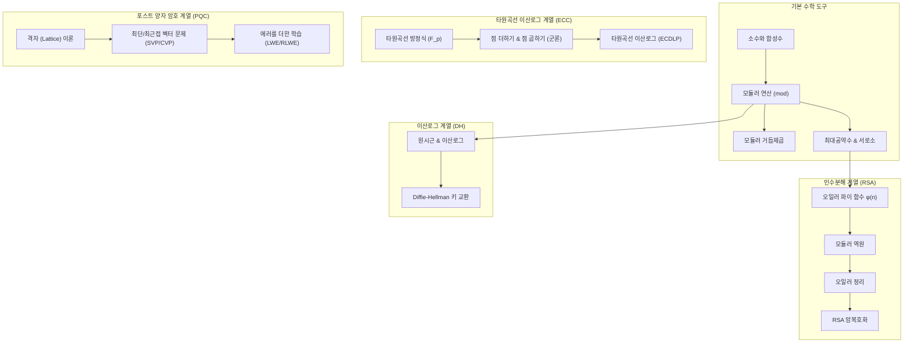

# [부록] 공개키 암호를 위한 수학 배경

> **이 글은 참고 자료다.** ③~⑤(공개키 원리 · ECC · PQC)에서 사용한 수학 개념만 따로 모아 정리했다. 막히는 부분이 생길 때 해당 항목을 찾아보면 되며, 처음부터 순서대로 읽을 필요는 없다.
> 관련 글: **[③ 공개키 암호의 원리](/posts/infosec-5-crypto-3-1-publickey/)** · **[④ ECC](/posts/infosec-5-crypto-3-4-ecc/)** · **[⑤ PQC](/posts/infosec-5-crypto-3-5-pqc/)** · 다음 글 **[⑦ 해시 함수와 응용](/posts/infosec-5-crypto-3-2-hash/)**
{: .prompt-info }

핵심 목표는 다음 한 줄이다.

> RSA와 Diffie-Hellman의 식을 "그냥 외우는 것"이 아니라, 왜 작동하는지 설명할 수 있게 만드는 것
{: .prompt-tip }

> **📜 역사 한 토막 — "쓸모없어서 아름답다"던 수학의 반전**
>
> 영국의 대수학자 G. H. Hardy는 1940년 에세이 <수학자의 변명>에서, 자신이 평생 연구한 정수론을 "전쟁에도 실용에도 쓰일 일이 없는, 그래서 순수하고 무해한 학문"이라고 자부했다. 그로부터 40년도 지나지 않아 소수와 모듈러 연산은 **RSA의 심장**이 되었고, 오늘날 인터넷 뱅킹과 전자상거래 전체가 이 "쓸모없다던" 수학 위에서 돌아간다. 지금부터 정리하는 내용이 바로 그 수학이다.
{: .prompt-tip }

## A.0 먼저 큰 그림

## A.1 소수, 합성수, 인수분해

### A.1.1 소수와 합성수

- 소수(prime): `1`과 자기 자신만 약수로 갖는 1보다 큰 자연수 (`2, 3, 5, 7, 11, ...`)
- 합성수(composite): 소수가 아닌 1보다 큰 수 (`4, 6, 8, 9, 10, ...`)

### A.1.2 왜 중요한가

1. RSA는 `n = p * q` 형태(`p`, `q`는 큰 소수)를 사용한다.
2. `n`만 보고 `p`, `q`를 찾는 인수분해가 어려우면 RSA가 안전해진다.
3. 즉, "곱하기는 쉽고, 다시 쪼개기는 어렵다"는 비대칭성이 핵심이다.

## A.2 모듈러 연산(mod): 시계 산술

### A.2.1 기본 정의

`a mod n`은 "`a`를 `n`으로 나눴을 때 나머지"다.

- `15 mod 12 = 3`
- `25 mod 7 = 4`
- `100 mod 23 = 8`

### A.2.2 암호에서 중요한 이유

암호학은 숫자가 매우 커진다. 그런데 mod를 쓰면 값을 일정 범위(`0`~`n-1`) 안에 유지할 수 있다.

### A.2.3 자주 쓰는 성질

$$
(a+b) \bmod n = [(a \bmod n) + (b \bmod n)] \bmod n
$$

$$
(a \times b) \bmod n = [(a \bmod n)\times(b \bmod n)] \bmod n
$$

## A.3 모듈러 거듭제곱

### A.3.1 왜 필요한가

RSA, DH는 모두 `a^x mod n` 형태를 반복 사용한다.

### A.3.2 예시

`3^4 mod 7`:

1. `3^2 = 9`, `9 mod 7 = 2`
2. `3^4 = (3^2)^2`
3. `3^4 mod 7 = 2^2 mod 7 = 4`

직접 큰 수를 만들지 않고 중간중간 mod를 취하면 계산이 빨라진다.

## A.4 서로소와 최대공약수(gcd)

### A.4.1 정의

- `gcd(a,b)`: `a`와 `b`의 최대공약수
- `gcd(a,b)=1`이면 서로소(coprime)

예시:

- `gcd(15,25)=5` (서로소 아님)
- `gcd(7,13)=1` (서로소)

### A.4.2 유클리드 호제법

$$
gcd(a,b) = gcd(b, a \bmod b)
$$

반복해서 나머지를 줄이면 빠르게 gcd를 구할 수 있다.

## A.5 오일러 파이 함수 φ(n)

### A.5.1 정의

`φ(n)`은 `1`부터 `n` 사이에서 `n`과 서로소인 수의 개수다.

### A.5.2 RSA에서 자주 쓰는 형태

`n = p*q`이고 `p,q`가 서로 다른 소수면 다음이 성립합니다:

$$
\varphi(n)=\varphi(pq)=(p-1)(q-1)
$$

#### 💡 왜 이렇게 되는가? (수학적 원리)
오일러 파이 함수는 "$1$부터 $n$까지의 자연수 중 $n$과 서로소인 수의 개수"입니다.

1. **소수 $p$의 경우**:
   소수 $p$의 약수는 $1$과 $p$뿐이므로, $1$부터 $p$까지의 수 중 $p$와 서로소가 아닌 수는 $p$ 자신 1개뿐입니다. 나머지 $p-1$개의 숫자는 모두 $p$와 서로소입니다.
   $$ \varphi(p) = p - 1 $$
2. **두 소수의 곱 $n = pq$의 경우**:
   $1$부터 $pq$까지의 정수(총 $pq$개) 중 $pq$와 서로소가 아닌 수(즉, $p$의 배수이거나 $q$의 배수인 수)를 구해서 전체에서 빼줍니다.
   - **$p$의 배수**: $p, 2p, 3p, \dots, qp$ (총 $q$개)
   - **$q$의 배수**: $q, 2q, 3q, \dots, pq$ (총 $p$개)
   - **중복된 수 제거**: 마지막 숫자 $pq$는 $p$의 배수이면서 동시에 $q$의 배수이므로 두 목록에 모두 들어가 중복으로 계산되었습니다.
   - 따라서 서로소가 아닌 수의 총 개수는 $p + q - 1$개입니다.
   - 전체 개수 $pq$에서 이를 빼주면 다음과 같이 인수분해됩니다:
     $$ \varphi(pq) = pq - (p + q - 1) = pq - p - q + 1 = (p-1)(q-1) $$

이 성질 덕분에, $p$와 $q$를 알고 있는 사람은 $\varphi(n)$을 곱셈 한 번으로 계산할 수 있지만, $n$만 알고 있는 사람은 $n$을 소인수분해하여 $p, q$를 밝혀내기 전까지는 $\varphi(n)$을 알아내는 것이 극도로 어렵습니다.

#### 예시:
- `p=11`, `q=13`
- `n=143`
- `φ(n)=(11-1)(13-1)=10*12=120`

## A.6 모듈러 역원

### A.6.1 정의

`a`의 모듈러 역원 `x`는 아래를 만족한다.

$$
a \times x \equiv 1 \pmod n
$$

이때 `x = a^{-1} mod n`으로 표기한다.

### A.6.2 존재 조건

역원이 존재하려면 `gcd(a,n)=1`이어야 한다.

### A.6.3 예시

`3x ≡ 1 (mod 7)`의 해:

- `3*1 mod 7 = 3`
- `3*2 mod 7 = 6`
- `3*3 mod 7 = 2`
- `3*4 mod 7 = 5`
- `3*5 mod 7 = 1`

따라서 `3^{-1} mod 7 = 5`.

### A.6.4 RSA와 연결

RSA에서 공개지수 `e`를 정하면 개인지수 `d`는

$$
e \times d \equiv 1 \pmod{\varphi(n)}
$$

을 만족하는 역원이다. 즉 `d = e^{-1} mod φ(n)`.

## A.7 오일러 정리

### A.7.1 정리

`gcd(a,n)=1`이면:

$$
a^{\varphi(n)} \equiv 1 \pmod n
$$

### A.7.2 간단 검산

- `a=3`, `n=10`
- `gcd(3,10)=1`
- `φ(10)=4`
- `3^4=81`, `81 mod 10 = 1`

성립한다.

### A.7.3 RSA 복호화가 되는 이유(핵심)

RSA에서 공개지수와 개인지수가 $e \times d \equiv 1 \pmod{\varphi(n)}$의 관계를 가지므로, $ed = 1 + k\varphi(n)$ (단, $k$는 정수)로 표현할 수 있습니다. 이때 임의의 평문 메시지 $M$을 암호화 후 복호화한 값 $M^{ed}$가 원래의 $M$과 같아지는 과정은 다음과 같이 수학적으로 유도할 수 있습니다.

#### 경우 1: 메시지 $M$이 모듈러 $n$과 서로소인 경우 ($\gcd(M, n) = 1$)
오일러 정리($M^{\varphi(n)} \equiv 1 \pmod n$)를 그대로 적용할 수 있습니다:
$$
M^{ed} = M^{1 + k\varphi(n)} = M \times (M^{\varphi(n)})^k \equiv M \times 1^k \equiv M \pmod n
$$
따라서 원래 메시지 $M$으로 깔끔하게 복원됩니다.

#### 경우 2: 메시지 $M$이 모듈러 $n$과 서로소가 아닌 경우 ($\gcd(M, n) > 1$)
이 경우는 $M$이 비밀 소수 $p$ 또는 $q$의 배수일 때 발생합니다. 이때는 **페르마의 소정리(Fermat's Little Theorem)**와 **중국인의 나머지 정리(CRT)**를 사용하여 증명합니다. $M$이 $p$의 배수라고 가정하면:
1. $M \equiv 0 \pmod p$ 이므로, 임의의 거듭제곱에 대해 $M^{ed} \equiv 0 \equiv M \pmod p$ 가 성립합니다.
2. 한편, $M$은 $p$의 배수이지만 다른 소수 $q$와는 서로소이므로, 페르마의 소정리($M^{q-1} \equiv 1 \pmod q$)에 의해 다음과 같이 계산됩니다:
   $$ M^{ed} = M^{1 + k(p-1)(q-1)} = M \times (M^{q-1})^{k(p-1)} \equiv M \times 1^{k(p-1)} \equiv M \pmod q $$
3. $M^{ed} - M$은 $p$의 배수이면서 동시에 $q$의 배수입니다. $p$와 $q$는 서로 다른 소수이므로, $M^{ed} - M$은 이들의 곱인 $n = pq$의 배수가 되어야 합니다.
   $$ M^{ed} \equiv M \pmod n $$

결과적으로 평문 $M$이 $n$과 서로소이든 아니든 상관없이 RSA 복호화 공식은 항상 완벽하게 성립합니다.

## A.8 Diffie-Hellman(DH) 키 교환

Diffie-Hellman(DH)은 통신 당사자들이 도청자가 엿듣고 있는 공개된 채널 위에서 안전하게 하나의 **공통 비밀키(세션키)**를 나누어 가지기 위해 고안된 알고리즘입니다.

### A.8.1 수학적 원리
1. **키의 정의**:
   - **개인키 (Private Key)**: 외부에는 공개하지 않고 나만 알고 있는 비밀 정수 $a \in \mathbb{Z}_{p-1}^*$ (즉, $1 \le a < p-1$).
   - **공개키 (Public Key)**: 큰 소수 $p$와 곱셈군의 원시근 $g$에 대해, $g$를 비밀 지수 $a$만큼 거듭제곱한 모듈러 연산 결과 $A = g^a \bmod p$.
2. **키 교환 프로세스**:
   - Alice는 자신의 개인키 $a$로 공개키 $A = g^a \bmod p$를 만들어 Bob에게 전송합니다.
   - Bob은 자신의 개인키 $b$로 공개키 $B = g^b \bmod p$를 만들어 Alice에게 전송합니다.
   - Alice는 받은 $B$를 자신의 개인키 $a$제곱하여 공통 키를 얻습니다: $K = B^a \bmod p = (g^b)^a = g^{ba} \bmod p$.
   - Bob은 받은 $A$를 자신의 개인키 $b$제곱하여 공통 키를 얻습니다: $K = A^b \bmod p = (g^a)^b = g^{ab} \bmod p$.
   - 곱셈의 교환법칙($ab = ba$) 덕분에 양측은 동일한 공통 키 $K = g^{ab} \bmod p$를 손에 쥡니다.

### A.8.2 수학적 안전성 배경과 쉬운 해설
공격자는 도청을 통해 공개된 값인 소수 $p$, 원시근 $g$, 그리고 두 공개키 $A, B$를 획득할 수 있습니다. 그럼에도 공통 비밀키 $K$를 알아낼 수 없는 이유는 아래 세 가지 난제 때문입니다.

#### ① 이산로그 문제 (DLP - Discrete Logarithm Problem)
- **정확한 정의**: 주어진 소수 $p$, 원시근 $g$, 그리고 $A \equiv g^a \pmod p$ 값을 만족하는 유일한 비밀 정수 $a \in [1, p-1]$를 알아내는 문제입니다.
- **직관적인 비유 (징검다리 시계 바늘 점프)**:
  17칸짜리 원형 시계판(모듈러 $17$)이 있고, 시작점은 1번 칸입니다. 여기에 "내 발판 번호에 3을 곱한 칸으로 점프한다"는 규칙(원시근 $g=3$)이 있습니다.
  * 1번 점프: $1 \times 3 = 3$ (3번 칸)
  * 2번 점프: $3 \times 3 = 9$ (9번 칸)
  * 3번 점프: $9 \times 3 = 27 \equiv 10 \pmod{17}$ (10번 칸)
  * 4번 점프: $10 \times 3 = 30 \equiv 13 \pmod{17}$ (13번 칸)
  
  만약 누군가 "최종 도착지가 13번 칸이야"라고 알려준다면, 3을 몇 번 거듭제곱했는지 바로 맞출 수 있을까요? 
  게임판이 17칸 정도로 작을 때는 직접 한 땀 한 땀 뛰어보면 '4번'이라는 것을 금방 알 수 있습니다. 하지만 시계판 크기가 상상할 수 없을 정도로 거대하다면(예: 600자리 자릿수의 소수), 컴퓨터로도 하나씩 점프해 보는 것 외에는 지수가 무엇이었는지 알아낼 빠른 지름길이 전혀 없습니다. 이처럼 **도착한 발판 위치만 보고 몇 번 점프했는지(지수가 무엇인지) 알아맞히는 난제**가 이산로그 문제(DLP)입니다.

#### ② 계산 디피-헬먼 문제 (CDH - Computational Diffie-Hellman)
- **정확한 정의**: 소수 $p$, 원시근 $g$, 그리고 두 공개값 $g^a \bmod p$와 $g^b \bmod p$가 주어졌을 때, 비밀값 $a$와 $b$를 구하지 않은 상태에서 최종 공통키 $g^{ab} \bmod p$를 직접 계산해내는 문제입니다.
- **직관적인 비유 (각자의 점프 횟수를 모른 채 곱해진 도착지 알아내기)**:
  Alice가 몇 번 점프했는지는 모르지만 그녀의 최종 도착지인 $A = g^a \bmod p$를 알고 있고, Bob의 최종 도착지 $B = g^b \bmod p$도 알고 있습니다.
  이때 **"Alice가 뛴 횟수 $a$와 Bob이 뛴 횟수 $b$를 서로 곱한 횟수($a \times b$번)만큼 뛰었을 때의 도착지 $g^{ab} \bmod p$가 어디일지"** 계산해내는 문제와 같습니다. 각각의 점프 횟수 $a, b$를 알아내지 못한다면 이 곱해진 점프 횟수의 도착지를 알아내는 수학적 방법도 없습니다.

#### ③ 판정 디피-헬먼 문제 (DDH - Decisional Diffie-Hellman)
- **정확한 정의**: 세 공개값 $(g^a \bmod p, g^b \bmod p, Z)$가 주어졌을 때, $Z$가 실제 수학적 관계를 만족하는 공통 비밀키 $g^{ab} \bmod p$인지, 아니면 모듈러 $p$ 세계에서 아무렇게나 고른 임의의 무작위 값인지를 구별해내는 문제입니다.
- **직관적인 비유 (진짜 비밀방과 무작위 가짜 방 구별하기)**:
  Alice와 Bob의 도착지 발판이 놓여 있고, 제3자가 와서 $Z$라는 임의의 발판을 보여주며 "이게 진짜 두 사람의 비밀 공통 발판($g^{ab}$)이야!"라고 주장합니다.
  여러분은 그 $Z$가 진짜 계산된 결과물인지, 아니면 아무 숫자나 던진 사기극인지 구분해낼 수 있을까요? 
  실제로 이 둘은 외관상 완전히 똑같이 생겨서 수학적으로 구별할 수 없습니다. 이 구별이 불가능하다는 성질(DDH 가정) 덕분에, 해커는 교환된 키가 어떤 값인지에 대한 실마리를 단 1%도 얻지 못하게 됩니다.
- **최신 공격 복잡도**: 현재까지 이산로그 문제를 푸는 가장 강력한 알고리즘은 **GNFS-DL (General Number Field Sieve for Discrete Logarithm)**로, sub-exponential(준지수) 시간의 성능을 가집니다. 따라서 충분히 큰 소수(2048비트 이상)를 사용하면 현실적으로 안전합니다.

### A.8.3 암호 계열 분류
- **수학적 계열**: **이산로그 (DLP) 계열**

## A.9 RSA 암호체계

RSA는 대칭키를 안전하게 교환하기 위해 암호화하여 전달하거나, 문서가 위조되지 않았음을 확인하는 전자서명에 널리 사용되는 가장 대표적인 공개키 암호 알고리즘입니다.

### A.9.1 수학적 원리
1. **키의 정의**:
   - **공개키 (Public Key)**: 누구나 볼 수 있는 암호화 지수 $e$와 합성수 $n$의 쌍인 $(e, n)$.
     - $n = pq$ ($p$와 $q$는 본인만 알고 있어야 하는 서로 다른 거대 소수).
     - $e$: 오일러 파이 함수 값 $\varphi(n) = (p-1)(q-1)$과 공통 약수가 없는 서로소 관계인 임의의 홀수.
   - **개인키 (Private Key)**: 복호화에만 쓰이는 지수 $d$와 합성수 $n$의 쌍인 $(d, n)$ (혹은 비밀 소수 $p, q$).
     - $d$: 모듈러 연산 세계에서 $e$의 곱셈 역원인 $d \equiv e^{-1} \pmod{\varphi(n)}$. 즉, $e \times d \equiv 1 \pmod{\varphi(n)}$을 만족하는 값입니다.

2. **암호화와 복호화**:
   - **암호화**: 평문 $M$을 공개키의 $e$만큼 거듭제곱하여 나머지를 구합니다: $C = M^e \bmod n$.
   - **복호화**: 암호문 $C$를 개인키의 $d$만큼 거듭제곱하여 나머지를 구합니다: $M = C^d \bmod n$.
   - ⑥ 수학 배경 A.7.3에서 수학적으로 증명했듯이 $C^d = (M^e)^d = M^{ed} \equiv M \pmod n$이 항상 성립하여 평문이 완벽하게 돌아옵니다.

### A.9.2 수학적 안전성 배경과 쉬운 해설
공격자는 공개키 $(e, n)$과 가로챈 암호문 $C$를 알고 있습니다. 이 정보들로 원래 메시지 $M$을 찾지 못하는 이유는 다음 난제들 때문입니다.

#### ① 소인수분해 문제 (IFP - Integer Factorization Problem)
- **정확한 정의**: 주어진 거대한 합성수 $n = pq$가 두 소수 $p, q$의 곱으로 이루어졌을 때, 소인수 $p$와 $q$를 찾아내는 문제입니다.
- **직관적인 비유 (물감 섞기와 되돌리기)**:
  빨간색 물감과 노란색 물감을 섞어서 주황색 물감을 만드는 일은 아주 쉽고 빠릅니다. 이것이 두 소수를 곱해서 합성수를 만드는 **'곱셈 연산'**입니다.
  하지만 완성된 주황색 물감 한 통을 여러분에게 주면서 "원래 들어갔던 빨간색 물감의 성분과 노란색 물감의 성분을 한 방울의 오차도 없이 완벽하게 두 통으로 분리해내라"고 한다면 거의 불가능할 것입니다. 이것이 **'소인수분해 문제'**입니다.
  수백 자리의 거대한 두 소수를 곱하는 것은 컴퓨터로 1초도 안 걸리지만, 곱한 결과값만 보고 원래 어떤 두 소수 $p, q$였는지 역추적하는 것은 슈퍼컴퓨터로 수억 년을 돌려도 풀리지 않는 일방향 난제입니다. 이 소인수분해가 뚫리는 순간 오일러 파이 함수 값 $\varphi(n) = (p-1)(q-1)$이 계산되어 개인키 $d$도 즉시 유도됩니다.

#### ② RSA 문제
- **정확한 정의**: 합성수 $n$과 지수 $e$, 그리고 암호문 $C \equiv M^e \pmod n$을 알 때, $n$을 소인수분해하지 않고 수학적으로 평문 $M$(즉, 모듈러 $n$ 상에서의 $e$제곱근)을 직접 구하는 문제입니다.
- **직관적인 비유 (자물쇠 속 회전수 알아맞히기)**:
  어떤 다이얼 금고 자물쇠가 있습니다. 비밀 번호를 설정하기 위해 다이얼을 시계 방향으로 $e$번만큼 일정한 규칙으로 돌려서 금고를 잠갔습니다(암호문 $C$).
  금고를 열려면 반대 방향으로 $d$번 돌려야 하는데, 이 $d$는 금고 바퀴가 한 바퀴 돌 때의 전체 칸 수(오일러 파이 함수 값)를 알아야만 역계산이 가능합니다. 이 구조를 무시하고 단지 돌아가 잠긴 다이얼의 최종 눈금만을 쳐다보며 원래 몇 칸을 돌렸었는지($M$) 알아맞히는 것은 불가능합니다.
- **최신 공격 복잡도**: 합성수를 소인수분해하기 위해 인류가 개발한 가장 효율적인 최강 알고리즘은 **GNFS (General Number Field Sieve)**로, sub-exponential(준지수) 시간의 성능을 가집니다. 마찬가지로 2048비트 이상의 $n$을 사용하면 무결한 안전성을 확보할 수 있습니다.

### A.9.3 RSA 미니 예제 (수업용 작은 숫자)
1. 소수 선택: $p=11$, $q=13$
2. $n = pq = 143$
3. $\varphi(n) = (11-1)(13-1) = 120$
4. 공개지수 선택: $e=7$ ($\gcd(7, 120) = 1$ 만족)
5. 개인지수 계산: $d=103$ ($7 \times 103 = 721 \equiv 1 \pmod{120}$ 만족)

- 공개키: $(e, n) = (7, 143)$
- 개인키: $(d, n) = (103, 143)$

* 평문 $M=5$ 암호화:
  $$ C = M^e \bmod n = 5^7 \bmod 143 = 47 $$
* 복호화:
  $$ M = C^d \bmod n = 47^{103} \bmod 143 = 5 $$

### A.9.4 암호 계열 분류
- **수학적 계열**: **인수분해 (IFP) 계열**

## A.10 ECC와 PQC의 수학

위 A.0의 큰 그림에서 **ECDLP 계열**과 **포스트 양자 계열**에 해당하는 부분은 각각 독립된 글에서 다룬다.

> - **[④ 타원곡선 암호(ECC)](/posts/infosec-5-crypto-3-4-ecc/)** — 유한체 위 타원곡선, 점 덧셈과 스칼라 배, 타원곡선 이산로그 문제(ECDLP), RSA보다 키가 작아도 안전한 이유
> - **[⑤ 포스트 양자 암호(PQC)](/posts/infosec-5-crypto-3-5-pqc/)** — 쇼어 알고리즘의 위협, 격자(Lattice) 기반 암호, SVP·CVP·LWE, NIST 표준(ML-KEM·ML-DSA)과 대안 계열
{: .prompt-tip }

## A.11 수업에서 자주 나오는 질문

### Q1. 왜 꼭 소수를 쓰나요?

소수 기반 구조는 역원, φ(n), 정리 적용이 깔끔해지고, 안전성 가정(인수분해/이산로그)도 명확해진다.

### Q2. 왜 숫자를 크게 하나요?

수학적 "가능/불가능"이 아니라 계산 비용의 싸움이다. 충분히 큰 수를 써서 공격 비용을 비현실적으로 만든다.

### Q3. 이 수학을 전부 증명해야 하나요?

입문 단계에서는 개념-연결-계산 흐름을 정확히 이해하는 것이 목표다.  
증명은 상위 과정에서 확장하면 된다.
