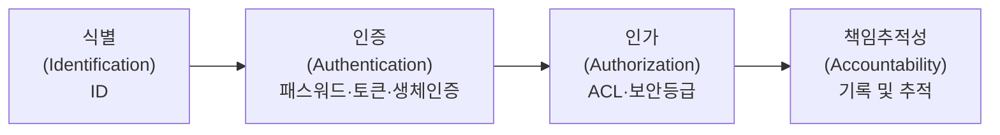
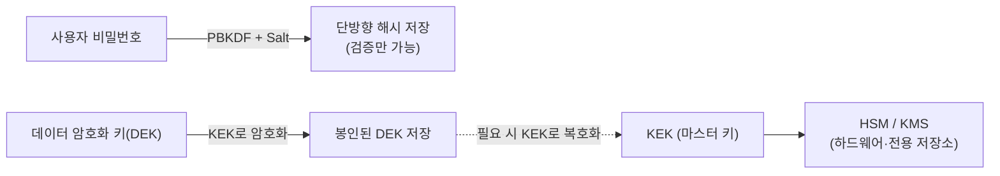
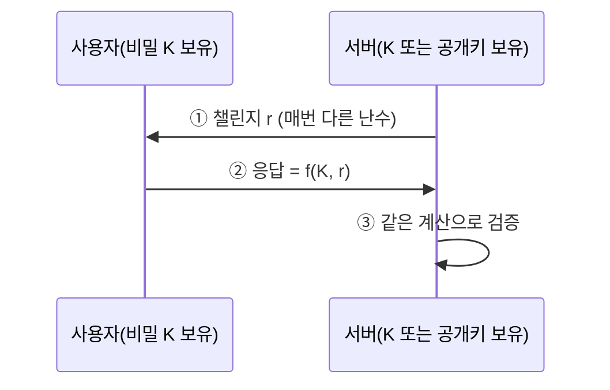

# 인증(Authentication) — 지식 기반

학생들이 매일 접하는 서비스는 대부분 로그인 화면에서 시작한다.  
학교 포털, 메신저, 게임, 인터넷 쇼핑몰 모두 "누구인지 확인하고, 어디까지 접근할 수 있는지 정하는 과정"을 갖고 있다.  
이 글에서는 **접근통제(Access Control)** 의 전체 구조와, 그중 **인증(Authentication)** 의 첫 번째 축인 **지식 기반(내가 아는 것)** 인증을 깊이 있게 다룬다.

> **이 시리즈의 구성**
> - **① 인증 — 지식 기반(이 글)**: 패스워드, 솔트·PBKDF, 키 저장, 크래킹 도구, 메시지 인증, Challenge-Response·영지식 식별, i-PIN
> - **② 인증 — 소유·생체 기반**: OTP, 생체인증, FIDO, MFA, SSO/Kerberos, 웹 인증 → **[접근통제 ① 인증(2) — 소유·생체 기반](/posts/infosec-9-auth-1-2-possession-biometric/)**
> - **③ 인가**: 접근제어 행렬·ACL·BLP/Biba 등 → **[접근통제 ② 인가(Authorization)](/posts/infosec-9-auth-2-authorization/)**
{: .prompt-info }

> 비밀번호 저장에 쓰는 솔트·PBKDF, OTP의 씨앗(seed) 같은 **키·난수** 개념의 상세는 **[키 관리와 난수](/posts/infosec-5-crypto-4-key-random/)** 참고.
{: .prompt-info }

---

## 1. 접근통제 개요

**접근통제(Access Control)** 는 시스템 자원의 접근과 관련된 모든 보안 주제를 통칭하는 용어다.

핵심 질문은 두 가지다.

- **인증(authentication)**: 당신은 당신이라고 주장하는 사람이 맞는가?
- **인가(authorization)**: 당신은 그렇게 하도록 허락을 받았는가?

### 1.1 접근통제 4단계

교과서적으로 접근통제는 다음 4단계로 구성된다.

| 단계 | 명칭 | 설명 | 예시 |
|---|---|---|---|
| 1 | 식별(Identification) | 내가 누구인지 시스템에 밝힘 | 아이디(ID) 입력 |
| 2 | 인증(Authentication) | 내가 본인임을 증명 | 패스워드, 토큰, 스마트카드, 생체인증 |
| 3 | 인가(Authorization) | 허가된 범위 내에서만 접근 허용 | 접근제어목록(ACL), 보안 등급 |
| 4 | 책임추적성(Accountability) | 모든 행위를 기록하고 추적 | 로그 기록 및 감사 |



> 로그인 성공만으로 모든 것이 끝나는 것이 아니다.  
> 인가 확인 → 책임추적성까지 이어져야 완전한 접근통제가 된다.
{: .prompt-tip }

---

## 2. 인증과 인가의 차이

### 2.1 인증(Authentication)

인증은 "당신이 누구인지 증명해 보세요"라는 질문에 답하는 과정이다.


- **식별(Identification)**: 사용자가 어떤 아이디를 쓰는지 밝히는 단계 — 예: 학번 입력
- **인증(Authentication)**: 그 아이디가 정말 본인인지 확인하는 단계 — 예: 비밀번호 입력
- **인가(Authorization)**: 본인이 맞다면 무엇을 할 수 있는지 허용 범위를 정하는 단계

### 2.2 인가(Authorization)

인가는 인증이 끝난 뒤 "그 사람이 무엇을 할 수 있는가"를 결정하는 과정이다.  
같은 학교 포털에 로그인해도 학생·교사·관리자 화면이 다른 이유가 여기에 있다. (상세는 **[인가(Authorization)](/posts/infosec-9-auth-2-authorization/)** 글)

- 학생은 자신의 성적만 조회 가능
- 교사는 담당 반 성적 입력 가능
- 관리자는 사용자 계정과 권한을 관리 가능

> **인증 ≠ 인가.**  
> 비밀번호가 유출되어 다른 사람이 로그인했다면 **인증 문제**,  
> 로그인은 정상인데 일반 사용자가 관리자 기능에 접근할 수 있다면 **인가 문제**다.
{: .prompt-warning }

---

## 3. 사용자 인증의 4가지 요소

사람이 기계로부터 인증받을 수 있는 근거는 흔히 "3요소"로 설명하지만,  
최근에는 위치·행위까지 포함해 **4가지 범주**로 나누어 설명하는 것이 일반적이다.


| 구분 | 영문 용어 | 의미 | 예 |
|---|---|---|---|
| **지식 기반** | What you **know** | 내가 **아는** 것 | 패스워드, PIN, 패스프레이즈, 보안질문 |
| **소유 기반** | What you **have** | 내가 **가진** 것 | ATM 카드, 스마트폰, OTP 토큰, 인증서 |
| **존재(생체) 기반** | What you **are** | **나 자신**인 것 | 지문, 홍채, 얼굴, 정맥 |
| **기타(행위 등)** | What you **do** / where you are | 내가 **하는 행동**·있는 **위치** | 서명 동작, 타이핑 리듬, 걸음걸이, 접속 위치(GPS·IP) |

- **지식·소유·존재**가 전통적 3요소이고, **행위(behavioral)·위치(location)** 는 이를 보조하는 "기타" 요소다.
- 서로 **다른 범주**를 2개 이상 결합하면 **다요소 인증(MFA)** 가 된다. (→ 소유·생체 편에서 상세)

> **이 글의 범위.** 본 글은 4요소 중 **지식 기반(Something You Know)** — 즉 **패스워드 계열**과, 비밀(지식)을 노출하지 않고 증명하는 **식별 프로토콜**을 다룬다.  
> 소유(OTP·토큰)·존재(생체)·행위 기반은 **[다음 글](/posts/infosec-9-auth-1-2-possession-biometric/)** 에서 이어진다.
{: .prompt-info }

---

## 4. 패스워드의 분류: 고정 패스워드 vs 일회용 패스워드

같은 "패스워드"라도 **한 번 정하면 계속 쓰는가**, **매번 바뀌는가**에 따라 성격이 완전히 다르다.

| 구분 | 고정 패스워드(Static) | 일회용 패스워드(OTP, One-Time) |
|---|---|---|
| 값의 변화 | **항상 동일** (사용자가 바꾸기 전까지) | **매번 변경** (1회용) |
| 재사용 | 같은 값을 반복 사용 | 한 번 쓰면 폐기 |
| 도청 시 위험 | **치명적** — 가로채면 계속 악용 | 낮음 — 다음 로그인엔 무용 |
| 재전송 공격 | 취약 | **방어됨** |
| 필요한 것 | 기억만 하면 됨 | 토큰·앱 등 **생성 수단** 필요 |
| 분류 | 지식 기반 | 소유 기반에 가까움(기기 필요) |

- **고정 패스워드**는 가장 흔하지만, 유출·재사용·도청에 약하다 → **이 글(지식 기반)에서 집중적으로 다룬다.**
- **일회용 패스워드(OTP)** 는 생성 기기·앱(소유물)에 의존하므로 메커니즘 상세(TOTP·HOTP·S/KEY)는 **[소유·생체 기반 편](/posts/infosec-9-auth-1-2-possession-biometric/)** 에서 다룬다. 본 글에서는 9장에서 **개념 비교**만 한다.

---

## 5. 고정 패스워드의 조건과 한계

### 5.1 이상적인 패스워드란

이상적인 패스워드의 조건:

- 사용자가 알고 있고, 컴퓨터가 그것을 검증할 수 있어야 함
- 무제한으로 컴퓨팅 자원에 접근할 수 있는 다른 누구라도 추측할 수 없어야 함

패스워드가 인기 있는 이유는 **비용과 편의성** 때문이다.

- 패스워드는 무료이며, 새로 생성하는 것이 훨씬 편리함
- ATM 카드나 PIN 번호도 패스워드처럼 행동하는 것들

### 5.2 키 vs. 패스워드: 엔트로피 비교

암호 키와 패스워드는 비슷해 보이지만 엔트로피에 큰 차이가 있다.

**예시 비교**

트루디가 64비트 키를 사용하는 대칭 암호로 암호문 메시지를 해독한다고 가정하자.

- 키는 무작위로 선택되었으며 지름길 공격도 없음
- 트루디는 정확한 키를 찾아내기 전에 평균적으로 $2^{63}$개의 키를 시도해야 함

이번엔 트루디가 앨리스의 패스워드를 추측하고자 하는데,  
앨리스의 패스워드는 **8자 길이**이며 각 글자는 **256개** 중 선택 가능하다고 가정하면:

$$\text{가능한 패스워드} = 256^8 = 2^{64}$$

이론적으로 키 공간과 같지만, 문제는 **사용자는 기억하기 쉬운 것을 선택할 가능성이 훨씬 높다는 점이다.**

```
Kf&Y3!aE  보다  Frank012  를 선택하는 경향이 있다.
```

### 5.3 취약한 패스워드와 강한 패스워드

**취약한 패스워드 예시**: `Frank`, `Pikachu`, `incorrect`, `10252010`, `AustinStamp`

**강한 패스워드를 만드는 방법**:

| 예시 | 특징 |
|---|---|
| `jflej(43j-EmmL+y` | 트루디가 알아내기 어렵지만 앨리스가 기억하기도 어려움 |
| `09864376537263` | 대부분의 사용자가 기억하기 어려움 |
| `FS&7Yago` | 앨리스가 기억하기엔 쉬우면서 트루디가 알아내기 어려움 |
| `Servenoterampartoriginal` | **패스워드를 선정하는 최고의 방법** — 긴 패스프레이즈 |

> 사용자들에게 줄 수 있는 최선의 조언은 **단어에 기반한 긴 패스프레이즈를 선택하라는 것**이다.  
> 즉, 외울 수 있으면서도 어려운 것.
{: .prompt-tip }

### 5.4 자주 쓰이는 비밀번호 실태

실제로 유출된 데이터베이스를 분석해 보면, 가장 많이 쓰이는 비밀번호는 충격적일 정도로 단순하다.

| 순위 | 패스워드 | 사용 횟수 |
|---|---|---|
| 1 | 123456 | 120,417 |
| 2 | 123456789 | 32,775 |
| 3 | qwerty | 22,770 |
| 4 | password | 17,471 |
| 5 | 1234567 | 14,401 |
| 6 | 1234567890 | 13,799 |
| 7 | 12345678 | 13,380 |
| 8 | 123321 | 13,161 |
| 9 | 111111 | 12,138 |
| 10 | 12345 | 11,239 |

보안을 위해 비밀번호를 사이트마다 다르게 설정하는 것이 좋지만,  
수십 개의 사이트마다 다른 비밀번호를 저장 후 기억하기란 거의 불가능한 것이 현실이다.

### 5.5 패스워드 선정 실험 결과

패스워드 선정 방식에 따라 크래킹 성공률이 크게 달라진다는 연구 결과가 있다.

| 그룹 | 지침 | 해독 성공률 |
|---|---|---|
| A | 적어도 여섯 문자로 된 패스워드를 선정 | 약 30% |
| B | 패스프레이즈에 근거해서 패스워드를 정함 | 약 10% |
| C | 8자리의 문자를 무작위로 선택해 패스워드를 구성 | 약 10% |

결론: **단어에 기반한 긴 패스프레이즈**가 기억하기도 쉽고 공격에도 강하다.

### 5.6 패스워드 인증의 문제점

패스워드는 싸고 편하지만, 구조적으로 다음 약점을 안고 있다.

| 문제 | 내용 |
|---|---|
| **추측·약한 선택** | 사용자는 기억하기 쉬운(=추측하기 쉬운) 값을 고르는 경향 |
| **재사용** | 한 사이트가 털리면 같은 비밀번호를 쓴 다른 사이트까지 연쇄 침해(크리덴셜 스터핑) |
| **도청·재전송** | 평문 전송 시 가로채여 그대로 재사용 가능 |
| **사회공학·피싱** | 가짜 로그인 페이지로 직접 입력하게 유도 |
| **키로거·스파이웨어** | 키 입력을 기록해 탈취 |
| **서버 측 유출** | 서버가 평문/약한 해시로 저장하면 대량 유출 |
| **계정 잠금 역이용** | 잠금 정책을 악용한 DoS (아래) |

**계정 잠금의 역설(DoS)**

일반적으로 틀린 패스워드를 3회 이상 반복 시도하면 시스템은 잠금 상태가 된다.  
그러나 이 방어 방식에는 역이용 가능한 허점이 있다.

> 트루디가 모든 계정을 대상으로, 각 계정에 대해 5분 내에 3회 패스워드 추측을 반복하면  
> **모든 계정을 영원히 잠금 상태에 있도록 만들 수 있다.**  
> 이는 가용성을 훼손하는 서비스 거부(DoS) 공격이 된다.
{: .prompt-danger }

---

## 6. 패스워드 저장: 해시 · 솔트 · PBKDF

### 6.1 왜 해시로 저장하는가

서비스가 패스워드를 **그대로(평문)** 저장하는 것은 매우 위험하다.

1. 서버가 침해되면 사용자의 비밀번호가 한 번에 유출된다.
2. 사용자가 다른 사이트에서도 같은 비밀번호를 썼다면 피해가 연쇄적으로 퍼진다.
3. 서비스 운영자조차 사용자의 비밀번호를 직접 알 수 있게 된다.

- 패스워드 파일을 대칭키로 **암호화**하는 방법도 있으나, 검증하려면 복호화 키에도 접근이 가능해야 하므로 큰 의미가 없다.
- **해시된 패스워드로 저장하는 것이 훨씬 더 나은 방법**이다.

앨리스의 패스워드가 `servenoterampartoriginal`일 때, 파일에는 다음과 같이 저장된다.

$$y = h(\text{servenoterampartoriginal})$$

패스워드를 보호하기 위해 암호화 해시 함수의 **단방향(one-way) 특성**에만 의존한다.  
그래서 많은 서비스에서 "비밀번호 찾기"를 하면 원래 비밀번호를 보여 주지 않고, **비밀번호 재설정 링크**만 보내는 것이다.

### 6.2 사전 공격(Dictionary Attack)이 가능한 이유

트루디가 $N$개의 공통적인 패스워드를 담고 있는 사전을 가지고 있다고 가정하자.

$$d_0, d_1, d_2, \cdots, d_{N-1}$$

그러면 트루디는 사전에서 각 패스워드의 해시를 미리 계산할 수 있다.

$$y_0 = h(d_0),\ y_1 = h(d_1),\ \cdots,\ y_{N-1} = h(d_{N-1})$$

트루디가 해시된 패스워드를 포함하는 패스워드 파일에 접근하게 된다면,  
패스워드 파일에 있는 엔트리와 미리 계산한 사전에 있는 엔트리를 비교하기만 하면 된다.  
이 미리 계산된 해시 사전은 **재사용 가능**하므로 각 패스워드 파일별로 다시 계산하지 않아도 된다.


### 6.3 패스워드 크래킹의 종류

#### (1) 사전 공격 (Dictionary Attack)

영어사전, 국어사전에 있는 단어들처럼 하나의 패스워드 사전 파일로 만든 후,  
하나씩 대입하여 패스워드 일치 여부를 확인한다.

- 예: `asdf`, `qazplm`, `angel`

#### (2) 무차별 대입 공격 (Brute Force Attack)

비밀번호로 사용될 수 있는 모든 문자를 대입하여 패스워드 일치 여부를 확인한다.

- 예: `a`, `ab`, `abc`, `aba`, `abb`, ...

#### (3) 혼합 공격 (Hybrid Attack)

사전 공격 + 무차별 공격을 혼합한다.  
사전파일에 있는 문자열에 문자·숫자 등을 추가로 무작위 대입하여 패스워드 일치 여부 확인.  
일반적으로 사전 파일 문자열 뒤에 숫자나 문구를 추가한다.

- 예: `qazplm159`, `asdf123`

#### (4) 레인보우 테이블 공격 (Rainbow Table Attack)

**패스워드와 해시로 이루어진 체인을 무수히 만들어 놓고,**  
**해시 함수($H$)와 리덕션 함수($R$)의 반복으로 일치하는 해시를 역추적해 패스워드를 찾아내는 방식이다.**


_레인보우 테이블의 핵심 원리: 해시 함수($H$)와 리덕션 함수($R$)의 반복적 연결_

**체인(Chain)의 흐름 예시**

$$\text{bnis} \xrightarrow{H} \text{853c3622} \xrightarrow{R_1} \text{vqky} \xrightarrow{H} \text{0549e738} \xrightarrow{R_2} \text{bmki} \xrightarrow{H} \text{69b9bf21} \cdots$$

- 테이블에는 체인의 **시작 값**과 **끝 값**만 저장하여 디스크 용량을 대폭 아낀다.
- **리덕션 함수(R)** 는 해시의 역함수가 아니라, 해시값을 임의의 평문 후보로 매핑하는 규칙이다.
- 매 단계마다 **서로 다른 리덕션 함수**($R_1, R_2, \cdots$)를 쓰는 이유는 체인 병합(Merge)을 방지하기 위함 — 서로 다른 색깔을 가진 무지개처럼 보인다 하여 '레인보우'라고 부른다.

**레인보우 공격 시나리오 예시**

> 트루디가 어느 게시판 서버를 털어 `사용자명 : SHA-1 해시` 목록을 손에 넣었다고 하자.
>
> 1. 저장된 해시 하나를 고른다: `5baa61e4c9b93f3f0682250b6cf8331b7ee68fd8`
> 2. 이 값에 **리덕션 함수 $R$** 를 적용해 평문 후보를 만들고, 다시 **해시 $H$** → 또 $R$ → … 를 반복하며 체인을 따라간다.
> 3. 계산된 값이 미리 만든 테이블의 **어떤 체인의 끝 값**과 일치하면, 그 체인의 **시작 값**부터 다시 해시를 전개해 본다.
> 4. 전개 도중 원래의 해시 `5baa61e4…` 가 나오는 순간, **그 직전 평문**이 정답이다 → 결과: `password`
>
> 미리 만들어 둔 테이블만 있으면 **단 몇 초** 만에 역추적이 끝난다. 무차별 대입이 며칠 걸릴 일을, "시간 ↔ 저장공간"을 맞바꿔(time-memory trade-off) 단축한 것이다.
{: .prompt-danger }


### 6.4 Salt: 레인보우·사전 공격 무력화


레인보우/사전 공격은 **"미리 계산해 둔 해시 표"** 를 재사용한다는 점이 핵심이다.  
**솔트(salt)** 는 비밀이 아닌 **난수 값**을 패스워드마다 따로 붙여, 이 "미리 계산"을 무력화한다.

```
password + SALT1 = passwordSALT1  =>  A7981C...
password + SALT2 = passwordSALT2  =>  F1389E...
```

두 사람이 같은 비밀번호 `qwer1234`를 써도,  
각자의 salt가 다르므로 저장값이 달라진다.

- A의 저장값: `Hash(qwer1234 + 7F2A...)`
- B의 저장값: `Hash(qwer1234 + 91CD...)`

**구체적 예시 — 솔트가 없을 때 vs 있을 때**

> 같은 비밀번호 `sunny`를 쓰는 두 사용자가 있다.
>
> **(가) 솔트 없음**
> ```
> alice : sha256("sunny") = 5c62...e3a1
> bob   : sha256("sunny") = 5c62...e3a1   ← 저장값이 똑같다!
> ```
> - 둘이 같은 비밀번호임이 한눈에 드러난다.
> - 공격자는 `5c62...e3a1` 하나만 레인보우 테이블에서 찾으면 **두 계정을 동시에** 뚫는다.
>
> **(나) 솔트 적용** (각자 16바이트 난수 솔트 부여)
> ```
> alice : salt=9f3a..  →  sha256("sunny" + "9f3a..") = 11b8...77c0
> bob   : salt=42d1..  →  sha256("sunny" + "42d1..") = e904...2af5
> ```
> - 같은 비밀번호인데 저장값이 **완전히 달라진다.**
> - 공격자는 **솔트마다 따로** 테이블을 다시 만들어야 한다 → 미리 만든 레인보우 테이블이 **전부 무용지물**.
> - 솔트가 16바이트(=$2^{128}$가지)면, 모든 솔트에 대한 사전 계산은 사실상 불가능하다.
{: .prompt-tip }

**Salt 사용의 원칙**

1. **사용자마다(가능하면 비밀번호 변경마다) 새 난수 솔트**를 만든다.
2. 솔트는 비밀이 아니다 → 해시값과 **함께 저장**해도 된다(보통 `$알고리즘$솔트$해시` 형태로 한 줄에 저장).
3. 솔트는 **충분히 길고**(16바이트 이상 권장) **예측 불가능한 난수**여야 한다 (→ **[키 관리와 난수](/posts/infosec-5-crypto-4-key-random/)**).

> 솔트만으로 끝이 아니다. 솔트는 "표 재사용"을 막을 뿐, **해시 자체가 빠르면** 솔트별 대입은 여전히 빠르다. 그래서 솔트와 함께 **느린 해시(PBKDF)** 를 써야 한다. → 6.6
{: .prompt-warning }

### 6.5 왜 SHA-256만으로는 부족한가

SHA-256은 **빠른 해시 함수**다.  
파일 무결성 검증에는 장점이지만, 비밀번호 저장에는 오히려 단점이 된다.  
공격자도 매우 빠른 속도로 후보 비밀번호를 계속 대입해 볼 수 있기 때문이다.

> 현대 GPU는 솔트가 있어도 SHA-256을 **초당 수십억 회** 계산한다.  
> 8자리 영문+숫자 조합도 며칠이면 전수조사가 끝난다.
{: .prompt-danger }

비밀번호 저장에서는 "빠르다"가 항상 좋은 특성이 아니다.  
오히려 **일부러 계산을 느리게 만들어** 대량 대입 공격 비용을 높이는 것이 더 중요하다.

### 6.6 키 강화 알고리즘(Key Strengthening)과 PBKDF

패스워드는 엔트로피가 낮다. 이 약한 패스워드를 **의도적으로 비싼 연산**을 거치게 해서  
"한 번 검증에 드는 비용"을 키운 것이 **키 강화(key stretching / key strengthening)** 이고,  
이를 표준화한 함수군이 **PBKDF(Password-Based Key Derivation Function, 패스워드 기반 키 유도 함수)** 다.

**핵심 아이디어**

- 해시를 **한 번**이 아니라 **수만~수십만 번 반복**해서, 한 번의 검증을 **일부러 느리게** 만든다.
- 정상 사용자는 로그인 시 0.1~0.5초만 기다리면 되지만,  
  초당 수억 번 대입하려는 공격자에게는 **반복 횟수 배수만큼** 비용이 폭증한다.

**PBKDF2 구조**

가장 널리 쓰이는 표준이 **PBKDF2**(RFC 8018)다.

$$DK = \text{PBKDF2}(\underbrace{PRF}_{\text{예: HMAC-SHA256}},\ \underbrace{Password}_{\text{사용자 입력}},\ \underbrace{Salt}_{\text{난수}},\ \underbrace{c}_{\text{반복횟수}},\ \underbrace{dkLen}_{\text{출력 길이}})$$

- **PRF**: 내부에서 반복 호출하는 의사난수함수 — 보통 HMAC-SHA256.
- **$c$ (iteration count)**: 반복 횟수. **이 값이 클수록 느려진다** — 보안의 핵심 손잡이.
- 동작: `T = PRF(pw, salt)` 를 시작으로 `T = PRF(pw, T)` 를 $c$번 반복하고 누적(XOR)해 최종 키를 만든다.

```
의사코드 (단순화)
U1 = HMAC(pw, salt)
U2 = HMAC(pw, U1)
...
Uc = HMAC(pw, U(c-1))
DK = U1 ⊕ U2 ⊕ ... ⊕ Uc        # c번 해시 → c배 느림
```

**반복 횟수 $c$의 효과**

| 반복 횟수 $c$ | 1회 검증 시간(예시) | 공격자 비용 |
|---|---|---|
| 1 | ~0.000001초 | 매우 낮음(SHA-256 한 번 수준) |
| 10,000 | ~0.01초 | 1만 배 |
| 600,000 | ~0.5초 | 60만 배 |

> 사용자는 0.5초의 지연을 거의 못 느끼지만, 공격자의 전수조사 비용은 **수십만 배**가 된다.  
> 하드웨어가 빨라지면 $c$만 올리면 되므로 **미래 대비**도 쉽다.
{: .prompt-tip }

**PBKDF 계열 비교**

| 알고리즘 | 조절 손잡이 | 강점 | 비고 |
|---|---|---|---|
| **PBKDF2** | 반복횟수($c$) | 표준·구현 많음 | GPU/ASIC엔 상대적으로 약함(메모리 안 씀) |
| **bcrypt** | work factor(라운드) | 오래 검증됨, 간단 | 입력 길이 72바이트 제한 |
| **scrypt** | CPU + **메모리** | 메모리를 많이 써 GPU 크래킹 어렵게 | 메모리-하드(memory-hard) |
| **Argon2** | CPU + 메모리 + 병렬성 | **현재 권장 표준**(2015 PHC 우승) | Argon2id 권장 |

> `bcrypt`·`scrypt`·`Argon2`는 모두 "느린 해시"라는 같은 목표를 다른 방식으로 달성한다.  
> 특히 `scrypt`·`Argon2`는 **메모리도 많이 쓰게** 만들어, 메모리가 부족한 GPU/ASIC 대량 병렬 공격을 어렵게 한다.
{: .prompt-info }

**권장 파라미터(대략적 기준, 환경에 맞게 조정)**

- PBKDF2-HMAC-SHA256: 반복 **600,000회 이상**
- bcrypt: work factor **10~12 이상**
- Argon2id: 메모리 **19MiB↑**, 반복 2회↑, 병렬성 1↑

#### bcrypt & Argon2 온라인 실습

비밀번호용 해시는 공격자가 해시값을 엄청나게 빠르게 대입하는 것을 막기 위해 **일부러 연산 속도를 늦추도록** 설계되어 있다.

- [bcrypt 해시 생성 및 검증기](https://www.bcryptcalculator.com/)
- [Argon2 온라인 계산기](https://argon2.online/)

**실습 가이드**

1. bcrypt 실습 사이트에 접속한다.
2. Rounds(작업 팩터) 값을 기본값 `10`으로 설정하고 비밀번호를 입력해 Encrypt 클릭.
3. Rounds 값을 `14`로 높여서 다시 해시를 생성 — 브라우저가 약 1~2초 멈추는 것을 확인한다.
4. `15`나 `16`으로 더 높이면 대기 시간이 배로 늘어난다.

**배움의 요점**: Rounds 값이 1 증가할 때마다 연산량은 2배씩 늘어난다.  
평범한 로그인 한 번에 걸리는 0.5초의 멈춤은 사용자에게 사소하지만,  
초당 수억 번의 대입을 시도하려는 해커에게는 치명적인 시간 비용 방벽이 된다.

| 구분 | 특성 | 용도 |
|---|---|---|
| SHA-256 | 빠름 | 파일 무결성 검증 |
| PBKDF2 / bcrypt / scrypt / Argon2 | 일부러 느림(+솔트) | 비밀번호 저장 |

---

## 7. 안전하게 암호 키를 저장하는 방법

패스워드는 PBKDF로 "검증만 가능한 형태"로 저장하면 되지만,  
**복호화에 다시 필요한 암호 키**(예: DB 암호화 키, API 키, 개인키)는 **원본을 보관**해야 하므로 접근이 더 까다롭다.

> **패스워드 ≠ 암호 키.** 패스워드는 **되돌릴 필요가 없어** 단방향 해시(PBKDF)로 저장한다.  
> 암호 키는 **다시 써야 하므로** 원본을 안전한 곳에 두고 **접근을 통제**하는 것이 핵심이다.
{: .prompt-warning }

### 7.1 하지 말아야 할 것

- 소스코드/설정파일에 **키를 하드코딩** (깃 저장소에 그대로 커밋되는 사고가 흔함)
- 평문 파일·로그·환경변수에 **그대로 노출**
- 키를 데이터와 **같은 위치**에 보관 (DB가 털리면 키도 함께 유출)

### 7.2 권장 방법

| 방법 | 설명 |
|---|---|
| **키 계층화(KEK/DEK)** | 데이터는 **DEK**(Data Encryption Key)로 암호화하고, 그 DEK는 다시 **KEK**(Key Encryption Key)로 암호화해 보관. 키 교체 시 DEK만 다시 감싸면 됨 |
| **HSM / TPM** | **하드웨어 보안 모듈**(HSM)·TPM에 키를 넣고, 키는 **밖으로 안 나오게** 하드웨어 안에서만 연산 |
| **키 관리 서비스(KMS) / Vault** | 클라우드 KMS, HashiCorp Vault 등 전용 **키 저장소**에 위임. 접근 정책·감사 로그 제공 |
| **시크릿 매니저** | 앱이 시작할 때 시크릿 매니저에서 키를 받아 **메모리에만** 두고, 디스크엔 저장하지 않음 |
| **접근통제·최소권한** | 키에 접근 가능한 주체를 최소화하고, 모든 접근을 **로그로 감사** |
| **키 회전(rotation)** | 주기적으로 키를 교체하고, 유출 의심 시 즉시 폐기·재발급 |
| **저장소 분리** | 키와 암호화된 데이터를 **물리적/논리적으로 다른 저장소**에 둠 |



> **요약.** 비밀번호는 **PBKDF로 해시**, 암호 키는 **KEK/DEK + HSM/KMS**.  
> 키는 "어디에 두느냐"보다 **"누가 어떤 조건에서 꺼낼 수 있느냐"** 를 통제하는 것이 본질이다.  
> 더 깊은 내용은 → **[키 관리와 난수](/posts/infosec-5-crypto-4-key-random/)**.
{: .prompt-tip }

---

## 8. 패스워드 크래킹 도구

패스워드 공격은 크게 **오프라인**(유출된 해시 파일을 가지고 내 컴퓨터에서 대입)과  
**온라인**(실제 로그인 서버에 직접 시도) 으로 나뉜다. 도구도 이 구분을 따른다.

| 도구 | 유형 | 대상/특징 |
|---|---|---|
| **John the Ripper (JtR)** | 오프라인 | 가장 유명한 범용 크래커. Unix `shadow`, Windows 해시, ZIP 등 다양. 사전·무차별·**규칙(rule) 변형** 지원 |
| **hashcat** | 오프라인 | **GPU 가속**으로 가장 빠른 크래커. 수백 종 해시·마스크/규칙 공격 |
| **NTCrack / L0phtCrack** | 오프라인 | **Windows NT 계열 해시(LM/NTLM)** 크래킹에 특화 (NTCrack은 고전 NTLM 크래커) |
| **Cain & Abel** | 오프라인+스니핑 | Windows용. 네트워크 **스니핑으로 해시 수집** + 사전/무차별/레인보우 크래킹 |
| **RainbowCrack** | 오프라인 | **레인보우 테이블** 기반 역추적 도구 |
| **THC-Hydra** | **온라인** | SSH·FTP·HTTP·RDP 등 **네트워크 서비스에 직접** 로그인 무차별 |
| **Medusa / Ncrack** | **온라인** | Hydra와 유사한 병렬 온라인 무차별 도구 |

**오프라인 vs 온라인**

- **오프라인**: 해시 파일만 손에 넣으면 **무제한·고속**으로 대입 가능 → **느린 해시(PBKDF)·솔트**가 방어의 핵심.
- **온라인**: 서버가 응답해야 하므로 느리고, **계정 잠금·속도 제한·CAPTCHA**로 막을 수 있음.

> **John the Ripper 예시 흐름**
> 1. 리눅스 `/etc/passwd` 와 `/etc/shadow` 를 합친다: `unshadow passwd shadow > hash.txt`
> 2. 사전 공격: `john --wordlist=rockyou.txt hash.txt`
> 3. 규칙 변형(대문자·숫자 치환 등): `john --wordlist=rockyou.txt --rules hash.txt`
> 4. 결과 확인: `john --show hash.txt`
>
> → **약한 패스워드는 수 초 안에** 깨진다. 같은 해시 파일이라도 **PBKDF/솔트**가 적용돼 있으면 시간이 수백만 배로 늘어난다.
{: .prompt-warning }

> 이 도구들은 **본인 시스템의 보안 점검·교육 목적**에 한해 사용해야 한다. 타인의 시스템·계정에 대한 무단 크래킹은 **불법**이다.
{: .prompt-danger }

---

## 9. 패스워드 방식 비교: 인지 패스워드 · 일회용 패스워드 · 패스프레이즈

같은 "내가 아는 것(지식 기반)"이라도 형태에 따라 보안성과 사용성이 다르다.

| 구분 | 인지(인식) 패스워드<br/>(Cognitive Password) | 일회용 패스워드<br/>(OTP) | 패스프레이즈<br/>(Passphrase) |
|---|---|---|---|
| **개념** | 개인적 사실에 대한 **질문-답** (보안질문) | **매번 바뀌는** 1회용 코드 | **여러 단어로 된 긴 문장형** 비밀번호 |
| **예** | "어머니 성함?", "첫 학교 이름?" | `392 014` (30초마다 변경) | `correct-horse-battery-staple` |
| **기억 부담** | 낮음(이미 아는 사실) | 외울 필요 없음(기기 생성) | 중간(문장이라 외우기 쉬움) |
| **엔트로피/강도** | **낮음**(추측·검색 가능) | **높음**(1회용) | **높음**(길이가 길다) |
| **재전송 위험** | 있음(고정값) | **없음** | 있음(고정값) |
| **주요 약점** | 사회공학·SNS로 답 유추 | 기기 분실·동기화 | 길이 짧으면 의미 없음 |
| **분류** | 지식 기반 | 소유 기반에 가까움(기기 필요) | 지식 기반 |

**정리**

- **인지 패스워드**: 기억하기 쉬워 보조 인증·계정 복구에 쓰이지만, SNS에 답이 노출되는 등 **사회공학에 취약** → 단독 사용 부적합.
- **일회용 패스워드(OTP)**: 도청·재전송에 강하지만 **생성 기기/앱이 필요**(소유 요소). 메커니즘은 → **[소유·생체 기반 편](/posts/infosec-9-auth-1-2-possession-biometric/)**.
- **패스프레이즈**: 충분히 길면 **외우기 쉬우면서도 강함** → 일반 사용자에게 **가장 권장**되는 고정 패스워드 형태.

> 셋 중 하나가 만능은 아니다. 실무에서는 **패스프레이즈(지식) + OTP(소유)** 처럼 **서로 다른 요소를 결합(MFA)** 하는 것이 정답이다.
{: .prompt-tip }

---

## 10. 메시지 인증(Message Authentication)

지금까지는 **"사람"을 인증**(사용자 인증, entity authentication)했다.  
이와 별개로, **"메시지"가 진짜인지** 확인하는 것이 **메시지 인증**이다.

- **사용자 인증**: "당신이 정말 그 사람인가?"
- **메시지 인증**: "이 메시지가 **변조되지 않았고**, **진짜 그 사람이 보낸 것**인가?" → **무결성 + 출처 인증**

### 10.1 MAC (Message Authentication Code)

송신자와 수신자가 **비밀키 $K$를 공유**한다. 송신자는 메시지 $M$에 대해 작은 인증 태그를 만들어 함께 보낸다.

$$\text{MAC} = C(K, M)$$

- 수신자는 받은 $M$으로 같은 계산을 해서, 함께 온 MAC과 **일치하는지** 확인한다.
- 키 $K$를 모르면 올바른 MAC을 만들 수 없으므로, **변조**(무결성 위반)나 **위조**(출처 위반)를 탐지한다.

### 10.2 HMAC (Hash-based MAC)

해시 함수를 이용해 MAC을 만드는 표준 방식이 **HMAC**이다.

$$\text{HMAC}(K, M) = h\big((K \oplus opad) \,\Vert\, h((K \oplus ipad) \,\Vert\, M)\big)$$

- $h$: SHA-256 등 해시 함수, $ipad/opad$: 고정된 패딩 상수, $\Vert$: 연결(concatenation).
- 키를 **안쪽·바깥쪽 두 번** 섞어, 단순 `h(K∥M)` 방식의 길이확장 공격을 막는다.
- TLS·API 서명·JWT(HS256) 등 현대 프로토콜 곳곳에서 쓰인다.

### 10.3 MAC vs 전자서명

| 구분 | MAC / HMAC | 전자서명(Digital Signature) |
|---|---|---|
| 키 방식 | **대칭키**(공유 비밀) | **공개키**(개인키로 서명, 공개키로 검증) |
| 보장 | 무결성 + 출처 인증 | 무결성 + 출처 인증 + **부인방지** |
| 부인방지 | **불가**(둘 다 키를 알아 누가 만든지 증명 못 함) | **가능**(개인키 소유자만 서명 가능) |
| 속도 | 빠름 | 상대적으로 느림 |

> **핵심.** MAC은 "우리 둘만 아는 비밀키"로 메시지를 인증하므로 빠르지만 **부인방지는 안 된다.**  
> 제3자에게까지 "이 사람이 보냈다"를 증명하려면 **전자서명**이 필요하다.
{: .prompt-info }

---

## 11. 개인 식별 프로토콜: Challenge-Response & 영지식

비밀번호를 **그대로 네트워크에 흘려보내면** 도청·재전송에 취약하다.  
그래서 "비밀을 **노출하지 않고** 비밀을 안다는 것만 증명"하는 식별 프로토콜이 쓰인다.

### 11.1 Challenge-Response(질의-응답) 식별 프로토콜

**아이디어**: 서버가 매번 **다른 난수(챌린지)** 를 던지고, 사용자는 자신의 **비밀**으로 계산한 **응답**을 돌려준다.



- **대칭키 방식**: 응답 $= \text{MAC}(K, r)$ 또는 $h(K \Vert r)$ — 둘 다 공유한 비밀 $K$ 사용.
- **공개키 방식**: 응답 $=$ 개인키로 $r$에 **서명**, 서버는 공개키로 검증 (FIDO의 로그인 챌린지가 이 방식).
- **재전송 방지**: 챌린지 $r$이 매번 달라, 가로챈 응답을 다음 로그인에 **재사용 불가**.
- 실제 예: **CHAP**(PPP 인증), OTP의 질의-응답형, FIDO/WebAuthn.

> 비밀 $K$ 자체는 **한 번도 전송되지 않는다.** 전송되는 것은 "그 비밀로 계산한 결과"뿐이다.
{: .prompt-tip }

### 11.2 영지식(Zero-Knowledge) 식별 프로토콜

Challenge-Response를 한 단계 더 밀어붙인 것이 **영지식 증명**이다.  
**"비밀을 안다"는 사실만 증명하고, 비밀에 대한 정보는 단 한 비트도 흘리지 않는다.**

**세 가지 성질**

| 성질 | 의미 |
|---|---|
| **완전성(Completeness)** | 진짜 비밀을 아는 사람은 **항상 통과**한다 |
| **건전성(Soundness)** | 비밀을 모르는 사람은 **거의 통과 못 한다**(반복할수록 0에 수렴) |
| **영지식성(Zero-Knowledge)** | 검증자는 "그가 안다"는 사실 외에 **비밀에 대해 아무것도** 알지 못한다 |

**비유 — 알리바바의 동굴**

> 고리 모양 동굴 안쪽에 **암호로 열리는 문**이 있다.
> 1. 증명자(Peggy)가 좌·우 중 한쪽 길로 들어간다(검증자는 어느 쪽인지 못 봄).
> 2. 검증자(Victor)가 "오른쪽으로 나와!"라고 외친다.
> 3. Peggy가 **암호를 진짜 알면** 어느 쪽으로 들어갔든 문을 열고 요청한 쪽으로 나온다.
> 4. 모르면 50% 확률로만 성공 → **여러 번 반복**하면 우연일 확률이 $2^{-n}$로 0에 수렴.
>
> 그런데 Victor는 끝까지 **암호가 무엇인지 모른다.** ← 이것이 "영지식".
{: .prompt-tip }

**대표 프로토콜 — Fiat-Shamir(개념)**

1. **약속(Commitment)**: 증명자가 난수로 만든 값을 먼저 보낸다(되돌릴 수 없게).
2. **도전(Challenge)**: 검증자가 무작위 질문을 던진다.
3. **응답(Response)**: 증명자가 비밀과 약속을 결합해 답한다.
4. 1~3을 **반복** → 매번 통과하면 "비밀을 안다"가 통계적으로 증명된다.

**Challenge-Response vs 영지식**

| 구분 | Challenge-Response | 영지식(ZKP) |
|---|---|---|
| 노출되는 것 | "비밀로 계산한 응답"(비밀 자체는 아님) | **사실상 0**(아무 정보도 안 흘림) |
| 검증자 신뢰 | 검증자가 응답으로부터 일부 추론 가능성 | 검증자가 **악의적이어도** 비밀 보호 |
| 활용 | CHAP, FIDO, OTP | 블록체인(zk-SNARK), 익명 인증, 프라이버시 신원확인 |

> **영지식은 암호화(encryption)가 아니라, 암호학에 기반한 "증명·인증" 기법**이다.  
> 데이터를 숨겨 보내는 게 아니라, **"비밀을 안다는 사실"만** 노출 없이 증명한다.
{: .prompt-info }

---

## 12. i-PIN과 주민등록번호의 차이

온라인 본인확인에서 **주민등록번호**를 직접 입력하는 것은 매우 위험하다.  
이를 대체하기 위해 등장한 것이 **i-PIN**(Internet Personal Identification Number, 인터넷 개인식별번호)이다.

| 구분 | 주민등록번호 | i-PIN |
|---|---|---|
| **성격** | 국가가 부여한 **고유 식별번호** | 인터넷상 본인확인용 **대체 수단** |
| **구성** | 생년월일·성별·지역 등 **개인정보 내포** | 의미 없는 **아이디 + 비밀번호** 형태 |
| **변경 가능성** | 사실상 **불변**(유출돼도 못 바꿈) | **변경·폐지 가능**(유출 시 재발급) |
| **유출 시 영향** | **치명적·영구적** — 모든 개인정보와 연결 | 제한적 — 폐기하고 새로 발급 |
| **노출 범위** | 웹사이트에 번호 자체를 직접 제공 | 웹사이트엔 **주민번호를 주지 않음**(본인확인 결과만 전달) |
| **발급/관리** | 행정기관(주민등록) | 본인확인기관에서 온라인 발급 |

**핵심 차이**

- 주민등록번호는 **평생 하나뿐이고 바꿀 수 없어**, 한 번 유출되면 회수가 불가능하다.
- i-PIN은 **언제든 바꾸거나 없앨 수 있어**, 유출돼도 폐기 후 재발급하면 된다.
- 무엇보다 i-PIN을 쓰면 **웹사이트에 주민등록번호를 넘기지 않아도** 본인확인이 된다 → 주민번호의 무분별한 수집·저장을 줄인다.

> **참고(역사적 맥락).** i-PIN은 주민번호 대체용으로 도입됐지만, 자체 유출 사고와 사용 저조로 **2018년 신규 발급이 중단**되었다. 현재 온라인 본인확인은 **휴대폰 인증, 공동·금융인증서, 신용카드 인증** 등으로 대체되었다.  
> 다만 "주민번호를 직접 넘기지 않고, 변경·폐지가 가능한 대체 수단을 쓴다"는 **설계 철학**은 지금의 본인확인 체계에도 그대로 이어진다.
{: .prompt-info }

---

> **다음 글**: 내가 **가진 것(OTP·토큰)** 과 **나 자신(생체)** 으로 인증하는 → **[접근통제 ① 인증(2) — 소유·생체 기반](/posts/infosec-9-auth-1-2-possession-biometric/)** (OTP·생체인증·FIDO·MFA·SSO·웹 인증)  
> 이어서 인증을 통과한 뒤 "무엇을 할 수 있는가"를 정하는 → **[접근통제 ② 인가(Authorization)](/posts/infosec-9-auth-2-authorization/)**
{: .prompt-tip }
