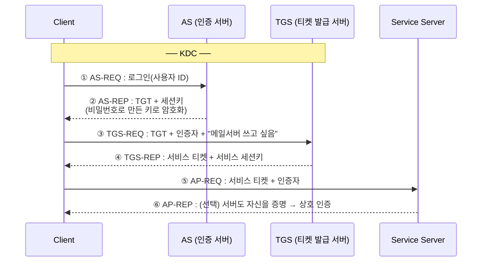

# 인증(Authentication) — 소유·생체 기반

> 앞 글 **[접근통제 ① 인증 — 지식 기반](/posts/infosec-9-auth-1-1-authentication/)** 에서 "내가 아는 것(패스워드)"을 다뤘다면,  
> 이 글은 "내가 **가진 것**(OTP·토큰)"과 "**나 자신**인 것(생체)"으로 인증하는 방법을 다룬다.
{: .prompt-info }

사용자 인증의 4요소(지식 / **소유** / **존재(생체)** / 행위) 중, 이 글은 **소유**와 **존재(생체)** 를 중심으로  
OTP·생체인증·FIDO·MFA·SSO·웹 인증까지 이어서 살펴본다.

---

## 1. 소유 기반 인증 (Something You Have)

### 1.1 개요

**소유 기반 인증**은 사용자가 **물리적으로 가지고 있는 토큰(token)** 으로 본인을 증명하는 방식이다.  
"내가 **아는 것**(패스워드)"이 아니라 **"내가 가진 것"** 으로 신원을 증명한다는 점이 핵심이다.

| 종류 | 예 |
|---|---|
| 카드형 | 마그네틱 카드(ATM·신용카드), 스마트카드, 사원증(RFID) |
| 토큰형 | 하드웨어 OTP 토큰, USB 보안키(FIDO) |
| 모바일 | 스마트폰의 OTP 앱, 푸시 승인 |
| 인증서 | 공동·금융인증서(개인키 보유) |

여기서 "토큰"은 넓게 보면 **사용자가 소지하는 물리적 인증 수단** 전체를 가리키며,  
저장 능력만 있는 **메모리 카드**부터 연산까지 하는 **스마트카드**, 값을 생성하는 **OTP 토큰**까지 포함한다.

### 1.2 장점과 단점

| 구분 | 내용 |
|---|---|
| **장점** | • 패스워드처럼 **추측·사전공격으로 뚫기 어렵다**(물건이 있어야 함) |
| | • **도난·분실을 사용자가 인지**하기 쉽다(지갑·카드가 없어진 것을 알아챔) |
| | • PIN·생체와 결합하면 강력한 **다요소 인증(MFA)** 이 된다 |
| **단점** | • **분실·도난** 시 타인이 사용할 수 있다 |
| | • **복제·위조**(특히 마그네틱 카드)와 **부채널·물리 공격** 위험 |
| | • 발급·재발급·리더기 등 **비용과 불편**이 따른다 |
| | • 토큰 단독으로는 약하다 → 보통 **지식(PIN)·생체와 함께** 쓴다 |

> **핵심.** 소유 기반은 "가진 것"이므로 **분실·도난·복제**가 본질적 약점이다.  
> 그래서 실무에서는 거의 항상 **"소유 + 지식(PIN)"** 또는 **"소유 + 생체"** 처럼 **다른 요소와 결합**해 쓴다.
{: .prompt-warning }

### 1.3 메모리 카드(Memory Card, 토큰)

**메모리 카드**는 정보를 **저장(store)만** 하고 **스스로 연산(process)하지 못하는** 카드형 토큰이다.  
가장 흔한 형태가 신용카드 뒷면의 **마그네틱 띠(자기 띠) 카드**다.

- 카드에는 계정번호 등 **정적인 데이터**가 저장될 뿐, 카드 안에서 암호 계산 같은 처리는 일어나지 않는다.
- 카드 단독으로는 신뢰할 수 없으므로, 보통 **PIN(지식 요소)과 함께** 사용한다 (예: ATM = 카드 + 비밀번호).
- 예: ATM·신용카드의 자기 띠, 호텔 객실 키카드, 일부 출입증.

**공격 기법 / 약점**

| 공격 | 설명 |
|---|---|
| **스키밍(Skimming) / 복제** | 카드 리더기에 **스키머**를 부착해 자기 띠 정보를 그대로 읽어 **위조 카드**를 만든다 |
| **PIN 엿보기(Shoulder Surfing)** | 입력하는 비밀번호를 어깨너머·몰래카메라로 훔쳐봄 → 카드 정보와 합쳐지면 탈취 완성 |
| **분실·도난** | 카드 자체에 보안 로직이 없어, PIN까지 노출되면 즉시 악용 가능 |

> 메모리 카드는 **"저장만 하고 계산은 못 한다"** 는 점이 결정적 한계다. 자기 띠는 복제가 쉬워, 오늘날 결제 카드가 **IC 칩(스마트카드)으로 전환**된 핵심 이유다.
{: .prompt-danger }

### 1.4 스마트카드(Smart Card)

**스마트카드**는 카드 안에 **마이크로프로세서(IC 칩)** 가 들어 있어, **저장뿐 아니라 연산(암호 처리)까지** 할 수 있는 토큰이다.

- 내부에서 **챌린지-리스폰스·암호 연산**을 직접 수행하고, **개인키를 칩 밖으로 내보내지 않는다** → 복제가 매우 어렵다.
- 전송 방식에 따라 **접촉식(Contact)** 과 **비접촉식(Contactless, RFID/NFC)** 으로 나뉜다.
- 예: IC 칩 신용카드, 전자 주민증·여권(e-passport), 교통카드, USIM, 사원 출입증.

**메모리 카드 vs 스마트카드**

| 구분 | 메모리 카드 | 스마트카드 |
|---|---|---|
| 내부 구성 | 저장 매체(자기 띠 등) | **CPU + 메모리(IC 칩)** |
| 연산 능력 | 없음(저장만) | **있음**(암호 연산 가능) |
| 키 보관 | 정적 데이터 노출 | **개인키가 칩 안에 봉인** |
| 복제 난이도 | 쉬움 | 어려움 |
| 대표 예 | 마그네틱 카드 | IC 칩 카드, e-passport |

**공격 기법 / 약점**

스마트카드는 안전하지만, **카드가 공격자 손에 들어가면** 다양한 물리적 공격이 시도된다.

| 공격 | 설명 |
|---|---|
| **부채널 공격(Side-Channel)** | 칩의 **소비 전력·연산 시간·전자파**를 측정해 내부 키를 추론 — **전력분석(SPA/DPA)**, 타이밍 공격이 대표적 |
| **결함 주입(Fault Injection)** | 전압 글리치·클럭 변조·레이저로 **일부러 오류를 유발**해 보호 로직을 건너뛰게 함 |
| **마이크로프로빙(Microprobing)** | 칩 표면을 깎아 내부 회로에 **직접 탐침**을 대 신호를 읽음(물리적 역공학) |
| **중계 공격(Relay Attack)** | **비접촉식** 카드의 신호를 멀리서 **중계**해, 카드 소지자 모르게 인증을 통과 |

> 스마트카드는 메모리 카드보다 훨씬 강하지만 **만능은 아니다.** 칩을 물리적으로 확보하면 부채널·결함 주입으로 키를 노릴 수 있어, 칩 설계 단계에서 **부채널 방어·탬퍼 저항(tamper resistance)** 을 함께 넣는다.
{: .prompt-info }

---

## 2. OTP(One-Time Password): 한 번 쓰고 버리는 비밀번호

**OTP**는 단 한 번만 사용할 수 있는 일회용 비밀번호다.  
값이 매번 바뀌기 때문에, 공격자가 통신을 가로채 OTP 값을 알아내도 **다음 로그인에는 쓸 수 없다.**  
즉 가로챈 인증 정보를 재사용하는 **재전송 공격(Replay Attack)** 을 막아 주는 것이 핵심이다.

**OTP의 기본 원리:**  
서버와 사용자의 OTP 토큰(또는 앱)은 같은 **비밀 씨앗(seed)** 을 미리 공유한다.  
같은 입력값을 넣으면 양쪽에서 같은 OTP가 계산되므로, 서버는 자기가 계산한 값과 사용자가 보낸 값을 비교만 하면 된다.  
**"무엇을 입력값으로 쓰느냐"** 에 따라 생성 방식이 나뉜다. (이 *seed*는 양질의 **난수**여야 한다 → **[키 관리와 난수](/posts/infosec-5-crypto-4-key-random/)**)

| 생성 방식 | 입력값(무엇이 바뀌나) | 특징 | 예 |
|---|---|---|---|
| **시간 동기화** (Time-sync) | 현재 시각 (예: 30초마다 변경) | 서버·토큰의 **시계를 맞춰야** 함. 일정 시간마다 자동 갱신 | Google Authenticator, 은행 OTP |
| **이벤트(카운터) 동기화** (Event-sync) | **인증 횟수 카운터** | 인증할 때마다 카운터 +1. 버튼 누를 때 생성 | 하드웨어 OTP 토큰 |
| **질의-응답** (Challenge-Response) | 서버가 준 **난수(챌린지)** | 서버가 매번 다른 질문을 던지고 토큰이 응답 | 인터넷뱅킹 보안카드 |
| **S/KEY** | **해시 체인**의 n번째 값 | 미리 n개 생성 후 **역순**으로 사용 | 초기 OTP 방식 |

### 2.1 시간 동기화 방식 (Time-synchronous, TOTP)

- **현재 시각**을 입력값으로 사용한다. 보통 30~60초마다 새 OTP로 자동 변경.
- 서버와 토큰의 **시계가 동기화**되어 있어야 한다. 시계가 어긋나면 인증 실패.
- 사용자가 버튼을 누를 필요 없이 화면에 계속 새 값이 표시되는 방식이 대표적.
  
  

### 2.2 이벤트(카운터) 동기화 방식 (Event-synchronous, HOTP)

- **인증 횟수(Counter)** 를 입력값으로 사용한다.
- OTP 토큰과 OTP 인증서버가 **동기화된 카운터**를 기준으로, 사용자가 인증을 요청할 때마다 OTP 값을 생성한다.
- 서버와 클라이언트가 카운트 값을 **동일하게 증가**시켜 가며, 해당 카운트 값을 입력으로 OTP를 생성해 인증한다.
- 시간 동기화와 달리 **시계가 필요 없다.** 다만 토큰 버튼을 실수로 여러 번 누르면 카운터가 서버보다 앞서가 **동기화가 어긋날 수** 있다. 
  

### 2.3 질의-응답 방식 (Challenge-Response)

- 서버가 매번 **다른 난수(챌린지)** 를 보내면, 토큰이 비밀키로 **응답값**을 계산해 돌려준다.
- 시간·카운터를 맞출 필요가 없어 **동기화 문제가 없다.** 대신 사용자가 챌린지를 입력하는 절차가 번거롭다.
- 인터넷뱅킹의 **보안카드**(서버가 "35번 칸 숫자 입력")가 이 방식의 친숙한 예다.
  
  

> 질의-응답의 일반 원리(비밀을 노출하지 않고 증명)는 **[지식 기반 편 §11 개인 식별 프로토콜](/posts/infosec-9-auth-1-1-authentication/)** 에서 Challenge-Response·영지식과 함께 다뤘다.
{: .prompt-info }

### 2.4 S/KEY 방식 (해시 체인)

- **해시 체인(hash chain)** 을 이용하는 방식이다.
  1. 클라이언트에서 정한 임의의 비밀키를 서버로 전송한다.
  2. 받은 비밀키를 **첫 값**으로 사용하여, 해시 체인 방식으로 **이전 결과값에 대한 해시값을 구하는 작업을 n번 반복**한다.
  3. 생성된 **n개의 OTP를 서버에 저장**한다.
- 사용할 때는 **생성한 순서의 역순**으로 쓴다. 즉 마지막에 만든 값부터 하나씩 제출한다.

$$\text{seed} \xrightarrow{h} h^1 \xrightarrow{h} h^2 \xrightarrow{h} \cdots \xrightarrow{h} h^n \quad(\text{생성})$$
$$h^n,\ h^{n-1},\ h^{n-2},\ \cdots \quad(\text{사용 — 역순})$$

- **왜 역순인가?** 서버는 마지막 값 $h^n$만 저장해 둔다. 사용자가 $h^{n-1}$을 제출하면, 서버는 $h(h^{n-1}) = h^n$ 인지 확인한다. 해시는 **역함수 계산이 불가능**하므로, $h^n$을 알아도 그 앞 값 $h^{n-1}$을 미리 알아낼 수 없다 → 도청해도 **다음 OTP를 예측 불가.**
- 정해진 **n번만 사용** 가능하고, 다 쓰면 비밀키를 새로 등록해야 한다. 
  

---

## 3. 생체인증(Biometrics) — Something You Are

생체인증은 **'본인 자체의 어떤 것'** 을 대표하는 인증 방법으로,  
"당신 자신이 키"라는 개념이다.

종류: 지문, 손바닥 인식, 목소리 인식, 안면 인식, 보행 인식, 심지어 디지털 강아지 등

생체인증은 생리적(Physiological)과 행동적(Behavioral) 두 가지 범주로 나뉜다.

| 범주                 | 종류                                                  |
| ------------------ | --------------------------------------------------- |
| 생리적(Physiological) | 지문(Fingerprint), 손바닥(Hand), 홍채(Iris), 얼굴(Face), DNA |
| 행동적(Behavioral)    | 키스트로크(Keystroke), 서명(Signature), 음성(Voice)          |

[마스크를 써도 얼굴 인식이 되는 인공지능 기술 / YTN 사이언스](https://youtu.be/Dh3YzMYpGPQ?si=ucVzMmvI0ANrK8HW)

### 3.1 생체인증의 이상적인 특성

| 특성 | 설명 |
|---|---|
| **보편성** | 인증하려는 생체 특성이 인구 대부분에 존재해야 함 (예: 지문, 얼굴) |
| **구별성** | 각 개인의 생체 특성은 다른 사람과 구별될 수 있을 만큼 고유해야 함 |
| **영구성** | 나이가 들거나 환경이 바뀌어도 특성이 크게 변하지 않아야 함 |
| **수집성** | 특별한 도구나 복잡한 절차 없이 생체 정보를 수집할 수 있어야 함 |
| **신뢰성** | 동일한 사람을 항상 올바르게 인식하고, 다른 사람을 정확히 거부해야 함 |
| **강건성** | 가짜 생체 정보(예: 인공 지문, 사진)로 시스템을 속이기 어려워야 함 |
| **사용자 친화성** | 사용자가 인증 과정을 불편하게 느끼지 않고 쉽게 사용할 수 있어야 함 |

### 3.2 생체인증 시스템의 두 단계

1. **등록 단계**: 대상자들이 그들의 생체인증 정보를 모으고 데이터베이스에 입력하는 단계
2. **인증 단계**: 생체인증 시스템이 실제로 사용자를 인증할 것인가 인증하지 않을 것인가를 결정하는 시점 — 신속·단순·정확해야 함

생체인증은 두 가지 문제를 해결하는 데 사용된다.

- **식별 문제**: '당신은 누구인가?' — **일대다(1:N) 비교**
- **인증 문제**: '당신은 당신이라고 주장하는 사람이 맞는가?' — **일대일(1:1) 비교**

### 3.3 생체인증의 오류(Fault) 종류

생체인증 시스템에는 두 종류의 오류가 존재하며, 이는 서로 **상충 관계(trade-off)** 에 있다.

#### False Positive (오긍정, 기만율)

- **설명**: 시스템이 실제로는 인증되지 않아야 할 사람을 잘못 인증하는 경우
- **예시**: "트루디가 앨리스인 척하고, 시스템이 실수로 트루디를 앨리스로 인증"한 상황
- **용어**: 이러한 오류 발생 비율을 **기만율(fraud rate)** 이라고 함
- **보안 영향**: 권한이 없는 사람이 시스템에 접근할 수 있게 되기 때문에 보안에 직접적인 위협

#### False Negative (오부정, 모욕률)

- **설명**: 시스템이 실제로는 인증되어야 할 정당한 사용자를 인증하지 못하는 경우
- **예시**: "앨리스가 자신임을 인증받으려고 하지만 시스템이 인증하는 데 실패"한 상황
- **용어**: 이러한 오류 발생 비율을 **모욕률(insult rate)** 이라고 함
- **사용자 경험 영향**: 정당한 사용자의 불편함을 초래

#### 두 오류 간의 관계

기만율을 줄이면(보안을 강화하면) 모욕률이 증가하는 경향이 있고,  
반대로 모욕률을 줄이면(사용자 편의성 증가) 기만율이 증가하는 경향이 있다.

시스템 설계자는 보안과 사용성 사이의 균형을 맞추기 위해 두 오류율이 동일해지는 지점인  
**동일 오류율(Crossover Error Rate, CER)** 에서 시스템 매개변수를 설정하는 경우가 많다.

#### 생체인증 방법별 성능 비교

| Modality | Accuracy | Ease to Use | User Acceptance |
|---|---|---|---|
| 얼굴(Face) | Low | High | High |
| 지문(Fingerprint) | High | Medium | Low |
| 홍채(Iris) | High | Medium | Medium |
| 손바닥 정맥(Palm Vein) | High | High | Medium |
| 음성(Voice) | Medium | High | High |

### 3.4 생체인증 결론

- 생체인증은 불가능하지는 않지만 **위조하기 어려움**
- 인증에 대해서는 소프트웨어를 대상으로 하는 공격의 가능성도 많음
- 해독된 암호화 키나 잊어버린 패스워드는 폐지되고 대체될 수 있는 반면에,  
  **해독된 생체인증 정보를 어떻게 폐지할지에 대해서는 불분명**

---

## 4. FIDO (Fast Identity Online)

FIDO는 **온라인 인증을 보다 안전하고 편리하게 만드는 표준**이다.

- FIDO는 비밀번호를 대체하여 **공개 키 암호화를 기반**으로 하는 비밀 키와 공개 키 쌍을 사용
- 비밀 키는 사용자의 장치에 저장되며, 공개 키는 온라인 서비스에 등록

**FIDO 로그인 흐름:**

1. 사용자가 서비스에 로그인 요청
2. 서비스가 로그인 챌린지(Login Challenge)를 장치로 전송
3. 사용자 장치가 저장된 비밀 키로 챌린지에 서명
4. 서비스는 등록된 공개 키로 서명을 검증하여 로그인 완료

> FIDO는 **소유(기기의 개인키) + 존재/지식(기기 잠금 해제용 생체·PIN)** 을 결합한다.  
> 챌린지에 개인키로 서명하는 부분은 **[지식 기반 편 §11.1 Challenge-Response](/posts/infosec-9-auth-1-1-authentication/)** 의 공개키 방식과 같은 원리다.
{: .prompt-info }

### 4.1 FIDO의 장점과 극복한 단점

| 문제 | FIDO의 해결 방법 |
|---|---|
| **비밀번호의 취약성**: 비밀번호는 쉽게 해킹되거나 잊어버릴 수 있음 | **비밀번호 대체**: FIDO는 비밀번호를 사용하지 않아 보안을 강화하고 사용자 편의성을 높임 |
| **2차 인증의 불편함**: 추가적인 코드를 입력해야 하므로 불편함 | 비밀번호나 추가 코드 없이도 안전하게 로그인할 수 있어 더 편리한 인증 경험 제공 |
| **생체 인증의 취약성**: 3D 모델을 통해 얼굴 인식 시스템 우회 가능 | 생체 인증 데이터를 사용자의 장치에 저장하여 개인 정보 보호, 피싱·중간자 공격에 강한 보안 제공 |

---

## 5. MFA: 다요소 인증

비밀번호는 가장 흔한 인증 수단이지만, 가장 약한 고리가 되기도 쉽다.  
이 때문에 현대 서비스는 비밀번호 하나에만 의존하지 않고, **MFA(Multi-Factor Authentication)** 를 사용한다.

### 5.1 2FA vs MFA

- **2FA (Two-Factor Authentication)**: 신원을 정확히 두 번 증명 (예: 비밀번호 + OTP)
- **MFA (Multi-Factor Authentication)**: 신원을 여러 번 증명 (예: 비밀번호 + OTP + 생체인증)

**MFA는 서로 다른 범주의 요소를 2개 이상 결합한 것이다.**  
비밀번호(지식) + OTP 앱(소유)은 MFA이지만,  
비밀번호 + 보안 질문은 둘 다 지식 요소이므로 **MFA로 보기 어렵다.**

### 5.2 MFA 방법 종류

| 방법 | 설명 |
|---|---|
| SMS Token | 문자 메시지로 일회용 코드 수신 |
| Email Token | 이메일로 일회용 코드 수신 |
| Hardware Token | 물리적 OTP 기기 사용 |
| Software Token | OTP 앱(Google Authenticator 등) 사용 |
| Phone Authentication | 전화 통화로 인증 |
| Biometric Verification | 지문·얼굴 등 생체인증 |

### 5.3 왜 MFA가 더 안전한가

만약 공격자가 비밀번호를 알아냈다고 해도, 두 번째 요소가 없으면 로그인하기 어려워진다.  
즉 MFA는 "비밀번호 유출"이라는 하나의 사고가 곧바로 계정 탈취로 이어지는 것을 막아 주는 추가 방어선이다.

단, 모든 2단계 인증이 완전히 같은 수준은 아니다.  
**문자 메시지 인증(SMS)** 보다 **OTP 앱**이나 **보안키(FIDO)** 가 더 강한 방식으로 평가된다.

---

## 6. 통합 인증 (Single Sign-On, SSO)

사용자들은 패스워드와 같은 인증 정보를 반복해서 입력하는 것을 힘들어한다.

**편리한 해결책**: 초기의 인증에는 사용자가 참여해야 하지만,  
이후에 따라 나오는 인증은 표면 뒤에서 일어나도록 하는 것 = **통합인증(SSO)**

**SSO 흐름:**

1. 사용자가 서비스(Service Provider)에 접근 요청
2. 서비스가 Identity Provider(IdP)에 SSO Request 전송
3. IdP가 사용자를 인증
4. IdP가 서비스에 SSO Response 반환
5. 사용자는 한 번의 로그인으로 여러 서비스 이용 가능

실생활 예: 구글 계정으로 여러 다른 웹사이트에 로그인하는 경우

> **SSO·EAM·IAM은 범위가 다르다.** SSO는 *인증 통합*, EAM은 *접근통제까지*, IAM은 *계정 생애주기 전체* 관리다.  
> SSO ⊂ EAM ⊂ IAM 의 포함 관계로 이해하면 된다.
{: .prompt-tip }

세 용어는 자주 헷갈리지만, **다루는 범위가 점점 넓어지는 동심원**으로 보면 쉽다.

| 구분 | 풀이름 | 한 줄 정의 | 핵심 질문 |
|---|---|---|---|
| **SSO** | Single Sign-On | 한 번 로그인으로 여러 서비스 이용 | *"한 번만 로그인하게 하자"* |
| **EAM** | Extranet/Enterprise Access Management | SSO + **접근통제(인가)** 까지 | *"로그인한 뒤 무엇에 접근시킬까?"* |
| **IAM** | Identity & Access Management | EAM + **계정의 생성~삭제 전 과정** 관리 | *"이 사람의 계정·권한을 평생 어떻게 관리할까?"* |

**SSO (통합 인증)**

- **인증(Authentication)을 한 곳으로 모으는** 기술. 사용자는 한 번만 신원을 증명하고, 이후 서비스들은 그 결과를 믿고 통과시킨다.
- 목표는 **편의성** — 비밀번호를 반복 입력하는 불편을 없앤다.
- 구현 예: **Kerberos**(사내 도메인), **SAML·OAuth·OIDC**(웹 서비스).
- 한계: *"로그인했다"* 까지만 책임진다. **그 사람이 무엇을 할 수 있는지(권한)는 다루지 않는다.**

**EAM (확장 접근 관리)**

- SSO에 **인가(Authorization)·접근통제**를 더한 것. *로그인한 사용자가 어떤 자원·메뉴·기능에 접근할 수 있는지*를 **중앙에서 정책으로 통제**한다.
- 보통 **정책 기반 접근통제 + 통합 인증 + 감사(로그)** 기능을 묶어 제공한다.
- 즉 SSO가 *"문을 한 번에 열어주는 것"* 이라면, EAM은 *"문을 열어주되 들어갈 수 있는 방을 정해주는 것"* 이다.

**IAM (통합 계정·접근 관리)**

- 가장 넓은 개념. 사용자 **계정(Identity) 그 자체의 생애주기 전체**를 관리한다 — 입사 시 **계정 생성(Provisioning)** → 부서 이동 시 **권한 변경** → 퇴사 시 **즉시 회수·삭제(De-provisioning)**.
- 여기에 **인증(SSO)·인가(EAM)·권한 승인 워크플로·감사·규정 준수(Compliance)** 까지 포함한다.
- 핵심 가치: **"퇴사자 계정이 살아 있는"** 같은 사고를 막는 것. 누가·언제·무엇에 접근 가능한지를 **한 곳에서 일관되게** 관리한다.

> **정리.** SSO는 *"어떻게 로그인할까"*, EAM은 *"로그인 후 무엇에 접근시킬까"*, IAM은 *"이 계정을 입사부터 퇴사까지 어떻게 관리할까"* 를 다룬다.  
> 범위가 **SSO < EAM < IAM** 순으로 커지며, 뒤로 갈수록 *인증 → 인가 → 계정 생애주기 관리*로 책임이 넓어진다.
{: .prompt-info }

---

### 6.1 Kerberos: 티켓 기반 네트워크 인증 프로토콜

#### 6.1.1 개요

**Kerberos(케르베로스)** 는 MIT에서 1980년대 *Project Athena*의 일부로 개발한 **네트워크 인증 프로토콜**로,  
SSO를 구현하는 가장 대표적인 기술이다. 현재 표준은 **버전 5(RFC 4120)** 이다.  
이름은 그리스 신화에서 저승문을 지키는 **머리 셋 달린 개(케르베로스)** 에서 따왔다 —  
그만큼 **"아무나 통과시키지 않는 믿을 수 있는 문지기"** 역할을 한다.

신뢰할 수 없는(untrusted) 네트워크 위에서, **신뢰할 수 있는 제3자(Trusted Third Party)** 인 **KDC**를 가운데 두고  
**"티켓(Ticket)"** 이라는 암호화된 증표를 주고받아 서로의 신원을 증명하는 것이 핵심 아이디어다.

**왜 Kerberos가 필요했나?**  
회사에 서버가 메일·파일·프린터·DB 등 수십 대가 있다고 하자. 가장 단순한 방법은 서버마다 비밀번호를 만들어 매번 입력하는 것이다. 그러나 이 방식에는 두 가지 큰 문제가 있다.

- **비밀번호가 네트워크에 계속 흘러다닌다.** 서버에 접속할 때마다 비밀번호를 보내면, 같은 네트워크의 공격자가 **도청(sniffing)** 으로 가로채거나, 가로챈 값을 그대로 다시 보내 로그인하는 **재전송 공격(replay)** 을 할 수 있다.
- **서버를 믿을 수 없다.** 각 서버가 사용자의 비밀번호를 직접 검증하려면 서버마다 비밀번호(또는 해시)를 들고 있어야 하고, 서버 하나가 털리면 전부 노출된다.

Kerberos는 이 문제를 **"비밀번호는 KDC만 알고, 서버에는 절대 보내지 않는다"** 는 원칙으로 푼다.  
사용자는 **딱 한 번** KDC에게만 신원을 증명하고, 이후엔 KDC가 발급한 **티켓**으로 각 서버에 자신을 증명한다. 비밀번호 대신 티켓이 돌아다니므로 도청·재전송에 강하고, 서버는 비밀번호를 알 필요가 없다.

> **머리 셋의 의미.** 케르베로스의 세 머리는 인증의 3주체 — **클라이언트 · 서버 · KDC** — 를 비유한 것으로 흔히 설명된다.
{: .prompt-tip }

#### 6.1.2 특징

| 특징 | 내용 |
|---|---|
| **대칭키 기반** | 공개키가 아닌 **비밀키(대칭키, 주로 AES) 암호**로 동작한다. 모든 주체는 KDC와 비밀키를 공유한다 |
| **비밀번호 미전송** | 비밀번호를 **네트워크로 직접 보내지 않는다.** 비밀번호로 만든 키로 메시지를 복호화할 수 있는지로 신원을 증명 → **도청·재전송 공격에 강함** |
| **싱글 사인온(SSO)** | 한 번 로그인(TGT 발급)하면 이후 여러 서비스를 **재로그인 없이** 이용 |
| **상호 인증(Mutual Auth)** | 클라이언트뿐 아니라 **서버도 자신이 진짜임을 증명**할 수 있다(v5) → 가짜 서버 차단 |
| **타임스탬프 사용** | 티켓·인증자에 **시각**을 넣어 유효기간을 두고 재전송을 차단 → 그래서 **시계 동기화가 필수** |
| **중앙 집중형** | 인증의 중심인 KDC가 모든 키를 관리 → 관리는 편하지만 **단일 실패 지점(SPOF)** 이 됨 |

#### 6.1.3 구성 요소

| 구성 요소 | 역할 |
|---|---|
| **KDC** (Key Distribution Center) | 인증의 중심. 모든 주체의 비밀키를 보관하는 신뢰된 제3자. 아래 **AS + TGS**로 구성 |
| └ **AS** (Authentication Server) | 사용자 신원을 1차 확인하고 **TGT**(티켓을 받기 위한 티켓)를 발급 |
| └ **TGS** (Ticket Granting Server) | TGT를 검증하고 실제 **서비스 이용 티켓(Service Ticket)** 을 발급 |
| **Principal** (주체) | 인증 대상의 고유 이름. 사용자·서비스·호스트 각각이 principal을 가짐 |
| **Realm** (영역) | 하나의 KDC가 관리하는 인증 범위(도메인). 보통 대문자로 표기(예: `EXAMPLE.COM`) |
| **Ticket** (티켓) | KDC가 발급하는 암호화된 신원 증표. **TGT**와 **서비스 티켓**으로 나뉨 |
| **Session Key** (세션키) | 두 주체가 그 세션 동안만 쓰도록 KDC가 만들어 주는 임시 대칭키 |
| **Authenticator** (인증자) | 클라이언트가 **현재 시각**을 세션키로 암호화한 것. 티켓이 *도용된 복사본*이 아님을 증명 |
| **Service Server** | 사용자가 실제로 이용하려는 서비스(파일·메일·DB 등) |

> **티켓 vs 인증자.** 티켓은 *재사용 가능*하지만(유효기간 내), 인증자는 **타임스탬프 때문에 1회용**이다.  
> 공격자가 티켓을 훔쳐도 **맞는 세션키가 없으면 인증자를 새로 만들 수 없어** 재전송이 막힌다.
{: .prompt-info }

#### 6.1.4 구성도 / 인증 흐름

> **놀이공원 비유.** Kerberos는 **놀이공원 자유이용권**과 똑같다.  
> ① 매표소(AS)에서 신분증을 보여주고 **하루 입장 팔찌(TGT)** 를 받는다. ② 각 놀이기구 앞 발권기(TGS)에 팔찌를 보여주면 **그 기구 탑승권(서비스 티켓)** 을 준다. ③ 기구 직원(서버)에게 탑승권을 내고 탄다.  
> → 신분증(비밀번호)은 **매표소에서 단 한 번만** 보여주고, 이후엔 팔찌·탑승권으로 다닌다. 이게 SSO다.
{: .prompt-tip }

Kerberos는 **세 번의 메시지 교환(3 단계)** 으로 동작한다.

| 단계 | 메시지 | 내용 |
|---|---|---|
| **1단계: 인증** | ① AS-REQ → ② AS-REP | 사용자가 AS에 로그인. AS는 사용자의 **비밀번호 해시로 만든 키**로 암호화한 **TGT + 세션키**를 보냄. 비밀번호를 아는 사람만 풀 수 있음 |
| **2단계: 티켓 발급** | ③ TGS-REQ → ④ TGS-REP | 클라이언트가 **TGT + 인증자**를 들고 TGS에 "○○ 서비스 쓰겠다" 요청. TGS는 검증 후 **서비스 티켓**을 발급 |
| **3단계: 서비스 이용** | ⑤ AP-REQ → ⑥ AP-REP | 클라이언트가 **서비스 티켓 + 인증자**를 서버에 제시. 서버는 검증 후 접근 허용(원하면 ⑥으로 서버도 자신을 증명 = 상호 인증) |

**각 단계에서 실제로 오가는 것**

- **① AS-REQ:** 클라이언트가 *"나 철수인데 TGT 주세요"* 라고 보낸다. 이때 **비밀번호는 보내지 않는다.** 사용자 이름만 평문으로 간다.
- **② AS-REP:** AS는 응답에 두 가지를 담는다.
  - **TGT** — 안에 *세션키·사용자 이름·유효시간*이 들어 있고, **TGS만 아는 키**로 암호화된다. 그래서 사용자조차 TGT 내용을 열어볼 수 없다(그냥 보관만 함).
  - **세션키** — *사용자의 비밀번호로 만든 키*로 암호화해서 보낸다. **비밀번호를 아는 진짜 사용자만 이걸 복호화**해 세션키를 꺼낼 수 있다. 비밀번호가 틀리면 여기서 막힌다 → **비밀번호 검증이 이렇게 "복호화 성공 여부"로 대체**된다.
- **③ TGS-REQ:** 클라이언트가 *TGT* + *인증자(Authenticator)* + *"메일서버 쓰고 싶음"* 을 보낸다. **인증자는 현재 시각을 세션키로 암호화한 것**으로, 티켓이 훔친 복사본이 아니라 *지금 세션키를 가진 본인*이 보낸 것임을 증명한다.
- **④ TGS-REP:** TGS는 TGT를 풀어 세션키를 꺼내고 인증자의 시각을 확인한 뒤, **서비스 티켓**(메일서버만 아는 키로 암호화)과 새 **서비스 세션키**를 발급한다.
- **⑤ AP-REQ:** 클라이언트가 *서비스 티켓* + *새 인증자*를 메일서버에 제시한다. 메일서버는 자기 키로 티켓을 풀어 세션키를 얻고, 인증자로 본인 확인을 마친다.
- **⑥ AP-REP (선택):** 서버가 인증자의 시각에 +1 해서 세션키로 암호화해 돌려준다. 클라이언트는 *"이 서버도 진짜 세션키를 가진 정상 서버구나"* 를 확인한다 → **상호 인증**으로 가짜 서버를 걸러낸다.

> **왜 TGT를 따로 두고 2단계로 나눌까?**  
> 비밀번호로 만든 키는 *가장 소중한 비밀*이라 자주 쓸수록 위험하다. 그래서 **로그인 직후 딱 한 번(①②)만** 그 키를 쓰고, 곧바로 **수명이 짧은 세션키 + TGT**로 갈아탄다. 이후 서비스 요청(③~⑥)은 모두 세션키만 쓰므로, **비밀번호 키가 네트워크에 거의 노출되지 않는다.** "한 번 강하게 인증하고, 그 다음엔 가벼운 티켓으로" 가 Kerberos 설계의 핵심이다.
{: .prompt-info }

→ 핵심: 한 번 **TGT**를 받아두면(①②), 이후 새 서비스마다 **비밀번호를 다시 넣지 않고** ③~⑥만 반복하면 되므로 **SSO가 실현**된다.

#### 6.1.5 취약점 / 한계

| 구분 | 내용 |
|---|---|
| **단일 실패 지점(SPOF)** | KDC에 장애가 나면 **전체 인증이 마비**된다. KDC 자체가 탈취되면 **모든 키가 노출** → 가용성·기밀성 모두 KDC에 집중 |
| **시간 동기화 의존** | 티켓·인증자가 타임스탬프 기반이라, 서버 간 **시계가 (보통 5분 이상) 어긋나면 인증 실패.** NTP 등 시각 동기화 필수 |
| **비밀번호 약점** | 1단계 응답(②)이 **사용자 비밀번호 기반 키**로 암호화되므로, 약한 비밀번호는 **오프라인 사전공격(AS-REP Roasting)** 으로 뚫릴 수 있음 |
| **Kerberoasting** | 서비스 티켓은 **서비스 계정 비밀번호 해시**로 암호화됨. 공격자가 티켓을 받아 **오프라인으로 서비스 계정 암호를 크래킹** |
| **Pass-the-Ticket** | 메모리에 남은 **티켓을 훔쳐** 그대로 재사용해 다른 사용자로 가장 |
| **Golden Ticket** | KDC의 마스터 키(`krbtgt` 계정 해시)가 유출되면 **위조 TGT**를 무제한 생성 → 도메인 전체 장악 |
| **Silver Ticket** | 특정 서비스 계정 키가 유출되면 그 서비스용 **위조 서비스 티켓** 생성(KDC를 거치지 않아 탐지 어려움) |

**대표 공격 풀어보기**

- **Kerberoasting.** 서비스 티켓(④)은 *서비스 계정의 비밀번호 해시*로 암호화된다. 공격자는 일반 사용자 권한만 있어도 TGS에게 여러 서비스 티켓을 정상적으로 **요청**한 뒤, 그 티켓을 자기 PC로 가져가 **네트워크 밖에서 한가하게 비밀번호를 대입(크래킹)** 한다. 서비스 계정 비밀번호가 약하면 뚫린다. 그래서 서비스 계정은 **길고 복잡한(또는 자동 관리되는) 비밀번호**를 써야 한다.
- **Golden Ticket(황금 티켓).** KDC가 TGT를 암호화할 때 쓰는 마스터 키 = **`krbtgt` 계정의 해시**가 유출되면, 공격자는 KDC 없이도 **아무 사용자·아무 권한의 TGT를 직접 위조**할 수 있다. 사실상 *마스터키를 복제해 만능 출입증을 무한 발급*하는 셈이라 **도메인 전체 장악**으로 이어진다. 복구하려면 `krbtgt` 비밀번호를 (두 번) 재설정해야 한다.
- **Silver Ticket(은 티켓).** 특정 서비스 계정 키만 유출됐을 때, 그 **서비스 전용 위조 티켓**을 만든다. KDC(TGS)를 거치지 않고 곧장 서버에 제시하므로 **KDC 로그에 흔적이 남지 않아** 탐지가 더 어렵다.
- **Pass-the-Ticket.** 비밀번호를 몰라도, 감염된 PC의 **메모리에 남아 있는 티켓을 그대로 복사**해 다른 PC에서 재사용하는 공격이다.

> **요지.** Kerberos의 안전성은 결국 **(1) KDC의 보안**과 **(2) 비밀번호/계정 키의 강도**에 달려 있다.  
> 프로토콜 자체는 견고하지만, 약한 비밀번호·유출된 `krbtgt` 키는 곧바로 치명적 공격으로 이어진다.  
> 그래서 실무 방어는 **강한 비밀번호 정책 · KDC 분리·강화 · 시각 동기화(NTP) · 비정상 티켓 요청 탐지** 로 모인다.
{: .prompt-danger }

#### 6.1.6 Kerberos v4 vs v5 차이점

v4는 1980년대 설계라 **암호가 DES로 고정**돼 있었고(오늘날 기준으로 약함), **IP 주소만** 지원하며 **영역(realm)이 늘어날수록 키 관리가 폭발**하는 문제가 있었다. v5는 이를 **알고리즘 교체 가능·표준 인코딩(ASN.1)·계층적 영역·위임 지원**으로 풀었다. 현재 쓰이는 것은 모두 **v5**이며, v4는 폐기되었다.

| 항목 | **버전 4 (1980s)** | **버전 5 (RFC 4120, 현행)** |
|---|---|---|
| **암호 알고리즘** | **DES 고정**(취약) | AES 등 **다양한 알고리즘** 선택 가능(알고리즘 식별자 포함) |
| **인코딩** | 자체 비표준 인코딩 | **ASN.1 표준**(상호운용성↑) |
| **티켓 유효시간** | 최대 약 **21시간**(5분×8비트) | **시작·종료 시각 명시**, 더 길게/짧게 가능, **갱신(renewable)** 지원 |
| **네트워크 주소** | **IP 주소만** 지원 | 여러 주소 타입 지원 |
| **위임(Delegation)** | 미지원 | **티켓 전달(Forwarding/Proxy)** 지원 — 서버가 사용자 대신 행동 가능 |
| **영역 간 인증(Cross-Realm)** | 영역마다 1:1 키 필요 → **N² 문제** | **계층적·전이적** 신뢰로 확장성↑ |
| **이중 암호화** | 티켓을 **이중 암호화**(비효율) | 제거 |
| **재전송 방어** | 약함 | **타임스탬프 + 재생 캐시**로 강화 |

#### 6.1.7 SESAME — Kerberos의 보완

**SESAME**(Secure European System for Applications in a Multi-vendor Environment)은  
유럽에서 Kerberos의 한계를 보완하려고 개발한 인증·접근통제 시스템이다.

Kerberos에는 두 가지 아쉬움이 있었다. ① **대칭키만 쓰다 보니** 조직이 커질수록 키 분배가 부담스럽고, ② 티켓은 *"이 사람이 누구다"* 만 증명할 뿐 **"이 사람이 무엇을 할 수 있다"(권한)** 는 담지 못해, 인가는 각 서버가 따로 처리해야 했다. SESAME은 ①을 **공개키 암호**로, ②를 **PAC**로 해결한다. PAC는 *발급 서버(PAS)가 서명한 권한 명세서*로, 사용자의 역할·접근 권한이 담겨 서버에 함께 전달된다 — 서버는 이 PAC만 검증하면 인증과 인가를 한 번에 처리할 수 있다.

| 비교 항목 | **Kerberos** | **SESAME** |
|---|---|---|
| **암호 방식** | **대칭키**만 사용 | **공개키 암호**를 추가 도입 → 키 분배·확장성 개선 |
| **다루는 범위** | **인증(Authentication)** 중심 | 인증 + **인가(Authorization, 접근통제)** 까지 |
| **권한 정보** | 티켓에 권한 정보 없음 | **PAC**(Privilege Attribute Certificate, 권한 속성 인증서)에 사용자 권한을 담아 전달 |
| **발급 주체** | KDC(AS+TGS) | **PAS**(Privilege Attribute Server)가 PAC 발급 |
| **확장성** | 영역 간 확장에 제약 | 대규모·다중 벤더 분산 환경을 겨냥 |

> **한 줄 정리.** Kerberos가 *"너는 누구냐(인증)"* 만 본다면, SESAME은 **PAC**를 통해 *"너는 무엇을 할 수 있느냐(인가)"* 까지 함께 처리하고, 대칭키에 더해 **공개키**를 사용한다는 점이 가장 큰 차이다.
{: .prompt-info }

#### 6.1.8 현재는 어떻게 쓰이나

Kerberos는 박물관 기술이 아니라 **지금도 기업 내부 인증의 핵심**이다.

| 활용처 | 설명 |
|---|---|
| **Windows Active Directory** | Windows 2000 이후 **AD 도메인 로그인의 기본 인증 프로토콜.** 회사·학교 PC에 도메인 계정으로 로그인하면 내부적으로 Kerberos가 동작 |
| **Unix/Linux (MIT Kerberos·Heimdal)** | 서버 로그인, **`kinit`** 으로 티켓 발급, **GSSAPI** 기반 SSH·NFS 인증 |
| **엔터프라이즈 서비스** | 사내 파일 서버, 데이터베이스, 메일, **Hadoop** 같은 빅데이터 클러스터의 노드 간 인증 |
| **웹·DB 연동** | SPNEGO를 통해 브라우저↔사내 웹서버 SSO, MSSQL 등 DB의 통합 인증 |

> **그럼 웹 로그인은?** 외부를 향한 **웹·모바일 SSO**는 방화벽을 넘기 어려운 Kerberos 대신  
> **SAML · OAuth 2.0 · OpenID Connect(OIDC) · FIDO** 같은 토큰 기반 표준으로 많이 옮겨갔다.  
> 정리하면 — **회사 내부 도메인 인증 = Kerberos**, **인터넷 서비스 간 인증 = OAuth/OIDC/SAML** 로 역할이 나뉜다.
{: .prompt-tip }

---

## 7. 웹 인증(Web Authentication)

### 7.1 웹 인증이 필요한 이유

HTTP는 원래 **무상태(Stateless)** 프로토콜이다.  
인터넷은 원래 누가 요청했는지 기억하지 못한다.  
마치 가게에서 손님을 매번 처음 보는 것처럼 대하는 문제가 발생한다.

- 로그인 상태 유지가 불가능
- 장바구니, 추천 상품, 설정 기억 등 개인화된 서비스 제공 불가능

**쿠키와 세션은 인터넷의 "기억력 문제"를 해결한다.**

### 7.2 쿠키(Cookie)

쿠키는 웹사이트가 내 컴퓨터에 남기는 **작은 메모지**다.

- 사용자 확인을 위한 "이름표" 역할
- 예: "이 사람은 아까 로그인했던 사람이야" 정보 저장
- 보안 기능: `Secure`(안전한 연결로만 전송), `HttpOnly`(해킹 방지)
- 주의점: 비밀번호 같은 중요 정보는 그대로 저장하면 안 됨

### 7.3 세션(Session)

세션은 서버가 사용자를 기억하기 위해 만드는 **임시 보관함**이다.

- 세션 ID라는 열쇠를 쿠키로 사용자에게 줌
- 서버에 있는 보관함에 사용자 정보를 안전하게 보관
- 많은 사용자를 기억하려면 서버 공간이 많이 필요함

**기본 흐름:**

1. 사용자가 로그인 성공
2. 서버가 세션 생성
3. 세션 식별자(Session ID)를 브라우저에 쿠키로 전달
4. 이후 요청마다 이 식별자를 확인해 로그인 상태 유지

### 7.4 쿠키 보안 속성

로그인 쿠키에는 반드시 다음 보안 속성이 설정되어야 한다.

| 속성 | 역할 |
|---|---|
| `HttpOnly` | 자바스크립트로 쿠키를 읽지 못하게 막음 → XSS 공격에서 쿠키 탈취 방지 |
| `Secure` | HTTPS 통신에서만 전송 → 네트워크 도청 방지 |
| `SameSite` | 다른 사이트에서 보낸 요청에 쿠키를 붙이지 않음 → CSRF 방지 |
| `Domain` / `Path` | 쿠키가 유효한 범위 지정 |
| `Expires` / `Max-Age` | 쿠키 유효 기간 지정 |

### 7.5 세션을 노리는 두 가지 공격

#### (1) 세션 하이재킹(Session Hijacking) — 사물함 열쇠를 훔친다

이미 발급된 **세션 ID를 훔쳐** 사용자를 가장하는 공격.

**예시 시나리오**

1. 민준이가 커피숍 공용 와이파이에서 학교 포털에 로그인한다.
2. 같은 와이파이에 있던 공격자가 네트워크를 엿보다가 **민준이의 세션 쿠키 값**을 가로챈다.
3. 공격자가 자기 브라우저에 그 쿠키 값을 집어넣으면, 서버는 **공격자를 민준이로 착각**한다.
4. 공격자는 비밀번호를 몰라도 민준이의 학적 정보를 볼 수 있게 된다.

탈취 경로: 공용 와이파이 도청, **XSS 공격을 통한 쿠키 탈취**, 감염된 기기에서 쿠키 파일 유출.

#### (2) 세션 고정(Session Fixation) — 미리 준비한 사물함 번호를 쓰게 만든다

공격자가 **먼저 세션 ID를 받아 놓고**, 피해자가 **그 ID로 로그인하도록 유도**하는 공격.

**예시 시나리오**

1. 공격자가 학교 포털에 접속해 "세션 ID = `ABC123`"을 받는다 (아직 로그인 안 함).
2. 공격자가 서연이에게 이런 링크를 보낸다: `https://학교포털/?SESSIONID=ABC123`
3. 서연이가 이 링크를 눌러 포털에서 **자기 계정으로 로그인**한다.
4. 서버가 실수로 **로그인 후에도 세션 ID를 바꾸지 않으면**, 세션 `ABC123`은 이제 "로그인된 서연이"가 된다.
5. 공격자가 자신이 갖고 있던 `ABC123`으로 접속 → **서연이처럼 로그인된 상태로 사용 가능**.

#### 방어 4가지

1. 로그인 **성공 직후 세션 ID를 새로 발급**한다 (세션 재발급) — 세션 고정 방어의 핵심
2. 쿠키에 `HttpOnly` + `Secure` + `SameSite`를 적용한다
3. **세션 만료 시간**을 설정한다 (예: 30분 무활동 시 자동 로그아웃)
4. 중요한 작업(송금, 비밀번호 변경)에는 **재인증**을 요구한다

---

> **이전 글**: **[접근통제 ① 인증 — 지식 기반](/posts/infosec-9-auth-1-1-authentication/)** (패스워드·솔트·PBKDF·메시지 인증·영지식·i-PIN)  
> **다음 글**: 인증을 통과한 사용자가 "무엇을 할 수 있는가"를 정하는 **[접근통제 ② 인가(Authorization)](/posts/infosec-9-auth-2-authorization/)** — 접근제어 행렬·ACL·BLP/Biba·CAPTCHA 등.
{: .prompt-tip }
