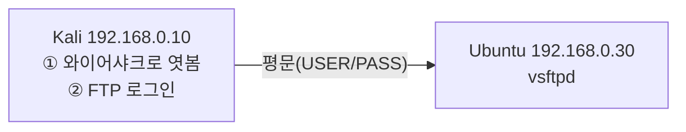

> 이 글은 **실습** 입니다. 앞 글(**02-2**)에서 만든 FTP 서버와 계정(`ftpuser` / `ftppass123`)이 동작 중이어야 합니다.  
> 목표: FTP 로그인 시 **비밀번호가 평문으로 흐르는 것**을 직접 잡아내고, **SFTP** 와 비교한다.
{: .prompt-info }

## 0. 오늘의 그림



Kali가 **공격자이자 클라이언트** 역할을 동시에 합니다: 와이어샤크로 네트워크를 들여다보면서, 스스로 FTP에 로그인해 그 패킷을 잡습니다.

---

## 1. (Kali) 엿볼 네트워크 카드 확인

먼저 내부망(192.168.0.10) 트래픽이 흐르는 랜카드 이름을 확인합니다.

```bash
# === Kali에서 실행 ===
ip addr | grep -B2 192.168.0.10
```

- 출력에서 `192.168.0.10` 바로 위에 보이는 인터페이스 이름(예: `eth1`)을 기억해 둡니다. 와이어샤크에서 이 카드를 고릅니다.

---

## 2. (Kali) 와이어샤크로 캡처 시작

```bash
# === Kali에서 실행 ===
sudo wireshark &
```

1. 와이어샤크가 열리면, **1번에서 확인한 인터페이스(예: `eth1`)** 를 더블클릭해 캡처를 시작한다.
2. 상단 **표시 필터(Display Filter)** 칸에 아래를 입력하고 엔터:

   ```
   ftp
   ```

   → FTP 제어 채널(21번) 명령만 걸러서 보여 줍니다.

> 화면에 패킷이 너무 많아도 괜찮습니다. 필터 `ftp` 가 우리가 볼 것만 추려 줍니다.
{: .prompt-tip }

---

## 3. (Kali) 새 터미널에서 FTP 로그인

와이어샤크는 켜 둔 채로, **새 터미널** 을 열어 FTP에 로그인합니다.

```bash
# === Kali에서 실행 (새 터미널) ===
ftp 192.168.0.30
# Name: ftpuser
# Password: ftppass123
```

`230 Login successful.` 까지 진행한 뒤 `bye` 로 빠져나옵니다.

---

## 4. (Kali) 비밀번호가 보이는지 확인 — 핵심 장면

와이어샤크 화면으로 돌아가면, FTP 명령들이 줄줄이 잡혀 있습니다. 다음 두 줄을 찾습니다.

```
Request: USER ftpuser
Request: PASS ftppass123     ← 비밀번호가 그대로 보인다!
```

더 확실하게 보려면, 패킷 하나를 **우클릭 → Follow → TCP Stream** 하면 로그인 대화 전체가 한눈에 보입니다.

```
220 (vsFTPd 3.0.x)
USER ftpuser
331 Please specify the password.
PASS ftppass123
230 Login successful.
```

> 🔴 **결론**: FTP는 비밀번호를 **암호화하지 않아**, 같은 네트워크의 공격자가 **그대로 읽을 수 있습니다.** 이것이 평문 FTP를 쓰면 안 되는 이유입니다.
{: .prompt-warning }

빠르게 비밀번호만 보고 싶다면 표시 필터를 이렇게 바꿔도 됩니다.

```
ftp.request.command == "PASS"
```

---

## 5. (Kali) SFTP로 바꿔서 비교하기 — 방어

이번엔 같은 계정으로 **SFTP**(SSH 기반, 22번)로 접속해 봅니다. SFTP 서버는 **01에서 설치한 OpenSSH** 가 그대로 담당하므로 추가 설정이 필요 없습니다.

와이어샤크 표시 필터를 22번(SSH)으로 바꿉니다.

```
tcp.port == 22
```

그리고 새 터미널에서 SFTP로 접속합니다.

```bash
# === Kali에서 실행 (새 터미널) ===
sftp ftpuser@192.168.0.30
# 비밀번호: ftppass123
# 접속되면 ls, pwd, bye 등 사용 가능
```

와이어샤크에서 22번 패킷 하나를 **Follow → TCP Stream** 으로 열어 봅니다.

```
(알아볼 수 없는 암호문만 보임 — 비밀번호가 보이지 않는다)
```

> ✅ **결론**: SFTP는 통신 전체를 **암호화** 하므로, 공격자가 패킷을 잡아도 **아이디·비밀번호·파일 내용을 읽을 수 없습니다.**
{: .prompt-tip }

---

## 6. 평문 FTP vs SFTP — 직접 본 차이

| 구분 | 평문 FTP (21번) | SFTP (22번) |
|---|---|---|
| 비밀번호 노출 | **그대로 보임** | 암호문(안 보임) |
| 전송 데이터 | 평문 | 암호화 |
| 기반 | FTP | SSH |
| 권장 여부 | ❌ 사용 지양 | ✅ 권장 |

---

## 7. (정리) FTP를 더 안전하게 쓰려면

- **평문 FTP 대신 SFTP/FTPS** 를 쓴다. (가장 중요)
- `/etc/ftpusers` 에 `root` 등 중요 계정을 넣어 **FTP 직접 로그인 차단**.
- **익명 접속(anonymous) 비활성화** (`anonymous_enable=NO`).
- 사용자별 **홈 폴더 격리(chroot)** 로 다른 폴더 접근 차단.
- **xferlog** 로 전송 기록을 남겨 사고 시 추적.

---

## 8. 체크리스트

- [ ] 와이어샤크 `ftp` 필터에서 `USER ftpuser` / `PASS ftppass123` 확인
- [ ] Follow TCP Stream으로 로그인 대화 전체 확인
- [ ] `tcp.port == 22` + SFTP 접속 시 **비밀번호가 안 보이는 것** 확인
- [ ] 평문 FTP와 SFTP의 차이를 설명할 수 있음

> 이로써 **02. FTP 보안** 카테고리를 마칩니다. 다음은 **03. 메일 보안** — 이메일이 전달되는 과정(이론)과, 메일을 직접 보내고 SPF·GPG를 다뤄 보는 실습으로 이어집니다.
{: .prompt-info }
