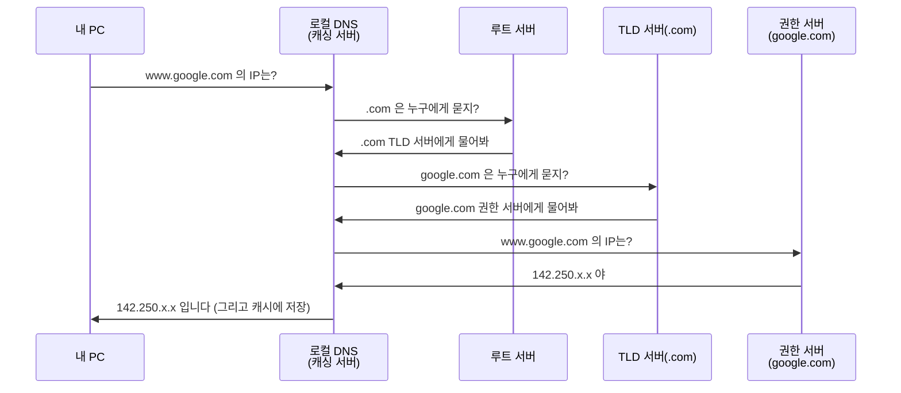
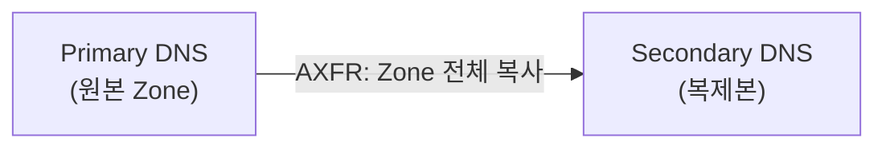
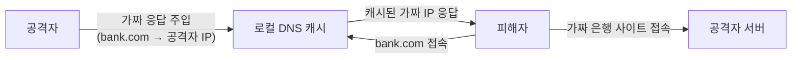

> 이 글은 **순수 이론** 입니다. BIND 서버 구성과 Zone Transfer 취약점 실습은 다음 글(04-2, 04-3)에서 합니다.
{: .prompt-info }

## 1. DNS란 무엇인가

사람은 `www.google.com` 같은 **이름**을 기억하지만, 컴퓨터는 `142.250.x.x` 같은 **IP 주소**로만 통신합니다.  
**DNS(Domain Name System)** 는 이 **이름 ↔ IP 주소** 를 바꿔 주는 시스템입니다.

> 비유: DNS는 **인터넷의 전화번호부** 입니다. "홍길동"(도메인)을 찾으면 "010-1234-5678"(IP)을 알려 줍니다.
{: .prompt-tip }

DNS가 멈추면 IP는 멀쩡해도 **이름으로는 아무 사이트도 못 들어갑니다.** 그래서 DNS는 인터넷의 핵심 기반 시설이고, 공격 대상이 되기도 합니다.

---

## 2. DNS는 어떻게 답을 찾나 — 질의 순서

도메인 이름은 **계층 구조** 로 되어 있고, DNS도 그 계층을 따라 위에서부터 물어 내려갑니다.

```
www . google . com .
 │       │      │   └ 루트(.)
 │       │      └──── 최상위 도메인(TLD): com
 │       └─────────── 도메인: google
 └─────────────────── 호스트: www
```

### 2.1 재귀 질의 흐름



| 용어 | 뜻 |
|---|---|
| **재귀 질의(Recursive)** | 내 PC가 로컬 DNS에게 "끝까지 알아내서 답만 줘" 라고 맡기는 방식 |
| **반복 질의(Iterative)** | 로컬 DNS가 루트→TLD→권한 서버로 **단계별로** 직접 물어 가는 방식 |
| **캐싱(Caching)** | 한 번 찾은 답을 **일정 시간(TTL) 저장** 해 다음엔 빨리 답함 |

> 핵심 순서 암기: **로컬(캐시) → 루트(.) → TLD(.com) → 권한 서버(google.com)**.
{: .prompt-warning }

---

## 3. DNS 레코드의 종류 (시험 단골)

DNS 서버는 이름에 대한 정보를 **레코드(Record)** 로 보관합니다.

| 레코드 | 이름 | 역할 |
|---|---|---|
| **A** | Address | 도메인 → **IPv4** 주소 |
| **AAAA** | — | 도메인 → **IPv6** 주소 |
| **CNAME** | Canonical Name | 도메인의 **별칭**(다른 이름을 가리킴) |
| **MX** | Mail eXchanger | 그 도메인의 **메일 서버** (03 메일에서 등장) |
| **NS** | Name Server | 그 도메인을 책임지는 **DNS 서버** |
| **PTR** | Pointer | **IP → 도메인** (역방향 조회) |
| **SOA** | Start of Authority | Zone의 **기준 정보**(관리자·일련번호·갱신주기) |
| **TXT** | Text | 자유 텍스트 (**SPF** 등이 여기에 들어감) |

---

## 4. Zone 파일과 Zone Transfer

### 4.1 Zone과 Zone 파일

**Zone(존)** 은 하나의 DNS 서버가 책임지는 **도메인 관리 구역** 입니다.  
그 구역의 모든 레코드(A, NS, MX…)를 적어 둔 파일이 **Zone 파일** 이고, 맨 위에는 항상 **SOA 레코드** 가 옵니다.

- **Primary(Master) 서버**: Zone 파일 원본을 가진 서버
- **Secondary(Slave) 서버**: 원본을 **복제**해 두는 예비 서버 (장애 대비)

### 4.2 Zone Transfer (AXFR)

**Secondary가 Primary로부터 Zone 전체를 복제해 오는 것** 을 **Zone Transfer(AXFR)** 라고 합니다.



> ⚠️ **보안 문제**: Zone Transfer를 **아무에게나 허용** 하면, 공격자가 `dig axfr` 한 번으로 **그 도메인의 모든 서버 이름·IP 목록을 통째로** 가져갈 수 있습니다. → 내부 구조가 그대로 노출되는 **정보 수집(정찰)** 의 좋은 먹잇감.  
> 그래서 Zone Transfer는 **지정된 Secondary 서버에게만** 허용해야 합니다. (다음 실습 04-3에서 직접 확인)
{: .prompt-warning }

---

## 5. DNS 공격 유형

| 공격 | 설명 |
|---|---|
| **Zone Transfer 정보수집** | AXFR 허용 서버에서 전체 레코드를 덤프해 내부 구조 파악 |
| **DNS 스푸핑 / 캐시 포이즈닝** | 가짜 DNS 응답을 주입해, 사용자를 **악성 사이트로 유도** |
| **DNS 하이재킹** | DNS 설정 자체를 변조해 도메인을 탈취 |
| **DNS 증폭(DDoS)** | 작은 질의로 큰 응답을 유발해 대상 서버를 마비 |

### 5.1 캐시 포이즈닝의 위험



주소창은 진짜 `bank.com` 인데, 실제로는 **공격자 서버**에 접속하게 됩니다. → 피싱·정보 탈취로 직결.

---

## 6. DNS 방어 — DNSSEC 🔴 데모

**DNSSEC(DNS Security Extensions)** 는 DNS 응답에 **전자서명** 을 붙여, 응답이 **위조되지 않았음을 검증** 하게 합니다. (캐시 포이즈닝 방어의 핵심)

- 각 Zone은 키 쌍으로 레코드에 서명한다(`RRSIG`, `DNSKEY` 레코드 추가).
- 상위 Zone이 하위 Zone의 키를 보증한다(**신뢰 체인**: 루트 → TLD → 도메인).

> DNSSEC 구축은 키 생성·서명·상위 등록 등 단계가 많아 **1학년 실습에는 과합니다(🔴).** 개념(=응답에 서명해 위조를 막는다)만 이해하면 됩니다.
{: .prompt-info }

### 그 밖의 방어

- **Zone Transfer 제한**: 지정 Secondary에게만 허용 (실습에서 직접 적용)
- **재귀 질의 제한**: 내부 사용자에게만 recursion 허용 (외부 악용 방지)
- **응답 속도 제한(RRL)**: DNS 증폭 DDoS 완화

---

## 7. 조회 도구 — nslookup / dig

| 도구 | 특징 |
|---|---|
| **nslookup** | 간단한 이름 조회, 윈도우·리눅스 공통 |
| **dig** | 상세한 정보·레코드별 조회, 리눅스에서 주로 사용 (Zone Transfer 테스트도 가능) |

```bash
dig A www.google.com        # A 레코드 조회
dig MX google.com           # 메일 서버 조회
dig axfr example.com @DNS서버   # Zone Transfer 시도(취약 점검)
```

> 다음 실습(04-2)에서 우리 DNS 서버(BIND)를 직접 만들고, `dig` 로 조회해 봅니다.
{: .prompt-tip }

---

## 8. 핵심 정리

- **DNS**: 이름 ↔ IP 변환(인터넷 전화번호부). 질의 순서 **로컬(캐시) → 루트 → TLD → 권한 서버**.
- **레코드**: A(IPv4), AAAA(IPv6), CNAME(별칭), MX(메일), NS(DNS서버), PTR(역방향), SOA(기준), TXT(SPF 등).
- **Zone Transfer(AXFR)**: Primary→Secondary 복제. **아무에게나 허용하면 내부 정보 통째로 노출**(정찰).
- **공격**: Zone Transfer 정보수집, **캐시 포이즈닝/스푸핑**, 하이재킹, 증폭 DDoS.
- **방어**: **DNSSEC**(응답 서명, 🔴 데모), Zone Transfer 제한, 재귀 제한.

> 다음 글(**04-2. BIND9로 DNS 서버 구축**)에서 우리만의 DNS 서버를 직접 올립니다.
{: .prompt-info }
