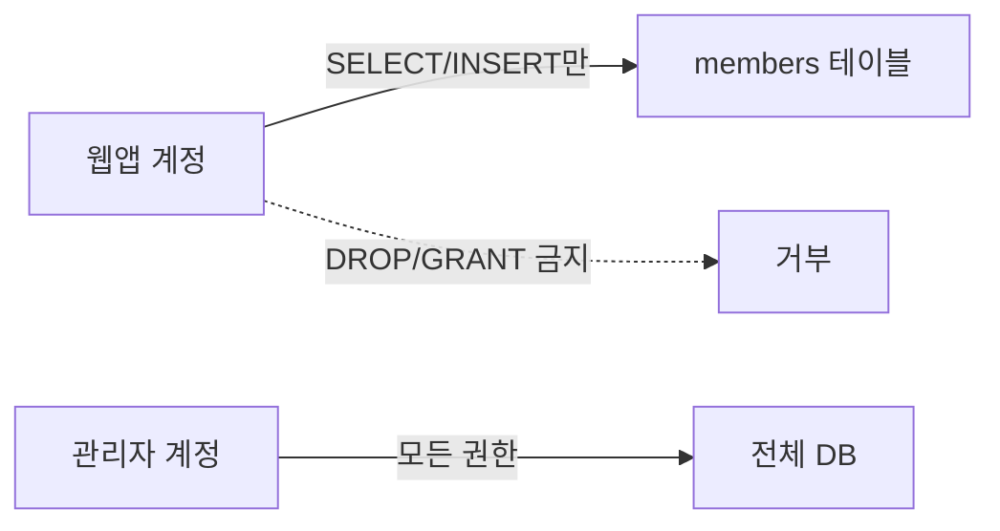
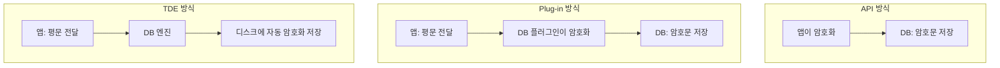

> 이 글은 **순수 이론** 입니다. MariaDB 권한·암호화 실습은 다음 글(05-2, 05-3)에서 합니다.
{: .prompt-info }

## 1. 왜 DB 보안인가

**데이터베이스(DB)** 는 회원정보·결제정보·거래내역 등 **기업의 가장 핵심 자산** 이 모이는 곳입니다.  
DB 하나가 뚫리면 **수만~수억 건의 개인정보가 한 번에** 유출됩니다. 그래서 DB는 공격자의 최종 목표이자, 가장 강하게 지켜야 할 대상입니다.

> 웹·FTP·메일 공격의 **종착지**가 결국 DB인 경우가 많습니다. "앞문(웹)을 뚫고 들어와 금고(DB)를 여는" 그림을 떠올리면 됩니다.
{: .prompt-tip }

---

## 2. DB 공격 유형

| 공격 | 설명 |
|---|---|
| **SQL Injection** | 입력값에 SQL을 끼워 넣어 인증 우회·데이터 탈취 (웹 과목에서 상세히 다룸) |
| **권한 상승** | 낮은 권한 계정으로 들어와 관리자 권한을 획득 |
| **인증 우회·약한 계정** | 기본 계정(`root` 무암호)·약한 비밀번호로 침투 |
| **백업·덤프 유출** | 백업 파일이나 `mysqldump` 결과물이 평문으로 새어 나감 |
| **내부자 위협** | 권한을 가진 내부 직원이 데이터를 유출·악용 |

> 이 과목에서는 **접근통제**(누구에게 어디까지 권한을 줄까)와 **암호화**(새어 나가도 못 읽게)에 집중합니다.  
> (SQL Injection의 공격 기법 자체는 웹 보안 과목에서 별도로 학습)
{: .prompt-info }

---

## 3. 접근통제 — "누가, 무엇을, 어디까지"

DB 보안의 출발점은 **계정과 권한 관리** 입니다.

### 3.1 인증 vs 인가

| 구분 | 뜻 | DB에서 |
|---|---|---|
| **인증(Authentication)** | "너 누구야?" 신원 확인 | 계정·비밀번호 로그인 |
| **인가(Authorization)** | "너 뭘 할 수 있어?" 권한 확인 | SELECT/INSERT/DELETE 등 **권한(GRANT)** |

### 3.2 최소 권한 원칙 (Least Privilege)

> **꼭 필요한 권한만, 꼭 필요한 대상에만** 부여한다.
{: .prompt-warning }

- 웹 애플리케이션 계정에 `DROP`·`GRANT` 같은 강한 권한을 주면, SQL Injection 한 방에 **DB 전체가 날아갈 수** 있습니다.
- 그래서 앱 계정에는 보통 **그 앱이 쓰는 테이블의 SELECT/INSERT/UPDATE/DELETE 정도만** 줍니다.

### 3.3 권한 부여·회수 명령

| 명령 | 역할 |
|---|---|
| `GRANT` | 권한 **부여** |
| `REVOKE` | 권한 **회수** |
| `CREATE USER` / `DROP USER` | 계정 생성/삭제 |

> 다음 실습(05-2)에서 읽기 전용 계정을 만들어, **권한 밖의 작업이 거부되는 것**을 직접 확인합니다.
{: .prompt-tip }

---

## 4. DB 암호화 — 새어 나가도 못 읽게

접근통제를 뚫리거나 백업 파일이 유출돼도, **암호화** 되어 있으면 내용을 읽을 수 없습니다. DB 암호화는 크게 **3가지 방식** 이 있습니다. (시험 단골)

### 4.1 세 가지 방식

| 방식 | 암호화하는 위치 | 특징 | 앱 수정 |
|---|---|---|---|
| **API 방식 (응용프로그램)** | **애플리케이션**이 암복호화 후 DB엔 암호문 저장 | 가장 유연, 컬럼 단위 세밀 제어 | **필요**(코드 수정) |
| **Plug-in 방식** | **DBMS에 모듈(플러그인)** 을 끼워 DB가 암복호화 | 앱 수정 적음, DB 차원 처리 | 적음 |
| **TDE (투명 암호화)** | **저장장치(파일/테이블스페이스)** 레벨에서 자동 | 앱이 전혀 몰라도 됨(투명), 디스크 도난 방어 | 없음 |

### 4.2 방식별 장단점

- **API 방식**: 컬럼별로 원하는 것만 암호화 가능(유연). 하지만 **앱 코드를 고쳐야** 하고, 암호화한 컬럼은 검색·정렬이 어려움.
- **Plug-in 방식**: 앱 수정이 적고 DB 차원에서 일괄 처리. DBMS가 지원하는 플러그인이 필요.
- **TDE 방식**: 앱·운영자가 **신경 쓸 필요 없이 투명**. **디스크·백업 파일 도난** 시 강력. 다만 메모리상 평문이거나 DB 접속 자체를 뚫리면 무력(접근통제와 함께 써야 함).

> 🔴 **TDE 실습은 데모**: MariaDB의 TDE(data-at-rest encryption)는 암호화 플러그인·키 관리 설정이 필요해 1학년 실습엔 과합니다. **개념(저장 단계에서 투명하게 자동 암호화)** 만 이해합니다.  
> 실습(05-3)에서는 **API 방식의 핵심인 `AES_ENCRYPT` 컬럼 암호화** 를 직접 해 봅니다.
{: .prompt-info }

---

## 5. 그 밖의 DB 보안 기술

| 기술 | 설명 |
|---|---|
| **감사(Audit) 로깅** | 누가 어떤 쿼리를 실행했는지 기록 → 사고 추적 |
| **백업·복구** | 정기 백업 + 백업물 **암호화 보관** |
| **비밀번호 해시 저장** | 비밀번호는 암호화가 아니라 **해시(SHA-2 등)** 로 저장 → 원본 복원 불가 |
| **네트워크 제한** | DB는 외부에 직접 노출하지 않고 내부망·특정 IP만 접속 허용 |

> **암호화 vs 해시**: 암호화는 키로 **되돌릴 수 있고**(AES), 해시는 **되돌릴 수 없습니다**(SHA-2). 그래서 **비밀번호는 해시**, 주민번호·카드번호처럼 **다시 봐야 하는 값은 암호화** 합니다.
{: .prompt-warning }

---

## 6. 핵심 정리

- **DB**: 핵심 자산이 모인 최종 목표. 접근통제 + 암호화가 핵심.
- **공격 유형**: SQL Injection(웹 과목), 권한 상승, 약한 계정, 백업 유출, 내부자.
- **접근통제**: 인증(신원) vs 인가(권한), **최소 권한 원칙**, `GRANT`/`REVOKE`.
- **암호화 3방식**: **API(앱)**, **Plug-in(DBMS 모듈)**, **TDE(저장 레벨 투명)**. TDE는 디스크 도난 방어에 강함(🔴 데모).
- **해시 vs 암호화**: 비밀번호는 **해시(되돌리기 불가)**, 재사용 데이터는 **암호화(키로 복호화)**.

> 다음 글(**05-2. MariaDB 계정·권한 실습**)에서 최소 권한 계정을 직접 만들어 봅니다.
{: .prompt-info }
