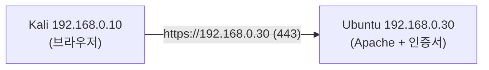

> 이 글은 **실습** 입니다. 개념은 앞 글(**06-1. SSL/TLS 이론**)을 먼저 읽으세요.  
> 목표: **Ubuntu(192.168.0.30)** 에 인증서를 만들어 **HTTPS 웹서버**를 올리고, **Kali(192.168.0.10)** 브라우저로 접속해 자물쇠·경고를 확인한다.
{: .prompt-info }

## 0. 목표 그림



---

## 1. (Ubuntu) Apache와 SSL 모듈 준비

```bash
# === Ubuntu에서 실행 ===
sudo apt update
sudo apt install -y apache2

# TLS(SSL) 기능 모듈 켜기
sudo a2enmod ssl
sudo systemctl restart apache2
```

---

## 2. (Ubuntu) openssl로 자체서명 인증서 만들기

**개인키(`lab.key`)** 와 **인증서(`lab.crt`)** 를 한 번에 생성합니다.

```bash
# === Ubuntu에서 실행 ===
sudo mkdir -p /etc/apache2/ssl

sudo openssl req -x509 -nodes -days 365 -newkey rsa:2048 \
  -keyout /etc/apache2/ssl/lab.key \
  -out /etc/apache2/ssl/lab.crt \
  -subj "/C=KR/ST=Seoul/O=LabOrg/CN=ubuntu.lab.local"
```

옵션 뜻:

| 옵션 | 의미 |
|---|---|
| `-x509` | 인증서 형식으로 바로 생성(자체서명) |
| `-nodes` | 개인키에 암호문구를 걸지 않음(실습 편의) |
| `-days 365` | 유효기간 1년 |
| `-newkey rsa:2048` | 2048비트 RSA 키 새로 생성 |
| `-subj ".../CN=ubuntu.lab.local"` | 주체(도메인 이름) 지정 |

### 2.1 만든 인증서 들여다보기

```bash
# === Ubuntu에서 실행 ===
sudo openssl x509 -in /etc/apache2/ssl/lab.crt -noout -text | head -n 20
```

`Issuer`(발급자)와 `Subject`(주체)가 **둘 다 `CN=ubuntu.lab.local`** 인 것을 확인하세요. → **스스로 보증한 자체서명** 이라는 증거입니다(이론 3.2).

---

## 3. (Ubuntu) Apache HTTPS 사이트에 인증서 연결

기본 SSL 사이트 설정 파일을 우리 인증서로 바꿉니다.

```bash
# === Ubuntu에서 실행 ===
sudo nano /etc/apache2/sites-available/default-ssl.conf
```

아래 두 줄을 찾아 **우리 인증서 경로로** 수정합니다.

```apache
SSLCertificateFile      /etc/apache2/ssl/lab.crt
SSLCertificateKeyFile   /etc/apache2/ssl/lab.key
```

저장 후, SSL 사이트를 활성화하고 반영합니다.

```bash
# === Ubuntu에서 실행 ===
sudo a2ensite default-ssl
sudo systemctl reload apache2

# 443 포트가 열렸는지 확인
sudo ss -tlnp | grep 443
```

---

## 4. (Kali) HTTPS로 접속해 보기

### 4.1 브라우저로 접속

Kali 브라우저에서 다음 주소로 접속합니다.

```
https://192.168.0.30
```

- **경고 화면** 이 뜹니다: "연결이 안전하지 않을 수 있음" → 자체서명 인증서이기 때문입니다(정상).
- **고급 → 위험을 감수하고 계속** 을 누르면 Apache 기본 페이지가 **HTTPS(🔒)** 로 열립니다.

> 🟢 경고가 뜨는 이유: 인증서를 **공인 CA가 보증하지 않았고(자체서명)**, 도메인 이름(`ubuntu.lab.local`)이 접속 주소(IP)와 달라서입니다. 실서비스라면 공인 CA 인증서를 써서 경고가 없어야 합니다.
{: .prompt-warning }

### 4.2 명령으로 인증서 확인 (선택)

```bash
# === Kali에서 실행 ===
echo | openssl s_client -connect 192.168.0.30:443 2>/dev/null | openssl x509 -noout -subject -issuer -dates
```

서버가 제시한 인증서의 주체·발급자·유효기간이 출력됩니다.

---

## 5. 체크리스트

- [ ] (Ubuntu) `a2enmod ssl` + Apache 재시작
- [ ] (Ubuntu) openssl로 `lab.key`·`lab.crt` 생성, `x509 -text` 로 자체서명 확인
- [ ] (Ubuntu) `default-ssl.conf` 인증서 경로 수정 + `a2ensite default-ssl` + 443 리스닝
- [ ] (Kali) `https://192.168.0.30` 접속 시 **자체서명 경고 → 🔒 페이지** 확인
- [ ] (Kali) `s_client` 로 인증서 주체·발급자 확인

> ⭐ 이 HTTPS 서버는 다음 실습(06-3)에서 **Handshake 패킷 캡처·TLS 점검** 대상으로 그대로 씁니다. 그대로 두세요.
{: .prompt-tip }

---

## 6. 다음 글

HTTPS 서버가 동작합니다. 다음 글 **06-3. TLS Handshake 캡처와 보안 점검** 에서 와이어샤크로 **ClientHello·ServerHello·Certificate** 를 직접 잡아 보고, `testssl.sh` 로 서버의 TLS 설정을 점검합니다.
