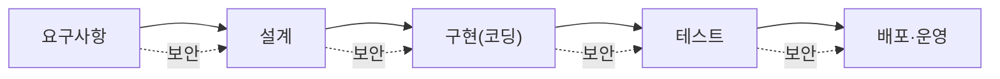
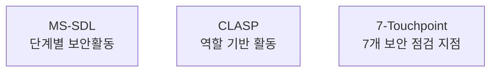

> 이 글은 **순수 이론** 입니다. 취약 코드 수정·정적분석 실습은 다음 글(08-2, 08-3)에서 합니다.
{: .prompt-info }

## 1. 왜 "개발 단계"의 보안인가

지금까지는 이미 만들어진 서비스를 **지키는** 법을 배웠습니다. 하지만 가장 좋은 보안은 **애초에 취약하지 않게 만드는 것** 입니다.

> 취약점은 **나중에 고칠수록 비용이 커집니다.** 설계 때 막으면 1, 출시 후 막으면 수십~수백 배의 비용이 듭니다.
{: .prompt-tip }

그래서 **소프트웨어 개발 생애주기(SDLC)** 의 **모든 단계에 보안을 끼워 넣는** 것이 개발보안의 핵심입니다.

---

## 2. 개발보안 방법론 (시험 단골)

안전한 소프트웨어를 만들기 위한 대표적인 **절차·프레임워크** 세 가지입니다.

| 방법론 | 만든 곳 | 특징 |
|---|---|---|
| **MS-SDL** (Security Development Lifecycle) | Microsoft | SDLC 각 단계별로 **해야 할 보안 활동**을 구체적으로 정의. 가장 널리 알려짐 |
| **CLASP** (Comprehensive, Lightweight Application Security Process) | OWASP | **역할(role) 기반** 의 가벼운 보안 활동 모음. 적용이 유연 |
| **7-Touchpoint** | Gary McGraw | 개발 산출물에 적용하는 **7가지 보안 점검 지점**(코드리뷰·위험분석·침투테스트 등) |

> 외우는 법: **SDL = MS(마이크로소프트)**, **CLASP = OWASP**, **7-Touchpoint = 7개 지점(McGraw)**.
{: .prompt-warning }

---

## 3. 시큐어코딩 — 안전하게 코드 짜기

방법론이 "절차"라면, **시큐어코딩** 은 실제로 코드를 짤 때 지키는 **구체적 규칙** 입니다.

### 3.1 입력 데이터 검증 (가장 중요)

> **"사용자 입력은 절대 믿지 마라."**
{: .prompt-warning }

- 모든 외부 입력(폼·URL·파일·API)은 **형식·길이·범위** 를 검증한다.
- **화이트리스트**(허용 목록) 방식이 블랙리스트(차단 목록)보다 안전하다.
- SQL Injection·명령어 삽입·XSS 등 대부분의 공격은 **입력 검증 실패** 에서 시작된다.

### 3.2 출력 데이터 표현 (인코딩)

- 데이터를 화면·HTML·SQL 등에 내보낼 때, 그 **맥락에 맞게 인코딩** 한다. (XSS 방어의 핵심)
- 예: HTML에 출력 시 `<` 를 `&lt;` 로 변환.

### 3.3 그 밖의 시큐어코딩 규칙

| 규칙 | 설명 |
|---|---|
| **안전한 API 사용** | 위험한 함수(`os.system`, `eval`) 대신 안전한 대안(`subprocess` 리스트 인자 등) |
| **최소 권한** | 프로그램·계정에 꼭 필요한 권한만 |
| **하드코딩 금지** | 비밀번호·키를 코드에 직접 넣지 말고 **환경변수·설정** 으로 분리 |
| **안전한 오류 처리** | 오류 메시지에 시스템 내부 정보(경로·쿼리)를 노출하지 않기 |
| **민감정보 보호** | 비밀번호는 **해시**, 중요한 값은 **암호화**(05장) |

---

## 4. 보안 점검은 어떻게 — 정적분석 vs 동적분석

만든 코드에 취약점이 없는지 점검하는 두 가지 방법입니다.

| 구분 | 정적분석(SAST) | 동적분석(DAST) |
|---|---|---|
| 언제 | **실행하지 않고** 소스코드를 검사 | **실행하면서** 동작을 검사 |
| 비유 | 설계도 검토 | 시운전 |
| 도구 | semgrep, bandit, SonarQube | OWASP ZAP, 퍼저(fuzzer) |
| 장점 | 코드 전체를 빠르게, 개발 초기에 | 실제 동작·환경 문제까지 |
| 한계 | 실행 시점 문제는 못 봄(오탐 가능) | 실행 경로만 검사(미탐 가능) |

> 둘은 **상호 보완** 입니다. 다음 실습(08-3)에서 **정적분석(semgrep)** 으로 취약 코드를 잡아 봅니다. (동적분석은 09장)
{: .prompt-tip }

---

## 5. 핵심 정리

- **개발보안**: 취약점은 **일찍 막을수록 싸다** → SDLC 전 단계에 보안 통합.
- **방법론**: **MS-SDL**(MS, 단계별), **CLASP**(OWASP, 역할 기반), **7-Touchpoint**(McGraw, 7지점).
- **시큐어코딩**: **입력 검증(화이트리스트)**, **출력 인코딩**, 안전한 API, 최소 권한, **하드코딩 금지**, 안전한 오류 처리.
- **점검**: **정적분석(SAST, 코드 검사)** vs **동적분석(DAST, 실행 검사)** — 상호 보완.

> 다음 글(**08-2. 취약 코드를 안전 코드로 고치기**)에서 직접 코드를 고쳐 봅니다.
{: .prompt-info }
