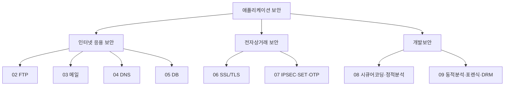

> 이 글은 **순수 이론(복습)** 입니다. 전체 과정을 한 번에 정리합니다. 마지막 실습은 다음 글(10-2)에서 서버 하드닝으로 마무리합니다.
{: .prompt-info }

## 1. 우리가 배운 전체 지도

> 큰 그림: **① 서비스별로 어떻게 공격당하고 막는가(02~05)**, **② 통신·거래를 어떻게 암호화·인증하는가(06~07)**, **③ 안전하게 만들고 점검·대응하는가(08~09)**.
{: .prompt-tip }

---

## 2. 카테고리별 핵심 요약표

| 주제 | 핵심 개념 | 대표 공격 | 핵심 방어 |
|---|---|---|---|
| **FTP** | 제어(21)/데이터(20), Active/Passive, **평문 전송** | 평문 비밀번호 스니핑, 바운스 | **SFTP/FTPS**, ftpusers, 익명 차단 |
| **메일** | MUA→MTA→MDA, SMTP25/POP3 110/IMAP143 | 발신자 위조, 스팸·피싱 | **SPF/DKIM/DMARC**, **PGP** 암호화 |
| **DNS** | 질의 순서, 레코드(A/MX/NS/SOA), Zone Transfer | **AXFR 정보수집**, 캐시 포이즈닝 | allow-transfer 제한, **DNSSEC** |
| **DB** | 인증/인가, **최소권한**, 암호화 3방식 | SQLi, 권한상승, 백업유출 | **최소권한 GRANT**, AES암호화, 해시 |
| **SSL/TLS** | 기밀성·무결성·인증, **Handshake**, 인증서 | 자체서명·다운그레이드, 약한 cipher | **TLS1.2+**, 공인 CA 인증서 |
| **IPSEC·SET·OTP** | AH/ESP/IKE, **전자봉투·이중서명**, OTP 동기/비동기 | (VPN 미구성·약한 인증) | VPN 터널, **2단계 인증(OTP)** |
| **개발보안** | SDL/CLASP/7-Touchpoint, **시큐어코딩** | 입력검증 실패, 하드코딩 | **입력검증·안전한 API**, 정적/동적분석 |
| **포렌식·DRM** | 무결성·연계보관성, 휘발성 순서 | 증거 변조 | **해시 무결성**, 적법 절차, DRM |

---

## 3. 시험에 자주 나오는 포인트 (암기)

### 3.1 포트 번호

| 서비스 | 평문 | 암호화 |
|---|---|---|
| FTP | 21(제어)/20(데이터) | SFTP 22 / FTPS 990 |
| SMTP | 25, 587 | 465 |
| POP3 | 110 | 995 |
| IMAP | 143 | 993 |
| DNS | 53 | — |
| HTTP/HTTPS | 80 | 443 |

### 3.2 헷갈리기 쉬운 개념

| 구분 | 정리 |
|---|---|
| Active vs Passive(FTP) | 데이터 연결을 **서버가 걸면 Active**, **클라이언트가 걸면 Passive** |
| ftpusers | 로그인 **거부** 명단(허용 아님) |
| AH vs ESP | AH=**인증만**, ESP=**암호화+인증** |
| 동기 vs 비동기 OTP | 동기=시간/카운터, 비동기=**질의응답** |
| 정적 vs 동적분석 | 정적=**안 돌리고** 코드, 동적=**실행하며** 행동 |
| 암호화 vs 해시 | 암호화=**키로 복원 가능**, 해시=**복원 불가**(비밀번호) |
| 전자봉투 vs 이중서명 | 전자봉투=대칭키를 공개키로 보호 / 이중서명=주문·결제 **분리** |

### 3.3 OWASP·표준 연결

- 입력검증 실패 → Injection 계열(SQLi·명령삽입·XSS)
- 접근통제 실패 → Broken Access Control
- 약한 인증·세션 → Authentication Failures
- 암호화 미흡 → Cryptographic Failures

> (웹 취약점 SQLi·XSS·업로드 등의 상세 공격 기법은 **웹 보안 과목**에서 별도로 학습)
{: .prompt-info }

---

## 4. "공격 → 방어" 한 줄 요약

- **평문은 암호화로** (FTP→SFTP, HTTP→HTTPS, 메일→PGP/TLS)
- **입력은 검증으로** (SQLi·명령삽입 → 입력검증·안전한 API·Prepared Statement)
- **권한은 최소로** (DB·계정 → 최소 권한 원칙)
- **신원은 다단계로** (비밀번호 + **OTP 2FA**)
- **위조는 서명으로** (메일 SPF/DKIM, DNS DNSSEC, TLS 인증서)
- **사고는 기록으로** (감사 로그, 포렌식 무결성 해시)

---

## 5. 마무리

이 과정에서 우리는 **같은 가상 실습실(Kali + Ubuntu)** 하나로 FTP·메일·DNS·DB·TLS·OTP·시큐어코딩·포렌식까지 직접 **만들고, 공격하고, 막아** 봤습니다.

> 보안은 "외우는 지식"이 아니라 **"직접 해 보며 이해하는 감각"** 입니다. 마지막 글(**10-2**)에서 지금까지의 방어를 한 서버에 모아 **하드닝 점검** 으로 마무리합니다.
{: .prompt-tip }
