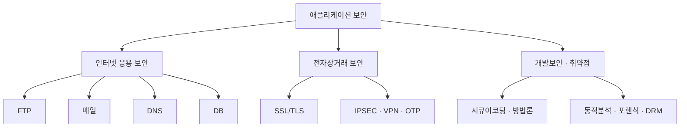
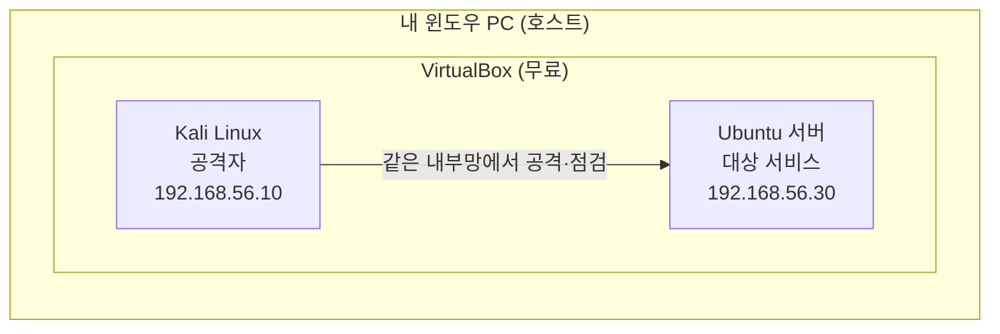

> 이 글은 **첫 시간(오리엔테이션)** 용입니다. 직접 실습하는 내용은 없고, **무엇을 어떤 순서로 배우는지** 와 **실습 환경을 어떻게 준비하는지** 를 데모 수준으로 안내합니다.
{: .prompt-info }

## 1. 이 과정은 무엇인가

**애플리케이션 보안(Application Security)** 은 우리가 매일 쓰는 서비스 — 웹사이트, 이메일, 파일 전송, 데이터베이스 — 가 **어떻게 공격받고 어떻게 지키는지** 를 배우는 과목입니다.

- **대상**: 보안을 처음 접하는 **1학년 / 비전공자**
- **목표**: ① 주요 웹·인터넷 서비스의 동작 원리 이해 → ② 대표 취약점이 왜 생기는지 → ③ 실제로 공격·방어를 **손으로** 해 보기
- **연계 자격증**: 정보보안산업기사 필기 "애플리케이션 보안" 과목 범위를 그대로 따릅니다.

> 이 과목은 "외우는 보안"이 아니라 **"직접 만들어 보고, 깨뜨려 보고, 막아 보는 보안"** 을 지향합니다.
{: .prompt-tip }

---

## 2. 무엇을 배우나 — 전체 지도

각 주제는 **"개념 → 운영 → 공격 → 방어"** 4단계로 일관되게 다룹니다. 서비스가 바뀌어도 이 틀은 똑같습니다.

> **웹 애플리케이션 취약점(SQL Injection·XSS·파일 업로드 등)은 이 과정에서 다루지 않습니다.**
> 분량이 커서 **[웹 보안] 과정**으로 분리하였으며, DVWA 실습 환경 구축부터 18개 주제를 별도로 다룹니다. 두 과정은 **같은 실습 환경**(`192.168.56.30` / `192.168.56.10`)을 사용하므로 어느 쪽을 먼저 들어도 무방합니다.
{: .prompt-info }

---

## 3. 전체 편성표 (11개 회차)

각 카테고리는 **이론 1개 + 실습 1~2개** 로 구성됩니다.  
난이도 표시: 🟢 **직접 실습** · 🟡 **단순화 실습** · 🔴 **데모/이론**(직접 하지 않고 시연·개념으로)

| 카테고리 | 이론에서 다루는 것 | 실습에서 하는 것 | 데모/이론으로 보는 것 |
|---|---|---|---|
| **00. 오리엔테이션** | 과정 편성·진행 방식 | — | (이 글) |
| **01. 실습 환경 연결 확인** | 환경 규격·연계 안내 | 🟢 Kali 준비, 방화벽 개방, 통신 점검 | 환경 구축 자체는 **[리눅스 기초] 0강** |
| **02. FTP 보안** | Active/Passive, ftpusers, xferlog | 🟢 FTP 서버 구축, 평문 비밀번호 가로채기 | 🔴 FTP 바운스 공격 |
| **03. 메일 보안** | MUA·MTA, 포트, 스팸, SPF, PGP | 🟢 메일 직접 전송, SPF 확인, GPG 암호화 | 🔴 메일 서버 전체 구축 |
| **04. DNS 보안** | 레코드, 질의 순서, Zone Transfer | 🟢 DNS 서버 구성, dig로 정보 수집 | 🔴 DNSSEC 5단계 |
| **05. DB 보안** | 접근통제, 암호화 방식 | 🟢 계정·권한, 컬럼 암호화·해시 | 🔴 TDE 설정 |
| **06. SSL/TLS** | Handshake 과정·구성요소 | 🟢 인증서 생성, 암호화 통신 패킷 관찰 | — |
| **07. IPSEC · SET · OTP** | IPSEC, VPN 종류, SET, OTP | 🟢 OTP 생성, SSH 2단계 인증 적용 | 🔴 VPN 터널 구축 |
| **08. 개발보안 ①** | 방법론(SDL 등), 시큐어코딩 | 🟢 취약 코드 → 안전 코드 고치기 | 🟡 정적분석 도구 1회 실행 |
| **09. 개발보안 ②** | 동적분석, 포렌식, DRM | 🟢 strace 동적분석, 포렌식 기초 | 🔴 메모리 포렌식(Volatility) |
| **10. 종합 정리** | 전체 복습·핵심 포인트 | 🟢 서버 하드닝 종합 점검 | — |

> 🔴 항목은 **직접 실습하지 않습니다.** 설정이 1학년에게 과하기 때문에, 교수자가 시연하거나 개념·그림으로 설명합니다. **시험 출제 범위는 그대로 다룹니다.**
{: .prompt-warning }

> **자격증 범위와의 관계**
> 정보보안산업기사 "애플리케이션 보안" 과목 중 **웹 취약점 영역은 [웹 보안] 과정**이, 나머지(FTP·메일·DNS·DB·SSL/TLS·전자상거래·개발보안)는 **이 과정**이 담당합니다. 두 과정을 합하면 과목 범위 전체가 채워집니다.
{: .prompt-tip }

---

## 4. 실습 환경 — 학기 내내 "하나"로 고정

이 과목의 가장 중요한 약속입니다.

> **실습 환경은 한 번 만들고 학기 끝까지 바꾸지 않습니다.**  
> 매주 새 프로그램을 깔거나 설정을 바꾸지 않으므로, 한 번만 잘 만들어 두면 됩니다.
{: .prompt-tip }

### 4.1 환경 구성

윈도우 PC 한 대 위에 **가상머신(VM) 2대** 를 올려서 사용합니다.

| 구분 | 역할 | 비유 |
|---|---|---|
| **Kali Linux** | 공격·점검 도구가 모인 머신 | "보안 점검자의 노트북" |
| **Ubuntu 서버** | FTP·DNS·웹 등 서비스를 올리는 머신 | "지켜야 할 회사 서버" |

### 4.2 왜 가상머신(VM)을 쓰나? (윈도우에 직접 안 하고)

- **안전**: 공격 실습을 내 윈도우가 아니라 격리된 가상 컴퓨터 안에서만 하므로, 실수해도 내 PC는 멀쩡합니다.
- **동일 환경**: 모두가 똑같은 Kali·Ubuntu를 쓰므로, 화면과 명령어가 교재와 100% 일치합니다.
- **되돌리기**: 문제가 생기면 스냅샷으로 처음 상태로 복구할 수 있습니다.

> **실습 환경 구축은 [리눅스 기초] 0강으로 이관되었습니다.**  
> VirtualBox 설치, Ubuntu·Kali 가상머신 생성, 실습망 연결까지 세 편으로 나누어 다룹니다.
>
> | 편 | 내용 |
> |---|---|
> | 0-1 | 가상 머신과 네트워크의 이해(이론) |
> | 0-2 | VirtualBox 및 가상 머신 설치(실습) |
> | 0-3 | 네트워크 연결과 통신 확인(실습) |
>
> 리눅스 기초 0강에서는 Kali가 **선택 항목**이지만, **이 과정에서는 필수**입니다. 와이어샤크·브라우저를 쓰는 실습이 모두 Kali에서 이루어지기 때문입니다.
>
> 리눅스 기초를 이미 수강했다면 그때 만든 환경을 그대로 쓰되, **다음 글 「01. 실습 환경 연결 확인」을 반드시 먼저 수행**하십시오. Kali 추가 준비와 **방화벽 개방**을 하지 않으면 02강부터 실습이 진행되지 않습니다.
{: .prompt-info }

### 4.3 준비물

- **윈도우 PC** (RAM 8GB 이상 권장 — VM 2대를 동시에 켜기 위함)
- 여유 디스크 **40GB 이상**
- 인터넷 연결 (설치 파일 다운로드용)

---

## 5. 수업 진행 방식

1. **이론 (X-1)** — 개념과 원리를 그림으로 이해합니다. (예: "FTP는 비밀번호를 어떻게 주고받나?")
2. **실습 (X-2, X-3)** — 같은 VM 안에서 직접 서버를 만들고, 공격해 보고, 막아 봅니다.
3. **데모(🔴)** — 너무 복잡한 주제는 교수자 시연·개념 설명으로 대체합니다.

> 모든 실습은 **복사-붙여넣기 가능한 명령어**와 **단계별 화면 설명**으로 제공됩니다.  
> 리눅스를 처음 써도 따라올 수 있도록 한 줄씩 설명합니다.
{: .prompt-tip }

---

## 6. 미리보기 — 이런 걸 하게 됩니다

직접 해 볼 대표 실습 몇 가지를 맛보기로 소개합니다. (자세한 방법은 각 회차에서)

- **FTP 보안**: 와이어샤크로 네트워크를 들여다보면, FTP 로그인 **비밀번호가 평문 그대로** 보이는 장면을 직접 확인합니다.
- **DNS 보안**: 명령 한 줄로 **회사 도메인의 서버 목록 전체를 통째로 복제**해 오는 Zone Transfer 취약점을 재현하고 막아 봅니다.
- **SSL/TLS**: 암호화된 통신을 패킷으로 잡아 "왜 평문 FTP는 위험하고 HTTPS는 안전한지" 를 눈으로 비교합니다.
- **OTP**: 은행 앱에서 보던 **6자리 일회용 비밀번호**가 어떻게 만들어지는지 직접 생성하고, **SSH 로그인에 2단계 인증**을 붙여 봅니다.

---

## 7. 다음 시간

**01. 실습 환경 연결 확인** — 리눅스 기초 0강에서 만든 환경이 이 과정을 진행할 수 있는 상태인지 점검하고, 부족한 부분만 채웁니다.

| 확인할 것 | 이유 |
|---|---|
| Ubuntu 계정·주소(`student` / `192.168.56.30`) | 이후 모든 명령이 이 값을 그대로 사용 |
| **Kali 준비와 주소(`192.168.56.10`)** | 와이어샤크·브라우저 실습에 필수 |
| **방화벽(ufw) 개방** | 리눅스 기초 6강 상태 그대로면 FTP·DNS·웹 실습이 전부 차단됨 |
| 웹 서버 중복 제거 | 06강 Apache 설치 시 포트 충돌 방지 |

환경 구축을 처음부터 해야 한다면 **[리눅스 기초] 0강(0-1 · 0-2 · 0-3)** 을 먼저 수행하십시오. 점검이 끝나면 **02. FTP 보안** 부터 이어서 진행합니다.
