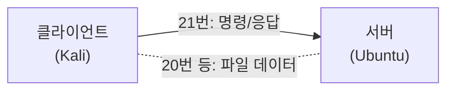
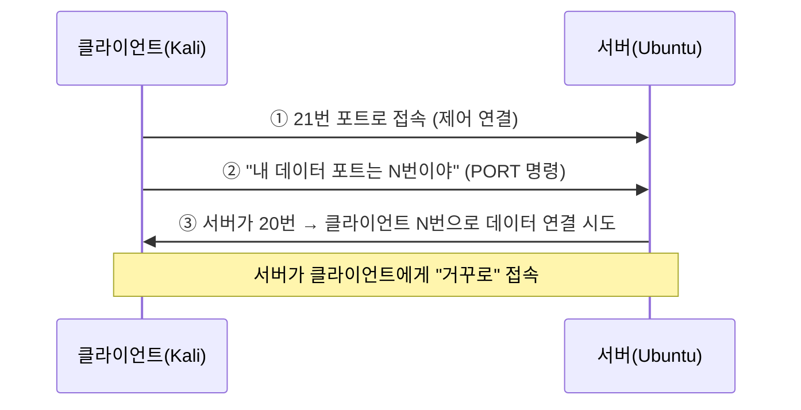
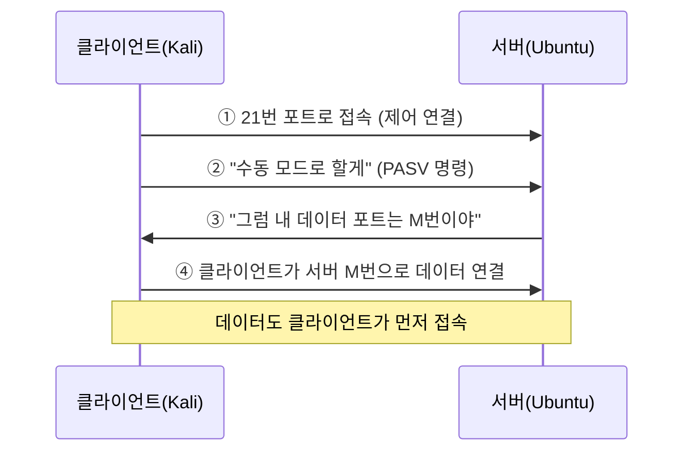

## 1. FTP란 무엇인가

**FTP(File Transfer Protocol, 파일 전송 규약)** 는 인터넷에서 **파일을 주고받기 위한 약속(프로토콜)** 입니다.  
1971년에 만들어진 아주 오래된 규약으로, 지금도 서버에 웹사이트 파일을 올리거나 자료를 내려받을 때 쓰입니다.

- **클라이언트**(파일을 받거나 올리는 쪽) ↔ **서버**(파일을 보관·제공하는 쪽)
- 우리 실습에서는 **Kali가 클라이언트**, **Ubuntu가 FTP 서버** 역할을 합니다.

> 핵심 포인트를 미리 말하면: **FTP는 아이디·비밀번호·파일을 "암호화 없이" 그대로(평문) 주고받습니다.**  
> 이것이 FTP의 가장 큰 보안 약점이며, 이번 카테고리의 핵심 주제입니다.
{: .prompt-warning }

---

## 2. FTP의 독특한 점 — "연결을 2개" 쓴다

대부분의 프로토콜은 연결을 1개만 쓰지만, **FTP는 두 개의 연결**을 사용합니다.

| 연결 | 포트 | 역할 | 비유 |
|---|---|---|---|
| **제어 연결(Control)** | **21번** | 명령·응답 주고받기 (로그인, "이 파일 줘" 등) | 전화로 주문하기 |
| **데이터 연결(Data)** | **20번** 또는 동적 포트 | 실제 파일 내용 전송 | 택배로 물건 받기 |



**왜 이게 중요한가?** 데이터 연결을 "누가 먼저 여느냐"에 따라 **Active 모드**와 **Passive 모드**로 나뉘는데, 이게 FTP 이론의 핵심이자 시험 단골입니다.

---

## 3. Active 모드 vs Passive 모드 (가장 중요)

### 3.1 Active 모드 (능동 모드)

**서버가 클라이언트에게 데이터 연결을 거는** 방식입니다.



- 순서: 클라이언트가 `PORT` 명령으로 "내 데이터 포트 번호"를 알려주면, **서버(20번)가 클라이언트에게 연결**한다.
- **문제점**: 클라이언트 앞에 **방화벽이나 공유기(NAT)** 가 있으면, 밖에서 안으로 들어오는 이 연결을 막아버려 **데이터 전송이 실패**한다.

### 3.2 Passive 모드 (수동 모드)

**클라이언트가 서버에게 데이터 연결을 거는** 방식입니다. (Active의 문제를 해결)



- 순서: 클라이언트가 `PASV` 명령을 보내면, 서버가 **데이터용 포트 번호(M)** 를 알려주고, **클라이언트가 서버에 접속**한다.
- **장점**: 연결을 항상 클라이언트가 먼저 거므로, 클라이언트 쪽 방화벽 문제에서 자유롭다. → **오늘날 대부분 Passive 모드를 사용**한다.

### 3.3 한눈에 비교

| 구분 | Active 모드 | Passive 모드 |
|---|---|---|
| 데이터 연결을 거는 쪽 | **서버** → 클라이언트 | **클라이언트** → 서버 |
| 사용하는 명령 | `PORT` | `PASV` |
| 서버 데이터 포트 | 20번 | 동적(높은 번호) 포트 |
| 클라이언트 방화벽 영향 | 받음(자주 실패) | 거의 없음 |
| 오늘날 | 적게 씀 | **주로 씀** |

> 외우는 법: **A**ctive = 서버가 **A**ttack(거꾸로 접속) / **P**assive = 클라이언트가 **P**ush(직접 접속).
{: .prompt-tip }

---

## 4. FTP의 보안 약점

### 4.1 평문 전송 — 가장 치명적

FTP는 아이디·비밀번호·파일 내용을 **암호화하지 않고 그대로** 보냅니다.  
같은 네트워크에 있는 공격자가 트래픽을 엿보면(스니핑), **비밀번호가 글자 그대로 보입니다.**

```
USER ftpuser      ← 아이디가 평문으로 보임
PASS ftppass123   ← 비밀번호가 평문으로 보임!
```

> 다음 실습(02-3)에서 와이어샤크로 이 장면을 **직접 눈으로 확인** 합니다.
{: .prompt-warning }

### 4.2 익명 FTP(Anonymous FTP)

아이디 없이 `anonymous` 계정으로 누구나 접속하게 열어 둔 설정입니다.  
편하지만, 설정을 잘못하면 **아무나 서버 파일을 올리고 내려받을 수 있어** 위험합니다.

### 4.3 FTP 바운스 공격 (Bounce Attack) 🔴 데모

Active 모드의 `PORT` 명령을 악용한 고전 공격입니다.  
공격자가 `PORT` 명령에 **자기 주소 대신 '제3의 서버' 주소**를 적으면, FTP 서버가 그 제3의 서버로 데이터를 보내게 됩니다. → 공격자가 **자신을 숨기고** FTP 서버를 "발판"으로 삼아 내부 포트 스캔 등을 수행할 수 있습니다.


> 이 공격은 개념만 이해하면 됩니다(🔴 데모). 요즘 FTP 서버는 대부분 막아 두었습니다.
{: .prompt-info }

---

## 5. 알아둘 파일·서비스

### 5.1 ftpusers — 접속 거부 명단

`/etc/ftpusers` 파일에 **적힌 계정은 FTP 로그인이 거부**됩니다.  
보통 `root` 같은 **중요 관리자 계정**을 여기에 넣어, 그 계정으로는 FTP 접속을 못 하게 막습니다.

> 헷갈리지 말 것: ftpusers는 "허용 명단"이 아니라 **"거부 명단(blacklist)"** 입니다.
{: .prompt-warning }

### 5.2 xferlog — 전송 기록 로그

**누가 언제 어떤 파일을 올리고 내렸는지** 기록하는 FTP 전송 로그입니다.  
사고가 났을 때 추적의 근거가 되므로 보안상 중요합니다. (vsftpd에서는 보통 `/var/log/vsftpd.log` 또는 `/var/log/xferlog`)

### 5.3 tftp — 간이 FTP

**tftp(Trivial FTP)** 는 FTP의 아주 단순한 버전입니다.

| 구분 | FTP | tftp |
|---|---|---|
| 전송 방식 | TCP (신뢰성) | **UDP 69번** (단순·빠름) |
| 인증 | 아이디/비밀번호 | **인증 없음** |
| 용도 | 일반 파일 전송 | 네트워크 장비 부팅·펌웨어 등 |

> tftp는 **인증이 없어** 더 위험합니다. 꼭 필요한 곳에서만 제한적으로 써야 합니다.
{: .prompt-warning }

---

## 6. 안전한 대안 — FTPS와 SFTP

평문 FTP의 약점을 해결한 **암호화 전송** 방식입니다. 이름이 비슷하지만 **완전히 다른 기술**입니다.

| 구분 | **FTPS** | **SFTP** |
|---|---|---|
| 기반 기술 | FTP + **SSL/TLS** 암호화 | **SSH** 위에서 동작 |
| 포트 | 21(explicit) / 990(implicit) | **22번** (SSH와 동일) |
| 관계 | "FTP에 자물쇠를 채운 것" | "SSH로 파일을 주고받는 것" |
| 설정 난이도 | 인증서 필요(다소 복잡) | SSH만 있으면 됨(간단) |

> 실습(02-3)에서는 Ubuntu에 이미 설치된 **SSH** 를 이용해 **SFTP** 로 안전하게 전송하는 것을 평문 FTP와 비교합니다.  
> (SFTP 서버는 제0강(0-2)에서 OpenSSH를 설치했으므로 추가 설정 없이 바로 됩니다.)
{: .prompt-tip }

---

## 7. 핵심 정리

- **FTP**: 파일 전송 프로토콜. **제어(21) + 데이터(20/동적)** 두 연결을 사용.
- **Active vs Passive**: 데이터 연결을 **서버가 거느냐(Active)** / **클라이언트가 거느냐(Passive)**. 오늘날은 Passive 위주.
- **최대 약점**: **평문 전송** → 비밀번호가 그대로 노출(다음 실습에서 확인).
- **ftpusers**: 로그인 **거부** 명단(root 등). **xferlog**: 전송 기록. **tftp**: 인증 없는 UDP 69 간이 전송.
- **바운스 공격**: `PORT` 명령 악용으로 서버를 발판 삼는 고전 공격(🔴 데모).
- **안전 대안**: **FTPS(FTP+SSL/TLS)**, **SFTP(SSH 기반, 22번)**.

> 다음 글(**02-2. FTP 서버 구축**)에서 Ubuntu에 vsftpd를 직접 올려 봅니다.
{: .prompt-info }
