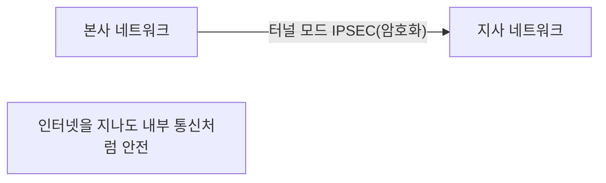
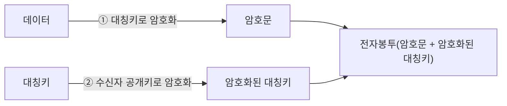
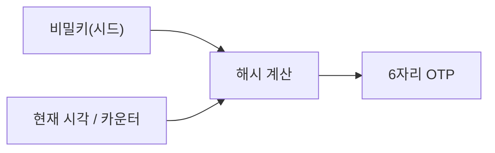

> 이 글은 **순수 이론** 입니다. OTP(일회용 비밀번호) 실습은 다음 글(07-2, 07-3)에서 합니다.  
> IPSEC VPN 구축과 SET는 설정이 복잡해 **이론·데모(🔴)** 로만 다룹니다.
{: .prompt-info }

## 1. IPSEC — 네트워크 계층의 암호화

06장의 SSL/TLS가 **응용 계층**(웹·메일)을 암호화했다면, **IPSEC** 은 **네트워크 계층(IP)** 자체를 암호화합니다.  
그래서 어떤 응용이든 상관없이 **통째로 보호** 할 수 있어, **VPN(가상 사설망)** 의 핵심 기술로 쓰입니다.

### 1.1 IPSEC 구성요소 (시험 단골)

| 요소 | 이름 | 역할 |
|---|---|---|
| **AH** | Authentication Header | **인증·무결성** 보장 (암호화는 안 함) |
| **ESP** | Encapsulating Security Payload | **암호화 + 인증·무결성** (실제로 주로 사용) |
| **IKE** | Internet Key Exchange | 양쪽이 **키를 안전하게 교환·협상** |
| **SA** | Security Association | "어떤 방식으로 보호할지"에 대한 **합의(연결 정보)** |

> 핵심: **AH = 인증만**, **ESP = 암호화까지**. 그래서 기밀성이 필요하면 **ESP** 를 씁니다.
{: .prompt-warning }

### 1.2 두 가지 모드

| 모드 | 무엇을 보호 | 용도 |
|---|---|---|
| **전송(Transport) 모드** | IP 페이로드(데이터)만 암호화 | 호스트 ↔ 호스트 |
| **터널(Tunnel) 모드** | **원본 IP 패킷 전체** 를 새 패킷에 담아 암호화 | **VPN**(게이트웨이 ↔ 게이트웨이) |

---

## 2. VPN의 종류

**VPN(Virtual Private Network)** 은 공용 인터넷 위에 **암호화된 사설 통로** 를 만드는 기술입니다.

| 분류 기준 | 종류 | 설명 |
|---|---|---|
| 연결 형태 | **사이트-투-사이트** | 본사–지사 네트워크를 통째로 연결 |
| | **원격 접속(클라이언트)** | 재택근무자 PC가 회사망에 접속 |
| 기반 기술 | **IPSEC VPN** | 네트워크 계층, 전체 트래픽 보호 |
| | **SSL VPN** | 브라우저 기반, 설치 간편(웹 응용 위주) |

> 🔴 IPSEC VPN(strongSwan 등) 구축은 키·정책 설정이 많아 1학년 실습에는 과합니다. **개념(암호화된 터널)** 만 이해합니다.
{: .prompt-info }

---

## 3. SET — 전자상거래 카드결제 보안 🔴

**SET(Secure Electronic Transaction)** 은 인터넷 카드결제를 안전하게 하기 위한 규약입니다. 두 가지 핵심 개념이 시험에 자주 나옵니다.

### 3.1 전자봉투 (Digital Envelope)

빠른 **대칭키** 와 안전한 **공개키** 를 결합하는 방법입니다. (TLS의 키 교환과 같은 아이디어)

- **본문**은 빠른 **대칭키**로 암호화하고,
- 그 **대칭키**는 **수신자 공개키**로 암호화해 함께 보냅니다.
- 수신자는 **자기 개인키**로 대칭키를 풀고, 그 대칭키로 본문을 복호화합니다.

### 3.2 이중서명 (Dual Signature)

구매자의 **주문정보(상점용)** 와 **결제정보(은행용)** 를 **분리** 해 서로가 불필요한 정보를 못 보게 합니다.

| 받는 곳 | 볼 수 있는 것 | 못 보는 것 |
|---|---|---|
| **상점** | 주문정보 | **카드번호(결제정보)** |
| **은행(PG)** | 결제정보 | **무엇을 샀는지(주문정보)** |

> 🟢 **이중서명의 목적**: 상점은 내 카드번호를 모르고, 은행은 내가 무엇을 샀는지 모릅니다. **개인정보·결제정보를 분리 보호** 하는 영리한 설계입니다.  
> (SET 자체는 오늘날 거의 안 쓰이지만, **이중서명 개념** 은 시험 단골입니다.)
{: .prompt-tip }

---

## 4. OTP — 일회용 비밀번호

**OTP(One-Time Password)** 는 **한 번만 쓰고 버리는 비밀번호** 입니다. 매번 바뀌므로, 설령 유출돼도 다음엔 못 씁니다. (은행 보안카드·앱의 6자리 숫자)

### 4.1 동기식 vs 비동기식

| 방식 | 원리 | 예시 |
|---|---|---|
| **동기식 – 시간(TOTP)** | **현재 시각** + 비밀키 → 코드 (보통 30초마다 변경) | Google Authenticator |
| **동기식 – 이벤트(HOTP)** | **카운터(횟수)** + 비밀키 → 코드 (누를 때마다 증가) | 일부 하드웨어 토큰 |
| **비동기식 – 질의응답** | 서버가 **질문(challenge)** 을 주면 답(response) 계산 | 보안카드 일부, 챌린지 토큰 |

### 4.2 TOTP가 동작하는 원리

- 서버와 사용자(앱)가 **같은 비밀키**를 공유한다.
- 양쪽이 **같은 시각**을 기준으로 같은 코드를 계산한다. → 그래서 **시계가 맞아야** 한다.
- 30초마다 코드가 바뀌므로, 가로채도 곧 무효가 된다.

> 다음 실습(07-2)에서 `oathtool` 로 TOTP를 직접 생성하고, 스마트폰 앱과 **같은 코드가 나오는지** 확인합니다. (07-3에서는 SSH 로그인에 OTP를 붙여 2단계 인증을 만듭니다.)
{: .prompt-tip }

---

## 5. 핵심 정리

- **IPSEC**: 네트워크 계층 암호화(VPN 핵심). **AH(인증) / ESP(암호화+인증) / IKE(키교환) / SA(연결정보)**. **전송 vs 터널** 모드.
- **VPN**: 사이트-투-사이트 / 원격접속, **IPSEC VPN / SSL VPN**.
- **SET**: **전자봉투**(대칭키를 공개키로 보호), **이중서명**(주문·결제 정보 분리 → 상점·은행이 서로 못 봄).
- **OTP**: **동기식(시간 TOTP/이벤트 HOTP)**, **비동기식(질의응답)**. 비밀키+시간/카운터 → 6자리, 매번 변경.

> 다음 글(**07-2. OTP 직접 생성**)에서 일회용 비밀번호를 손으로 만들어 봅니다.
{: .prompt-info }
