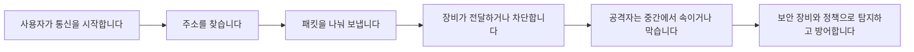

## 1. 이 과정의 목표

네트워크 보안 문제는 용어가 많습니다. MAC, IP, TCP, UDP, ICMP, NAT, VLAN, VPN, IDS, IPS, NAC, RADIUS, WPA2 같은 단어가 계속 나옵니다. 처음 보는 분에게는 모두 암기 과목처럼 보입니다.

하지만 실제로는 하나의 흐름입니다.

이 과정의 목표는 다음과 같습니다.

| 목표 | 설명 |
|---|---|
| 네트워크 동작 이해 | 패킷이 어디서 만들어지고 어떤 장비를 지나가는지 이해합니다. |
| 공격 원리 이해 | 스니핑, 스푸핑, DDoS 같은 공격이 왜 가능한지 이해합니다. |
| 방어 기술 이해 | 방화벽, IDS/IPS, VPN, NAC가 어떤 문제를 해결하는지 이해합니다. |
| 기출 문제 연결 | 정보보안기사 문제에서 어떤 표현으로 출제되는지 확인합니다. |
| 실습 경험 | Kali Linux와 두 대상 VM(Metasploitable2·Ubuntu)을 사용해 이론과 실습을 연결합니다. |

---

## 2. 매 차시 공통 구성

모든 차시는 아래 순서로 진행합니다.

| 순서 | 의미 | 수업 방식 |
|---|---|---|
| **상황** | 현실에서 어떤 문제가 생기는지 봅니다. | 예시, 비유, 사고 사례 |
| **원리** | 그 상황을 이해하기 위한 네트워크 개념을 배웁니다. | 그림, 표, 쉬운 설명 |
| **공격** | 공격자가 그 원리를 어떻게 악용하는지 봅니다. | Kali 도구 기반 실습 |
| **방어** | 관리자는 어떤 장비와 설정으로 막는지 봅니다. | 설정, 로그, 탐지 |
| **기출 연결** | 시험에서는 어떤 키워드로 묻는지 정리합니다. | 문제 포인트 요약 |

> 이 순서를 지키면 단순 암기가 아니라 “왜 이 보안 기술이 필요한지”가 보입니다.
{: .prompt-tip }

---

## 3. 전체 커리큘럼

| 차시 | 제목 | 핵심 내용 | Kali 도구 |
|---|---|---|---|
| 00 | 과정 안내 | 전체 흐름, 학습 방법, 실습 윤리 | - |
| 01 | 실습 환경 구축 | Kali, Metasploitable2, Ubuntu, 격리망 | ip, ping, tcpdump |
| 02 | 네트워크 기본 구조 | OSI 7계층, TCP/IP, MAC/IP/Port | Wireshark, tshark |
| 03 | IP 주소와 라우팅 | IPv4, 서브넷, 게이트웨이, ICMP | ping, traceroute, ip route |
| 04 | TCP/UDP와 포트 | 3-way handshake, 플래그, UDP, Wireshark 실습 | Wireshark, hping3, dig |
| 05 | 포트 스캐닝과 정보수집 | whois/dig 정찰, TCP·UDP 스캔 유형 | nmap, whois, nikto |
| 06 | ARP와 스니핑 | ARP, 스니핑, ARP 스푸핑, MAC 플러딩 | arp-scan, arping, Wireshark |
| 07 | 스푸핑과 중간자 공격 | ARP/DNS/DHCP/ICMP/SSL 스트리핑, MITM | ettercap, bettercap |
| 08 | DNS, DHCP, SNMP | 이름 해석, DNSSEC, 자동 주소, 관리 | dig, nslookup, snmpwalk |
| 09 | DoS/DDoS | SYN Flood, DRDoS, ICMP, Teardrop, Slowloris | hping3, slowhttptest |
| 10 | 방화벽과 IDS/IPS | ACL, Stateful, Snort/Suricata 탐지 | iptables, ufw, suricata |
| 11 | 무선 LAN 보안 | SSID, WEP/WPA/WPA2, 802.1X | aircrack-ng, airodump-ng |
| 12 | VPN과 암호화 통신 | IPsec, SSL VPN, SSH, HTTPS | openssl, ssh, openvpn |
| 13 | NAC와 통합 보안 | NAC, RADIUS, UTM, 운영 대응 | freeradius, nmap, logs |
| 14 | 종합 실전 정리 | 상황 판단, 공격·방어 연결, 기출 종합 | - |

---

## 4. 실습 윤리와 범위

이 과정의 모든 실습은 본인이 만든 격리된 가상 환경 안에서만 수행합니다.

| 허용 | 금지 |
|---|---|
| 본인 PC 안의 Kali VM에서 대상 VM(Metasploitable2·Ubuntu)을 대상으로 실습 | 학교, 회사, 공공기관, 외부 사이트를 대상으로 스캔 |
| 사설 IP `192.168.0.0/24` 대역에서만 패킷 생성 | 허가받지 않은 IP, 도메인, 와이파이 대상 실습 |
| 실습 후 로그와 패킷을 분석 | 우회, 은닉, 지속 침투, 계정 탈취 목적 행위 |
| 낮은 강도의 제한된 테스트 | 대량 트래픽 발생, 서비스 마비 목적 테스트 |

> 보안 실습의 핵심은 “공격을 잘하는 사람”이 되는 것이 아니라, **위험을 이해하고 방어할 수 있는 사람**이 되는 것입니다.
{: .prompt-danger }

---

## 5. 학습자가 갖게 될 최종 그림

수업이 끝나면 아래 질문에 답할 수 있어야 합니다.

1. MAC 주소와 IP 주소는 무엇이 다릅니까?
2. TCP와 UDP는 왜 다르게 동작합니까?
3. ARP 스푸핑은 왜 가능한 공격입니까?
4. DNS 스푸핑은 어떤 신뢰 구조를 악용합니까?
5. DDoS는 왜 단순히 서버 성능 문제만이 아닙니까?
6. 방화벽과 IDS/IPS는 서로 무엇이 다릅니까?
7. VPN은 어떤 구간을 보호합니까?
8. NAC는 왜 “접속 전 검사”가 중요합니까?
9. 기출 문제에서 “옳지 않은 것”을 어떻게 판별합니까?

---

## 6. 기출 문제에서 보이는 출제 방향

네트워크 보안 문제는 대체로 다음 방식으로 출제됩니다.

| 출제 방식 | 예시 |
|---|---|
| 정의 구분 | IDS와 IPS의 차이, TCP와 UDP의 차이 |
| 계층 연결 | 데이터링크 계층, 네트워크 계층, 전송 계층 기능 |
| 공격명 식별 | SYN Flooding, Smurf, ARP Spoofing, DNS Spoofing |
| 방어기술 선택 | 스니핑 방지에는 암호화, 접근통제에는 방화벽/NAC |
| 장비 역할 | 라우터, 스위치, 방화벽, IDS/IPS, VPN 장비 |
| 프로토콜 세부 | ICMP Type, TCP Flag, IPsec AH/ESP |

따라서 강의도 용어 목록을 외우는 방식이 아니라, **상황을 보고 원리를 떠올린 뒤, 공격과 방어를 연결하는 방식**으로 진행합니다.

