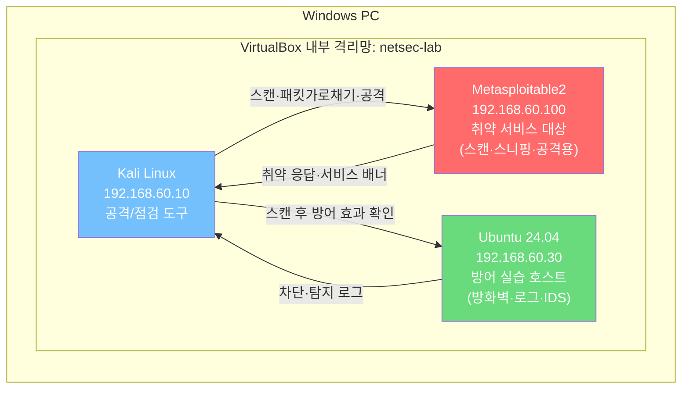

> 이 차시는 모든 실습의 기반입니다.  
> 우리는 VM **3대**를 씁니다. **Kali**(공격/점검), **Metasploitable2**(공격 대상), **Ubuntu**(방어 실습 호스트)입니다.
{: .prompt-info }

> **학습목표**
> 1. 격리된 실습 환경이 왜 필요한지 설명하고 윤리·법적 원칙을 지킬 수 있다.
> 2. VirtualBox에 Kali·Metasploitable2·Ubuntu를 준비하고 같은 사설망으로 연결할 수 있다.
> 3. 상호 통신(ping)으로 실습 환경이 정상인지 확인할 수 있다.
> 4. 자산 식별의 개념을 이해하고 실습 대상의 자산 목록을 작성할 수 있다.
{: .prompt-info }

## 상황

네트워크 보안을 배우려면 두 가지를 모두 해 봐야 합니다.

1. **공격·정찰**: 취약한 서비스를 스캔하고, 패킷을 가로채고, 부하를 걸어 봅니다.
2. **방어·관제**: 방화벽으로 막고, 로그를 보고, IDS로 탐지합니다.

그런데 이 둘을 **한 대의 서버에서** 다 하려면 곤란합니다.
- 공격 실습엔 **취약 서비스가 잔뜩 깔린 대상**이 편하고,
- 방어 실습엔 **systemd·netplan·최신 패키지가 동작하는 현대 OS**가 필요합니다.

그래서 대상 서버를 **두 개**로 나눕니다(이중 타깃).



> **왜 `192.168.60` 대역인가 — 다른 과정과의 주소 분리**
> 이 과정은 방화벽·IDS·스니핑 실습으로 **호스트의 네트워크 설정을 크게 바꾸므로**, 다른 과정의 가상 머신과 주소가 겹치지 않도록 전용 대역을 배정했습니다. 여러 과정의 VM을 같은 PC에 두어도 서로 간섭하지 않습니다.
>
> | 대역 | 과정 |
> |---|---|
> | `192.168.56.0/24` | 리눅스 기초 · 애플리케이션 보안 · 웹 보안 |
> | `192.168.57~59.0/24` | AI 웹보안(랩 / SIEM LAN / SIEM DMZ) |
> | **`192.168.60.0/24`** | **네트워크 보안(이 과정)** |
> | `192.168.61.0/24` | 보안시스템 |
> | `192.168.62.0/24` | DevSecOps |
>
> 모두 VirtualBox가 호스트 전용 네트워크에 허용하는 범위(`192.168.56.0/21`) 안이며, 가정용 공유기가 흔히 쓰는 `192.168.0.x`·`192.168.1.x`를 피했습니다.
{: .prompt-info }

---

## 원리

### 1. 왜 VM을 쓰는가

| 이유 | 설명 |
|---|---|
| 안전성 | 실습 트래픽이 실제 인터넷으로 나가지 않도록 격리할 수 있습니다. |
| 반복성 | 문제가 생기면 스냅샷으로 되돌릴 수 있습니다. |
| 동일성 | 수강생 모두가 같은 IP, 같은 서비스, 같은 도구로 실습합니다. |
| 관찰성 | 공격자 화면과 대상의 로그를 동시에 볼 수 있습니다. |

가상 머신(VM)은 한 대의 물리 컴퓨터 안에서 소프트웨어만으로 흉내 낸 ‘가짜 컴퓨터’입니다. CPU·메모리·디스크·네트워크 카드까지 전부 프로그램으로 모의하기 때문에, 그 안에서 무슨 일이 벌어지든 바깥의 진짜 컴퓨터에는 영향을 주지 않습니다. 이 **격리**가 보안 실습에서 결정적입니다 — 취약한 서버를 일부러 공격하고 악성 도구를 돌려도, 문제가 생기면 VM 하나만 지웠다 다시 만들면 되기 때문입니다. VirtualBox 같은 가상화 소프트웨어를 **하이퍼바이저(Hypervisor)**라 하며, 진짜 하드웨어와 여러 가상 컴퓨터 사이에서 자원을 나눠 쓰도록 중재합니다.

> **반드시 지킬 것 — 인가된 환경에서만** 이 과정의 모든 공격 실습은 본인이 소유한 격리된 가상 실습실 안에서만 수행합니다. 허가 없이 타인의 시스템·네트워크를 스캔·공격하는 것은 정보통신망법 등 법률 위반으로 형사 처벌 대상입니다. 배운 기술은 오직 방어를 이해하고 강화하는 데 사용합니다.
{: .prompt-danger }

### 2. 권장 VM 구성 (3대)

| 항목 | Kali Linux | Metasploitable2 | Ubuntu |
|---|---|---|---|
| 역할 | 공격자/점검자 | **취약 대상** | **방어 호스트** |
| OS | Kali 최신 | (이미 만들어진 취약 VM) | Ubuntu Server 24.04 LTS |
| 준비 방법 | 설치 | **이미지 임포트** (설치 X) | 설치 |
| IP | `192.168.60.10/24` | `192.168.60.100/24` | `192.168.60.30/24` |
| CPU/RAM | 2C / 4GB+ | 1C / 512MB~1GB | 2C / 2~4GB |
| 기본 계정 | kali / kali | **msfadmin / msfadmin** | (설치 시 지정) |

> **Metasploitable2** 는 일부러 취약하게 만들어 배포되는 학습용 VM입니다. OS를 설치하는 게 아니라 **내려받은 이미지를 VirtualBox에 임포트**해서 바로 씁니다. vsftpd·Samba·Apache·MySQL·DVWA 등 취약 서비스가 **이미 떠 있어** 공격·정찰 실습에 바로 쓸 수 있습니다.
{: .prompt-tip }

### 3. 두 대상을 어떻게 나눠 쓰나 (차시별 가이드)

| 대상 | 언제 쓰나 | 해당 차시(예) |
|---|---|---|
| **Metasploitable2 (`.100`)** | 설정 없이 **스캔·스니핑·중간자·부하**를 걸 대상이 필요할 때 | 05 ARP/스니핑, 06 스푸핑/MITM, 08 DoS, 포트 스캔 정찰 |
| **Ubuntu 24.04 (`.30`)** | 대상에서 **직접 방어를 구성·확인**해야 할 때 (방화벽·서비스·로그) | 03 ICMP/UFW, 07 DNS/SNMP 구성, 09 방화벽/ACL, 10 IDS, 12 VPN, 13 NAC |

> 각 차시 첫머리에 **"이번 대상: `.100`/`.30`"** 을 표기합니다. 헷갈리면 이 표로 돌아오세요.
{: .prompt-info }

### 4. 네트워크 모드

VirtualBox는 가상 머신을 바깥과 어떻게 이어 줄지 몇 가지 방식으로 제공하는데, 그 선택이 곧 “실습실이 얼마나 안전하게 격리되는가”를 결정합니다.

| 어댑터 종류 | 통신 범위 | 실습 적합성 |
|---|---|---|
| NAT | VM → 인터넷만 | 표적 격리 안 됨(부적합) |
| 호스트 전용(Host-Only) | VM ↔ VM ↔ 호스트PC | 격리된 실습실(권장) |
| 내부 네트워크(Internal) | VM ↔ VM만 | 가장 강한 격리 |

기본값 NAT는 표적을 바깥과 연결해 두는 셈이라 부적합합니다. 우리가 **Internal Network**를 쓰는 이유는 명확합니다 — 실습 중 발생하는 스캔·공격 트래픽이 바깥 인터넷으로 절대 새어 나가지 못하도록 실습실을 통째로 가두기 위해서입니다.

세 VM 모두 같은 **Internal Network(`netsec-lab`)** 에 둡니다. Kali와 Ubuntu만 패키지 설치를 위해 NAT(인터넷)를 추가로 답니다.

| VM | Adapter 1 | Adapter 2 |
|---|---|---|
| **Kali** | NAT (인터넷, 설치용) | Internal Network `netsec-lab` |
| **Ubuntu** | NAT (인터넷, 설치용) | Internal Network `netsec-lab` |
| **Metasploitable2** | **(없음)** | Internal Network `netsec-lab` |

```text
Attached to : Internal Network
Name        : netsec-lab
```

> **Metasploitable2에는 NAT(인터넷)를 달지 마세요.** 일부러 취약한 VM이라 외부에 노출하면 위험하고, 어차피 옛 우분투라 패키지 저장소도 닫혀 있어 인터넷이 필요 없습니다. **내부망 전용**으로만 둡니다.
{: .prompt-warning }

> 실제 공격 실습은 반드시 Adapter 2의 내부망 IP(`.100`/`.30`)를 대상으로 합니다. NAT 쪽을 스캔하지 않습니다.
{: .prompt-warning }

---

## 공격 (Kali 도구)

이 차시에서는 공격을 하지 않습니다. 앞으로 쓸 Kali 도구의 역할만 정리합니다. 주 대상은 **Metasploitable2(`.100`)** 입니다.

| 목적 | Kali 도구 |
|---|---|
| 대상 발견 | `netdiscover`, `arp-scan`, `fping` |
| 포트 스캔 | `nmap`, `masscan` |
| 패킷 분석 | `wireshark`, `tshark`, `tcpdump` |
| TCP/UDP 테스트 | `hping3`, `nping`, `nc` |
| DNS 분석 | `dig`, `nslookup`, `dnsrecon` |
| SNMP 점검 | `snmpwalk`, `onesixtyone` |
| ARP 실습 | `arping`, `arpspoof`, `ettercap`, `bettercap` |
| 웹 확인 | `curl`, `nikto`, `whatweb` |
| IDS/IPS 실습 | `snort`, `suricata`, `evebox` |
| 무선 실습 | `aircrack-ng`, `airodump-ng`, `aireplay-ng` |
| VPN/암호화 | `openssl`, `ssh`, `openvpn`, `strongswan` |

> **연결 확인** — Kali에서 두 대상이 모두 보이는지 봅니다.
> ```bash
> ping -c 2 192.168.60.100   # Metasploitable2
> ping -c 2 192.168.60.30    # Ubuntu
> ```

---

## 방어 (Ubuntu 호스트)

방어 실습은 **Ubuntu 24.04(`.30`)** 에서 합니다. `systemd`·`netplan`·최신 패키지가 동작해야 하기 때문입니다.

```bash
sudo apt update
sudo apt install -y openssh-server apache2 nginx net-tools tcpdump \
  iproute2 iptables nftables ufw bind9 dnsutils snmpd vsftpd \
  fail2ban auditd rsyslog curl
```

실습용 기본 서비스:

| 서비스 | 목적 |
|---|---|
| SSH | 원격 접속, 로그인 로그 확인 |
| Apache/Nginx | HTTP 패킷, 방화벽, IDS 실습 |
| BIND 또는 dnsmasq | DNS 질의와 DNS 스푸핑 원리 이해 |
| SNMP | 네트워크 관리 프로토콜 이해 |
| vsftpd | TCP 포트와 평문 프로토콜 위험 이해 |
| rsyslog/auditd | 공격 흔적 관찰 |

> **Metasploitable2에는 위 설치가 필요 없습니다.** 취약 서비스가 이미 떠 있고, 저장소가 닫혀 있어 `apt install`도 되지 않습니다. 방어 도구 설치·구성은 전부 Ubuntu에서 합니다.
{: .prompt-tip }

---

## 고정 IP 설정

세 VM 모두 내부망 IP를 고정합니다. **OS마다 방법이 다릅니다.**

### Kali (NetworkManager) — `192.168.60.10`

내부망 인터페이스가 `eth1`이면:

```bash
sudo nmcli con add type ethernet ifname eth1 con-name netsec-lab \
  ipv4.addresses 192.168.60.10/24 ipv4.method manual
sudo nmcli con up netsec-lab
ip addr show eth1
```

### Ubuntu 24.04 (Netplan) — `192.168.60.30`

먼저 Netplan 파일과 인터페이스 이름을 확인합니다.

```bash
ls /etc/netplan/
ip addr
```

내부망 인터페이스가 `enp0s8`이라면 `/etc/netplan/50-cloud-init.yaml`을 편집합니다.

```yaml
network:
  version: 2
  ethernets:
    enp0s8:
      dhcp4: false
      addresses:
        - 192.168.60.30/24
```

적용:

```bash
sudo netplan try
sudo netplan apply
ip addr show enp0s8
```

> `netplan try`는 설정이 잘못돼 네트워크가 끊기면 자동으로 되돌려 주는 안전한 적용 방식입니다.
{: .prompt-tip }

### Metasploitable2 (옛 방식) — `192.168.60.100`

Metasploitable2는 **Ubuntu 8.04 기반의 오래된 시스템**이라 `netplan`·`systemctl`이 없습니다. 옛 방식인 `/etc/network/interfaces`를 씁니다. 로그인은 `msfadmin / msfadmin`.

```bash
sudo nano /etc/network/interfaces
```

내부망 인터페이스(보통 `eth0`)에 고정 IP를 적습니다.

```text
auto eth0
iface eth0 inet static
    address 192.168.60.100
    netmask 255.255.255.0
```

적용은 `systemctl`이 아니라 옛 init 스크립트로 합니다.

```bash
sudo /etc/init.d/networking restart
ifconfig eth0
```

> Metasploitable2에서는 `systemctl`·`netplan`·`apt install`이 동작하지 않습니다. 이 VM은 **건드려서 방어를 설정하는 곳이 아니라, 공격을 받아 주는 대상**으로만 씁니다.
{: .prompt-warning }

### 통신 확인

Kali에서 두 대상이 모두 응답하는지 확인합니다.

```bash
ping -c 4 192.168.60.100   # Metasploitable2 (공격 대상)
ping -c 4 192.168.60.30    # Ubuntu (방어 호스트)
```

---

## 자산 식별 — 무엇을 지킬 것인가

환경을 만들었으면, 본격적인 실습에 앞서 “무엇을 보호(또는 점검)해야 하는가”를 정합니다. 보안에서 **위험(Risk)**은 하나의 요소가 아니라 세 가지가 곱해져 생깁니다.

> **위험(Risk) = 자산(Asset) × 위협(Threat) × 취약점(Vulnerability)**
{: .prompt-warning }

이 셋 중 우리가 직접 통제할 수 있는 유일한 변수가 **취약점**입니다. 위협(해커의 존재)은 없앨 수 없고 자산은 계속 보유해야 하므로, 방어자는 취약점을 찾아 없앰으로써 ‘위험’이라는 곱 전체를 끌어내립니다. 그 출발점이 **자산 식별** — 무엇이 있고, 그중 무엇이 가장 중요한가를 목록으로 만드는 일입니다.

| 자산 유형 | 설명 | 예 |
|---|---|---|
| 하드웨어 | 물리적 장비 | 서버, PC, 라우터·스위치, 방화벽 |
| 소프트웨어 | OS·프로그램 | OS, 웹 애플리케이션, DB, 미들웨어 |
| 데이터 | 보호할 정보 | 고객 정보, 재무 데이터, 로그 |
| 네트워크 | 네트워크 자원 | IP 대역, 서브넷, 도메인, 인증서 |

> **실습 1-1. Metasploitable2 자산 목록 작성하기**  
> **목표** 실습 표적의 자산(OS·서비스·네트워크)을 확인해 목록을 채운다. **대상** Kali → Metasploitable2(192.168.60.100).
{: .prompt-tip }

```bash
nmap -sV 192.168.60.100        # -sV = 서비스·버전 탐지
```

> **왜?** 어떤 소프트웨어 자산(서비스·버전)이 돌고 있는지 알아야 자산 목록을 채울 수 있습니다. 특히 **버전 정보**는 뒤에서 취약점을 찾는 결정적 단서입니다 — ‘FTP가 돈다’보다 ‘그것이 vsftpd 2.3.4’라는 정보가 훨씬 값집니다. 확인된 자산을 유형별로 정리합니다.

```text
네트워크 : 192.168.60.100 (Metasploitable2)
OS       : Linux (Ubuntu 8.04 기반)
서비스   : ftp(vsftpd 2.3.4), ssh, http(Apache), mysql ...
```

> **참고 — 중요도 평가** 자산마다 중요도가 다릅니다. 보통 **기밀성·무결성·가용성(CIA)** 관점에서 “이 자산이 훼손되면 피해가 얼마나 큰가”를 따져, 중요도가 높은 자산부터 먼저·꼼꼼히 점검합니다.
{: .prompt-info }

---

## 기출 연결

실습 환경 자체가 시험에 직접 나오지는 않지만, 아래 개념은 계속 출제됩니다.

| 기출 키워드 | 연결 개념 |
|---|---|
| NIC | VM의 네트워크 어댑터가 NIC 역할을 합니다. |
| MAC 주소 | 각 VM의 가상 NIC에도 MAC 주소가 있습니다. |
| IP 주소 | Kali·대상들이 서로 찾기 위한 논리 주소입니다. |
| NAT | VM이 호스트를 통해 인터넷에 나가는 방식입니다. |
| 내부망 | 외부와 분리된 사설 실습 네트워크입니다. |
| 로그 | 공격 탐지와 사고 대응의 근거입니다. |

> **대상 정리**  
> - 스캔·스니핑·중간자·부하 → **Metasploitable2 `192.168.60.100`**  
> - 방화벽·서비스 구성·로그·IDS → **Ubuntu `192.168.60.30`**  
> 각 차시 첫머리의 "이번 대상" 표기를 확인하세요.
{: .prompt-tip }
