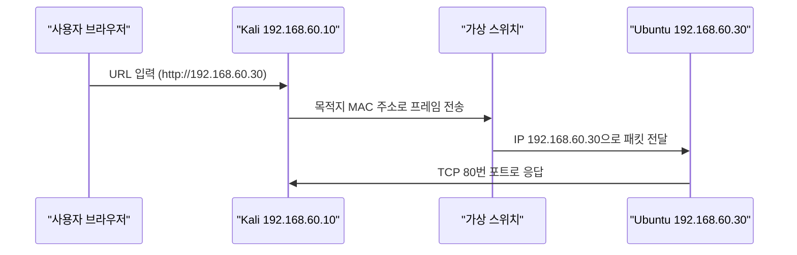
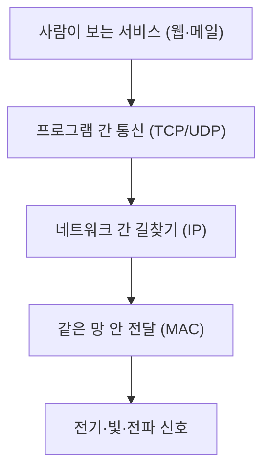
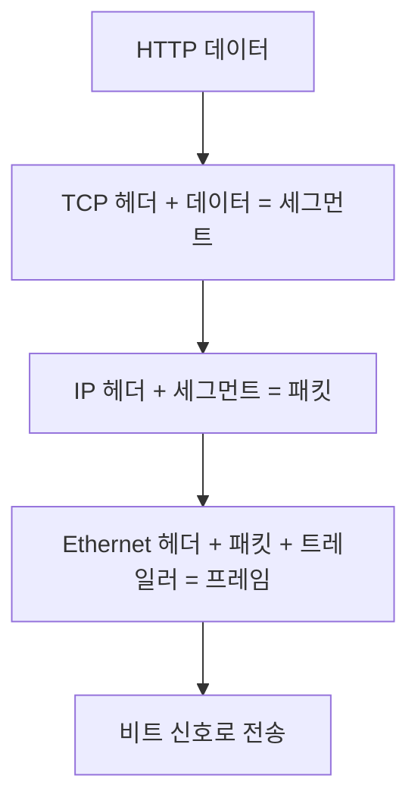

> 이번 차시의 핵심은 "주소가 여러 개 필요한 이유"입니다.  
> 비전공자는 MAC, IP, Port를 한꺼번에 외우려고 하면 어렵습니다. 각각이 맡은 위치를 먼저 보시면 훨씬 쉽습니다.
{: .prompt-info }

> **이번 대상**: Ubuntu `192.168.60.30` (방어 호스트)
{: .prompt-info }

> **학습 목표** — 이 차시를 마치면 다음을 할 수 있습니다.  
> 1. OSI 7계층과 TCP/IP 4계층을 매핑하고, 각 계층의 PDU·주소·장비를 말할 수 있다.  
> 2. MAC·IP·Port가 "왜 셋 다 필요한지"와 "어디서 바뀌는지"를 설명할 수 있다.  
> 3. 캡슐화 과정을 그릴 수 있고, Wireshark/tcpdump로 실제 패킷에서 각 계층을 직접 확인할 수 있다.
{: .prompt-tip }

## 상황

웹 브라우저에서 `http://192.168.60.30`을 입력하면 대상 서버의 웹 페이지가 열립니다. 겉으로는 주소 하나를 입력한 것처럼 보이지만, 실제로는 **서로 다른 세 종류의 주소**(MAC·IP·Port)와 **여러 계층의 규칙**이 동시에 움직입니다.



이 한 줄의 요청 안에서 "누구의 MAC으로 보낼지", "어느 IP로 갈지", "어느 프로그램(Port)이 받을지"가 모두 결정됩니다. 보안의 거의 모든 공격과 방어는 **이 셋 중 하나를 노리거나 지키는 일**입니다.

---

## 원리

### 1. 왜 계층으로 나누는가 — 계층화의 본질

네트워크는 복잡합니다. 케이블의 전기 신호부터 사람이 보는 웹 페이지까지, 한 덩어리로 설계하면 아무도 못 고칩니다. 그래서 **역할을 계층으로 쪼갭니다.**



> 💡 **인사이트** — 계층화의 진짜 이유는 **"교체 가능성"** 입니다. 와이파이로 바꿔도(1·2계층 교체) 위쪽 웹·TCP·IP는 그대로 동작합니다. 각 계층이 **바로 위·아래하고만 약속(인터페이스)** 을 지키면 되기 때문입니다. 이 "모듈성"이 인터넷이 40년 넘게 진화하면서도 안 무너진 비결입니다.
{: .prompt-tip }

### 2. OSI 7계층 — 표준 참조 모델

| 계층 | 이름 | 하는 일 | PDU(데이터 단위) | 주소 | 대표 장비 | 대표 프로토콜 |
|---|---|---|---|---|---|---|
| 7 | 응용 | 사람이 쓰는 서비스 | 데이터(Data) | - | - | HTTP, DNS, FTP, SMTP, SNMP |
| 6 | 표현 | 표현·암호화·압축 | 데이터 | - | - | SSL/TLS, JPEG, ASCII |
| 5 | 세션 | 대화(세션) 유지 | 데이터 | - | - | NetBIOS, RPC |
| 4 | 전송 | 프로그램 간 통신 | **세그먼트**(TCP)/데이터그램(UDP) | **Port** | (L4 방화벽) | TCP, UDP |
| 3 | 네트워크 | **다른** 네트워크로 전달 | **패킷**(Packet) | **IP** | 라우터, L3 스위치 | IP, ICMP, ARP* |
| 2 | 데이터링크 | **같은** 네트워크 안 전달 | **프레임**(Frame) | **MAC** | 스위치, 브리지 | Ethernet, PPP |
| 1 | 물리 | 전기·빛·전파 신호 | 비트(Bit) | - | 허브, 케이블, 리피터 | - |

> ⚠️ ARP는 IP↔MAC를 잇는 프로토콜이라 "2.5계층"으로도 불립니다. 시험에서 ARP를 3계층으로 단정한 보기는 함정인 경우가 많습니다.
{: .prompt-warning }

> 💡 **인사이트** — 계층마다 "주소"가 따로 있다는 점에 주목하세요. **2계층은 MAC, 3계층은 IP, 4계층은 Port**. 보안 장비도 이 구분을 따릅니다. L2 스위치는 MAC만, 라우터/L3 방화벽은 IP까지, L7 방화벽(WAF)은 HTTP 내용까지 봅니다. **"이 장비가 몇 계층을 보는가"** 가 그 장비가 막을 수 있는 공격을 결정합니다(10·09차시 복선).
{: .prompt-tip }

### 3. TCP/IP 4계층 — 실제 인터넷이 쓰는 모델

OSI는 "설명용 표준"이고, 실제 인터넷은 더 단순한 **TCP/IP 4계층**으로 동작합니다. 둘의 매핑은 시험 단골입니다.

| TCP/IP 4계층 | 대응 OSI | 예 |
|---|---|---|
| 응용(Application) | 5·6·7 | HTTP, DNS, TLS |
| 전송(Transport) | 4 | TCP, UDP |
| 인터넷(Internet) | 3 | IP, ICMP |
| 네트워크 접근(Network Access) | 1·2 | Ethernet, Wi-Fi |

> 🤔 **생각해보기** — OSI의 5·6·7계층이 TCP/IP에서는 하나(응용)로 합쳐졌습니다. 왜 실무 모델은 세션·표현을 따로 두지 않았을까요? (힌트: 그 기능들을 누가 담당하게 되었는지 생각해 보세요 — 예: 암호화는 TLS 라이브러리, 세션은 애플리케이션이 직접.)
{: .prompt-info }

### 4. 세 개의 주소 — MAC · IP · Port

| 구분 | 비유 | 길이 | 예시 | 바뀌는가 |
|---|---|---|---|---|
| MAC 주소 | 기기 고유 번호 | **48비트** (6바이트) | `08:00:27:12:34:56` | **구간마다 바뀜** |
| IP 주소 | 집 주소 | **32비트**(IPv4)/128비트(IPv6) | `192.168.60.30` | 최종 목적지까지 유지(보통) |
| Port 번호 | 집 안의 방 번호 | **16비트** (0~65535) | `80`, `22`, `53` | 서비스마다 다름 |

- **MAC 주소**: 앞 24비트는 제조사 식별자(OUI), 뒤 24비트는 일련번호. 같은 LAN 안에서 "다음 장비"를 찾는 데 씁니다.
- **IP 주소**: 네트워크부 + 호스트부로 나뉘어 "어느 네트워크의 어느 호스트"인지를 가리킵니다(03차시 상세).
- **Port 번호**: 같은 IP라도 웹(80)·SSH(22)·DNS(53)를 구분합니다. IP+Port를 합친 것이 **소켓(Socket)** 입니다.

> 💡 **인사이트 — 가장 중요한 한 가지**: 패킷이 라우터를 지날 때마다 **목적지 MAC은 매번 바뀌지만, 목적지 IP는 끝까지 그대로**입니다. 왜냐하면 MAC은 "바로 다음 한 칸"을 가리키고, IP는 "최종 목적지"를 가리키기 때문입니다. 택배로 치면, **송장의 최종 주소(IP)는 안 바뀌지만, 거쳐 가는 물류센터 간 이동표(MAC)는 매 구간 새로 붙는** 것과 같습니다.
{: .prompt-tip }

### 5. 캡슐화와 역캡슐화

데이터는 위 계층에서 아래 계층으로 내려가며 **머리말(헤더)이 한 겹씩 덧씌워집니다.** 이것이 캡슐화입니다.



받는 쪽은 정확히 역순으로 한 겹씩 벗깁니다(역캡슐화). 

> 🤔 **생각해보기** — 공격자가 "출발지 IP를 위조"하는 IP 스푸핑(06차시)은 어느 계층의 헤더를 조작하는 걸까요? 그리고 그게 가능한 이유는, IP 헤더에 출발지를 **검증하는 장치가 없기** 때문입니다. 계층 구조를 알면 "어느 헤더를 건드리는 공격인지"가 한눈에 분류됩니다.
{: .prompt-info }

---

## 공격 (실습) — 패킷에서 세 주소를 직접 확인하기

이론을 실제 패킷으로 확인합니다. **계층이 진짜로 겹겹이 들어 있다**는 것을 눈으로 봅니다.

> **사전 준비**
> - Kali(`192.168.60.10`)와 Ubuntu(`192.168.60.30`)가 같은 내부망에서 ping이 되는 상태(01차시).
> - Ubuntu에서 웹 서비스 실행 중: `sudo systemctl start apache2`
{: .prompt-info }

### STEP 1. 캡처 시작 (Kali)

내부망 인터페이스(예: `eth1`)에서 대상과의 패킷만 잡습니다.

```bash
sudo tcpdump -i eth1 -nn -e host 192.168.60.30
```

- `-nn`: 이름·포트를 숫자 그대로 (DNS 변환 안 함)
- `-e`: **이더넷(2계층) 헤더까지** 표시 → MAC을 보기 위함

### STEP 2. 요청 보내기 (Kali, 다른 터미널)

```bash
curl http://192.168.60.30
```

### STEP 3. 출력에서 세 주소 찾기

```text
10:24:01.123456 08:00:27:aa:aa:aa > 08:00:27:bb:bb:bb, IPv4,
    192.168.60.10.49152 > 192.168.60.30.80: Flags [S], seq 0 ...
    └ 출발 MAC ┘   └ 도착 MAC ┘        └출발IP┘ └포트┘  └도착IP┘ └포트┘
```

| 관찰 항목 | 계층 | 의미 |
|---|---|---|
| `08:00:27:aa…` `> 08:00:27:bb…` | 2계층 | 출발/도착 **MAC** |
| `192.168.60.10` `> 192.168.60.30` | 3계층 | 출발/도착 **IP** |
| `.49152` `> .80` | 4계층 | 출발(임시 포트)/도착 **Port** |
| `Flags [S]` | 4계층 | TCP SYN — 연결 시작(04차시) |

### STEP 4. Wireshark로 계층 펼쳐 보기 (선택)

`sudo wireshark` → `eth1` → 표시 필터 `ip.addr == 192.168.60.30 && tcp.port == 80` → 패킷 클릭 → 상세창에서 `Ethernet II`(MAC) / `Internet Protocol`(IP) / `Transmission Control Protocol`(Port)을 차례로 펼칩니다. **STEP 3의 텍스트가 계층 트리로 보이는 것**을 확인합니다.

> 💡 **인사이트** — 같은 한 패킷을 `tcpdump`는 한 줄로, Wireshark는 계층 트리로 보여 줍니다. **도구가 달라도 패킷은 같습니다.** 분석의 본질은 "이 바이트가 어느 계층의 어느 필드인가"를 아는 것이고, 그 지도는 방금 본 캡슐화 구조입니다.
{: .prompt-tip }

> **문제 해결**
> - 패킷이 안 잡힘 → 인터페이스명 확인(`ip addr`), `host 192.168.60.30` 오타 확인.
> - MAC이 안 보임 → `-e` 옵션 빠짐.
> - `curl` 실패 → Ubuntu에서 `apache2` 실행 여부, 방화벽(`ufw status`) 확인.
{: .prompt-warning }

---

## 방어 — "어느 계층을 막을 것인가"

방어는 결국 **공격이 노리는 계층을 고르는 일**입니다.

| 계층 | 노리는 공격(예) | 방어 |
|---|---|---|
| 2계층 (MAC) | ARP 스푸핑, MAC 플러딩 | 스위치 포트 보안, Dynamic ARP Inspection |
| 3계층 (IP) | IP 스푸핑, ICMP 악용 | 라우터 ACL, uRPF, IP 필터링 |
| 4계층 (Port) | 포트 스캔, SYN Flooding | 방화벽 포트 제어, SYN 쿠키 |
| 7계층 (서비스) | 웹 공격, DNS 스푸핑 | WAF, 프록시, DNSSEC |

> 💡 **인사이트** — "보안 장비 하나로 다 막는다"는 환상을 버려야 합니다. **L4 방화벽은 IP·Port만 보고, 그 안의 HTTP 공격 문자열은 못 봅니다.** 그래서 방화벽 뒤에 IDS/IPS·WAF를 둡니다(09·10차시). 다계층 방어(Defense in Depth)의 출발점이 바로 이 계층 구분입니다.
{: .prompt-tip }

---

## 핵심 정리

| 질문 | 답 |
|---|---|
| 계층을 왜 나누나? | 교체·확장이 쉽도록(모듈성). 각 계층은 위·아래하고만 약속 |
| 세 주소와 길이는? | MAC 48비트 / IP 32비트(v4) / Port 16비트 |
| 라우터를 지나면 뭐가 바뀌나? | **MAC은 매 구간 바뀌고, IP는 끝까지 유지** |
| PDU 이름은? | 4계층 세그먼트 / 3계층 패킷 / 2계층 프레임 / 1계층 비트 |
| 보안 장비의 한계는? | 자기가 보는 계층까지만 막을 수 있음 |

---

## 기출 연결

| 기출 표현 | 정답 판단 기준 |
|---|---|
| 데이터링크 계층 | MAC, 프레임, 스위치, LLC/MAC |
| 네트워크 계층 | IP, ICMP, 라우터, 패킷 |
| 전송 계층 | TCP, UDP, Port, 세그먼트 |
| 표현 계층 | 암호화, 압축, 인코딩 |
| MAC 주소 길이 | **48비트** |
| IPv4 / IPv6 길이 | **32비트 / 128비트** |
| Port 번호 길이 | **16비트** |
| 캡슐화 단위 순서 | 데이터→세그먼트→패킷→프레임→비트 |

> 자주 나오는 함정: **"MAC 주소는 출발지에서 목적지까지 변하지 않는다"** → 틀림. IP는 유지되지만 MAC은 라우터를 지날 때마다 다음 구간의 MAC으로 바뀝니다. (13차시 'PC에서 서버까지' 흐름과 직결)
{: .prompt-warning }

> 🤔 **마무리 생각** — 이번 차시의 세 주소(MAC·IP·Port)는 앞으로 모든 차시의 공격·방어가 결국 "이 셋 중 무엇을 속이거나 지키는가"로 환원된다는 점을 기억하세요. 05 ARP(MAC), 06 스푸핑(MAC·IP·DNS), 04·08(Port·TCP) … 지도를 손에 쥔 셈입니다.
{: .prompt-info }
