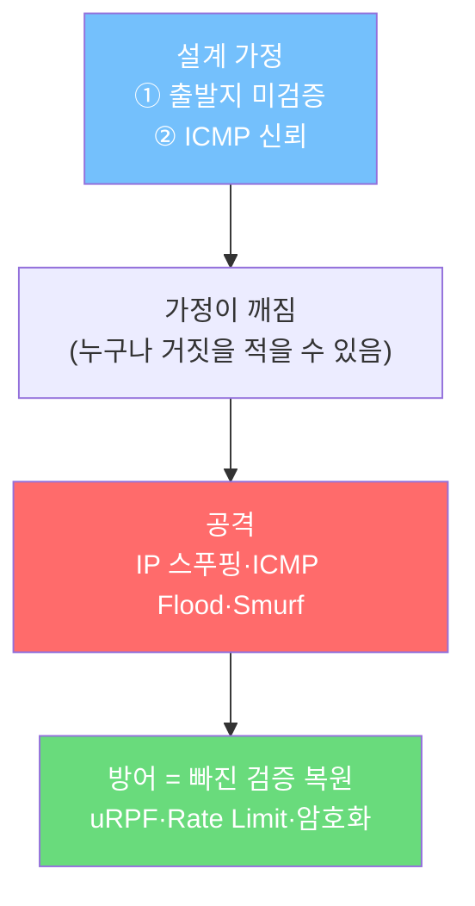

> 이번 차시의 줄거리  
> **IP는 "신뢰"를 전제로 태어났습니다.** "출발지 주소는 솔직하게 적었겠지"라고 믿고 만든 프로토콜이죠. 공격은 바로 그 믿음을 파고듭니다. 우리는 ① IP·ICMP가 왜 이렇게 설계됐는지 → ② 그 설계의 어떤 가정이 깨지는지 → ③ 그래서 어떤 공격이 가능한지 → ④ 그래서 왜 이렇게 방어해야 하는지를 **순서대로** 따라갑니다.
{: .prompt-info }

> **이번 대상**: Ubuntu `192.168.60.30` (방어 호스트)
{: .prompt-info }

> **학습 목표**  
> 1. IP·ICMP의 **설계 의도와 신뢰 가정**을 말할 수 있다.  
> 2. IP 스푸핑·ICMP Flood·Smurf가 "새 취약점"이 아니라 **그 가정의 악용**임을 설명할 수 있다.  
> 3. 각 방어가 **어떤 깨진 가정을 메우는지** 연결해 말할 수 있다.  
> 4. `ping`·`traceroute`·`tcpdump`로 그 원리를 직접 관찰한다.
{: .prompt-tip }

## 상황

1981년, IP를 설계하던 사람들의 세상은 작았습니다. 인터넷에 연결된 컴퓨터는 수백 대뿐이었고, 서로 얼굴을 아는 연구자들의 기계였습니다. 그래서 설계 목표는 단 하나, **"패킷을 목적지 주소까지 빠르게 전달하자"** 였습니다. *"이 패킷의 출발지가 진짜 맞나?"* 를 검사하는 기능은 **굳이 넣지 않았습니다.** 모두가 정직하다고 믿었으니까요.

40년이 지난 지금, 그 "굳이 넣지 않은 검증"이 보안의 거의 모든 빈틈이 되었습니다. 이번 차시의 공격들은 전부 이 한 문장에서 출발합니다:

> **"IP는 출발지 주소를 검증하지 않는다."**

Kali에서 대상에게 `ping`을 보내는 평범한 한 줄에서 시작해 봅시다.

```bash
ping -c 4 192.168.60.30
```

응답이 오면 통신이 되는 것이고, 안 오면 어딘가 막힌 것입니다. 그 "막혔다"를 알려 주는 무전이 바로 ICMP입니다. 이제 이 평범한 장면 뒤에 숨은 설계와 빈틈을 봅니다.

---

## 원리 — 설계된 신뢰: IP·ICMP는 왜 이렇게 동작하는가

### 1. IPv4 — "주소만 보고 전달한다"

IPv4는 **32비트** 주소입니다. 8비트씩 4칸으로 끊어 읽습니다.

```text
192.168.60.30  =  11000000.10101000.00000000.00011110
                 └──────── 32비트 ────────┘
```

| 구분 | 설명 |
|---|---|
| 네트워크부 | "어느 동네인가" |
| 호스트부 | "그 동네의 몇 번 집인가" |
| 서브넷 마스크 | 어디까지가 네트워크부인지 정하는 자(尺) |

`192.168.60.30/24` → 앞 24비트가 네트워크부(마스크 `255.255.255.0`).

라우터는 **오직 목적지 IP만 보고** 다음 길을 정합니다. 출발지 IP는 "응답을 어디로 돌려줄지"에만 쓰일 뿐, **누구도 그게 진짜인지 확인하지 않습니다.** 이 한 줄을 꼭 기억하세요 — 오늘의 모든 공격이 여기서 나옵니다.

> 💡 **인사이트** — 편지를 부칠 때 우체국은 **받는 주소**만 보고 배달합니다. **보내는 주소(반송 주소)** 가 거짓이어도 편지는 갑니다. IP가 정확히 이렇습니다. "보내는 주소를 검증하지 않는다"는 건 버그가 아니라 **속도를 위한 의도된 설계**였고, 그 대가가 IP 스푸핑입니다.
{: .prompt-tip }

#### 사설 IP와 공인 IP

| 구분 | 범위 | 용도 |
|---|---|---|
| 사설 A | `10.0.0.0/8` | 대형 내부망 |
| 사설 B | `172.16.0.0/12` | 중형 내부망 |
| 사설 C | `192.168.0.0/16` | 가정·소규모(우리 실습망) |
| 공인 | 그 외 | 인터넷에서 유일 |

> 우리 실습망 `192.168.60.0/24`가 사설 대역인 건, **인터넷으로 라우팅되지 않아 격리에 안전**하기 때문입니다(01차시 격리 원칙의 기술적 근거).

### 2. 같은 LAN인가 — 마스크로 직접 계산

두 IP가 같은 LAN인지는 **각자 마스크와 AND 연산한 결과**가 같은가로 판단합니다.

```text
192.168.60.30  AND  255.255.255.0  = 192.168.60.0
192.168.60.10  AND  255.255.255.0  = 192.168.60.0   → 같음 → 같은 LAN(스위치로 직접) ✓
192.168.1.10  AND  255.255.255.0  = 192.168.1.0   → 다름 → 게이트웨이(라우터) 필요 ✗
```

> 🤔 **생각해보기** — 같은 LAN이면 MAC(2계층)으로 곧장, 다른 LAN이면 IP(3계층)로 라우터를 거칩니다. 그런데 이 판단을 **보내는 호스트가 출발 전에 스스로** 합니다. 그렇다면 05차시에서 보게 될 ARP 스푸핑이 "같은 LAN 안에서만" 통하는 이유가 짐작되나요? (힌트: 같은 LAN 통신은 MAC에 의존하고, 그 MAC을 알려 주는 게 ARP입니다.)
{: .prompt-info }

### 3. 라우팅과 TTL — 패킷의 여정

라우터는 목적지 IP를 라우팅 테이블과 대조해 다음 홉을 고릅니다.

```bash
ip route
```

```text
default via 192.168.60.1 dev eth0     ← 모르는 목적지는 기본 게이트웨이로
192.168.60.0/24 dev eth0 scope link   ← 이 대역은 직접 연결
```

| 규칙 | 의미 |
|---|---|
| 기본 게이트웨이 | 테이블에 없는 목적지의 출구 |
| Longest Prefix Match | 여러 경로가 맞으면 가장 구체적인(긴) 것 우선 |

여정마다 IP 헤더의 **TTL**이 1씩 줄고, **0이 되면 폐기**됩니다.

> 💡 **인사이트** — TTL이 없으면 라우팅이 꼬였을 때 패킷이 영원히 돌며 망을 마비시킵니다. TTL은 "최대 홉 수" 안전장치인데, 동시에 `traceroute`의 도구가 됩니다(6절). **하나의 안전장치가 진단 도구로도 쓰이는** 좋은 설계입니다.
{: .prompt-tip }

### 4. NAT/PAT — 사설망이 밖으로 나가는 법

사설 IP는 인터넷으로 못 나가므로, **NAT**가 출발지 사설 IP를 공인 IP로 바꿉니다. **PAT**는 공인 IP **하나**를 여러 내부 호스트가 **Port로 구분**해 공유합니다(집 공유기 방식).

| 내부 | 변환 후(공인) |
|---|---|
| 192.168.60.30:5000 | 203.0.113.5:**40001** |
| 192.168.60.31:5000 | 203.0.113.5:**40002** |

> ⚠️ 기출 함정 — PAT는 "well-known 포트만 변환"하는 기술이 **아닙니다.** Port로 여러 연결을 하나의 공인 IP 뒤에서 구분하는 방식입니다.
{: .prompt-warning }

### 5. ICMP — 누구나 믿는 친절한 전령

ICMP는 IP의 **오류·상태를 알리는 전령**입니다. Type/Code로 의미가 정해집니다.

| Type | Code | 메시지 | 의미 |
|---|---|---|---|
| 8 / 0 | 0 | Echo Request / Reply | ping 요청·응답 |
| 3 | 1 | Host Unreachable | 호스트 도달 불가 |
| 3 | 3 | Port Unreachable | 포트 닫힘(04차시 UDP 스캔 핵심) |
| 11 | 0 | Time Exceeded | TTL 0 → 폐기(traceroute 핵심) |
| 5 | - | Redirect | "더 나은 경로가 있어요"(악용 가능) |

> 여기서 두 번째 신뢰 가정이 등장합니다: **"ICMP 메시지는 진실일 것이다."** ICMP에도 인증이 없습니다. 그래서 가짜 Redirect로 경로를 틀거나, 대량의 Echo로 자원을 태우는 공격이 가능해집니다.

### 6. traceroute — TTL을 역이용한 추적

`traceroute`는 TTL을 1, 2, 3…으로 일부러 키워 보내, 각 라우터가 돌려주는 **Time Exceeded(Type 11)** 를 모아 경로를 그립니다.

```bash
traceroute 192.168.60.30
traceroute -I 192.168.60.30   # ICMP 기반 강제
```

> 🤔 **생각해보기** — Linux `traceroute`는 UDP, Windows `tracert`는 ICMP가 기본입니다. 방화벽 정책에 따라 결과가 달라지죠. "같은 추적인데 왜 다른가?"의 답은 **어떤 프로토콜을 막았는가**입니다.
{: .prompt-info }

> **여기까지의 정리 — 깨질 두 개의 가정**  
> ① IP는 **출발지를 검증하지 않는다.**  
> ② ICMP는 **메시지를 믿는다(인증 없음).**  
> 다음 막의 공격들은 전부 이 둘의 직접적인 결과입니다.
{: .prompt-warning }

---

## 공격 — 신뢰를 악용하다: 왜 이 공격이 "되는가"

> 격리망에서 **제한된 개수**만 보내고 관찰합니다. 성능 경쟁이 아닙니다.
{: .prompt-danger }

공격자는 새로운 마법을 부리는 게 아닙니다. 위 두 가정을 **그대로 이용**할 뿐입니다.

| 공격 | 악용한 가정 | 한 줄 원리 |
|---|---|---|
| IP Spoofing | ① 출발지 미검증 | 출발지 IP를 남의 것으로 적는다 |
| ICMP Flood | ② ICMP 신뢰 | Echo를 폭주시켜 자원을 태운다 |
| Smurf | ①+② | 출발지를 피해자로 위조한 ICMP를 **브로드캐스트** → 모두가 피해자에게 응답 |

### 왜 IP 스푸핑이 가능한가

편지의 반송 주소를 거짓으로 쓰는 것과 같습니다. IP 헤더의 출발지 칸은 **보내는 쪽이 자유롭게 적고, 받는 쪽·중간 라우터 누구도 확인하지 않습니다.** 그래서 출발지를 `192.168.60.99`로 위조해도 패킷은 그대로 갑니다 — 응답이 엉뚱한 곳(또는 아무 데도)으로 갈 뿐.

### STEP 1. 대상에서 ICMP 관찰 (Ubuntu)

```bash
sudo tcpdump -i enp0s8 -nn icmp
```

### STEP 2. Kali에서 제한된 ping

```bash
ping -c 3 192.168.60.30
```

`tcpdump`에서 **Echo Request(8) → Echo Reply(0)** 가 쌍으로 오가는지 봅니다.

### STEP 3. 출발지 위조를 눈으로 (시연)

```bash
# -a 로 출발지 IP를 위조(스푸핑) — 격리망에서만!
sudo hping3 --icmp -a 192.168.60.99 -c 3 192.168.60.30
```

Ubuntu의 `tcpdump`에는 출발지가 `192.168.60.99`로 찍히지만, **그 호스트는 존재하지 않을 수도 있습니다.** 대상은 위조된 주소로 응답을 보내고, 진짜 공격자는 숨습니다.

> 💡 **인사이트 — Smurf의 핵심은 "증폭"** — 출발지를 피해자로 위조한 ICMP 한 개를 브로드캐스트로 던지면, 네트워크의 **모든 호스트가 피해자에게** 응답합니다. **작은 입력 → 큰 출력.** 이 "증폭" 패턴은 07차시 DNS, 08차시 DDoS에서 똑같이 반복됩니다. 공격 이름은 달라도 **구조는 같다**는 걸 알아채는 게 이 과정의 목표입니다.
{: .prompt-tip }

> 🤔 **생각해보기** — 만약 IP가 처음부터 출발지를 검증했다면, 위 세 공격은 전부 불가능했을 겁니다. 그런데 왜 지금이라도 "전 세계가 출발지 검증을 켜자"가 안 될까요? (힌트: 인터넷은 수많은 독립 사업자(ISP)의 연합이고, 강제할 중앙 권력이 없습니다. 그래서 **각자**가 경계에서 막는 수밖에 없습니다 — 그게 다음 막의 방어입니다.)
{: .prompt-info }

---

## 방어 — 신뢰를 복원하다: 왜 이렇게 막아야 하는가

공격의 뿌리가 **"검증 없음"** 이었으니, 방어의 본질도 단순합니다: **빠진 검증을 우리 경계에서 되돌리는 것.** 막연히 "방화벽 켜기"가 아니라, **어떤 깨진 가정을 메우는지**로 이해해야 합니다.

| 깨진 가정 | 복원하는 방어 | 어디서 |
|---|---|---|
| 출발지 미검증 | **Ingress Filtering / uRPF** (들어오는 패킷의 출발지가 말이 되는지 검사) | 경계 라우터/ISP |
| ICMP 무제한 신뢰 | **Rate Limit + 선별 허용** | 방화벽 |
| 브로드캐스트 증폭 | **Directed Broadcast 차단** | 라우터 |
| 도청/변조 | **암호화(IPsec·TLS)** — 봐도·바꿔도 소용없게 | 12차시 |

### 왜 ICMP를 "끄지 말고 다스려야" 하는가

가장 흔한 오해: "ICMP를 다 막으면 안전하다." 하지만 ICMP를 통째로 막은 망은 **장애가 나도 원인을 못 찾습니다**(ping·traceroute 불가). 좋은 방어는 *차단*이 아니라 ***가시성 확보 + 비정상만 선별 제한*** 입니다.

### STEP 1. UFW 활성화 (Ubuntu)

```bash
sudo ufw enable
sudo ufw status verbose
```

### STEP 2. 운영 원칙

| 원칙 | 설명 | 메우는 가정 |
|---|---|---|
| 내부 진단용 ICMP 허용 | 운영자가 장애를 찾게 | (가시성 유지) |
| 외부 ICMP 제한 | 정보 노출·Flood 감소 | ② ICMP 신뢰 |
| Rate Limit | 일정량 초과 제한 | ② ICMP 신뢰 |
| 출발지 필터링 | 사설/이상 출발지 차단 | ① 출발지 미검증 |
| 로그 확인 | 차단보다 **이상 패턴 관찰** | (탐지) |

> 💡 **인사이트** — 방어를 "기능 목록"이 아니라 **"어떤 가정을 메우는가"** 로 외우면 잊히지 않습니다. uRPF는 ①을, Rate Limit은 ②를, 암호화는 도청을 메웁니다. 시험에서 "이 공격의 대응으로 옳은 것"을 물으면, **공격이 깬 가정을 떠올리고 → 그걸 복원하는 보기**를 고르면 됩니다.
{: .prompt-tip }

---

## 핵심 정리 — 한 장의 인과 지도



| 질문 | 답 |
|---|---|
| 모든 공격의 뿌리는? | IP는 출발지를, ICMP는 메시지를 **검증하지 않음** |
| IP 스푸핑이 되는 이유? | 출발지 칸을 아무도 확인 안 함 |
| Smurf의 핵심? | 출발지 위조 + 브로드캐스트 **증폭** |
| 방어의 본질? | 빠진 **검증을 경계에서 복원** |
| ICMP를 다 막으면? | 안전이 아니라 **진단 불능** |

---

## 기출 연결

| 기출 키워드 | 기억할 내용 |
|---|---|
| IPv4 / IPv6 | 32비트 / 128비트 |
| ICMP | 오류 보고·진단(Type/Code) |
| Echo Request/Reply | Type 8 / Type 0 |
| Time Exceeded | TTL 초과(Type 11), traceroute |
| Destination Unreachable | Type 3 |
| Smurf | ICMP + 브로드캐스트 + 출발지 위조 |
| NAT / PAT | 사설↔공인 변환 / 포트로 1개 공인IP 공유 |

> 🤔 **마무리 — 이 과정을 관통하는 한 문장**: *"공격은 새 취약점의 발견이 아니라, 오래된 신뢰의 악용이다."* 04(포트)·05(ARP)·06(스푸핑)·07(DNS)·08(DDoS) — 앞으로 만날 거의 모든 공격이 "검증 없는 신뢰"에서 나옵니다. 그래서 방어도 매번 **"무엇을 검증/암호화/격리할 것인가"** 로 귀결됩니다.
{: .prompt-info }
