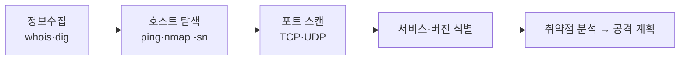

> **학습목표**
> 1. 정보 수집(정찰)이 왜 진단·공격의 첫 단추인지, 수동적·능동적 수집의 차이를 설명할 수 있다.
> 2. 호스트 탐색(Ping 스윕·ARP·Traceroute)의 원리를 이해하고 Nmap으로 실습할 수 있다.
> 3. Whois·dig로 도메인 공개 정보를 수집할 수 있다.
> 4. Nmap의 스캔 기법(SYN·UDP·NULL·FIN·XMAS)을 구분하고 방어할 수 있다.
{: .prompt-info }

> **이번 실습 대상**: Metasploitable2 `192.168.60.100`, 외부 도메인은 조회(정보수집)만. 공격자는 Kali `192.168.60.10`.
{: .prompt-info }

숙련된 침입자일수록 공격 그 자체보다 그 앞의 “살펴보기”에 더 많은 시간을 쏟습니다. 상대를 모르는 채 무작정 도구부터 들이대면, 문이 어디 있는지도 모르고 벽만 두드리는 꼴이 되기 때문입니다. 이 준비 단계가 **정보 수집(정찰)**입니다. 방어자 입장에서는 “우리가 밖에 무엇을 노출하고 있는가”를 똑같은 도구로 확인하는 과정이기도 합니다.



정보 수집은 “멀리서 점점 좁혀 들어가는” **깔때기 구조**입니다. 처음엔 멀찍이서 “어떤 컴퓨터가 켜져 있나(호스트 발견)”를 확인하고, 다음으로 “어떤 문이 열려 있나(포트·서비스)”, 이어서 “어떤 OS인가”로 점점 대상에 밀착합니다.

| 범주 | 수집 내용 | 대표 방법 |
|---|---|---|
| 호스트·네트워크 발견 | 살아 있는 시스템, 네트워크 구조 | Ping 스윕, Traceroute |
| 포트·서비스 식별 | 열린 포트와 구동 중인 서비스 | 포트 스캐닝(Nmap) |
| 운영체제 탐지 | 대상의 OS 종류·버전 | OS 핑거프린팅(Nmap -O) |

정보 수집에는 성격이 전혀 다른 두 방식이 있습니다. **수동적(passive)** 수집은 대상을 직접 건드리지 않습니다(공개된 Whois 열람 등 — 흔적을 남기지 않음). **능동적(active)** 수집은 대상에 직접 패킷을 보내 반응을 살핍니다(호스트 탐색·포트 스캔). 능동적 수집은 상대의 방화벽·IDS에 “누군가 들여다보고 있다”는 기록을 남기므로, 반드시 허가된 대상에서만 수행합니다.

---

# 1부. 호스트 탐색 — 살아 있는 시스템 찾기

한 네트워크에는 수백 개의 IP가 있을 수 있지만 실제로 컴퓨터가 연결된 주소는 몇 개뿐입니다. 256개(`/24`)를 하나하나 정밀 조사하는 것은 낭비이므로, 먼저 “어느 주소에 응답하는 컴퓨터가 있는가”만 빠르게 가려냅니다.

- **Ping 스윕**: `ping`은 대상에게 ICMP Echo 요청(“거기 있니?”)을 보내고, Echo 응답(“응, 있어”)이 오면 살아 있는 것으로 판단합니다. 이를 대역 전체에 던지는 것이 스윕입니다.
- **ARP의 정확성**: 많은 컴퓨터(특히 Windows)는 보안을 위해 ICMP를 무시합니다. 하지만 같은 랜에서는 통신하려면 상대의 MAC이 필요하므로, ARP 질문에는 반드시 답해야 합니다. Nmap은 같은 랜을 스캔할 때 ICMP 대신 ARP를 자동 사용해 더 정확히 찾아냅니다.
- **Traceroute**: 패킷의 수명값(TTL)을 1, 2, 3으로 늘려 보내면 첫 번째·두 번째 라우터가 차례로 “수명이 다했다”는 오류를 되돌려 주어, 대상까지의 경로가 지도처럼 그려집니다.

> **실습 5-1. 실습망의 활성 호스트 찾기**  
> **목표** Nmap으로 `192.168.60.0/24`의 살아 있는 호스트를 찾고, 결과를 파일로 정리해 다음 단계의 대상 목록으로 만든다. **대상** Kali → 실습망.
{: .prompt-tip }

**1단계 — 내 위치 확인** (Kali)

```bash
ip addr show eth0        # inet 192.168.60.10/24 → 스캔 대역은 192.168.60.0/24
```

**2단계 — 기본 Ping 스윕**

```bash
sudo nmap -sn 192.168.60.0/24     # -sn: 포트는 건드리지 않고 "살아 있는가"만 확인
```

> **왜?** `-sn`은 “호스트 탐색만(no port scan)”입니다. 같은 랜에서는 Nmap이 ARP 패킷을 직접 만들어 보내는데, 이런 날것의 패킷을 내보내려면 관리자 권한(`sudo`)이 필요합니다. `Host is up`과 `MAC Address:` 줄이 보이면 그 주소는 살아 있는 것입니다.

**3단계 — 무엇을 보내는지 눈으로 확인**

```bash
sudo nmap -sn -PR 192.168.60.100 --packet-trace   # -PR: ARP 핑, --packet-trace: 패킷 표시
```

> **왜?** 출력에서 `ARP who-has 192.168.60.100 tell 192.168.60.10`(“.100이 누구야? .10이 물음”)과 그 응답을 확인합니다. “스캔이란 결국 패킷을 주고받는 일”임을 눈으로 익히기 위해서입니다.

**4단계 — ICMP가 막힌 호스트까지 놓치지 않기**

```bash
sudo nmap -sn -PE 192.168.60.0/24          # -PE: 표준 ICMP 에코 핑
sudo nmap -sn -PS22,80,443 192.168.60.100  # -PS: 지정 포트로 TCP SYN 핑
```

> **왜?** 방화벽마다 막는 신호가 다르므로, 한 방법이 막히면 다른 방법으로 우회해 확인합니다.

**5단계 — 결과를 파일로 저장해 다음 단계 입력으로**

```bash
sudo nmap -sn 192.168.60.0/24 -oG - | awk '/Up/{print $2}' > live_hosts.txt
cat live_hosts.txt
```

> **왜?** 여기서 찾은 IP 목록이 곧 포트 스캔의 입력이 됩니다. 손으로 옮겨 적는 대신 파일로 넘기면 오타도 줄고 자동화도 쉽습니다.

> **참고 — GUI 도구의 한계** Windows의 Advanced IP Scanner 같은 GUI는 결과만 보여 줄 뿐 “어떤 패킷으로 찾았는지”는 감춥니다. 이 강의가 명령줄 도구를 중심에 두는 까닭은 원리를 눈으로 확인하기 위해서입니다.
{: .prompt-info }

---

# 2부. Whois·DNS 정보 수집 (수동적)

공격 표면은 대상 시스템에만 있지 않습니다. 도메인 이름 하나로도 등록자·네임서버·메일 서버·IP를 공개적으로 얻을 수 있습니다.

## 1. Whois — 도메인 등록 정보

Whois는 원래 문제가 생긴 도메인의 관리자에게 연락하도록 연락처를 공개해 둔 선의의 서비스였습니다. 그러나 공격자에게는 조직의 규모·인프라를 짐작하고 사회공학 표적을 찾는 훌륭한 첫 단서가 됩니다.

```bash
whois google.com                          # 등록자·네임서버·등록/만료일
whois ict.ac.kr                           # .kr 도메인(KISA 관리)
whois google.com | grep "Registrar:"      # 필요한 줄만 추출
```


## 2. DNS 정보 수집 — dig / nslookup / host

DNS는 IP 주소(A)만이 아니라 메일 서버(MX), 네임서버(NS), 정책(TXT) 같은 정보를 함께 담습니다. 레코드 종류를 바꿔가며 조회하면 조직의 웹·메일·DNS 인프라를 한 조각씩 모아 구조도를 그릴 수 있습니다.

| 레코드 | 뜻 | 수집 정보 |
|---|---|---|
| A | 도메인 → IPv4 | 대상 서버 IP |
| MX | 메일 교환 서버 | 메일 인프라 |
| NS | 권한 네임서버 | DNS 인프라 |
| TXT | 텍스트 정책 | SPF·도메인 검증 |

> **실습 5-2. dig로 DNS 레코드 수집**  
> **목표** A·MX·NS·TXT 레코드를 조회하고 역방향 DNS도 확인한다.
{: .prompt-tip }

```bash
dig google.com A          # IPv4 주소
dig google.com MX         # 메일 서버
dig amazon.com NS         # 네임서버
dig ict.ac.kr TXT         # SPF 등 텍스트 정책
dig google.com +short     # 결과만 간결히
dig @8.8.8.8 ict.ac.kr    # 특정 DNS 서버로 질의
dig -x 192.168.60.100      # 역방향(IP → 도메인)
```

> **왜?** TXT의 SPF 레코드는 허용된 발신 메일 서버를 드러냅니다. `+short`는 핵심만, `@`는 질의할 DNS 서버 지정, `-x`는 역방향 조회입니다. 내부망에서는 역방향이 설정돼 있지 않을 수 있습니다.

<div style="display:flex;gap:8px;flex-wrap:wrap">


</div>

<div style="display:flex;gap:8px;flex-wrap:wrap">


</div>

## 3. 서브도메인 열거

조직은 `www` 말고도 `mail`·`dev`·`test`·`admin` 같은 여러 서브도메인을 운영합니다. 문제는 개발·시험용으로 급히 만들었다가 잊혀진 것들입니다 — 관리가 소홀해 낡은 소프트웨어가 남아 있기 쉽고, 공격자에게는 정문 대신 몰래 들어갈 뒷문이 됩니다.

```bash
amass enum -passive -d example.com          # 수동 소스만(더 빠름)
amass enum -d example.com -o subdomains.txt # 결과를 파일로
```

## 4. 서비스·웹 정찰 (능동적)

대상에 직접 붙어 서비스 버전과 노출된 경로를 확인하는 단계입니다.

```bash
nmap -sV -p 80,443,8080 192.168.60.100   # 웹 서비스 버전
nikto -h 192.168.60.100                    # 웹 서버 취약점 스캔
gobuster dir -u http://192.168.60.100 -w /usr/share/wordlists/dirb/common.txt
```

<div style="display:flex;gap:8px;flex-wrap:wrap">


</div>

> **참고** nikto 결과(오래된 Apache/PHP, phpinfo 노출, `X-Frame-Options` 부재, TRACE 활성, 디렉터리 인덱싱, phpMyAdmin 노출)는 방어자에게 그대로 **점검 체크리스트**가 됩니다.
{: .prompt-info }

---

# 3부. Nmap 포트·서비스 스캔 (능동적)

하나의 서버는 IP 하나로 여러 서비스를 제공하는데, 서비스를 구분하는 번호가 **포트**입니다. 한 건물(IP)에 여러 문(포트)이 있고 웹은 80번, 메일은 25번 문으로 드나든다고 생각하면 됩니다. Nmap의 여러 스캔은 결국 이 문들을 하나하나 두드려 보고, **열린 문과 닫힌 문이 서로 다르게 반응한다**는 점을 이용해 상태를 판정합니다.

| 스캔 | 옵션 | 보내는 플래그 | 열린 포트 | 닫힌 포트 |
|---|---|---|---|---|
| Connect | `-sT` | 완전 연결 | 연결 성립 | RST |
| SYN(스텔스) | `-sS` | SYN | SYN/ACK | RST |
| UDP | `-sU` | (UDP) | 무응답/응답 | ICMP 포트 도달 불가 |
| NULL | `-sN` | 없음(0x00) | 무응답 | RST+ACK |
| FIN | `-sF` | FIN | 무응답 | RST+ACK |
| XMAS | `-sX` | FIN,PSH,URG | 무응답 | RST+ACK |

**왜 SYN 스캔이 기본일까?** `-sS`는 SYN을 보내 SYN/ACK(열림) 또는 RST(닫힘)를 확인한 뒤, 마지막 ACK를 보내지 않고 RST로 연결을 끊습니다. 3-way를 완성하지 않아 서버 로그에 “연결”로 남지 않으므로 **하프 오픈 스텔스**라 부릅니다.

## NULL / FIN / XMAS — 비정상 패킷으로 떠보기

세 스캔은 “열린 포트는 무응답, 닫힌 포트는 RST+ACK”라는 RFC 규칙을 이용합니다. Windows처럼 RFC를 엄격히 따르지 않는 OS는 항상 RST로 응답해, 그 자체가 **OS 식별 단서**가 됩니다.

```bash
sudo nmap -sN 192.168.60.100     # NULL: 모든 플래그 0
sudo nmap -sF 192.168.60.100     # FIN: FIN만
sudo nmap -sX 192.168.60.100     # XMAS: FIN+PSH+URG(0x29)
```

<div style="display:flex;gap:8px;flex-wrap:wrap">


</div>

<div style="display:flex;gap:8px;flex-wrap:wrap">


</div>

Wireshark 필터로 각 스캔을 식별합니다: `tcp.flags == 0`(NULL), `tcp.flags == 1`(FIN), `tcp.flags.fin==1 and tcp.flags.push==1 and tcp.flags.urg==1`(XMAS).

## 모순 플래그 스캔 — SYN-FIN / SYN-RST

SYN+FIN, SYN+RST처럼 정상 통신에 없는 조합은 OS마다 응답이 달라 OS 지문 수집에 쓰이고, SYN만 검사하는 방화벽을 우회하기도 합니다.

```bash
sudo hping3 --syn --fin -p 80 -c 5 192.168.60.100   # SYN-FIN(0x03)
sudo hping3 --syn --rst -p 80 -c 5 192.168.60.100   # SYN-RST(0x06)
```

<div style="display:flex;gap:8px;flex-wrap:wrap">


</div>

## UDP 스캔

UDP는 비연결성이라 **닫힌 포트의 ICMP 오류(Type 3/Code 3)** 유무로 상태를 유추합니다. 그래서 TCP 스캔보다 느리고 결과가 모호하며, 그만큼 탐지도 어렵습니다.

```bash
sudo nmap -sU --top-ports 20 192.168.60.100    # 상위 20개 포트(빠름)
sudo nmap -sU -f -f --mtu 8 -p 53,161 192.168.60.100   # 조각화로 IDS 우회
```

주요 UDP 서비스: `53`(DNS), `67/68`(DHCP), `69`(TFTP), `123`(NTP), `161/162`(SNMP). 변형으로 **UDP 핑 스캔**(`-PU`), **Idle 스캔**(제3자 경유로 출발지 은닉), **Fragmented 스캔**이 있습니다.

## 스캔 방어

비정상 플래그 조합을 `iptables`로 차단·로깅하고, ICMP Port Unreachable을 제한해 판단 근거를 없앱니다.

```bash
sudo iptables -A INPUT -p tcp --tcp-flags ALL NONE -j DROP           # NULL
sudo iptables -A INPUT -p tcp --tcp-flags ALL FIN -j DROP            # FIN
sudo iptables -A INPUT -p tcp --tcp-flags ALL FIN,PSH,URG -j DROP    # XMAS
sudo iptables -A INPUT -p udp -m limit --limit 10/s -j ACCEPT        # UDP 속도제한
sudo iptables -A INPUT -p udp -j LOG --log-prefix "[UDP-SCAN] "
sudo sysctl -w net.ipv4.conf.all.rp_filter=1                          # 출발지 위조 방지
```

방어가 적용되면 커널 로그에 탐지 기록이 남고, 공격자 쪽에서는 모든 포트가 `filtered`로 표시됩니다.

<div style="display:flex;gap:8px;flex-wrap:wrap">


</div>

<div style="display:flex;gap:8px;flex-wrap:wrap">


</div>

추가 계층으로 **Port Knocking**(포트 시퀀스 인증), **psad·fail2ban**(스캔 IP 자동 차단)을 씁니다.

> **윤리·법적 유의** Ping 스윕·Nmap 스캔은 대상에 직접 패킷을 보내는 탐지 행위입니다. 내 것이 아닌 네트워크에 스캔을 돌리는 것만으로도 “비인가 접근 시도”로 정보통신망법 위반이 될 수 있습니다. 반드시 본인 소유의 격리 실습망에서만 수행합니다.
{: .prompt-danger }

---

## 기출 연결

| 기출 키워드 | 기억할 내용 |
|---|---|
| 정찰(Reconnaissance) | 공격 전 정보수집, 수동적/능동적 구분 |
| Ping 스윕 / ARP | ICMP로 생존 확인 / 같은 랜에서 더 정확 |
| SYN 스캔(`-sS`) | 하프 오픈 스텔스 |
| NULL/FIN/XMAS | 열린 포트 무응답, 닫힌 포트 RST |
| UDP 스캔 | ICMP Port Unreachable로 상태 유추 |
| Port Knocking / psad | 포트 시퀀스 인증 / 스캔 탐지 |

문제에서 “열린 포트는 응답이 없고 닫힌 포트만 RST를 보낸다”가 나오면 **NULL/FIN/XMAS 스캔**을, “ICMP 도달 불가로 포트 상태를 판단한다”가 나오면 **UDP 스캔**을 떠올리시면 됩니다.
