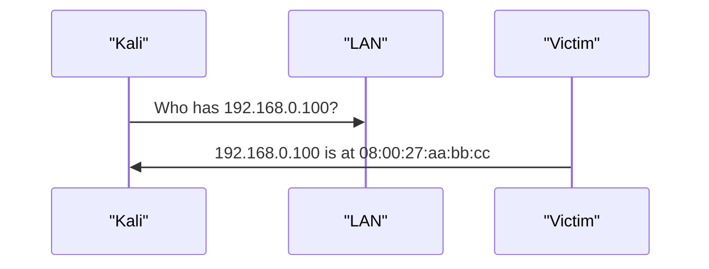

> **학습목표**
> 1. ARP의 동작과, 인증이 없어 생기는 위험을 설명할 수 있다.
> 2. 스니핑의 개념과 도구(Wireshark·tcpdump)를 이해한다.
> 3. ARP 스푸핑이 가능한 이유와 그 결과(중간자)를 설명하고 arpspoof로 관찰할 수 있다.
> 4. MAC 플러딩의 원리와 방어(포트 보안)를 설명할 수 있다.
{: .prompt-info }

> **이번 실습 대상**: Metasploitable2 `192.168.0.100`(telnet·FTP 등 평문 서비스가 있어 스니핑 실습에 적합), 중간자 실습은 피해자 Ubuntu `192.168.0.30`·게이트웨이 `192.168.0.1`.
{: .prompt-info }

ARP는 “이 IP 주소를 가진 장비의 MAC 주소가 무엇입니까?”라고 묻는 단순한 프로토콜입니다. 이 단순한 질문 구조 때문에 스니핑과 스푸핑의 출발점이 됩니다.

## 상황

Kali는 대상의 IP(`192.168.0.100`)를 압니다. 하지만 같은 랜에서 실제 프레임을 보내려면 대상의 **MAC 주소**가 필요합니다. 그래서 ARP를 사용합니다.



---

## 1. ARP 동작과 스니핑

| 단계 | 설명 |
|---|---|
| ARP Request | “이 IP를 가진 사람은 누구입니까?”라고 브로드캐스트합니다. |
| ARP Reply | 해당 장비가 자신의 MAC 주소를 알려줍니다. |
| ARP Cache | 받은 정보를 잠시 저장합니다. |

```bash
ip neigh        # 또는 arp -n : ARP 캐시 확인
```

**스니핑**은 네트워크를 지나는 패킷을 관찰하는 행위입니다. 관리자는 장애 분석·보안 점검에 쓰지만, 공격자는 민감 정보를 훔치기 위해 악용합니다. 도구는 Wireshark(GUI), tcpdump(CLI), tshark(Wireshark의 CLI)를 씁니다.

## 2. ARP 스푸핑 — 가장 고전적인 중간자 공격

문제는 ARP에 **인증이 전혀 없다**는 점입니다. 누군가 “192.168.0.1(게이트웨이)의 MAC은 나야”라는 거짓 응답을 뿌리면, 피해자는 그 말을 그대로 믿고 게이트웨이로 갈 패킷을 공격자에게 보냅니다. 왜 그런 거짓말을 믿을까요? ARP는 **묻지도 않은 응답(Gratuitous ARP)**조차 받아들여 자기 기억(ARP 캐시)을 갱신하도록 만들어졌기 때문입니다. 이렇게 캐시를 오염시키는 것을 ARP 스푸핑(ARP 포이즈닝)이라 합니다.

```text
[정상] 피해자 캐시: 게이트웨이(192.168.0.1) → 게이트웨이 MAC
[공격] 공격자 → 피해자:   "192.168.0.1의 MAC은 나(공격자 MAC)"
       공격자 → 게이트웨이: "192.168.0.30의 MAC은 나(공격자 MAC)"
[결과] 피해자 ↔ 공격자 ↔ 게이트웨이  (모든 패킷이 공격자를 경유)
```

공격자가 피해자와 게이트웨이 양쪽을 동시에 속이면, 두 방향의 모든 트래픽이 공격자를 거쳐 흐릅니다. 이제 공격자는 그 사이에서 내용을 훔쳐보거나(도청), 데이터를 바꿔치기하거나(변조), 아예 흘려보내지 않아 통신을 끊을(DoS) 수도 있습니다. 뒤에 배울 DNS 스푸핑([07장](/posts/networkset-07-spoofing-mitm/))도 결국 이 ARP 스푸핑으로 확보한 “중간 자리”가 있어야 성립합니다.

> **실습 6-1. arpspoof로 트래픽 가로채기**  
> **목표** 피해자의 ARP 캐시를 오염시켜, 트래픽이 공격자(Kali)를 경유하게 만든다. **대상** Kali / 피해자 Ubuntu(192.168.0.30) / 게이트웨이(192.168.0.1).
{: .prompt-tip }

**1단계 — 패킷 포워딩 켜기** (Kali)

```bash
echo 1 > /proc/sys/net/ipv4/ip_forward   # 지나가는 패킷을 원래 목적지로 계속 전달
```

> **왜?** 공격자를 경유한 패킷을 원래 목적지(게이트웨이)로 마저 전달해야 피해자가 “인터넷이 왜 안 되지?” 하고 눈치채지 못합니다. 이 값을 켜지 않으면 도청이 아니라 통신 차단(DoS)이 되어 버립니다.

**2·3단계 — 양쪽 모두 속이기** (터미널 두 개)

```bash
arpspoof -i eth0 -t 192.168.0.30 192.168.0.1    # 피해자에게 "게이트웨이는 나"
arpspoof -i eth0 -t 192.168.0.1 192.168.0.30    # 게이트웨이에게 "피해자는 나"
```

> **왜?** `-t`는 속일 대상, 뒤의 주소는 “사칭할 상대”입니다. 한쪽만 속이면 트래픽의 절반만 가로챕니다. 양쪽을 모두 속여야 완전한 중간자가 되므로 터미널을 하나 더 열어 반대 방향도 실행합니다.

**4단계 — 가로채기 확인**

```bash
# (피해자 Ubuntu에서) 게이트웨이 MAC이 공격자 MAC과 같아졌는지
arp -a
# (Kali에서) 원래라면 볼 수 없던 피해자 트래픽이 잡히는지
wireshark &
```

> **왜?** 피해자의 `arp -a`에서 게이트웨이와 공격자의 MAC이 똑같이 표시되면 캐시가 오염된 것입니다. Kali의 Wireshark에 피해자 통신이 잡히면 중간자 자리가 확보됐다는 증거입니다. 실습을 마치면 두 `arpspoof`를 `Ctrl+C`로 멈춰 통신을 정상으로 되돌립니다.

## 3. MAC 플러딩 — 스위치를 허브로

스위치는 어떤 MAC이 어느 포트에 있는지 **CAM 테이블**로 기억합니다. 공격자가 매 패킷마다 다른 가짜 출발지 MAC을 초당 수천 개씩 보내 CAM 테이블을 가득 채우면, 스위치는 목적지를 찾지 못해 **모든 포트로 브로드캐스트**(허브처럼 동작)하게 되고, 공격자는 다른 장비 간 통신까지 도청할 수 있습니다. **포트 보안**(포트당 허용 MAC 수 제한)으로 완화합니다.

---

## 방어

MITM의 뿌리가 “상대를 확인하지 않는 설계”에 있으니, 방어도 두 갈래입니다. **위조 자체를 어렵게** 만드는 것(정적 ARP, DAI, 포트 보안)과, **가로채여도 내용을 읽지 못하게** 만드는 것(암호화)입니다. 특히 암호화는 오늘날 가장 현실적인 방어입니다 — 통신이 처음부터 암호로 감싸여 있으면 공격자가 중간에 앉아 있어도 손에 쥐는 것은 알아볼 수 없는 데이터뿐이기 때문입니다.

| 방어 | 설명 |
|---|---|
| 암호화(HTTPS·SSH·VPN) | 가로채여도 내용 해석이 어렵습니다. |
| 정적 ARP | 중요 장비의 MAC 매핑을 고정합니다. |
| DAI(Dynamic ARP Inspection) | 스위치가 비정상 ARP 응답을 걸러 냅니다. |
| 포트 보안 | 스위치 포트마다 허용 MAC 수를 제한합니다. |

대상(`192.168.0.100`)의 telnet·FTP·HTTP 같은 평문 서비스는 캡처하면 로그인 정보까지 그대로 보이고, SSH·HTTPS는 암호화되어 내용이 보이지 않습니다. 직접 비교하면 암호화의 효과가 한눈에 들어옵니다.

> **윤리·법적 유의** ARP 스푸핑은 타인의 통신을 가로채는 명백한 침해입니다. 반드시 본인이 구성한 격리 실습망의 가상 피해자(Ubuntu)에게만 수행합니다. 공용 와이파이 등 실제 네트워크에서의 실습은 통신비밀보호법·정보통신망법 위반입니다.
{: .prompt-danger }

---

## 기출 연결

| 기출 키워드 | 기억할 내용 |
|---|---|
| 스니핑 | 네트워크 패킷을 도청하는 행위 |
| 스니핑 방지 | 암호화, 스위칭, 포트 보안 |
| ARP | IP 주소를 MAC 주소로 변환(인증 없음) |
| ARP 스푸핑 | Gratuitous ARP로 캐시 오염 → 중간자 |
| MAC 플러딩 | CAM 테이블 오버플로 → 허브처럼 동작 |
| 포트 보안 / DAI | MAC 수 제한 / 비정상 ARP 차단 |

스니핑 공격기법으로 옳지 않은 것을 고르는 문제에서는 `S/MIME`, `PGP`, `HTTPS`처럼 “암호화·보안 프로토콜”이 보이면 공격기법이 아니라 방어기술일 가능성이 큽니다.
