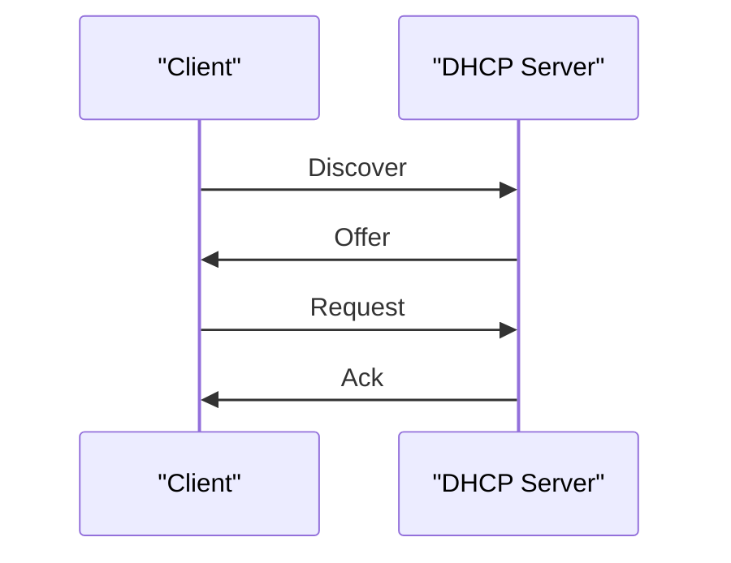

> DNS, DHCP, SNMP는 사용자가 직접 보지는 않지만 네트워크 운영에 매우 중요합니다.  
> 이름을 주소로 바꾸고, 주소를 자동으로 나눠 주고, 장비 상태를 관리합니다.
{: .prompt-info }

> **이번 대상**: Ubuntu `192.168.60.30` (방어 호스트 — DNS·SNMP 서비스를 직접 구성)
{: .prompt-info }

> **학습목표**
> 1. DNS의 계층 구조와 이름 해석(질의) 과정을 설명할 수 있다.
> 2. DNS가 위조에 취약한 이유(평문·무인증)와 캐시 포이즈닝의 원리를 이해한다.
> 3. DNSSEC이 무엇을·어떻게 보호하는지, 그리고 그 한계를 설명할 수 있다.
> 4. DHCP(DORA)·SNMP의 동작과 보안 위험을 설명할 수 있다.
{: .prompt-info }

## 상황

사용자는 `example.com`처럼 이름을 입력합니다. 컴퓨터는 이 이름을 IP 주소로 바꿔야 통신할 수 있습니다. 새로 연결된 노트북은 IP 주소도 자동으로 받아야 합니다. 관리자는 여러 장비가 살아 있는지 확인해야 합니다.

이때 DNS, DHCP, SNMP가 사용됩니다.

---

## 원리

### 1. DNS

DNS는 도메인 이름을 IP 주소로 바꿉니다.

```bash
dig example.com
nslookup example.com
```

| 레코드 | 의미 |
|---|---|
| A | 도메인을 IPv4 주소로 연결 |
| AAAA | 도메인을 IPv6 주소로 연결 |
| CNAME | 별칭 |
| MX | 메일 서버 |
| NS | 네임서버 |
| TXT | SPF, 검증 정보 등 |

**재귀 질의(Recursive Query)** — `www.naver.com`을 입력하면, 로컬 리졸버가 루트 → `.com` TLD → `naver.com` 권한 네임서버 순으로 물어 최종 IP를 찾아 돌려주고, TTL 동안 캐시합니다.


**DNS는 왜 위조에 취약한가** — DNS 질의·응답은 대개 UDP로, 그것도 암호화나 서명 없이 **평문**으로 오갑니다. 게다가 UDP는 연결을 확인하지 않으므로, 공격자가 진짜 서버보다 먼저 그럴듯한 가짜 응답을 보내면 피해자는 그것을 진짜로 믿습니다. 질의와 응답을 짝짓는 유일한 열쇠가 16비트짜리 **Transaction ID**뿐이라, 이 값을 맞히거나 엿보면 위조가 성립합니다. 특히 위험한 것이 **캐시 포이즈닝**입니다 — 재귀 리졸버의 캐시에 가짜 기록을 심으면, 그 리졸버를 쓰는 **모든 사용자**가 한꺼번에 가짜 사이트로 끌려갑니다. 한 번의 오염으로 다수를 동시에 노리는 셈이라 파괴력이 큽니다.

**DNSSEC** — 전통적 DNS는 인증이 없어 스푸핑·캐시 포이즈닝에 취약합니다. DNSSEC는 공개키 서명으로 이를 보완합니다. 핵심은 단순합니다 — DNS 응답에 **전자서명**을 붙여, 받은 쪽이 “이 답이 진짜 권한 서버가 보낸, 변조되지 않은 답인가”를 검증하게 하는 것입니다. 서명은 위조할 수 없으므로 가짜 응답은 검증 단계에서 걸러집니다.

| DNSSEC 레코드 | 역할 |
|---|---|
| DNSKEY | 도메인의 공개키(ZSK·KSK) 저장 |
| RRSIG | 레코드 세트에 대한 서명 |
| DS | 하위 도메인 KSK 해시를 상위에 게시(신뢰 체인) |
| NSEC/NSEC3 | 레코드 부재를 인증된 방식으로 증명 |

루트(.)부터 각 단계가 다음 단계를 인증하는 **신뢰 체인(chain of trust)**을 이루며, 사슬의 어느 한 고리라도 서명이 맞지 않으면 전체 검증이 실패하므로 중간에 끼어든 위조는 반드시 들통납니다.

> **실습 8-1. dig로 DNSSEC 서명 확인하기**  
> **목표** dig로 DNSSEC 서명(RRSIG)과 검증 여부(AD 플래그)를 확인하고, 적용/미적용 도메인을 비교한다. (공개 DNS 조회만 하는 수동적 활동)
{: .prompt-tip }

```bash
dig +dnssec cloudflare.com          # +dnssec: 응답에 RRSIG 서명도 함께
dig +dnssec @1.1.1.1 cloudflare.com # 헤더 flags: 에 ad(Authenticated Data)가 있는지
dig +dnssec example.org             # RRSIG 유무를 앞 결과와 비교
```

> **왜?** `+dnssec`을 붙이면 `RRSIG` 서명이 따라옵니다 — 그 도메인은 DNSSEC이 적용된 것입니다. `ad` 플래그는 검증 리졸버가 “서명을 확인했고 진짜였다”는 표시로, 위조된 응답이면 `ad`가 없거나 `SERVFAIL`이 뜹니다. DNSSEC은 도메인 소유자가 직접 설정해야 작동해, 아직 서명이 없는 도메인도 많습니다.

> **참고 — DNSSEC의 한계** DNSSEC은 응답의 “무결성·출처”만 보장할 뿐 **내용을 암호화하지는 않습니다** — 누가 어떤 도메인을 조회하는지는 여전히 드러납니다(그래서 DoH·DoT 같은 암호화가 별도로 필요). 게다가 아직 상당수 도메인이 미적용이라 검증하고 싶어도 서명이 없는 경우가 많습니다.
{: .prompt-info }

### 2. DHCP

DHCP는 IP 주소를 자동으로 나눠 줍니다.



기출에서는 DORA 순서가 자주 나옵니다.

### 3. SNMP

SNMP는 네트워크 장비의 상태를 조회하고 관리하는 프로토콜입니다.

| 구성요소 | 설명 |
|---|---|
| Manager | 관리 시스템 |
| Agent | 관리 대상 장비 |
| MIB | 관리 정보 구조 |
| Community String | SNMP v1/v2c에서 사용하는 일종의 공유 문자열 |

---

## 공격

### 1. DNS 정보 조회

Kali에서 DNS 질의를 실습합니다.

```bash
dig @192.168.60.30 test.local
```

Victim에서 `test.local` 실습 영역을 만들려면 BIND 설정에 영역을 추가해야 합니다.

```bash
sudo nano /etc/bind/named.conf.local
```

예시:

```conf
zone "test.local" {
    type master;
    file "/etc/bind/db.test.local";
    allow-transfer { 192.168.60.10; };
};
```

영역 파일 예시입니다.

```bash
sudo cp /etc/bind/db.local /etc/bind/db.test.local
sudo nano /etc/bind/db.test.local
```

```dns
$TTL    604800
@       IN      SOA     ns.test.local. admin.test.local. (
                              2
                         604800
                          86400
                        2419200
                         604800 )
@       IN      NS      ns.test.local.
ns      IN      A       192.168.60.30
www     IN      A       192.168.60.30
```

설정을 확인하고 재시작합니다.

```bash
sudo named-checkconf
sudo named-checkzone test.local /etc/bind/db.test.local
sudo systemctl restart bind9
```

존 전송이 잘못 허용된 경우 전체 DNS 정보가 노출될 수 있습니다.

```bash
dig axfr @192.168.60.30 test.local
```

또한 DNS는 **증폭 공격(DRDoS)**의 반사 서버로 악용됩니다. 출발지 IP를 피해자로 위조한 작은 질의에 큰 응답을 되돌리게 만들어(최대 약 54배) 피해자에게 트래픽을 집중시킵니다. 그래서 재귀 질의 제한·응답 크기 제한이 중요합니다(상세는 [09. DoS/DDoS](/posts/networkset-09-dos-ddos/)).


### 2. SNMP 조회

Victim에 SNMP가 열려 있고 community가 `public`으로 설정되어 있으면 정보가 노출될 수 있습니다.

```bash
snmpwalk -v2c -c public 192.168.60.30
```

Ubuntu의 `snmpd`는 기본적으로 로컬 인터페이스에만 바인딩될 수 있습니다. Kali에서 조회하려면 Victim에서 `/etc/snmp/snmpd.conf`를 확인합니다.

```bash
sudo nano /etc/snmp/snmpd.conf
```

실습용 예시는 다음과 같습니다.

```conf
agentaddress udp:161
rocommunity public 192.168.60.10/32
```

적용합니다.

```bash
sudo systemctl restart snmpd
sudo ss -ulpen | grep 161
```

> 운영 환경에서는 `public` community를 사용하지 않습니다. 이 설정은 격리 실습망에서 SNMP 위험을 보여주기 위한 예시입니다.
{: .prompt-warning }

### 3. DHCP 위험

공격자가 가짜 DHCP 서버를 운영하면 잘못된 게이트웨이와 DNS를 배포할 수 있습니다. 이 과정은 실제 네트워크에 영향을 줄 수 있으므로 강의에서는 원리 중심으로 설명하고, 실습은 패킷 흐름 관찰까지만 진행합니다.

---

## 방어

| 대상 | 방어 방법 |
|---|---|
| DNS | Zone Transfer 제한, DNSSEC, 재귀 질의 제한 |
| DHCP | DHCP Snooping, 신뢰 포트 지정 |
| SNMP | SNMPv3 사용, community 변경, 접근 IP 제한 |
| 관리 포트 | 방화벽으로 관리망에서만 접근 허용 |

SNMP 접근을 특정 IP로 제한하는 예시입니다.

```bash
sudo ufw allow from 192.168.60.10 to any port 161 proto udp
sudo ufw deny 161/udp
```

---

## 기출 연결

| 기출 키워드 | 기억할 내용 |
|---|---|
| DNS | 도메인 이름을 IP 주소로 변환 |
| DNS Spoofing | DNS 응답 위조 |
| DHCP | Discover, Offer, Request, Ack |
| SNMP | Manager, Agent, MIB |
| SNMP 보안 | SNMPv3가 인증과 암호화를 지원 |
| Zone Transfer | DNS 영역 정보 노출 위험 |

기출에서 SNMP 설명 중 “TCP를 사용한다”는 표현이 나오면 주의해야 합니다. 일반적인 SNMP는 UDP 161번을 사용합니다.
