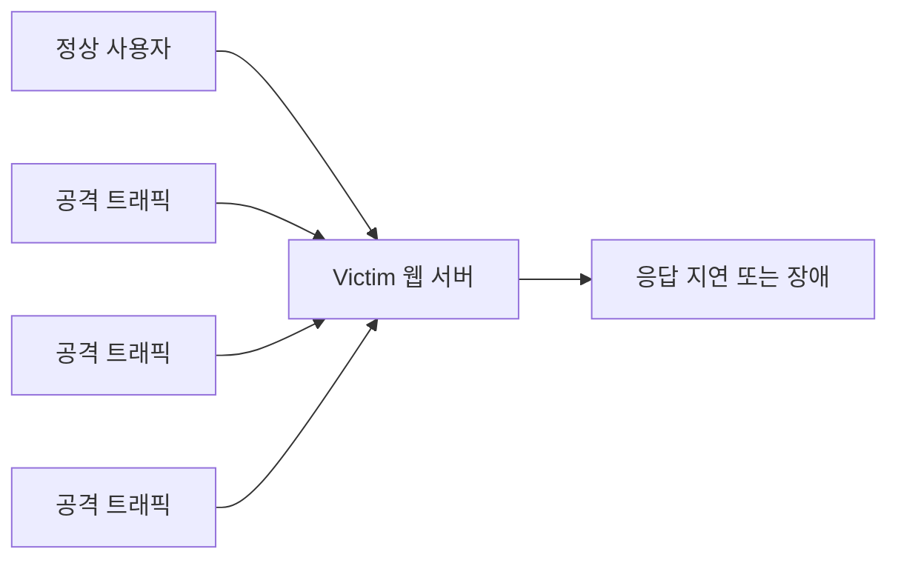

> DoS는 서비스를 못 쓰게 만드는 공격입니다.  
> 중요한 점은 “서버를 뚫는 것”이 아니라 “정상 사용자가 서비스를 이용하지 못하게 하는 것”입니다.
{: .prompt-info }

> **이번 실습 대상**: Metasploitable2 `192.168.0.100` (오래된 취약 서버 — Teardrop·Land 같은 구형 공격이 재현되는 대상)  
> 공격자는 Kali `192.168.0.10`, 인터페이스는 대상에서 `eth0`를 사용합니다.
{: .prompt-info }

> **학습목표**
> 1. DoS와 DDoS의 차이, 그리고 **가용성 침해**의 의미를 설명할 수 있다.
> 2. 고갈 대상(대역폭·연결자원·응용계층)에 따라 공격을 분류할 수 있다.
> 3. SYN·ICMP·Land·Teardrop·DRDoS·Slowloris·Hash DoS의 원리를 설명할 수 있다.
> 4. hping3·slowhttptest로 재현·관찰하고 방어책을 이해한다.
{: .prompt-info }

## 상황

지금까지의 공격이 “몰래 훔치거나 바꾸는” 것이었다면, DoS는 노골적으로 “망가뜨려 못 쓰게 만드는” 공격입니다. 정보를 빼내지도, 권한을 얻지도 않습니다. 오직 서비스를 마비시켜 정상 사용자가 쓰지 못하게 하는 것 하나가 목적입니다 — 보안의 세 기둥(기밀성·무결성·**가용성**) 가운데 **가용성**을 정면으로 무너뜨리는 공격입니다. 모든 서버는 초당 받아들일 수 있는 연결 수·대역폭·메모리에 한계가 있어, 그 한계를 넘는 요청이 한꺼번에 쏟아지면 정상 요청까지 처리하지 못하고 주저앉습니다. 서버가 튼튼하면 공격자 한 대로는 어려우므로, 미리 감염시킨 좀비 PC(봇넷)를 동원해 사방에서 퍼붓는 것이 **DDoS**입니다.



공격은 “어디를 고갈시키는가”에 따라 나눌 수 있습니다. 이 분류를 먼저 잡아두면 개별 공격이 훨씬 쉽게 정리됩니다.

---

## 원리

### 1. DoS와 DDoS

| 구분 | 설명 |
|---|---|
| DoS | 하나 또는 소수의 출발지에서 서비스를 방해합니다. |
| DDoS | 여러 감염 장비(봇넷)가 동시에 공격합니다. |
| DRDoS | 반사·증폭 서버를 경유해 출발지를 숨기고 트래픽을 키웁니다. |

### 2. 고갈 대상에 따른 공격 분류

| 유형 | 고갈시키는 자원 | 대표 공격 |
|---|---|---|
| 대역폭 고갈형 | 네트워크 대역폭 | ICMP Flooding, DRDoS(반사·증폭), UDP Flooding |
| 연결 자원 고갈형 | TCP 연결 테이블(백로그 큐) | SYN Flooding |
| 비정상 패킷형 | 취약한 프로토콜 처리 로직 | Teardrop, Ping of Death, Land |
| 애플리케이션 고갈형 | 웹 서버 연결 풀·CPU | HTTP GET Flooding, Slowloris, Hash DoS |

> 이번 차시는 위 네 가지 범주를 하나씩, **원리 → 공격 명령 → Wireshark 관찰 → 방어** 순서로 살펴봅니다.
{: .prompt-tip }

---

## 공격과 방어

> 이 실습은 공격 성능을 겨루는 실습이 아닙니다.  
> 격리망에서 **제한된 개수**의 패킷을 보내고, Victim의 로그와 패킷 변화를 관찰하는 실습입니다. 실제 서비스나 외부 대상에는 절대 수행하지 않습니다.
{: .prompt-danger }

### A. 연결 자원 고갈형 — SYN Flooding

TCP 연결은 `SYN → SYN-ACK → ACK`의 3-way handshake로 맺어집니다. 서버는 SYN을 받으면 연결 정보를 **백로그 큐**에 저장하고 SYN-ACK를 보낸 뒤 ACK를 기다립니다. 공격자는 응답하지 않는 위조 IP로 SYN만 대량 전송해, 서버를 ACK를 기다리는 **half-open** 상태로 가득 채웁니다. 백로그 큐가 차면 정상 연결 요청이 거부됩니다.


**공격 (Kali)**

```bash
# -S: SYN 플래그, --flood: 최대 속도, --rand-source: 출발지 IP 무작위 위조
sudo hping3 -S --flood -V -p 80 --rand-source 192.168.0.100
# 실습용 제한 버전(권장): 개수를 제한해 관찰
sudo hping3 -S -p 80 -c 50 --rand-source 192.168.0.100
```

**관찰** — Wireshark 필터 `tcp.flags.syn==1 && tcp.flags.ack==0`으로 순수 SYN만 보면 초당 수천 개가 쏟아지는 모습이 보입니다. 표적에서는 반쪽 연결 개수를 셉니다.

```bash
# (Metasploitable2에서) 반쪽 연결(SYN_RECV) 개수 급증 확인
netstat -an | grep SYN_RECV | wc -l
```

> **왜?** `SYN_RECV` 상태의 연결 수가 폭증하면 백로그가 반쪽 연결로 차오르고 있다는 뜻입니다. 이때 다른 정상 클라이언트로 접속을 시도하면 응답이 느려지거나 실패하는 것을 체감할 수 있습니다. 원리를 확인했으면 `Ctrl+C`로 즉시 멈춥니다 — **공격은 짧게, 관찰은 확실히**가 원칙입니다.

| 관찰 포인트 | 의미 |
|---|---|
| 대량의 `[SYN]` 패킷, 출발지 IP 다양 | 위조된 연결 시작 요청 |
| 서버의 `[SYN, ACK]` 응답 | 서버가 연결을 받아들이려 함 |
| `SYN_RECV` 급증, `ACK` 없음 | 연결이 완성되지 않아 큐가 고갈됨 |

**방어 (Metasploitable2)**

```bash
# 1) SYN 쿠키 활성화 — 큐 대신 쿠키로 연결 상태를 검증
sudo sysctl -w net.ipv4.tcp_syncookies=1
# 2) 백로그 큐 확대
sudo sysctl -w net.ipv4.tcp_max_syn_backlog=8192
# 3) SYN-ACK 재전송 횟수 축소(빠른 정리)
sudo sysctl -w net.ipv4.tcp_synack_retries=3
# 4) 방화벽에서 SYN 속도 제한
sudo iptables -A INPUT -p tcp --syn -m limit --limit 1/s --limit-burst 3 -j ACCEPT
sudo iptables -A INPUT -p tcp --syn -j DROP
```

SYN 쿠키는 연결 정보를 큐에 쌓지 않고, SYN-ACK의 시퀀스 번호 안에 상태를 암호화해 담습니다. 정상 클라이언트가 ACK로 돌아오면 그 값으로 연결을 복원하므로, 큐가 없어도 정상 연결을 처리할 수 있습니다.


### B. 대역폭 고갈형 — ICMP Flooding

ICMP는 원래 네트워크 진단용(`ping`)입니다. 대상은 Echo Request를 받으면 Echo Reply로 응답하는데, 공격자가 대용량 ICMP를 대량으로 보내면 대역폭과 시스템 자원이 고갈됩니다.


**공격 (Kali)**

```bash
# 기본 ping flood (-f: 최대 속도, -s: 패킷 크기)
sudo ping -f -s 65500 192.168.0.100
# hping3 ICMP flood (-d: 데이터 크기)
sudo hping3 --icmp --flood -V -d 1400 192.168.0.100
```


**Wireshark 관찰** — 캡처 필터 `icmp and host 192.168.0.100`. 대량의 Echo Request/Reply와 큰 패킷 크기, `Statistics > I/O Graph`의 사용률 급증을 확인합니다.


**방어 (Metasploitable2)**

```bash
# ICMP echo-request 속도 제한 후 초과분 차단
sudo iptables -A INPUT -p icmp --icmp-type echo-request -m limit --limit 1/s --limit-burst 4 -j ACCEPT
sudo iptables -A INPUT -p icmp --icmp-type echo-request -j DROP
# 또는 ICMP 응답 자체를 비활성화
sudo sysctl -w net.ipv4.icmp_echo_ignore_all=1
# 큰 ICMP 패킷 차단
sudo iptables -A INPUT -p icmp --icmp-type echo-request -m length --length 85: -j DROP
```

> **Smurf 공격**도 같은 계열입니다. 출발지 IP를 피해자로 위조한 뒤 브로드캐스트 주소로 ICMP를 보내, 응답하는 모든 호스트의 Reply가 피해자에게 몰리게 만드는 증폭 공격입니다.
{: .prompt-tip }

### C. 대역폭 고갈형 — DRDoS (반사·증폭)

DRDoS(Distributed Reflection DoS)는 **반사 서버(reflector)**를 이용합니다. 출발지 IP를 피해자로 위조한 작은 요청을 DNS·NTP·SSDP 등에 보내면, 반사 서버가 **훨씬 큰 응답**을 피해자에게 보냅니다. 작은 요청으로 큰 응답을 유도하므로 트래픽이 크게 증폭됩니다.


| 프로토콜 | 증폭률(대략) |
|---|---|
| DNS | 최대 54배 |
| NTP | 최대 556.9배 |
| SSDP | 최대 30배 |

**방어**

- **인그레스 필터링 / BCP38(RFC 2827)**: ISP·경계에서 출발지 IP가 위조된 패킷을 차단합니다.
- **응답 속도 제한**: 반사에 악용되는 서비스의 응답 rate limit을 설정합니다.
- **취약 설정 제거**: DNS 재귀 질의 제한·DNSSEC, NTP `monlist` 비활성화(`restrict default noquery`).
- **클라우드 DDoS 방어**: Cloudflare, AWS Shield 등 상위 구간에서 흡수합니다.

```bash
# DNS(53) 응답 속도 제한 예시
sudo iptables -A INPUT -p udp --dport 53 -m limit --limit 100/s --limit-burst 200 -j ACCEPT
sudo iptables -A INPUT -p udp --dport 53 -j DROP
```

### D. 비정상 패킷형 — Teardrop / Ping of Death

IP는 MTU보다 큰 데이터를 여러 **단편(fragment)**으로 나눠 보내고, 수신 측이 오프셋 값으로 재조립합니다. Teardrop은 **오프셋이 서로 겹치는(overlapping)** 단편을 보내 재조립 시 버퍼 오버플로우·커널 패닉을 유발합니다. Ping of Death는 최대 크기(65,535바이트)를 초과하는 ICMP를 단편화해 보내는 유사 공격입니다.


**공격 (Kali)**

```bash
# 최대 크기를 초과하는 조각난 ICMP 전송
sudo hping3 -1 -d 65495 --frag -c 5 192.168.0.100
```

**Wireshark 관찰** — 필터 `ip.flags.mf == 1 or ip.frag_offset > 0`. 동일 ID의 여러 단편, 겹치는 오프셋을 확인합니다.


**방어**

```bash
# 단편화 패킷 차단
sudo iptables -A INPUT -f -j DROP
# 재조립 대기 시간 제한
sudo sysctl -w net.ipv4.ipfrag_time=3
```

> 대부분의 현대 OS는 이 취약점이 패치되어 있습니다. 그래서 실습은 구형인 **Metasploitable2**를 대상으로 재현합니다.
{: .prompt-tip }

### E. 비정상 패킷형 — Land Attack

Land Attack은 **출발지 IP·Port와 목적지 IP·Port를 동일하게** 위조한 패킷을 보냅니다. 취약한 시스템은 자기 자신에게 응답을 보내는 무한 루프에 빠져 CPU가 급증합니다.


**공격 (Kali)**

```bash
# -a: 출발지 IP를 대상과 동일하게, -s/-p: 출발지·목적지 포트 동일
sudo hping3 -S -a 192.168.0.100 -p 80 -s 80 192.168.0.100
```

**Wireshark 관찰** — 필터 `ip.src == ip.dst`. 출발지·목적지가 같은 SYN 패킷을 확인합니다.

**방어**

```bash
# 출발지=목적지 패킷 차단
sudo iptables -A INPUT -p tcp -m tcp --tcp-flags SYN SYN -s 192.168.0.100 -d 192.168.0.100 -j DROP
# 루프백/예약 대역 위조 차단
sudo iptables -A INPUT -p tcp -m tcp --tcp-flags SYN SYN -s 127.0.0.0/8 -j DROP
```

### F. 애플리케이션 고갈형 — HTTP GET Flooding

정상적인 HTTP GET 요청을 대량으로 보내 웹 서버의 CPU·메모리·DB 연결을 고갈시킵니다. 정상 요청처럼 보여 네트워크 계층에서 막기 어렵고, 특히 DB 쿼리가 필요한 동적 페이지를 노리면 효과가 큽니다.


**공격 (Kali)**

```bash
# Apache Benchmark: -n 총 요청 수, -c 동시 연결 수
sudo apt-get install apache2-utils
ab -n 100000 -c 1000 http://192.168.0.100/
```

**방어**

```bash
# 동시 연결 수 제한
sudo iptables -A INPUT -p tcp --dport 80 -m connlimit --connlimit-above 20 -j DROP
# 짧은 시간 반복 요청 차단
sudo iptables -A INPUT -p tcp --dport 80 -m recent --name HTTP --update --seconds 60 --hitcount 50 -j DROP
```

웹 서버 단에서는 `Timeout`·`MaxClients` 조정, `mod_ratelimit` 속도 제한, WAF(ModSecurity), CDN을 통한 부하 분산이 함께 쓰입니다.

### G. 애플리케이션 고갈형 — Slowloris (Slow HTTP)

Slowloris는 반대로 **아주 느리게** 동작합니다. HTTP 헤더를 완성하지 않고 조금씩만 보내(Slow Headers), 서버가 요청 완료를 기다리며 연결 슬롯을 계속 점유하게 만듭니다. 서버 타임아웃보다 짧은 간격으로 부분 데이터를 흘려보내 연결을 유지하므로, **적은 대역폭으로도** 연결 풀을 고갈시킵니다. Slow POST는 `Content-Length`를 크게 잡고 본문을 느리게 보냅니다.


**공격 (Kali)**

```bash
sudo apt install slowhttptest -y
# -c 동시연결, -H 느린 헤더(Slowloris) 모드, -i 10 10초마다 조금씩, -r 200 초당 연결 생성
slowhttptest -c 500 -H -i 10 -r 200 -u http://192.168.0.100/
```

> **왜?** `-H`가 Slowloris 방식(헤더를 찔끔찔끔 보내 연결을 붙잡는 모드)을 지정합니다. 도구 화면의 상태 표시가 **`service available: NO`**로 바뀌고 다른 브라우저의 접속도 느려지거나 실패하면, **적은 대역폭만으로** 서버가 마비됐다는 뜻입니다 — Slowloris의 위력을 직접 확인하는 순간입니다. 확인 후 `Ctrl+C`로 즉시 멈춥니다.

**Wireshark 관찰** — 다수의 미완성 HTTP 요청, 오래 유지되는 ESTABLISHED 연결, 아주 작은 Keep-Alive 패킷을 확인합니다.

**방어** — 연결 타임아웃 최적화가 핵심입니다.

```text
# Apache (/etc/apache2/apache2.conf)
Timeout 10
KeepAliveTimeout 5
# Nginx (/etc/nginx/nginx.conf)
client_header_timeout 10;
client_body_timeout 10;
```

추가로 `mod_reqtimeout`·`mod_qos`(Apache), `HttpLimitReqModule`(Nginx)로 IP당 동시 연결 수를 제한합니다.

### H. 애플리케이션 고갈형 — Hash DoS

웹 프레임워크는 POST 파라미터를 **해시 테이블**로 관리합니다. 공격자가 의도적으로 **같은 해시값을 갖는 키**를 수천 개 담은 POST를 보내면, 해시 충돌로 조회 성능이 `O(1)`에서 `O(n)`으로 떨어져 CPU가 급증합니다. GET은 길이 제한이 있어 문제가 적지만, POST는 파라미터 수 제한이 없어 악용됩니다.


**방어**

```text
# Apache
LimitRequestBody 131072
# PHP (php.ini)
max_input_vars = 1000
max_execution_time = 30
```

프레임워크·언어 차원에서는 충돌 저항이 강한 해시(MurmurHash, SipHash)와 무작위 시드를 사용합니다. 최신 프레임워크는 대부분 기본 방어가 되어 있으므로 **업데이트 유지**가 중요합니다.

---

## 방어 운영 — 긴급 대응 절차

개별 방어 명령보다 중요한 것은 사고 발생 시의 **순서**입니다. 기출에서도 이 흐름이 자주 나옵니다.


| 방어 수단 | 설명 |
|---|---|
| Rate Limiting | 초당 요청 수를 제한합니다. |
| SYN Cookie | SYN Flooding에 대응합니다. |
| 방화벽 ACL | 명확한 악성 출발지를 차단합니다. |
| 인그레스 필터링(BCP38) | 출발지 IP 위조 패킷을 경계에서 차단합니다. |
| DDoS 방어 서비스 | 대용량 트래픽을 상위 구간에서 흡수합니다. |
| 로드밸런싱·CDN | 트래픽을 여러 서버로 분산합니다. |
| 모니터링 | 평소 기준치를 알아야 이상을 탐지할 수 있습니다. |

---

## 기출 연결

| 기출 키워드 | 기억할 내용 |
|---|---|
| DoS / DDoS / DRDoS | 서비스 거부 / 분산 / 반사·증폭 |
| SYN Flooding | TCP 3-way handshake의 half-open 악용, 대응은 SYN 쿠키 |
| Smurf | ICMP, 브로드캐스트, 출발지 IP 스푸핑(증폭) |
| Land | 출발지=목적지 주소·포트로 조작 |
| Ping of Death / Teardrop | 비정상 크기·겹치는 IP 단편 |
| Slowloris | 느린 HTTP로 연결 슬롯 고갈, 대응은 타임아웃 축소 |
| Hash DoS | 해시 충돌로 CPU 고갈, POST 파라미터 수 제한 |
| 긴급 대응 순서 | 모니터링 → 탐지 → 초동 조치 → 차단 → 분석 |

문제에서 “다수의 서버와 PC를 이용해 비정상 트래픽을 유발한다”는 설명이 나오면 **DDoS**를, “출발지를 위조해 반사 서버로 증폭한다”가 나오면 **DRDoS**를 떠올리시면 됩니다.
