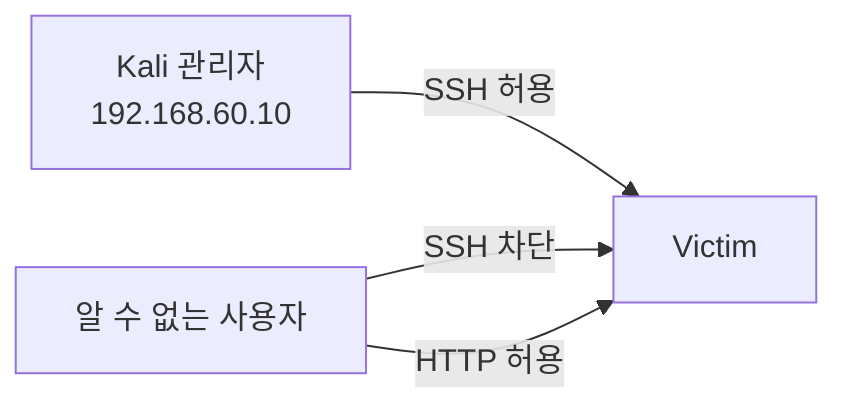
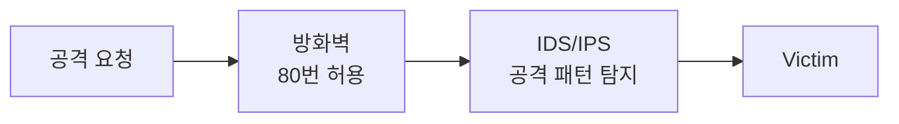

> 방화벽은 “통과시킬지”를 결정하고, IDS/IPS는 “허용된 통신 안에 공격이 숨어 있는지”를 봅니다.  
> 이 둘은 역할이 다르며, 함께 배치해야 방어가 완성됩니다.
{: .prompt-info }

> **이번 대상**: Ubuntu `192.168.60.30` (방어 호스트). 공격자는 Kali `192.168.60.10`.
{: .prompt-info }

---

# 1부. 방화벽과 접근통제

## 상황

Victim VM에서 웹 서비스는 외부에 공개해야 하지만, 관리용 SSH는 관리자 IP에서만 접속하게 하고 싶습니다. 이때 방화벽 정책을 사용합니다.



## 원리

### 1. 방화벽 판단 기준

| 기준 | 예시 |
|---|---|
| 출발지 IP | `192.168.60.10` |
| 목적지 IP | `192.168.60.30` |
| 프로토콜 | TCP, UDP, ICMP |
| 포트 | 22, 80, 443 |
| 연결 상태 | NEW, ESTABLISHED, RELATED |
| 애플리케이션 내용 | HTTP URI, Host Header |

### 2. 방화벽 종류

| 종류 | 설명 |
|---|---|
| Packet Filtering | IP, Port, Protocol 기준으로 허용/차단합니다. |
| Stateful Inspection | 연결 상태 테이블을 보고 판단합니다. |
| Application Proxy | 애플리케이션 중계 방식으로 검사합니다. |
| DPI | 패킷 내용 깊숙이 검사합니다. |
| WAF | 웹 애플리케이션 공격을 탐지·차단합니다. |

## 공격 — 방화벽 정책 확인

공격자는 방화벽 정책을 확인하기 위해 스캔합니다(스캔 기법은 [05. 포트 스캐닝](/posts/networkset-05-scan-recon/) 참고).

```bash
nmap -sS -Pn 192.168.60.30
```

| nmap 결과 | 해석 |
|---|---|
| open | 접근 가능합니다. |
| closed | 포트는 닫혀 있지만 응답은 옵니다. |
| filtered | 방화벽 때문에 판단이 어렵습니다. |

방화벽 실습 전후로 결과를 비교하면, 정책이 `closed`를 `filtered`로 바꾸는 것을 볼 수 있습니다.

## 방어 — 정책 설정

### 1. UFW로 기본 정책 설정

```bash
sudo ufw reset
sudo ufw default deny incoming
sudo ufw default allow outgoing
sudo ufw allow from 192.168.60.10 to any port 22 proto tcp
sudo ufw allow 80/tcp
sudo ufw enable
sudo ufw status verbose
```

### 2. UFW 실습 후 초기화

UFW는 내부적으로 iptables/nftables 규칙을 만듭니다. UFW를 켠 상태에서 직접 iptables 규칙을 추가하면 순서가 복잡해지므로, iptables 실습 전에 UFW를 끄고 초기화합니다.

```bash
sudo ufw disable
sudo ufw reset
```

### 3. iptables로 상태 기반 정책 보기

```bash
sudo iptables -A INPUT -m conntrack --ctstate ESTABLISHED,RELATED -j ACCEPT
sudo iptables -A INPUT -p tcp --dport 80 -j ACCEPT
sudo iptables -A INPUT -p tcp -s 192.168.60.10 --dport 22 -j ACCEPT
sudo iptables -A INPUT -j DROP
```

정책 확인 및 초기화:

```bash
sudo iptables -L -n -v
sudo iptables -F
```

> 앞선 스캔·DoS 차시에서 사용한 `iptables` 방어 규칙(NULL/FIN/XMAS 스캔 차단, SYN 속도 제한 등)이 모두 이 패킷 필터링 방화벽의 응용입니다.
{: .prompt-tip }

---

# 2부. IDS/IPS — 탐지와 차단

## 상황

방화벽은 “허용된 통신인지”를 주로 봅니다. 하지만 80번 포트 HTTP가 허용되어 있어도, 그 안에 공격 문자열이 들어 있을 수 있습니다. IDS/IPS는 이런 공격 흔적을 탐지합니다.



## 원리

### 1. IDS와 IPS

| 구분 | IDS | IPS |
|---|---|---|
| 이름 | Intrusion Detection System | Intrusion Prevention System |
| 역할 | 탐지와 경고 | 탐지와 차단 |
| 위치 | 미러링 구간 가능 | 트래픽 경로 상에 위치 |
| 장점 | 장애 영향이 적음 | 즉시 차단 가능 |
| 단점 | 차단은 별도 조치 필요 | 오탐 시 정상 통신 차단 가능 |

### 2. 탐지 방식

| 방식 | 설명 |
|---|---|
| 오용 탐지 | 알려진 공격 패턴과 비교합니다. |
| 이상 탐지 | 평소와 다른 행위를 탐지합니다. |
| 시그니처 기반 | Snort rule처럼 규칙으로 탐지합니다. |
| 행위 기반 | 트래픽 양, 순서, 빈도 등을 봅니다. |

## 공격 — HTTP에 숨은 문자열

```bash
curl "http://192.168.60.30/?q=normal"
curl "http://192.168.60.30/?q=%3Cscript%3Ealert(1)%3C/script%3E"
```

Victim 또는 별도 센서에서 패킷을 캡처해 공격 문자열이 HTTP 요청 안에 들어 있는지 확인합니다.

```bash
sudo tcpdump -i enp0s8 -nn -A port 80
```

## 방어 — 규칙으로 탐지하기

### 1. Snort rule 구조

```text
alert tcp any any -> 192.168.60.30 80 (msg:"Example XSS"; content:"<script>"; sid:1000001; rev:1;)
```

| 부분 | 의미 |
|---|---|
| alert | 탐지 시 경고 |
| tcp | 프로토콜 |
| any any | 출발지 IP와 포트 |
| `192.168.60.30 80` | 목적지 IP와 포트 |
| msg | 경고 메시지 |
| content | 탐지할 내용 |
| sid / rev | 규칙 ID / 버전 |

### 2. 스캔·DoS 탐지 규칙 예시

앞 차시의 공격들은 대부분 Snort/Suricata 규칙으로도 탐지할 수 있습니다. 방화벽이 “차단”한다면 IDS는 “기록·경고”해 공격 시도 자체를 남깁니다.

```text
# NULL/FIN/XMAS 스캔은 비정상 플래그 조합으로 탐지
alert tcp any any -> $HOME_NET any (msg:"NULL scan"; flags:0; sid:2000001; rev:1;)

# Land 공격 — 출발지=목적지(sameip)
alert tcp $EXTERNAL_NET any -> $HOME_NET any (msg:"LAND attack"; flags:S; sameip; reference:cve,CVE-1999-0016; classtype:attempted-dos; sid:1000;)

# Teardrop — 겹치는 IP 단편
alert ip any any -> $HOME_NET any (msg:"IP Fragmentation Overlap"; fragbits:M; dsize:>800; classtype:bad-unknown; sid:1100; rev:6;)
```

호스트 단에서는 **psad**(포트 스캔 탐지)와 **fail2ban**(반복 시도 IP 자동 차단)을 함께 씁니다.

### 3. Suricata 설치와 실행 예시

```bash
sudo apt install -y suricata
echo 'alert http any any -> 192.168.60.30 any (msg:"NETSEC test script keyword"; content:"<script>"; nocase; sid:1000001; rev:1;)' | sudo tee /etc/suricata/rules/local.rules
```

`suricata.yaml`에 `local.rules`가 로드되는지 확인하고 테스트합니다.

```bash
grep -n "rule-files" -A 20 /etc/suricata/suricata.yaml
sudo suricata -T -c /etc/suricata/suricata.yaml -v
sudo suricata -i enp0s8 -c /etc/suricata/suricata.yaml
```

다른 터미널에서 로그를 확인하고 Kali에서 테스트 요청을 보냅니다.

```bash
sudo tail -f /var/log/suricata/fast.log
curl "http://192.168.60.30/?q=%3Cscript%3Ealert(1)%3C/script%3E"
```

---

## 기출 연결

| 기출 키워드 | 기억할 내용 |
|---|---|
| ACL | 접근통제 목록 |
| Ingress / Egress Filtering | 들어오는 / 나가는 패킷 필터링 |
| Stateful Inspection | 연결 상태 테이블 기반 판단 |
| Application Proxy / DPI | 응용 계층 중계 / 패킷 심층 검사 |
| uRPF | 출발지 IP가 정상 경로로 들어왔는지 확인 |
| IDS / IPS | 탐지 중심 / 탐지 후 차단 |
| 오용 탐지 / 이상 탐지 | 알려진 패턴 / 정상 기준 이탈 |
| Snort rule | alert, protocol, source, destination, msg, content, sid |
| False Positive / Negative | 정상인데 공격으로 / 공격인데 놓침 |

문제에서 “세션 정보를 바탕으로 침입 여부를 판단한다”가 나오면 **Stateful Inspection**을, “침입탐지시스템의 기능으로 옳지 않은 것”이 나오면 데이터 압축 같은 일반 통신 기능이 섞여 있는지 확인하시면 됩니다.
