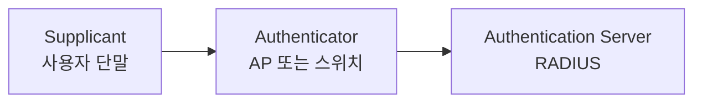
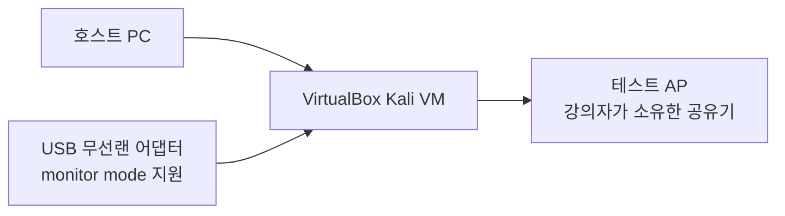

> 무선 LAN은 케이블이 없기 때문에 편리하지만, 전파가 공간으로 퍼집니다.  
> 그래서 인증과 암호화가 유선보다 더 중요합니다.
{: .prompt-info }

## 상황

카페 와이파이에 접속한다고 생각해 보겠습니다. 주변 사람도 같은 전파를 받을 수 있습니다. 암호화가 약하거나 가짜 AP에 접속하면 통신 내용이 노출되거나 조작될 수 있습니다.

---

## 원리

### 1. 무선 LAN(WLAN, Wireless Local Area Network: 무선 근거리 통신망) 기본 용어

| 용어 | 풀이 및 설명 |
|---|---|
| AP | Access Point (무선 접속 장치) |
| SSID | Service Set Identifier (무선 네트워크 식별자 / 이름) |
| BSS | Basic Service Set (하나의 AP 중심 기본 무선 서비스 영역) |
| ESS | Extended Service Set (여러 BSS가 모인 확장 서비스 영역) |
| Ad-hoc | AP 없이 단말끼리 직접 연결하는 임시 네트워크 방식 |

### 2. 보안 방식

| 방식 | 풀이 및 특징 |
|---|---|
| WEP | Wired Equivalent Privacy (유선 동등 프라이버시): 오래된 암호화 방식이며 매우 취약합니다. |
| WPA | Wi-Fi Protected Access (와이파이 보호 접속): WEP의 취약성을 보완하기 위해 임시로 설계되었으며, TKIP 프로토콜을 사용합니다. |
| WPA2 | Wi-Fi Protected Access II: AES 암호화 기반 CCMP 프로토콜을 사용하여 강력한 보안을 제공하며, 현재도 널리 사용됩니다. |
| WPA3 | Wi-Fi Protected Access III: SAE(Simultaneous Authentication of Equals) 기반으로 오프라인 사전 공격 등을 방어하는 최신 보안 표준입니다. |

### 3. 802.1X (포트 기반 네트워크 접근 제어 표준, Port-based Network Access Control) 구조




| 구성요소 | 설명 |
|---|---|
| Supplicant | 네트워크에 접속하려는 단말 |
| Authenticator | 접속을 통제하는 AP 또는 스위치 |
| Authentication Server | 인증을 처리하는 서버, 보통 RADIUS |

---

## 실습 장비 준비

무선 보안 실습은 유선 네트워크 실습과 다릅니다. VirtualBox 안의 Kali VM은 기본적으로 호스트 PC의 내장 무선랜을 `wlan0` 형태로 직접 사용할 수 없습니다. VM에는 보통 가상 유선랜 카드처럼 보이기 때문에 `airmon-ng`, `airodump-ng` 같은 도구가 필요한 무선 프레임을 직접 다루지 못합니다.

따라서 실제 무선 실습을 하려면 **USB 무선랜 어댑터**를 Kali VM에 USB 패스스루로 연결해야 합니다.



### 필수 장비

| 장비 | 왜 필요한가 | 비고 |
|---|---|---|
| USB 무선랜 어댑터 | Kali VM에서 `wlan0`로 인식시키기 위해 필요합니다. | 모니터 모드와 패킷 인젝션 지원 여부 확인 |
| 테스트 AP 또는 여분 공유기 | 허가된 무선망을 만들기 위해 필요합니다. | 강의실 전용 SSID 사용 |
| VirtualBox Extension Pack | USB 2.0/3.0 패스스루 안정성을 위해 필요할 수 있습니다. | 버전은 VirtualBox와 맞춰 설치 |
| 짧은 USB 연장 케이블 | 수신 감도와 VM 인식 문제를 줄이는 데 도움이 됩니다. | 선택 사항 |

### 권장 USB 무선랜 어댑터 후보

아래 표는 강의 장비 선정용 후보입니다. 가격과 재고는 자주 바뀌므로, 구매 전에는 반드시 모델명과 칩셋을 다시 확인합니다.

| 우선순위 | 모델 예시 | 칩셋 | 장점 | 주의 |
|---|---|---|---|---|
| 1 | ALFA AWUS036ACHM | MediaTek MT7610U | 2.4/5GHz, Kali 계열에서 비교적 다루기 쉬운 편입니다. | 국내 재고와 가격 변동이 있습니다. |
| 2 | ALFA AWUS036ACM | MediaTek MT7612U | 2.4/5GHz, 모니터 모드 실습 후보로 많이 사용됩니다. | 판매처에 따라 해외배송일 수 있습니다. |
| 3 | ALFA AWUS036NHA | Atheros AR9271 | 2.4GHz 실습에 안정적인 편으로 알려져 있습니다. | 5GHz 실습은 불가능합니다. |
| 4 | TP-Link Archer T2U Plus | Realtek RTL8812AU/RTL8821AU 계열 | 비교적 저렴하고 구하기 쉬운 편입니다. | Kali 최신 커널에서 별도 드라이버가 필요할 수 있습니다. |

> “모니터 모드 지원”과 “패킷 인젝션 지원”은 같은 말이 아닙니다. 모니터 모드는 무선 프레임을 관찰하는 기능이고, 패킷 인젝션은 무선 프레임을 만들어 보내는 기능입니다.
{: .prompt-warning }

### 구매 가능성 확인 방법

강의 준비 시점에는 다음 검색어로 재고를 확인합니다.

| 확인처 | 검색어 예시 | 확인할 것 |
|---|---|---|
| 다나와 | `AWUS036`, `AWUS036ACHM`, `AWUS036ACM`, `AWUS036NHA` | 국내/해외배송, 가격, 판매처 |
| 쿠팡 | `ALFA AWUS036ACHM`, `ALFA AWUS036ACM` | 도착 예정일, 반품비, 해외배송 여부 |
| 11번가 | `ALFA AWUS036NHA AR9271` | 해외직구 가능 여부 |
| 제조사 | `ALFA Kali Linux Compatible` | 정확한 모델명과 칩셋 |

참고 링크:

- [ALFA Kali Linux Compatible 제품군](https://www.alfa.com.tw/collections/kali-linux-compatible)
- [ALFA AWUS036ACHM 공식 제품 페이지](https://www.alfa.com.tw/products/awus036achm)
- [다나와 AWUS036 통합검색](https://search.danawa.com/dsearch.php?query=AWUS036)

> 구매 판단은 “가장 싸다”보다 “칩셋이 확인된다”, “Kali에서 드라이버가 유지된다”, “수업 당일 교체 장비가 있다”를 우선합니다.
{: .prompt-tip }

### 수업 운영 권장안

| 수업 방식 | 권장 장비 수 |
|---|---|
| 강의자 시연 중심 | USB 무선랜 1개, 테스트 AP 1대 |
| 2~3인 1조 실습 | 조별 USB 무선랜 1개, 조별 또는 공용 테스트 AP |
| 전체 개인 실습 | 수강생별 USB 무선랜 1개, 채널 간섭을 고려한 AP 배치 |

무선 실습은 주변 전파 환경의 영향을 많이 받습니다. 강의실에서는 같은 채널에 AP가 몰리면 캡처 품질이 나빠질 수 있으므로, 테스트 AP의 채널을 1, 6, 11처럼 나누어 배치합니다.

장비가 없는 경우에는 강의자가 미리 캡처한 `.pcapng` 파일을 제공하고, 수강생은 Wireshark에서 SSID, BSSID, 채널, 암호화 방식을 분석하는 방식으로 대체할 수 있습니다.

---

## 공격

무선 실습은 장비와 법적 범위가 특히 중요합니다.

> 무선 도구는 본인이 소유한 테스트 AP에서만 사용합니다.  
> 주변 와이파이 스캔, 인증 해제, 핸드셰이크 수집은 허가 없는 대상에 수행하면 안 됩니다.
{: .prompt-danger }

Kali 도구 예시는 다음과 같습니다.

| 도구 | 용도 |
|---|---|
| `airmon-ng` | 무선 어댑터 모니터 모드 설정 |
| `airodump-ng` | 테스트 AP 관찰 |
| `aireplay-ng` | 패킷 재전송 등 실습 |
| `aircrack-ng` | 캡처 파일 분석 |

### USB 무선랜 인식 확인

Kali VM에서 USB 무선랜이 인식되는지 확인합니다.

```bash
lsusb
ip link
iw dev
```

무선 인터페이스가 `wlan0`로 보이면 다음처럼 모니터 모드를 확인합니다.

```bash
sudo airmon-ng check kill
sudo airmon-ng start wlan0
iw dev
```

`wlan0mon` 또는 유사한 모니터 인터페이스가 생기면 테스트 AP를 관찰합니다.

```bash
sudo airodump-ng wlan0mon
```

실습 종료 후에는 네트워크 서비스를 복구합니다.

```bash
sudo airmon-ng stop wlan0mon
sudo systemctl restart NetworkManager
```

강의에서는 공격 성공보다 다음을 관찰합니다.

| 관찰 | 의미 |
|---|---|
| SSID | 무선망 이름 |
| BSSID | AP의 MAC 주소 |
| Channel | 사용하는 무선 채널 |
| ENC | 암호화 방식 |
| AUTH | 인증 방식 |

---

## 방어

| 방어 | 설명 |
|---|---|
| WPA2/WPA3 사용 | WEP, WPA-TKIP는 사용하지 않습니다. |
| 강한 비밀번호 | 사전 공격에 대비합니다. |
| 802.1X | 개인별 인증을 사용합니다. |
| 게스트망 분리 | 내부망과 손님망을 분리합니다. |
| AP 물리 보안 | AP 도난, 전원 차단, LAN 케이블 탈취를 막습니다. |
| Rogue AP 탐지 | 승인되지 않은 AP를 찾습니다. |

무선 보안은 암호화만이 아닙니다. AP를 누가 설치했고, 누가 접속했고, 내부망과 어떻게 분리되어 있는지도 함께 봐야 합니다.

---

## 기출 연결

| 기출 키워드 | 기억할 내용 |
|---|---|
| WEP | 취약한 구형 무선 보안 |
| WPA | WEP 개선, TKIP |
| WPA2 | AES/CCMP |
| 802.1X | 포트 기반 네트워크 접근제어 |
| RADIUS | 인증 서버 |
| Supplicant | 인증을 요청하는 단말 |
| Authenticator | AP 또는 스위치 |
| 물리적 취약점 | AP 도난, 전원 차단, LAN 차단 |

기출에서 “802.1X 구성요소가 아닌 것”을 묻는 경우 `Key management server` 같은 표현이 함정으로 나올 수 있습니다.
