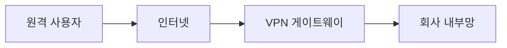
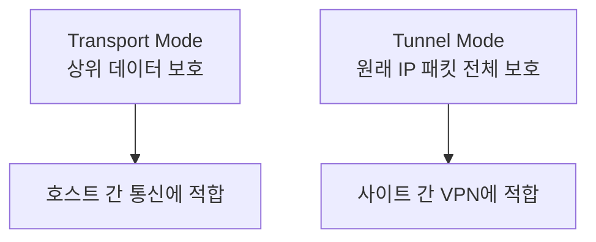

> 암호화는 내용을 숨기고, 인증은 상대를 확인하고, 무결성은 중간 변조를 막습니다.  
> VPN은 이 세 가지를 이용해 안전한 통신 구간을 만드는 기술입니다.
{: .prompt-info }

> **이번 대상**: Ubuntu `192.168.60.30` (방어 호스트)
{: .prompt-info }

## 상황

재택근무자가 회사 내부 시스템에 접속해야 합니다. 인터넷은 누구나 지나는 공용 도로와 같습니다. 그래서 회사는 VPN을 사용해 안전한 터널을 만듭니다.



---

## 원리

### 1. 암호화 통신의 세 가지 목표

| 목표 | 의미 |
|---|---|
| 기밀성 | 중간에서 봐도 내용을 알 수 없게 합니다. |
| 무결성 | 내용이 중간에서 바뀌었는지 확인합니다. |
| 인증 | 통신 상대가 맞는지 확인합니다. |

### 2. 자주 나오는 보안 프로토콜

| 프로토콜 | 주 용도 |
|---|---|
| SSH | 안전한 원격 접속 |
| HTTPS | 웹 통신 암호화 |
| SSL/TLS | HTTPS의 기반 암호화 프로토콜 |
| IPsec | IP 계층 보안, VPN에 사용 |
| S/MIME | 전자메일 보안 |
| PGP | 전자메일과 파일 암호화 |

### 3. IPsec

| 구성 | 설명 |
|---|---|
| AH | 무결성과 인증을 제공합니다. 기밀성은 제공하지 않습니다. |
| ESP | 기밀성, 무결성, 인증을 제공합니다. |
| Transport Mode | 원래 IP 헤더를 유지하고 payload를 보호합니다. |
| Tunnel Mode | 원래 IP 패킷 전체를 새 IP 패킷 안에 넣습니다. |



---

## 공격

암호화가 없으면 스니핑으로 내용이 노출됩니다.

HTTP 요청 관찰:

```bash
sudo tcpdump -i eth1 -nn -A port 80
curl http://192.168.60.30
```

SSH 접속 관찰:

```bash
sudo tcpdump -i eth1 -nn -A port 22
ssh user@192.168.60.30
```

HTTP는 일부 내용이 보일 수 있지만, SSH는 암호화되어 사람이 읽기 어렵습니다.

인증서 정보 확인:

```bash
openssl s_client -connect example.com:443 -servername example.com
```

---

## 방어

| 상황 | 권장 방어 |
|---|---|
| 원격 관리 | Telnet 대신 SSH |
| 웹 서비스 | HTTP 대신 HTTPS |
| 원격근무 | VPN 사용 |
| 메일 보안 | S/MIME 또는 PGP |
| 내부 중요 통신 | mTLS, IPsec, VPN |

실습망에서 SSH 서버를 켜고 접속합니다.

Victim:

```bash
sudo systemctl enable --now ssh
sudo systemctl status ssh
```

Kali:

```bash
ssh user@192.168.60.30
```

OpenVPN이나 strongSwan은 수업 시간에 환경에 따라 시연 중심으로 진행할 수 있습니다. 비전공자 수업에서는 “터널이 어떤 구간을 보호하는가”를 먼저 이해하는 것이 더 중요합니다.

---

## 기출 연결

| 기출 키워드 | 기억할 내용 |
|---|---|
| HTTPS | SSL/TLS 기반 웹 암호화 |
| SSH | 원격 접속 보안 |
| S/MIME | 전자메일 보안 |
| PGP | 전자메일과 파일 암호화 |
| IPsec AH | 인증, 무결성, 재전송 방지 |
| IPsec ESP | 암호화, 인증, 무결성 |
| Tunnel Mode | 원래 IP 패킷 전체를 보호 |
| Transport Mode | 상위 계층 데이터를 주로 보호 |

기출에서 “스니핑 방지대책으로 활용되는 암호화”를 묻는 경우 웹 환경에서는 HTTPS, 원격 접속은 SSH, 메일은 S/MIME/PGP를 연결해서 판단하시면 됩니다.

