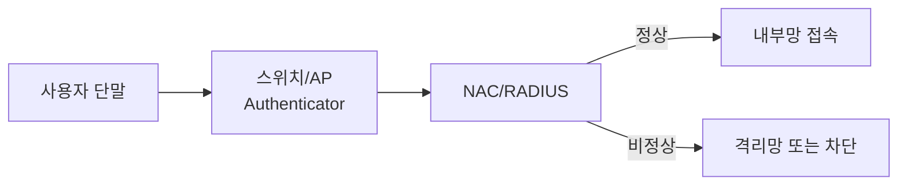

> NAC는 “접속한 뒤 막는 것”이 아니라, “접속하기 전에 점검하고 통제하는 것”에 가깝습니다.  
> UTM은 여러 보안 기능을 하나로 묶은 통합 보안 장비입니다.
{: .prompt-info }

> **이번 대상**: Ubuntu `192.168.0.30` (방어 호스트)
{: .prompt-info }

## 상황

회사에 노트북이 연결됩니다. 이 노트북이 직원 장비인지, 백신이 켜져 있는지, 보안 정책을 만족하는지 확인하지 않고 내부망에 넣으면 위험합니다. 그래서 NAC가 필요합니다.



---

## 원리

### 1. NAC의 역할

| 역할 | 설명 |
|---|---|
| 사용자/단말 인증 | 누가 접속하는지 확인합니다. |
| 보안 상태 점검 | 백신, 패치, 정책 준수 여부를 확인합니다. |
| 접근 권한 부여 | 정상 단말만 내부망에 접근시킵니다. |
| 격리 | 비정상 단말은 격리망으로 보냅니다. |
| 지속 모니터링 | 접속 후 상태 변화도 확인합니다. |

### 2. 802.1X(포트 기반 네트워크 접근 제어 표준, Port-based Network Access Control)와 인증 서버

| 구성요소 | 설명 |
|---|---|
| Supplicant | 접속하려는 사용자 단말 |
| Authenticator | 스위치 또는 AP |
| Authentication Server | RADIUS 서버 |

Kerberos는 중앙 인증 체계로, 티켓 기반 인증을 제공합니다. RADIUS는 네트워크 접근 인증에서 자주 사용됩니다.

### 3. UTM

UTM은 여러 보안 기능을 통합한 장비입니다.

| 기능 | 설명 |
|---|---|
| 방화벽 | IP/Port 기반 접근통제 |
| VPN | 안전한 원격 접속 |
| IDS/IPS | 침입 탐지와 차단 |
| Anti-Virus | 악성코드 검사 |
| Web Filtering | 유해 사이트 차단 |
| Anti-Spam | 스팸 차단 |

---

## 공격

NAC가 없으면 공격자는 내부망에 장비를 연결한 뒤 스캔을 시작할 수 있습니다.

Kali에서 내부망 호스트를 탐색합니다.

```bash
sudo netdiscover -i eth1 -r 192.168.0.0/24
nmap -sn 192.168.0.0/24
```

포트 스캔:

```bash
nmap -sS -sV 192.168.0.30
```

관리자는 이런 행위를 탐지해야 합니다.

---

## 방어

### 1. 운영 관점 대응

| 단계 | 할 일 |
|---|---|
| 예방 | NAC, 최소 권한, 패치, 방화벽 정책 |
| 탐지 | IDS/IPS, 로그, 트래픽 모니터링 |
| 분석 | 출발지, 목적지, 포트, 패턴 확인 |
| 차단 | ACL, 방화벽, 격리망 |
| 복구 | 서비스 정상화, 취약점 제거 |
| 재발 방지 | 룰 개선, 교육, 정책 업데이트 |

### 2. 로그 확인

Victim에서 인증 로그를 확인합니다.

```bash
sudo tail -f /var/log/auth.log
```

Ubuntu 버전이나 rsyslog 설정에 따라 `/var/log/auth.log`가 없을 수 있습니다. 그럴 때는 systemd journal로 SSH 로그를 확인합니다.

```bash
sudo journalctl -u ssh -f
```

웹 로그를 확인합니다.

```bash
sudo tail -f /var/log/apache2/access.log
```

네트워크 연결 상태를 봅니다.

```bash
ss -antp
```

### 3. FreeRADIUS 실습 방향

802.1X 전체 구성은 장비 의존성이 큽니다. 수업에서는 FreeRADIUS를 설치해 인증 서버 개념을 확인하는 수준으로 진행할 수 있습니다.

```bash
sudo apt install -y freeradius freeradius-utils
sudo systemctl status freeradius
```

---

## 기출 연결

| 기출 키워드 | 기억할 내용 |
|---|---|
| NAC | 네트워크 접근제어 |
| 802.1X | 포트 기반 네트워크 접근 제어(Port-based Network Access Control) |
| RADIUS | 인증 서버 |
| Kerberos | 티켓 기반 중앙 인증 |
| UTM | 여러 보안 기능 통합 |
| 보안 운영 | 예방, 탐지, 분석, 차단, 복구 |

기출에서 NAC 설명 중 “공격 패킷의 공통 특성을 분별한다”는 식의 설명은 IDS/IPS 쪽에 가깝습니다. NAC는 주로 접속 단말과 사용자의 접근 권한을 통제합니다.
