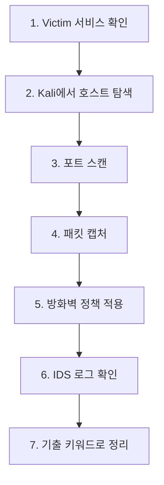

> 마지막 차시는 전체 내용을 기출 풀이 방식으로 다시 연결합니다.  
> 핵심은 용어를 외우는 것이 아니라, 문제의 상황을 보고 어느 계층, 어느 공격, 어느 방어인지 분류하는 것입니다.
{: .prompt-info }

> **이번 대상**: Ubuntu `192.168.60.30` (방어 호스트)
{: .prompt-info }

## 상황

실제 시험에서는 “이 공격은 무엇입니까?”, “이 장비의 기능으로 옳지 않은 것은 무엇입니까?”, “이 상황에서 적절한 방어는 무엇입니까?”처럼 상황을 주고 개념을 고르게 합니다. 따라서 마지막 차시는 문제 문장을 읽고 **어느 계층, 어느 공격, 어느 방어기술인지** 빠르게 분류하는 훈련으로 진행합니다.

---

## 원리: 상황별 판단표

| 문제 상황 | 먼저 떠올릴 개념 |
|---|---|
| MAC 주소, 프레임, 스위치 | 데이터링크 계층 |
| IP 주소, 라우터, ICMP | 네트워크 계층 |
| TCP, UDP, Port | 전송 계층 |
| DNS, HTTP, SNMP | 응용 계층 |
| 패킷을 엿봄 | 스니핑 |
| 주소나 이름을 속임 | 스푸핑 |
| 서비스를 못 쓰게 함 | DoS/DDoS |
| 허용/차단 정책 | 방화벽, ACL |
| 공격 탐지 | IDS |
| 공격 차단 | IPS |
| 접속 전 인증과 검사 | NAC |
| 안전한 터널 | VPN |

---

## 공격: 공격과 방어 연결

| 공격 | 핵심 원리 | 대표 방어 |
|---|---|---|
| Sniffing | 패킷 도청 | 암호화, 스위치 보안 |
| ARP Spoofing | IP-MAC 매핑 위조 | ARP Inspection, 정적 ARP |
| DNS Spoofing | 도메인 응답 위조 | DNSSEC, HTTPS |
| IP Spoofing | 출발지 IP 위조 | uRPF, Ingress/Egress Filtering |
| SYN Flooding | 반쯤 열린 TCP 연결 남발 | SYN Cookie, Rate Limit |
| Smurf | ICMP 브로드캐스트 악용 | Directed Broadcast 차단 |
| Port Scan | 열린 서비스 탐색 | 방화벽, IDS, 불필요 서비스 제거 |
| 무선 도청 | 전파 노출 | WPA2/WPA3, 802.1X |

---

## 방어: 기출 함정 정리

| 함정 표현 | 왜 틀릴 수 있는가 |
|---|---|
| MAC 주소는 출발지에서 목적지까지 변하지 않는다 | 라우터를 지날 때 구간별 MAC 주소는 바뀝니다. |
| UDP는 신뢰성 있는 연결을 제공한다 | UDP는 비연결형입니다. |
| SNMP는 TCP 기반이다 | 일반적인 SNMP는 UDP 161번입니다. |
| PAT는 well-known port만 변환한다 | PAT는 포트 번호로 여러 내부 연결을 구분합니다. |
| AH는 암호화를 제공한다 | AH는 인증과 무결성 중심이며 기밀성은 ESP가 담당합니다. |
| IDS는 공격을 차단한다 | IDS는 탐지 중심입니다. 차단은 IPS입니다. |
| NAC는 공격 패턴을 탐지한다 | NAC는 접속 단말의 접근을 통제합니다. |
| WEP은 안전한 무선 보안이다 | WEP은 취약한 구형 방식입니다. |

---

## 실습: 종합 시나리오

아래 순서로 종합 실습을 진행합니다.



### 1. Victim 서비스 확인

Victim:

```bash
ss -tulpen
sudo systemctl status apache2
sudo tail -f /var/log/apache2/access.log
```

### 2. Kali에서 호스트 탐색

```bash
nmap -sn 192.168.60.0/24
```

### 3. 포트 스캔

```bash
nmap -sS -sV 192.168.60.30
```

### 4. 패킷 캡처

```bash
sudo tcpdump -i eth1 -nn host 192.168.60.30
```

### 5. 방화벽 정책 적용

Victim:

```bash
sudo ufw default deny incoming
sudo ufw allow from 192.168.60.10 to any port 22 proto tcp
sudo ufw allow 80/tcp
sudo ufw enable
```

### 6. 다시 스캔하고 차이 확인

Kali:

```bash
nmap -sS -sV 192.168.60.30
```

### 7. 결과 해석

| 관찰 결과 | 해석 |
|---|---|
| 포트가 줄었습니다 | 방화벽 또는 서비스 중지 효과입니다. |
| `filtered`가 보입니다 | 방화벽이 응답을 제한할 수 있습니다. |
| 웹 로그에 요청이 남습니다 | 애플리케이션 접근 흔적입니다. |
| 인증 로그에 SSH 시도가 남습니다 | 원격 접속 흔적입니다. |

---

## 기출 연결: 시험 풀이 순서

문제를 만나면 다음 순서로 풉니다.

1. 문제의 주체가 무엇인지 봅니다.  
   예: 라우터, 스위치, AP, 방화벽, IDS, VPN

2. 어느 계층 이야기인지 봅니다.  
   예: MAC이면 2계층, IP면 3계층, Port면 4계층

3. 공격인지 방어인지 구분합니다.  
   예: 스푸핑은 공격, 암호화는 방어

4. 기능을 바꿔 말한 함정을 찾습니다.  
   예: IDS와 IPS, AH와 ESP, TCP와 UDP

5. 최신 기술명보다 기본 원리를 우선합니다.  
   문제는 대부분 이름보다 역할을 묻습니다.

---

## 마지막 요약

네트워크 보안은 다음 한 문장으로 정리할 수 있습니다.

> 네트워크 보안은 패킷이 지나가는 길에서 **누가 보낼 수 있는지, 무엇을 보냈는지, 중간에 바뀌지 않았는지, 이상한 흐름은 없는지**를 확인하고 통제하는 일입니다.
{: .prompt-tip }

이 관점만 잡으면 MAC, IP, TCP, DNS, 방화벽, IDS, VPN, NAC가 따로 떨어진 암기 단어가 아니라 하나의 흐름으로 보입니다.
