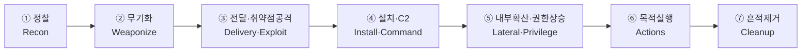
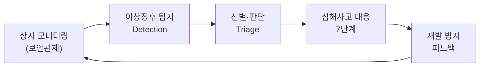
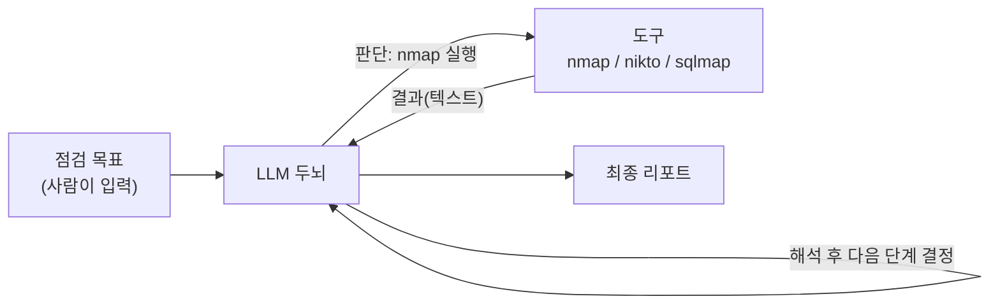
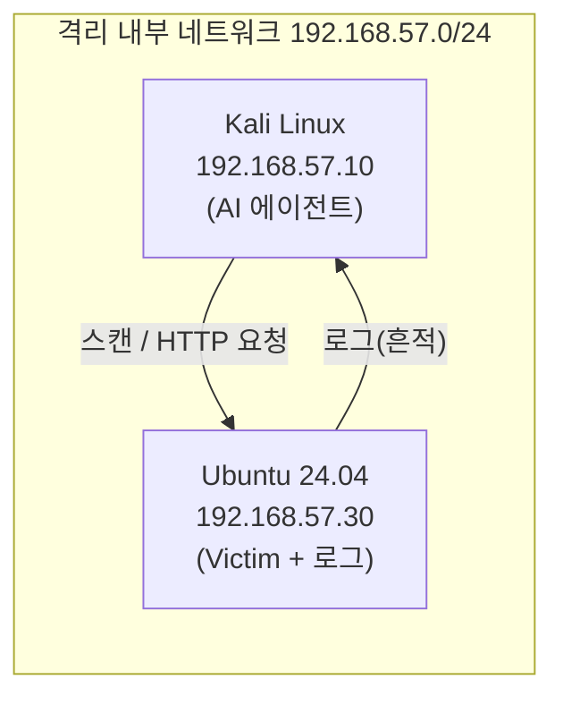

# 취약점 점검에서 자동화된 보안관제까지 — 시리즈를 시작하며

이 시리즈는 하나의 질문에서 출발합니다.

> **"공격자가 AI로 무장한 시대에, 방어자는 무엇을 할 수 있는가?"**

이 질문에 답하기 위해 우리는 한 편의 긴 이야기를 함께 만들어 갑니다. 작은 부품 하나에서 출발해, 매 강의마다 "이전에 만든 것 + 새 부품 하나"를 더해 가며, 마지막에는 **스스로 점검하고, 공격의 흔적을 탐지하며, 사고에 대응하는 — 자동화된 보안관제센터(SOC: Security Operations Center)의 축소판**까지 도달하는 것이 목표입니다.

> **🎯 이 시리즈의 도착점을 먼저 말씀드립니다.**  
> 많은 강의가 "취약점을 찾는 도구"에서 끝납니다. 하지만 실무에서 취약점 점검은 **시작**일 뿐입니다. 진짜 중요한 것은 *공격을 자동으로 탐지하고(Detection), 사고가 나면 정해진 절차로 대응하며(Incident Response), 이 모든 것을 24시간 쉬지 않고 감시하는(Security Operations)* 체계입니다. 그래서 이 시리즈는 "취약점 자동 점검"에서 출발하지만, **"자동화된 보안관제"**라는 더 큰 그림으로 여러분을 안내합니다.
{: .prompt-info }

이 글에서 다루는 내용은 다음과 같습니다.

1. 왜 지금, AI로 보안을 자동화하는가
2. 공격과 방어의 큰 그림 — 우리가 갈 길의 지도
3. AI 에이전트란 무엇인가 (그리고 무엇이 *아닌지*)
4. 도구(Tool)란 무엇인가
5. 실습 환경 — 격리된 가상 랩
6. 윤리적·법적 전제
7. 전체 로드맵 (8부)

---

## 1. 왜 지금, AI로 보안을 자동화하는가

### 1.1 공격 표면은 계속 넓어지고 있습니다

클라우드, 5G/6G, IoT가 확산되면서 전력망·금융망·교통망 같은 **핵심 기반시설(Critical Infrastructure)**까지 네트워크에 편입되고 있습니다. 그 결과 **공격 표면(Attack Surface)**, 즉 공격자가 노릴 수 있는 접점이 끊임없이 늘어납니다. "물리적으로 분리된 폐쇄망"이라는 전제도 원격 접속(VPN)·공급망·서드파티 관리시스템 때문에 점점 무너지고 있습니다.

### 1.2 공격자가 이미 AI를 쓰고 있습니다

가장 결정적인 변화입니다. 생성형 AI는 이제 공격자의 손에서 다음과 같이 쓰입니다.

- **공격 준비 자동화**: 취약점 스캔용 코드, 악성 매크로, 인프라 구축 스크립트를 빠르게 생성
- **반자동 공격 시나리오**: 공개 모델과 프롬프트만으로 포트 스캔 전략·권한 상승 아이디어·우회 기법을 조합
- **적응형 공격**: 탐지 로그를 분석해 "어디서 차단됐는지"를 파악하고 우회 경로를 스스로 제안

과거 정찰→분석→공격은 숙련된 사람의 수작업이었지만, 이제는 **대량·고속·자동**으로 일어납니다. 새 취약점이 공개되면 **수 시간 내**에 인터넷 전역에서 자동 스캐닝이 관측됩니다.

> **이 시리즈의 입장**: AI 자동화는 사람을 대체하는 것이 아니라, 방어자가 **넓게·자주·빠르게** 점검하고 감시하도록 돕는 도구입니다. 공격자가 자동화로 무장한 시대에, **방어자도 같은 무기를 이해하고 있어야** 막을 수 있습니다. *"공격을 아는 사람이 가장 잘 막습니다."*
{: .prompt-info }

### 1.3 점검은 "한 번"이 아니라 "계속"이어야 합니다

코드는 매일 배포되고(DevSecOps/CI·CD), 어제 안전했던 시스템이 오늘 취약해질 수 있습니다. 게다가 다수의 법·규제가 **정기 취약점 점검과 그 기록(증적)**을 요구합니다. 반복 점검·상시 감시·증적 생산 — 이 세 가지야말로 자동화가 가장 빛나는 영역입니다.

---

## 2. 공격과 방어의 큰 그림 — 우리가 갈 길의 지도

본격적으로 도구를 만들기 전에, **공격자가 어떻게 들어오는지**와 **방어자가 어떻게 막는지**의 전체 그림을 먼저 그려 두겠습니다. 이 지도가 시리즈 전체의 뼈대입니다.

### 2.1 공격자의 길 — 사이버 킬체인(Cyber Kill Chain)

방위산업체 록히드 마틴(Lockheed Martin)이 제안한 **사이버 킬체인**은, 공격이 한 번에 일어나지 않고 여러 단계를 거친다는 점을 보여 줍니다.

이 시리즈의 **점검 자동화 부분(2~3부)**은 바로 이 앞 단계들 — 정찰, 취약점 공격 — 을 AI로 자동화해 봅니다. 공격자가 무엇을 하는지 직접 만들어 봐야, 그 흔적을 어디서 찾을지 알 수 있기 때문입니다. 킬체인은 02강에서 단계별로 자세히 다룹니다.

### 2.2 방어자의 길 — 탐지에서 침해사고 대응, 그리고 보안관제로

공격이 단계를 거치듯, 방어도 절차가 있습니다. 핵심은 다음 흐름입니다.

- **보안관제(SOC, Security Operation Center)**: 시스템과 네트워크를 24시간 감시하고 위협에 대응하는 활동
- **침해사고 대응(IR, Incident Response)**: 사고가 났을 때 따르는 정해진 절차 (한국에서는 KISA의 7단계가 널리 쓰입니다)

이 시리즈의 **방어 자동화 부분(5~7부)**은 우리가 만든 공격 도구가 남긴 흔적을 **탐지**하고, **침해사고 대응 절차**를 익히며, 마지막에는 이 모든 것을 **AI로 자동화한 보안관제**로 묶습니다. 이것이 도착점입니다.

> **두 그림을 합치면 이렇게 됩니다.** 우리는 *왼손(공격 자동화)으로 흔적을 만들고, 오른손(방어 자동화)으로 그 흔적을 잡습니다.* 한 시리즈 안에서 공격과 방어를 모두 만들어 보는 이유는, 둘을 다 아는 사람만이 진짜 방어를 설계할 수 있기 때문입니다. (보안에서는 이를 **퍼플팀(Purple Team)**이라 부르며, 22강에서 다룹니다.)
{: .prompt-tip }

---

## 3. AI 에이전트란 무엇인가

"AI가 해킹한다"고 하면 영화처럼 AI가 키보드를 두드려 시스템을 뚫는 장면을 떠올리기 쉽습니다. 실제로 우리가 만드는 것은 훨씬 단순하고 명확합니다.

> **AI 에이전트 = LLM(두뇌) + 도구 호출(손발)**
{: .prompt-info }

- **LLM(두뇌)**: 상황을 읽고 "다음에 무엇을 할지" 판단합니다. 직접 공격하지 못합니다. 글자만 출력할 뿐입니다.
- **도구(손발)**: 실제 작업은 Kali에 이미 깔려 있는 보안 도구(`nmap`, `nikto`, `sqlmap` 등)가 합니다.

즉 AI는 **"어떤 도구를 어떤 인자로 실행할지" 결정하고, 그 결과를 해석**하는 역할입니다. 실제 스캔·요청은 우리가 잘 아는 기존 도구가 그대로 수행합니다.

우리는 결국 이 그림의 **화살표 하나하나를 코드로 연결**하는 작업을 합니다.

---

## 4. 도구(Tool)란 무엇인가

이 시리즈의 핵심 단어가 **도구(Tool)**입니다. 처음 보는 개념이니 분명히 짚고 가겠습니다.

LLM 자체는 **글자를 생성하는 능력**만 있습니다. 인터넷에 접속하거나, 포트를 스캔하거나, 파일을 읽는 능력은 **없습니다.** 그래서 LLM에게 바깥세상과 상호작용할 **손발**을 붙여 주는데, 그 손발 하나하나를 **도구(Tool)**라고 부릅니다.

> **도구(Tool)** = LLM이 호출할 수 있는 **하나의 기능**.  
> 예) "이 IP를 포트 스캔하는 기능", "이 URL에 HTTP 요청을 보내는 기능".  
> 각 도구는 (1) **이름**, (2) **설명**(언제 쓰는지), (3) **필요한 입력**을 갖습니다.
{: .prompt-info }

도구가 동작하는 방식의 핵심은 다음 한 문장입니다.

> **LLM은 도구를 "직접 실행"하지 않습니다. "이 도구를 이렇게 실행해 달라"는 요청(지시서)만 만듭니다. 실제 실행은 항상 우리 코드가 합니다.**
{: .prompt-warning }

이 구조가 **보안적으로 매우 중요**합니다. 통제권이 항상 사람(우리 코드)에게 있기 때문입니다. LLM이 위험한 도구를 부르려 해도, 우리 코드가 **허락한 도구만, 검사한 뒤에** 실행합니다. 이 "도구 호출(Tool Calling)" 메커니즘은 08강에서 코드로 직접 만듭니다. 도구 연결을 표준화한 **MCP(Model Context Protocol: 모델 컨텍스트 프로토콜)**는 14강에서 다룹니다.

---

## 5. 실습 환경 — 격리된 가상 랩

모든 실습은 **VirtualBox 안에서, 외부 인터넷과 분리된 내부 네트워크**에서만 진행합니다. 이렇게 하면 실수로라도 외부 시스템을 건드릴 수 없습니다. 격리 랩을 *왜* 이렇게 설계하는지, 그리고 *무엇을 관측할 수 있게* 만들어야 하는지는 1부(04~05강)에서 본격적으로 설계합니다.

| 역할 | OS | IP 주소 | 용도 |
|---|---|---|---|
| 공격자(에이전트) 머신 | Kali Linux | **192.168.57.10** | LLM + 보안 도구 + 우리가 만들 코드 |
| 점검 대상 서버(Victim) | Ubuntu 24.04 LTS | **192.168.57.30** | Apache2 + PHP + MariaDB + DVWA + **로그** |

> 화살표가 **양방향**인 점에 주목해 주세요. 1부 스타일의 강의는 보통 왼쪽 화살표(공격)만 봅니다. 우리는 오른쪽 화살표(**Victim이 남기는 로그**)까지 봅니다. 이 로그가 바로 5부 이후 "탐지·관제"의 재료가 됩니다. 그래서 Victim은 단순한 표적이 아니라 **"흔적을 남기도록 설계된 관측 대상"**이어야 합니다(05강).
{: .prompt-tip }

---

## 6. 윤리적·법적 전제

> 자동화 점검·공격 도구는 **본인이 소유했거나 명시적 점검 동의를 받은 대상**에만 사용합니다.  
> 이 시리즈의 모든 실습은 **VirtualBox 내부의 본인 소유 환경**만을 대상으로 합니다.  
> 동의 없이 타인의 시스템에 점검·공격 도구를 실행하는 것은 **정보통신망법 위반**이며 처벌 대상입니다.
{: .prompt-danger }

참고로 **침해사고**의 법적 정의는 다음과 같습니다(정보통신망법 제2조).

> "해킹, 컴퓨터바이러스, 서비스 거부 또는 고출력 전자기파 등의 방법으로 정보통신망의 정상적인 보호·인증 절차를 우회하여 (…) 정보통신망 또는 정보시스템을 공격하는 행위로 인하여 발생한 사태."

자동화 도구는 사람보다 훨씬 빠르고 많은 요청을 보냅니다. 그래서 **"실수의 규모"도 큽니다.** 그만큼 13강에서 다룰 **안전장치(가드레일)**를 처음부터 의식하며 만듭니다.

---

## 7. 전체 로드맵 (8부)

| 부 | 강의 | 핵심 |
|---|---|---|
| **0부. 서론·배경** | 00 시리즈 개요 (이 글) | 전체 그림, 도착점 = 자동화된 보안관제 |
| | 01 위협 환경과 침해사고 | 공격 표면, 침해사고의 의미, 사례 |
| | 02 사이버 킬체인 | 공격자는 어떻게 들어오는가 |
| | 03 취약점의 공통 언어 | CWE·CVE·CVSS·KEV |
| **1부. Victim 설계** | 04 격리 랩 설계 원칙 | 왜 격리하고 무엇을 관측하는가 |
| | 05 Victim 구축 | DVWA + 로그/텔레메트리 발생원 |
| **2부. 에이전트 기초** | 06~09 | Ollama·LLM·도구 호출·정찰 자동화 |
| **3부. 점검 자동화** | 10~12 | 웹 스캔·SQLi·XSS/명령삽입 + CWE 매핑 |
| **4부. 자율화·리포트** | 13~15 | 가드레일·리포트(CVE/CVSS·MCP)·오케스트레이션 |
| **5부. 탐지(Blue Team)** | 16~17 | 공격 흔적·로그·도구 서명, 이상징후 탐지(Triage·IoC) |
| **6부. 침해사고 대응** | 18~19 | KISA 7단계, 사고 조사·증거 보존·신고 |
| **7부. 자동화된 보안관제** | 20~22 | 보안관제(SOC) 개념, AI 자동 관제 구축, Red·Blue·Purple |
| **8부. 웹 대시보드** | 23~ | Streamlit으로 점검·탐지·리포트를 화면에 |

> 0~3부가 **공격(점검) 자동화**라면, 5~7부는 그것을 **탐지·대응·관제의 맥락**에 놓습니다. 공격을 만들 줄 아는 사람이, 그 공격이 로그에 어떻게 남고 어떻게 탐지·대응되는지까지 알아야 진짜 보안 전문가입니다.
{: .prompt-info }

---

## 8. 다음 강의 예고

다음 **01강**에서는 코드를 잡기 전에, 우리가 맞서야 할 **위협 환경**을 먼저 이해합니다. 공격 표면이 왜 넓어지는지, 침해사고란 법적으로 무엇인지, 그리고 실제로 어떤 사고들이 일어났는지(Volt Typhoon, 항만 마비, 에너지 기업 랜섬웨어)를 살펴보며 **"우리가 왜 이 도구를 만드는가"**를 분명히 합니다.

작은 것부터, 하나씩. 그럼 시작하겠습니다.

---

## 참고 자료

- Lockheed Martin, *Cyber Kill Chain®* — [https://www.lockheedmartin.com/en-us/capabilities/cyber/cyber-kill-chain.html](https://www.lockheedmartin.com/en-us/capabilities/cyber/cyber-kill-chain.html)
- MITRE, *ATT&CK®* — [https://attack.mitre.org/](https://attack.mitre.org/)
- OWASP, *Top 10* — [https://owasp.org/Top10/](https://owasp.org/Top10/)
- NIST, *SP 800-115: Technical Guide to Information Security Testing and Assessment*
- NIST, *SP 800-61: Computer Security Incident Handling Guide*
- KISA 보호나라&KrCERT/CC — [https://www.boho.or.kr](https://www.boho.or.kr)
- 「정보통신망 이용촉진 및 정보보호 등에 관한 법률」 제2조, 제48조의3·4
- 「정보통신기반 보호법」 제2조
