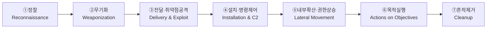

> 🎯 우리가 지금 왜 이걸 하나요?
>
> 앞으로 이 시리즈에서는 공격을 자동화(정찰·점검)하고, 그 흔적을 자동으로 탐지하는 방어 시스템을 함께 만듭니다. 그런데 "무엇을 자동화할지"를 정하려면 먼저 **공격이 어떤 순서로 진행되는지**를 알아야 합니다. 공격은 한 방에 끝나지 않고 여러 단계를 차근차근 밟습니다. 그 단계를 그림으로 정리한 것이 바로 **사이버 킬체인(Cyber Kill Chain)** 입니다. 오늘 이 지도를 손에 넣으면, 이후 모든 강의에서 "지금 우리가 공격 흐름의 어느 지점을 다루고 있는지"를 항상 알 수 있게 됩니다.
{: .prompt-info }

## 공격은 한 번에 일어나지 않습니다

영화에서는 해커가 키보드를 몇 번 두드리면 곧바로 시스템이 뚫립니다. 하지만 실제 공격은 그렇지 않습니다. 공격자는 목표를 정한 뒤, **사전 조사 → 도구 준비 → 침투 → 거점 확보 → 내부 이동 → 목적 실행 → 흔적 제거**라는 일련의 과정을 단계적으로 밟습니다.

이 "단계"라는 개념이 방어자에게 왜 중요할까요? 공격이 사슬(chain)처럼 연결되어 있다면, **그 사슬 중 한 고리만 끊어도(kill) 공격 전체가 무너지기 때문**입니다. 그래서 이름이 "킬(kill) 체인(chain)"입니다. 방어자 입장에서 각 단계는 곧 "여기서 막을 수 있다"는 **방어 기회**가 됩니다.

이 모델은 군수 기업 록히드 마틴(Lockheed Martin)이 군사 작전의 표적 타격 개념을 사이버 공격에 적용해 정리한 것으로, 공격을 7단계로 나눕니다.

## 사이버 킬체인 7단계 한눈에 보기

이제 한 단계씩 살펴보겠습니다. 각 단계를 읽을 때 "공격자는 여기서 무엇을 하는가" 그리고 "방어자는 여기서 무엇을 잡을 수 있는가"를 함께 떠올려 보시기 바랍니다.

### ① 정찰 (Reconnaissance) — 공격 전 사전조사

공격자는 곧장 공격하지 않고 먼저 **목표를 조사**합니다. 마치 도둑이 집을 털기 전에 며칠간 주변을 살피는 것과 같습니다. 이 단계에서 공격자는 다음과 같은 일을 합니다.

- **OSINT(공개정보) 수집**: 회사 홈페이지, 채용 공고, SNS, 깃허브 등 공개된 정보를 긁어모읍니다.
- **보안 시스템 탐지(스캐닝)**: 어떤 포트가 열려 있고, 어떤 서버·방화벽이 있는지 스캔합니다.
- **핵심 인물 식별**: 누가 관리자이고, 누가 권한이 높은지 파악합니다.
- **네트워크 구성 매핑**: 내부망이 어떻게 생겼는지 그림을 그립니다.
- **공급망·제3자 조사**: 직접 뚫기 어렵다면, 거래처나 협력사 같은 약한 고리를 노립니다.

> 이 단계는 우리 시리즈의 핵심 실습 중 하나입니다. 뒤에서 AI 에이전트가 Kali에서 Victim 서버를 자동으로 스캔하고 정보를 정리하는 "정찰 자동화"를 직접 만들게 됩니다.
{: .prompt-tip }

### ② 무기화 (Weaponization) — 약점을 공략할 도구 제작

조사로 약점을 찾았다면, 이제 그 약점을 찌를 **무기를 만듭니다**. 공격자는 이 단계에서 직접 손에 무기를 들지 않고, 자기 환경에서 조용히 준비만 합니다.

- **맞춤형 악성코드** 제작
- **사회공학 시나리오**(피싱 이메일 대본, 가짜 로그인 페이지) 설계
- 공격 과정을 빠르게 반복하기 위한 **자동화 도구 결합**
- 백신·탐지를 피하기 위한 **난독화·암호화**(탐지 회피)

이 단계는 공격자 내부에서 벌어지므로 방어자가 직접 보기는 어렵습니다. 그래서 ①정찰에서의 이상 징후를 잘 잡아두는 것이 중요합니다.

### ③ 전달·취약점 공격 (Delivery & Exploitation) — 실제 침투

준비한 무기를 **표적에게 배달하고, 취약점(Vulnerability)을 악용해 제어권을 빼앗는** 단계입니다. 외부에서 내부로 처음 발을 들이는 순간이며, 실제 사고에서 가장 흔하게 시작되는 지점입니다.

- **전달(Delivery)**: 피싱 이메일, 감염된 첨부파일, 워터링홀 공격(피해자가 자주 가는 사이트에 함정 심기) 등
- **취약점 공격(Exploitation)**: 웹 애플리케이션이나 장비의 취약점을 악용해 코드 실행·접근 권한을 획득

우리 랩에서는 Kali(192.168.57.10)에서 Ubuntu 24.04의 DVWA(192.168.57.30)에 있는 취약점을 점검하는 실습으로 이 단계를 직접 경험하게 됩니다.

> **실제 사례 — CitrixBleed (CVE-2023-4966)**
>
> 2023년, 인터넷 경계에 놓인 Citrix(시트릭스) 장비의 취약점이 공격자에게 초기 침투 통로(③단계)로 악용되었습니다. 사용자의 세션 토큰을 탈취당해 인증을 우회당하는 방식이었고, 여러 대형 기관이 이 한 줄의 약점으로 침해를 겪었습니다. 여기 등장한 `CVE-2023-4966` 같은 **CVE(Common Vulnerabilities and Exposures: 공통 취약점 및 노출) 식별자**가 정확히 무엇인지는 다음 03강에서 자세히 다룹니다.
{: .prompt-warning }

### ④ 설치·명령제어 (Installation & C2) — 거점 확보

한 번 들어왔다고 끝이 아닙니다. 공격자는 재접속을 위해 **백도어를 설치해 지속성(Persistence)을 확보**합니다. 그리고 외부의 **C2(Command & Control, 명령제어) 서버**와 몰래 통신하면서 추가 명령을 받습니다.

비유하자면, 침입자가 집에 들어온 뒤 **몰래 합법처럼 보이는 열쇠를 복사해 두고**, 밖에서 무전기로 다음 지시를 받는 셈입니다. 이 통신을 탐지하는 것이 방어의 중요한 관문입니다.

### ⑤ 내부 확산·권한 상승 (Lateral Movement & Privilege Escalation)

처음 뚫린 컴퓨터 한 대는 보통 목표가 아닙니다. 공격자는 거기서 **옆으로, 위로** 이동합니다.

- **내부 스캔**: 내부망에서 또 다른 표적을 찾습니다.
- **자격증명 탈취**: 키로거나 Mimikatz(미미카츠) 같은 도구로 메모리에서 비밀번호·해시를 긁어냅니다(메모리 스크래핑).
- **권한 상승**: 일반 사용자 권한을 관리자 권한으로 끌어올립니다.
- **정상 계정 악용**: 훔친 정상 계정으로 움직여 탐지를 피합니다.

> 이 단계가 **가장 탐지하기 어렵습니다**. 공격자가 정상 계정으로 정상처럼 보이는 행동을 하기 때문에, 진짜 사용자의 활동과 구분하기가 매우 까다롭습니다. 그래서 후반부 강의에서 "정상으로 위장한 비정상"을 가려내는 탐지 자동화를 다룹니다.
{: .prompt-warning }

### ⑥ 목적 실행 (Actions on Objectives) — 진짜 목표

드디어 공격자가 **원하던 것을 실행**하는 단계입니다.

- **데이터 유출(Exfiltration)**: 기밀·개인정보를 외부로 빼냅니다.
- **랜섬웨어 암호화**: 파일을 잠그고 금전을 요구합니다.
- **기반시설(OT) 조작**: 발전소·공장 같은 제어시스템을 망가뜨립니다.
- **논리폭탄**: 특정 조건에서 터지도록 심어둔 악성 로직을 발동합니다.

중요한 점은, 이 단계에서 **포렌식 증거가 남는다**는 것입니다. 파일이 옮겨지고, 프로세스가 실행되고, 로그가 찍힙니다. 방어자가 사후에 사건을 재구성할 수 있는 단서가 이때 생깁니다.

### ⑦ 흔적 제거 (Cleanup) — 안티포렌식

마지막으로 공격자는 자신이 다녀간 **자취를 지웁니다**.

- **로그 삭제·조작**: 침입 기록을 없애거나 변조합니다.
- **악성 도구 제거**: 사용한 도구를 지웁니다.
- **임시 파일 소거**: 작업 흔적을 청소합니다.
- **안티포렌식 — Timestomping(타임스톰핑)**: 파일의 생성·수정 시간을 거짓으로 바꿔 수사를 방해합니다.

흔적을 지우려는 행위 자체도 또 하나의 흔적입니다. "갑자기 로그가 사라졌다"는 사실이 곧 탐지 신호가 됩니다.

## 킬체인의 진짜 의미

> **킬체인의 핵심은 "한 단계만 끊어도 공격이 무산된다"는 것입니다.**
>
> 정찰을 알아채면 무기화 이전에 막을 수 있고, 전달을 차단하면 취약점 공격으로 이어지지 않으며, C2 통신을 끊으면 내부 확산이 멈춥니다. 방어자에게 **각 단계는 곧 방어 기회**입니다. 완벽한 한 방의 방어가 아니라, 사슬 어딘가를 끊는 여러 번의 기회로 생각하면 됩니다.
{: .prompt-tip }

## 우리 시리즈와 킬체인 연결 지도

이 시리즈에서 만들 공격 자동화(정찰·점검)와 방어 자동화(탐지)가 킬체인의 어느 단계에 대응되는지 정리하면 다음과 같습니다.

| 킬체인 단계 | 공격자가 하는 일 | 우리 시리즈에서 다루는 강의 |
| --- | --- | --- |
| ① 정찰 | 스캐닝·정보 수집 | **09강** 정찰 자동화 (AI 에이전트 스캔) |
| ② 무기화 | 악성 도구 제작 | (공격자 내부 단계 — 직접 실습 제외) |
| ③ 전달·취약점 공격 | 침투·취약점 악용 | **10~12강** 취약점 점검 자동화 |
| ④ 설치·명령제어 | 백도어·C2 통신 | **13~15강** 침투 후 행위 이해 |
| ⑤ 내부 확산·권한 상승 | 측면 이동·권한 상승 | **16~17강** 흔적 탐지 |
| ⑥ 목적 실행 | 데이터 유출·암호화 | **16~17강** 흔적 탐지 |
| ⑦ 흔적 제거 | 로그 삭제·안티포렌식 | **16~17강** 흔적 탐지 |

표를 보면 우리 작업이 크게 두 묶음으로 나뉜다는 것을 알 수 있습니다. **전반부(공격 자동화)**는 킬체인 앞쪽(①·③)을, **후반부(방어 자동화)**는 킬체인 뒤쪽(⑤·⑥·⑦)의 흔적을 탐지하는 데 집중합니다.

## 킬체인과 MITRE ATT&CK은 무엇이 다른가요?

킬체인이 공격의 **큰 줄거리(7단계 흐름)**라면, MITRE ATT&CK는 각 단계 안에서 공격자가 쓰는 **구체적인 기술 카탈로그**입니다. 예를 들어 "⑤내부 확산" 단계에서 실제로 어떤 기법(Mimikatz로 자격증명 덤프 등)이 쓰이는지를 번호와 이름으로 분류해 둔 사전이라고 보면 됩니다. 두 모델은 경쟁 관계가 아니라 **흐름(킬체인) + 세부 기술(ATT&CK)** 으로 서로를 보완합니다.

| 구분 | 사이버 킬체인 | MITRE ATT&CK |
| --- | --- | --- |
| 성격 | 공격의 단계별 흐름 | 공격 기술의 분류 사전 |
| 단위 | 7개 큰 단계 | 전술(Tactic) + 기법(Technique) |
| 쓰임 | "지금 어느 단계인가" 파악 | "어떤 기법이 쓰였나" 매핑 |

## 정리

오늘 우리는 공격이 7단계를 밟는다는 것, 그리고 그 사슬 중 한 고리만 끊어도 공격을 막을 수 있다는 킬체인의 핵심 아이디어를 배웠습니다. 앞으로 어떤 실습을 하든, "이건 킬체인의 몇 번 단계일까?"를 스스로 물어보면 시리즈 전체가 하나의 지도 위에서 보이기 시작할 것입니다.

## 참고 자료

- [Lockheed Martin, Cyber Kill Chain®](https://www.lockheedmartin.com/en-us/capabilities/cyber/cyber-kill-chain.html)
- [MITRE ATT&CK®](https://attack.mitre.org/)
- [CISA, CitrixBleed (CVE-2023-4966) advisory](https://www.cisa.gov/news-events/cybersecurity-advisories)

## 다음 강의 예고

다음 **03강 — 취약점의 공통 언어(CWE·CVE·CVSS·KEV)** 에서는 오늘 잠깐 등장한 `CVE-2023-4966` 같은 식별자가 정확히 무엇을 뜻하는지 다룹니다. 취약점에 번호를 매기는 **CVE(Common Vulnerabilities and Exposures: 공통 취약점 및 노출)**, 취약점의 종류를 분류하는 **CWE(Common Weakness Enumeration: 공통 약점 목록)**, 위험도를 점수로 매기는 **CVSS(Common Vulnerability Scoring System: 공통 취약점 평가 시스템)**, 그리고 "실제로 악용되고 있는" 취약점 목록인 **KEV(Known Exploited Vulnerabilities: 알려진 악용 취약점)**까지 — 보안 세계의 공통 언어를 함께 익혀, 우리가 만들 점검 자동화가 "무엇을" 찾아야 하는지 명확히 하겠습니다.
