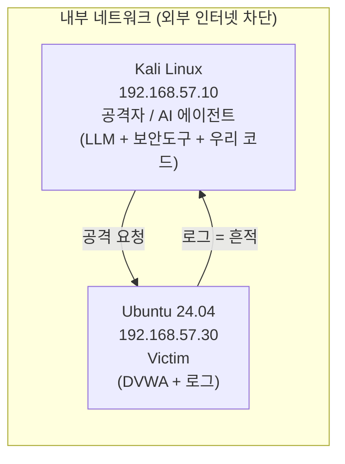

> 🎯 우리가 지금 왜 이걸 하나요?
>
> 우리는 앞으로 "사람 대신 빠르게 움직이는 자동화 공격 도구"를 직접 만들고 돌려 볼 것입니다. 그런데 자동화는 사람보다 수백 배 빠르게, 수천 개의 요청을 한꺼번에 쏟아냅니다. 한 줄을 잘못 쓰면 그 실수도 수백 배로 커집니다. 그래서 "어디서 돌려도 되는가"를 먼저 정하지 않으면, 코드를 한 줄도 쓰면 안 됩니다. 이번 강의에서는 **외부에 절대 영향을 주지 않는 격리 랩**을 설계하고, 동시에 **공격의 흔적을 관측할 수 있는 환경**을 만드는 방법을 다룹니다.
{: .prompt-info }

## 왜 "환경 설계"가 첫 단추일까요

보통 실습이라고 하면 곧바로 도구를 설치하고 명령어를 두드리고 싶어집니다. 하지만 자동화 공격은 그 순서로 접근하면 위험합니다. 이유는 단순합니다. **자동화는 실수도 자동으로 증폭**시키기 때문입니다.

사람이 손으로 요청을 보낼 때는 한 번에 한 개씩, 눈으로 확인하면서 보냅니다. 그래서 잘못된 대상에 보내더라도 한두 번에서 멈출 수 있습니다. 그러나 AI 에이전트가 끼어든 자동화 도구는 다릅니다. "이 IP 대역을 전부 스캔해"라는 한 문장이 수천 건의 요청으로 번역됩니다. 만약 그 대역에 우리 것이 아닌 서버가 섞여 있다면, 우리는 의도치 않게 남의 시스템을 공격한 셈이 됩니다.

그래서 이 시리즈의 모든 실습은 **외부 인터넷과 물리적·논리적으로 끊어진 격리 랩 안에서만** 진행합니다.

## 1. 왜 격리하는가 — 세 가지 이유

격리가 필요한 이유는 크게 세 가지로 정리됩니다.

| 이유 | 설명 |
| --- | --- |
| **실수의 규모** | 자동화 도구는 사람보다 빠르고 많은 요청을 보냅니다. 잘못된 대상·잘못된 페이로드가 순식간에 대량으로 나갑니다. 격리하면 그 폭발이 랩 안에서만 끝납니다. |
| **법적 책임** | 동의 없이 남의 시스템을 점검하면 「정보통신망법」 위반입니다. "테스트였다"는 변명은 통하지 않습니다. 외부와 끊으면 실수로라도 남을 건드릴 수 없습니다. |
| **재현성** | 실험은 같은 조건에서 반복할 수 있어야 의미가 있습니다. 외부 인터넷은 매번 응답이 달라집니다. 격리 랩은 우리가 통제하므로 결과를 다시 만들어 낼 수 있습니다. |

> ⚠️ 반드시 지켜야 할 원칙
>
> - **본인이 소유했거나 명시적 동의를 받은 대상**만 점검합니다.
> - 실습 트래픽은 **외부 인터넷으로 절대 나가지 않도록** 차단합니다.
> - "남의 서버에 한 번쯤은 괜찮겠지"는 없습니다. 한 번이 곧 위반입니다.
{: .prompt-danger }

## 2. 격리 수준 선택 — VirtualBox 네트워크 모드 비교

VirtualBox에는 여러 가지 네트워크 모드가 있습니다. 각 모드가 "외부와 얼마나 연결되는가"가 다르므로, 우리 목적에 맞는 것을 골라야 합니다.

| 모드 | 외부 인터넷 | VM ↔ VM 통신 | 호스트 ↔ VM | 우리 실습 적합성 |
| --- | --- | --- | --- | --- |
| **NAT** | O (나감) | X | 제한적 | 부적합 — 외부로 트래픽이 새어 나갑니다 |
| **NAT 네트워크** | O (나감) | O | 제한적 | 부적합 — 역시 외부 연결이 열려 있습니다 |
| **호스트 전용(Host-Only)** | X | O | O | 적합 — 외부 차단, 호스트에서 관찰 가능 |
| **내부 네트워크(Internal Network)** | X | O | X | 가장 적합 — 완전히 격리된 폐쇄망 |

우리는 **내부 네트워크(Internal Network)** 를 기본으로 사용합니다. 이 모드는 같은 이름을 가진 VM끼리만 통신할 수 있고, 호스트(내 노트북)와도, 바깥 인터넷과도 연결되지 않는 완전한 폐쇄망입니다. 자동화 도구가 아무리 빠르게 요청을 쏟아 내도, 그 요청은 랩 밖으로 한 발짝도 나가지 못합니다.

다만 호스트에서 직접 로그를 들여다보거나 패킷을 캡처하고 싶을 때는 **호스트 전용(Host-Only)** 이 편리합니다. 외부 인터넷은 여전히 차단되면서, 내 노트북에서 VM에 접속해 관찰할 수 있기 때문입니다. 두 모드 모두 "외부 인터넷과 끊긴다"는 핵심 조건을 만족하므로, 상황에 따라 선택하면 됩니다.

## 3. 무엇을 관측할 것인가 — 흔적을 남기도록 설계하기

여기서 이 시리즈의 중요한 철학을 짚고 갑니다.

> 💡 핵심 메시지
>
> **공격은 흔적을 남깁니다.** Victim을 단순한 "표적"이 아니라, **흔적을 남기도록 설계된 관측 대상**으로 만들어야 5부 이후의 탐지·관제 실습이 가능합니다.
{: .prompt-tip }

많은 사람들이 "공격에 성공했다"에서 실습을 멈춥니다. 하지만 실제 보안 업무의 절반은 "그 공격을 어떻게 알아챘는가"입니다. 우리 시리즈는 공격을 만든 다음, 그 공격이 남긴 흔적을 추적하고 탐지하는 데까지 갑니다. 그러려면 처음부터 Victim이 **충분한 로그를 남기도록** 설계해야 합니다.

관측해야 할 대표적인 흔적은 다음과 같습니다.

| 관측 지점 | 무엇이 남는가 | 왜 중요한가 |
| --- | --- | --- |
| 웹 접근 로그 `access.log` | 누가, 언제, 어떤 URL에 요청했는지 | 자동화 스캔은 짧은 시간에 수많은 경로를 두드립니다. 그 패턴이 그대로 찍힙니다 |
| 웹 에러 로그 `error.log` | 비정상 요청·실패한 처리 | 공격 페이로드가 서버를 어떻게 흔들었는지 단서가 됩니다 |
| 인증 로그 `auth.log` | 로그인 시도·실패·SSH 접근 | 무차별 대입(brute force) 같은 흔적이 드러납니다 |

여기에 한 가지 더, **NTP(Network Time Protocol: 네트워크 시간 프로토콜)를 통한 시각 동기화**가 매우 중요합니다. 공격자 VM과 Victim VM의 시계가 서로 다르면, "공격 시각"과 "로그에 찍힌 시각"이 어긋나서 사건을 연결할 수 없습니다. 모든 VM의 시간을 맞춰 두어야 나중에 "이 요청이 저 공격의 결과"라고 짝지을 수 있습니다.

## 4. 랩 구성도

우리 랩은 두 대의 VM으로 구성됩니다. 한 대는 공격을 수행하는 AI 에이전트(공격자), 다른 한 대는 흔적을 남기는 Victim입니다.



각 VM의 역할을 표로 정리하면 다음과 같습니다.

| 항목 | 공격자 | Victim |
| --- | --- | --- |
| OS | Kali Linux | Ubuntu 24.04 LTS |
| 고정 IP | 192.168.57.10 | 192.168.57.30 |
| 역할 | AI 에이전트가 정찰·공격을 자동 실행 | 취약 웹 서비스를 띄우고 흔적을 기록 |
| 설치 구성 | LLM(Ollama 등) + 보안 도구 + 우리가 만든 코드 | DVWA(취약 웹앱) + 웹/인증 로그 |
| 관측 방향 | 공격을 "보내는" 쪽 | 흔적을 "남기는" 쪽 |

화살표가 양방향인 점에 주목하세요. 공격자는 Victim에게 요청을 보내고(공격), Victim은 그 요청을 로그로 남깁니다(흔적). 이 두 흐름이 모두 있어야 "공격 → 탐지"의 한 사이클이 완성됩니다.

> **왜 `192.168.57` 대역인가 — 다른 과정과의 주소 분리**
> 이 학습 경로에서는 여러 과정이 각자의 가상 머신을 만듭니다. 같은 PC에 여러 과정의 VM이 함께 있게 되므로, **과정마다 대역을 다르게 배정**해 두어야 주소가 겹치지 않고 명령을 잘못 복사해 엉뚱한 장비를 건드리는 사고를 막을 수 있습니다.
>
> | 대역 | 사용하는 과정 |
> |---|---|
> | `192.168.56.0/24` | 리눅스 기초 · 애플리케이션 보안 · 웹 보안 |
> | **`192.168.57.0/24`** | **이 과정 1~5부**(내부 네트워크 `aiweblab`) |
> | **`192.168.58.0/24`** | **이 과정 6부 SIEM — LAN**(내부 안전망) |
> | **`192.168.59.0/24`** | **이 과정 6부 SIEM — DMZ**(노출 구역) |
> | `192.168.60.0/24` | 네트워크 보안 |
> | `192.168.61.0/24` | 보안시스템 |
> | `192.168.62.0/24` | DevSecOps |
>
> 네 대역 모두 VirtualBox가 호스트 전용 네트워크에 허용하는 범위(`192.168.56.0/21`) 안에 있으므로, 나중에 관찰 편의를 위해 **호스트 전용으로 바꾸더라도 주소를 그대로 쓸 수 있습니다.**
>
> 가정용 공유기가 흔히 쓰는 `192.168.0.x`·`192.168.1.x`를 피한 것도 같은 이유입니다. 실습망 주소가 집 네트워크와 겹치면 어느 쪽으로 나가는 통신인지 구분하기 어려워집니다.
{: .prompt-info }

### VM 하드웨어 권장 사양

2부 이후에는 로컬 LLM(Ollama)을 공격자 VM 안에서 직접 구동합니다. 모델을 메모리에 올려 추론을 돌리는 작업이라 자원 배분이 실습 성패를 좌우합니다. 아래 표를 참고해 VM을 만들 때 자원을 넉넉히 잡아 두세요.

| VM | RAM | CPU | 비고 |
| --- | --- | --- | --- |
| **Kali(공격자)** | 최소 8GB(권장 12GB) | 4코어 이상 권장 | 7b급 로컬 모델 구동 대비 |
| **Ubuntu(Victim)** | 2~4GB | 2코어 | 취약 웹앱·로그만 띄우므로 충분 |

> 호스트 PC의 RAM이 16GB 이하라면, VM에 자원을 과하게 할당하다 호스트 전체가 멈출 수 있습니다. VM에 모든 메모리를 몰아주지 말고, 호스트가 동작할 여유분을 반드시 남기세요. 모델별 정확한 메모리 요구량은 06강에서 다룹니다.
{: .prompt-warning }

## 5. 안전 수칙

격리 랩을 만들었다고 끝이 아닙니다. 실습 중에도 지켜야 할 습관이 있습니다.

| 수칙 | 내용 |
| --- | --- |
| **VM 스냅샷** | 실습 전 깨끗한 상태를 스냅샷으로 저장합니다. 망가지면 몇 초 만에 원래대로 되돌릴 수 있습니다 |
| **대상 화이트리스트** | 공격 대상 IP를 코드에서 화이트리스트로 강제합니다. 목록에 없는 IP에는 요청 자체가 나가지 않게 막습니다(13강에서 상세히 구현) |
| **작업 기록** | 무엇을 언제 했는지 기록을 남깁니다. 실험 결과를 재현하고 문제를 추적하는 근거가 됩니다 |

특히 **대상 화이트리스트**는 격리 네트워크와 더불어 "이중 안전장치" 역할을 합니다. 네트워크가 격리되어 있어도, 코드 차원에서 한 번 더 막아 두면 사람의 실수까지 줄일 수 있습니다.

## 6. Step-by-Step: 두 VM을 같은 내부 네트워크에 두기

여기서는 두 VM을 같은 내부 네트워크에 묶는 핵심 절차만 다룹니다. 각 VM의 상세한 OS 설치는 다음 05강에서 이어집니다.

> 아래 절차는 VirtualBox가 이미 설치되어 있고, Kali와 Ubuntu VM이 만들어져 있다고 가정합니다.
{: .prompt-info }

**Step 1. VirtualBox 관리자에서 첫 번째 VM(Kali)을 선택합니다.**

VM 목록에서 Kali를 클릭한 뒤 상단의 `설정(Settings)` 버튼을 누릅니다.

**Step 2. 네트워크 탭으로 이동해 어댑터를 내부 네트워크로 바꿉니다.**

`네트워크(Network)` → `어댑터 1(Adapter 1)` 로 들어갑니다. `네트워크 어댑터 사용하기`에 체크한 뒤, **다음에 연결됨(Attached to)** 항목을 `내부 네트워크(Internal Network)` 로 선택합니다.

**Step 3. 내부 네트워크 이름을 지정합니다.**

`이름(Name)` 칸에 우리 랩의 네트워크 이름을 적습니다. 예를 들어 `aiweblab` 이라고 입력합니다. 이 이름이 두 VM을 묶는 열쇠입니다.

```text
Attached to : Internal Network
Name        : aiweblab
```

**Step 4. 두 번째 VM(Ubuntu)에 같은 작업을 반복합니다.**

Ubuntu VM을 선택하고 `설정` → `네트워크` → `어댑터 1`로 들어가, 동일하게 `내부 네트워크`를 선택하고 이름을 **똑같이** `aiweblab` 으로 지정합니다.

> 두 VM의 내부 네트워크 이름이 **글자 하나까지 정확히 같아야** 서로 통신할 수 있습니다. 다르면 같은 랩에 있어도 서로를 못 봅니다.
{: .prompt-warning }

**Step 5. 각 VM에 고정 IP를 부여합니다(개념).**

내부 네트워크에는 외부 DHCP 서버가 없으므로, 각 VM이 IP를 스스로 정해야 합니다. 우리 계획은 Kali에 `192.168.57.10`, Ubuntu에 `192.168.57.30`을 고정으로 줍니다. 실제 OS 안에서 고정 IP를 설정하는 명령은 다음과 같은 형태입니다(상세 적용은 05강에서 진행합니다).

```bash
# Ubuntu(Victim) 예시 — 인터페이스 이름은 환경에 따라 다를 수 있습니다
sudo ip addr add 192.168.57.30/24 dev enp0s3
sudo ip link set enp0s3 up
```

```bash
# Kali(공격자) 예시
sudo ip addr add 192.168.57.10/24 dev eth0
sudo ip link set eth0 up
```

> 위 `ip addr add` 명령으로 부여한 IP는 **임시**라서 VM을 재부팅하면 사라집니다. 매번 다시 입력하지 않으려면 영구 고정으로 설정해야 하는데, Ubuntu는 netplan, Kali는 별도 설정 파일을 사용합니다. 영구 고정 IP 설정은 05강에서 상세히 다룹니다.
{: .prompt-tip }

**Step 6. 연결을 확인합니다.**

두 VM을 모두 켠 뒤, 공격자에서 Victim으로 핑을 보내 봅니다.

```bash
# Kali에서 실행
ping -c 4 192.168.57.30
```

응답이 돌아오면 두 VM이 같은 격리 네트워크에 정상적으로 묶인 것입니다. 동시에, 외부 인터넷으로는 핑이 나가지 않는지도 확인합니다.

```bash
# Kali에서 실행 — 이 요청은 "실패"해야 정상입니다
ping -c 4 8.8.8.8
```

외부로 가는 핑이 실패한다면, 우리 랩이 제대로 격리되었다는 뜻입니다. 이 "실패"야말로 우리가 원했던 결과입니다.

## 정리

이번 강의에서 우리는 코드를 쓰기 전에 **무대를 먼저 안전하게 만들었습니다.** 자동화는 실수도 자동화하므로, 외부와 끊긴 내부 네트워크 안에서만 실습합니다. 그리고 단순히 공격에 성공하는 데서 멈추지 않고, Victim이 **흔적을 남기도록 설계**해 탐지·관제 실습으로 이어질 길을 열어 두었습니다. 격리(네트워크) + 화이트리스트(코드) + 스냅샷(원복)이라는 안전장치를 갖추면, 마음 놓고 실험할 수 있는 진짜 실습장이 완성됩니다.

## 참고 자료

- NIST SP 800-115, Technical Guide to Information Security Testing and Assessment: <https://csrc.nist.gov/pubs/sp/800/115/final>
- Oracle VirtualBox 네트워킹 매뉴얼(Chapter 6, Virtual Networking): <https://www.virtualbox.org/manual/ch06.html>
- 「정보통신망 이용촉진 및 정보보호 등에 관한 법률」 — 동의 없는 무단 점검 금지의 법적 근거

## 다음 강의 예고

**05강 — Victim(취약 웹 서버) 구축과 로그 발생원 설계.** Ubuntu 24.04에 DVWA를 올리고, `access.log`·`error.log`·`auth.log`가 실제로 흔적을 남기도록 구성합니다. 이번에 만든 격리 랩 위에서, 관측 가능한 진짜 표적을 세워 보겠습니다.
