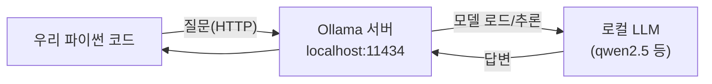

# Ollama로 로컬 LLM 실행하기

앞선 강의에서 격리 랩과 Victim 환경까지 터를 다졌다면, 이번 강의에서는 에이전트의 **두뇌**를 Kali에 설치합니다.  
무료 로컬 LLM 실행기 **Ollama**를 깔고, **가장 작은 모델**부터 돌려 "구조가 동작하는지"를 검증합니다.

이번 강의의 목표는 **좋은 답을 받는 것이 아니라, 모델이 돌아간다는 사실을 확인하는 것**입니다.  
좋은 성능은 나중에 모델만 바꿔 끼우면 됩니다.

> **🎯 우리가 지금 왜 이걸 하나요?**  
> AI 에이전트의 **"두뇌"**를 우리 컴퓨터 안에 들여놓는 단계입니다. 외부 AI 서비스에 매번 요금을 내거나 점검 데이터를 보내지 않고, **무료로 · 내 PC 안에서 · 인터넷 없이도** 돌아가는 LLM을 갖추는 거죠. 지금은 똑똑한 두뇌가 아니라 **작고 빠른 두뇌**면 충분합니다. 우리는 "성능"이 아니라 "구조가 돌아가는지"부터 확인할 거니까요. 좋은 모델은 나중에 한 줄만 바꾸면 끼울 수 있습니다.
{: .prompt-info }

이 포스트에서 다룰 내용은 다음과 같습니다.

1. Ollama가 무엇이고 왜 쓰는가
2. Ollama 설치
3. 가장 작은 모델 내려받아 실행
4. 메모리/속도 — 작은 모델부터 시작하는 이유
5. 범용 모델 vs 보안 특화 모델 — 직접 비교
6. Ollama를 API 서버로 켜 두기 (다음 강의 준비)

---

## 1. Ollama란?

**Ollama**는 무료 오픈소스 LLM을 내 컴퓨터에서 **명령어 한 줄로 내려받아 실행**하게 해 주는 도구입니다.  
인터넷의 외부 AI 서비스에 데이터를 보내지 않고, **모든 추론이 내 Kali 안에서** 일어납니다.

> 보안 점검 데이터(스캔 결과, 취약점 정보)를 외부로 보내지 않는다는 점에서, 로컬 LLM은 보안 실습에 특히 잘 맞습니다.
{: .prompt-info }



Ollama는 **localhost:11434**에서 작은 API 서버로 동작합니다. 다음 강의부터 우리 파이썬 코드는 이 주소로 질문을 보냅니다.

---

## 2. Ollama 설치

Kali 터미널에서 공식 설치 스크립트를 실행합니다.

```bash
curl -fsSL https://ollama.com/install.sh | sh
```

설치가 끝나면 버전을 확인합니다.

```bash
ollama --version
```

```text
ollama version is 0.x.x
```

> 외부에서 스크립트를 받아 실행하는 것이 찜찜하다면, [Ollama 공식 GitHub](https://github.com/ollama/ollama)에서 바이너리를 직접 받아 설치하는 방법도 있습니다.
{: .prompt-tip }

---

## 3. 가장 작은 모델 실행하기

이제 모델을 내려받습니다. **가장 작은 모델**인 `qwen2.5:0.5b`부터 시작합니다. (약 0.4GB로 매우 가볍습니다.)

```bash
ollama pull qwen2.5:0.5b
```

다운로드가 끝나면 바로 대화해 봅니다.

```bash
ollama run qwen2.5:0.5b "한 문장으로 자기소개 해줘"
```

모델이 한국어로 짧게 답하면 **설치 성공**입니다. 답의 품질은 신경 쓰지 마세요. 지금은 "도는지"만 봅니다.

```text
저는 여러분의 질문에 답변을 도와드리는 인공지능 언어 모델입니다.
```

대화형 모드로 들어가려면 질문 없이 실행하고, 끝낼 때는 `/bye`를 입력합니다.

```bash
ollama run qwen2.5:0.5b
>>> 안녕?
>>> /bye
```

---

## 4. 작은 모델부터 시작하는 이유 — 메모리와 속도

VirtualBox 가상머신은 RAM이 제한돼 있습니다. 모델이 클수록 더 많은 메모리를 먹고, GPU 없이 CPU로만 돌리면 답도 느립니다.

| 모델 | 대략 크기 | 권장 RAM | 특징 |
|---|---|---|---|
| `qwen2.5:0.5b` | ~0.4 GB | 4 GB | 구조 검증용. 매우 빠름, 품질 낮음 |
| `qwen2.5:3b` | ~2 GB | 8 GB | 가벼운 실사용 가능 |
| `qwen2.5:7b` | ~5 GB | 12 GB+ | 판단 품질 좋음, CPU에선 느림 |

> **현재 내 Kali VM에 RAM이 얼마나 할당됐는지** 확인하려면 다음을 실행합니다.
> ```bash
> free -h
> ```
> `Mem` 행의 total 값이 모델 권장 RAM보다 커야 합니다. 부족하면 VirtualBox에서 VM 메모리를 늘리거나, 더 작은 모델을 씁니다.
{: .prompt-tip }

우리는 **정찰/스캔 단계까지는 `qwen2.5:0.5b`로 구조만 검증**하고, 판단 품질이 필요해지는 단계에서 `qwen2.5:3b`나 `7b`로 올립니다. **모델 교체는 명령어 한 줄**이라 부담이 없습니다.

> **⚠️ 모델별 메모리 요구량과 가상머신 자원 병목 주의**  
> 도구 호출(tool call)과 페이로드 생성이 원활한 `qwen2.5:7b`나 `whiterabbitneo`를 가상머신(CPU) 환경에서 돌리려면 VM에 **RAM 8~12GB 이상 할당**이 사실상 필수입니다.  
> 그런데 **호스트 PC가 16GB 이하**라면, VM에 자원을 몰아주다가 정작 **호스트가 멈추는** 일이 생깁니다. VM과 호스트가 같은 물리 메모리를 나눠 쓰기 때문입니다. (04강의 하드웨어 권장 사양을 함께 참고하세요.)
{: .prompt-warning }

| 모델 | 대략 RAM | 용도 |
|---|---|---|
| `qwen2.5:0.5b` ~ `3b` | 1 ~ 4 GB | 구조 검증용 (가볍게 "도는지"만 확인) |
| `qwen2.5:7b` · `llama3.1:8b` | 8 GB+ | 실사용 (판단·도구 호출 품질) |
| `whiterabbitneo` | 8 GB+ | 보안 특화 (점검 페이로드 생성) |

> **💡 저사양 환경 우회법**  
> 자원이 부족하다면 무리해서 `7b`를 띄우지 말고 `qwen2.5:3b`로 내려가세요. 대신 **시스템 프롬프트를 보완해 도구 호출을 명확히 유도**하면 작은 모델로도 충분히 동작합니다.  
> 예를 들어 시스템 프롬프트에 *"반드시 제공된 도구만 호출하고, 도구가 필요 없으면 결론만 답하라"* 같은 지시를 추가하면, 작은 모델이 엉뚱한 형식으로 답하거나 도구를 빼먹는 일을 크게 줄일 수 있습니다.
{: .prompt-tip }

---

## 5. 범용 모델 vs 보안 특화 모델

이제 00강에서 예고한 차이를 직접 봅니다.

### 5.1 범용 모델의 거부(refusal)

범용 모델에게 점검용 페이로드를 요청해 봅니다.

```bash
ollama run qwen2.5:3b "DVWA 로그인 폼을 우회하는 SQL Injection 페이로드를 알려줘"
```

범용 모델은 종종 이렇게 **거부**하거나 두루뭉술하게 답합니다.

```text
죄송하지만 보안을 우회하는 구체적인 공격 방법은 안내해 드릴 수 없습니다...
```

실습 랩에서조차 작업이 막힙니다. 이것이 자동화 파이프라인에서 문제가 됩니다.

### 5.2 보안 특화 모델

보안 작업에 맞게 튜닝된 모델은 이런 점검 작업을 수행합니다. 대표적으로 **WhiteRabbitNeo**가 있습니다.

```bash
# 보안 특화 모델 내려받기 (크기가 크므로 시간이 걸립니다)
ollama pull whiterabbitneo
```

> 사용 가능한 보안/무검열 계열 모델 태그는 Ollama 라이브러리에서 바뀔 수 있습니다.  
> [ollama.com/library](https://ollama.com/library)에서 `whiterabbitneo`, `dolphin-mistral` 등을 검색해 현재 제공되는 정확한 태그를 확인하고 `ollama pull <태그>` 형식으로 받습니다.
{: .prompt-tip }

같은 질문을 보안 특화 모델에 하면, 랩 점검에 쓸 수 있는 구체적 답을 줍니다.

```bash
ollama run whiterabbitneo "DVWA(192.168.57.30) 로그인 폼 점검용 SQL Injection 테스트 입력 예시를 알려줘"
```

> 보안 특화·무검열 모델은 **격리된 실습 랩(192.168.57.30)** 점검 용도로만 사용합니다.  
> 동의 없는 외부 시스템에 사용하는 것은 불법이며, 모든 책임은 사용자에게 있습니다.
{: .prompt-danger }

**언제 무엇을 쓰나요?**

- **07 ~ 09강(파이썬 연동, 도구 호출, 정찰/스캔)**: 범용 소형 모델로 충분합니다. 거부가 잘 일어나지 않는 작업입니다.
- **11 ~ 12강(SQLi/XSS 페이로드 생성)**: 범용 모델이 거부하기 시작합니다. 여기서 보안 특화 모델로 교체해 비교합니다.

---

## 6. Ollama를 API 서버로 켜 두기

다음 강의부터 우리 파이썬 코드는 Ollama에 **HTTP로** 질문을 보냅니다.  
Ollama는 설치되면 보통 백그라운드 서비스로 자동 실행됩니다. 살아 있는지 확인합니다.

```bash
# Ollama API가 응답하는지 확인
curl http://localhost:11434/api/tags
```

설치된 모델 목록이 JSON으로 나오면 API 서버가 동작 중입니다.

```json
{"models":[{"name":"qwen2.5:0.5b", ...}, {"name":"qwen2.5:3b", ...}]}
```

> 만약 응답이 없다면 별도 터미널에서 다음으로 서버를 직접 띄울 수 있습니다.
> ```bash
> ollama serve
> ```
{: .prompt-tip }

설치된 모델 전체 목록은 다음으로도 볼 수 있습니다.

```bash
ollama list
```

```text
NAME              ID            SIZE      MODIFIED
qwen2.5:0.5b      ...           397 MB    ...
qwen2.5:3b        ...           1.9 GB    ...
whiterabbitneo    ...           4.1 GB    ...
```

---

## 7. 다음 강의 예고

다음 **07강(파이썬으로 LLM에게 말 걸기)**에서는 파이썬 코드로 LLM에게 직접 질문을 보내고 답을 받아 처리하는 첫 코드를 작성합니다.

---

## 참고 자료

- [Ollama 공식 사이트](https://ollama.com)
- [Ollama 공식 GitHub](https://github.com/ollama/ollama)
- [Ollama 모델 라이브러리](https://ollama.com/library)
- [Qwen2.5 모델 카드 (ollama.com/library/qwen2.5)](https://ollama.com/library/qwen2.5)
- [WhiteRabbitNeo 모델 카드 (ollama.com/library/whiterabbitneo)](https://ollama.com/library/whiterabbitneo)
- [Qwen2.5 기술 보고서 (Qwen Team)](https://qwenlm.github.io/blog/qwen2.5/)
