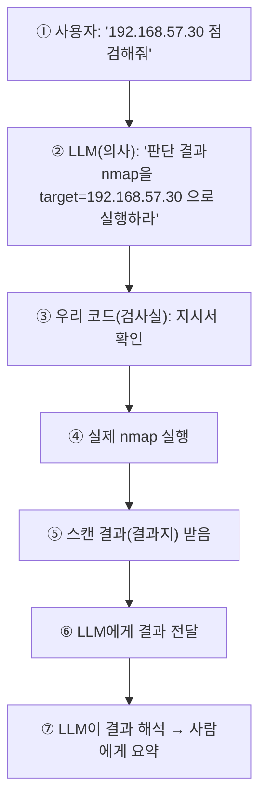

# 첫 도구 연결 — AI가 nmap을 호출하다

여기까지 오는 동안 LLM은 **글자만** 출력했습니다. "포트를 스캔하라"고 말할 줄은 알지만, 실제로 스캔하지는 못했습니다.
이번 강의에서 그 벽을 넘습니다. **LLM에게 손발을 달아 주는 것** — 이것이 에이전트의 심장입니다.

> **이번 강의는 시리즈에서 가장 중요한 개념적 도약**입니다. 천천히, 그림을 먼저 이해하고 코드로 넘어가겠습니다.
{: .prompt-warning }

> **🎯 우리가 지금 왜 이걸 하나요?**
> LLM은 말은 똑똑하게 잘하지만 **직접 행동하지는 못합니다.** "포트를 스캔하라"고 말할 줄은 알아도, 실제로 스캔하진 못하죠. 이 강의에서 LLM에게 **손발(도구)**을 달아 줘서, 말이 아니라 **진짜 점검**으로 이어지게 만듭니다. 우리가 만드는 프로그램이 비로소 "에이전트"가 되는 가장 중요한 순간입니다.
{: .prompt-info }

다룰 내용은 다음과 같습니다.

1. 비유로 먼저 이해하기 — 의사와 검사실
2. Tool Calling의 동작 순서
3. nmap을 파이썬 함수로 감싸기 (코드 해부)
4. LLM에게 "이런 도구가 있다"고 알려주기
5. 판단 → 실행 → 해석, 전체 연결
6. 점검 인사이트 — 정찰은 왜 가장 먼저인가

---

## 1. 비유로 먼저 이해하기

LLM이 직접 nmap을 실행한다고 오해하기 쉽습니다. 사실은 다릅니다. **병원**을 떠올려 봅시다.

- **의사(LLM)** 는 진찰하고 판단합니다. "이 환자는 혈액 검사가 필요하다"고 **지시서**를 씁니다. 하지만 의사가 직접 피를 뽑아 분석하지는 않습니다.
- **검사실(우리 코드 + nmap)** 이 그 지시서를 받아 **실제 검사**를 수행하고, **결과지**를 의사에게 돌려줍니다.
- 의사는 결과지를 보고 **다음 판단**을 내립니다.

> 즉 **LLM은 "nmap을 이렇게 실행해 달라"는 지시서(JSON)만 작성**합니다.
> **실제 실행은 언제나 우리 코드**가 합니다.
> 이 구조 덕분에 **통제권은 항상 우리에게** 있습니다. AI가 멋대로 위험한 명령을 실행할 수 없습니다 — 우리가 허락한 도구만, 우리가 검사한 뒤에 실행되기 때문입니다.
{: .prompt-info }

---

## 2. Tool Calling의 동작 순서



이 일곱 단계가 머리에 들어오면, 아래 코드는 **이 그림을 그대로 코드로 옮긴 것**일 뿐입니다.

---

## 3. nmap을 파이썬 함수로 감싸기

먼저 nmap이 깔려 있는지 확인합니다(Kali엔 기본 설치되어 있습니다).

```bash
which nmap
```

`~/ai-pentest-lab`에서 `agent_nmap.py`를 만들어 봅시다. 코드가 길어 **세 부분으로 나눠** 작성·설명합니다.
첫 부분은 **"검사실" 역할을 할 함수**입니다.

```python
# agent_nmap.py (1/3) — nmap을 안전하게 감싼 함수
import subprocess

# 안전장치: 허용된 대상만 스캔한다 (13강 가드레일에서 더 강화한다)
ALLOWED_TARGETS = {"192.168.57.30"}

def run_nmap(target):
    """대상의 열린 포트와 서비스 버전을 스캔한다."""
    if target not in ALLOWED_TARGETS:
        return f"거부됨: {target} 은(는) 허용된 점검 대상이 아닙니다."

    result = subprocess.run(
        ["nmap", "-sV", "-T4", "--top-ports", "100", target],
        capture_output=True,
        text=True,
        timeout=180,
    )
    return result.stdout
```

### 한 줄씩 뜯어보기

```python
import subprocess
```
- **`subprocess`** 는 파이썬에서 **다른 프로그램(여기선 nmap)을 실행**하게 해 주는 표준 라이브러리입니다. 따로 설치할 필요 없이 파이썬에 기본 내장돼 있습니다.

```python
ALLOWED_TARGETS = {"192.168.57.30"}
```
- 중괄호 `{ }` 안에 값만 있으면 **집합(set)**입니다. "허용된 대상 명단"이라고 보면 됩니다.
- **왜 이걸 먼저 만들까요?** 자동화 도구의 가장 큰 위험은 **엉뚱한 대상을 치는 것**입니다. 그래서 코드 맨 앞에 "이 명단에 없으면 아예 실행하지 않는다"는 규칙을 박아 둡니다. 이 화이트리스트는 뒤에서 다룰 **13강 가드레일**의 출발점이기도 합니다. (안전을 나중에 덧붙이지 말고 처음부터 설계하는 습관입니다.)

```python
def run_nmap(target):
    """대상의 열린 포트와 서비스 버전을 스캔한다."""
```
- 앞 강의에서 배운 **함수 정의**입니다. `run_nmap`이라는 검사실 버튼을 만들고, 누를 때 `target`(스캔할 IP)을 건네받습니다.
- 따옴표 세 개로 쓴 줄은 **독스트링(docstring)** — 이 함수가 무슨 일을 하는지 적은 설명문입니다. (나중에 LLM에게 도구를 소개할 때도 이런 설명이 쓰입니다.)

```python
    if target not in ALLOWED_TARGETS:
        return f"거부됨: {target} 은(는) 허용된 점검 대상이 아닙니다."
```
- **`if 조건:`** 은 "조건이 참이면 아래를 실행하라"는 **조건문**입니다.
- `target not in ALLOWED_TARGETS` → "건네받은 대상이 허용 명단에 **없으면**" 참이 됩니다.
- 이 경우 스캔하지 않고 거부 메시지를 **`return`** 으로 돌려주고 함수가 끝납니다. **이것이 첫 번째 가드레일입니다.**

```python
    result = subprocess.run(
        ["nmap", "-sV", "-T4", "--top-ports", "100", target],
        capture_output=True,
        text=True,
        timeout=180,
    )
    return result.stdout
```
- **`subprocess.run([...])`** 이 실제로 nmap을 실행합니다. 명령어를 **리스트(`[ ]`)로 한 토막씩** 나눠서 넣은 것에 주목합시다.
  - 터미널에서 치면: `nmap -sV -T4 --top-ports 100 192.168.57.30`
  - 이걸 단어별로 잘라 리스트로 만든 것입니다.
- **`capture_output=True`** : nmap이 화면에 뿌리는 결과를 **붙잡아** 변수에 담아라.
- **`text=True`** : 그 결과를 (컴퓨터용 이진수가 아니라) **사람이 읽는 글자**로 달라.
- **`timeout=180`** : 180초 안에 안 끝나면 강제 종료하라(안전장치).
- **`result.stdout`** : 붙잡은 결과 중 **표준 출력(스캔 결과 본문)**을 꺼내 돌려줍니다.

> **흔한 오류 — 왜 명령을 리스트로 쪼개나요?**
> `subprocess.run("nmap -sV " + target, shell=True)` 처럼 **하나의 문자열로 합쳐 `shell=True`로 실행하면 절대 안 됩니다.**
> 만약 `target`에 `192.168.57.30; rm -rf /` 같은 값이 들어오면, 세미콜론 뒤 명령까지 실행돼 버립니다. 이것이 바로 우리가 뒤에서 점검할 **명령어 삽입(Command Injection)** 취약점입니다.
> 명령을 **리스트로 쪼개 넘기면**, 각 토막이 "명령"이 아니라 "그냥 값"으로만 취급되어 이 공격이 막힙니다. **우리 도구가 스스로 취약하지 않게** 만드는 핵심 습관입니다.
{: .prompt-warning }

---

## 4. LLM에게 "이런 도구가 있다"고 알려주기

의사가 "혈액 검사"를 지시하려면, **어떤 검사가 가능한지** 미리 알아야 합니다.
마찬가지로 LLM에게 **"너는 `run_nmap`이라는 도구를 쓸 수 있고, 그건 이런 일을 하며, 이런 입력이 필요하다"**를 알려줘야 합니다. 이 설명서를 **스키마(schema)**라고 부릅니다.

```python
# agent_nmap.py (2/3) — 도구 설명서(스키마)
TOOLS = [
    {
        "type": "function",
        "function": {
            "name": "run_nmap",
            "description": "대상 IP의 열린 포트와 서비스 버전을 스캔한다. 정찰의 첫 단계에 사용한다.",
            "parameters": {
                "type": "object",
                "properties": {
                    "target": {
                        "type": "string",
                        "description": "스캔할 대상 IP 주소 (예: 192.168.57.30)",
                    }
                },
                "required": ["target"],
            },
        },
    }
]
```

### 한 줄씩 뜯어보기

겉모습은 복잡하지만, 사실 **딕셔너리 안에 딕셔너리**가 들어 있는 구조일 뿐입니다. 중요한 부분만 봅시다.

- **`"name": "run_nmap"`** : LLM이 부를 도구의 이름입니다. 우리가 만든 **함수 이름과 똑같아야** 합니다.
- **`"description": "...정찰의 첫 단계에 사용한다."`** : **이 설명이 가장 중요합니다.** LLM은 이 설명을 읽고 "언제 이 도구를 써야 하는지" 판단합니다. 설명이 부실하면 LLM이 도구를 안 쓰거나 엉뚱하게 씁니다.
- **`"parameters"`** : 이 도구를 쓰려면 어떤 입력이 필요한지 적습니다.
  - `target`이라는 입력이 필요하고, 그 형식은 `string`(글자)이며, "스캔할 IP"라는 설명이 붙어 있습니다.
  - **`"required": ["target"]`** : `target`은 **반드시** 줘야 하는 값이라는 뜻입니다.

> 스키마는 곧 **"AI에게 주는 도구 사용 설명서"**입니다. 사람에게 새 도구를 줄 때 매뉴얼을 주듯, LLM에게도 이 매뉴얼을 줘야 제대로 씁니다.
{: .prompt-info }

---

## 5. 판단 → 실행 → 해석, 전체 연결

이제 2절의 그림(7단계)을 코드로 잇는 마지막 부분입니다.

```python
# agent_nmap.py (3/3) — 도구 호출 루프
import ollama

MODEL = "qwen2.5:7b"   # 도구 호출은 판단력이 필요해 7b 권장 (이유는 아래 설명)

def main():
    # ② LLM에게 줄 대화. system으로 배역을, user로 목표를 준다
    messages = [
        {"role": "system", "content":
            "너는 웹 보안 점검 에이전트다. 대상은 실습 랩 192.168.57.30뿐이다. "
            "정찰이 필요하면 run_nmap 도구를 사용하고, 결과를 사람이 이해하기 쉽게 요약하라."},
        {"role": "user", "content": "192.168.57.30 서버를 정찰해줘."},
    ]

    # 1차 호출: LLM이 "도구를 부를지" 스스로 결정한다
    response = ollama.chat(model=MODEL, messages=messages, tools=TOOLS)
    msg = response["message"]
    messages.append(msg)   # LLM의 응답(지시서)을 대화에 기록

    # ③④⑤ LLM이 요청한 도구를 실제로 실행한다
    for call in msg.get("tool_calls", []) or []:
        name = call["function"]["name"]
        args = call["function"]["arguments"]
        print(f"[*] LLM이 도구 호출을 요청함: {name}({args})")

        if name == "run_nmap":
            output = run_nmap(args["target"])      # ④ 진짜 nmap 실행
            print("[*] nmap 결과를 모델에게 전달합니다...\n")
            # ⑤⑥ 결과(결과지)를 'tool' 역할로 대화에 추가
            messages.append({"role": "tool", "content": output, "name": name})

    # ⑦ 2차 호출: LLM이 결과를 보고 최종 해석/요약
    final = ollama.chat(model=MODEL, messages=messages)
    print("[*] 에이전트 요약:\n" + final["message"]["content"])

if __name__ == "__main__":
    main()
```

실행합니다.

```bash
python3 agent_nmap.py
```

**예상 결과** (요지):

```text
[*] LLM이 도구 호출을 요청함: run_nmap({'target': '192.168.57.30'})
[*] nmap 결과를 모델에게 전달합니다...

[*] 에이전트 요약:
대상 192.168.57.30에서 다음 서비스가 확인되었습니다.
- 22/tcp   open  ssh      OpenSSH 9.x
- 80/tcp   open  http     Apache httpd 2.4.58 ((Ubuntu))
- 3306/tcp open  mysql    MariaDB
80번 포트에서 웹 서버가 동작 중이며 DVWA가 호스팅되고 있습니다.
다음 단계로 웹 디렉터리 탐색과 취약점 스캔을 권장합니다.
```

### 한 줄씩 뜯어보기

이 코드는 **LLM을 두 번 부릅니다.** 이 점이 앞 강의와의 결정적 차이입니다. 왜 두 번일까요?

**1차 호출 — "도구를 부를지 결정"**
```python
response = ollama.chat(model=MODEL, messages=messages, tools=TOOLS)
```
- 앞 강의와 달리 **`tools=TOOLS`** 가 추가됐습니다. "이런 도구들을 쓸 수 있어"라고 매뉴얼을 함께 건넨 것입니다.
- 그러면 LLM은 글로 답하는 대신, **"run_nmap을 target=192.168.57.30으로 실행하라"는 지시서**를 돌려줄 수 있습니다. 이게 의사의 진찰 결과입니다.

```python
    messages.append(msg)
```
- **`.append(...)`** 은 리스트 끝에 항목을 **추가**하는 명령입니다. LLM의 지시서를 대화 기록에 남깁니다. (대화의 맥락을 이어가려면 주고받은 모든 말을 기록해야 합니다.)

**도구 실행 — "지시서대로 검사실 가동"**
```python
    for call in msg.get("tool_calls", []) or []:
```
- LLM이 여러 도구를 한꺼번에 요청할 수도 있으므로 **반복문**으로 하나씩 처리합니다.
- **`msg.get("tool_calls", [])`** — 응답에서 "도구 호출 지시"를 꺼냅니다. 만약 LLM이 도구를 안 불렀다면(글로만 답했다면) 비어 있게 되어, 반복문이 그냥 지나갑니다.

```python
        name = call["function"]["name"]
        args = call["function"]["arguments"]
```
- 지시서에서 **어떤 도구**(`name`)를 **어떤 입력**(`args`)으로 부르라 했는지 꺼냅니다.

```python
        if name == "run_nmap":
            output = run_nmap(args["target"])
```
- LLM이 `run_nmap`을 요청했으면, **우리가 3절에서 만든 진짜 함수**를 그 입력으로 실행합니다. 의사의 지시서가 검사실에서 실제 검사로 바뀌는 순간입니다.
- **여기서 통제가 일어납니다**: `run_nmap` 안의 화이트리스트 검사를 반드시 통과해야 실행됩니다. LLM이 시켜도 허용 대상이 아니면 거부됩니다.

```python
            messages.append({"role": "tool", "content": output, "name": name})
```
- 새로운 역할 **`"tool"`** 이 등장했습니다. 앞 강의의 system/user/assistant에 더해, **"도구가 내놓은 결과"**를 나타내는 역할입니다. 결과지를 의사에게 돌려주는 것입니다.

**2차 호출 — "결과를 보고 최종 해석"**
```python
    final = ollama.chat(model=MODEL, messages=messages)
```
- 이제 대화 기록에는 [목표 → LLM의 지시 → nmap 결과]가 모두 담겨 있습니다. 이걸 다시 LLM에게 주면, LLM은 **결과지를 읽고 사람이 이해할 요약**을 만듭니다. 이것이 마지막 ⑦단계입니다.

> **흔한 오류 — `tool_calls`가 비어 있다 (LLM이 그냥 글로만 답함)**
> 모델이 너무 작으면 도구 호출을 못 하고 "제가 nmap을 실행하겠습니다"라고 **말로만** 답합니다(실제 호출 없음).
> → 해결책: `MODEL`을 `qwen2.5:7b` 이상으로 올립니다. 도구 호출은 **판단력**이 필요한 작업이라, 앞서 배운 "작게 검증, 크게 확장" 원칙대로 **여기서 모델을 키웁니다.** system 프롬프트에 "반드시 run_nmap 도구를 사용하라"를 더 강하게 적는 것도 도움이 됩니다.
{: .prompt-warning }

---

## 6. 점검 인사이트 — 정찰은 왜 가장 먼저인가

> **점검 인사이트 — 공격 표면(Attack Surface)**
> 모든 모의해킹은 **"무엇이 거기 있는가"**를 아는 데서 출발합니다. 열려 있는 포트 하나하나가 **공격이 들어갈 수 있는 문**, 즉 공격 표면입니다.
> - `22/ssh` → 원격 접속 지점 (비밀번호 무차별 대입의 표적)
> - `80/http` → 웹 애플리케이션 (우리의 주 점검 대상, DVWA)
> - `3306/mysql` → 데이터베이스가 외부에 노출됨 — 운영 환경이라면 **그 설정 자체가 이미 위험**
>
> `-sV` 옵션이 주는 **버전 정보**가 핵심 단서입니다. "Apache 2.4.58"처럼 정확한 버전을 알면, 그 버전에 해당하는 **알려진 취약점(CVE)**을 찾아 들어갈 수 있습니다.
> 그런데 정작 어려운 일은 스캔이 아니라 **"이 결과를 보고 다음에 어디를 팔지 판단"**하는 것입니다. 바로 그 판단을 우리가 AI에게 넘긴 것입니다 — 이것이 단순 스크립트와 **에이전트**의 차이입니다.
>
> 참고로 이런 포트·서비스 식별 활동은 MITRE ATT&CK에서 **네트워크 서비스 탐색(Network Service Discovery, T1046)** 으로 분류됩니다. 공격자의 정찰 단계가 표준화된 기법으로 정리되어 있는 셈입니다.
{: .prompt-info }

---

## 다음 강의 예고

다음 **09강**에서는 도구를 여러 개(예: whatweb, gobuster) 붙여 AI가 스스로 순서를 고르게 하고, 그 결과를 JSON으로 **구조화**합니다. 즉, 한 번의 nmap 호출을 넘어 **정찰 자동화 — 여러 도구를 조합하고 결과를 정리하는 단계**로 나아갑니다.

---

## 참고 자료

- **nmap 공식 사이트** — 옵션, 스캔 기법, NSE 스크립트 문서: <https://nmap.org/>
- **nmap 레퍼런스 가이드** — `-sV`, `-T4`, `--top-ports` 등 옵션 설명: <https://nmap.org/book/man.html>
- **MITRE ATT&CK — Network Service Discovery (T1046)** — 포트/서비스 정찰 기법: <https://attack.mitre.org/techniques/T1046/>
- **MITRE ATT&CK — Reconnaissance (TA0043)** — 정찰 전술 전반: <https://attack.mitre.org/tactics/TA0043/>
- **Ollama Tool Calling 문서** — 도구 호출(function calling) API: <https://github.com/ollama/ollama/blob/main/docs/api.md>
- **OWASP Web Security Testing Guide — 정보 수집(Information Gathering)**: <https://owasp.org/www-project-web-security-testing-guide/>
