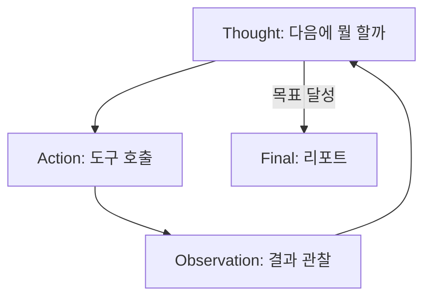

# 자율 에이전트 완성과 안전장치(가드레일)

지금까지 도구 호출(08), 점검 도구(10~12)를 따로 만들었습니다.  
이번 강의에서는 이 모두를 하나로 묶어, **"DVWA를 점검해줘" 한 마디에 전 과정을 스스로 진행**하는 자율 에이전트를 완성합니다.  
그리고 자동화가 강력해진 만큼 반드시 필요한 **안전장치(가드레일)**를 정리합니다.

> **🎯 우리가 지금 왜 이걸 하나요?**  
> 도구가 강해질수록 **실수도 커집니다.** 자동 점검기는 사람보다 훨씬 빠르고 많이 움직이기 때문에, 한 번 잘못 겨누면 피해도 순식간입니다. 이번 강의에서는 지금까지 흩어져 있던 도구를 하나로 묶어 **스스로 점검하게** 만들면서, 동시에 **사고를 막는 안전장치(가드레일)**를 함께 답니다. **가드레일이 곧 보안 설계**입니다. "강력함"과 "안전함"은 반드시 같이 가야 한다는 것을 코드로 배우는 시간입니다.
{: .prompt-info }

다룰 내용:

1. 모든 도구를 한 에이전트로 통합
2. ReAct 루프 — 생각하고, 행동하고, 관찰하기
3. 5가지 핵심 가드레일
4. 사람 승인(human-in-the-loop)
5. 점검 인사이트 — 자동화의 위험과 통제

---

## 1. 모든 도구 통합

08·10~12강에서 만든 함수들을 한 파일 `auto_pentest.py`로 모읍니다.

```python
# auto_pentest.py (1/4) — 도구 모음 + 가드레일 핵심
import subprocess, time

# ── 가드레일 ① 대상 화이트리스트 ────────────────────────────
ALLOWED_TARGETS = {"192.168.0.30"}
def _guard(t: str) -> bool:
    return any(x in t for x in ALLOWED_TARGETS)

# ── 가드레일 ② 안전한 실행 래퍼 (timeout + 예외 처리) ───────
def _safe_run(cmd: list, timeout: int = 180) -> str:
    # 가드레일 ⑤: 모든 명령은 실행 전에 위험 작업 승인을 거칩니다
    #   (confirm_if_dangerous는 아래 4절에서 정의 — 한 파일에 합치면 순서 무관)
    if not confirm_if_dangerous(cmd):
        return "거부됨: 사용자가 위험 작업을 승인하지 않음"
    try:
        r = subprocess.run(cmd, capture_output=True, text=True, timeout=timeout)
        return r.stdout[-5000:]
    except subprocess.TimeoutExpired:
        return f"오류: 시간 초과 ({timeout}s)"
    except Exception as e:
        return f"오류: {e}"

def run_nmap(target):
    if not _guard(target): return "거부됨: 허용 대상 아님"
    return _safe_run(["nmap", "-sV", "--top-ports", "100", target])

def run_nikto(url):
    if not _guard(url): return "거부됨: 허용 대상 아님"
    return _safe_run(["nikto", "-h", url, "-maxtime", "90s"])

# 세션 쿠키는 비밀값이므로 LLM이 아니라 코드가 주입합니다 (점검 도구 강에서 확보한 값)
DVWA_COOKIE = "PHPSESSID=본인_세션값; security=low"

def run_sqlmap(url):
    if not _guard(url): return "거부됨: 허용 대상 아님"
    return _safe_run(["sqlmap", "-u", url, "--cookie", DVWA_COOKIE,
                      "--batch", "--level", "1", "--dbs", "--flush-session"], 300)
```

---

## 2. ReAct 루프 — 생각·행동·관찰

자율 에이전트의 표준 패턴은 **ReAct (Reasoning + Acting)**입니다.  
모델이 (1) **생각**하고 → (2) 도구를 **행동**하고 → (3) 결과를 **관찰**하고 → 다시 생각하는 반복입니다.



```python
# auto_pentest.py (2/4) — 모든 도구 등록 + 디스패치
import ollama, json

MODEL = "qwen2.5:7b"
DISPATCH = {"run_nmap": run_nmap, "run_nikto": run_nikto, "run_sqlmap": run_sqlmap}

def _t(name, desc, props, req):
    return {"type": "function", "function":
            {"name": name, "description": desc,
             "parameters": {"type": "object", "properties": props, "required": req}}}

TOOLS = [
    _t("run_nmap", "포트/서비스 스캔",
       {"target": {"type": "string"}}, ["target"]),
    _t("run_nikto", "웹 취약점 스캔",
       {"url": {"type": "string"}}, ["url"]),
    _t("run_sqlmap", "SQL Injection 점검 (세션 쿠키는 코드가 자동 주입)",
       {"url": {"type": "string"}}, ["url"]),
]
```

```python
# auto_pentest.py (3/4) — ReAct 자율 루프 + 가드레일 ③ 단계 제한
MAX_STEPS = 10           # ③ 무한 루프 방지
AUDIT_LOG = "audit.log"  # ④ 감사 로그

def _audit(msg: str):
    line = f"[{time.strftime('%H:%M:%S')}] {msg}"
    print(line)
    with open(AUDIT_LOG, "a") as f:
        f.write(line + "\n")

def autonomous_pentest(goal: str):
    messages = [
        {"role": "system", "content":
         "너는 자율 웹 점검 에이전트다. 대상은 192.168.0.30(DVWA)뿐. "
         "정찰→스캔→취약점 검증 순으로 도구를 사용하고, 끝나면 발견 사항을 요약하라. "
         "파괴적 작업은 절대 시도하지 마라."},
        {"role": "user", "content": goal},
    ]
    for step in range(MAX_STEPS):
        resp = ollama.chat(model=MODEL, messages=messages, tools=TOOLS)
        msg = resp["message"]; messages.append(msg)
        calls = msg.get("tool_calls") or []
        if not calls:
            _audit("에이전트 종료 — 최종 요약 생성")
            print("\n[최종 요약]\n" + msg["content"]); return messages

        for call in calls:
            name = call["function"]["name"]; args = call["function"]["arguments"]
            _audit(f"step {step+1}: {name}({args})")
            out = DISPATCH[name](**args)
            messages.append({"role": "tool", "name": name, "content": out})
    _audit("최대 단계 도달 — 강제 종료")
    return messages
```

---

## 3. 5가지 핵심 가드레일

자동화 도구는 사람보다 빠르고 많이 실행되므로, **실수의 규모도 큽니다.** 다음 다섯 가지는 필수입니다.

| # | 가드레일 | 구현 위치 |
|---|---|---|
| ① | **대상 화이트리스트** — 허용 IP/URL만 | `_guard()` |
| ② | **명령어 삽입 차단** — `shell=False`, 인자 리스트 + `timeout` | `_safe_run()` |
| ③ | **단계 제한** — 무한 루프/폭주 방지 | `MAX_STEPS` |
| ④ | **감사 로그** — 모든 실행 기록(시각/도구/인자) | `_audit()` |
| ⑤ | **파괴적 작업 승인** — 위험 도구는 사람 확인 | `confirm_if_dangerous()` (4절, `_safe_run`에 연결) |

> **가드레일 ②가 가장 중요합니다.** 우리가 만든 도구 자체가 명령어 삽입 취약점을 갖지 않도록, `subprocess`에 **문자열이 아니라 리스트**를 넘기고 `shell=True`를 절대 쓰지 않습니다. 아이러니하게도, 08강에서 다룬 도구 호출(ALLOWED_TARGETS)과 같은 원칙으로, 우리가 점검하던 바로 그 취약점을 우리 도구가 갖지 않게 하는 것입니다.
{: .prompt-warning }

---

## 4. 사람 승인 (Human-in-the-Loop)

`--dump`(데이터 전체 추출), `--os-shell`(원격 셸) 같은 **되돌릴 수 없는** 작업은 자동 실행하지 않고 사람에게 확인을 받습니다.  
아래 `confirm_if_dangerous`는 1절의 `_safe_run` 맨 앞에 연결돼 있어, **모든 명령이 실행되기 전에** 위험 여부를 한 번씩 거릅니다. 지금 등록된 도구(nmap·nikto·sqlmap `--dbs`)는 위험 목록에 없어 그대로 통과하지만, 나중에 `--dump` 같은 옵션을 추가하면 이 길목에서 사람 승인을 묻게 됩니다.

```python
# auto_pentest.py (4/4) — 가드레일 ⑤ 위험 작업 승인
DANGEROUS = ("--os-shell", "--dump-all", "--passwords", "rm ", "shutdown")

def confirm_if_dangerous(cmd: list) -> bool:
    joined = " ".join(cmd)
    if any(d in joined for d in DANGEROUS):
        _audit(f"위험 작업 감지: {joined}")
        ans = input(f"[!] 위험한 작업입니다:\n    {joined}\n실행할까요? (yes/no) ")
        return ans.strip().lower() == "yes"
    return True

# ── 실행 진입점 ────────────────────────────────────────────
# 이 파일을 직접 실행할 때만 점검을 시작합니다. (15강 오케스트레이션에서 import 할 때는 실행되지 않음)
if __name__ == "__main__":
    autonomous_pentest("192.168.0.30의 DVWA를 점검해줘.")
```

> 자율성과 안전은 트레이드오프입니다. **점검(탐지)은 자동, 악용(추출/장악)은 수동 승인** — 이 경계를 분명히 하는 것이 책임 있는 자동화의 핵심입니다. 가드레일은 부가 기능이 아니라 **에이전트 보안 설계 그 자체**입니다.
{: .prompt-info }

실행 예시:

```bash
python3 auto_pentest.py
```

**예상 결과** (요지):

```text
[09:02:11] step 1: run_nmap({'target': '192.168.0.30'})
[09:02:31] step 2: run_nikto({'url': 'http://192.168.0.30/DVWA/'})
[09:03:50] step 3: run_sqlmap({'url': '.../sqli/?id=1&Submit=Submit'})
[09:05:02] 에이전트 종료 — 최종 요약 생성

[최종 요약]
- 포트: 22, 80, 3306 개방
- 웹: Apache/2.4.58 + DVWA, 보안 헤더 다수 누락
- 취약점: SQL Injection(id 파라미터) 확정, DB(dvwa) 노출
- 권장: prepared statement 적용, 보안 헤더 추가, 3306 외부 노출 차단
```

`audit.log` 파일에 모든 실행 기록이 남습니다.

---

## 5. 점검 인사이트 — 자동화의 위험과 통제

> **점검 인사이트 — 자동화가 위험한 이유, 그리고 통제법**  
> 자동 점검 도구의 위험은 세 가지입니다.  
> ① **오발사(wrong target)**: 대상 IP 오타 하나로 엉뚱한 시스템을 칩니다 → **화이트리스트**로 차단.  
> ② **폭주(runaway)**: LLM이 같은 도구를 끝없이 반복합니다 → **단계 제한**으로 차단.  
> ③ **과도한 행동(over-reach)**: 탐지를 넘어 데이터 파괴·유출까지 갑니다 → **사람 승인**으로 차단.  
>
> 실무 모의해킹에서도 **점검 범위(scope)**와 **금지 행위(rules of engagement)**를 계약서로 못 박습니다. 우리의 가드레일은 그 계약을 **코드로 강제**한 것입니다. AI에게 자율성을 줄수록, 통제 장치는 더 명시적이어야 합니다. 결국 **가드레일 설계가 곧 에이전트 보안 설계**입니다.
{: .prompt-info }

---

## 다음 강의 예고

다음 **14강**에서는 발견 사항을 **CVE·CVSS 보강**과 재현 절차·대응 방안을 갖춘 **Markdown 리포트로 자동 생성**하고, 에이전트를 **MCP 서버로 패키징**합니다. 이렇게 패키징한 도구는 15강 오케스트레이션에서 다른 에이전트와 묶여 하나의 점검 파이프라인을 이루게 됩니다.

---

## 참고 자료

- [OWASP (Open Worldwide Application Security Project)](https://owasp.org/)
- [NIST SP 800-115 — Technical Guide to Information Security Testing and Assessment](https://csrc.nist.gov/pubs/sp/800/115/final)
- [OWASP Top 10 for LLM Applications](https://owasp.org/www-project-top-10-for-large-language-model-applications/) — 자율 에이전트의 안전(가드레일·과도한 권한·도구 오남용) 설계 기준
