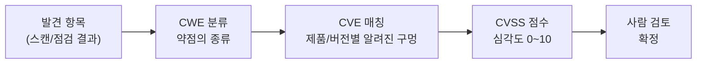

# 자동 리포트 — CVE/CVSS 보강과 MCP 패키징

앞선 강의에서 자율 점검 에이전트와 가드레일을 완성했습니다. 이번에는 점검의 **결과물**을 완성합니다.
보안 점검의 가치는 "취약점을 찾았다"가 아니라, **"무엇이, 왜 위험하고, 어떻게 고치는가를 전달하는 리포트"**에 있습니다.
나아가 발견 항목을 03강에서 배운 **CWE로 분류**하고 가능하면 **CVE/CVSS로 보강**해 심각도를 정량화하며, 우리가 만든 점검 도구를 **MCP 서버**로 패키징해 다른 AI 클라이언트에서도 재사용합니다.

> **🎯 우리가 지금 왜 이걸 하나요?**
> 보안 점검의 진짜 가치는 "취약점을 찾았다"가 아니라, **"무엇이 왜 위험하고 어떻게 고치는지를 잘 전달하는 것"**에 있습니다. 아무리 잘 찾아도 정리해 전달하지 못하면 아무것도 바뀌지 않으니까요. 이번 강의에서는 AI가 발견 내용을 **읽기 좋은 리포트**로 정리하게 만들고, 각 항목을 **CWE로 분류**한 뒤 **CVE/CVSS 심각도 점수로 보강**해 점검의 마지막 퍼즐을 맞춥니다. 그리고 우리 도구를 다른 곳에서도 재사용할 수 있게 포장(MCP)하는 법도 익힙니다.
{: .prompt-info }

다룰 내용:

1. 좋은 취약점 리포트의 구성
2. AI로 Markdown 리포트 자동 생성
3. CWE 분류와 CVE/CVSS 보강 (심각도 점수)
4. MCP 서버로 패키징
5. 자동화의 한계와 실전 주의점

---

## 1. 좋은 취약점 리포트의 구성

전문 모의해킹 리포트의 각 발견 항목은 보통 다음을 담습니다.

| 항목 | 내용 |
|---|---|
| 제목 | 취약점 이름 (예: SQL Injection - id 파라미터) |
| 분류 | CWE 식별자 (예: CWE-89) |
| 심각도 | Critical/High/Medium/Low + CVSS 점수 |
| 설명 | 무엇이 문제인가 |
| 재현 절차 | 어떻게 확인하는가 (요청 예시) |
| 영향 | 악용 시 무슨 일이 일어나는가 |
| 대응 방안 | 어떻게 고치는가 |

> **분류(CWE)** 와 **심각도(CVSS)** 가 함께 있어야 발견 항목을 표준 용어로 묶고 우선순위를 매길 수 있습니다. 03강에서 다룬 공통 언어(CWE·CVE·CVSS·KEV)를 여기서 그대로 활용합니다.
{: .prompt-tip }

---

## 2. AI로 Markdown 리포트 자동 생성

자율 점검 에이전트의 점검 결과(`messages`)를 입력으로 받아 리포트를 생성합니다. `report_gen.py`를 만듭니다.

```python
# report_gen.py — 점검 결과를 Markdown 리포트로
import ollama

MODEL = "qwen2.5:7b"

REPORT_PROMPT = """너는 모의해킹 리포트 작성자다. 아래 점검 결과를 바탕으로
한국어 Markdown 취약점 리포트를 작성하라. 각 취약점마다 다음 구조를 지켜라:

## [심각도] 취약점 제목
- **CWE**: 식별자 (예: CWE-89)
- **CVSS**: 점수 (벡터)
- **설명**: ...
- **재현 절차**: 번호 목록
- **영향**: ...
- **대응 방안**: ...

마지막에 '## 요약 표'로 전체 취약점을 표로 정리하라.
근거 없는 내용은 지어내지 마라. CVSS 점수와 벡터는 추정이며
사람의 검토가 필요하다는 점을 리포트 머리말에 명시하라."""

def generate_report(findings_text: str) -> str:
    resp = ollama.chat(model=MODEL, messages=[
        {"role": "system", "content": REPORT_PROMPT},
        {"role": "user", "content": findings_text},
    ])
    return resp["message"]["content"]

if __name__ == "__main__":
    # 자율 점검 에이전트의 최종 요약을 그대로 넣습니다 (예시)
    findings = """
    - 포트 22/80/3306 개방, 3306(MySQL) 외부 노출
    - Apache/2.4.58 + DVWA, 보안 헤더(X-Content-Type-Options 등) 누락
    - SQL Injection: id 파라미터 취약, DB(dvwa) 노출
    - Reflected XSS: name 파라미터 반사됨 (Low)
    - Command Injection: ip 파라미터로 id 명령 실행됨
    """
    md = generate_report(findings)
    with open("report.md", "w", encoding="utf-8") as f:
        f.write(md)
    print("[+] report.md 생성 완료\n")
    print(md)
```

실행합니다.

```bash
python3 report_gen.py
```

**예상 결과** (`report.md` 일부):

```markdown
## [High] SQL Injection - id 파라미터
- **CWE**: CWE-89 (SQL Injection)
- **CVSS**: 8.6 (AV:N/AC:L/PR:N/UI:N/S:U/C:H/I:N/A:N) — 추정값, 검토 필요
- **설명**: /vulnerabilities/sqli/ 의 id 파라미터가 입력값을 검증 없이
  SQL 쿼리에 연결하여 임의 쿼리 실행이 가능하다.
- **재현 절차**:
  1. 로그인 후 sqli 페이지 접근
  2. id=1' 입력 시 DB 오류 발생 확인
  3. sqlmap --dbs 로 dvwa, information_schema 추출
- **영향**: 데이터베이스 전체 열람·변조 가능
- **대응 방안**: Prepared Statement(파라미터 바인딩) 적용, 최소 권한 계정 사용

## 요약 표
| 취약점 | CWE | 심각도 | CVSS |
|---|---|---|---|
| SQL Injection | CWE-89 | High | 8.6 |
| Command Injection | CWE-78 | Critical | 9.8 |
| Reflected XSS | CWE-79 | Medium | 6.1 |
| 보안 헤더 누락 | CWE-693 | Low | 3.1 |
```

> HTML로 바꾸려면 `pip install markdown` 후 `markdown.markdown(md)`로 변환하거나, `pandoc report.md -o report.html`을 사용합니다.
{: .prompt-tip }

---

## 3. CWE 분류와 CVE/CVSS 보강 (심각도 점수)

리포트의 신뢰도를 높이려면 각 발견을 **표준 분류 체계로 묶고**, 가능하면 **알려진 취약점(CVE)과 심각도 점수(CVSS)로 보강**해야 합니다. 이 흐름은 03강에서 배운 공통 언어를 실제 리포트에 적용하는 단계입니다.



- **CWE 분류**: SQL Injection → CWE-89, Command Injection → CWE-78, XSS → CWE-79 처럼 발견을 약점의 **종류**로 묶습니다. 분류가 있어야 같은 유형을 모으고 우선순위를 매길 수 있습니다.
- **CVE 매칭(보강)**: 발견이 특정 제품·버전에 묶이는 경우(예: 노출된 Apache/특정 라이브러리 버전), 해당 버전에 **알려진 CVE**가 있는지 확인해 보강합니다.
- **CVSS 점수**: 심각도를 0~10으로 표준화해 우선순위를 정량화합니다. CVSS는 벡터(AV/AC/PR/UI/S/C/I/A)로 구성됩니다.

> **AI가 CVSS를 추정할 때 — 환각 위험과 사람 검토 필수**
> CVSS(Common Vulnerability Scoring System)는 취약점 심각도를 0~10으로 표준화한 체계입니다. AI는 그럴듯한 점수를 빠르게 제시하지만, **벡터(AV/AC/PR…)를 잘못 추정**하거나 존재하지 않는 CVE 번호를 **지어낼(환각)** 수 있습니다.
> 예: Command Injection은 보통 Critical(9.8)이지만, **인증이 필요**(DVWA는 로그인 후)하면 `PR:L`이 되어 점수가 내려갑니다. AI가 매긴 점수와 CVE는 **검토 대상**이지 확정값이 아닙니다. 리포트에는 항상 **사람 검토 단계**를 두고, 자동으로 채운 점수에는 "추정값"임을 명시하세요.
{: .prompt-warning }

> **향후 자동 보강과의 연결**
> 이번 강의에서는 CVSS·CVE를 AI 추정 + 사람 검토로 처리합니다. 점수와 CVE를 **신뢰할 수 있는 출처에서 자동 조회**(예: NVD의 CVE/CVSS 데이터, CISA KEV의 실제 악용 여부)하도록 보강하는 작업은 뒤의 **21강(자동 관제)**과 **23강(대시보드)**에서 파이프라인·시각화와 함께 다룹니다.
{: .prompt-info }

---

## 4. MCP 서버로 패키징 (재사용)

**MCP(Model Context Protocol)** 는 AI 클라이언트(두뇌)와 외부 도구·데이터(손발)를 잇는 **표준 프로토콜**입니다. 우리가 만든 점검 도구를 **MCP 서버**로 감싸면, 도구를 그 표준 방식으로 노출하게 되고, Claude Desktop·Claude Code 같은 **MCP를 지원하는 어떤 클라이언트라도** 이 점검 도구를 **직접** 호출해 재사용할 수 있습니다. 즉 도구를 한 번 만들어 두면 두뇌(모델/클라이언트)를 바꿔도 그대로 쓸 수 있습니다.

```bash
pip install fastmcp
```

```python
# mcp_server.py — 점검 도구를 MCP로 노출
from fastmcp import FastMCP
import subprocess

mcp = FastMCP("dvwa-pentest")
ALLOWED = {"192.168.0.30"}

@mcp.tool()
def nmap_scan(target: str) -> str:
    """대상 IP의 포트/서비스를 스캔합니다 (실습 랩 전용)."""
    if target not in ALLOWED:
        return "거부됨: 허용 대상 아님"
    return subprocess.run(["nmap", "-sV", target],
        capture_output=True, text=True, timeout=180).stdout

@mcp.tool()
def nikto_scan(url: str) -> str:
    """웹 URL의 취약점을 스캔합니다 (실습 랩 전용)."""
    if not any(a in url for a in ALLOWED):
        return "거부됨: 허용 대상 아님"
    return subprocess.run(["nikto", "-h", url, "-maxtime", "90s"],
        capture_output=True, text=True, timeout=180).stdout

if __name__ == "__main__":
    mcp.run()
```

클라이언트(예: Claude Desktop) 설정에 등록합니다.

```json
{
  "mcpServers": {
    "dvwa-pentest": {
      "command": "python3",
      "args": ["/home/kali/ai-pentest-lab/mcp_server.py"]
    }
  }
}
```

> 이제 로컬 Ollama 모델뿐 아니라, MCP를 지원하는 어떤 AI 클라이언트에서도 "192.168.0.30 점검해줘"라고 하면 우리 도구가 호출됩니다. **도구와 두뇌가 분리**되어, 두뇌(모델/클라이언트)를 자유롭게 바꿀 수 있습니다 — 시리즈 내내 강조한 "모델은 부품" 원칙의 완성입니다. 13강의 가드레일(허용 대상·승인 절차)도 MCP 서버 코드 안에 그대로 유지해, 어떤 클라이언트가 호출하든 안전장치가 작동하도록 합니다.
{: .prompt-info }

---

## 5. 자동화의 한계와 실전 주의점

> **점검 인사이트 — 무엇을 자동화했고, 무엇은 못 하는가**
> **잘하는 것**: 반복적 정찰·스캔, 결과 1차 분류(CWE 매핑), 알려진 취약점(SQLi 등) 탐지, 리포트 초안 작성.
> **못/덜 하는 것**:
> - **비즈니스 로직 취약점** (권한 우회, 결제 조작 등) — 맥락 이해가 필요해 자동화가 어렵습니다.
> - **환각(hallucination)** — 모델이 없는 취약점을 "발견했다"고 지어내거나, 잘못된 CVE/CVSS를 제시할 수 있습니다. **반드시 도구의 실제 출력과 신뢰할 수 있는 출처로 교차 검증**해야 합니다.
> - **오탐/미탐** — 자동 결과는 "초안"이며, 최종 판단은 사람의 몫입니다.
>
> 즉 우리가 만든 것은 **사람을 대체하는 도구가 아니라, 사람의 1차 작업을 덜어 주는 보조 도구**입니다. AI가 빠르게 넓게 훑고, 사람이 깊게 검증하는 분업이 가장 현실적입니다.
{: .prompt-info }

> 그리고 잊지 마세요 — 이 모든 것은 **본인이 소유하거나 명시적 허가를 받은 격리 환경**에서만 수행합니다. 도구가 강력해질수록, 그것을 쓰는 사람의 책임도 커집니다.
{: .prompt-danger }

---

## 다음 강의 예고

다음 **15강**에서는 흩어진 단계를 하나의 **오케스트레이션 파이프라인**으로 묶고, 모든 실행을 **실행 로그**로 남깁니다. 자동 점검이 어떤 순서로 진행되고 무엇을 호출했는지 추적 가능하게 만들어, 결과의 재현성과 신뢰성을 확보합니다.

---

## 참고 자료

- FIRST — CVSS 공식 사이트: <https://www.first.org/cvss/>
- NVD (National Vulnerability Database): <https://nvd.nist.gov/>
- CISA KEV (Known Exploited Vulnerabilities Catalog): <https://www.cisa.gov/known-exploited-vulnerabilities-catalog>
- MCP (Model Context Protocol): <https://modelcontextprotocol.io/>
