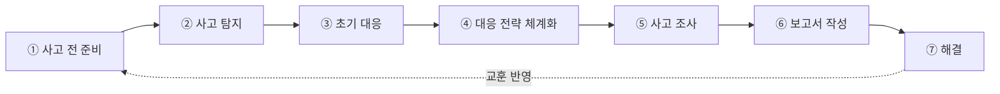
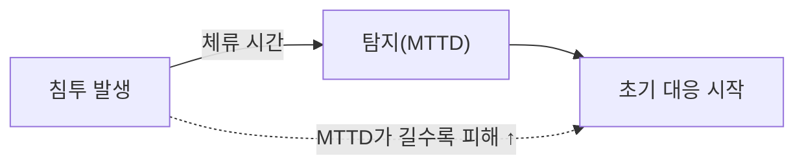
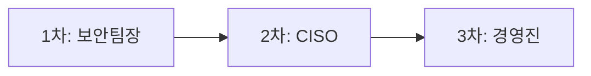
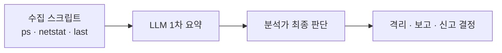

> 🎯 우리가 지금 왜 이걸 하나요?
>
> 17강에서 모니터링과 이상징후 탐지, Triage로 "사고가 일어났다"는 것을 확인했습니다. 그런데 사고를 확인한 다음이 더 중요합니다. 무엇을, 어떤 순서로 해야 할까요? 절차 없이 우왕좌왕하면 가장 먼저 사라지는 것은 **증거**이고, 그다음 커지는 것은 **피해**입니다. 휘발성 메모리에 남은 악성 프로세스 흔적은 재부팅 한 번으로 날아가고, 당황해서 의심 파일을 지우면 공격 경로를 영영 못 찾습니다. 그래서 사고가 터지기 전에 "정해진 절차"를 손에 익혀 두어야 합니다. 이번 글에서는 한국에서 가장 널리 쓰이는 **KISA(Korea Internet & Security Agency: 한국인터넷진흥원) 침해사고 대응 7단계**를 살펴보고, 그중에서도 실무에서 승부가 갈리는 **1~3단계(준비·탐지·초기대응)**에 집중합니다.
{: .prompt-info }

## 침해사고 대응은 왜 "절차"여야 하는가

사고가 발생하면 사람은 본능적으로 움직입니다. 의심스러운 파일을 지우고, 일단 서버를 껐다 켜고, 관리자 계정으로 여기저기 접속해 무엇이 문제인지 찾으려 합니다. 그런데 이 본능적인 행동 하나하나가 증거를 훼손하고 사고를 키웁니다.

침해사고 대응을 "절차"로 만들어 두면 세 가지 이점이 생깁니다.

| 절차가 있을 때 | 절차가 없을 때 |
| --- | --- |
| 누가 무엇을 할지 즉시 결정됨 | 책임 소재가 불분명해 시간 낭비 |
| 증거 보존 원칙대로 움직여 법적 효력 유지 | 휘발성 증거·로그 소실, 사후 분석 불가 |
| 신고 기한(24시간) 등 법적 의무를 놓치지 않음 | 미신고·지연으로 과태료 위험 |

즉 절차는 "당황한 상태에서도 올바르게 행동하도록 만드는 안전장치"입니다.

## 전체 7단계 개요

KISA의 침해사고 대응은 다음 7단계로 구성됩니다. 사고가 터진 순간부터 시작하는 것이 아니라, **사고가 없을 때부터(1단계)** 시작한다는 점이 핵심입니다.

각 단계를 한 줄로 요약하면 다음과 같습니다.

| 단계 | 이름 | 한 줄 설명 |
| --- | --- | --- |
| ① | 사고 전 준비 | 사고가 나기 전에 조직·계획·예방·백업·훈련을 갖춘다 |
| ② | 사고 탐지 | 모니터링과 이상징후로 사고를 식별한다 (17강) |
| ③ | 초기 대응 | 증거를 보존하며 현황을 파악하고 보고·신고한다 |
| ④ | 대응 전략 체계화 | 사고 유형·범위에 맞는 봉쇄·복구 전략을 수립한다 |
| ⑤ | 사고 조사 | 침해 경로·범위·원인을 정밀 분석한다 |
| ⑥ | 보고서 작성 | 조사 결과와 대응 내역을 문서로 남긴다 |
| ⑦ | 해결 | 시스템을 복구하고 재발 방지책을 적용한다 |

마지막 7단계에서 얻은 교훈은 다시 1단계로 돌아가 대응체계를 개선합니다. 즉 7단계는 한 번 쓰고 끝나는 직선이 아니라 **반복해서 단단해지는 순환**입니다.

이번 글은 **①~③단계**를 자세히 다루고, ④~⑦단계는 19강에서 이어 갑니다.

---

## ■ 1단계 — 사고 전 준비

사고 대응의 성패는 사고가 터진 순간이 아니라 그 이전에 거의 결정됩니다. 준비가 안 된 조직은 사고가 나야 비로소 "누가 책임자인가"를 찾기 시작하고, 그사이에 증거와 시간을 모두 잃습니다.

### 침해사고 대응 조직(CSIRT) 구성

CSIRT(Computer Security Incident Response Team: 컴퓨터 보안 침해사고 대응반)는 사고가 났을 때 움직일 사람들을 미리 정해 둔 조직입니다. 작은 조직이라도 **누가 결정하고, 누가 손을 움직이고, 누가 대외 창구인지**는 정해 두어야 합니다.

| 역할 | 담당 | 주요 R&R |
| --- | --- | --- |
| 보안책임자(CISO: Chief Information Security Officer, 정보보호최고책임자) | 의사결정권자 | 대응 방향 결정, 경영진·외부 보고 승인, 신고 여부 판단 |
| IT·관제 담당 | 시스템 운영자 | 시스템 격리·차단, 로그·증거 수집, 복구 작업 수행 |
| 침해사고 대응 담당 | 분석 인력 | 초기 조사, 증거 보존, 침해 경로 분석, 기록 작성 |
| 대외 협력 담당 | 법무·홍보 | KISA 신고, 법적 검토, 고객·언론 커뮤니케이션 |

핵심은 "사고 한가운데에서 역할을 정하지 않는 것"입니다. 역할은 평시에 문서로 박아 두어야 합니다.

### 대응 계획 문서화와 긴급 연락망

- **대응 계획 문서**: 사고 유형별 대응 절차, 복구 절차, 보고 체계를 문서로 만들어 둡니다.
- **긴급 연락망**: 내부 담당자뿐 아니라 **외부 보안 전문가(포렌식 업체 등)**, **KISA** 연락처까지 포함합니다.
- **최신 유지**: 담당자가 바뀌거나 시스템이 바뀌면 문서도 함께 갱신해야 합니다. "오래된 연락망"은 없는 것이나 마찬가지입니다.

### 예방 활동 — 우리 시리즈가 바로 여기에 닿습니다

준비의 절반은 "사고가 덜 나도록 만드는 것"입니다.

- **취약점 점검·패치 관리**: 우리가 이 시리즈에서 자동화해 온 **자동 취약점 점검**이 바로 이 영역입니다. 점검을 정기적·자동으로 돌려야 패치 누락을 막습니다.
- **보안솔루션 실시간 모니터링**: 방화벽, IPS/IDS, 백신이 단순히 "설치"되어 있는 것이 아니라 **경보가 실제로 감시되고 있어야** 의미가 있습니다.
- **접근통제·권한 최소화**: 꼭 필요한 사람에게 꼭 필요한 권한만 부여합니다. 권한이 넘치면 사고 시 피해 범위도 함께 넓어집니다.

### 백업·복구 체계

사고의 최악은 데이터 소실입니다. 랜섬웨어를 떠올리면 백업이 곧 생존선입니다.

- **오프사이트 백업**: 본 시스템과 분리된 장소(또는 망)에 백업을 보관해, 본 시스템이 감염돼도 백업이 함께 망가지지 않게 합니다.
- **무결성 검증**: 백업이 "있다"가 아니라 "복구된다"를 정기적으로 확인합니다.
- **복구 훈련**: 실제로 복구해 보지 않은 백업은 신뢰할 수 없습니다.

### 교육·훈련 (가장 자주 빠지는 부분)

- **모의훈련 연 1회 이상**: 가상의 사고 시나리오로 대응 절차를 직접 돌려 봅니다.
- **결과 반영**: 훈련에서 드러난 허점(연락이 안 됨, 역할 혼선, 권한 부족 등)을 **반드시 대응체계 개선에 반영**해야 합니다. 훈련의 목적은 "해봤다"가 아니라 "고쳤다"입니다.

---

## ■ 2단계 — 사고 탐지

2단계는 17강에서 이미 다룬 내용과 그대로 이어집니다. 모니터링과 이상징후 분석, 그리고 Triage(우선순위 분류)로 사고를 식별하는 단계입니다.

여기서 다시 강조할 지표가 **MTTD(Mean Time To Detect, 평균 탐지 시간)**입니다. 공격자가 침투한 뒤 우리가 그것을 알아채기까지 걸리는 시간이 길수록, 공격자가 내부에서 활동하는 시간(체류 시간)도 길어지고 피해 규모도 커집니다.

즉 1단계의 예방·모니터링 준비가 잘 되어 있을수록 2단계의 MTTD가 짧아지고, 3단계 초기 대응을 더 빨리·정확하게 시작할 수 있습니다. 탐지의 구체적 방법은 17강을 참고하시기 바랍니다.

---

## ■ 3단계 — 초기 대응 (가장 실무적인 단계)

초기 대응은 "사고를 인지한 직후 몇 시간"의 행동입니다. 이 짧은 시간의 행동이 이후 조사 전체의 품질을 좌우합니다. 핵심은 **증거를 훼손하지 않으면서 현황을 빠르게 파악하고, 정해진 체계로 보고·신고하는 것**입니다.

### 초기 조사 체크리스트 (기록은 5W1H로)

초기 조사에서 수집한 모든 정보는 **누가(Who), 언제(When), 어디서(Where), 무엇을(What), 왜(Why), 어떻게(How)**의 5W1H로 기록합니다. 나중에 보고서와 법적 증거의 뼈대가 됩니다.

| 점검 항목 | 확인 방법(예시) | 무엇을 보는가 |
| --- | --- | --- |
| 침해 의심 시스템 식별 | 호스트명 / IP / 물리적 위치 기록 | 어떤 자산이 대상인지 특정 |
| 실행 중 프로세스 | `ps -ef` (Linux) / `tasklist` (Windows) | 비정상·은닉 프로세스 |
| 네트워크 연결 | `netstat -an` | 외부 C2 서버와의 연결 |
| 최근 로그인 | `last` (Linux) / 이벤트 로그 (Windows) | 비정상 계정·시간대 접속 |
| 실행 중 서비스 | 서비스 목록 점검 | 임의로 등록된 서비스 |
| 시간 정보 | 최초 발견 / 추정 시작 / 현재 시각 | 사고 타임라인 구성 |
| 사용자 인터뷰 | 담당자·목격자 진술 | 정황·변경 이력 파악 |

시간 정보는 특히 중요합니다. "언제 시작됐고 언제 발견했는가"가 피해 범위 추정과 신고 기한 계산의 기준이 됩니다.

### ★ 증거 보존 원칙 — Chain of Custody

증거 연계성(Chain of Custody)이란 "이 증거가 수집된 순간부터 분석·보관에 이르기까지 누가 어떻게 다루었는지가 끊김 없이 기록되어 있어야 한다"는 원칙입니다. 이 연결고리가 끊기면 증거의 법적 효력이 사라집니다.

> ⚠️ 초기 대응에서 절대 해서는 안 되는 행동
>
> **해야 할 것**
> - 현상 그대로 보존하고, 관찰한 내용을 시각과 함께 기록합니다.
> - 전문가(포렌식 인력)가 도착하기 전까지는 **최소한의 개입**만 합니다.
> - 휘발성 정보(메모리·네트워크 연결·실행 프로세스)부터 기록으로 남깁니다.
>
> **하지 말아야 할 것**
> - **무분별한 재부팅** — 메모리에만 존재하는 악성코드·연결 흔적 등 휘발성 증거가 통째로 사라집니다.
> - **의심 파일 삭제** — 증거 인멸입니다. 격리는 가능하나 삭제는 금물입니다.
> - **관리자 권한으로 여기저기 접속** — 접속·조회 행위 자체가 로그와 타임스탬프를 덮어써 증거를 추가로 오염시킵니다.
{: .prompt-warning }

요약하면 초기 대응의 제1원칙은 "**관찰하되 훼손하지 않는다**"입니다.

### 보고·신고 체계

초기 대응에서는 내부 보고와 외부 신고가 동시에 작동해야 합니다.

**내부 보고 체계 (상향 보고)**

**외부 신고 — 법적 의무입니다**

| 항목 | 내용 |
| --- | --- |
| 근거 법령 | 「정보통신망법」 제48조의3 (침해사고의 신고) |
| 신고 기한 | 침해사고 발생을 **알게 된 때부터 24시간 이내** |
| 신고 대상 | KISA / 과학기술정보통신부 |
| 미신고·지연 시 | **과태료 3천만원 이하** |
| 관련 조항 | 제48조의4 (침해사고 원인분석을 위한 자료 보전) |
| 신고처 | 보호나라 [boho.or.kr](https://www.boho.or.kr) / ☎ 118 |

특히 제48조의4에 따라 사고 원인분석에 필요한 자료(로그 등)를 **보전**해야 한다는 점은, 앞서 설명한 증거 보존 원칙과 법적으로 직결됩니다. "재부팅 금지·파일 삭제 금지"는 단순한 권고가 아니라 법적 자료 보전 의무를 뒷받침하는 행동인 셈입니다.

### (개념) AI 활용 — 초기 조사 자동화 보조

초기 조사 체크리스트는 항목이 많고, 사고 직후의 긴박한 상황에서는 빠뜨리기 쉽습니다. 그래서 다음과 같은 보조가 가능합니다.

1. **수집 자동화**: `ps -ef`, `netstat -an`, `last` 등 초기 조사 명령의 결과를 한 번에 모으는 스크립트를 실행합니다. (단, 수집 행위 자체도 최소 개입 원칙 안에서 설계되어야 합니다.)
2. **1차 요약(LLM)**: 모인 결과를 LLM에 넣어 "비정상 프로세스 후보", "외부 의심 IP 연결", "비정상 로그인 시각" 등을 1차로 요약하게 합니다.
3. **사람의 최종 판단**: LLM의 요약은 어디까지나 **보조**이며, 격리·신고·삭제 여부 같은 결정은 반드시 사람이 내립니다.

이 보조 흐름은 21강에서 다룰 **자동 관제**의 출발점이 됩니다. 사람이 모든 로그를 일일이 읽는 대신, 자동 수집과 LLM 요약으로 "먼저 봐야 할 것"을 추려 내고, 판단은 사람이 책임지는 구조입니다.

---

## 정리

- 침해사고 대응은 사고가 난 뒤가 아니라 **사고 전 준비(1단계)**부터 시작됩니다.
- 2단계 탐지는 17강의 모니터링과 직결되며, MTTD가 짧을수록 피해가 작습니다.
- 3단계 초기 대응의 제1원칙은 **"관찰하되 훼손하지 않는다"**이며, Chain of Custody와 24시간 신고 의무가 핵심입니다.
- AI는 초기 조사 수집과 1차 요약을 도울 뿐, 최종 판단은 사람의 몫입니다.

## 참고 자료

- KISA 침해사고 대응·신고 (보호나라 & KrCERT): <https://www.boho.or.kr>
- 「정보통신망 이용촉진 및 정보보호 등에 관한 법률」 제48조의3(침해사고의 신고), 제48조의4(침해사고 원인분석을 위한 자료 보전), 시행령 제58조의2
- NIST SP 800-61 r2, *Computer Security Incident Handling Guide*: <https://csrc.nist.gov/pubs/sp/800/61/r2/final>
- KISA 침해사고 분석절차 안내서

## 다음 강의 예고

**19강 — 사고 조사와 증거 보존 (4~7단계)** 에서는 이번에 다루지 못한 **④ 대응 전략 체계화 → ⑤ 사고 조사 → ⑥ 보고서 작성 → ⑦ 해결**을 이어 갑니다. 봉쇄·복구 전략을 어떻게 세우고, 침해 경로를 어떻게 추적하며, 조사 결과를 어떤 보고서로 남겨 재발 방지로 연결하는지를 살펴보겠습니다.
