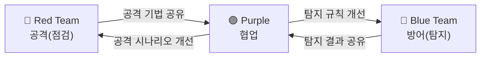
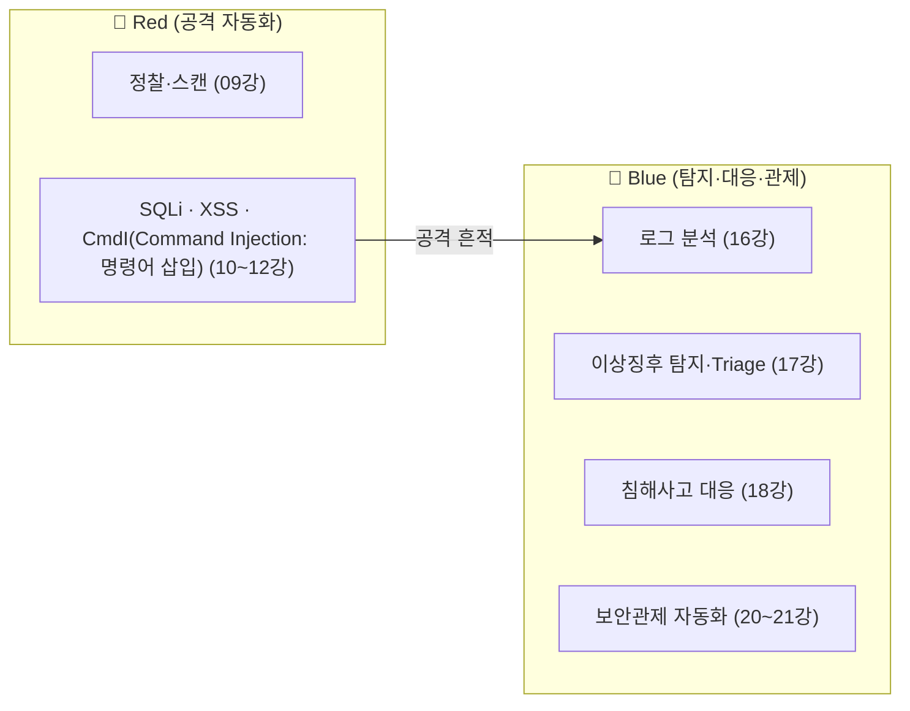
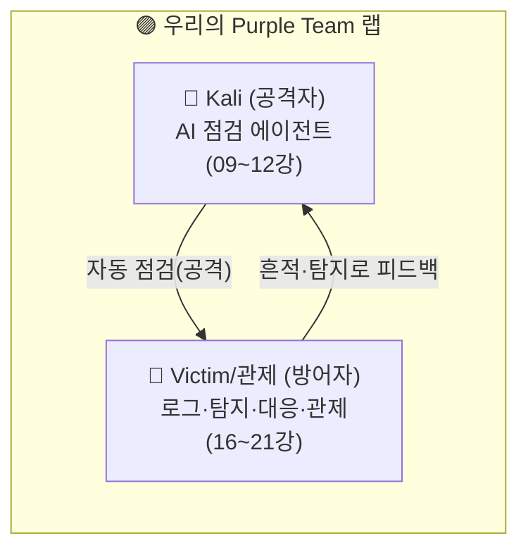
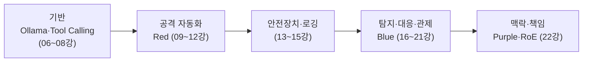

> 🎯 우리가 지금 왜 이걸 하나요?
>
> 지금까지 우리는 공격을 자동화하는 에이전트를 만들었고(09~12강), 그 공격이 방어 로그에 남기는 흔적을 읽고 탐지·대응·관제까지 자동화했습니다(16~21강). 마지막으로 다룰 것은 코드가 아니라 **맥락**입니다. 우리가 만든 이 도구들이 실제 보안 조직에서 **어디에 위치하고, 어떤 규칙 아래 쓰여야 하는가**를 정리합니다. 똑같은 기술도 *"누가, 어떤 규칙 아래, 무슨 목적으로"* 쓰느냐에 따라 정당한 점검이 되기도 하고 불법이 되기도 합니다. 기술만큼 중요한 **책임과 맥락**을 정리하면서, 도구를 돌리는 것을 넘어 공격과 방어를 함께 사고하는 단계로 나아갑니다.
{: .prompt-info }

이번 강의에서 다룰 내용은 다음과 같습니다.

1. Red / Blue / Purple Team이란 무엇인가
2. 우리가 만든 자동화는 어느 팀의 도구인가
3. 2026년, AI와 Red Teaming
4. Rules of Engagement — 책임 있는 사용의 규칙
5. 우리 랩은 작은 Purple Team이었다
6. 마무리 — 지금까지의 흐름 회고

---

## 1. Red / Blue / Purple Team이란 무엇인가

보안 운영은 흔히 **공격과 방어, 두 역할**로 나뉩니다. 거기에 둘을 잇는 세 번째 역할이 있습니다.

| 팀 | 역할 | 한 문장 |
|---|---|---|
| 🔴 **Red Team** | 공격 시뮬레이션 | "실제 공격자처럼 행동해 약점을 증명합니다" |
| 🔵 **Blue Team** | 방어·탐지·대응 | "공격을 탐지하고 막고 복구합니다" |
| 🟣 **Purple Team** | 둘의 협업 | "Red의 공격과 Blue의 탐지를 한자리에서 맞춰 봅니다" |

> **핵심 오해 정정**: Red Team은 "해커"가 아니라 **방어를 검증하기 위해 고용된 내부·계약 전문가**입니다. 목적은 시스템을 망치는 것이 아니라, **방어가 실제로 작동하는지 증명**하는 것입니다. 그래서 항상 **사전 승인과 범위 합의** 아래 움직입니다.
{: .prompt-info }

---

## 2. 우리가 만든 자동화는 어느 팀의 도구인가

이 시리즈에서 우리가 만든 것을 팀 관점으로 다시 정리해 봅니다.

- **공격 자동화(09~12강) = Red 팀의 도구입니다.**  
  정찰·스캔·취약점 검증(SQLi·XSS·명령어 주입)·리포트는 모두 **Red Team의 전형적 작업 흐름**입니다. AI는 이 작업을 **더 빠르고 넓게** 수행하도록 돕습니다. 다만 **판단과 책임은 사람(Red Team 운영자)**에게 있습니다.

- **탐지·대응·관제 자동화(16~21강) = Blue 팀의 도구입니다.**  
  16강에서 본 로그 분석, 17강의 이상징후 탐지·Triage, 18강의 침해사고 대응 절차, 그리고 20~21강의 보안관제 자동화는 모두 **Blue Team의 작업**입니다.

핵심은, **같은 "수집 → LLM 해석" 구조**가 입력을 공격 대상으로 두면 Red, 방어 로그로 두면 Blue가 된다는 점입니다. 그래서 이 시리즈는 사실 **양쪽 팀의 도구를 모두** 만든 셈입니다.

> **2026년의 현실**: 보안 인력은 늘 부족합니다. AI 에이전트는 Red Team의 반복 정찰·스캔을, Blue Team의 1차 로그 분류를 자동화해 **사람이 고차원 판단에 집중**하게 합니다. AI는 "주니어 분석가 군단"에 가깝습니다 — 빠르지만 감독이 필요합니다.
{: .prompt-info }

---

## 3. 2026년, AI와 Red Teaming

AI는 Red Teaming을 두 방향으로 바꾸고 있습니다.

**① AI로 하는 Red Teaming** (우리가 만든 것)  
LLM 에이전트가 정찰·취약점 탐지·페이로드 생성을 자동화합니다. 자율 공격 에이전트 연구가 활발하지만, 현재 신뢰할 수 있는 수준은 **"사람의 감독을 받는 보조"**입니다. 환각·오탐 때문에, 사람 검증 없는 완전 자율 공격은 위험하고 무책임합니다.

**② AI를 향한 Red Teaming** (새로운 분야)  
LLM 자체가 공격 대상이 됐습니다. **프롬프트 인젝션, 탈옥(jailbreak), 데이터 유출, 도구 오·남용** 등 AI 시스템의 취약점을 점검하는 "AI Red Teaming"이 2026년 핵심 직무로 떠올랐습니다. 우리가 13강에서 만든 가드레일(화이트리스트·사람 승인)은 바로 이런 AI 오·남용을 막는 장치였습니다.

> **흥미로운 순환**: 우리는 AI로 웹을 점검했지만(①), 그 AI 에이전트 자체도 점검 대상입니다(②). "도구에게 위험한 일을 시키도록 속일 수 있는가?"를 묻는 것 — 보안의 사고방식은 어디에나 적용됩니다.
{: .prompt-tip }

---

## 4. Rules of Engagement — 책임 있는 사용의 규칙

Red Team 활동에는 반드시 **교전 규칙(Rules of Engagement, RoE)**이 따릅니다. 자동화 도구를 쓸수록 이 규칙은 더 엄격해야 합니다. 우리가 시리즈 내내 코드로 강제한 것들이 사실 RoE였습니다.

| RoE 항목 | 우리 구현 (강의) |
|---|---|
| **범위(Scope)**: 허가된 대상만 | 대상 화이트리스트 (랩 설계 04·05강, 가드레일 13강) |
| **사전 승인(Authorization)**: 서면 동의 | 격리 랩 = 본인 소유 (00·04강) |
| **금지 행위**: 파괴적 작업 제한 | 위험 옵션 사람 승인 (13강) |
| **증적(Evidence)**: 모든 행위 기록 | 감사 로그·실행 로그 (13·15강) |
| **시간/속도 제한**: 서비스 영향 최소화 | timeout·단계 제한 (08·13강) |

> **법적 경계 (다시 강조)**  
> 동의 없는 시스템에 대한 자동 점검은 **「정보통신망 이용촉진 및 정보보호 등에 관한 법률」(정보통신망법) 위반**이며, 정당한 접근 권한 없이 정보통신망에 침입하면 형사처벌 대상이 됩니다. RoE 없는 점검은 점검이 아니라 **공격**입니다.  
> 이 시리즈의 모든 기법은 **본인 소유 격리 랩 또는 명시적 서면 허가를 받은 대상**에서만 사용합니다. 도구의 힘이 클수록, 사용자의 책임도 큽니다.
{: .prompt-danger }

---

## 5. 우리 랩은 작은 Purple Team이었다

돌이켜 보면, 이 시리즈의 실습 구조 자체가 **Purple Team 훈련**이었습니다. 09~12강에서 공격(Red)하고, 16~21강에서 그 흔적을 탐지·대응·관제(Blue)하며, 둘을 한 랩에서 순환시킨 것이 바로 Purple입니다.

- **Red(Kali)**: 자동으로 점검(공격)합니다.
- **Blue(Victim·관제)**: 그 흔적을 로그로 관찰하고 탐지·대응 규칙을 만듭니다.
- **Purple(둘을 함께 봄)**: 같은 사람이 양쪽을 오가며, **"이 공격은 이렇게 탐지된다"**를 학습합니다.

> **Purple Team의 가치**: 공격을 아는 사람이 방어를 설계할 때 가장 강합니다. "이 페이로드는 로그의 이 패턴으로 남고, 이 규칙으로 탐지된다"를 직접 연결해 본 사람은, 실무에서 **공격과 방어를 한 머릿속에서** 다룰 수 있습니다. 그것이 이 시리즈가 노린 진짜 학습 목표입니다.
{: .prompt-info }

---

## 6. 마무리 — 지금까지의 흐름 회고

여기까지, 우리가 한 랩 안에서 만든 것을 한 줄기로 회고하면 다음과 같습니다.

- 로컬 LLM(Ollama)을 깔고, 파이썬으로 **AI에게 도구를 쥐여 주는 법**(Tool Calling)을 익혔습니다.
- 정찰 → 스캔 → 검증 → 리포트로 이어지는 **자동 점검 파이프라인**을 단계별로 조립했습니다(09~12강, Red).
- **가드레일·오케스트레이션·로깅**으로 자동화를 안전하고 재현 가능하게 만들었습니다(13~15강).
- 그 공격이 **방어 로그에 남기는 흔적**을 읽고, 이상징후 탐지·침해사고 대응·보안관제까지 자동화했습니다(16~21강, Blue).
- 그리고 이번 강의에서 **Red·Blue·Purple**의 맥락으로 도구의 자리와 책임을 정리했습니다.

> 마지막으로 — 이 모든 기법은 **방어를 더 잘하기 위해** 배운 것입니다. 공격을 이해하는 것은 목적이 아니라 **더 나은 방어를 설계하기 위한 수단**입니다. 그리고 그 힘은 언제나 **허가된 범위 안에서, 책임과 함께** 쓰여야 합니다.
{: .prompt-danger }

여기까지 함께한 우리는 이제 단순히 도구를 돌리는 데서 그치지 않고, **공격과 방어를 함께 사고하고, 자동화를 안전하게 설계할 줄 아는** 단계에 와 있습니다.

---

## 다음 강의 예고

다음 23강에서는 **Streamlit 대시보드 — 점검·탐지·리포트를 화면에**를 다룹니다. 지금까지 터미널과 로그로만 보던 점검·탐지·리포트 결과를, 누구나 클릭으로 다룰 수 있는 **웹 대시보드 한 화면**으로 모읍니다. Red의 점검 결과와 Blue의 탐지 결과를 같은 화면에서 보는 것 — 그것이 Purple Team을 위한 가장 실용적인 도구입니다.

---

## 참고 자료

- [MITRE ATT&CK](https://attack.mitre.org/) — 공격 전술·기법 지식 베이스 (Red/Blue 공통 언어)
- [NIST SP 800-115, Technical Guide to Information Security Testing and Assessment](https://csrc.nist.gov/publications/detail/sp/800-115/final) — 보안 점검·모의침투의 표준 절차
- [「정보통신망 이용촉진 및 정보보호 등에 관한 법률」(정보통신망법)](https://www.law.go.kr/법령/정보통신망이용촉진및정보보호등에관한법률) — 정당한 접근 권한·정보통신망 침입 관련 법적 근거
- [OWASP](https://owasp.org/) — 웹 애플리케이션 보안 표준 및 테스트 가이드(OWASP Top 10, WSTG)
- [OWASP Top 10 for LLM Applications](https://owasp.org/www-project-top-10-for-large-language-model-applications/) — AI Red Teaming(프롬프트 인젝션 등) 참고
- [MITRE ATLAS](https://atlas.mitre.org/) — AI 시스템을 겨냥한 공격 전술·기법
