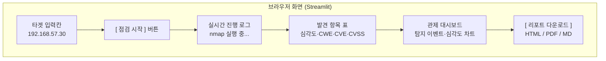
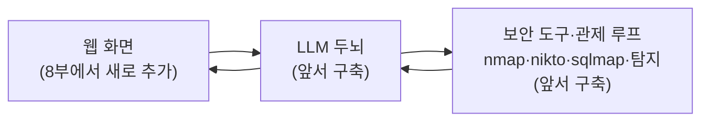

# Streamlit 대시보드 — 점검·탐지·리포트를 화면에

지금까지(00~22강)에 걸쳐 우리는 **터미널에서 도는 자동화**를 차곡차곡 완성해 왔습니다.

- **2~3부**에서는 정찰→스캔→검증→리포트까지 스스로 해내는 **자율 점검 에이전트**를 만들었습니다.
- **5~7부**에서는 로그를 받아 탐지하고 분류하고 대응까지 잇는 **탐지/관제 루프**를 만들었습니다.

```text
$ python agent.py "192.168.57.30 의 DVWA를 점검하고 리포트를 써줘"
```

이 한 줄이면 에이전트가 스스로 점검을 끝까지 해냅니다. 훌륭한 도구입니다. 하지만 **터미널을 쓰는 사람만 쓸 수 있는 도구**이기도 합니다. 터미널이 익숙하지 않은 동료에게 "이거 한번 돌려 봐"라고 건네기는 어렵습니다. 결과도 까만 화면에 글자로만 쏟아집니다.

이번 글부터 시작하는 **8부(웹 대시보드 제품화)**의 목표는 분명합니다.

> **앞서 만든 점검 에이전트(2~3부)와 탐지/관제 루프(5~7부)를, 누구나 브라우저에서 클릭으로 쓰는 "웹 대시보드"로 옮깁니다.**
{: .prompt-info }

즉, 8부는 새로운 점검 기능이나 탐지 로직을 더 만드는 단계가 아닙니다. **이미 터미널에서 도는 것들을 "화면으로" 옮기는** 단계입니다.

> **🎯 우리가 지금 왜 이걸 하나요?**  
> 아무리 좋은 도구라도 **남들이 못 쓰면 절반의 도구**입니다. 보안 점검·탐지 결과는 결국 개발자·관리자·경영진처럼 터미널을 안 쓰는 사람에게 전달돼야 하니까요. 화면으로 보여주고, 표로 정리하고, 리포트로 내보낼 수 있어야 "쓸모 있는 결과"가 됩니다. 8부는 바로 그 "전달"을 만드는 과정입니다. 무거운 웹 개발은 하지 않습니다. 파이썬만으로 화면이 만들어지는 도구를 씁니다.
{: .prompt-info }

이 글에서 다루는 것:

1. 8부에서 우리가 만들 것 (전체 그림)
2. 왜 Streamlit인가
3. Streamlit 설치
4. 첫 화면 만들기 — 입력 → 버튼 → 반응
5. 꼭 알아야 할 한 가지 — "Streamlit은 위에서 아래로 다시 읽는다"
6. 8부 전체 로드맵

---

## 1. 8부에서 우리가 만들 것

최종 결과물은 이런 화면입니다. (여러 강에 걸쳐 한 조각씩 만듭니다.)



먼저 중요한 점 하나를 못 박습니다.

> **우리는 앞서 만든 점검·탐지 코드를 다시 만들지 않습니다.** 이미 만든 에이전트(2~3부)와 관제 루프(5~7부)를 그대로 두고, 그 **앞에 "화면"이라는 옷만 입힙니다.** 새로 배우는 건 "화면 만드는 법"이지 "점검·탐지하는 법"이 아닙니다.
{: .prompt-tip }

그림으로 보면 이렇습니다. 앞서 만든 두뇌·손발은 그대로, 맨 앞에 화면만 추가됩니다.



---

## 2. 왜 Streamlit인가

화면을 만드는 방법은 많습니다. 보통 "웹 화면"이라고 하면 HTML·CSS·JavaScript를 배우고, 백엔드 서버를 따로 띄우고… 할 일이 많습니다. **우리는 그걸 전부 건너뜁니다.**

> **Streamlit** = **파이썬 코드만으로** 웹 화면을 만드는 도구입니다.  
> HTML도, JavaScript도, 서버 설정도 필요 없습니다. `st.button("점검 시작")` 한 줄이면 진짜 버튼이 화면에 생깁니다.
{: .prompt-info }

우리에게 Streamlit이 잘 맞는 이유는 다음과 같습니다.

| 이유 | 설명 |
|---|---|
| **파이썬만으로 끝** | 앞서 쓰던 그 파이썬 지식 그대로 화면을 만듭니다 |
| **한 파일로 완결** | `app.py` 하나에 화면과 로직이 같이 있어 흐름이 한눈에 보입니다 |
| **표·차트가 기본 제공** | 발견 항목 표, 심각도 차트가 함수 한 줄로 됩니다 |
| **실시간 표시가 쉽다** | "nmap 실행 중…" 같은 진행 상황 표시가 간단합니다 |

> 실무에서 본격적인 대규모 서비스를 만들 땐 다른 기술(예: FastAPI + 프론트엔드)을 쓰기도 합니다. 하지만 **"내부 점검·관제 도구를 빠르게 화면으로 만든다"**는 우리 목적에는 Streamlit이 가장 적합합니다. 실제로 보안 분석가들이 내부 도구를 Streamlit으로 많이 만듭니다.
{: .prompt-tip }

---

## 3. Streamlit 설치

앞서 만든 **파이썬 가상환경**을 그대로 씁니다. (작업 폴더로 이동한 뒤 가상환경을 켭니다.)

```bash
# Kali(192.168.57.10)에서 실행
# 앞서 만든 작업 폴더로 이동
cd ~/ai-pentest

# 가상환경 켜기
source .venv/bin/activate

# Streamlit 설치
pip install streamlit
```

설치가 끝났는지 버전으로 확인합니다.

```bash
streamlit --version
```

다음처럼 버전 숫자가 나오면 성공입니다.

```text
Streamlit, version 1.40.2
```

> **`pip install`이 안 되거나 권한 오류가 난다면?**  
> 가상환경이 켜져 있는지 먼저 확인합니다. 프롬프트 맨 앞에 `(.venv)` 표시가 보여야 합니다. 안 보이면 `source .venv/bin/activate`를 다시 실행합니다.
{: .prompt-warning }

---

## 4. 첫 화면 만들기 — 입력 → 버튼 → 반응

이제 가장 작은 화면을 만듭니다. 목표는 단순합니다.

- 점검할 **대상 IP를 입력**하는 칸
- **[점검 시작]** 버튼
- 버튼을 누르면 **"OOO 점검을 준비합니다"**라고 화면에 표시

아직 실제 스캔은 하지 않습니다. **화면의 뼈대**만 먼저 세웁니다. (실제 에이전트 연결은 다음 강 이후에서 합니다.)

작업 폴더에 `app.py` 파일을 새로 만들고, 아래 내용을 **그대로** 적습니다.

```python
# app.py
import streamlit as st

# 1) 화면 맨 위 제목
st.title("🛡️ AI 웹 취약점 스캐너")
st.caption("앞서 만든 점검 에이전트를, 이제 화면에서 씁니다")

# 2) 대상 IP를 입력받는 칸
target = st.text_input(
    "점검할 대상 주소",
    value="192.168.57.30",          # 기본값 (우리 랩의 DVWA)
    help="VirtualBox 랩 안의 본인 소유 대상만 입력하세요",
)

# 3) 점검 시작 버튼
if st.button("점검 시작", type="primary"):
    # 버튼을 눌렀을 때만 이 안이 실행됩니다
    st.success(f"✅ {target} 점검을 준비합니다.")
    st.write("아직은 화면만 만든 단계입니다. 실제 스캔은 다음 강에서 연결합니다.")
```

저장한 뒤, 터미널에서 다음을 실행합니다.

```bash
streamlit run app.py
```

그러면 자동으로 브라우저가 열리고(안 열리면 터미널에 표시된 `http://localhost:8501` 주소를 직접 엽니다), 우리가 만든 화면이 나타납니다.

- 입력칸에 `192.168.57.30`이 들어 있고
- **[점검 시작]** 버튼이 보이고
- 버튼을 누르면 초록색 **"✅ 192.168.57.30 점검을 준비합니다."** 메시지가 뜹니다

축하합니다. **방금 첫 웹 화면을 만들었습니다.** 코드는 단 12줄이고, 전부 파이썬입니다.

> **방금 쓴 함수 3개만 기억하면 됩니다.**  
> `st.title(...)` 큰 제목 / `st.text_input(...)` 입력칸 (사용자가 친 값을 돌려줍니다) / `st.button(...)` 버튼 (눌리면 `True`).  
> Streamlit의 거의 모든 것이 이렇게 **`st.무언가(...)` 한 줄 = 화면 요소 하나** 형태입니다.
{: .prompt-info }

---

## 5. 꼭 알아야 할 한 가지 — "Streamlit은 위에서 아래로 다시 읽는다"

여기서 Streamlit을 쓸 때 **반드시 이해해야 하는 동작 방식** 하나를 짚습니다. 처음엔 낯설지만, 이걸 모르면 나중에 꼭 헤맵니다.

> **버튼을 누르거나 입력칸을 바꿀 때마다, Streamlit은 `app.py` 전체를 처음부터 끝까지 "다시 한 번" 실행합니다.**  
> 이 다시 실행을 **rerun(재실행)**이라고 부릅니다.
{: .prompt-warning }

즉, 일반 프로그램처럼 "버튼이 눌리면 그 부분만 실행"되는 게 아니라, **매번 스크립트 전체가 위에서 아래로 다시 흐릅니다.** 그 흐름 도중에 `st.button(...)`이 "이번에 눌렸으면 `True`"를 돌려주는 것입니다.

이걸 눈으로 확인해 봅니다. `app.py` 맨 아래에 한 줄을 추가합니다.

```python
# app.py 맨 아래에 추가
import datetime
st.write("👇 이 줄은 화면을 건드릴 때마다 다시 실행됩니다.")  # ← 새로 추가
st.write("마지막 실행 시각:", datetime.datetime.now().strftime("%H:%M:%S"))  # ← 새로 추가
```

저장하면 브라우저가 자동으로 갱신됩니다(Streamlit은 파일이 바뀌면 알아서 다시 읽습니다). 이제 입력칸 글자를 바꾸거나 버튼을 눌러 보면, **"마지막 실행 시각"의 시간이 매번 바뀝니다.** 화면을 건드릴 때마다 스크립트 전체가 다시 실행된다는 증거입니다.

> **왜 이걸 지금 강조하나요?**  
> 이 "매번 전체 재실행" 때문에, 나중에 **"스캔·탐지 결과를 화면에 계속 남겨두기"**가 까다로워집니다. 재실행되면 이전 결과가 사라지기 때문입니다. 그래서 결과를 기억해 두는 장치(`st.session_state`)가 필요한데, 그건 실제로 필요해질 때 배웁니다. **지금은 "Streamlit은 매번 처음부터 다시 읽는다"만 기억하면 충분합니다.**
{: .prompt-tip }

---

## 6. 8부 전체 로드맵

| 강 | 제목 | 이 강의가 끝나면 화면에… |
|---|---|---|
| **23** | Streamlit 대시보드 — 첫 화면 (이 글) | 입력칸·버튼이 생깁니다 |
| **24** | 스캔 결과를 표로 — 발견 항목과 CWE/CVE 컬럼 | 발견 표에 **CWE·CVE 컬럼**이 붙습니다 |
| **25** | 심각도 차트·필터 | **심각도 차트·필터**가 생깁니다 |
| **26** | 관제 대시보드 — 탐지 이벤트 화면 | 탐지/관제 루프 결과가 **이벤트 표·차트**로 보입니다 |
| **27** | 리포트 내보내기 — HTML / PDF / MD | **리포트 다운로드** 버튼이 생깁니다 |

> 8부의 규칙: **매 강의가 끝날 때마다 화면에 새로운 무언가가 보입니다.** 이론만 쌓다가 한참 뒤에 실행하는 일은 없습니다. 항상 `streamlit run app.py`로 결과를 직접 보며 진행합니다.
{: .prompt-info }

> 화면에 얹을 재료는 이미 다 있습니다. 점검 결과는 **도구 호출(08강)**과 **리포트(14강)**에서, 탐지 결과는 **Triage(17강)**와 **자동 관제(21강)**에서 만든 것을 그대로 끌어다 씁니다.
{: .prompt-tip }

---

## 7. 다음 강의 예고

다음 **24강**에서는 스캔 결과를 화면의 **표(table)**로 보여 줍니다. 단순히 글자로 쏟아내는 대신, **발견 항목 한 줄 = 표의 한 행**으로 정리하고 거기에 **CWE/CVE 컬럼**을 붙입니다. "이건 어떤 종류의 약점인지(CWE), 알려진 취약점인지(CVE)"가 한눈에 들어오는 화면을 만드는 것이 목표입니다.

작은 것부터, 하나씩. 첫 화면을 만들었으니 절반은 온 셈입니다.

---

## 참고 자료

- Streamlit — <https://streamlit.io/>
- Streamlit 공식 문서 — <https://docs.streamlit.io/>
- `st.session_state` (상태 유지) — <https://docs.streamlit.io/develop/concepts/architecture/session-state>
- Streamlit 실행 모델(rerun) — <https://docs.streamlit.io/develop/concepts/architecture/run-your-app>
