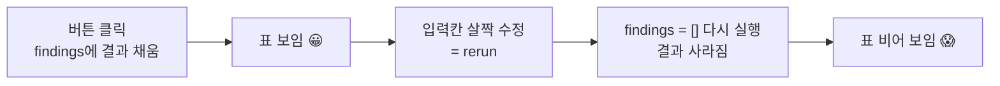

# 스캔 결과를 표로 — 발견 항목과 CWE/CVE 컬럼

23강에서 우리는 입력칸과 버튼이 있는 첫 화면을 만들었습니다. 대상 IP를 적고 **[점검 시작]**을 누르면 "준비합니다"라는 메시지가 떴습니다. 화면의 뼈대가 생긴 것입니다.

그런데 지금 상태로는 **버튼을 눌러도 보여줄 "결과"가 없습니다.** 실제 점검(10~12강)은 발견 항목을 잔뜩 쏟아냅니다. 문제는 그 결과가 보통 **JSON이나 긴 텍스트** 형태라는 점입니다.

```text
[{"name": "SQL Injection", "severity": "Critical", "cwe": "CWE-89",
"cve": "-", "cvss": 9.8, "url": "/vulnerabilities/sqli/",
"desc": "id 파라미터에 SQL 구문이 그대로 들어갑니다"}, {"name": "Reflected XSS",
"severity": "High", "cwe": "CWE-79", ...
```

사람이 이걸 그대로 읽고 "무엇부터 고칠지" 판단할 수 있을까요? 거의 불가능합니다. 한 줄로 길게 이어진 글자 더미는 **비교가 안 됩니다.** Critical이 몇 개인지, 같은 종류(CWE)가 몇 번 나왔는지, 어느 URL이 가장 위험한지 — 눈으로 훑어서는 알 수 없습니다.

> **🎯 우리가 지금 왜 이걸 하나요?**  
> 보안 점검 결과는 결국 **"무엇을 먼저 고칠 것인가"**라는 의사결정에 쓰입니다. 그러려면 결과가 **한눈에 비교 가능한 표**여야 합니다. 심각도가 한 칸에 정렬돼 있고, CWE/CVE가 옆에 붙어 있어야 "이건 알려진 취약점이고 점수가 9.8이니 먼저"라고 판단할 수 있습니다. 줄글로 쏟아진 JSON은 데이터일 뿐, 아직 "판단에 쓸 수 있는 정보"가 아닙니다. 이번 강의는 그 데이터를 **표(table)**로 바꿔 "정보"로 만드는 과정입니다.
{: .prompt-info }

이 글에서 다루는 것:

1. 발견 항목 데이터 모델 — 점검 결과를 어떤 모양으로 담을까
2. ★새 개념 `st.session_state` — 재실행(rerun) 사이에 결과를 기억하기
3. Step-by-Step — 버튼 → 결과 저장 → 표 표시 → 컬럼 다듬기 → 개수 요약
4. 점검 인사이트 — 표의 각 행이 CWE/CVE로 분류돼야 우선순위가 보인다

---

## 1. 발견 항목 데이터 모델

표를 만들기 전에, **"한 줄(한 행)에 무엇을 담을지"**부터 정해야 합니다. 표의 한 행은 **발견 항목 하나**입니다. 그리고 각 행에는 다음 정보를 담습니다.

| 컬럼(키) | 의미 | 어디서 나온 개념인가 |
|---|---|---|
| **name** (취약점명) | 무엇이 발견됐는지 (예: SQL Injection) | 점검 결과(10~12강) |
| **severity** (심각도) | Critical / High / Medium / Low | 우선순위 판단의 핵심 |
| **cwe** (CWE) | 약점의 "종류" 분류 (예: CWE-89) | 03강·10~12강 |
| **cve** (CVE) | 알려진 개별 취약점 번호 (없으면 `"-"`) | 03강·14강 |
| **cvss** (CVSS) | 위험 점수 0~10 (숫자) | 03강·14강 |
| **url** (위치) | 어디서 발견됐는지 | 점검 결과 |
| **desc** (설명) | 한 줄 요약 | 리포트(14강) |

> **CWE와 CVE를 다시 짚으면(03강)**  
> **CWE**(Common Weakness Enumeration)는 "약점의 종류"입니다. 예를 들어 "SQL 구문이 그대로 들어가는 문제"는 전부 **CWE-89**입니다. 즉 **유형 분류**입니다.  
> **CVE**(Common Vulnerabilities and Exposures)는 "특정 제품의 특정 취약점"에 붙는 **개별 번호**입니다. 예: `CVE-2021-44228`(Log4Shell). 우리가 직접 찾은 일반 발견에는 CVE가 없을 수도 있습니다(빈칸).  
> **CVSS**는 그 취약점이 **얼마나 위험한지 0~10으로 매긴 점수**입니다. 숫자가 클수록 위험합니다.
{: .prompt-tip }

파이썬에서 이 데이터는 **dict 여러 개를 담은 리스트**로 표현하기 딱 좋습니다. dict 하나가 표의 한 행입니다.

```python
# 발견 항목 하나 = dict 하나 = 표의 한 행
{
    "name": "SQL Injection",                  # 취약점명
    "severity": "Critical",                   # Critical / High / Medium / Low
    "cwe": "CWE-89",                          # 약점 종류
    "cve": "-",                              # 알려진 취약점 번호 (없으면 "-")
    "cvss": 9.8,                             # 위험 점수 0~10
    "url": "/vulnerabilities/sqli/",          # 발견 위치
    "desc": "id 파라미터에 SQL 구문이 그대로 전달됩니다",  # 한 줄 설명
}
```

> **잠깐 — 지금은 "예시 데이터"로 시작합니다.**  
> 실제 점검 에이전트(08강 도구 호출)와 관제 루프(21강)를 화면에 연결하는 건 26강 이후입니다. 지금 그 둘을 한꺼번에 붙이면 "표 만드는 법"과 "에이전트 연결"이 뒤섞여 헷갈립니다. 그래서 이번 강의는 **점검 결과처럼 생긴 예시 findings**로 표 만드는 법에만 집중합니다. 나중에 이 예시 자리에 진짜 에이전트 결과를 끼워 넣기만 하면 화면은 그대로 동작합니다.
{: .prompt-warning }

---

## 2. ★새 개념 — `st.session_state` (결과를 기억하기)

여기서 23강에서 강조했던 한 가지를 다시 꺼냅니다.

> **Streamlit은 화면을 건드릴 때마다 `app.py` 전체를 처음부터 다시 실행합니다(rerun).**
{: .prompt-warning }

이 성질이 표를 만들 때 곧바로 문제를 일으킵니다. 다음 코드를 상상해 봅시다.

```python
# (문제가 있는 코드)
findings = []                      # 매 실행마다 다시 빈 리스트가 됩니다

if st.button("점검 시작"):
    findings = make_findings()     # 버튼 누르면 결과를 담고

st.dataframe(findings)            # 표로 보여줍니다
```

버튼을 누른 그 순간에는 `findings`에 결과가 들어가 표가 보입니다. 그런데 그 뒤에 **입력칸 글자를 한 글자만 바꿔도** Streamlit은 스크립트를 처음부터 다시 읽습니다. 그러면 맨 윗줄 `findings = []`가 다시 실행돼 **결과가 빈 리스트로 초기화**됩니다. 버튼은 이번엔 안 눌렸으니 `make_findings()`도 안 돕니다. **표가 사라집니다.**



이걸 막으려면, **재실행 사이에도 살아남는 저장 공간**이 필요합니다. 그게 바로 `st.session_state`입니다.

> **`st.session_state`** 는 Streamlit이 제공하는 **"이 사용자의 화면이 살아 있는 동안 값을 유지해 주는 서랍"**입니다.  
> 일반 변수(`findings = ...`)는 rerun 때마다 초기화되지만, `st.session_state["findings"]`에 넣어 둔 값은 **rerun이 일어나도 그대로 남습니다.** 마치 파이썬 dict처럼 `st.session_state["키"] = 값`으로 쓰고 `st.session_state["키"]`로 읽습니다.
{: .prompt-info }

정리하면 전략은 이렇습니다.

- **버튼을 눌렀을 때만** 결과를 만들어 `st.session_state["findings"]`에 **저장**한다.
- 화면을 그릴 땐 **`st.session_state`에 결과가 있으면** 그걸 꺼내 표로 보여 준다.

이러면 버튼을 한 번 누른 뒤에는, 입력칸을 만지든 다른 버튼을 누르든 **표가 계속 남아 있습니다.**

---

## 3. Step-by-Step

23강에서 만든 `app.py`를 이어받아 고칩니다. 한 단계씩, 코드를 적고 → 화면이 어떻게 보이는지 확인합니다.

### 3-1. 예시 findings를 만드는 함수

먼저 "점검 결과처럼 생긴" 예시 데이터를 돌려주는 함수를 만듭니다. (나중에 이 함수 속을 진짜 에이전트 호출로 바꾸면 됩니다.)

```python
# app.py
import streamlit as st

st.title("🛡️ AI 웹 취약점 스캐너")
st.caption("스캔 결과를 표로 정리합니다")

# 심각도 정렬·표시 기준 순서 (위험한 것부터) — 8부 전체 공용 상수
SEVERITY_ORDER = ["Critical", "High", "Medium", "Low"]

target = st.text_input("점검할 대상 주소", value="192.168.0.30")


def run_scan(target: str) -> list[dict]:
    """(임시) 점검 결과처럼 생긴 예시 findings를 돌려줍니다.
    나중에 이 안을 08강 도구 호출 에이전트로 교체합니다."""
    return [
        {"name": "SQL Injection",    "severity": "Critical", "cwe": "CWE-89",
         "cve": "-",               "cvss": 9.8, "url": "/vulnerabilities/sqli/",
         "desc": "id 파라미터에 SQL 구문이 그대로 전달됩니다"},
        {"name": "Reflected XSS",    "severity": "High",     "cwe": "CWE-79",
         "cve": "-",               "cvss": 7.4, "url": "/vulnerabilities/xss_r/",
         "desc": "입력값이 이스케이프 없이 화면에 출력됩니다"},
        {"name": "Command Injection","severity": "Critical", "cwe": "CWE-78",
         "cve": "-",               "cvss": 9.1, "url": "/vulnerabilities/exec/",
         "desc": "입력값이 셸 명령에 그대로 이어 붙습니다"},
        {"name": "Outdated Apache",  "severity": "Medium",   "cwe": "CWE-1104",
         "cve": "CVE-2021-41773",  "cvss": 5.3, "url": "/",
         "desc": "오래된 Apache 버전으로 알려진 취약점이 있습니다"},
        {"name": "Directory Listing","severity": "Low",      "cwe": "CWE-548",
         "cve": "-",               "cvss": 3.7, "url": "/config/",
         "desc": "디렉터리 목록이 외부에 노출됩니다"},
    ]
```

> 컬럼 키(`"name"`, `"severity"` …)를 **모든 dict에서 똑같이** 맞추는 게 중요합니다. Streamlit은 이 키들을 **표의 열 이름**으로 그대로 씁니다. 키가 어긋나면 표의 칸이 비어 보입니다. 이 7개 키(`name`·`severity`·`cwe`·`cve`·`cvss`·`url`·`desc`)는 25·26·27강에서도 **그대로** 재사용하니, 여기서 정한 이름을 끝까지 유지합니다.
{: .prompt-tip }

### 3-2. 버튼을 누르면 결과를 `session_state`에 저장

이제 23강의 버튼 자리를, **결과를 `session_state`에 저장**하도록 바꿉니다.

```python
# app.py (이어서)

# 점검 시작 버튼: 누른 순간에만 결과를 만들어 session_state에 저장
if st.button("점검 시작", type="primary"):
    with st.spinner(f"{target} 점검 중..."):
        findings = run_scan(target)            # (지금은 예시 결과)
    st.session_state["findings"] = findings    # ← rerun이 일어나도 남도록 저장
    st.success(f"✅ {target} 점검 완료 — {len(findings)}건 발견")
```

화면에 이렇게 보입니다. **[점검 시작]**을 누르면 잠깐 "점검 중..." 스피너가 돌고, 곧 초록색 **"✅ 192.168.0.30 점검 완료 — 5건 발견"** 메시지가 뜹니다. 아직 표는 안 나옵니다(다음 단계에서 그립니다). 하지만 결과는 **서랍(`session_state`)에 안전하게 들어간** 상태입니다.

### 3-3. 결과가 있으면 표로 표시 (`st.dataframe`)

이제 화면 아래쪽에서, **서랍에 결과가 있으면** 꺼내 표로 그립니다. 이 부분은 **버튼 `if` 바깥**에 두는 게 핵심입니다. 그래야 버튼을 안 누른 rerun에서도 표가 계속 보입니다.

```python
# app.py (이어서) — 버튼 if 블록 "바깥"에 둡니다

# session_state에 결과가 있을 때만 표를 그립니다
if "findings" in st.session_state:
    findings = st.session_state["findings"]
    st.subheader("📋 발견 항목")
    st.dataframe(findings, use_container_width=True)
else:
    st.info("위에서 [점검 시작]을 누르면 발견 항목이 표로 나타납니다.")
```

화면에 이렇게 보입니다. 점검을 한 번 누른 뒤에는 **발견 항목 5건이 표로** 깔끔하게 나옵니다. 각 dict가 한 행이고, dict의 키가 열 이름(name·severity·cwe·cve·cvss·url·desc)입니다. 표 오른쪽 위에는 정렬·검색·전체화면 아이콘이 자동으로 붙습니다. 이제 **입력칸 글자를 바꿔도(=rerun) 표가 사라지지 않습니다.** `session_state` 덕분입니다.

> **`use_container_width=True`** 는 표를 화면 가로폭에 꽉 차게 늘려 줍니다. 컬럼이 많을 때 가로 스크롤 없이 보기 편해집니다.
{: .prompt-tip }

### 3-4. 컬럼을 보기 좋게 — `column_config`

기본 표도 충분히 읽을 만하지만, 두 가지가 아쉽습니다. (1) 컬럼 순서가 dict 키 순서 그대로라 **중요한 심각도·CVSS가 한눈에 안 들어옵니다.** (2) CVSS가 그냥 숫자라 **얼마나 위험한지 감이 안 옵니다.**

`st.dataframe`의 **`column_config`**로 컬럼 이름·순서·표시 방식을 다듬습니다.

```python
# app.py (3-3의 st.dataframe 부분을 아래로 교체)

if "findings" in st.session_state:
    findings = st.session_state["findings"]
    st.subheader("📋 발견 항목")
    st.dataframe(
        findings,
        use_container_width=True,
        hide_index=True,                          # 맨 앞 번호(인덱스) 숨기기
        column_order=["severity", "name", "cwe", "cve", "cvss", "url", "desc"],
        column_config={
            "severity": st.column_config.TextColumn("심각도", width="small"),
            "name":     st.column_config.TextColumn("취약점명"),
            "cwe":      st.column_config.TextColumn("CWE", help="약점의 종류 분류"),
            "cve":      st.column_config.TextColumn("CVE", help="알려진 개별 취약점 번호"),
            "cvss":     st.column_config.ProgressColumn(   # 숫자 + 막대로 위험도 표시
                "CVSS",
                help="위험 점수 (0~10, 높을수록 위험)",
                min_value=0.0,
                max_value=10.0,
                format="%.1f",
            ),
            "url":      st.column_config.TextColumn("위치"),
            "desc":     st.column_config.TextColumn("설명"),
        },
    )
```

화면에 이렇게 보입니다.

- 컬럼이 **심각도 → 취약점명 → CWE → CVE → CVSS → …** 순서로 재배치돼, 왼쪽부터 "얼마나 급한가 / 무엇인가 / 어떤 종류인가"가 자연스럽게 읽힙니다.
- 맨 앞의 번호(인덱스) 열이 사라져 깔끔합니다.
- **CVSS 칸이 막대그래프처럼** 보입니다. 9.8은 칸이 거의 꽉 차고, 3.7은 짧게 차서 **숫자를 안 읽어도 위험도가 한눈에** 들어옵니다.
- CWE·CVE 열 머리글에 마우스를 올리면 도움말이 떠서, 처음 보는 사람도 의미를 알 수 있습니다.

> **`ProgressColumn`은 "숫자 + 시각화"를 한 번에** 해 줍니다. CVSS처럼 0~10 같은 정해진 범위가 있는 점수에 잘 맞습니다. `min_value`·`max_value`를 0~10으로 정해 주었기 때문에, 막대 길이가 실제 위험도 비율과 일치합니다.
{: .prompt-tip }

### 3-5. 발견 개수 요약 — `st.metric`

표만으로도 충분하지만, 표 위에 **"총 몇 건인지"**를 큰 숫자로 한 줄 얹으면 화면을 열자마자 규모가 보입니다. `st.metric`을 씁니다.

```python
# app.py — 3-4의 st.subheader 바로 위에 추가

if "findings" in st.session_state:
    findings = st.session_state["findings"]

    # 심각도별로 몇 건인지 세기
    crit = sum(1 for f in findings if f["severity"] == "Critical")
    high = sum(1 for f in findings if f["severity"] == "High")

    # 한 줄에 지표 3개를 나란히 (st.columns로 가로 배치)
    c1, c2, c3 = st.columns(3)
    c1.metric("총 발견", f"{len(findings)}건")
    c2.metric("Critical", f"{crit}건")
    c3.metric("High", f"{high}건")

    st.subheader("📋 발견 항목")
    # ... (3-4의 st.dataframe 그대로) ...
```

화면에 이렇게 보입니다. 표 위에 **"총 발견 5건 / Critical 2건 / High 1건"**이 큼직한 숫자 카드 세 개로 가로로 나란히 뜹니다. 표를 자세히 보기 전에도 **"급한 게 몇 개인지"**가 즉시 들어옵니다.

> **`st.columns(3)`** 은 화면을 세로 칸 3개로 나눠 줍니다. 반환된 `c1, c2, c3`에 각각 `.metric(...)`을 호출하면 지표가 **가로로 나란히** 놓입니다. 이렇게 화면을 칸으로 나누는 방법은 25강의 차트 배치에서도 다시 씁니다.
{: .prompt-tip }

---

## 4. 점검 인사이트 — CWE/CVE가 붙어야 우선순위가 보인다

이제 화면에는 발견 항목이 **표**로, 그것도 **심각도·CWE·CVE·CVSS 컬럼이 정렬된 형태**로 보입니다. 23강 시작에서 봤던 줄글 JSON과 비교하면, 같은 데이터인데도 **읽고 판단하는 비용이 완전히 달라졌습니다.**

핵심은 **각 행이 03강의 CWE/CVE 체계로 분류돼 있다**는 점입니다. 이것이 "무엇을 먼저 고칠지"를 정하는 근거가 됩니다.

- **CVSS 점수**로 1차 정렬하면 "객관적으로 가장 위험한 것"이 위로 옵니다 (SQLi 9.8, CmdI 9.1 …).
- **CWE**로 묶어 보면 "같은 종류의 약점이 여러 곳에서 반복되는지"가 보입니다. 같은 CWE가 여러 줄이면, 개별 패치보다 **공통 원인(예: 입력 검증 누락)**을 고치는 게 효율적입니다.
- **CVE가 있는 행**은 "이미 세상에 공개된 알려진 취약점"이라 공격 코드가 돌아다닐 가능성이 큽니다. CVSS가 중간이어도 **우선순위를 올려 잡아야** 할 수 있습니다.

> **표 = 의사결정 도구.** 점검의 가치는 "취약점을 찾는 것"에서 끝나지 않고, "**한정된 시간에 무엇부터 고칠지 정하는 것**"까지 갑니다. 그 판단을 가능하게 하는 최소 단위가 바로 이 표입니다. 줄글이 아니라 **비교 가능한 표**여야 하는 이유입니다.
{: .prompt-info }

다만 지금은 **사람이 표의 정렬 아이콘을 직접 눌러** 우선순위를 봐야 합니다. 다음 강의에서는 이걸 **자동으로 시각화**합니다.

---

## 5. 다음 강의 예고

다음 **25강**에서는 이 표를 한 단계 더 끌어올립니다.

- **심각도 차트** — Critical/High/Medium/Low가 각각 몇 건인지 **막대(또는 도넛) 차트**로 한눈에 보여 줍니다.
- **필터** — "Critical만 보기", "특정 CWE만 보기"처럼 화면에서 **클릭으로 추려 보는** 기능을 붙입니다.

표가 "전체 목록"이라면, 25강은 그 위에 **"우선순위를 한눈에 보는 시각화"**를 얹는 단계입니다. 이번 강에서 만든 `session_state` 속 findings를 그대로 재료로 씁니다.

작은 것부터, 하나씩. 줄글이던 결과가 이제 **판단에 쓸 수 있는 표**가 됐습니다.

---

## 참고 자료

- Streamlit `st.dataframe` — <https://docs.streamlit.io/develop/api-reference/data/st.dataframe>
- Streamlit `st.column_config` — <https://docs.streamlit.io/develop/api-reference/data/st.column_config>
- Streamlit Session State — <https://docs.streamlit.io/develop/api-reference/caching-and-state/st.session_state>
- Streamlit `st.metric` — <https://docs.streamlit.io/develop/api-reference/data/st.metric>
- MITRE CWE — <https://cwe.mitre.org/>
