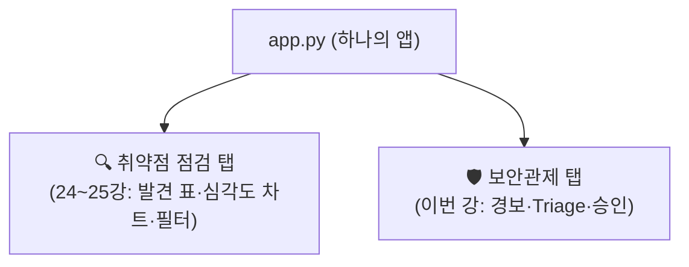
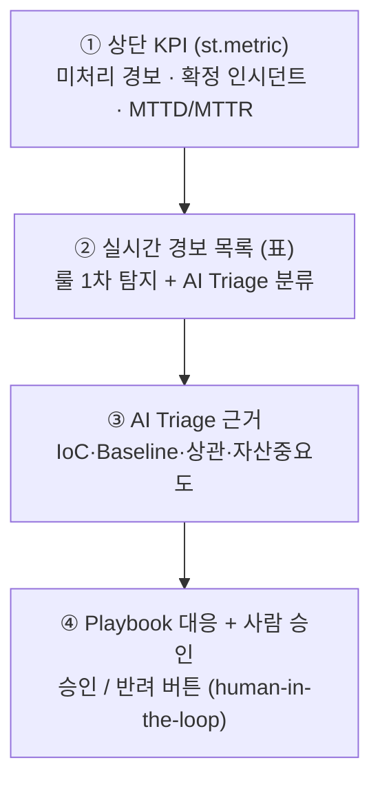
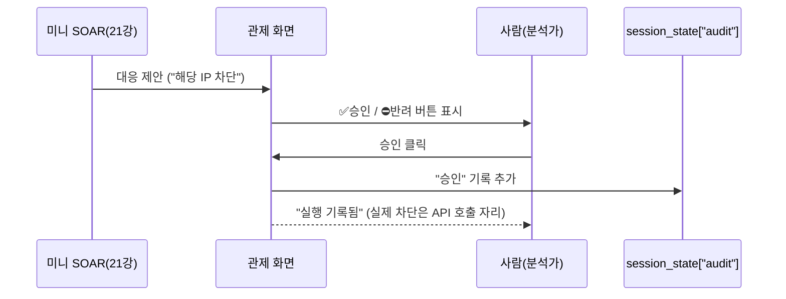

# 관제 대시보드 — 탐지·선별·대응을 한 화면에

24~25강에서 우리는 "점검 결과"를 화면에 담았습니다. 스캔으로 찾아낸 발견 항목을 표로 보여 주고, 심각도 차트로 한눈에 정리하고, 필터로 원하는 것만 골라 보는 화면까지 만들었습니다. 점검은 **"한 번 돌리고 끝나는 작업"** 이라 이 정도면 충분했습니다.

이번 강의는 다릅니다. 우리가 화면에 올리는 것은 **7부에서 만든 자동화된 보안관제(21강 미니 SOAR)** 입니다.

> **🎯 우리가 지금 왜 이걸 하나요?**  
> 점검과 관제는 성격이 다릅니다. 점검은 가끔 돌리지만, **관제는 24시간 멈추지 않는 상시 감시**입니다. 21강에서 만든 미니 SOAR는 1분마다 로그를 돌면서 경보를 만들고, AI가 선별하고, 대응을 제안합니다. 그런데 이 모든 게 터미널 글자로만 흐르면 사람이 따라갈 수가 없습니다. 경보가 쏟아질 때 **"지금 가장 위험한 게 무엇이고, 무엇을 승인해야 하는지"** 를 한 화면에서 즉시 보고 빠르게 결정할 수 있어야 합니다. 그래야 MTTD·MTTR(20강)이 실제로 줄어듭니다. 이번 강의는 그 "결정의 화면"을 만듭니다.
{: .prompt-info }

이 글에서 다루는 것:

1. 점검 화면과 관제 화면을 한 앱에서 나누기 (멀티 화면)
2. 관제 탭의 구성요소 — KPI · 경보 목록 · Triage 근거 · 승인 게이트
3. Step-by-Step — 탭 추가 → KPI → 경보 표 → 승인 버튼
4. 좋은 관제 화면이란 무엇인가 (인사이트)

---

## 1. 한 앱, 두 화면 — st.tabs로 나누기

지금까지 만든 `app.py`에는 점검 기능(24~25강)이 들어 있습니다. 여기에 관제 기능을 **별도 페이지처럼** 더해야 합니다. 그렇다고 앱을 두 개로 나누면, 동료에게 "점검은 이 주소, 관제는 저 주소"라고 두 번 안내해야 합니다. 불편합니다.

그래서 **하나의 `app.py` 안에서 화면만 전환**합니다. Streamlit은 이걸 아주 간단하게 해 줍니다.

> **`st.tabs(...)`** 는 화면 위쪽에 탭을 만들어 줍니다.  
> 탭을 클릭하면 그 탭의 내용만 보입니다. 점검과 관제를 한 앱에 담되, 서로 섞이지 않게 칸막이를 치는 것입니다.
{: .prompt-info }



코드로는 이렇게 시작합니다. 기존 점검 화면 코드를 첫 번째 탭 안으로 들여놓고, 두 번째 탭을 새로 만듭니다.

```python
# app.py — 화면을 두 탭으로 나눈다
import streamlit as st

st.set_page_config(page_title="AI 보안 대시보드", layout="wide")
st.title("🛡️ AI 보안 자동화 대시보드")

# 탭 두 개를 만든다 (왼쪽부터 순서대로)
tab_scan, tab_soc = st.tabs(["🔍 취약점 점검", "🛡️ 보안관제"])

with tab_scan:
    # 24~25강에서 만든 점검 화면 코드가 여기에 들어갑니다.
    # 이 탭은 st.session_state["findings"] 를 사용합니다.
    st.subheader("취약점 점검")
    st.caption("스캔 결과 표·심각도 차트·필터 (24~25강)")
    # ... (앞서 만든 발견 항목 표, 차트, 필터 코드) ...

with tab_soc:
    # 이번 강에서 만들 관제 화면이 여기에 들어갑니다.
    # 이 탭은 st.session_state["alerts"] 와 st.session_state["audit"] 를 사용합니다.
    st.subheader("보안관제 (미니 SOAR)")
    st.caption("실시간 경보 · AI Triage · 대응 승인")
    # ↓ 아래에서 한 조각씩 채웁니다.
```

> `st.sidebar`(왼쪽 사이드바)로 메뉴를 만들어 화면을 전환할 수도 있습니다. 기능이 두세 개면 `st.tabs`가 더 간단하고, 페이지가 많아지면 사이드바 방식이 깔끔합니다. 우리는 점검·관제 두 개뿐이라 **탭**을 씁니다.
{: .prompt-tip }

`with tab_soc:` 블록 안에 들어가는 코드만 이번 강의에서 다룹니다. 점검 탭은 24~25강에서 만든 그대로 둡니다.

---

## 2. 관제 탭에는 무엇이 들어가나

관제 화면은 정보를 그냥 쏟아내면 안 됩니다. 경보는 하루에도 수백 개씩 쌓이는데, 그걸 다 보여 주면 사람이 **정보 과부하**에 빠져 정작 중요한 것을 놓칩니다. 그래서 화면을 **"위에서 아래로 점점 좁혀 가는"** 구조로 설계합니다.



| 구성요소 | 답하는 질문 | 근거(앞 강의) |
|---|---|---|
| ① KPI 지표 | "지금 상황이 얼마나 급한가?" | MTTD/MTTR (20강) |
| ② 경보 목록 | "어떤 경보들이 있나?" | 룰 탐지(16강) + Triage(17강) |
| ③ Triage 근거 | "AI가 왜 이렇게 판단했나?" | Triage 4기준 (17강) |
| ④ 승인 게이트 | "이 대응, 정말 실행할까?" | 가드레일(13강)·승인(21강) |

핵심은 **위로 갈수록 요약, 아래로 갈수록 상세**라는 것입니다. 처음 화면을 본 사람은 KPI만 보고 상황을 파악하고, 위험한 경보가 있을 때만 아래로 내려가 근거를 확인하고 승인합니다.

---

## 3. Step-by-Step — 관제 화면 만들기

이제 `with tab_soc:` 블록을 한 조각씩 채웁니다. 데이터는 **21강의 미니 SOAR가 만든 결과**를 입력으로 씁니다. 즉, 화면은 직접 탐지하지 않고, 미니 SOAR가 만든 경보·분류·Playbook을 **받아서 보여 줄 뿐**입니다.

### Step 0. 입력 데이터 — 미니 SOAR의 결과 가져오기

21강의 `soc_cycle()`은 경보마다 Triage 결과(`verdict`, `reason`, `recommended` 등)를 만들었습니다. 화면은 이 결과 목록을 `st.session_state["alerts"]`에 담아 두고 그립니다. 실제로는 `mini_soar`를 import해서 호출하지만, 여기서는 **화면을 먼저 검증**하기 위해 예시 데이터로 시작합니다.

경보 한 건의 표준 키는 다음과 같습니다(점검의 `findings`와 마찬가지로 8부 전체가 같은 스키마를 씁니다).

- `time`(탐지 시각, str) · `src_ip`(출처 IP, str) · `verdict`(분류: `"확정"`/`"잠재"`/`"의심"`/`"오탐"`) · `reason`(판단 근거, str) · `recommended`(권장 대응, str)
- 화면 표시에 보태는 보조 키: `rule`(탐지 룰) · `confidence`(확신도) · `evidence`(탐지 증거)

```python
# app.py 상단 (탭 밖, 공용 영역)
import pandas as pd
import streamlit as st

# 미니 SOAR 경보 분류 표준값 (위험한 것부터)
VERDICT_ORDER = ["확정", "잠재", "의심", "오탐"]

# 실제로는 21강 미니 SOAR를 불러옵니다:
#   from mini_soar import run_once   # soc_cycle을 한 바퀴 돌려 결과 리스트를 반환하도록 감싼 함수
# 지금은 화면을 먼저 만들기 위한 예시 경보 데이터(미니 SOAR 출력 형식과 동일):
if "alerts" not in st.session_state:
    st.session_state["alerts"] = [
        {"time": "14:02:11", "src_ip": "203.0.113.7", "verdict": "확정",
         "reason": "알려진 악성 IP + /admin 대상 SQL 주입 구문 일치",
         "recommended": "해당 IP 차단",
         "rule": "injection_pattern", "confidence": 92, "evidence": "' or '1'='1 / union select"},
        {"time": "14:03:48", "src_ip": "198.51.100.23", "verdict": "잠재",
         "reason": "단시간 404 폭증, 디렉터리 탐색 정황",
         "recommended": "관련 로그 보존 + 차단 검토",
         "rule": "404_flood", "confidence": 68, "evidence": "47회의 404 응답"},
        {"time": "14:05:20", "src_ip": "192.168.57.55", "verdict": "의심",
         "reason": "내부 IP의 스캐너 UA, 인가된 점검일 가능성",
         "recommended": "30분 집중 관찰",
         "rule": "scanner_ua", "confidence": 40, "evidence": "User-Agent: nikto"},
        {"time": "14:06:02", "src_ip": "192.168.57.12", "verdict": "오탐",
         "reason": "등록된 점검용 단말(화이트리스트)",
         "recommended": "경보 종료",
         "rule": "scanner_ua", "confidence": 88, "evidence": "User-Agent: nmap"},
    ]

# 감사 로그도 세션에 둡니다 (승인/반려 기록이 쌓일 list[str])
if "audit" not in st.session_state:
    st.session_state["audit"] = []
```

> 이렇게 **예시 데이터로 화면을 먼저 완성**하는 이유는, 화면과 로직을 분리해서 검증하기 위해서입니다. 화면이 제대로 그려지는 것을 확인한 뒤, `st.session_state["alerts"]`를 채우는 자리에 `run_once()`의 실제 결과를 끼우면 끝입니다.
{: .prompt-tip }

### Step 1. 상단 KPI — st.metric으로 한눈에

가장 먼저, 화면 맨 위에 **지금 상황을 요약하는 숫자 4개**를 둡니다. `st.columns`로 가로로 나누고, 각 칸에 `st.metric`을 넣습니다.

```python
with tab_soc:
    st.subheader("보안관제 (미니 SOAR)")

    df = pd.DataFrame(st.session_state["alerts"])

    # 미처리 = 오탐을 제외한, 사람이 봐야 할 경보
    open_alerts = df[df["verdict"] != "오탐"]
    confirmed = df[df["verdict"] == "확정"]

    # ① KPI 4개를 가로로 배치
    c1, c2, c3, c4 = st.columns(4)
    c1.metric("미처리 경보", f"{len(open_alerts)}건")
    c2.metric("확정 인시던트", f"{len(confirmed)}건", delta="↑ 주의" if len(confirmed) else None)
    c3.metric("평균 탐지(MTTD)", "2.4분")   # 20강 지표 (예시값)
    c4.metric("평균 대응(MTTR)", "11분")    # 20강 지표 (예시값)
```

`st.metric`은 **큰 숫자 + 라벨 + 증감 표시(delta)** 를 한 줄로 그려 줍니다. 확정 인시던트가 1건이라도 있으면 빨간 경고처럼 보이도록 `delta`에 "↑ 주의"를 넣었습니다. 화면을 켜자마자 **"확정 인시던트 1건"** 이 눈에 들어오는 것, 이것이 관제 화면의 첫 임무입니다.

### Step 2. 실시간 경보 목록 — 분류별 색상·아이콘

다음은 경보 목록입니다. 그냥 표로 쏟아내면 어떤 게 위험한지 구분이 안 됩니다. 그래서 **분류(verdict)마다 아이콘과 색**을 붙여 위험한 것이 즉시 눈에 띄게 만듭니다.

```python
    st.markdown("### 🔔 실시간 경보 목록")

    # 분류별 아이콘 — 위험도가 높을수록 강한 신호
    ICON = {"확정": "🔴", "잠재": "🟠", "의심": "🟡", "오탐": "⚪"}

    view = df.copy()
    view.insert(0, "분류", view["verdict"].map(lambda v: f"{ICON.get(v, '⚪')} {v}"))
    view = view[["분류", "time", "src_ip", "rule", "confidence", "reason"]]
    view.columns = ["분류", "시각", "출처 IP", "탐지 룰", "확신도", "근거"]

    # 위험한 순서(확정 → 잠재 → 의심 → 오탐)로 정렬해서 위험을 위로
    order = {v: i for i, v in enumerate(VERDICT_ORDER)}
    view = view.iloc[df["verdict"].map(order).argsort().values]

    st.dataframe(view, use_container_width=True, hide_index=True)
```

표가 **위험한 경보부터 위로** 정렬되고, 각 행 맨 앞의 🔴🟠🟡 아이콘으로 심각도가 즉시 읽힙니다. 사람의 눈은 빨간 점부터 찾게 되어 있습니다. 화면이 그 본능을 돕는 것입니다.

### Step 3. 한 경보를 골라 Triage 근거 보기

표에서 위험한 경보를 발견했다면, "AI가 왜 이렇게 판단했는지"를 확인할 차례입니다. 17강의 Triage 기준(IoC·Baseline·상관·자산중요도)에 따른 판단 근거를 보여 줍니다.

```python
    st.markdown("### 🧠 AI Triage 상세")

    # 처리해야 할 경보(오탐 제외) 중 하나를 선택
    targets = open_alerts.reset_index(drop=True)
    if len(targets) == 0:
        st.success("처리할 경보가 없습니다. 모두 오탐입니다.")
    else:
        labels = [f"{ICON.get(r.verdict)} {r.src_ip} · {r.verdict}"
                  for r in targets.itertuples()]
        pick = st.selectbox("자세히 볼 경보 선택", range(len(labels)),
                            format_func=lambda i: labels[i])
        sel = targets.iloc[pick]

        col_a, col_b = st.columns([1, 2])
        with col_a:
            st.metric("AI 분류", sel["verdict"])
            st.metric("확신도", f'{sel["confidence"]}%')
        with col_b:
            st.markdown(f"**출처 IP** · `{sel['src_ip']}`  |  **탐지 룰** · `{sel['rule']}`")
            st.markdown(f"**판단 근거** · {sel['reason']}")
            st.markdown(f"**탐지 증거** · `{sel['evidence']}`")
            st.info(f"💡 AI 권장 대응: **{sel['recommended']}**")
```

`st.selectbox`로 경보 하나를 고르면, 그 경보의 **분류·확신도·근거·증거·권장 대응**이 펼쳐집니다. 여기서 사람은 AI의 판단을 검토합니다. 확신도가 낮거나 근거가 빈약하면 사람이 다르게 판단할 수 있습니다. **AI는 의견을 내고, 사람은 결정합니다.**

### Step 4. ★Playbook 대응 + 사람 승인 (human-in-the-loop)

여기가 이번 강의의 핵심입니다. 미니 SOAR(21강)는 위험 동작을 **제안만** 하고 실행하지 않았습니다. "IP 차단" 같은 돌이킬 수 없는 동작은 반드시 사람의 승인을 거쳐야 하기 때문입니다(13강 가드레일). 터미널에서는 `input("(y/N)")`으로 받던 그 승인을, 이제 **화면의 버튼**으로 옮깁니다.

```python
        st.markdown("### 🛡️ 대응 제안 — 사람 승인 필요")

        # 21강 Playbook이 제안한 대응 (실제로는 build_response(verdict)의 결과)
        proposed = sel["recommended"]
        st.warning(f"미니 SOAR 제안: **{proposed}**  ·  대상 `{sel['src_ip']}`")

        col_ok, col_no, _ = st.columns([1, 1, 3])
        approve = col_ok.button("✅ 승인", type="primary", use_container_width=True)
        reject  = col_no.button("⛔ 반려", use_container_width=True)

        if approve:
            log_audit("승인", sel["src_ip"], proposed)   # 13강 audit 로그
            st.success(f"승인됨 — '{proposed}' 실행을 기록했습니다. (개념: 실제 차단 API 호출 자리)")
        elif reject:
            log_audit("반려", sel["src_ip"], proposed)
            st.info(f"반려됨 — '{proposed}'를 실행하지 않고 기록했습니다.")
```

승인·반려 어느 쪽을 누르든 **반드시 기록**을 남깁니다. 누가·언제·무엇을 승인했는지 추적할 수 없으면 자동화의 책임 소재가 사라지기 때문입니다. 21강에서 쓰던 `audit()`를 화면용으로 옮긴 함수를 둡니다. 기록은 `st.session_state["audit"]`(문자열 리스트)에 쌓아, 화면이 살아 있는 동안 함께 유지합니다.

```python
# app.py 상단 (공용 영역) — 13강 audit 로그를 화면에서도 그대로 사용
from datetime import datetime

def log_audit(decision: str, src_ip: str, action: str):
    """승인/반려 등 모든 결정을 한 줄 문자열로 기록한다 (13강·21강).
    st.session_state["audit"] 는 list[str] 이다."""
    ts = datetime.now().isoformat(timespec="seconds")
    line = f"{ts} | {decision} | {src_ip} | {action} | actor=dashboard_user"
    st.session_state["audit"].append(line)
```

쌓인 감사 로그는 화면 아래쪽에서 그대로 펼쳐 볼 수 있습니다.

```python
    with st.expander(f"📜 감사 로그 ({len(st.session_state['audit'])}건)"):
        for line in reversed(st.session_state["audit"]):   # 최신 기록이 위로
            st.text(line)
```



> **실제 차단은 여기서 하지 않습니다.** 승인이 떨어지면 그 자리에 차단 API를 호출하는 코드를 넣을 수 있지만, 학습 환경에서는 **기록만** 합니다. 21강에서 정한 원칙 그대로 — 위험 동작은 "제안 → 사람 승인 → (기록)"의 흐름을 화면으로 옮긴 것입니다.
{: .prompt-warning }

### Step 5. (선택) 최신 경보로 갱신

관제는 상시 감시이므로 화면도 주기적으로 새 경보를 반영해야 합니다. 가장 단순한 방법은 **새로고침 버튼**입니다.

```python
    st.divider()
    if st.button("🔄 최신 경보 불러오기"):
        # 실제로는 run_once()를 다시 호출해 새 결과로 교체합니다.
        st.rerun()   # 스크립트를 처음부터 다시 실행 → 최신 데이터 반영
```

`st.rerun()`은 23강에서 배운 "Streamlit은 위에서 아래로 다시 읽는다"를 **의도적으로 일으키는** 함수입니다. 버튼을 누르면 스크립트가 다시 돌면서 최신 경보를 가져옵니다.

> 일정 시간마다 **자동으로** 새로고침하려면 `st_autorefresh` 같은 보조 기능이나 타이머를 씁니다. 다만 너무 자주 갱신하면 승인 도중 화면이 새로 그려져 불편하므로, 실무에서는 보통 **수동 새로고침 + 새 경보 알림**을 조합합니다. 여기서는 개념만 짚고 넘어갑니다.
{: .prompt-tip }

### 전체 흐름 한눈에

지금까지 만든 관제 탭의 조각을 순서대로 잇습니다.

```text
[KPI 4개]  미처리 2 · 확정 1 · MTTD 2.4분 · MTTR 11분
   ↓
[경보 목록]  🔴 확정 → 🟠 잠재 → 🟡 의심 → ⚪ 오탐  (VERDICT_ORDER 순 정렬)
   ↓
[Triage 상세]  경보 선택 → 분류·확신도·근거·증거·권장대응
   ↓
[대응 승인]  미니 SOAR 제안 → ✅승인 / ⛔반려 → audit 기록
```

데이터의 출처는 전부 앞 강의입니다. 룰 탐지는 16강, 분류는 17강, Playbook은 18~21강, 승인·기록은 13강. 화면은 그것들을 **받아서 사람이 결정하게 도울 뿐**입니다.

---

## 4. 좋은 관제 화면이란 — 인사이트

화면을 다 만들고 나면 한 가지를 꼭 짚어야 합니다. **좋은 관제 화면의 목표는 "많이 보여 주는 것"이 아니라 "덜 보여 주는 것"** 입니다.

> 경보는 하루에도 수백 개씩 쌓입니다. 그걸 전부 같은 크기·같은 색으로 늘어놓으면 사람은 **정보 과부하**에 빠지고, 정작 확정 인시던트를 놓칩니다. 그래서 우리는 KPI로 요약하고, 위험순으로 정렬하고, 오탐은 뒤로 밀고, 위험한 것만 빨간 점으로 띄웠습니다. **사람이 가장 중요한 한 가지(확정 인시던트)에 집중**하도록 화면이 길을 내 주는 것입니다.
{: .prompt-info }

이것이 결국 20강에서 배운 **MTTD·MTTR 단축**으로 이어집니다.

| 화면 설계 | 줄여 주는 것 |
|---|---|
| KPI 상단 고정 | "지금 급한가?"를 즉시 파악 → 탐지 인지 시간 ↓ |
| 위험순 정렬·색상 | 중요한 경보를 찾는 시간 ↓ (MTTD) |
| Triage 근거 표시 | "왜 위험한가" 재조사 시간 ↓ |
| 한 번의 승인 버튼 | 대응 실행까지의 절차 ↓ (MTTR) |

자동화는 사람을 대체하지 않습니다(21강). AI가 1차로 탐지·선별·제안을 빠르게 하고, **사람은 화면 앞에서 가장 중요한 결정만** 내립니다. 그 결정을 빠르고 정확하게 만드는 것이 관제 대시보드의 존재 이유입니다.

---

## 참고 자료

- Streamlit `st.tabs` — <https://docs.streamlit.io/develop/api-reference/layout/st.tabs>
- Streamlit `st.metric` — <https://docs.streamlit.io/develop/api-reference/data/st.metric>
- 이글루코퍼레이션 — 보안관제(SOAR·플레이북)란 무엇인가: <https://www.igloo.co.kr/security-information/%EB%B3%B4%EC%95%88-101-%EB%B3%B4%EC%95%88%EA%B4%80%EC%A0%9C%EB%9E%80-%EB%AC%B4%EC%97%87%EC%9D%B8%EA%B0%80%EC%9A%94/>
- NIST SP 800-61 — Computer Security Incident Handling Guide: <https://csrc.nist.gov/pubs/sp/800/61/r2/final>

---

## 다음 강의 예고

**27강 — 비주얼 리포트 생성과 내보내기 (시리즈 마무리)**  
화면에서 본 점검·관제 결과를, 이제 **남에게 전달할 수 있는 문서**로 내보냅니다. 발견 표와 심각도 차트, 관제 요약을 담은 리포트를 HTML·PDF·Markdown으로 만들고 **다운로드 버튼**으로 내보내는 화면을 만듭니다. "화면으로 본 것을 그대로 보고서로" — 8부의 마지막이자 이 시리즈의 마무리입니다.
